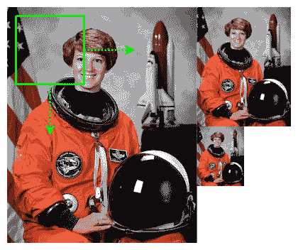
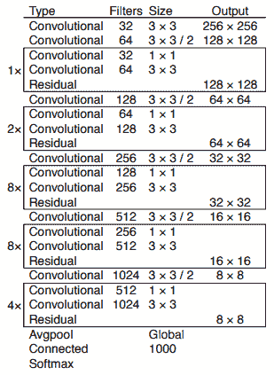
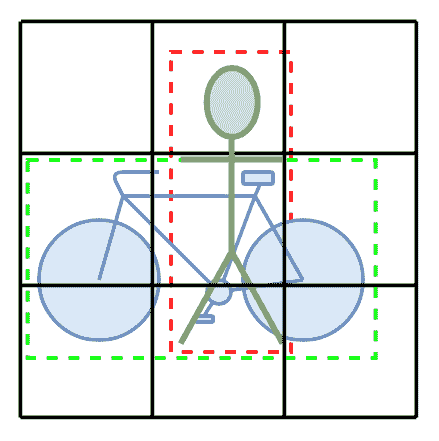
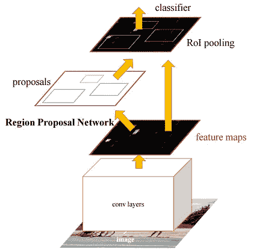
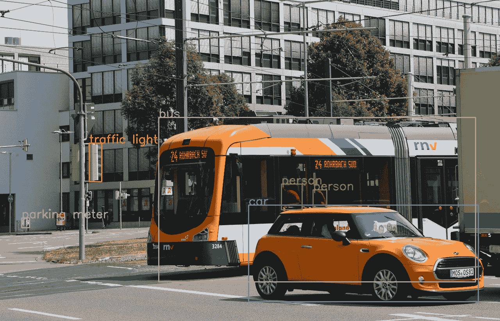
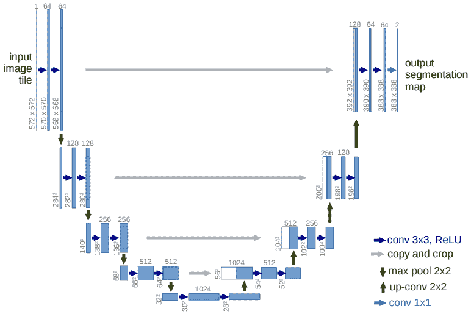
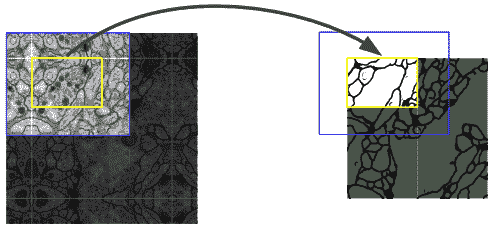
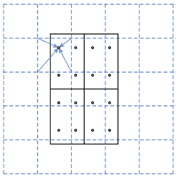

# 物体检测与图像分割

在第三章《高级卷积网络》中，我们讨论了一些最受欢迎且性能最佳的**卷积神经网络**（**CNN**）模型。为了专注于每个网络的架构细节，我们以分类问题为背景来查看这些模型。在计算机视觉任务的世界里，分类相对简单，因为它给图像分配一个标签。在本章中，我们将焦点转向两个更有趣的计算机视觉任务——物体检测和语义分割，而网络架构则会退居其次。我们可以说，这些任务比分类更复杂，因为模型需要对图像有更全面的理解。它必须能够检测不同的物体以及它们在图像中的位置。同时，任务的复杂性也为更具创意的解决方案提供了空间。在本章中，我们将讨论其中的一些。

本章将涵盖以下主题：

+   物体检测介绍：

+   物体检测方法

+   YOLO

+   Faster R-CNN

+   图像分割：

+   U-Net

+   Mask R-CNN

# 物体检测介绍

物体检测是找到某个类别物体实例的过程，比如人脸、汽车和树木，适用于图像或视频。与分类不同，物体检测可以检测多个物体及其在图像中的位置。

物体检测器将返回一个已检测物体的列表，并为每个物体提供以下信息：

+   物体的类别（人、车、树等）。

+   [0, 1] 范围内的概率（或置信度分数），表示检测器对物体在该位置存在的信心。这类似于常规分类器的输出。

+   图像中物体所在矩形区域的坐标。这个矩形称为**边界框**。

我们可以在下面的照片中看到物体检测算法的典型输出。每个边界框上方显示了物体类型和置信度分数：


物体检测器的输出

接下来，让我们概述一下不同的物体检测任务解决方法。

# 物体检测方法

在本节中，我们将概述三种方法：

+   **经典滑动窗口**：在这里，我们将使用常规的分类网络（分类器）。这种方法可以与任何类型的分类算法配合使用，但它相对较慢且容易出错：

    1.  构建图像金字塔：这是同一图像的不同尺度的组合（参见下图）。例如，每个缩放后的图像可以比前一个小两倍。通过这种方式，我们将能够检测到无论大小如何的物体。

    1.  将分类器滑动整个图像：也就是说，我们将图像的每个位置作为分类器的输入，结果将决定该位置的物体类型。该位置的边界框就是我们用作输入的图像区域。

    1.  对于每个物体，我们将有多个重叠的边界框：我们将使用一些启发式方法将它们合并成一个单一的预测结果。

这是滑动窗口方法的示意图：



滑动窗口加图像金字塔物体检测

+   **两阶段检测方法**：这些方法非常精确，但相对较慢。顾名思义，它们涉及两个步骤：

    1.  一种特殊类型的 CNN，称为**区域建议网络**（**RPN**），扫描图像并提出若干可能的边界框或兴趣区域（**RoI**），这些区域可能包含物体。然而，这个网络并不检测物体的类型，而仅仅判断区域内是否存在物体。

    1.  感兴趣的区域会被送到第二阶段进行物体分类，该阶段确定每个边界框中的实际物体。

+   **一阶段**（**或一击式**）**检测方法**：在这种方法中，单个 CNN 同时输出物体类型和边界框。这些方法通常速度较快，但相较于两阶段方法，精度较低。

在下一节中，我们将介绍 YOLO——一种精确而高效的一阶段检测算法。

# 使用 YOLOv3 进行物体检测

在这一节中，我们将讨论一种最受欢迎的检测算法，称为 YOLO。这个名字是流行格言**you only live once**的缩写，反映了该算法的一阶段特性。作者已经发布了三版该算法，随着版本的更新逐步改进。我们将仅讨论最新版本 v3（更多详情，请参见*YOLOv3: An Incremental Improvement*，[`arxiv.org/abs/1804.02767`](https://arxiv.org/abs/1804.02767)）。

该算法从所谓的**主干**网络**Darknet-53**开始（根据卷积层的数量命名）。它经过训练以对 ImageNet 数据集进行分类，类似于第三章中的网络，*高级卷积神经网络*。它是完全卷积的（没有池化层），并使用残差连接。

下图展示了主干网络架构：



Darknet-53 模型（来源：[`arxiv.org/abs/1804.02767`](https://arxiv.org/abs/1804.02767)）

一旦网络训练完成，它将作为后续目标检测训练阶段的基础。这是特征提取迁移学习的一个例子，我们在第二章中描述了这一过程，*理解卷积神经网络*。主干的全连接层将被新的随机初始化的卷积层和全连接层替换。新的全连接层将仅通过一次传递输出所有检测到的物体的边界框、物体类别和置信度得分。

例如，本节开始时行人在人行道上的图像中的边界框是通过单次网络传递生成的。YOLOv3 在三种不同的尺度上预测边界框。该系统使用类似于特征金字塔网络的概念从这些尺度中提取特征（有关更多信息，请参见*特征金字塔网络用于目标检测*，[`arxiv.org/abs/1612.03144`](https://arxiv.org/abs/1612.03144)）。在检测阶段，网络使用常见的上下文对象进行训练（*Microsoft COCO: 常见上下文中的对象*，[`arxiv.org/abs/1405.0312`](https://arxiv.org/abs/1405.0312)，[`cocodataset.org`](http://cocodataset.org)）目标检测数据集。

接下来，让我们看看 YOLO 是如何工作的：

1.  将图像分割成*S×S*单元格（在下图中，我们可以看到一个 3×3 的网格）：

    +   网络将每个网格单元的中心视为该区域的中心，其中可能会有一个物体。

    +   一个物体可能完全位于一个单元格内。那么，它的边界框将小于该单元格。或者，它可以跨越多个单元格，边界框会更大。YOLO 涵盖了这两种情况。

    +   该算法可以借助**锚框**（稍后详细介绍）在一个网格单元中检测多个物体，但每个物体只与一个单元格相关联（一个一对*n*的关系）。也就是说，如果物体的边界框覆盖了多个单元格，我们会将该物体与边界框中心所在的单元格关联。例如，以下图中的两个物体跨越了多个单元格，但它们都分配给了中心单元格，因为它们的边界框中心位于该单元格中。

    +   一些单元格可能包含物体，其他的则可能没有。我们只关心那些包含物体的单元格。

下图显示了一个 3×3 单元格网格，包含 2 个物体及其边界框（虚线）。这两个物体都与中间的单元格相关联，因为它们的边界框中心位于该单元格内：



一个目标检测的 YOLO 示例，使用 3x3 的单元格网格和 2 个物体

1.  网络将为每个网格单元输出多个可能的检测对象。例如，如果网格是 3×3，那么输出将包含 9 个可能的检测对象。为了清晰起见，我们先讨论单个网格单元/检测对象的输出数据（及其相应标签）。它是一个数组，包含值 *[b[x], b[y], b[h], b[w], p[c], c[1], c[2], ..., c[n]]*，其中各个值的含义如下：

    +   *b[x], b[y], b[h], b[w]* 描述了对象的边界框。如果存在对象，那么 *b[x]* 和 *b[y]* 是框的中心坐标。它们在 [0, 1] 范围内相对于图像的大小进行归一化。也就是说，如果图像的大小是 100 x 100，而 *b[x] = 20* 和 *b[y] = 50*，那么它们的归一化值将是 0.2 和 0.5。基本上，*b[h]* 和 *b[w]* 代表框的高度和宽度。它们相对于网格单元进行归一化。如果边界框大于单元格，则其值将大于 1。预测框的参数是一个回归任务。

    +   *p[c]* 是一个置信度分数，范围为 [0, 1]。置信度分数的标签要么为 0（不存在），要么为 1（存在），因此这部分输出是一个分类任务。如果对象不存在，我们可以丢弃数组中的其他值。

    +   *c[1], c[2], ..., c[n]* 是对象类别的独热编码。例如，如果我们有汽车、行人、树木、猫和狗这几类，并且当前对象是猫类，那么它的编码将是 *[0, 0, 0, 1, 0]*。如果我们有 *n* 个可能的类别，则每个单元格输出数组的大小将是 *5 + n* （在我们的例子中是 9）。

网络输出/标签将包含 *S×S* 这样的数组。例如，对于一个 3×3 单元格网格和四个类别，YOLO 输出的长度将是 *3*3*9 = 81*。

1.  让我们来看一下同一单元格中有多个对象的情况。幸运的是，YOLO 提出了一个优雅的解决方案。每个单元格将与多个候选框（称为**锚框**或先验框）关联，每个锚框具有略微不同的形状。在下面的图示中，我们可以看到网格单元（方形，实线）和两个锚框——竖直的和水平的（虚线）。如果一个单元格内有多个对象，我们将把每个对象与其中一个锚框关联。相反，如果一个锚框没有关联对象，它的置信度分数将为零。这个安排也将改变网络的输出。每个网格单元将有多个输出数组（每个锚框一个输出数组）。为了扩展我们之前的例子，假设我们有一个 *3×3* 的单元格网格，4 个类别，并且每个单元格有 2 个锚框。那么我们将有 *3*3*2 = 18* 个输出边界框，总输出长度为 *3*3*2*9 = 162*。由于我们有固定数量的单元格 (*S×S*) 和每个单元格固定数量的锚框，因此网络输出的大小不会因检测到的对象数量而变化。相反，输出将指示对象是否存在于所有可能的锚框中。

在下面的图示中，我们可以看到一个网格单元格和两个锚框：


网格单元格（方形，未中断的线）和两个锚框（虚线）

现在唯一的问题是如何在训练过程中选择物体的正确锚框（在推理过程中，网络会自己选择）。我们将通过**交并比**（**IoU**）来完成这个任务。这只是物体边界框/锚框的交集面积与它们的并集面积之间的比率：


交并比

我们将比较每个物体的边界框与所有锚框，并将物体分配给 IoU 最高的锚框。由于锚框具有不同的大小和形状，IoU 保证物体将被分配给最符合其在图像上足迹的锚框。

1.  现在我们（希望）已经了解 YOLO 是如何工作的，我们可以用它来进行预测。然而，网络的输出可能会很嘈杂——也就是说，输出包括每个单元格的所有可能的锚框，无论其中是否存在物体。许多框会重叠，并且实际上预测相同的物体。我们将通过**非极大值抑制**来去除噪声。它是这样工作的：

    1.  丢弃所有置信度得分小于或等于 0.6 的边界框。

    1.  从剩余的边界框中，选择具有最高置信度得分的框。

    1.  丢弃与我们在上一步中选择的框的 IoU >= 0.5 的任何框。

如果你担心网络输出/真实值数据会变得过于复杂或庞大，别担心。卷积神经网络（CNN）在 ImageNet 数据集上表现良好，该数据集有 1,000 个类别，因此有 1,000 个输出。

想了解更多关于 YOLO 的信息，请查阅原始的系列论文：

+   *你只看一次：统一的实时物体检测*（[`arxiv.org/abs/1506.02640`](https://arxiv.org/abs/1506.02640)），由 Joseph Redmon、Santosh Divvala、Ross Girshick 和 Ali Farhadi 提出

+   *YOLO9000：更好、更快、更强*（[`arxiv.org/abs/1612.08242`](https://arxiv.org/abs/1612.08242)），由 Joseph Redmon 和 Ali Farhadi 提出

+   *YOLOv3：一种增量改进*（[`arxiv.org/abs/1804.02767`](https://arxiv.org/abs/1804.02767)），由 Joseph Redmon 和 Ali Farhadi 提出

现在我们已经介绍了 YOLO 算法的理论，在接下来的部分，我们将讨论如何在实际中使用它。

# 使用 OpenCV 的 YOLOv3 代码示例

在本节中，我们将演示如何使用 YOLOv3 物体检测器与 OpenCV。对于这个示例，你需要`opencv-python` 4.1.1 或更高版本，并且需要 250MB 的磁盘空间来存储预训练的 YOLO 网络。让我们从以下步骤开始：

1.  从导入开始：

```py
import os.path

import cv2  # opencv import
import numpy as np
import requests
```

1.  添加一些模板代码，用于下载和存储多个配置和数据文件。我们从 YOLOv3 网络配置`yolo_config`和`weights`开始，并用它们初始化`net`网络。我们将使用 YOLO 作者的 GitHub 和个人网站来完成这一步：

```py
# Download YOLO net config file
# We'll it from the YOLO author's github repo
yolo_config = 'yolov3.cfg'
if not os.path.isfile(yolo_config):
   url = 'https://raw.githubusercontent.com/pjreddie/darknet/master/cfg/yolov3.cfg'
    r = requests.get(url)
    with open(yolo_config, 'wb') as f:
        f.write(r.content)

# Download YOLO net weights
# We'll it from the YOLO author's website
yolo_weights = 'yolov3.weights'
if not os.path.isfile(yolo_weights):
    url = 'https://pjreddie.com/media/files/yolov3.weights'
    r = requests.get(url)
    with open(yolo_weights, 'wb') as f:
        f.write(r.content)

# load the network
net = cv2.dnn.readNet(yolo_weights, yolo_config)
```

1.  接下来，我们将下载网络可以检测的 COCO 数据集类别的名称。我们还将从文件中加载它们。COCO 论文中展示的数据集包含 91 个类别。然而，网站上的数据集仅包含 80 个类别。YOLO 使用的是 80 类别版本：

```py
# Download class names file
# Contains the names of the classes the network can detect
classes_file = 'coco.names'
if not os.path.isfile(classes_file):
    url = 'https://raw.githubusercontent.com/pjreddie/darknet/master/data/coco.names'
    r = requests.get(url)
    with open(classes_file, 'wb') as f:
        f.write(r.content)

# load class names
with open(classes_file, 'r') as f:
    classes = [line.strip() for line in f.readlines()]
```

1.  然后，从 Wikipedia 下载一张测试图像。我们还将从文件中加载图像到`blob`变量中：

```py
# Download object detection image
image_file = 'source_1.png'
if not os.path.isfile(image_file):
    url = "https://github.com/ivan-vasilev/advanced-deep-learning-with-python/blob/master/chapter04-detection-segmentation/source_1.png"
    r = requests.get(url)
    with open(image_file, 'wb') as f:
        f.write(r.content)

# read and normalize image
image = cv2.imread(image_file)
blob = cv2.dnn.blobFromImage(image, 1 / 255, (416, 416), (0, 0, 0), True, crop=False)
```

1.  将图像输入网络并进行推理：

```py
# set as input to the net
net.setInput(blob)

# get network output layers
layer_names = net.getLayerNames()
output_layers = [layer_names[i[0] - 1] for i in net.getUnconnectedOutLayers()]

# inference
# the network outputs multiple lists of anchor boxes,
# one for each detected class
outs = net.forward(output_layers)
```

1.  遍历类别和锚框，并为下一步做好准备：

```py
# extract bounding boxes
class_ids = list()
confidences = list()
boxes = list()

# iterate over all classes
for out in outs:
    # iterate over the anchor boxes for each class
    for detection in out:
        # bounding box
        center_x = int(detection[0] * image.shape[1])
        center_y = int(detection[1] * image.shape[0])
        w, h = int(detection[2] * image.shape[1]), int(detection[3] * image.shape[0])
        x, y = center_x - w // 2, center_y - h // 2
        boxes.append([x, y, w, h])

        # confidence
        confidences.append(float(detection[4]))

        # class
        class_ids.append(np.argmax(detection[5:]))
```

1.  使用非最大抑制去除噪声。你可以尝试不同的`score_threshold`和`nms_threshold`值，看看检测到的物体是如何变化的：

```py
# non-max suppression
ids = cv2.dnn.NMSBoxes(boxes, confidences, score_threshold=0.75, nms_threshold=0.5)
```

1.  在图像上绘制边界框及其标签：

```py
for i in ids:
    i = i[0]
    x, y, w, h = boxes[i]
    class_id = class_ids[i]

    color = colors[class_id]

    cv2.rectangle(img=image,
                  pt1=(round(x), round(y)),
                  pt2=(round(x + w), round(y + h)),
                  color=color,
                  thickness=3)

    cv2.putText(img=image,
                text=f"{classes[class_id]}: {confidences[i]:.2f}",
                org=(x - 10, y - 10),
                fontFace=cv2.FONT_HERSHEY_SIMPLEX,
                fontScale=0.8,
                color=color,
                thickness=2)
```

1.  最后，我们可以使用以下代码显示检测到的物体：

```py
cv2.imshow("Object detection", image)
cv2.waitKey()
```

如果一切顺利，这段代码将生成与我们在*目标检测介绍*部分开始时看到的相同图像。

这就是我们关于 YOLO 的讨论。在下一部分，我们将介绍一种名为 Faster R-CNN 的两阶段目标检测器（R-CNN 代表区域与 CNN）。

# Faster R-CNN 的目标检测

在这一部分，我们将讨论一种名为 Faster R-CNN 的两阶段目标检测算法（*Faster R-CNN: Towards Real-Time Object Detection with Region Proposal Networks*，[`arxiv.org/abs/1506.01497`](https://arxiv.org/abs/1506.01497)）。它是早期两阶段检测器 Fast R-CNN（[`arxiv.org/abs/1504.08083`](https://arxiv.org/abs/1504.08083)）和 R-CNN（*Rich feature hierarchies for accurate object detection and semantic segmentation*，[`arxiv.org/abs/1311.2524`](https://arxiv.org/abs/1311.2524)）的演变。

我们将首先概述 Faster R-CNN 的一般结构，如下图所示：



Faster R-CNN 的结构；来源： [`arxiv.org/abs/1506.01497`](https://arxiv.org/abs/1506.01497)

在我们解释算法时，请记住这个图。像 YOLO 一样，Faster R-CNN 从在 ImageNet 上训练的主干分类网络开始，作为模型各个模块的基础。论文的作者使用了 VGG16 和 ZF 网络（*Visualizing and Understanding Convolutional Networks*，[`cs.nyu.edu/~fergus/papers/zeilerECCV2014.pdf`](https://cs.nyu.edu/~fergus/papers/zeilerECCV2014.pdf)）作为主干。然而，近期的实现使用了更现代的架构，如 ResNets。主干网络作为模型的两个其他组件——**区域提议网络**（**RPN**）和检测网络的支撑部分。在下一部分，我们将讨论 RPN。

# 区域提议网络

在第一阶段，RPN 接收一张图像（任意大小）作为输入，并输出一组矩形兴趣区域（RoIs），其中可能包含物体。RPN 本身是通过提取主干模型的前* p *（VGG 的情况下是 13，ZF 网是 5）卷积层创建的（见前图）。一旦输入图像传播到最后的共享卷积层，算法就会获取该层的特征图，并在每个特征图位置滑动另一个小网络。小网络输出在每个位置上的*k*锚框中是否存在物体（锚框的概念与 YOLO 中相同）。这一概念在下图的左侧图像中得以体现，显示了 RPN 在最后一个卷积层的单个特征图上滑动的一个位置：


左：RPN 提议在单个位置上的结果；右：使用 RPN 提议的检测示例（标签经过人工增强）。来源：[`arxiv.org/abs/1506.01497`](https://arxiv.org/abs/1506.01497)

小网络与所有输入特征图上同一位置的*n×n*区域完全连接（根据论文，*n = 3*）。例如，如果最后的卷积层有 512 个特征图，那么在某个位置的小网络输入大小就是 512 x 3 x 3 = 4,608。每个滑动窗口被映射到一个低维（VGG 为 512，ZF 网为 256）的向量。这个向量本身作为输入，传递给以下两个并行的全连接层：

1.  一个分类层，包含*2k*单元，组织为*k* 2 单元的二元 softmax 输出。每个 softmax 的输出表示该物体是否位于每个*k*锚框中的置信度分数。论文将置信度分数称为**物体性（objectness）**，它衡量锚框的内容是否属于一组物体，而非背景。在训练过程中，物体会根据 IoU 公式分配给锚框，这与 YOLO 中的方法相同。

1.  一个回归层，包含* 4k *单元，组织为*k* 4 单元的 RoI 坐标。4 个单元中的 2 个表示相对于整张图像的 RoI 中心坐标，范围为[0:1]。另外两个坐标表示区域的高度和宽度，相对于整张图像（同样类似于 YOLO）。

论文的作者实验了三种尺度和三种纵横比，结果在每个位置上得到了九个可能的锚框。最终特征图的典型 H×W 大小约为 2,400，这就导致了 2,400*9 = 21,600 个锚框。

理论上，我们将小网络滑动到最后一个卷积层的特征图上。然而，小网络的权重在所有位置上是共享的。因此，滑动操作可以实现为跨通道卷积。因此，网络可以在一次图像传递中对所有锚框进行输出。这相对于 Fast R-CNN 是一个改进，后者需要为每个锚框进行单独的网络传递。

RPN 通过反向传播和随机梯度下降进行训练（多么令人惊讶！）。共享的卷积层以主干网络的权重初始化，其余层随机初始化。每个小批量的样本来自单一图像，该图像包含许多正样本（物体）和负样本（背景）锚框。两种样本之间的采样比例为 1:1。每个锚框都会被分配一个二进制类别标签（表示是否为物体）。有两种带有正标签的锚框：与一个真实框（groundtruth）具有最大 IoU 重叠的锚框，或与任意真实框的 IoU 重叠大于 0.7 的锚框。如果锚框的 IoU 比率低于 0.3，则该框被分配为负标签。既不是正样本也不是负样本的锚框不会参与训练。

由于 RPN 有两个输出层（分类和回归），因此训练使用以下复合成本函数：


让我们详细讨论一下：

+   *i* 是小批量中锚框的索引。

+   *p[i]* 是分类输出，表示锚框 *i* 是物体的预测概率。注意 *p[i]^** 是相同的目标数据（0 或 1）。

+   *t[i]* 是大小为 4 的回归输出向量，表示 RoI 参数。与 YOLO 一样， *t[i]^** 是相同的目标向量。

+   *L[cls]* 是分类层的交叉熵损失。*N[cls]* 是一个归一化项，等于小批量的大小。

+   *L[reg]* 是回归损失。，其中 R 是平均绝对误差（请参阅第一章中的*成本函数*部分，*神经网络的基本原理*）。 *N[reg]* 是一个归一化项，等于锚框位置的总数（大约 2400 个）。

最后，分类和回归的成本函数部分通过*λ*参数结合。由于*N[reg]* ~ 2400 和 *N[cls]* = 256，*λ* 被设定为 10，以保持两者损失之间的平衡。

# 检测网络

现在我们已经讨论了 RPN，让我们聚焦于检测网络。为了做到这一点，我们将回到*Faster R-CNN 结构*的图示，这在*使用 Faster R-CNN 进行目标检测*部分的开头。让我们回顾一下，在第一阶段，RPN 已经生成了 RoI 坐标。检测网络是一个常规的分类器，它决定当前 RoI 中的物体类型（或背景）。RPN 和检测网络共享它们的第一个卷积层，这些层是从主干网络借用的。但检测网络还结合了来自 RPN 的提议区域，以及最后一个共享层的特征图。

那么我们如何将输入组合起来呢？我们可以借助**感兴趣区域**（**RoI**）最大池化来实现，这是检测网络第二部分的第一层。这个操作的一个示例如下图所示：


*2×2*的 RoI 最大池化示例，使用 10×7 的特征图和一个 5×5 的兴趣区域（蓝色矩形）

为了简化起见，我们假设有一个单一的*10×7*特征图和一个单一的 RoI。正如我们在*区域提议网络*部分学到的那样，RoI 由其坐标、宽度和高度定义。该操作将这些参数转换为特征图上的实际坐标。在此示例中，区域大小为*h×w = 5×5*。RoI 最大池化进一步由其输出高度*H*和宽度*W*定义。在这个例子中，*H×W = 2×2*，但在实际应用中，这些值可能会更大，如 7×7。该操作将*h×w*的 RoI 划分为一个网格，网格的大小为(*h / H)×(w / W)*子区域。

正如我们从示例中看到的，子区域可能具有不同的大小。一旦完成，每个子区域将通过获取该区域的最大值，降采样为单个输出单元。换句话说，RoI 池化可以将任意大小的输入转换为固定大小的输出窗口。通过这种方式，转化后的数据可以以一致的格式在网络中传播。

正如我们在*使用 Faster R-CNN 进行目标检测*部分中提到的，RPN 和检测网络共享它们的初始层。然而，它们一开始是独立的网络。训练过程在两者之间交替进行，按照四步流程进行：

1.  训练 RPN，初始化时使用骨干网络的 ImageNet 权重。

1.  训练检测网络，使用从*步骤 1*中训练好的 RPN 提议。训练也从 ImageNet 骨干网络的权重开始。此时，两个网络并不共享权重。

1.  使用检测网络的共享层来初始化 RPN 的权重。然后，再次训练 RPN，但冻结共享层，只微调 RPN 特定的层。此时，两个网络共享权重。

1.  通过冻结共享层，仅微调检测网络特定层来训练检测网络。

现在我们已经介绍了 Faster R-CNN，在接下来的章节中，我们将讨论如何在实际中使用它，借助预训练的 PyTorch 模型。

# 使用 PyTorch 实现 Faster R-CNN

在本节中，我们将使用一个预训练的 PyTorch Faster R-CNN，搭载 ResNet50 骨干网络进行目标检测。此示例需要 PyTorch 1.3.1、`torchvision` 0.4.2 和`python-opencv` 4.1.1：

1.  我们将从导入开始：

```py
import os.path

import cv2
import numpy as np
import requests
import torchvision
import torchvision.transforms as transforms
```

1.  接下来，我们将继续下载输入图像，并定义 COCO 数据集中的类别名称。这个步骤与我们在 *YOLOv3 与 OpenCV 的代码示例* 部分实现的相同。下载的图像路径存储在 `image_file = 'source_2.png'` 变量中，类别名称存储在 `classes` 列表中。该实现使用了完整的 91 个 COCO 类别。

1.  我们将加载预训练的 Faster R-CNN 模型，并将其设置为评估模式：

```py
# load the pytorch model
model = torchvision.models.detection.fasterrcnn_resnet50_fpn(pretrained=True)

# set the model in evaluation mode
model.eval()
```

1.  然后，我们将使用 OpenCV 读取图像文件：

```py
img = cv2.imread(image_file)
```

1.  我们将定义 PyTorch `transform` 序列，将图像转换为 PyTorch 兼容的张量，并将其传递给网络。网络的输出存储在 `output` 变量中。正如我们在 *区域提议网络* 部分讨论的，`output` 包含三个部分：`boxes` 是边界框参数，`classes` 是物体类别，`scores` 是置信度分数。模型内部应用了 NMS，因此代码中无需再执行此操作：

```py
transform = transforms.Compose([transforms.ToPILImage(), transforms.ToTensor()])
nn_input = transform(img)
output = model([nn_input])
```

1.  在我们继续展示检测到的物体之前，我们将为 COCO 数据集的每个类别定义一组随机颜色：

```py
colors = np.random.uniform(0, 255, size=(len(classes), 3))
```

1.  我们遍历每个边界框，并将其绘制在图像上：

```py
# iterate over the network output for all boxes
for box, box_class, score in zip(output[0]['boxes'].detach().numpy(),
                                 output[0]['labels'].detach().numpy(),
                                 output[0]['scores'].detach().numpy()):

    # filter the boxes by score
    if score > 0.5:
        # transform bounding box format
        box = [(box[0], box[1]), (box[2], box[3])]

        # select class color
        color = colors[box_class]

        # extract class name
        class_name = classes[box_class]

        # draw the bounding box
        cv2.rectangle(img=img, pt1=box[0], pt2=box[1], color=color, thickness=2)

        # display the box class label
        cv2.putText(img=img, text=class_name, org=box[0], 
                    fontFace=cv2.FONT_HERSHEY_SIMPLEX, fontScale=1, color=color, thickness=2)
```

绘制边界框涉及以下步骤：

+   过滤掉置信度低于 0.5 的框，以防止出现噪声检测。

+   边界框 `box` 参数（从 `output['boxes']` 提取）包含图像中边界框的左上角和右下角的绝对（像素）坐标。它们只是以元组的形式转换，以适应 OpenCV 格式。

+   提取类别名称和边界框的颜色。

+   绘制边界框和类别名称。

1.  最后，我们可以使用以下代码显示检测结果：

```py
cv2.imshow("Object detection", image)
cv2.waitKey()
```

这段代码将产生以下结果（公交车上的乘客也被检测到）：



Faster R-CNN 物体检测

本节关于物体检测的内容已结束。总结来说，我们讨论了两种最流行的检测模型——YOLO 和 Faster R-CNN。在下一部分，我们将讨论图像分割——你可以将它视为像素级别的分类。

# 引入图像分割

图像分割是将一个类标签（如人、车或树）分配给图像的每个像素的过程。你可以将其视为分类，但它是在像素级别——而不是对整个图像进行分类，而是单独对每个像素进行分类。图像分割有两种类型：

+   **语义分割**：这为每个像素分配一个类别，但不会区分物体实例。例如，下面截图中的中间图像显示了一个语义分割掩码，其中每个车辆的像素值相同。语义分割可以告诉我们某个像素是车辆的一部分，但不能区分两辆车。

+   **实例分割**：这为每个像素分配一个类别，并区分物体实例。例如，以下截图右侧的图像展示了一个实例分割掩码，其中每辆车被分割为一个独立的物体。

以下截图展示了语义分割和实例分割的示例：


左侧：输入图像；中间：语义分割；右侧：实例分割；来源： http://sceneparsing.csail.mit.edu/

要训练一个分割算法，我们需要一种特殊类型的真实数据，其中每张图像的标签是图像的分割版本。

最简单的图像分割方法是使用我们在*目标检测方法*部分中描述的滑动窗口技术。也就是说，我们将使用常规分类器，并以步幅为 1 的方式在任意方向滑动它。在我们得到某个位置的预测后，我们会取输入区域中间的像素，并将其分配给预测类别。可以预见，这种方法非常慢，因为图像中像素的数量非常庞大（即使是 1024×1024 的图像，也有超过 100 万个像素）。幸运的是，已经有更快且更准确的算法，我们将在接下来的部分讨论这些算法。

# 使用 U-Net 进行语义分割

我们将讨论的第一种分割方法叫做 U-Net（*U-Net: 用于生物医学图像分割的卷积网络*，[`arxiv.org/abs/1505.04597`](https://arxiv.org/abs/1505.04597)）。这个名字来源于网络架构的可视化。U-Net 是一种**全卷积网络**（**FCN**），之所以叫这个名字，是因为它只包含卷积层，没有全连接层。FCN 将整张图像作为输入，并在一次传递中输出其分割图。我们可以将 FCN 分为两个虚拟组件（实际上这只是一个网络）：

+   编码器是网络的第一部分。它类似于常规的卷积神经网络（CNN），只是最后没有全连接层。编码器的作用是学习输入图像的高度抽象表示（这里没有什么新东西）。

+   解码器是网络的第二部分。它在编码器之后开始，并使用编码器的输出作为输入。解码器的作用是将这些抽象表示转换为分割的真实数据。为此，解码器使用与编码器操作相反的操作。这包括转置卷积（卷积的相反操作）和反池化（池化的相反操作）。

介绍完这些，接下来是 U-Net 的全部精华：



U-Net 架构；来源： https://arxiv.org/abs/1505.04597

每个蓝色框表示一个多通道特征图。框上方表示通道数量，框的左下角表示特征图的大小。白色框表示复制的特征图。箭头表示不同的操作（图例中也有显示）。*U*的左侧是编码器，右侧是解码器。

接下来，让我们来分割（理解了吗？）U-Net 模块：

+   **编码器**：网络以一个 572×572 的 RGB 图像作为输入。从这里开始，它像一个常规的卷积神经网络（CNN），交替进行卷积和最大池化层操作。编码器由以下四个模块组成。

    +   两个连续的跨通道未填充 3×3 卷积，步幅为 1。

    +   一个 2×2 的最大池化层。

    +   ReLU 激活。

    +   每个下采样步骤都会将特征图的数量翻倍。

    +   最后的编码器卷积结束时得到 1,024 个 28×28 的特征图。

+   **解码器**：它与编码器对称。解码器以最内层的 28×28 特征图作为输入，并同时进行上采样，将其转换为一个 388×388 的分割图。它包含四个上采样模块：

    +   上采样通过 2×2 的转置卷积（步幅为 2）进行（第二章*，理解卷积网络*），用绿色垂直箭头表示。

    +   每个上采样步骤的输出与对应编码器步骤的裁剪高分辨率特征图进行拼接（灰色水平箭头）。裁剪是必要的，因为每个卷积步骤都会丢失边缘像素。

    +   每个转置卷积后面跟着两个常规卷积，用于平滑扩展后的图像。

    +   上采样步骤将特征图的数量减半。最终输出使用 1×1 瓶颈卷积将 64 个分量的特征图张量映射到所需的类别数量。论文的作者展示了细胞医学图像的二分类分割。

    +   网络输出是对每个像素的 softmax 运算。也就是说，输出包含与像素数量相同的独立 softmax 运算。一个像素的 softmax 输出决定了该像素的类别。U-Net 的训练方式与常规分类网络相同。然而，损失函数是所有像素的 softmax 输出的交叉熵损失的组合。

我们可以看到，由于网络有效（未填充）卷积的作用，输出的分割图像比输入图像要小（388 对 572）。然而，输出图像并不是输入图像的缩放版本。相反，它与输入图像具有一对一的尺度，但仅覆盖输入图像的中央部分。

这在下图中有所示意：



一种用于分割大图像的重叠拼块策略；来源：[`arxiv.org/abs/1505.04597`](https://arxiv.org/abs/1505.04597)

必须使用无填充卷积，以避免网络在分割图的边缘产生噪声伪影。这使得能够使用所谓的重叠瓦片策略对任意大小的图像进行分割。输入图像被分割成重叠的输入瓦片，就像前面图示中左侧的瓦片一样。右侧图像中小的光亮区域的分割图需要左侧图像中大的光亮区域（一个瓦片）作为输入。

下一个输入瓦片与前一个瓦片重叠，使得它们的分割图覆盖图像的相邻区域。为了预测图像边缘区域的像素，通过镜像输入图像来推算缺失的上下文。在下一部分中，我们将讨论 Mask R-CNN——一个扩展 Faster R-CNN 用于实例分割的模型。

# 使用 Mask R-CNN 进行实例分割

Mask R-CNN ([`arxiv.org/abs/1703.06870`](https://arxiv.org/abs/1703.06870)) 是 Faster R-CNN 在实例分割上的扩展。Faster R-CNN 为每个候选对象输出两个结果：边界框参数和类别标签。除了这些，Mask R-CNN 增加了第三个输出——一个全卷积网络（FCN），为每个 RoI 生成二值分割掩码。下图展示了 Mask R-CNN 的结构：


Mask R-CNN

RPN 在五种尺度和三种长宽比下生成锚框。分割和分类路径都使用 RPN 的 RoI 预测，但它们之间是独立的。分割路径为每个 *I* 类生成 *I* *m×m* 二值分割掩码。在训练或推理时，仅考虑与分类路径预测的类别相关的掩码，其他掩码会被丢弃。类别预测和分割是并行且解耦的——分类路径预测分割对象的类别，而分割路径则确定掩码。

Mask R-CNN 用更精确的 RoI 对齐层替代了 RoI 最大池化操作。RPN 输出锚框中心及其高度和宽度，作为四个浮动点数值。然后，RoI 池化层将这些数值转换为整数特征图单元格坐标（量化）。此外，RoI 被划分为 *H×W* 个 bins，也涉及到量化问题。来自 *使用 Faster R-CNN 进行物体检测* 部分的 RoI 示例展示了这些 bins 大小不同（3×3、3×2、2×3、2×2）。这两种量化级别可能会导致 RoI 与提取特征之间的错位。下图展示了 RoI 对齐如何解决这个问题：



RoI 对齐示例；来源：[`arxiv.org/abs/1703.06870`](https://arxiv.org/abs/1703.06870)

虚线代表特征图的单元格。中间实线区域是一个 2×2 的 RoI，叠加在特征图上。请注意，它并没有完全匹配单元格，而是根据 RPN 预测的位置没有量化。以相同的方式，RoI 的一个单元（黑点）并不匹配特征图的某个特定单元。RoI 对齐操作通过双线性插值计算 RoI 单元的值，从而比 RoI 池化更加精确。

在训练中，如果 RoI 与一个真实框的交并比（IoU）至少为 0.5，则该 RoI 被分配为正标签，否则为负标签。掩码目标是 RoI 与其关联的真实掩码的交集。只有正 RoI 参与分割路径的训练。

# 使用 PyTorch 实现 Mask R-CNN

在这一部分，我们将使用一个具有 ResNet50 主干的预训练 PyTorch Mask R-CNN 进行实例分割。此示例需要 PyTorch 1.1.0、torchvision 0.3.0 和 OpenCV 3.4.2。本示例与我们在 *使用 PyTorch 实现 Faster R-CNN* 部分中实现的示例非常相似。因此，为了避免重复，我们将省略一些代码部分。开始吧：

1.  导入、`classes` 和 `image_file` 与 Faster R-CNN 示例相同。

1.  这两个示例之间的第一个区别是我们将加载 Mask R-CNN 预训练模型：

```py
model = torchvision.models.detection.maskrcnn_resnet50_fpn(pretrained=True)
model.eval()
```

1.  我们将输入图像传递给网络并获得 `output` 变量：

```py
# read the image file
img = cv2.imread(image_file)

# transform the input to tensor
transform = transforms.Compose([transforms.ToPILImage(), transforms.ToTensor()])
nn_input = transform(img)
output = model([nn_input])
```

除了 `boxes`、`classes` 和 `scores`，`output` 还包含一个额外的 `masks` 组件，用于预测的分割掩码。

1.  我们遍历掩码并将其叠加到图像上。图像和掩码是 `numpy` 数组，我们可以将叠加操作实现为向量化操作。我们将显示边界框和分割掩码：

```py
# iterate over the network output for all boxes
for mask, box, score in zip(output[0]['masks'].detach().numpy(),
                            output[0]['boxes'].detach().numpy(),
                            output[0]['scores'].detach().numpy()):

    # filter the boxes by score
    if score > 0.5:
        # transform bounding box format
        box = [(box[0], box[1]), (box[2], box[3])]

        # overlay the segmentation mask on the image with random color
        img[(mask > 0.5).squeeze(), :] = np.random.uniform(0, 255, size=3)

        # draw the bounding box
        cv2.rectangle(img=img,
                      pt1=box[0],
                      pt2=box[1],
                      color=(255, 255, 255),
                      thickness=2)
```

1.  最后，我们可以如下显示分割结果：

```py
cv2.imshow("Object detection", img)
cv2.waitKey()
```

这个示例将产生右侧的图像，如下所示（左侧的原始图像用于比较）：


Mask R-CNN 实例分割

我们可以看到每个分割掩码只在其边界框内定义，所有掩码的值都大于零。为了获得属于物体的实际像素，我们只对分割置信度得分大于 0.5 的像素应用掩码（这段代码是 Mask R-CNN 代码示例中的第 4 步的一部分）：

```py
img[(mask > 0.5).squeeze(), :] = np.random.uniform(0, 255, size=3)
```

这就结束了本章关于图像分割的部分（事实上，也结束了整章内容）。

# 总结

在本章中，我们讨论了目标检测和图像分割。我们从单次检测算法 YOLO 开始，然后继续讨论了两阶段的 Faster R-CNN 算法。接下来，我们讨论了语义分割网络架构 U-Net。最后，我们谈到了 Mask R-CNN —— Faster R-CNN 的扩展，用于实例分割。

在下一章，我们将探讨一种新的机器学习算法类型，称为生成模型。我们可以利用它们生成新的内容，如图像。敬请期待——这将会很有趣！
