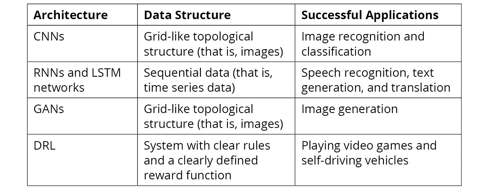
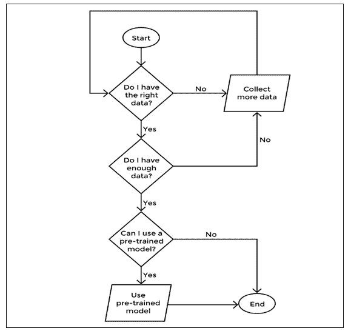
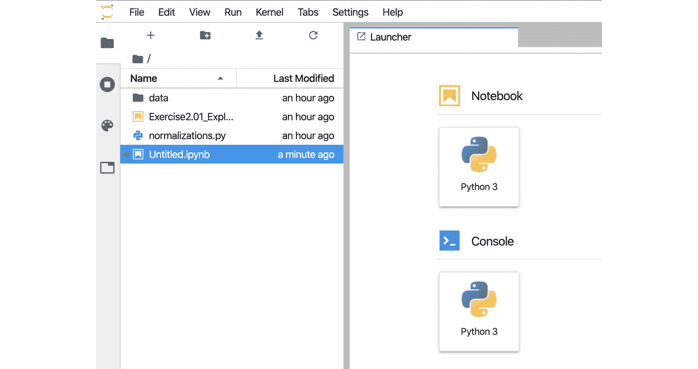
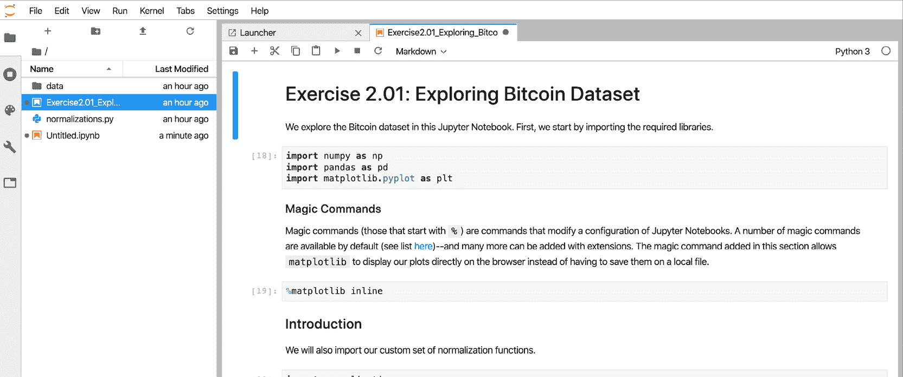
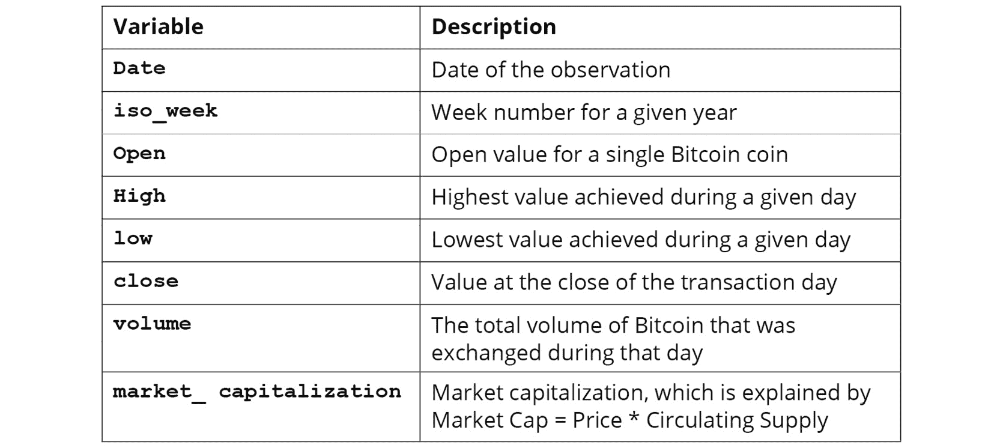
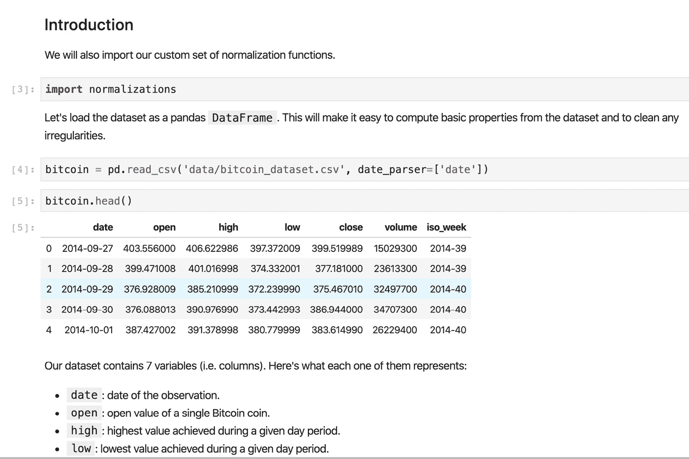
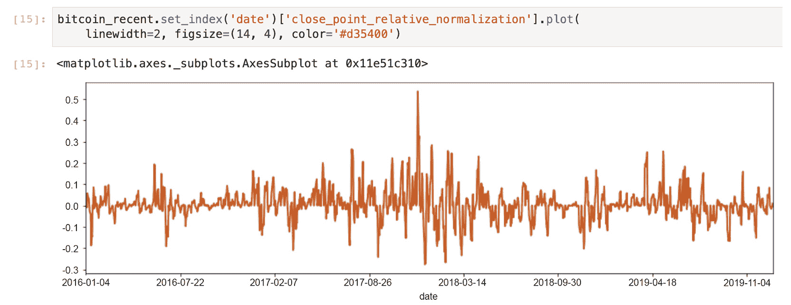
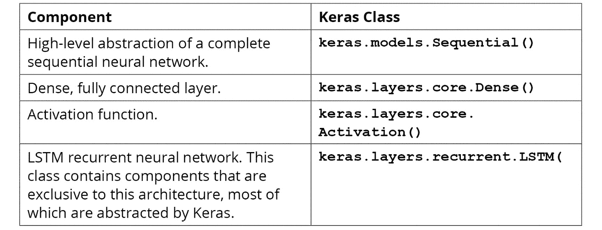
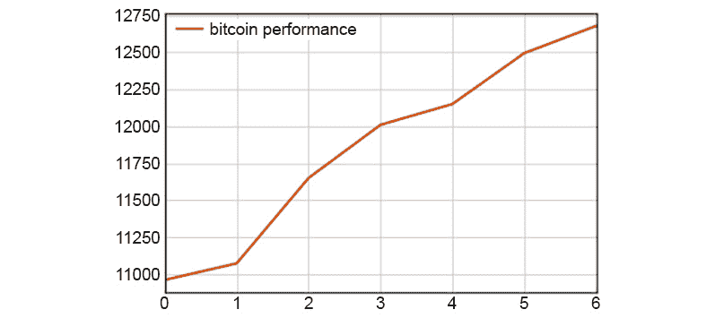

# 2\. 实际深度学习：预测比特币价格

概述

本章将帮助您为深度学习模型准备数据，选择合适的模型架构，使用 Keras——TensorFlow 2.0 的默认 API，并用训练好的模型进行预测。到本章结束时，您将准备好一个模型以进行预测，我们将在接下来的章节中探索它。

# 引言

在*第一章*，*神经网络和深度学习简介*的基本概念基础上，现在让我们移步到一个实际情景，并确定我们是否能够构建一个预测比特币价格的深度学习模型。

我们将学习为深度学习模型准备数据的原则，以及如何选择合适的模型架构。我们将使用 Keras——TensorFlow 2.0 的默认 API，并用训练好的模型进行预测。我们将通过将所有这些组件放在一起并构建一个简陋但完整的深度学习应用的第一个版本来结束本章。

深度学习是一个正在经历激烈研究活动的领域。研究人员致力于发明新的神经网络架构，可以解决新问题或提高先前实现的架构的性能。

在本章中，我们将研究旧和新的架构。旧的架构已经被用来解决各种问题，并且通常被认为是开始新项目时的正确选择。新的架构在特定问题上显示了巨大的成功，但很难一般化。后者作为下一步探索的参考是有趣的，但在开始项目时很难是一个好选择。

以下主题讨论了这些架构的细节以及如何确定特定问题陈述的最佳架构。

# 选择合适的模型架构

考虑到可用的架构可能性，有两种流行的架构通常被用作多个应用的起点：**卷积神经网络**（**CNNs**）和**循环神经网络**（**RNNs**）。这些是基础网络，应该被视为大多数项目的起点。

我们还介绍了其他三种网络的描述，因为它们在领域中的相关性：**长短期记忆**（**LSTM**）网络（一种 RNN 变体）；**生成对抗网络**（**GANs**）；以及**深度强化学习**（**DRL**）。这些后者在解决当代问题上取得了巨大成功，但使用起来略显困难。接下来的部分将涵盖在不同问题中使用不同类型架构的情况。

## 卷积神经网络（CNNs）

CNNs 因处理具有网格结构的问题而声名鹊起。最初它们被创建用于分类图像，但已被用于多个其他领域，从语音识别到自动驾驶车辆。

CNN 的核心理念是将紧密相关的数据作为训练过程的元素，而不仅仅是单独的数据输入。在图像处理的背景下，这一思想尤为有效，因为位于中心的像素与其右侧和左侧的像素相关联。**卷积**（convolution）这一名称被用来表示以下过程的数学形式：


图 2.1：卷积过程的示意图

注

图像来源：Volodymyr Mnih，*等人*

您可以在以下链接找到这张图像：[`packt.live/3fivWLB`](https://packt.live/3fivWLB)

欲了解更多有关深度强化学习的信息，请参考*通过深度强化学习实现人类级别的控制*。*2015 年 2 月*，*Nature*，可在[`storage.googleapis.com/deepmind-media/dqn/DQNNaturePaper.pdf`](https://storage.googleapis.com/deepmind-media/dqn/DQNNaturePaper.pdf)获取。

## 循环神经网络（RNN）

CNN 使用一组输入，这些输入不断调整网络相应层和节点的权重和偏置。这种方法的已知局限性在于，当确定网络权重和偏置的变化时，它的架构忽略了这些输入的顺序。

RNN 的出现正是为了解决这一问题。它们被设计用于处理顺序数据。这意味着在每一个时期（epoch），层次结构可以受到前一层输出的影响。在每个序列中的前期观测记忆在后期观测的评估中起着重要作用。

由于语音识别问题的顺序性，RNN（循环神经网络）在该领域得到了成功应用。此外，RNN 也被用于翻译问题。Google Translate 当前的算法——Transformer，使用 RNN 将文本从一种语言翻译到另一种语言。在 2018 年底，Google 推出了另一种基于 Transformer 算法的算法，称为**双向编码器表示（Bidirectional Encoder Representations from Transformers）**（**BERT**），它目前是**自然语言处理**（**NLP**）领域的最先进技术。

注

欲了解更多关于 RNN 应用的信息，请参考以下内容：

*Transformer：一种用于语言理解的全新神经网络架构*，*Jakob Uszkoreit*，*Google Research Blog*，*2017 年 8 月*，可在[`ai.googleblog.com/2017/08/transformer-novel-neural-network.html`](https://ai.googleblog.com/2017/08/transformer-novel-neural-network.html)获取。

*BERT：开源 BERT：自然语言处理的最先进预训练技术*，可在[`ai.googleblog.com/2018/11/open-sourcing-bert-state-of-art-pre.html`](https://ai.googleblog.com/2018/11/open-sourcing-bert-state-of-art-pre.html)获取。

以下图表展示了英语单词与法语单词如何根据它们在句子中的位置关联。RNN 在语言翻译问题中非常受欢迎：


图 2.2：distill.pub 中的插图，展示了英语和法语单词的关联

注意

图片来源：[`distill.pub/2016/augmented-rnns/`](https://distill.pub/2016/augmented-rnns/)

## 长短期记忆（LSTM）网络

**LSTM**网络是 RNN 的变体，用于解决梯度消失问题。该问题是由于与当前步骤相距过远的记忆组件所导致，它们由于距离较远而接收到较低的权重。LSTM 是 RNN 的一种变体，包含一个叫做**遗忘门**的记忆组件。该组件可以用来评估最近的和较早的元素如何影响权重和偏置，具体取决于观察值在序列中的位置。

注意

LSTM 架构最早由 Sepp Hochreiter 和 Jürgen Schmidhuber 于 1997 年提出。目前的实现已做了若干修改。如需详细了解 LSTM 每个组件的数学原理，请参考 Christopher Olah 的文章*理解 LSTM 网络*，2015 年 8 月，文章可通过以下链接获取：[`colah.github.io/posts/2015-08-Understanding-LSTMs/`](https://colah.github.io/posts/2015-08-Understanding-LSTMs/)。

## 生成对抗网络

**生成对抗网络**（**GANs**）由 Ian Goodfellow 及其同事于 2014 年在蒙特利尔大学发明。GAN 的工作原理是，通过一个神经网络优化权重和偏置，以最小化其误差，而不是仅有一个神经网络优化权重和偏置，应该有两个神经网络互相竞争完成这一目标。

注意

如需了解有关 GAN 的更多信息，请参考*生成对抗网络*，*Ian Goodfellow 等人*，*arXiv*，*2014 年 6 月 10 日*，可通过以下链接获取：[`arxiv.org/pdf/1406.2661.pdf`](https://arxiv.org/pdf/1406.2661.pdf)。

GANs 生成新的数据（*伪*数据）和一个评估第一个网络生成的数据是否为*真实*或*伪*的网络。它们相互竞争，因为它们都在学习：一个学习如何更好地生成*伪*数据，另一个学习如何区分数据是否真实。它们在每个迭代周期中反复训练，直到收敛。那时，评估生成数据的网络无法再区分*伪*数据和*真实*数据。

GANs 已在数据具有明确拓扑结构的领域成功应用。最初，GAN 被用来生成与真实图像相似的物体、人物面孔和动物的合成图像。你将在接下来的图像中看到，在**StarGAN**项目中，面部表情发生了变化：


图 2.3：基于情感的面部变化，使用 GAN 算法

这是图像创建领域中 GAN 使用最为频繁的地方，但在其他领域也偶尔能在研究论文中看到其应用。

注意

图像来源：StarGAN 项目， 可在[`github.com/yunjey/StarGAN`](https://github.com/yunjey/StarGAN)查阅。

## 深度强化学习（DRL）

原始的深度强化学习（DRL）架构由 DeepMind 提出，DeepMind 是一个总部位于英国的 Google 拥有的人工智能研究机构。DRL 网络的核心思想是它们本质上是无监督的，通过试验和错误来学习，只优化奖励函数。

也就是说，DRL 网络与其他网络不同（后者使用监督方法来优化与已知正确结果相比的错误预测），DRL 网络并不知道解决问题的正确方法。它们只是被给定一个系统的规则，然后每当它们正确执行一个功能时，都会得到奖励。这个过程需要大量的迭代，最终训练网络在多个任务上表现出色。

注意

欲了解更多关于 DRL 的信息，请参阅*Human-Level Control through Deep Reinforcement Learning*，*Volodymyr Mnih 等*，*2015 年 2 月*，*Nature*，可在以下网址查阅：[`storage.googleapis.com/deepmind-media/dqn/DQNNaturePaper.pdf`](https://storage.googleapis.com/deepmind-media/dqn/DQNNaturePaper.pdf)。

DRL 模型在 DeepMind 创建了 AlphaGo（一个比职业玩家更擅长围棋的系统）之后获得了广泛关注。DeepMind 还创建了 DRL 网络，使其能够独立地以超人类水平学习玩视频游戏。

注意

想了解更多关于 DQN 的信息，可以查阅 DeepMind 创建的 DQN，它能够击败 Atari 游戏。该算法使用 DRL 解决方案不断提高奖励。

图像来源：[`keon.io/deep-q-learning/`](https://keon.io/deep-q-learning/)。

以下是神经网络架构及其应用的总结：



图 2.4：不同的神经网络架构、数据结构及其成功应用

## 数据归一化

在构建深度学习模型之前，数据归一化是一个重要的步骤。数据归一化是机器学习系统中的常见做法。对于神经网络，研究人员提出归一化是训练 RNN（和 LSTM）时的一个关键技术，主要是因为它可以减少网络的训练时间，并提高网络的整体性能。

注意

欲了解更多信息，请参阅*Batch Normalization: Accelerating Deep Network Training by Reducing Internal Covariate Shift*，*Sergey Ioffe 等*，*arXiv*，2015 年 3 月， 可在[`arxiv.org/abs/1502.03167`](https://arxiv.org/abs/1502.03167)查阅。

哪种归一化技术最有效取决于数据和所处理的问题。以下是一些常用的技术：

### Z-Score

当数据呈正态分布（即，高斯分布）时，你可以计算每个观察值与其均值的标准差距离。这种归一化方法在识别数据点距离分布中更可能出现的情况有多远时非常有用。Z 分数的定义如下公式：


图 2.5: Z 分数公式

这里，*x*i 是第*i*个观察值，是均值，是序列的标准差。

注意

欲了解更多信息，请参阅标准分数文章（*Z 分数：定义、公式与计算*），该文章可在[`www.statisticshowto.datasciencecentral.com/probability-and-statistics/z-score/`](https://www.statisticshowto.datasciencecentral.com/probability-and-statistics/z-score/)上找到。

### 点相对归一化

这种归一化方法计算给定观察值与序列第一个观察值之间的差异。这种归一化方法有助于识别与起始点相关的趋势。点相对归一化的定义为：


图 2.6: 点相对归一化公式

这里，*o*i 是第*i*个观察值，*o*o 是序列的第一个观察值。

注意

欲了解更多关于预测的信息，请观看*如何轻松预测股票价格 – 深度学习入门 #7*，*Siraj Raval*，可以在 YouTube 上找到，链接：[`www.youtube.com/watch?v=ftMq5ps503w`](https://www.youtube.com/watch?v=ftMq5ps503w)。

### 最大值和最小值归一化

这种归一化方法计算给定观察值与序列中最大值和最小值之间的距离。当处理最大值和最小值不是异常值且对未来预测非常重要的序列时，这种方法非常有用。这种归一化技术可以使用以下公式应用：


图 2.7: 归一化计算公式

这里，*O*i 是第*i*个观察值，*O*代表包含所有*O*值的向量，*min(O)*和*max(O)*函数分别代表序列的最小值和最大值。

在*练习* *2.01*，*探索比特币数据集并为模型准备数据*中，我们将准备可用的比特币数据，以便用于我们的 LSTM 模型。这包括选择感兴趣的变量，选择相关的时间段，并应用前述的点相对归一化技术。

# 结构化你的问题

与研究人员相比，实践者在开始一个新的深度学习项目时，花在选择架构上的时间要少得多。获取能够正确代表给定问题的数据是开发这些系统时最重要的因素，其次是理解数据集的固有偏差和限制。当开始开发深度学习系统时，可以考虑以下反思问题：

+   我是否拥有正确的数据？这是训练深度学习模型时最具挑战性的问题。首先，用数学规则定义你的问题。使用精确的定义，并将问题组织为类别（分类问题）或连续的量表（回归问题）。现在，如何收集与这些度量标准相关的数据？

+   我有足够的数据吗？通常，深度学习算法在大数据集上的表现远优于小数据集。了解训练一个高性能算法所需的数据量取决于你试图解决的问题类型，但应尽可能收集尽可能多的数据。

+   我能使用预训练模型吗？如果你正在解决的问题是更一般应用的一个子集，但仍然属于相同领域，考虑使用预训练模型。预训练模型可以帮助你迅速识别问题的特定模式，而不是广泛领域中的一般特征。一个好的起点是官方的 TensorFlow 代码库（[`github.com/tensorflow/models`](https://github.com/tensorflow/models)）。

当你用这些问题来构建你的问题时，你将对任何新的深度学习项目采用一种顺序化的方法。以下是这些问题和任务的代表性流程图：



图 2.8：深度学习项目开始时需要问的关键反思问题的决策树

在某些情况下，数据可能根本无法获取。根据具体情况，可能可以使用一系列技术有效地从输入数据中生成更多数据。这个过程被称为**数据增强**，在图像识别问题中应用得非常成功。

注意

一个好的参考是文章 *使用深度神经网络分类浮游生物*，可以在[`benanne.github.io/2015/03/17/plankton.html`](https://benanne.github.io/2015/03/17/plankton.html)找到。作者展示了一系列增强少量图像数据的技术，以增加模型的训练样本数量。

一旦问题结构清晰，你就可以开始准备模型。

## Jupyter Notebook

在本节中，我们将使用 Jupyter Notebook 进行编码。Jupyter Notebook 提供通过 web 浏览器进行 Python 会话的功能，让您可以交互式地处理数据。它们是探索数据集的热门工具，将在本书的练习中使用。

## 练习 2.01：探索比特币数据集并为模型准备数据

在本次练习中，我们将准备数据，然后将其传递给模型。准备好的数据将在本章的后续部分有助于进行预测。在准备数据之前，我们将对其进行一些可视化分析，例如查看比特币的价值何时达到最高，以及下降何时开始。

注意

我们将使用一个原本从 Yahoo Finance 网站获取的公共数据集 ([`finance.yahoo.com/quote/BTC-USD/history/`](https://finance.yahoo.com/quote/BTC-USD/history/))。该数据集经过轻微修改，并且与本章一起提供，之后会在本书的其余部分使用。

数据集可以从以下网址下载：[`packt.live/2Zgmm6r`](https://packt.live/2Zgmm6r)。

以下是完成此练习的步骤：

1.  使用您的终端，导航到 `Chapter02/Exercise2.01` 目录。激活在上一章创建的环境，并执行以下命令以启动 Jupyter Notebook 实例：

    ```
    $ jupyter notebook
    ```

    这应该会自动在您的浏览器中打开 Jupyter Lab 服务器。从那里您可以启动 Jupyter Notebook。

    您应该会看到以下输出或类似内容：

    

    图 2.9: 启动 Jupyter Lab 实例后的终端图片

1.  选择 `Exercise2.01_Exploring_Bitcoin_Dataset.ipynb` 文件。这是一个 Jupyter Notebook 文件，将在新的浏览器标签页中打开。应用程序将自动为您启动一个新的 Python 交互式会话：

    图 2.10: Jupyter Notebook 实例的登录页面

1.  点击 Jupyter Notebook 文件：

    图 2.11: Jupyter Notebook 图片

1.  打开我们的 Jupyter Notebook，考虑本章提供的比特币数据集。数据集 `data/bitcoin_historical_prices.csv` ([`packt.live/2Zgmm6r`](https://packt.live/2Zgmm6r)) 包含了自 2013 年初以来的比特币价格详情。它包含八个变量，其中两个（`date` 和 `week`）描述数据的时间周期。它们可以作为索引使用——其余六个（`open`、`high`、`low`、`close`、`volume` 和 `market_capitalization`）可以用来理解比特币价格和价值随时间的变化：

    图 2.12: 比特币历史价格数据集中的可用变量（即列）

1.  使用打开的 Jupyter Notebook 实例，考虑这两个变量的时间序列：`close`和`volume`。从这些时间序列开始，探索价格波动模式，也就是比特币在历史数据中不同时间段的价格变化情况。

1.  导航到打开的 Jupyter Notebook 实例，`Exercise2.01_Exploring_Bitcoin_Dataset.ipynb`。现在，执行`Introduction`标题下的所有单元格。这将导入所需的库，并将数据集导入到内存中：

    图 2.13：笔记本中第一个单元格的输出，比特币收盘价时间序列图（来自 close 变量）

1.  数据集加载到内存后，转到`探索`部分。你会找到一段代码，可以生成`close`变量的时间序列图：

    ```
    bitcoin.set_index('date')['close'].plot(linewidth=2, \
                                            figsize=(14, 4),\
                                            color='#d35400')
    #plt.plot(bitcoin['date'], bitcoin['close'])
    ```

    输出如下：

    

    图 2.14：比特币收盘价时间序列图（来自 close 变量）

1.  在下面的一个新单元格中，使用`volume`变量重新生成该图。你肯定已经注意到，比特币价格变量在 2017 年暴涨，随后开始下跌：

    ```
    bitcoin.set_index('date')['volume'].plot(linewidth=2, \
                                             figsize=(14, 4), \
                                             color='#d35400')
    ```

    

    ](img/B15911_02_15.jpg)

    图 2.15：比特币每日交易量总和

    *图 2.15* 显示自 2017 年以来，比特币交易在市场中显著增加。每日交易量的变化比每日收盘价的变化大得多。

1.  执行探索部分的其余单元格，探索 2017 年至 2018 年的范围。

    近年来，比特币价格波动已变得越来越常见。虽然这些时期可以被神经网络用于理解某些模式，但我们将排除较旧的观测数据，因为我们关注的是预测未来不久的价格。因此，只过滤 2016 年后的数据。导航到`为模型准备数据集`部分，使用 pandas API 来过滤数据。Pandas 提供了一个直观的 API 来执行此操作。

1.  提取最新数据并将其保存到一个变量中：

    ```
    bitcoin_recent = bitcoin[bitcoin['date'] >= '2016-01-04']
    ```

    `bitcoin_recent`变量现在包含我们原始的比特币数据集副本，但仅保留 2016 年 1 月 4 日及以后的数据。

    使用*数据归一化*部分中描述的点相对归一化技术对数据进行归一化。你只需归一化两个变量——`close`和`volume`——因为这两个是我们要预测的变量。

1.  运行笔记本中的下一个单元格，以确保我们只保留 close 和 volume 变量。

    在包含此章节的同一目录中，我们放置了一个名为`normalizations.py`的脚本。该脚本包含了本章描述的三种归一化技术。我们将该脚本导入到 Jupyter Notebook 中，并将函数应用于我们的数据系列。

1.  导航到`Preparing Dataset for a Model`部分。现在，使用`iso_week`变量，利用 pandas 的`groupby()`方法将每日观测按周分组。我们现在可以直接对该周的数据系列应用归一化函数`normalizations.point_relative_normalization()`。我们可以使用以下代码将归一化后的输出作为新变量存储在同一个 pandas DataFrame 中：

    ```
    bitcoin_recent['close_point_relative_normalization'] = \
    bitcoin_recent.groupby('iso_week')['close']\
    .apply(lambda x: normalizations.point_relative_normalization(x))
    ```

1.  `close_point_relative_normalization`变量现在包含了`close`变量的归一化数据：

    ```
    bitcoin_recent.set_index('date')\
    ['close_point_relative_normalization'].plot(linewidth=2, \
                                                figsize=(14,4), \
                                                color='#d35400')
    ```

    这将导致以下输出：

    

    图 2.16：Jupyter Notebook 的图像，聚焦于应用归一化函数的部分

1.  对`volume`变量（`volume_point_relative_normalization`）执行相同操作。归一化后的`close`变量每周都包含一个有趣的方差模式。我们将使用这个变量来训练我们的 LSTM 模型：

    ```
    bitcoin_recent.set_index('date')\
                            ['volume_point_relative_normalization'].\
                            plot(linewidth=2, \
                            figsize=(14,4), \
                            color='#d35400')
    ```

    你的输出应如下所示。

    

    图 2.17：显示归一化变量系列的图表

1.  为了评估模型的表现，你需要测试其与其他数据的准确性。通过创建两个数据集来实现这一点：一个训练集和一个测试集。你将使用数据集的 90％来训练 LSTM 模型，10％来评估模型的表现。由于数据是连续的并且以时间序列的形式存在，因此使用最后 10％的可用周作为测试集，前 90％作为训练集：

    ```
    boundary = int(0.9 * bitcoin_recent['iso_week'].nunique())
    train_set_weeks = bitcoin_recent['iso_week'].unique()[0:boundary]
    test_set_weeks = bitcoin_recent[~bitcoin_recent['iso_week']\
                     .isin(train_set_weeks)]['iso_week'].unique()
    test_set_weeks
    train_set_weeks
    ```

    这将显示以下输出：

    

    图 2.18：测试集周的输出

    

    图 2.19：使用周数创建训练集

1.  为每个操作创建单独的数据集：

    ```
    train_dataset = bitcoin_recent[bitcoin_recent['iso_week']\
                                                 .isin(train_set_weeks)]
    test_dataset = bitcoin_recent[bitcoin_recent['iso_week'].\
                                                isin(test_set_weeks)]
    ```

1.  最后，导航到`Storing Output`部分，并将筛选后的变量保存到磁盘，如下所示：

    ```
    test_dataset.to_csv('data/test_dataset.csv', index=False)
    train_dataset.to_csv('data/train_dataset.csv', index=False)
    bitcoin_recent.to_csv('data/bitcoin_recent.csv', index=False)
    ```

    注意

    要访问此特定部分的源代码，请参考[`packt.live/3ehbgCi`](https://packt.live/3ehbgCi)。

    你也可以在线运行这个示例，网址是[`packt.live/2ZdGq9s`](https://packt.live/2ZdGq9s)。你必须执行整个 Notebook 才能获得期望的结果。

在本次练习中，我们探索了比特币数据集，并为深度学习模型做好了准备。

我们了解到，2017 年比特币的价格暴涨。这一现象发生得很缓慢，可能受到了许多外部因素的影响，而这些数据本身无法完全解释（例如，其他加密货币的出现）。在 2017 年的暴涨后，我们看到比特币在 2018 年的价值大幅下跌。

我们还使用了点相对归一化技术，将比特币数据集按周进行处理。我们这样做是为了训练一个 LSTM 网络，学习比特币价格变化的周度模式，从而预测未来一整周的价格。

然而，比特币的统计数据显示其价格在周度基础上波动较大。我们能预测比特币未来的价格吗？七天后的价格会是多少？我们将在下一节中使用 Keras 构建一个深度学习模型来探索这些问题。

# 使用 Keras 作为 TensorFlow 接口

我们使用 Keras 是因为它将 TensorFlow 接口简化为通用抽象，并且在 TensorFlow 2.0 中，这是该版本的默认 API。在后台，计算仍然在 TensorFlow 中执行，但我们花费更少的时间关注各个组件，如变量和操作，而更多的时间用来构建作为计算单元的网络。Keras 使得我们可以轻松地实验不同的架构和超参数，更快速地朝着高效的解决方案迈进。

从 TensorFlow 2.0.0 开始，Keras 已正式与 TensorFlow 一起作为 `tf.keras` 进行分发。这意味着 Keras 现在与 TensorFlow 紧密集成，并且可能会继续作为一个开源工具长时间开发。组件是构建模型时的一个重要组成部分。让我们现在深入了解这个概念。

## 模型组件

正如我们在*第一章*《神经网络与深度学习简介》中所看到的，LSTM 网络同样具有输入层、隐藏层和输出层。每个隐藏层都有一个激活函数，用于评估该层相关的权重和偏差。正如预期，网络将数据从一个层顺序地传递到另一个层，并在每次迭代（即一个 epoch）时通过输出评估结果。

Keras 提供了直观的类，表示下表中列出的每个组件：



图 2.20：Keras API 关键组件的描述

我们将使用这些组件来构建深度学习模型。

Keras 的 `keras.models.Sequential()` 组件表示一个完整的顺序神经网络。这个 Python 类可以单独实例化，并可以后续添加其他组件。

我们之所以对构建 LSTM 网络感兴趣，是因为这些网络在处理序列数据时表现优异，而时间序列正是一种序列数据。使用 Keras，完整的 LSTM 网络将如下实现：

```
from tensorflow.keras.models import Sequential
from tensorflow.keras.layers import LSTM
from tensorflow.keras.layers import Dense, Activation
model = Sequential()
model.add(LSTM(units=number_of_periods, \
               input_shape=(period_length, number_of_periods) \
               return_sequences=False), stateful=True)
model.add(Dense(units=period_length)) \
          model.add(Activation("linear"))
model.compile(loss="mse", optimizer="rmsprop")
```

这个实现将在*第三章*，*使用 TensorFlow 和 Keras 进行现实世界深度学习：评估比特币模型*中进一步优化。

Keras 抽象使你能够专注于让深度学习系统更高效的关键元素：确定正确的组件顺序、包括多少层和节点、以及使用哪种激活函数。所有这些选择都是通过将组件添加到实例化的 `keras.models.Sequential()` 类中的顺序，或通过传递给每个组件实例化的参数（例如，`Activation("linear")`）来确定的。最后的 `model.compile()` 步骤使用 TensorFlow 组件构建神经网络。

在网络构建完成后，我们使用 `model.fit()` 方法来训练网络。这将生成一个经过训练的模型，可以用于进行预测：

```
model.fit(X_train, Y_train,
          batch_size=32, epochs=epochs)
```

`X_train` 和 `Y_train` 变量分别是用于训练的集合和用于评估损失函数（即测试网络预测数据的准确性）的小集合。最后，我们可以使用 `model.predict()` 方法进行预测：

```
model.predict(x=X_train)
```

上述步骤涵盖了 Keras 在处理神经网络时的范式。尽管不同的架构可以通过非常不同的方式来处理，Keras 通过使用三个组件——`Network Architecture`、`Fit` 和 `Predict`——简化了与不同架构的交互：


图 2.21：Keras 神经网络范式

Keras 神经网络图包括以下三个步骤：

+   神经网络架构

+   训练神经网络（或 **拟合**）

+   进行预测

Keras 在这些步骤中提供了更大的控制权。然而，它的重点是尽可能简化用户创建神经网络的过程，尽量在最短时间内完成。这意味着我们可以从一个简单的模型开始，然后在每个前面的步骤中增加复杂性，以使初始模型表现得更好。

我们将在接下来的练习和章节中利用这一范式。在下一个练习中，我们将创建一个最简单的 LSTM 网络。然后，在*第三章*，*现实世界中的深度学习：评估比特币模型*中，我们将不断评估和调整该网络，使其更加稳健和高效。

## 练习 2.02：使用 Keras 创建一个 TensorFlow 模型

在这个 Notebook 中，我们使用 Keras 作为 TensorFlow 接口来设计和编译一个深度学习模型。我们将在接下来的章节和练习中继续修改这个模型，通过尝试不同的优化技术来优化它。然而，模型的基本组件完全是在这个 Notebook 中设计的：

1.  打开一个新的 Jupyter Notebook，并导入以下库：

    ```
    import warnings
    warnings.filterwarnings("ignore", category=DeprecationWarning)
    import tensorflow as tf
    from tensorflow import keras
    from tensorflow.keras.models import Sequential
    from tensorflow.keras.layers import LSTM
    from tensorflow.keras.layers import Dense, Activation
    ```

1.  我们的数据集包含每日的观测值，每个观测值会影响未来的观测值。此外，我们的目标是预测未来一周——即 7 天——的比特币价格：

    ```
    period_length = 7
    number_of_periods = 208 - 21 - 1
    number_of_periods
    ```

    我们已根据数据集中可用的周数计算了`number_of_observations`。由于我们将在每个 epoch 使用上周的数据来测试 LSTM 网络，因此我们将使用 208 – 21 – 1。你将得到：

    ```
    186
    ```

1.  使用 Keras 构建 LSTM 模型。我们将批处理大小设为 1，因为我们将整个数据一次性传递。如果数据量很大，我们可以通过多个批次来传递数据，这就是为什么我们使用`batch_input_shape`的原因：

    ```
    def build_model(period_length, number_of_periods, batch_size=1):
        model = Sequential()
        model.add(LSTM(units=period_length,\
                       batch_input_shape=(batch_size, \
                                          number_of_periods, \
                                          period_length),\
                       input_shape=(number_of_periods, \
                                    period_length),\
                       return_sequences=False, stateful=False))
        model.add(Dense(units=period_length))
        model.add(Activation("linear"))
        model.compile(loss="mse", optimizer="rmsprop")
        return model
    ```

    这应该返回一个已经编译的 Keras 模型，可以进行训练并存储到磁盘中。

1.  让我们将模型存储到模型输出的磁盘上：

    ```
    model = build_model(period_length=period_length, \
                        number_of_periods=number_of_periods)
    model.save('bitcoin_lstm_v0.h5')
    ```

    请注意，`bitcoin_lstm_v0.h5`模型尚未训练。当保存一个未经训练的模型时，你实际上只保存了模型的架构。该模型稍后可以通过使用 Keras 的`load_model()`函数加载，如下所示：

    ```
    model = keras.models.load_model('bitcoin_lstm_v0.h5')
    ```

    注意

    要访问该部分的源代码，请参考[`packt.live/38KQI3Y`](https://packt.live/38KQI3Y)。

    你也可以在[`packt.live/3fhEL89`](https://packt.live/3fhEL89)上在线运行此示例。你必须执行整个 Notebook 才能获得预期的结果。

这标志着我们 Keras 模型的创建完成，现在我们可以使用它进行预测。

注意

你在加载 Keras 库时可能会遇到以下警告：

`使用 TensorFlow 后端`

Keras 可以配置为使用 TensorFlow 以外的其他后端（即 Theano）。为了避免出现此消息，你可以创建一个名为`keras.json`的文件，并在那里配置其后端。该文件的正确配置取决于你的系统。因此，建议你访问 Keras 的官方文档[`keras.io/backend/`](https://keras.io/backend/)。

在本节中，我们学习了如何使用 Keras（TensorFlow 的接口）构建一个深度学习模型。我们研究了 Keras 的核心组件，并使用这些组件构建了基于 LSTM 模型的比特币价格预测系统的第一个版本。

在下一部分中，我们将讨论如何将本章中的所有组件整合成一个（几乎完整的）深度学习系统。该系统将产生我们第一个预测，作为未来改进的起点。

# 从数据准备到建模

本节专注于深度学习系统的实现方面。我们将使用*选择正确的模型架构*部分中的比特币数据，以及前一部分*将 Keras 作为 TensorFlow 接口使用*中的 Keras 知识，将这两个组件结合在一起。本节通过构建一个从磁盘读取数据并将其作为一个整体输入到模型中的系统来结束本章。

## 训练神经网络

神经网络可能需要很长时间才能训练。影响训练时间的因素有很多。其中，三个因素通常被认为是最重要的：

+   网络的架构

+   网络的层数和神经元数

+   在训练过程中要使用多少数据

其他因素也可能极大地影响网络训练的时间，但在解决业务问题时，神经网络可以进行大多数优化。

我们将使用前一节中的标准化数据。请记住，我们已将训练数据存储在名为`train_dataset.csv`的文件中。

注意：

您可以通过访问此链接下载训练数据：[`packt.live/2Zgmm6r`](https://packt.live/2Zgmm6r)。

我们将使用`pandas`库将该数据集加载到内存中，以便轻松探索：

```
import pandas as pd
train = pd.read_csv('data/train_dataset.csv')
```

注意

确保根据您下载或保存 CSV 文件的位置更改路径（已突出显示）。

您将看到以下表格形式的输出：


图 2.22：显示训练数据集前五行的表格

我们将使用`close_point_relative_normalization` 变量的系列，这是比特币收盘价从 2016 年初以来的标准化系列——自`close`变量开始。

`close_point_relative_normalization` 变量已按周进行了标准化。每周期内的每个观察值都相对于该期的第一天的收盘价差异进行了。这一标准化步骤很重要，将有助于我们的网络更快地训练：


图 2.23：显示来自标准化变量的系列的图表。

此变量将用于训练我们的 LSTM 模型。

## 重塑时间序列数据

神经网络通常使用向量和张量——这两种数学对象来组织数据在多个维度上。Keras 中实现的每个神经网络都将有一个按照规定组织的向量或张量作为输入。

起初，理解如何将数据重塑为给定层期望的格式可能会令人困惑。为了避免混淆，建议从尽可能少的组件开始，逐渐添加组件。Keras 的官方文档（位于`Layers`部分）对了解每种层的要求至关重要。

注意

Keras 的官方文档可在[`keras.io/layers/core/`](https://keras.io/layers/core/)找到。该链接直接进入了`Layers`部分。

**NumPy** 是一个流行的 Python 库，用于进行数值计算。它被深度学习社区用于操作向量和张量，并为深度学习系统准备数据。

特别是，`numpy.reshape()` 方法在为深度学习模型调整数据时非常重要。该模型允许操作 NumPy 数组，这些数组是 Python 对象，类似于向量和张量。

现在我们将根据 2016 年之后的周次对 `close_point_relative_normalization` 变量中的价格进行组织。我们将创建不同的组，每组包含 7 个观察值（每周一天），总共 208 周完整数据。这样做是因为我们有兴趣预测一周内的交易价格。

注意

我们使用 ISO 标准来确定一周的开始和结束。其他类型的组织方式完全是可能的。这种方法简单直观，但仍有改进的空间。

LSTM 网络处理三维张量。每一个维度代表了网络的一个重要特性。这些维度如下：

+   **周期长度**：周期长度，即一个周期内有多少个观察值

+   **周期数**：数据集中可用的周期数量

+   **特征数**：数据集中可用的特征数量

我们来自 `close_point_relative_normalization` 变量的数据目前是一个一维向量。我们需要将其重塑为匹配这三个维度。

我们将使用一周的周期。因此，我们的周期长度为 7 天（周期长度 = 7）。我们有 208 周完整的周数据可用。在训练期间，我们将使用这些周中的最后一周来测试我们的模型。这使得我们剩下 187 个不同的周。最后，我们将在该网络中使用单个特征（特征数 = 1）；未来版本中我们会加入更多特征。

为了调整数据以匹配这些维度，我们将使用基本的 Python 属性和 `numpy` 库中的 `reshape()` 方法的组合。首先，我们使用纯 Python 创建 186 个包含 7 天的不同周组：

```
group_size = 7
samples = list()
for i in range(0, len(data), group_size):
sample = list(data[i:i + group_size])
         if len(sample) == group_size:samples\
                           .append(np.array(sample)\
                           .reshape(group_size, 1).tolist())
data = np.array(samples)
```

这段代码创建了不同的周组。生成的变量数据是一个包含所有正确维度的变量。

注意

每个 Keras 层将期望其输入以特定的方式组织。然而，在大多数情况下，Keras 会自动调整数据的形状。添加新层之前，请始终参考 Keras 的层文档（[`keras.io/layers/core/`](https://keras.io/layers/core/)）。

Keras LSTM 层期望这些维度按特定顺序组织：特征数、观察数和周期长度。将数据集重塑为匹配该格式：

```
X_train = data[:-1,:].reshape(1, 186, 7)
Y_validation = data[-1].reshape(1, 7)
```

上面的代码片段还选择了我们数据集中最后一周作为验证集（通过 `data[-1]`）。我们将尝试使用前 76 周的数据预测数据集中的最后一周。下一步是使用这些变量来拟合我们的模型：

```
model.fit(x=X_train, y=Y_validation, epochs=100)
```

LSTM 是计算量大的模型。在现代计算机上，它们可能需要多达 5 分钟的时间来训练我们的数据集。大部分时间都花费在计算的开始阶段，此时算法会创建完整的计算图。开始训练后，过程会变得更快：


图 2.24：显示每个时期评估的损失函数结果的图表

注意

这比较了模型在每个时期预测的内容，然后使用称为均方误差的技术将其与真实数据进行比较。该图显示了这些结果。

乍一看，我们的网络表现似乎非常好；它从一个非常小的错误率开始，持续下降。现在我们已经降低了错误率，让我们继续进行一些预测。

## 进行预测

在我们的网络训练完毕后，我们可以开始进行预测。我们将为未来一个超出我们时间范围的周进行预测。

一旦我们使用 `model.fit()` 方法训练了我们的模型，进行预测就很简单了：

```
model.predict(x=X_train)
```

我们使用与训练数据相同的数据进行预测（变量 `X_train`）。如果有更多数据可用，我们可以使用那些数据——前提是将其调整为 LSTM 所需的格式。

### 过拟合

当神经网络在验证集上过拟合时，这意味着它学习了训练集中存在的模式，但无法将其推广到未见过的数据（例如测试集）。在下一章中，我们将学习如何避免过拟合，并创建一个既能评估网络又能提升其性能的系统：



图 2.25：显示比特币每周表现的图表

在上述图中，水平轴表示周数，垂直轴表示比特币的预测表现。现在我们已经探索了数据、准备了模型并学会了如何进行预测，让我们将这些知识付诸实践。

## 活动 2.01：组装一个深度学习系统

在这个活动中，我们将集合所有构建基本深度学习系统的关键部分——数据、模型和预测：

1.  启动 Jupyter Notebook。

1.  将训练数据集加载到内存中。

1.  检查训练集，看看它是否以周期长度、周期数或特征数量的形式呈现。

1.  如果不在所需格式中，将训练集转换。

1.  加载先前训练过的模型。

1.  使用您的训练数据集训练模型。

1.  对训练集进行预测。

1.  对值进行反归一化并保存模型。

最终输出将如下所示，水平轴表示天数，垂直轴表示比特币的价格：

6


图 2.26：预期输出

注意

这个活动的解决方案可以在第 136 页找到。

# 总结

在本章中，我们已经组装了一个完整的深度学习系统，从数据到预测。这个活动中创建的模型在被认为有用之前需要进行多项改进。然而，它作为我们不断改进的一个很好的起点。

下一章将探讨衡量我们模型性能的技术，并继续进行修改，直到我们得到一个既有用又稳健的模型。
