# 数据科学 - 鸟瞰图

数据科学或机器学习是赋予机器从数据集中学习的能力，而无需明确告诉它或进行编程。例如，编写一个程序，能够接受手写数字作为输入图像，并根据图像输出一个 0 到 9 之间的值，这是极其困难的。对于将来来邮件分类为垃圾邮件或非垃圾邮件的任务也是如此。为了解决这些任务，数据科学家使用数据科学或机器学习领域的学习方法和工具，教计算机如何通过一些能区分不同数字的特征自动识别数字。垃圾邮件/非垃圾邮件问题也是如此，我们可以通过特定的学习算法教计算机如何区分垃圾邮件和非垃圾邮件，而不是使用正则表达式并编写成百上千条规则来分类来邮件。

对于垃圾邮件过滤应用，你可以采用基于规则的方法进行编程，但这不足以用于生产环境，比如你的邮件服务器。构建一个学习系统是解决这个问题的理想方案。

你可能每天都在使用数据科学的应用，通常你甚至没有意识到。例如，你的国家可能使用一个系统来检测你寄出的信件的邮政编码，以便自动将其转发到正确的地区。如果你在使用亚马逊，他们通常会为你推荐商品，这通过学习你经常搜索或购买的物品来实现。

构建一个经过学习/训练的机器学习算法需要基于历史数据样本，以便它能够学习如何区分不同的例子，并从这些数据中得出一些知识和趋势。之后，经过学习/训练的算法可以用来对未见过的数据进行预测。学习算法将使用原始的历史数据，并尝试从这些数据中得出一些知识和趋势。

在本章中，我们将从鸟瞰图的角度了解数据科学，了解它如何作为一个黑盒工作，以及数据科学家每天面临的挑战。我们将涵盖以下主题：

+   通过一个例子来理解数据科学

+   数据科学算法设计流程

+   开始学习

+   实现鱼类识别/检测模型

+   不同的学习类型

+   数据规模和行业需求

# 通过一个例子来理解数据科学

为了说明构建针对特定数据的学习算法的生命周期和挑战，假设我们来看一个真实的例子。自然保护协会正在与其他渔业公司和合作伙伴合作，监控渔业活动并保护未来的渔场。因此，他们未来计划使用摄像头来扩大这一监控过程。这些摄像头部署后所产生的数据量将非常庞大，并且手动处理这些数据将非常昂贵。因此，保护协会希望开发一个学习算法，自动检测和分类不同种类的鱼类，以加快视频审核过程。

*图 1.1* 显示了自然保护协会部署的摄像头拍摄的样本图像。这些图像将用于构建系统。

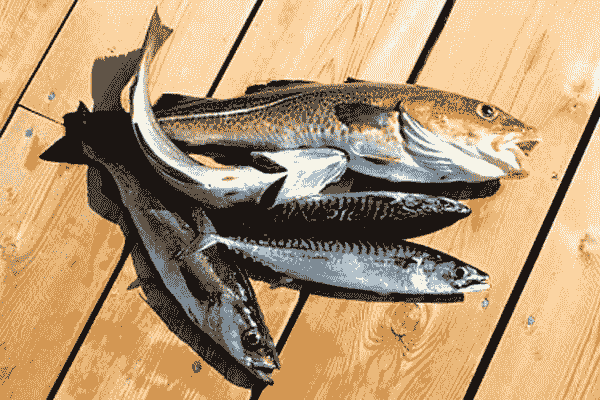

图 1.1：自然保护协会部署的摄像头输出样本

因此，本文的目标是区分渔船捕获的不同物种，如鲔鱼、鲨鱼等。作为一个示例，我们可以将问题限定为仅包含两类：鲔鱼和 Opah 鱼。

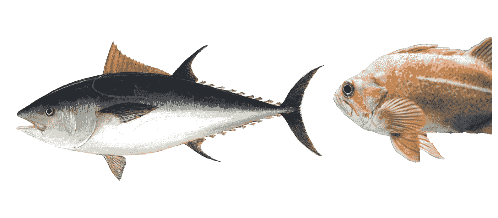

图 1.2：鲔鱼类型（左）与 Opah 鱼类型（右）

在将问题限制为仅包含两种鱼类后，我们可以从我们收集的图像中随机抽取一些样本，并开始注意这两种鱼类之间的一些物理差异。例如，考虑以下物理差异：

+   **长度**：你可以看到，与鲔鱼相比，Opah 鱼更长。

+   **宽度**：Opah 鱼比鲔鱼更宽。

+   **颜色**：你可以看到，Opah 鱼通常更红，而鲔鱼则趋向于蓝色和白色，等等。

我们可以利用这些物理差异作为特征，帮助我们的学习算法（分类器）区分这两种鱼类。

物体的解释性特征是我们日常生活中用来区分周围物体的特征。即使是婴儿，也会使用这些解释性特征来学习周围的环境。数据科学也是如此，为了构建一个可以区分不同物体（例如鱼类种类）的学习模型，我们需要给它一些解释性特征来学习（例如鱼类的长度）。为了使模型更具确定性并减少混淆错误，我们可以在某种程度上增加物体的解释性特征。

由于这两种鱼类之间存在物理差异，这两种不同的鱼群有不同的模型或描述。因此，我们分类任务的最终目标是让分类器学习这些不同的模型，然后将这两种鱼类之一的图像作为输入，分类器将通过选择最符合该图像的模型（鲔鱼模型或 Opah 模型）进行分类。

在这个案例中，金枪鱼和大眼金枪鱼的集合将作为我们分类器的知识库。最初，知识库（训练样本）会被标注/标签化，并且你将事先知道每张图像是金枪鱼还是大眼金枪鱼。所以，分类器将使用这些训练样本来对不同类型的鱼进行建模，然后我们可以使用训练阶段的输出自动标记分类器在训练阶段未见过的未标记/未标签的鱼类数据。这类未标记的数据通常被称为**未见过的** **数据**。生命周期的训练阶段如图所示：

监督学习的数据科学就是从具有已知目标或输出的历史数据中学习，例如鱼的种类，然后使用这个学习到的模型来预测我们不知道目标/输出的数据样本或案例。


图 1.3：训练阶段生命周期

让我们看看分类器的训练阶段如何进行：

+   **预处理**：在这一步，我们将尝试通过使用相关的分割技术将鱼从图像中分割出来。

+   **特征提取**：通过减去背景将鱼从图像中分割出来后，我们将测量每张图像的物理差异（长度、宽度、颜色等）。最终，你将得到类似*图 1.4*的内容。

最后，我们将把这些数据输入分类器，以便对不同的鱼类类型进行建模。

正如我们所看到的，我们可以通过我们提出的物理差异（特征），例如长度、宽度和颜色，来直观地区分金枪鱼和大眼金枪鱼。

我们可以使用长度特征来区分这两种类型的鱼。所以我们可以通过观察鱼的长度并判断它是否超过某个值（`length*`）来尝试区分鱼类。

因此，根据我们的训练样本，我们可以推导出以下规则：

```
If length(fish)> length* then label(fish) = Tuna
Otherwise label(fish) = Opah 
```

为了找到这个`length*`，我们可以通过训练样本来某种方式进行长度测量。所以，假设我们获得这些长度测量值并得到如下的直方图：

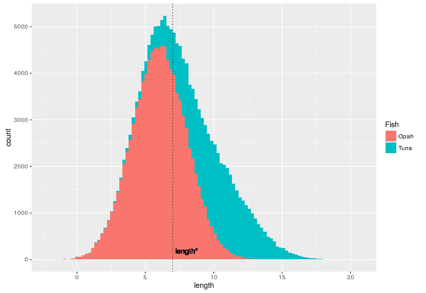

图 1.4：两种类型鱼的长度测量直方图

在这种情况下，我们可以根据长度特征推导出一条规则来区分金枪鱼和大眼金枪鱼。在这个特定的例子中，我们可以得出`length*`为`7`。因此，我们可以更新前面的规则为：

```
If length(fish)> 7 then label(fish) = Tuna
Otherwise label(fish) = Opah
```

正如你可能注意到的，这不是一个有前景的结果，因为两条直方图之间存在重叠，长度特征并不是一个完美的特征，不能单独用于区分这两种类型的鱼。所以我们可以尝试加入更多的特征，比如宽度，然后将它们结合起来。因此，如果我们能够某种方式测量训练样本的宽度，我们可能会得到如下的直方图：

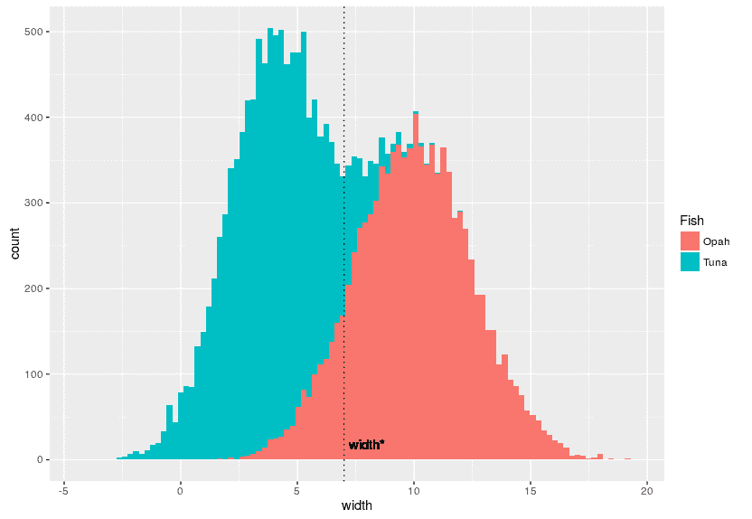

图 5：两种类型鱼的宽度测量直方图

如你所见，仅依赖一个特征不会给出准确的结果，输出模型将会产生大量的误分类。相反，我们可以通过某种方式将两个特征结合起来，得出一个看起来合理的结果。

所以，如果我们将这两个特征结合起来，可能会得到如下图所示的图形：

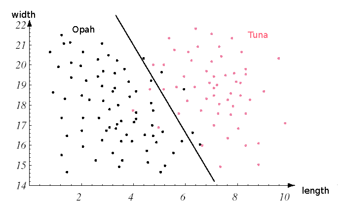

图 1.6：金枪鱼和 Opah 鱼长度与宽度子集的组合

结合**长度**和**宽度**这两个特征的读数，我们将得到类似前面图表中的散点图。我们用红色点表示金枪鱼，用绿色点表示 Opah 鱼，并且可以建议这条黑线是区分两种鱼类的规则或决策边界。

例如，如果某条鱼的读数位于这个决策边界之上，那么它就是金枪鱼；否则，它将被预测为 Opah 鱼。

我们可以通过某种方式尝试增加规则的复杂性，以避免任何错误，并得到如下图所示的决策边界：

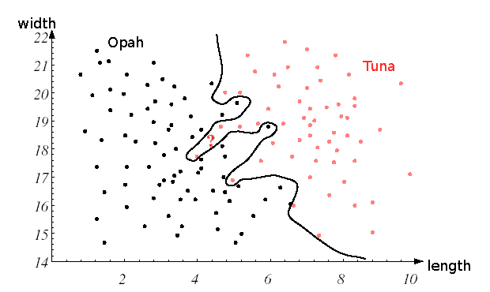

图 1.7：增加决策边界的复杂度，以避免对训练数据的误分类

这个模型的优点是，在训练样本上几乎没有误分类。但实际上，这并不是使用数据科学的目标。数据科学的目标是建立一个能够在未见数据上进行泛化并且表现良好的模型。为了判断我们是否建立了一个能够泛化的模型，我们将引入一个新的阶段，叫做**测试阶段**，在这个阶段，我们会给训练好的模型一个未标记的图像，并期望模型为其分配正确的标签（**金枪鱼**和**Opah 鱼**）。

数据科学的最终目标是建立一个在生产环境中能够良好工作的模型，而不是只在训练集上工作。所以，当你看到你的模型在训练集上表现良好时，不要太高兴，就像图 1.7 中的那样。通常，这种模型在识别图像中的鱼类时会失败。仅在训练集上表现良好的模型被称为**过拟合**，大多数实践者都会陷入这个陷阱。

与其构建如此复杂的模型，不如构建一个更简单的模型，使其能够在测试阶段进行泛化。以下图表展示了使用较简单模型，以减少误分类错误并同时泛化未见数据的情况：

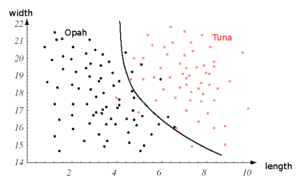

图 1.8：使用更简单的模型，以便能够对测试样本（未见数据）进行泛化

# 数据科学算法的设计流程

不同的学习系统通常遵循相同的设计过程。它们首先获取知识库，从数据中选择相关的解释特征，经过一系列候选学习算法的尝试，并且密切关注每个算法的表现，最后进行评估过程，衡量训练过程的成功与否。

在本节中，我们将更详细地介绍所有这些不同的设计步骤：

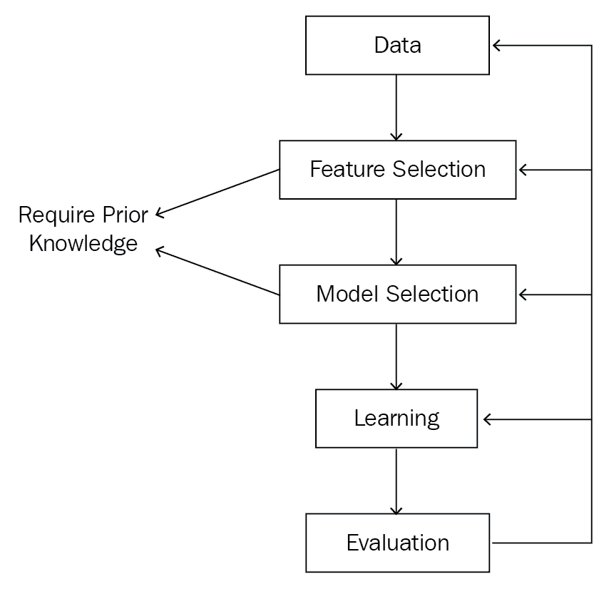

图 1.11：模型学习过程概述

# 数据预处理

这一组件代表了我们算法的知识库。因此，为了帮助学习算法对未见数据做出准确的决策，我们需要以最佳形式提供这些知识库。因此，我们的数据可能需要大量清理和预处理（转换）。

# 数据清理

大多数数据集都需要这一阶段，在此过程中，你将去除错误、噪声和冗余。我们需要确保数据准确、完整、可靠且无偏，因为使用糟糕的知识库可能会导致许多问题，例如：

+   不准确和有偏的结论

+   增加的错误

+   降低的泛化能力，即模型在未见过的数据上的表现能力，未训练过的数据

# 数据预处理

在这一步，我们对数据进行一些转换，使其一致且具体。数据预处理过程中有许多不同的转换方法可以考虑：

+   **重命名**（**重新标签化**）：这意味着将类别值转换为数字，因为如果与某些学习方法一起使用，类别值会带来危险，而数字则会在值之间强加顺序

+   **重缩放**（**归一化**）：将连续值转换/限定到某个范围，通常是 *[-1, 1]* 或 *[0, 1]*

+   **新特征**：从现有特征中构造新的特征。例如，*肥胖因子 = 体重/身高*

# 特征选择

样本的解释特征（输入变量）数量可能非常庞大，导致你获得 *x[i]=(x[i]¹, x[i]², x[i]³, ... , x[i]^d)* 作为训练样本（观测值/示例），其中 *d* 非常大。例如，在文档分类任务中，你可能得到 10,000 个不同的单词，输入变量将是不同单词的出现次数。

这样庞大的输入变量数量可能会带来问题，有时甚至是诅咒，因为我们有很多输入变量，却只有少量训练样本来帮助学习过程。为了避免这种庞大输入变量数量带来的诅咒（维度灾难），数据科学家使用降维技术来从输入变量中选择一个子集。例如，在文本分类任务中，他们可以进行如下操作：

+   提取相关输入（例如，互信息度量）

+   **主成分分析**（**PCA**）

+   分组（聚类）相似的词语（这使用相似度度量）

# 模型选择

这一步是在使用任何降维技术选择合适的输入变量子集之后进行的。选择合适的输入变量子集将使得后续的学习过程变得非常简单。

在这一步，你需要弄清楚适合学习的模型。

如果你有数据科学的先前经验，并将学习方法应用于不同领域和不同类型的数据，那么你会觉得这一步很容易，因为它需要你先了解数据的特征以及哪些假设可能适合数据的性质，基于这些你选择合适的学习方法。如果你没有任何先前的知识，这也没关系，因为你可以通过猜测并尝试不同的学习方法以及不同的参数设置，选择在测试集上表现更好的方法。

同样，初步的数据分析和可视化将帮助你对分布的形式和数据的性质做出合理的猜测。

# 学习过程

在学习中，我们指的是你将用来选择最佳模型参数的优化准则。为此有多种优化准则：

+   **均方误差**（**MSE**）

+   **最大似然**（**ML**）准则

+   **最大后验概率**（**MAP**）

优化问题可能很难解决，但正确选择模型和误差函数会带来不同的结果。

# 评估你的模型

在这一步，我们尝试衡量模型在未见数据上的泛化误差。由于我们只有特定的数据，且事先不知道任何未见数据，我们可以从数据中随机选择一个测试集，并且在训练过程中永远不使用它，以便它像未见的有效数据一样作用。你可以通过不同的方式来评估所选模型的表现：

+   简单的保留法，即将数据分为训练集和测试集

+   其他基于交叉验证和随机子抽样的复杂方法

我们在这一步的目标是比较在相同数据上训练的不同模型的预测性能，选择测试误差更小的模型，它将给我们带来更好的未见数据泛化误差。你还可以通过使用统计方法来检验结果的显著性，从而更确定地评估泛化误差。

# 开始学习

构建一个机器学习系统面临一些挑战和问题，我们将在本节中讨论这些问题。这些问题中有些是领域特定的，有些则不是。

# 学习的挑战

以下是你在构建学习系统时通常会面临的挑战和问题的概述。

# 特征提取 – 特征工程

特征提取是构建学习系统的关键步骤之一。如果你在这个挑战中通过选择适当的特征数量做得很好，那么接下来的学习过程将会变得轻松。此外，特征提取是依赖于领域的，它需要先验知识，以便了解哪些特征对于特定任务可能是重要的。例如，我们的鱼类识别系统的特征将与垃圾邮件检测或指纹识别的特征不同。

特征提取步骤从你拥有的原始数据开始。然后构建派生变量/值（特征），这些特征应该能够为学习任务提供信息，并促进接下来的学习和评估（泛化）步骤。

一些任务会有大量的特征和较少的训练样本（观测数据），这会影响后续的学习和泛化过程。在这种情况下，数据科学家使用降维技术将大量特征减少到一个较小的集合。

# 噪声

在鱼类识别任务中，你可以看到长度、重量、鱼的颜色以及船的颜色可能会有所不同，而且可能会有阴影、分辨率低的图像以及图像中的其他物体。所有这些问题都会影响我们提出的解释性特征的重要性，这些特征应该能为我们的鱼类分类任务提供信息。

在这种情况下，解决方法将会很有帮助。例如，有人可能会想到检测船只的 ID，并遮蔽出船上可能不会包含任何鱼的部分，以便我们的系统进行检测。这个解决方法会限制我们的搜索空间。

# 过拟合

正如我们在鱼类识别任务中看到的，我们曾通过增加模型复杂度并完美地分类训练样本中的每一个实例来提高模型的表现。正如我们稍后将看到的，这种模型在未见过的数据（例如我们将用于测试模型表现的数据）上并不起作用。训练的模型在训练样本上表现完美，但在测试样本上表现不佳，这种现象称为**过拟合**。

如果你浏览章节的后半部分，我们将构建一个学习系统，目的是将训练样本作为模型的知识库，让模型从中学习并对未见过的数据进行泛化。我们对训练数据上训练模型的表现误差不感兴趣；相反，我们关心的是训练模型在没有参与训练阶段的测试样本上的表现（泛化）误差。

# 机器学习算法的选择

有时，你对模型的执行结果不满意，需要切换到另一类模型。每种学习策略都有自己的假设，关于它将使用哪些数据作为学习基础。作为数据科学家，你需要找出哪种假设最适合你的数据；通过这样，你就能够决定尝试某一类模型并排除其他类。

# 先验知识

正如在模型选择和特征提取的概念中讨论的那样，如果你有先验知识，两个问题都可以得到解决：

+   适当的特征

+   模型选择部分

拥有鱼类识别系统的解释性特征的先验知识，使我们能够区分不同种类的鱼。我们可以通过尝试可视化我们的数据，获得不同鱼类分类数据类型的感性认识。在此基础上，可以选择合适的模型家族进行进一步探索。

# 缺失值

缺失特征主要是由于数据不足或选择了“不愿透露”选项。我们如何在学习过程中处理这种情况呢？例如，假设由于某种原因，我们发现某种特定鱼类的宽度数据缺失。处理这些缺失特征的方法有很多种。

# 实现鱼类识别/检测模型

为了展示机器学习特别是深度学习的力量，我们将实现鱼类识别的例子。你不需要理解代码的内部细节。本节的目的是给你提供一个典型机器学习流程的概览。

我们的知识库将是一些图片，每张图片都被标记为 opah 或 tuna。为了实现这一目标，我们将使用一种在图像处理和计算机视觉领域取得突破的深度学习架构。这种架构被称为**卷积神经网络**（**CNNs**）。它是一个深度学习架构的家族，利用图像处理中的卷积操作从图片中提取特征，从而解释我们想要分类的物体。现在，你可以把它想象成一个神奇的盒子，它会接收我们的图片，学习如何区分我们的两类鱼（opah 和 tuna），然后通过喂入未标记的图片来测试这个盒子的学习过程，看看它是否能够识别出图片中的鱼类。

不同类型的学习将在后面的章节中讨论，因此你将会理解为什么我们的鱼类识别任务属于监督学习类别。

在这个例子中，我们将使用 Keras。目前，你可以将 Keras 看作一个 API，它使得构建和使用深度学习比以往更加简单。所以，让我们开始吧！从 Keras 网站上，我们可以看到：

Keras 是一个高级神经网络 API，使用 Python 编写，并能够运行在 TensorFlow、CNTK 或 Theano 上。它的开发重点是使快速实验成为可能。*能够在最短的时间内从想法到结果是做出优秀研究的关键。*

# 知识库/数据集

正如我们之前提到的，我们需要一个历史数据集，用来教导学习算法完成它之后应执行的任务。但我们还需要另一个数据集来测试学习过程后它执行任务的能力。总而言之，在学习过程中我们需要两种类型的数据集：

1.  第一个是知识库，我们在其中拥有输入数据及其对应的标签，比如鱼的图像及其对应的标签（opah 或 tuna）。这些数据将被输入到学习算法中，供其学习并尝试发现将来有助于分类未标记图像的模式/趋势。

1.  第二个阶段主要是测试模型应用从知识库中学到的知识，处理未标记的图像或未见过的数据（通常是），并查看它是否表现良好。

如你所见，我们只有将作为学习方法的知识库使用的数据。我们手头所有的数据都将与正确的输出关联。因此，我们需要想办法生成这些没有正确输出关联的数据（即我们将应用模型的数据）。

在执行数据科学时，我们将进行以下操作：

+   **训练阶段**：我们从知识库中呈现我们的数据，并通过将输入数据及其正确输出输入到模型中来训练我们的学习方法/模型。

+   **验证/测试阶段**：在此阶段，我们将衡量训练好的模型表现如何。我们还使用不同的模型属性技术，通过使用（回归的 R-squared 分数、分类器的分类错误、信息检索模型的召回率和精确度等）来衡量我们训练模型的性能。

验证/测试阶段通常分为两个步骤：

1.  在第一步中，我们使用不同的学习方法/模型，并根据验证数据（验证步骤）选择表现最好的那个。

1.  然后我们根据测试集（测试步骤）来衡量并报告所选模型的准确性。

现在让我们看看如何获得这些我们将应用模型的数据，并查看模型训练得如何。

由于我们没有没有正确输出的训练样本，我们可以从将要使用的原始训练样本中生成一个。因此，我们可以将我们的数据样本拆分为三组（如 *图 1.9* 所示）：

+   **训练集**：这将作为我们模型的知识库。通常来自原始数据样本的 70%。

+   **验证集**：这将用于在一组模型中选择表现最好的模型。通常，这将是原始数据样本的 10%。

+   **测试集**：将用于衡量和报告所选模型的准确性。通常，它的大小与验证集相当。

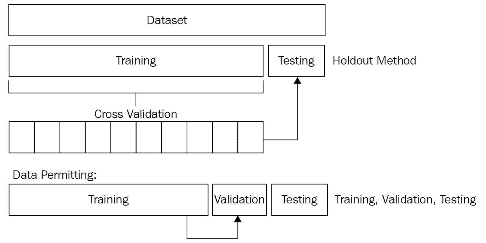

图 1.9：将数据分割为训练集、验证集和测试集

如果你只使用一个学习方法，可以取消验证集，将数据重新分割为仅训练集和测试集。通常，数据科学家使用 75/25 或 70/30 的比例划分数据。

# 数据分析预处理

在本节中，我们将分析并预处理输入图像，并将其转换为适合我们学习算法的可接受格式，这里使用的是卷积神经网络（CNN）。

所以让我们从导入实现所需的包开始：

```
import numpy as np
np.random.seed(2018)
```

```
import os
import glob
import cv2
import datetime
import pandas as pd
import time
import warnings
warnings.filterwarnings("ignore")
```

```
from sklearn.cross_validation import KFold
from keras.models import Sequential
from keras.layers.core import Dense, Dropout, Flatten
from keras.layers.convolutional import Convolution2D, MaxPooling2D, ZeroPadding2D
from keras.optimizers import SGD
from keras.callbacks import EarlyStopping
from keras.utils import np_utils
from sklearn.metrics import log_loss
from keras import __version__ as keras_version
```

为了使用数据集中提供的图像，我们需要将它们调整为相同的大小。OpenCV 是一个很好的选择，详情请见 OpenCV 官网：

OpenCV（开源计算机视觉库）是根据 BSD 许可证发布的，因此它对学术和商业使用都是免费的。它支持 C++、C、Python 和 Java 接口，并支持 Windows、Linux、Mac OS、iOS 和 Android 操作系统。OpenCV 设计时注重计算效率，并且强烈关注实时应用。它是用优化的 C/C++ 编写的，可以利用多核处理。启用了 OpenCL 后，它能够利用底层异构计算平台的硬件加速。

你可以通过使用 Python 包管理器安装 OpenCV，命令为 `pip install` `opencv-python`

```
# Parameters
# ----------
# img_path : path
#    path of the image to be resized
def rezize_image(img_path):
   #reading image file
   img = cv2.imread(img_path)
   #Resize the image to to be 32 by 32
   img_resized = cv2.resize(img, (32, 32), cv2.INTER_LINEAR)
return img_resized
```

现在，我们需要加载数据集中的所有训练样本，并根据之前的函数调整每张图像的大小。所以我们将实现一个函数，从我们为每种鱼类类型准备的不同文件夹中加载训练样本：

```
# Loading the training samples and their corresponding labels
def load_training_samples():
    #Variables to hold the training input and output variables
    train_input_variables = []
    train_input_variables_id = []
    train_label = []
    # Scanning all images in each folder of a fish type
    print('Start Reading Train Images')
    folders = ['ALB', 'BET', 'DOL', 'LAG', 'NoF', 'OTHER', 'SHARK', 'YFT']
    for fld in folders:
       folder_index = folders.index(fld)
       print('Load folder {} (Index: {})'.format(fld, folder_index))
       imgs_path = os.path.join('..', 'input', 'train', fld, '*.jpg')
       files = glob.glob(imgs_path)
       for file in files:
           file_base = os.path.basename(file)
           # Resize the image
           resized_img = rezize_image(file)
           # Appending the processed image to the input/output variables of the classifier
           train_input_variables.append(resized_img)
           train_input_variables_id.append(file_base)
           train_label.append(folder_index)
     return train_input_variables, train_input_variables_id, train_label
```

正如我们讨论的，我们有一个测试集，它将充当未见数据，以测试我们模型的泛化能力。因此，我们需要对测试图像做同样的处理；加载它们并进行调整大小处理：

```
def load_testing_samples():
    # Scanning images from the test folder
    imgs_path = os.path.join('..', 'input', 'test_stg1', '*.jpg')
    files = sorted(glob.glob(imgs_path))
    # Variables to hold the testing samples
    testing_samples = []
    testing_samples_id = []
    #Processing the images and appending them to the array that we have
    for file in files:
       file_base = os.path.basename(file)
       # Image resizing
       resized_img = rezize_image(file)
       testing_samples.append(resized_img)
       testing_samples_id.append(file_base)
    return testing_samples, testing_samples_id
```

现在，我们需要将之前的函数调用到另一个函数中，后者将使用 `load_training_samples()` 函数来加载并调整训练样本的大小。它还会增加几行代码，将训练数据转换为 NumPy 格式，重新调整数据形状以适应我们的分类器，最后将其转换为浮动格式：

```
def load_normalize_training_samples():
    # Calling the load function in order to load and resize the training samples
    training_samples, training_label, training_samples_id = load_training_samples()
    # Converting the loaded and resized data into Numpy format
    training_samples = np.array(training_samples, dtype=np.uint8)
    training_label = np.array(training_label, dtype=np.uint8)
    # Reshaping the training samples
    training_samples = training_samples.transpose((0, 3, 1, 2))
    # Converting the training samples and training labels into float format
    training_samples = training_samples.astype('float32')
    training_samples = training_samples / 255
    training_label = np_utils.to_categorical(training_label, 8)
    return training_samples, training_label, training_samples_id
```

我们也需要对测试进行相同的处理：

```
def load_normalize_testing_samples():
    # Calling the load function in order to load and resize the testing samples
    testing_samples, testing_samples_id = load_testing_samples()
    # Converting the loaded and resized data into Numpy format
    testing_samples = np.array(testing_samples, dtype=np.uint8)
    # Reshaping the testing samples
    testing_samples = testing_samples.transpose((0, 3, 1, 2))
    # Converting the testing samples into float format
    testing_samples = testing_samples.astype('float32')
    testing_samples = testing_samples / 255
    return testing_samples, testing_samples_id
```

# 模型构建

现在是创建模型的时候了。正如我们所提到的，我们将使用一种深度学习架构叫做 CNN 作为此鱼类识别任务的学习算法。再次提醒，你不需要理解本章之前或之后的任何代码，因为我们仅仅是演示如何使用少量代码，借助 Keras 和 TensorFlow 深度学习平台来解决复杂的数据科学任务。

还要注意，CNN 和其他深度学习架构将在后续章节中更详细地解释：

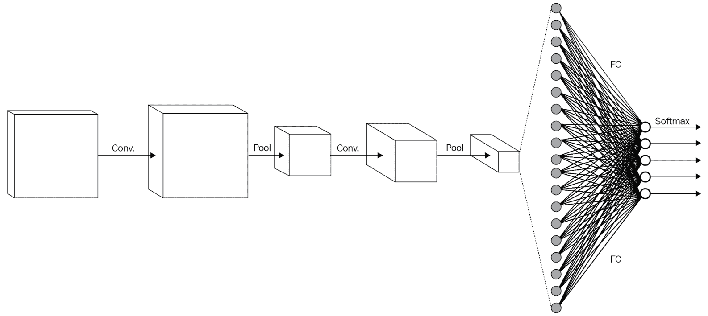

图 1.10：CNN 架构

所以，让我们继续创建一个函数，负责构建将在鱼类识别任务中使用的 CNN 架构：

```
def create_cnn_model_arch():
    pool_size = 2 # we will use 2x2 pooling throughout
    conv_depth_1 = 32 # we will initially have 32 kernels per conv. layer...
    conv_depth_2 = 64 # ...switching to 64 after the first pooling layer
    kernel_size = 3 # we will use 3x3 kernels throughout
    drop_prob = 0.5 # dropout in the FC layer with probability 0.5
    hidden_size = 32 # the FC layer will have 512 neurons
    num_classes = 8 # there are 8 fish types
    # Conv [32] -> Conv [32] -> Pool
    cnn_model = Sequential()
    cnn_model.add(ZeroPadding2D((1, 1), input_shape=(3, 32, 32), dim_ordering='th'))
    cnn_model.add(Convolution2D(conv_depth_1, kernel_size, kernel_size, activation='relu', 
      dim_ordering='th'))
    cnn_model.add(ZeroPadding2D((1, 1), dim_ordering='th'))
    cnn_model.add(Convolution2D(conv_depth_1, kernel_size, kernel_size, activation='relu',
      dim_ordering='th'))
    cnn_model.add(MaxPooling2D(pool_size=(pool_size, pool_size), strides=(2, 2),
      dim_ordering='th'))
    # Conv [64] -> Conv [64] -> Pool
    cnn_model.add(ZeroPadding2D((1, 1), dim_ordering='th'))
    cnn_model.add(Convolution2D(conv_depth_2, kernel_size, kernel_size, activation='relu',
      dim_ordering='th'))
    cnn_model.add(ZeroPadding2D((1, 1), dim_ordering='th'))
    cnn_model.add(Convolution2D(conv_depth_2, kernel_size, kernel_size, activation='relu',
      dim_ordering='th'))
    cnn_model.add(MaxPooling2D(pool_size=(pool_size, pool_size), strides=(2, 2),
     dim_ordering='th'))
    # Now flatten to 1D, apply FC then ReLU (with dropout) and finally softmax(output layer)
    cnn_model.add(Flatten())
    cnn_model.add(Dense(hidden_size, activation='relu'))
    cnn_model.add(Dropout(drop_prob))
    cnn_model.add(Dense(hidden_size, activation='relu'))
    cnn_model.add(Dropout(drop_prob))
    cnn_model.add(Dense(num_classes, activation='softmax'))
    # initiating the stochastic gradient descent optimiser
    stochastic_gradient_descent = SGD(lr=1e-2, decay=1e-6, momentum=0.9, nesterov=True)    cnn_model.compile(optimizer=stochastic_gradient_descent,  # using the stochastic gradient descent optimiser
                  loss='categorical_crossentropy')  # using the cross-entropy loss function
    return cnn_model
```

在开始训练模型之前，我们需要使用一种模型评估和验证方法，帮助我们评估模型并查看其泛化能力。为此，我们将使用一种叫做**k 折交叉验证**的方法。同样，您不需要理解这个方法或它是如何工作的，因为我们稍后将详细解释这一方法。

所以，让我们开始创建一个帮助我们评估和验证模型的函数：

```
def create_model_with_kfold_cross_validation(nfolds=10):
    batch_size = 16 # in each iteration, we consider 32 training examples at once
    num_epochs = 30 # we iterate 200 times over the entire training set
    random_state = 51 # control the randomness for reproducibility of the results on the same platform
    # Loading and normalizing the training samples prior to feeding it to the created CNN model
    training_samples, training_samples_target, training_samples_id = 
      load_normalize_training_samples()
    yfull_train = dict()
    # Providing Training/Testing indices to split data in the training samples
    # which is splitting data into 10 consecutive folds with shuffling
    kf = KFold(len(train_id), n_folds=nfolds, shuffle=True, random_state=random_state)
    fold_number = 0 # Initial value for fold number
    sum_score = 0 # overall score (will be incremented at each iteration)
    trained_models = [] # storing the modeling of each iteration over the folds
    # Getting the training/testing samples based on the generated training/testing indices by 
      Kfold
    for train_index, test_index in kf:
       cnn_model = create_cnn_model_arch()
       training_samples_X = training_samples[train_index] # Getting the training input variables
       training_samples_Y = training_samples_target[train_index] # Getting the training output/label variable
       validation_samples_X = training_samples[test_index] # Getting the validation input variables
       validation_samples_Y = training_samples_target[test_index] # Getting the validation output/label variable
       fold_number += 1
       print('Fold number {} from {}'.format(fold_number, nfolds))
       callbacks = [
           EarlyStopping(monitor='val_loss', patience=3, verbose=0),
       ]
       # Fitting the CNN model giving the defined settings
       cnn_model.fit(training_samples_X, training_samples_Y, batch_size=batch_size,
         nb_epoch=num_epochs,
             shuffle=True, verbose=2, validation_data=(validation_samples_X,
               validation_samples_Y),
             callbacks=callbacks)
       # measuring the generalization ability of the trained model based on the validation set
       predictions_of_validation_samples = 
         cnn_model.predict(validation_samples_X.astype('float32'), 
         batch_size=batch_size, verbose=2)
       current_model_score = log_loss(Y_valid, predictions_of_validation_samples)
       print('Current model score log_loss: ', current_model_score)
       sum_score += current_model_score*len(test_index)
       # Store valid predictions
       for i in range(len(test_index)):
           yfull_train[test_index[i]] = predictions_of_validation_samples[i]
       # Store the trained model
       trained_models.append(cnn_model)
    # incrementing the sum_score value by the current model calculated score
    overall_score = sum_score/len(training_samples)
    print("Log_loss train independent avg: ", overall_score)
    #Reporting the model loss at this stage
    overall_settings_output_string = 'loss_' + str(overall_score) + '_folds_' + str(nfolds) + 
      '_ep_' + str(num_epochs)
    return overall_settings_output_string, trained_models
```

现在，在构建模型并使用 k 折交叉验证方法来评估和验证模型之后，我们需要报告训练模型在测试集上的结果。为此，我们也将使用 k 折交叉验证，但这次是在测试集上进行，看看我们训练好的模型有多好。

所以，让我们定义一个函数，该函数将以训练好的 CNN 模型为输入，然后使用我们拥有的测试集对其进行测试：

```
def test_generality_crossValidation_over_test_set( overall_settings_output_string, cnn_models):
    batch_size = 16 # in each iteration, we consider 32 training examples at once
    fold_number = 0 # fold iterator
    number_of_folds = len(cnn_models) # Creating number of folds based on the value used in the training step
    yfull_test = [] # variable to hold overall predictions for the test set
    #executing the actual cross validation test process over the test set
    for j in range(number_of_folds):
       model = cnn_models[j]
       fold_number += 1
       print('Fold number {} out of {}'.format(fold_number, number_of_folds))
       #Loading and normalizing testing samples
       testing_samples, testing_samples_id = load_normalize_testing_samples()
       #Calling the current model over the current test fold
       test_prediction = model.predict(testing_samples, batch_size=batch_size, verbose=2)
       yfull_test.append(test_prediction)
    test_result = merge_several_folds_mean(yfull_test, number_of_folds)
    overall_settings_output_string = 'loss_' + overall_settings_output_string \ + '_folds_' +
      str(number_of_folds)
    format_results_for_types(test_result, testing_samples_id, overall_settings_output_string)
```

# 模型训练与测试

现在，我们准备通过调用主函数`create_model_with_kfold_cross_validation()`来开始模型训练阶段，该函数用于通过 10 折交叉验证构建并训练 CNN 模型；然后我们可以调用测试函数来衡量模型对测试集的泛化能力：

```
if __name__ == '__main__':
  info_string, models = create_model_with_kfold_cross_validation()
  test_generality_crossValidation_over_test_set(info_string, models)
```

# 鱼类识别——全部一起

在解释了我们鱼类识别示例的主要构建模块之后，我们准备将所有代码片段连接起来，并查看我们如何通过几行代码构建如此复杂的系统。完整的代码可以在本书的*附录*部分找到。

# 不同的学习类型

根据 Arthur Samuel 的说法（[`en.wikipedia.org/wiki/Arthur_Samuel`](https://en.wikipedia.org/wiki/Arthur_Samuel)），*数据科学赋予计算机在不需要显式编程的情况下学习的能力*。因此，任何能够使用训练样本做出决策并处理未见数据的程序，都被认为是学习。数据科学或学习有三种不同的形式。

图 1.12 展示了常用的数据科学/机器学习类型：

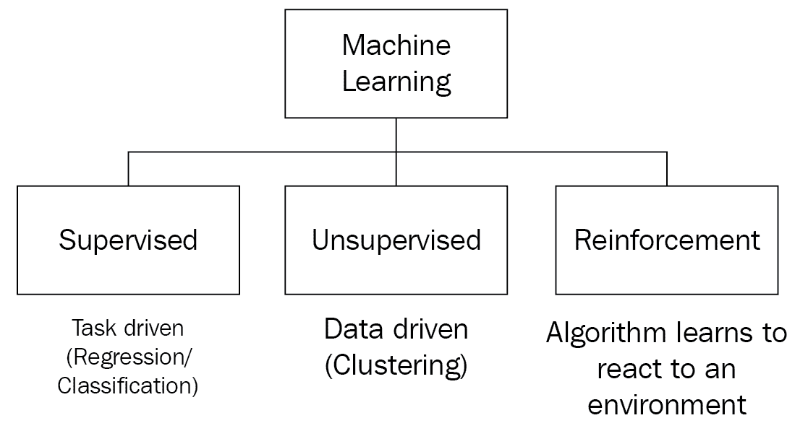

图 1.12：数据科学/机器学习的不同类型。

# 监督学习

大多数数据科学家使用监督学习。监督学习是指您有一些解释性特征，称为输入变量(*X*)，并且您有与训练样本相关联的标签，称为输出变量(*Y*)。任何监督学习算法的目标都是学习从输入变量(*X*)到输出变量(*Y*)的映射函数：


因此，有监督学习算法将尝试学习输入变量（*X*）到输出变量（*Y*）的映射关系，以便以后可以用来预测未见样本的*Y*值。

*图 1.13* 显示了任何有监督数据科学系统的典型工作流：


图 1.13：一个典型的有监督学习工作流/流程。上部分显示了训练过程，首先将原始数据输入到特征提取模块，我们将在此选择有意义的解释性特征来表示数据。之后，提取/选择的解释性特征与训练集结合，并将其输入到学习算法中以便从中学习。接着，我们进行模型评估，以调整参数并使学习算法从数据样本中获得最佳效果。

这种学习被称为**有监督学习**，因为你会为每个训练样本提供标签/输出。在这种情况下，我们可以说学习过程受到监督者的指导。算法根据训练样本做出决策，并根据数据的正确标签由监督者进行纠正。当有监督学习算法达到可接受的准确度时，学习过程就会停止。

有监督学习任务有两种不同的形式；回归和分类：

+   **分类**：分类任务是当标签或输出变量是一个类别时，例如*tuna*或*Opah*或*垃圾邮件*和*非垃圾邮件*。

+   **回归**：回归任务是当输出变量是一个实际值时，例如*房价*或*身高*。

# 无监督学习

无监督学习被认为是信息科学家使用的第二大常见学习类型。在这种学习中，只有解释性特征或输入变量（*X*）被给定，而没有任何对应的标签或输出变量。

无监督学习算法的目标是获取数据中的隐藏结构和模式。这种学习被称为**无监督**，因为训练样本没有相关的标签。因此，这是一种没有指导的学习过程，算法会尝试自行发现基本结构。

无监督学习可以进一步分为两种形式——聚类任务和关联任务：

+   **聚类**：聚类任务是你想要发现相似的训练样本组并将它们归为一类，例如按主题对文档进行分组。

+   **关联**：关联规则学习任务是你想要发现一些描述训练样本之间关系的规则，例如，喜欢看电影*X*的人通常也会看电影*Y*。

*图 1.14* 显示了一个无监督学习的简单例子，其中我们有散乱的文档，并试图将*相似*的文档聚在一起：

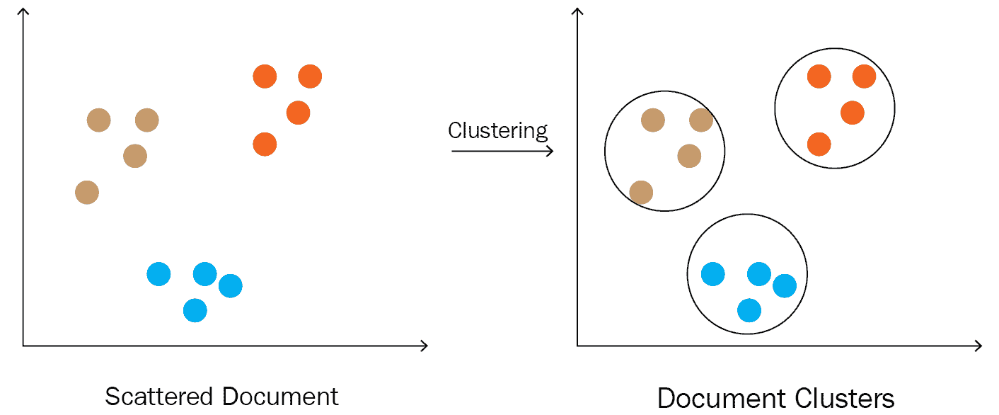

图 1.14：展示了无监督学习如何使用相似度度量（如欧几里得距离）将相似的文档聚集在一起，并为它们绘制决策边界。

# 半监督学习

半监督学习是一种介于有监督学习和无监督学习之间的学习方式，在这种方式中，你有带输入变量（*X*）的训练样本，但只有一部分样本带有输出变量（*Y*）的标签。

这种学习方式的一个好例子是 Flickr ([`www.flickr.com/`](https://www.flickr.com/))，在这里，用户上传了大量的图片，但只有一部分是带标签的（例如：日落、海洋和狗），其余的则没有标签。

为了解决属于这种类型的学习任务，你可以使用以下方法之一，或者它们的组合：

+   **有监督学习**：学习/训练学习算法，针对未标记的数据进行预测，然后将所有训练样本反馈给算法，让其从中学习并预测未见过的数据。

+   **无监督学习**：使用无监督学习算法来学习解释性特征或输入变量的潜在结构，就好像你没有任何标记的训练样本一样。

# 强化学习

机器学习中的最后一种学习类型是强化学习，在这种学习方式中没有监督者，只有奖励信号。

所以，强化学习算法将尝试做出决策，然后奖励信号会告诉我们这个决策是否正确。此外，这种监督反馈或奖励信号可能不会立即到来，而是会延迟几步。例如，算法现在做出决策，但只有在多步之后，奖励信号才会告诉我们这个决策是好是坏。

# 数据规模与行业需求

数据是我们学习计算的基础；没有数据，任何激励和富有创意的想法都将毫无意义。因此，如果你有一个好的数据科学应用程序，并且数据正确，那么你就已经准备好开始了。

具备从数据中分析和提取价值的能力在当今时代已经变得显而易见，尽管这取决于数据的结构，但由于大数据正成为当今的流行词汇，我们需要能够与如此庞大的数据量相匹配并在明确的学习时间内进行处理的数据科学工具和技术。如今，一切都在产生数据，能够应对这些数据已成为一项挑战。像谷歌、Facebook、微软、IBM 等大型公司都在构建自己的可扩展数据科学解决方案，以应对客户每天产生的大量数据。

TensorFlow 是一个机器智能/数据科学平台，于 2016 年 11 月 9 日由谷歌发布为开源库。它是一个可扩展的分析平台，使数据科学家能够利用大量数据在可视化的时间内构建复杂的系统，并且它还使得他们能够使用需要大量数据才能取得良好性能的贪心学习方法。

# 总结

在本章中，我们讲解了如何构建鱼类识别的学习系统；我们还展示了如何利用 TensorFlow 和 Keras，通过几行代码构建复杂的应用程序，如鱼类识别。这个编程示例并非要你理解其中的代码，而是为了展示构建复杂系统的可视化过程，以及数据科学，特别是深度学习，如何成为一种易于使用的工具。

我们看到，在构建学习系统时，作为数据科学家，你可能会遇到的挑战。

我们还了解了构建学习系统的典型设计周期，并解释了参与该周期的每个组件的整体概念。

最后，我们讲解了不同的学习类型，探讨了大大小小公司每天生成的大数据，以及这些海量数据如何引发警报，迫使我们构建可扩展的工具，以便能够分析和从这些数据中提取价值。

到此为止，读者可能会被目前为止提到的所有信息所压倒，但本章中大部分内容将在其他章节中展开，包括数据科学挑战和鱼类识别示例。本章的整体目的是让读者对数据科学及其发展周期有一个总体的了解，而不需要深入理解挑战和编码示例。编程示例在本章中提到的目的是为了打破大多数数据科学新手的恐惧感，并向他们展示像鱼类识别这样复杂的系统如何仅用几行代码就能实现。

接下来，我们将开始我们的*通过示例*之旅，通过一个示例来讲解数据科学的基本概念。接下来的部分将主要专注于为后续的高级章节做准备，通过著名的泰坦尼克号示例来进行讲解。我们将涉及许多概念，包括回归和分类的不同学习方法、不同类型的性能误差以及我们应该关注哪些误差，以及更多关于解决数据科学挑战和处理不同形式数据样本的内容。
