# 快速入门 TensorFlow

在本章中，我们将概述一个最广泛使用的深度学习框架。TensorFlow 拥有庞大的社区支持，并且日益壮大，使其成为构建复杂深度学习应用程序的一个良好选择。来自 TensorFlow 网站的介绍：

<q class="calibre52">“TensorFlow 是一个开源软件库，旨在通过数据流图进行数值计算。图中的节点代表数学运算，而图的边缘代表在节点间传递的多维数据数组（张量）。灵活的架构允许你将计算部署到一台或多台 CPU 或 GPU 上，无论是在桌面、服务器还是移动设备上，都可以通过单一的 API 完成。TensorFlow 最初由谷歌机器智能研究组织中的 Google Brain 团队的研究人员和工程师开发，用于进行机器学习和深度神经网络的研究，但该系统足够通用，能够应用于许多其他领域。”</q>

本章将涉及以下内容：

+   TensorFlow 安装

+   TensorFlow 环境

+   计算图

+   TensorFlow 数据类型、变量和占位符

+   获取 TensorFlow 输出

+   TensorBoard——可视化学习

# TensorFlow 安装

TensorFlow 安装提供两种模式：CPU 和 GPU。我们将从安装 GPU 模式的 TensorFlow 开始。

# TensorFlow GPU 安装教程（Ubuntu 16.04）

TensorFlow 的 GPU 模式安装需要最新版本的 NVIDIA 驱动程序，因为目前只有 GPU 版本的 TensorFlow 支持 CUDA。以下部分将带你通过逐步安装 NVIDIA 驱动程序和 CUDA 8 的过程。

# 安装 NVIDIA 驱动程序和 CUDA 8

首先，你需要根据你的 GPU 安装正确的 NVIDIA 驱动程序。我使用的是 GeForce GTX 960M GPU，所以我将安装 `nvidia-375`（如果你使用的是其他 GPU，可以使用 NVIDIA 搜索工具 [`www.nvidia.com/Download/index.aspx`](http://www.nvidia.com/Download/index.aspx) 来帮助你找到正确的驱动程序版本）。如果你想知道你的机器的 GPU 型号，可以在终端中执行以下命令：

```py
lspci | grep -i nvidia
```

你应该在终端中看到以下输出：


接下来，我们需要添加一个专有的 NVIDIA 驱动程序仓库，以便能够使用 `apt-get` 安装驱动程序：

```py
sudo add-apt-repository ppa:graphics-drivers/ppa
sudo apt-get update
sudo apt-get install nvidia-375
```

在成功安装 NVIDIA 驱动程序后，重新启动机器。要验证驱动程序是否正确安装，可以在终端中执行以下命令：

```py
cat /proc/driver/nvidia/version
```

你应该在终端中看到以下输出：


接下来，我们需要安装 CUDA 8。打开以下 CUDA 下载链接：[`developer.nvidia.com/cuda-downloads`](https://developer.nvidia.com/cuda-downloads)。根据以下截图选择你的操作系统、架构、发行版、版本，最后选择安装程序类型：

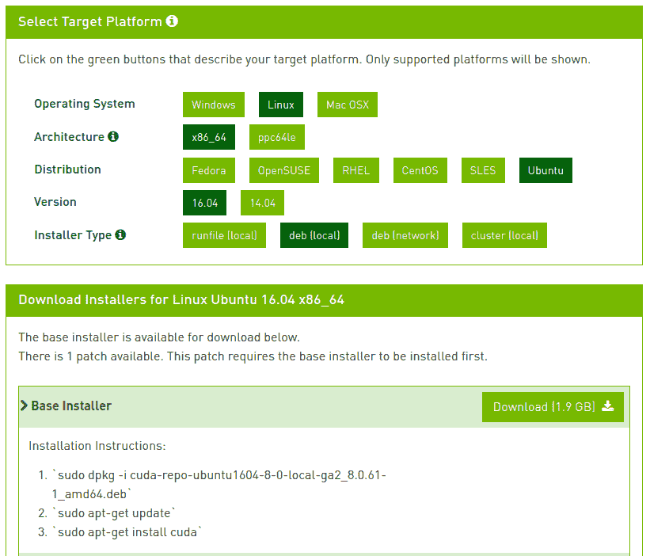

安装文件大约 2 GB。你需要执行以下安装指令：

```py
sudo dpkg -i cuda-repo-ubuntu1604-8-0-local-ga2_8.0.61-1_amd64.deb
sudo apt-get update
sudo apt-get install cuda
```

接下来，我们需要通过执行以下命令将库添加到 `.bashrc` 文件中：

```py
echo 'export PATH=/usr/local/cuda/bin:$PATH' >> ~/.bashrc
```

```py
echo 'export LD_LIBRARY_PATH=/usr/local/cuda/lib64:$LD_LIBRARY_PATH' >> ~/.bashrc
```

```py
source ~/.bashrc
```

接下来，你需要通过执行以下命令来验证 CUDA 8 的安装：

```py
nvcc -V
```

你应该在终端中看到以下输出：


最后，在本节中，我们需要安装 cuDNN 6.0。**NVIDIA CUDA 深度神经网络库**（**cuDNN**）是一个为深度神经网络加速的 GPU 库。你可以从 NVIDIA 的网页下载。执行以下命令以解压并安装 cuDNN：

```py
cd ~/Downloads/
```

```py
tar xvf cudnn*.tgz
```

```py
cd cuda
```

```py
sudo cp */*.h /usr/local/cuda/include/
```

```py
sudo cp */libcudnn* /usr/local/cuda/lib64/
```

```py
sudo chmod a+r /usr/local/cuda/lib64/libcudnn*
```

为了确保你的安装成功，你可以在终端中使用 `nvidia-smi` 工具。如果安装成功，该工具会提供关于 GPU 的监控信息，比如 RAM 和运行中的进程。

# 安装 TensorFlow

在为 TensorFlow 准备好 GPU 环境之后，我们现在可以安装 GPU 版本的 TensorFlow。但在安装 TensorFlow 之前，你可以先安装一些有用的 Python 包，这些包将在接下来的章节中帮助你，并使你的开发环境更为方便。

我们可以通过执行以下命令来安装一些数据处理、分析和可视化库：

```py
sudo apt-get update && apt-get install -y python-numpy python-scipy python-nose python-h5py python-skimage python-matplotlib python-pandas python-sklearn python-sympy
```

```py
sudo apt-get clean && sudo apt-get autoremove
```

```py
sudo rm -rf /var/lib/apt/lists/*
```

接下来，你可以安装更多有用的库，如虚拟环境、Jupyter Notebook 等：

```py
sudo apt-get update
```

```py
sudo apt-get install git python-dev python3-dev python-numpy python3-numpy build-essential  python-pip python3-pip python-virtualenv swig python-wheel libcurl3-dev
```

```py
sudo apt-get install -y libfreetype6-dev libpng12-dev
```

```py
pip3 install -U matplotlib ipython[all] jupyter pandas scikit-image
```

最后，我们可以通过执行以下命令开始安装 GPU 版本的 TensorFlow：

```py
pip3 install --upgrade tensorflow-gpu
```

你可以通过使用 Python 来验证 TensorFlow 是否成功安装：

```py
python3
>>> import tensorflow as tf
>>> a = tf.constant(5)
>>> b = tf.constant(6)
>>> sess = tf.Session()
>>> sess.run(a+b)
// this should print bunch of messages showing device status etc. // If everything goes well, you should see gpu listed in device
>>> sess.close()
```

你应该在终端中看到以下输出：

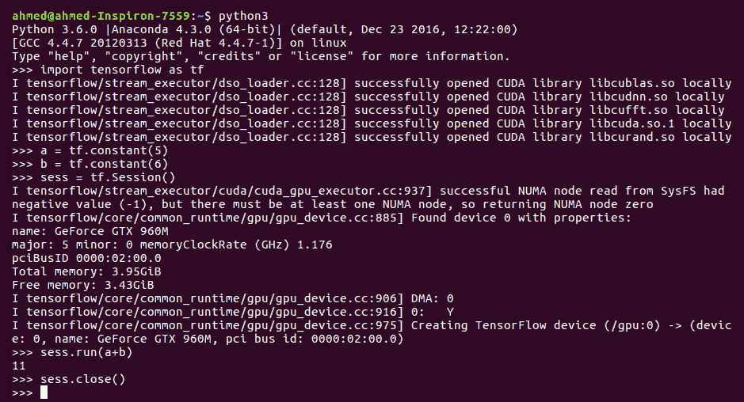

# TensorFlow CPU 安装（适用于 Ubuntu 16.04）

在本节中，我们将安装 CPU 版本，这个版本在安装之前不需要任何驱动程序。所以，首先让我们安装一些有用的数据处理和可视化的包：

```py
sudo apt-get update && apt-get install -y python-numpy python-scipy python-nose python-h5py python-skimage python-matplotlib python-pandas python-sklearn python-sympy
```

```py
sudo apt-get clean && sudo apt-get autoremove
```

```py
sudo rm -rf /var/lib/apt/lists/*
```

接下来，你可以安装一些有用的库，比如虚拟环境、Jupyter Notebook 等：

```py
sudo apt-get update
```

```py
sudo apt-get install git python-dev python3-dev python-numpy python3-numpy build-essential  python-pip python3-pip python-virtualenv swig python-wheel libcurl3-dev
```

```py
sudo apt-get install -y libfreetype6-dev libpng12-dev
```

```py
pip3 install -U matplotlib ipython[all] jupyter pandas scikit-image
```

最后，你可以通过执行以下命令来安装最新的 TensorFlow CPU 版本：

```py
pip3 install --upgrade tensorflow
```

你可以通过运行以下 TensorFlow 语句来检查 TensorFlow 是否成功安装：

```py
python3
>>> import tensorflow as tf
>>> a = tf.constant(5)
>>> b = tf.constant(6)
>>> sess = tf.Session()
>>> sess.run(a+b)
>> sess.close()
```

你应该在终端中看到以下输出：

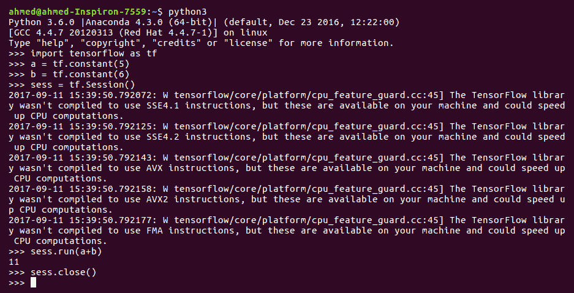

# TensorFlow CPU 安装（适用于 macOS X）

在本节中，我们将使用 `virtualenv` 为 macOS X 安装 TensorFlow。所以，首先让我们通过执行以下命令安装 `pip` 工具：

```py
sudo easy_install pip
```

接下来，我们需要安装虚拟环境库：

```py
sudo pip install --upgrade virtualenv
```

安装虚拟环境库后，我们需要创建一个容器或虚拟环境，它将托管 TensorFlow 的安装以及你可能想要安装的任何包，而不会影响底层的主机系统：

```py
virtualenv --system-site-packages targetDirectory # for Python 2.7
```

```py
virtualenv --system-site-packages -p python3 targetDirectory # for Python 3.n
```

这里假设`targetDirectory`为`~/tensorflow`。

现在你已经创建了虚拟环境，你可以通过输入以下命令来访问它：

```py
source ~/tensorflow/bin/activate 
```

一旦你输入这个命令，你将进入你刚刚创建的虚拟机，你可以在这个环境中安装任何包，而这些包只会安装在这个环境中，不会影响你所使用的底层或主机系统。

要退出环境，你可以输入以下命令：

```py
deactivate
```

请注意，当前我们确实需要待在虚拟环境内，所以暂时保持它激活。一旦你完成了 TensorFlow 的使用，应该退出虚拟环境：

```py
source bin/activate
```

为了安装 TensorFlow 的 CPU 版本，你可以输入以下命令，这将同时安装 TensorFlow 所需的所有依赖库：

```py
(tensorflow)$ pip install --upgrade tensorflow      # for Python 2.7
```

```py
(tensorflow)$ pip3 install --upgrade tensorflow     # for Python 3.n
```

# TensorFlow GPU/CPU 安装指南（Windows）

我们假设你的系统已经安装了 Python 3。要安装 TensorFlow，请以管理员身份启动终端，方法如下：打开开始菜单，搜索 cmd，然后右键点击它并选择“以管理员身份运行”：

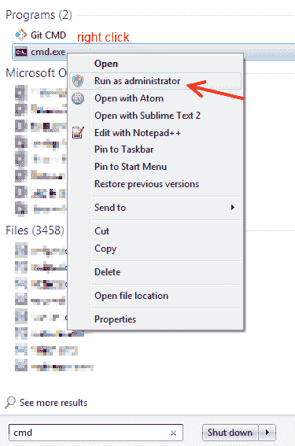

一旦你打开了命令窗口，你可以输入以下命令以在 GPU 模式下安装 TensorFlow：

你需要在输入下一个命令之前安装`pip`或`pip3`（取决于你的 Python 版本）。

```py
C:\> pip3 install --upgrade tensorflow-gpu
```

输入以下命令以在 CPU 模式下安装 TensorFlow：

```py
C:\> pip3 install --upgrade tensorflow
```

# TensorFlow 环境

TensorFlow 是谷歌推出的另一个深度学习框架，正如**TensorFlow**这个名称所暗示的，它源自神经网络在多维数据数组或张量上执行的操作！它实际上是张量的流动。

但首先，为什么我们要在本书中使用深度学习框架？

+   **它扩展了机器学习代码**：深度学习和机器学习的大部分研究能够被应用或归因于这些深度学习框架。它们使数据科学家能够极其快速地进行迭代，并使深度学习和其他机器学习算法更加易于实践者使用。像谷歌、Facebook 等大公司正在使用这样的深度学习框架来扩展到数十亿用户。

+   **它计算梯度**：深度学习框架也可以自动计算梯度。如果你一步步跟踪梯度计算的过程，你会发现梯度计算并不简单，并且自己实现一个无错的版本可能会很棘手。

+   **它标准化了用于分享的机器学习应用程序**：此外，可以在线获取预训练模型，这些模型可以在不同的深度学习框架中使用，并且这些预训练模型帮助那些在 GPU 资源有限的人，这样他们就不必每次都从头开始。我们可以站在巨人的肩膀上，从那里开始。

+   **有很多可用的深度学习框架**，具有不同的优势、范式、抽象级别、编程语言等等。

+   **与 GPU 接口进行并行处理**：使用 GPU 进行计算是一个非常迷人的特性，因为 GPU 比 CPU 拥有更多的核心和并行化，所以能够大大加速您的代码。

这就是为什么 TensorFlow 几乎是在深度学习中取得进展的必要条件，因为它可以促进您的项目。

所以，简而言之，什么是 TensorFlow？

+   TensorFlow 是谷歌的深度学习框架，用于使用数据流图进行数值计算的开源工具。

+   它最初由 Google Brain 团队开发，以促进他们的机器学习研究。

+   TensorFlow 是表达机器学习算法和执行这些算法的实现的接口。

TensorFlow 是如何工作的，其潜在范式是什么？

# 计算图

有关 TensorFlow 的所有大想法中最重要的是，数值计算被表达为一个计算图，如下图所示。因此，任何 TensorFlow 程序的核心都将是一个计算图，以下内容为真：

+   图节点是具有任意数量输入和输出的操作。

+   我们节点之间的图边将是在这些操作之间流动的张量，关于张量的最佳思考方式实际上是作为*n*维数组。

使用这样的流图作为深度学习框架的主干的优势在于，它允许您以小而简单的操作构建复杂的模型。此外，当我们在后面讨论梯度计算时，这将使得梯度计算变得非常简单：


另一种思考 TensorFlow 图的方式是，每个操作都是可以在那一点评估的函数。

# TensorFlow 数据类型、变量和占位符

对计算图的理解将帮助我们将复杂模型看作是小子图和操作。

让我们看一个只有一个隐藏层的神经网络的例子，以及其在 TensorFlow 中可能的计算图是什么样子：


因此，我们有一些隐藏层，我们试图计算，如某个参数矩阵*W*时间一些输入*x*加上偏差项*b*的 ReLU 激活。ReLU 函数取输出的最大值和零之间的较大者。

下图显示了 TensorFlow 中图形的可能样子：

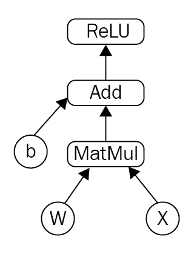

在这个图中，我们为 *b* 和 *W* 定义了变量，并且我们为 *x* 定义了一个占位符；我们还为图中的每个操作定义了节点。接下来，我们将详细了解这些节点类型。

# 变量

变量将是有状态的节点，它们输出当前的值。在这个例子中，就是 *b* 和 *W*。我们所说的变量是有状态的意思是，它们在多次执行过程中保持其当前值，而且很容易将保存的值恢复到变量中：

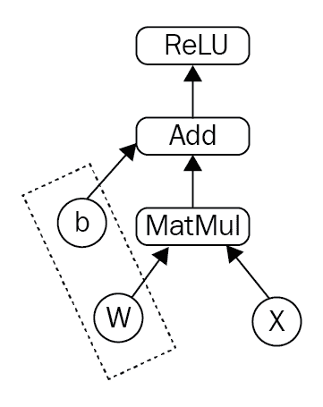

此外，变量还有其他有用的功能；例如，它们可以在训练过程中及训练后保存到磁盘，这使得我们之前提到的功能得以实现，即来自不同公司和团队的人们可以保存、存储并将他们的模型参数传输给其他人。而且，变量是你希望调整以最小化损失的东西，我们很快就会看到如何做到这一点。

重要的是要知道，图中的变量，如 *b* 和 *W*，仍然是操作，因为根据定义，图中的所有节点都是操作。因此，当你在运行时评估这些持有 *b* 和 *W* 值的操作时，你将获得这些变量的值。

我们可以使用 TensorFlow 的 `Variable()` 函数来定义一个变量并给它一个初始值：

```py
var = tf.Variable(tf.random_normal((0,1)),name='random_values')
```

这一行代码将定义一个 2x2 的变量，并从标准正态分布中初始化它。你还可以为变量命名。

# 占位符

下一种类型的节点是占位符。占位符是那些在执行时输入值的节点：


如果你的计算图有依赖于外部数据的输入，这些输入就是我们将在训练过程中添加到计算中的占位符。因此，对于占位符，我们不提供任何初始值。我们只需指定张量的数据类型和形状，这样即使图中还没有存储任何值，计算图仍然知道该计算什么。

我们可以使用 TensorFlow 的占位符函数来创建一个占位符：

```py
ph_var1 = tf.placeholder(tf.float32,shape=(2,3))
ph_var2 = tf.placeholder(tf.float32,shape=(3,2))
result = tf.matmul(ph_var1,ph_var2)
```

这些代码行定义了两个特定形状的占位符变量，并定义了一个操作（参见下一节），该操作将这两个值相乘。

# 数学操作

第三种类型的节点是数学操作，它们将是我们的矩阵乘法（MatMul）、加法（Add）和 ReLU。这些都是你 TensorFlow 图中的节点，和 NumPy 操作非常相似：

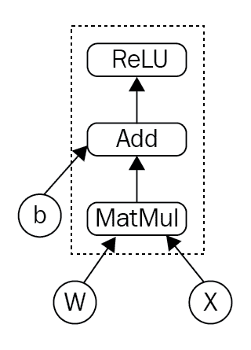

让我们看看这张图在代码中会是什么样子。

我们执行以下步骤来生成上面的图：

1.  创建权重 *W* 和 *b*，包括初始化。我们可以通过从均匀分布中采样来初始化权重矩阵 *W*，即 *W ~ Uniform(-1,1)*，并将 *b* 初始化为 0。

1.  创建输入占位符 *x*，它将具有 *m * 784* 的输入矩阵形状。

1.  构建流图。

接下来，让我们按照以下步骤来构建流图：

```py
# import TensorFlow package
import tensorflow as tf
# build a TensorFlow variable b taking in initial zeros of size 100
# ( a vector of 100 values)
b  = tf.Variable(tf.zeros((100,)))
# TensorFlow variable uniformly distributed values between -1 and 1
# of shape 784 by 100
W = tf.Variable(tf.random_uniform((784, 100),-1,1))
# TensorFlow placeholder for our input data that doesn't take in
# any initial values, it just takes a data type 32 bit floats as
# well as its shape
x = tf.placeholder(tf.float32, (100, 784))
# express h as Tensorflow ReLU of the TensorFlow matrix
#Multiplication of x and W and we add b
h = tf.nn.relu(tf.matmul(x,W) + b )
h and see its value until we run this graph. So, this code snippet is just for building a backbone for our model. If you try to print the value of *W* or *b* in the preceding code, you should get the following output in Python:
```

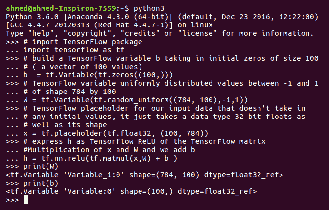

到目前为止，我们已经定义了我们的图，现在我们需要实际运行它。

# 获取 TensorFlow 的输出

在前面的部分，我们知道如何构建计算图，但我们需要实际运行它并获取其值。

我们可以通过一种叫做会话（session）的方式来部署/运行图，这实际上是一个绑定到特定执行上下文（例如 CPU 或 GPU）的机制。因此，我们将构建的图部署到 CPU 或 GPU 上下文中。

为了运行图，我们需要定义一个叫做 `sess` 的会话对象，然后调用 `run` 函数，该函数接受两个参数：

```py
sess.run(fetches, feeds)
```

这里：

+   `fetches` 是图节点的列表，返回节点的输出。我们关注的正是这些节点的计算值。

+   `feeds` 是一个字典，将图节点映射到我们希望在模型中运行的实际值。因此，这就是我们实际填写之前提到的占位符的地方。

所以，让我们继续运行我们的图：

```py
# importing the numpy package for generating random variables for
# our placeholder x
import numpy as np
# build a TensorFlow session object which takes a default execution
# environment which will be most likely a CPU
sess = tf.Session()
# calling the run function of the sess object to initialize all the
# variables.
sess.run(tf.global_variables_initializer())
# calling the run function on the node that we are interested in,
# the h, and we feed in our second argument which is a dictionary
# for our placeholder x with the values that we are interested in.
sess.run(h, {x: np.random.random((100,784))})   
```

通过 `sess` 对象运行我们的图后，我们应该得到类似下面的输出：

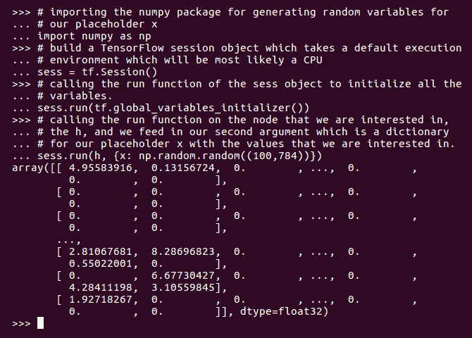

```py
lazy evaluation. It means that the evaluation of your graph only ever happens at runtime, and runtime in TensorFlow means the session. So, calling this function, global_variables_initializer(), will actually initialize anything called variable in your graph, such as *W* and *b* in our case.
```

我们还可以在一个 with 块中使用会话变量，以确保在执行图后会话会被关闭：

```py
ph_var1 = tf.placeholder(tf.float32,shape=(2,3))
ph_var2 = tf.placeholder(tf.float32,shape=(3,2))
result = tf.matmul(ph_var1,ph_var2)
with tf.Session() as sess:
    print(sess.run([result],feed_dict={ph_var1:[[1.,3.,4.],[1.,3.,4.]],ph_var2:[[1., 3.],[3.,1.],[.1,4.]]}))

Output:
[array([[10.4, 22\. ],
       [10.4, 22\. ]], dtype=float32)]

```

# TensorBoard – 可视化学习

你将用 TensorFlow 进行的计算——例如训练一个庞大的深度神经网络——可能会很复杂且令人困惑，相应的计算图也将非常复杂。为了更容易理解、调试和优化 TensorFlow 程序，TensorFlow 团队提供了一套可视化工具，称为 TensorBoard，这是一个可以通过浏览器运行的 Web 应用套件。TensorBoard 可以用来可视化你的 TensorFlow 图，绘制关于图执行的定量指标，并展示额外的数据，比如通过它的图像。当 TensorBoard 完全配置好后，它看起来是这样的：

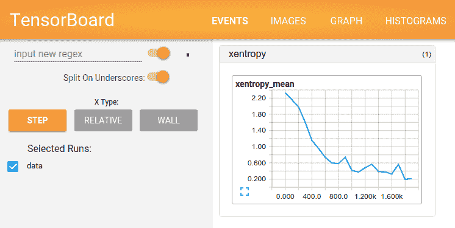

为了理解 TensorBoard 的工作原理，我们将构建一个计算图，它将作为 MNIST 数据集的分类器，MNIST 是一个手写图像数据集。

你不需要理解这个模型的所有细节，但它会向你展示一个用 TensorFlow 实现的机器学习模型的一般流程。

所以，让我们从导入 TensorFlow 并使用 TensorFlow 的辅助函数加载所需的数据集开始；这些辅助函数会检查你是否已经下载了数据集，否则它会为你下载：

```py
import tensorflow as tf

# Using TensorFlow helper function to get the MNIST dataset
from tensorflow.examples.tutorials.mnist import input_data
mnist_dataset = input_data.read_data_sets("/tmp/data/", one_hot=True)

Output:
Extracting /tmp/data/train-images-idx3-ubyte.gz
Extracting /tmp/data/train-labels-idx1-ubyte.gz
Extracting /tmp/data/t10k-images-idx3-ubyte.gz
Extracting /tmp/data/t10k-labels-idx1-ubyte.gz
```

接下来，我们需要定义超参数（用于微调模型性能的参数）和模型的输入：

```py
# hyperparameters of the the model (you don't have to understand the functionality of each parameter)
learning_rate = 0.01
num_training_epochs = 25
train_batch_size = 100
display_epoch = 1
logs_path = '/tmp/tensorflow_tensorboard/'

# Define the computational graph input which will be a vector of the image pixels
# Images of MNIST has dimensions of 28 by 28 which will multiply to 784
input_values = tf.placeholder(tf.float32, [None, 784], name='input_values')

# Define the target of the model which will be a classification problem of 10 classes from 0 to 9
target_values = tf.placeholder(tf.float32, [None, 10], name='target_values')

# Define some variables for the weights and biases of the model
weights = tf.Variable(tf.zeros([784, 10]), name='weights')
biases = tf.Variable(tf.zeros([10]), name='biases')
```

现在我们需要构建模型并定义我们将要优化的代价函数：

```py
# Create the computational graph and encapsulating different operations to different scopes
# which will make it easier for us to understand the visualizations of TensorBoard
with tf.name_scope('Model'):
 # Defining the model
 predicted_values = tf.nn.softmax(tf.matmul(input_values, weights) + biases)

with tf.name_scope('Loss'):
 # Minimizing the model error using cross entropy criteria
 model_cost = tf.reduce_mean(-tf.reduce_sum(target_values*tf.log(predicted_values), reduction_indices=1))

with tf.name_scope('SGD'):
 # using Gradient Descent as an optimization method for the model cost above
 model_optimizer = tf.train.GradientDescentOptimizer(learning_rate).minimize(model_cost)

with tf.name_scope('Accuracy'):
 #Calculating the accuracy
 model_accuracy = tf.equal(tf.argmax(predicted_values, 1), tf.argmax(target_values, 1))
 model_accuracy = tf.reduce_mean(tf.cast(model_accuracy, tf.float32))

# TensorFlow use the lazy evaluation strategy while defining the variables
# So actually till now none of the above variable got created or initialized
init = tf.global_variables_initializer()
```

我们将定义一个摘要变量，用于监控特定变量（如损失函数）在训练过程中如何变化，以及其改进情况：

```py
# Create a summary to monitor the model cost tensor
tf.summary.scalar("model loss", model_cost)

# Create another summary to monitor the model accuracy tensor
tf.summary.scalar("model accuracy", model_accuracy)

# Merging the summaries to single operation
merged_summary_operation = tf.summary.merge_all()
```

最后，我们通过定义一个会话变量来运行模型，该变量将用于执行我们构建的计算图：

```py
# kick off the training process
with tf.Session() as sess:

 # Intialize the variables 
 sess.run(init)

 # operation to feed logs to TensorBoard
 summary_writer = tf.summary.FileWriter(logs_path, graph=tf.get_default_graph())

 # Starting the training cycle by feeding the model by batch at a time
 for train_epoch in range(num_training_epochs):

 average_cost = 0.
 total_num_batch = int(mnist_dataset.train.num_examples/train_batch_size)

 # iterate through all training batches
 for i in range(total_num_batch):
 batch_xs, batch_ys = mnist_dataset.train.next_batch(train_batch_size)

 # Run the optimizer with gradient descent and cost to get the loss
 # and the merged summary operations for the TensorBoard
 _, c, summary = sess.run([model_optimizer, model_cost, merged_summary_operation],
 feed_dict={input_values: batch_xs, target_values: batch_ys})

 # write statistics to the log et every iteration
 summary_writer.add_summary(summary, train_epoch * total_num_batch + i)

 # computing average loss
 average_cost += c / total_num_batch

 # Display logs per epoch step
 if (train_epoch+1) % display_epoch == 0:
 print("Epoch:", '%03d' % (train_epoch+1), "cost=", "{:.9f}".format(average_cost))

 print("Optimization Finished!")

 # Testing the trained model on the test set and getting the accuracy compared to the actual labels of the test set
 print("Accuracy:", model_accuracy.eval({input_values: mnist_dataset.test.images, target_values: mnist_dataset.test.labels}))

 print("To view summaries in the Tensorboard, run the command line:\n" \
 "--> tensorboard --logdir=/tmp/tensorflow_tensorboard " \
"\nThen open http://0.0.0.0:6006/ into your web browser")
```

训练过程的输出应类似于以下内容：

```py
Epoch: 001 cost= 1.183109128
Epoch: 002 cost= 0.665210275
Epoch: 003 cost= 0.552693334
Epoch: 004 cost= 0.498636444
Epoch: 005 cost= 0.465516675
Epoch: 006 cost= 0.442618381
Epoch: 007 cost= 0.425522513
Epoch: 008 cost= 0.412194222
Epoch: 009 cost= 0.401408134
Epoch: 010 cost= 0.392437336
Epoch: 011 cost= 0.384816745
Epoch: 012 cost= 0.378183398
Epoch: 013 cost= 0.372455584
Epoch: 014 cost= 0.367275238
Epoch: 015 cost= 0.362772711
Epoch: 016 cost= 0.358591895
Epoch: 017 cost= 0.354892231
Epoch: 018 cost= 0.351451424
Epoch: 019 cost= 0.348337946
Epoch: 020 cost= 0.345453095
Epoch: 021 cost= 0.342769080
Epoch: 022 cost= 0.340236065
Epoch: 023 cost= 0.337953151
Epoch: 024 cost= 0.335739001
Epoch: 025 cost= 0.333702818
Optimization Finished!
Accuracy: 0.9146
To view summaries in the Tensorboard, run the command line:
--> tensorboard --logdir=/tmp/tensorflow_tensorboard 
Then open http://0.0.0.0:6006/ into your web browser
```

为了在 TensorBoard 中查看汇总统计信息，我们将在终端中输入以下命令，执行输出末尾的提示信息：

```py
tensorboard --logdir=/tmp/tensorflow_tensorboard
```

然后，在你的网页浏览器中打开`http://0.0.0.0:6006/`。

打开 TensorBoard 后，你应该会看到类似于以下的截图：

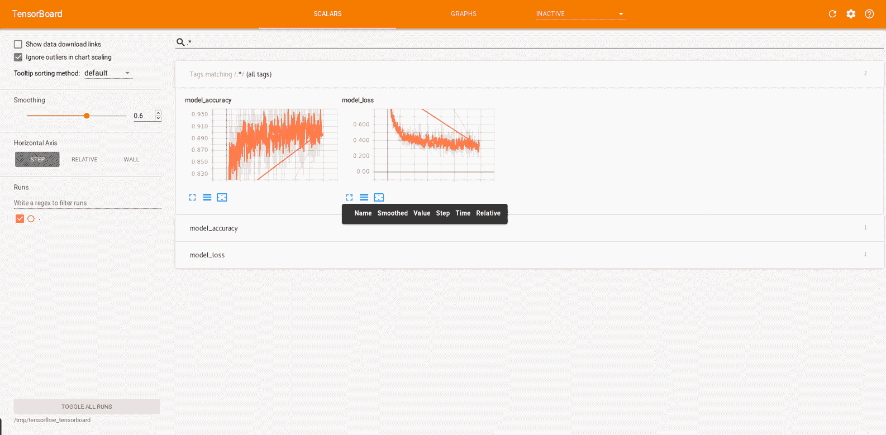

这将显示我们监控的变量，如模型的准确度以及它是如何逐渐提高的，模型的损失函数及其如何逐渐降低。因此，你会看到我们在这里经历了一个正常的学习过程。但有时你会发现准确度和模型损失会随机变化，或者你想跟踪一些变量及其在会话期间的变化，这时 TensorBoard 将非常有用，帮助你发现任何随机性或错误。

如果切换到 TensorBoard 的 GRAPHS 标签页，你将看到我们在前面的代码中构建的计算图：

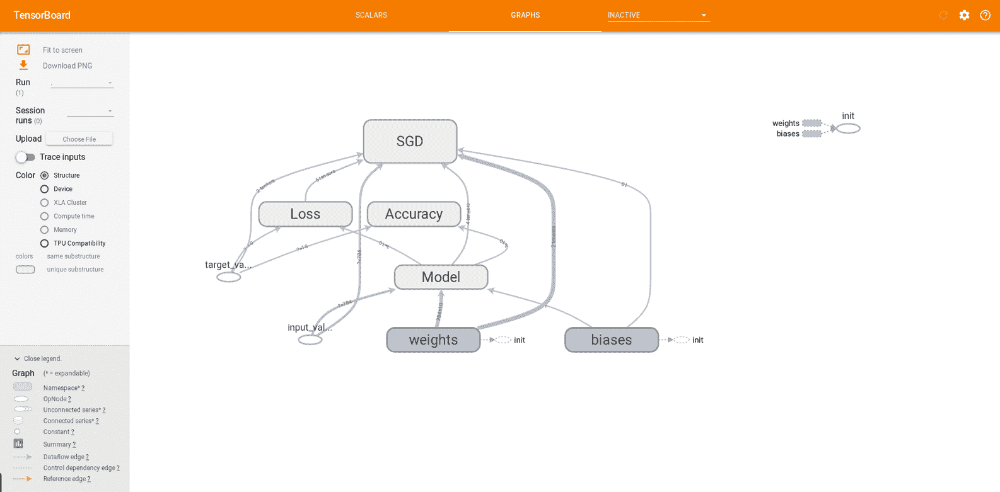

# 摘要

在本章中，我们涵盖了 Ubuntu 和 Mac 的安装过程，介绍了 TensorFlow 编程模型，并解释了可用于构建复杂操作的不同类型的简单节点，以及如何通过会话对象从 TensorFlow 获取输出。我们还介绍了 TensorBoard，并说明了它在调试和分析复杂深度学习应用中的重要性。

接下来，我们将简单解释神经网络及多层神经网络背后的直觉。我们还将涵盖一些 TensorFlow 的基本示例，并演示如何将其用于回归和分类问题。
