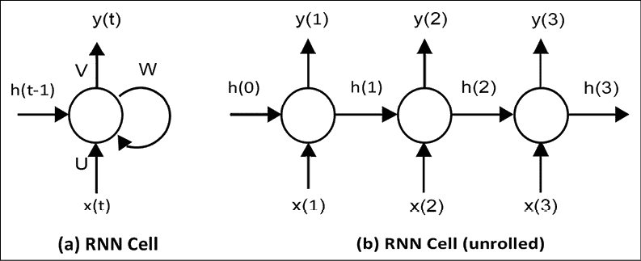
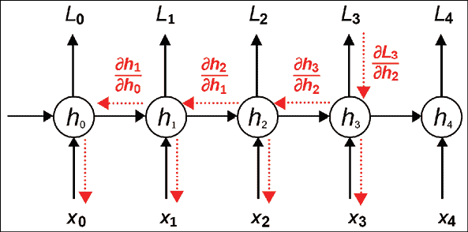
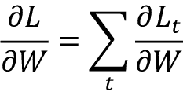
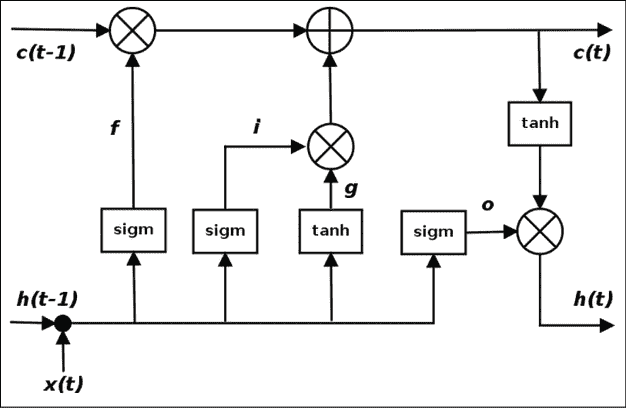
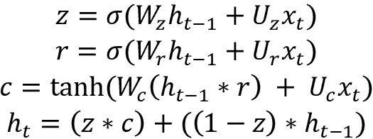
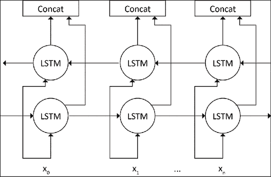
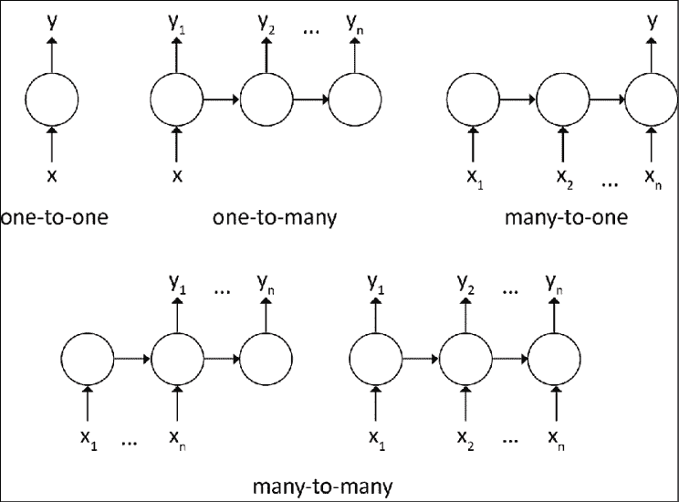
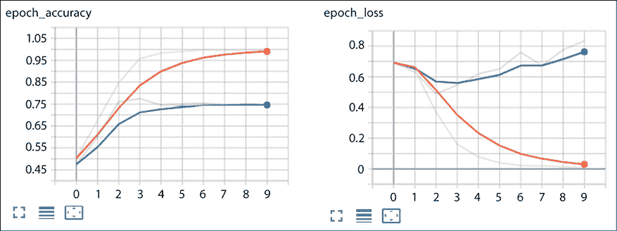
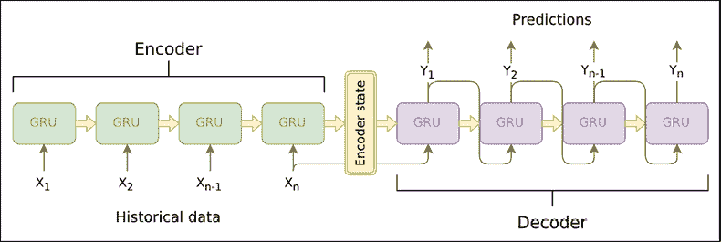
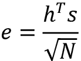

# 循环神经网络

在*第三章*中，我们学习了**卷积神经网络**（**CNNs**），并了解了它们如何利用输入的空间几何特性。例如，CNNs 在图像处理中，最初对图像的小块进行卷积操作，然后通过池化操作逐步扩大到图像的更大区域。图像的卷积和池化操作是二维的：宽度和高度。而对于音频和文本流，则沿时间维度应用一维卷积和池化操作；对于视频流，这些操作是在三个维度上进行的：高度、宽度和时间维度。

本章将重点介绍**循环神经网络**（**RNNs**），这是一类广泛应用于文本输入的神经网络。RNN 非常灵活，已被用于解决语音识别、语言建模、机器翻译、情感分析、图像描述等问题。RNN 充分利用了输入的顺序特性。顺序输入可以是文本、语音、时间序列，或者任何其他元素的出现依赖于前一个元素的序列。在本章中，我们将看到各种 RNN 的示例，并学习如何使用 TensorFlow 实现它们。

我们将首先了解基本的 RNN 单元及其如何处理输入中的这些顺序依赖关系。我们还将学习基本 RNN 单元（在 Keras 中实现为 SimpleRNN）的一些局限性，并查看两个流行的 SimpleRNN 变体——**长短期记忆**（**LSTM**）和**门控循环单元**（**GRU**）——是如何克服这些局限性的。

然后，我们将放大一个层次，考虑 RNN 层本身，它就是将 RNN 单元应用于每个时间步。RNN 可以被视为一个由 RNN 单元组成的图，每个单元在序列的连续元素上执行相同的操作。我们将描述一些简单的修改以提高性能，例如使 RNN 双向和/或有状态。

最后，我们来看一些标准的 RNN 拓扑结构及其可以解决的应用问题。通过重新排列图中的单元，RNN 可以适应不同类型的应用。我们将看到这些配置的一些示例，并了解它们如何用来解决特定问题。我们还将讨论序列到序列（或 seq2seq）架构，该架构在机器翻译和其他多个领域取得了巨大的成功。然后，我们将探讨什么是注意力机制，以及如何利用它提高序列到序列架构的性能。

在本章中，我们将介绍以下主题：

+   基本 RNN 单元

+   RNN 单元变体

+   RNN 变体

+   RNN 拓扑结构

+   编码器-解码器架构 – seq2seq

+   注意力机制

本章的所有代码文件可以在[`packt.link/dltfchp5`](https://packt.link/dltfchp5)找到。

常说千里之行始于足下，因此，为了体现这一精神，让我们从考虑 RNN 单元开始，来启动我们对 RNN 的学习。

# 基本的 RNN 单元

传统的多层感知器神经网络假设所有输入之间是相互独立的。这一假设对于许多类型的序列数据来说并不成立。例如，句子中的单词、音乐作品中的音符、股票价格随时间变化，甚至化合物中的分子，都是典型的序列数据，其中一个元素会依赖于前面的元素。

RNN 单元通过具有隐藏状态或记忆来实现这一依赖关系，隐藏状态保存了到目前为止所看到的本质信息。任意时刻隐藏状态的值是前一时刻隐藏状态的值和当前时刻输入值的函数，即：


在这里，*h*[t] 和 *h*[t][-1] 分别是时刻 *t* 和 *t-1* 的隐藏状态值，*x*[t] 是时刻 *t* 的输入值。注意，这个方程是递归的，即 *h*[t][-1] 可以用 *h*[t][-2] 和 *x*[t-1] 表示，依此类推，直到序列的开始。这就是 RNN 如何编码和融合来自任意长序列的信息。

我们还可以像 *图 5.1(a)* 中那样图示化地表示 RNN 单元。在时刻 *t*，该单元有一个输入 *x(t)* 和输出 *y(t)*。部分输出 *y(t)*（由隐藏状态 *h*[t] 表示）会被反馈到单元中，以便在后续的时间步 *t+1* 使用。

就像传统的神经网络中，学习到的参数存储为权重矩阵一样，RNN 的参数由三个权重矩阵 *U*、*V* 和 *W* 定义，分别对应输入、输出和隐藏状态的权重：



图 5.1： (a) RNN 单元的示意图；(b) 展开视图中的 RNN 单元

*图 5.1(b)* 显示了一个“展开视图”的相同 RNN。展开只是意味着我们将网络绘制出来，覆盖整个序列。这里显示的网络有三个时间步，适用于处理包含三个元素的序列。请注意，我们之前提到的权重矩阵 *U*、*V* 和 *W* 在每个时间步之间是共享的。这是因为我们在每个时间步对不同的输入应用相同的操作。能够在所有时间步之间共享这些权重大大减少了 RNN 需要学习的参数数量。

我们还可以通过方程来描述 RNN 作为计算图。RNN 在时间 *t* 时的内部状态由隐藏向量 *h(t)* 的值表示，*h(t)* 是权重矩阵 *W* 和时间 *t-1* 时刻的隐藏状态 *h*[t][-1] 的和，以及时间 *t* 时刻的输入 *x*[t] 与权重矩阵 *U* 的乘积，再经过 `tanh` 激活函数。选择 `tanh` 而非其他激活函数（如 sigmoid）是因为它在实际学习中更为高效，并且有助于解决梯度消失问题，后者我们将在本章后面学习到。

为了简便起见，在本章中描述不同类型的 RNN 架构的所有方程中，我们省略了对偏置项的明确引用，而是将其并入矩阵中。考虑以下一个 n 维空间中的直线方程。这里，*w*[1] 到 *w*[n] 是每个维度中直线的系数，偏置 *b* 是每个维度上的 y 截距：


我们可以将方程改写为矩阵表示如下：


这里，*W* 是一个形状为 (*m, n*) 的矩阵，*b* 是一个形状为 (*m, 1*) 的向量，其中 *m* 是对应于我们数据集中记录的行数，*n* 是每条记录对应的特征列数。等效地，我们可以通过将 *b* 向量作为 *W* 的“单位”特征列，将其折叠到 *W* 矩阵中，从而去掉向量 *b*。因此：


这里，*W’* 是一个形状为 (*m, n+1*) 的矩阵，最后一列包含偏置 *b* 的值。

结果是，这种符号表示方式更为紧凑，并且（我们认为）更容易理解和记忆。

在时间*t*时刻，输出向量 *y*[t] 是权重矩阵 *V* 和隐藏状态 *h*[t] 的乘积，经过 softmax 激活函数处理后，得到的向量是一个输出概率集合：


Keras 提供了 SimpleRNN 循环层，它包含了我们到目前为止看到的所有逻辑，以及更高级的变种，如 LSTM 和 GRU，我们将在本章后面学习到。严格来说，理解它们的工作原理并不是构建它们的必要条件。

然而，当你需要构建自己的专用 RNN 单元来解决特定问题时，理解结构和方程是非常有帮助的。

现在我们已经理解了数据在 RNN 单元中的前向流动，即它如何将输入和隐藏状态结合起来，生成输出和下一个隐藏状态，我们现在来分析梯度在反向传播中的流动。这一过程称为**时间反向传播**（**BPTT**）。

## 时间反向传播（BPTT）

与传统的神经网络类似，训练 RNN 同样涉及梯度的反向传播。不同之处在于，由于权重在所有时间步之间共享，每个输出的梯度不仅依赖于当前时间步，还依赖于之前的时间步。这一过程称为通过时间的反向传播（BPTT）[11]。因为在 RNN 中，权重*U*、*V*和*W*在不同时间步之间是共享的，所以我们需要将不同时间步的梯度进行累加。这是传统反向传播与 BPTT 之间的关键区别。

考虑图 5.2 所示的具有五个时间步的 RNN。在前向传播过程中，网络在时间*t*生成预测值*ŷ*[t]，并与标签*y*[t]进行比较，以计算损失*L*[t]。在反向传播过程中（由虚线表示），损失对权重*U*、*V*和*W*的梯度在每个时间步计算出来，并通过梯度的累加更新参数：



图 5.2：通过时间反向传播

下式展示了损失对*W*的梯度。我们关注这个权重，因为它是导致所谓的消失梯度和爆炸梯度问题的原因。

这个问题表现为损失的梯度接近零或无穷大，从而使网络难以训练。为了理解为什么会发生这种情况，考虑我们之前看到的简单 RNN 的方程；隐藏状态*h*[t]依赖于*h*[t][-1]，而*h*[t][-1]又依赖于*h*[t][-2]，依此类推：



现在我们来看一下在时间步*t=3*时，梯度会发生什么变化。根据链式法则，损失对*W*的梯度可以分解为三个子梯度的乘积。隐藏状态*h*[2]相对于*W*的梯度可以进一步分解为每个隐藏状态相对于前一个状态的梯度之和。最终，每个隐藏状态相对于前一个状态的梯度可以进一步分解为当前隐藏状态与前一个隐藏状态梯度的乘积：


类似的计算也用于计算其他损失 *L*[0] 到 *L*[4] 对 *W* 的梯度，并将它们加总成 *W* 的梯度更新。我们在本书中不会进一步探讨这些数学推导，但这篇 WildML 博客文章[12]对 BPTT 提供了非常好的解释，包括该过程背后的数学推导。

## 消失梯度和爆炸梯度

BPTT 特别容易受到消失梯度和爆炸梯度问题的影响，原因在于表达式中代表损失对*W*的梯度最终公式的乘积部分。考虑一下，隐藏状态相对于前一状态的个别梯度小于 1 的情况。

当我们在多个时间步上进行反向传播时，梯度的乘积会变得越来越小，最终导致梯度消失问题。类似地，如果梯度大于 1，乘积会变得越来越大，最终导致梯度爆炸问题。

在这两种情况中，梯度爆炸更容易被检测到。梯度会变得非常大，最终变为 **非数字** (**NaN**)，导致训练过程崩溃。梯度爆炸可以通过将其裁剪到预定义的阈值来控制 [13]。TensorFlow 2.0 允许在优化器构建期间通过 `clipvalue` 或 `clipnorm` 参数裁剪梯度，或者通过 `tf.clip_by_value` 显式裁剪梯度。

梯度消失的影响是，来自远距离时间步的梯度对学习过程没有任何贡献，因此 RNN 最终无法学习任何长期依赖关系。虽然有一些方法可以最小化这个问题，例如适当初始化 *W* 矩阵、更加激进的正则化、使用 ReLU 替代 `tanh` 激活函数、以及使用无监督方法对层进行预训练，但最流行的解决方案是使用 LSTM 或 GRU 架构，这两者将在后续讲解。这些架构被设计用来处理梯度消失问题，并更有效地学习长期依赖关系。

# RNN 单元变种

本节中，我们将探讨一些 RNN 的单元变种。我们将首先看看 SimpleRNN 单元的一个变种：LSTM RNN。

## 长短期记忆（LSTM）

LSTM 是一种 SimpleRNN 单元的变种，能够学习长期依赖关系。LSTM 最早由 Hochreiter 和 SchmidHuber [14] 提出，并经过许多其他研究者的改进。它们在多种问题上表现良好，是最广泛使用的 RNN 变种。

我们已经看到，SimpleRNN 如何通过一个 `tanh` 层将前一时间步的隐藏状态与当前输入结合来实现递归。LSTM 也以类似的方式实现递归，但它们并非使用单一的 `tanh` 层，而是有四个层以非常特定的方式相互作用。*图 5.3* 展示了在时间步 *t* 时，隐藏状态所应用的变换。

图示看起来比较复杂，但让我们一个一个地来看。图表顶部的线是单元的细胞状态 *c*，表示单元的内部记忆。

图表底部的线是隐藏状态 *h*，而 *i*、*f*、*o* 和 *g* 门是 LSTM 解决梯度消失问题的机制。在训练过程中，LSTM 会学习这些门的参数：



图 5.3：LSTM 单元

另一种理解 LSTM 单元中这些门如何工作的方式是，考虑该单元的方程式。这些方程描述了如何从先前时间步长的隐藏状态 *h*[t-1] 计算出时间 *t* 时的隐藏状态 *h*[t]。一般来说，基于方程的描述通常更清晰、更简洁，也是学术论文中展示新单元设计时常用的方式。提供的图示可能与之前看到的有所不同，因此，学习如何阅读方程式并想象单元设计通常更为合理。为此，本书中将仅通过方程式描述其他单元变体。

代表 LSTM 的一组方程式如下所示：


这里，*i*、*f* 和 *o* 是输入门、遗忘门和输出门。它们是通过相同的方程式计算的，只是参数矩阵不同，分别为 *W*[i]、*U*[i]、*W*[f]、*U*[f] 和 *W*[o]、*U*[o]。Sigmoid 函数将这些门的输出值调节到 0 和 1 之间，因此，产生的输出向量可以逐元素与另一个向量相乘，以定义第二个向量可以通过第一个向量的程度。

遗忘门定义了你希望允许多少先前状态 *h*[t][-1] 通过。输入门定义了你希望多少当前输入 *x*[t] 新计算的状态可以通过，而输出门则定义了你希望多少内部状态暴露给下一层。内部隐藏状态 *g* 是基于当前输入 *x*[t] 和先前隐藏状态 *h*[t][-1] 计算出来的。注意，*g* 的方程式与 SimpleRNN 中的相同，只是这次我们将通过输入向量 *i* 的输出来调节输出。

给定 *i*、*f*、*o* 和 *g*，我们现在可以计算在时间 *t* 时的细胞状态 *c*[t]，它等于在时间 (*t-1*) 时的细胞状态 *c*[t][-1]，乘以遗忘门 *g* 的值，再加上状态 *g* 乘以输入门 *i* 的值。这基本上是一种结合旧记忆和新输入的方法——将遗忘门设置为 0 会忽略旧记忆，而将输入门设置为 0 则会忽略新计算的状态。最后，时间 *t* 时的隐藏状态 *h*[t] 是通过时间 *t* 的记忆 *c*[t] 和输出门 *o* 计算得出的。

需要了解的一点是，LSTM 可以作为 SimpleRNN 单元的直接替代品；唯一的区别是 LSTM 能够防止梯度消失问题。你可以在网络中用 LSTM 替换 RNN 单元，而无需担心任何副作用。通常你会看到更好的结果，尽管训练时间会更长。

TensorFlow 2.0 还提供了基于 Shi 等人 [18] 论文的 ConvLSTM2D 实现，其中矩阵乘法被卷积运算符取代。

如果您想了解更多关于 LSTM 的内容，请查看 WildML 的 RNN 教程 [15] 和 Christopher Olah 的博客文章 [16]。第一篇教程详细介绍了 LSTM，第二篇教程则以非常直观的方式一步一步带您了解计算过程。

现在我们已经介绍了 LSTM，我们将介绍另一种流行的 RNN 单元架构——GRU。

## 门控循环单元（GRU）

GRU 是 LSTM 的变体，由 Cho 等人 [17] 提出。它保留了 LSTM 对消失梯度问题的抗性，但其内部结构更简单，因此训练速度更快，因为更新隐藏状态所需的计算量较少。

与 LSTM 单元中的输入 (*i*)、遗忘 (*f*) 和输出 (*o*) 门不同，GRU 单元有两个门，一个是更新门 *z*，另一个是重置门 *r*。更新门定义了保留多少先前的记忆，重置门定义了如何将新输入与先前的记忆结合。与 LSTM 中的隐藏状态不同，GRU 中没有持久的单元状态。

GRU 单元定义了通过以下一组方程，从前一时间步的隐藏状态 *h*[t][-1] 计算当前时间 *t* 的隐藏状态 *h*[t]：



更新门 *z* 和重置门 *r* 的输出都是通过前一隐藏状态 *h*[t][-1] 和当前输入 *x*[t] 的组合来计算的。Sigmoid 函数调节这些函数的输出值在 0 到 1 之间。单元状态 *c* 是作为重置门 *r* 和输入 *x*[t] 输出的函数来计算的。最后，时间 *t* 的隐藏状态 *h*[t] 是作为单元状态 *c* 和前一隐藏状态 *h*[t][-1] 的函数来计算的。参数 *W*[z]、*U*[z]、*W*[r]、*U*[r]、*W*[c]、*U*[c] 会在训练过程中进行学习。

类似于 LSTM，TensorFlow 2.0（`tf.keras`）也提供了基本 GRU 层的实现，它是 RNN 单元的替代品。

## Peephole LSTM

Peephole LSTM 是一种 LSTM 变体，最早由 Gers 和 Schmidhuber 提出 [19]。它向输入、遗忘和输出门添加了“窥视孔”，因此它们可以看到之前的单元状态 *c*[t][-1]。计算在 peephole LSTM 中，从前一时间步的隐藏状态 *h*[t][-1] 到当前时间 *t* 的隐藏状态 *h*[t] 的方程式如下所示。

请注意，与 LSTM 方程式的唯一区别是额外的 *c*[t][-1] 项，用于计算输入 (*i*)、遗忘 (*f*) 和输出 (*o*) 门的输出：


TensorFlow 2.0 提供了一个实验性的 peephole LSTM 单元实现。要在自己的 RNN 层中使用此功能，您需要将该单元（或单元列表）包装在 RNN 包装器中，如下所示的代码片段所示：

```py
hidden_dim = 256
peephole_cell = tf.keras.experimental.PeepholeLSTMCell(hidden_dim)
rnn_layer = tf.keras.layers.RNN(peephole_cell) 
```

在前一节中，我们介绍了一些为了针对基本 RNN 单元的特定不足而开发的 RNN 单元变体。在下一节中，我们将探讨 RNN 网络架构本身的变体，这些变体是为了应对特定的使用场景而构建的。

# RNN 变体

在这一节中，我们将介绍一些基本 RNN 架构的变体，这些变体在某些特定情况下可以提供性能改进。请注意，这些策略可以应用于不同种类的 RNN 单元，以及不同的 RNN 拓扑结构，我们将在后续学习中了解这些拓扑结构。

## 双向 RNN

我们已经看到，在任何给定的时间步 *t*，RNN 的输出依赖于所有之前时间步的输出。然而，完全有可能输出也依赖于未来的输出。这对于自然语言处理等应用尤为重要，在这些应用中，我们试图预测的单词或短语的属性可能依赖于整个句子所给出的上下文，而不仅仅是前面的单词。

这个问题可以通过使用双向 LSTM 来解决（见 *图 5.4*），它也被称为 biLSTM，实际上是两个 RNN 堆叠在一起，一个从左到右读取输入，另一个从右到左读取输入。

每个时间步的输出将基于两个 RNN 的隐藏状态。双向 RNN 允许网络对序列的开始和结束部分给予同等的关注，通常会导致性能的提升：



图 5.4：双向 LSTM

TensorFlow 2.0 通过一个双向包装层支持双向 RNN。为了使 RNN 层变成双向，只需要用这个包装层将其包裹起来，具体如下所示。由于 biLSTM 中左右 LSTM 的每一对单元的输出是连接在一起的（见 *图 5.4*），因此需要返回每个单元的输出。因此，我们将 `return_sequences` 设置为 `True`（默认值是 `False`，意味着只返回 LSTM 中最后一个单元的输出）：

```py
self.lstm = tf.keras.layers.Bidirectional(
    tf.keras.layers.LSTM(10, return_sequences=True, 
        input_shape=(5, 10))
) 
```

我们将要介绍的下一个主要 RNN 变体是有状态的 RNN。

## 有状态的 RNN

RNN 可以是有状态的，这意味着它们可以在训练期间跨批次保持状态。也就是说，为一批训练数据计算的隐藏状态将作为下一批训练数据的初始隐藏状态。然而，这需要显式设置，因为 TensorFlow 2.0（`tf.keras`）中的 RNN 默认是无状态的，并且在每个批次之后会重置状态。将 RNN 设置为有状态意味着它可以在训练序列中构建状态，甚至在进行预测时保持该状态。

使用有状态 RNN 的好处是网络规模更小和/或训练时间更短。缺点是我们现在需要使用一个反映数据周期性的批量大小来训练网络，并在每个训练周期后重置状态。此外，在训练网络时，数据不应被打乱，因为数据的呈现顺序对有状态网络来说是相关的。

要将 RNN 层设置为有状态，请将命名变量 stateful 设置为`True`。在我们关于学习如何生成文本的单对多拓扑示例中，我们提供了一个使用有状态 RNN 的示例。在这里，我们使用由连续文本切片组成的数据进行训练，因此将 LSTM 设置为有状态意味着从前一个文本片段生成的隐藏状态会被重用于当前的文本片段。

在下一节关于 RNN 拓扑结构中，我们将探讨如何为不同的使用案例设置 RNN 网络。

# RNN 拓扑结构

我们已经看过如何将 MLP 和 CNN 架构组合成更复杂的网络。RNN 提供了另一个自由度，它允许序列的输入和输出。这意味着 RNN 单元可以以不同的方式排列，构建出适应于解决不同类型问题的网络。*图 5.5*展示了输入、隐藏层和输出的五种不同配置。

其中，第一个（单对单）从序列处理的角度来看并不有趣，因为它可以通过一个简单的密集网络实现，只有一个输入和一个输出。

单对多的案例有一个输入并输出一个序列。这样一个网络的示例可能是从图像中生成文本标签的网络[6]，这些标签包含图像不同方面的简短文本描述。这样的网络将使用图像输入和表示图像标签的标注文本序列进行训练：



图 5.5：常见的 RNN 拓扑结构

多对一的案例则相反；它接受一个序列的张量作为输入，但输出一个单一的张量。这样的网络示例可能是情感分析网络[7]，它以一段文本（如电影评论）为输入，并输出一个单一的情感值。

多对多的使用案例有两种变体。第一种更为流行，更广为人知的是 seq2seq 模型。在这个模型中，一个序列被读取并生成一个上下文向量，代表输入序列，用于生成输出序列。

该拓扑结构在机器翻译领域取得了巨大成功，也适用于可以重新框架为机器翻译问题的问题。前者的现实生活示例可以在[8, 9]中找到，后者的示例描述在[10]中。

第二种多对多类型的网络中，每个输入单元都有一个对应的输出单元。这种网络适用于输入和输出之间有 1:1 对应关系的用例，例如时间序列。这个模型与 seq2seq 模型的主要区别在于，在解码过程开始之前，输入不必完全编码。

在接下来的三个部分中，我们提供一个学习生成文本的一对多网络示例，一个进行情感分析的多对一网络示例，以及第二类型的多对多网络示例，该网络预测句子中单词的词性。由于 seq2seq 网络的普及，我们稍后会在本章节中更详细地介绍它。

## 示例 ‒ 一对多 – 学习生成文本

RNN 在自然语言处理（NLP）社区被广泛用于各种应用中。其中一种应用是构建语言模型。语言模型允许我们预测给定先前单词的文本中下一个单词的概率。语言模型对于各种高级任务如机器翻译、拼写校正等非常重要。

语言模型预测序列中下一个单词的能力使其成为一个生成模型，通过从词汇表中不同单词的输出概率中进行采样，我们可以生成文本。训练数据是单词序列，标签是在序列的下一个时间步出现的单词。

作为例子，我们将在 Lewis Carroll 的儿童故事《爱丽丝梦游仙境》及其续集《爱丽丝镜中奇遇记》的文本上训练一个基于字符的 RNN。我们选择建立一个基于字符的模型，因为它具有较小的词汇量并且训练速度更快。其思想与训练和使用基于单词的语言模型相同，只是我们将使用字符而不是单词。训练完成后，该模型可以用于以相同风格生成一些文本。

我们示例中的数据将来自 Project Gutenberg 网站[36]上两部小说的纯文本。网络的输入是 100 个字符的序列，对应的输出是输入序列后移一个位置的另一个 100 个字符的序列。

换句话说，如果输入是序列[*c*[1], *c*[2], …, *c*[n]]，输出将是[*c*[2], *c*[3], …, *c*[n+1]]。我们将训练网络 50 个 epochs，在每个 10 个 epochs 的末尾，我们将生成一个以标准前缀开始的固定大小字符序列。在以下示例中，我们使用了前缀“爱丽丝”，这是我们小说中主人公的名字。

和往常一样，我们将首先导入必要的库并设置一些常量。这里，`DATA_DIR`指向您下载本章源代码所在位置下的数据文件夹。`CHECKPOINT_DIR`是该数据文件夹下的一个存储每 10 个 epochs 结束时模型权重的检查点文件夹：

```py
import os
import numpy as np
import re
import shutil
import tensorflow as tf
DATA_DIR = "./data"
CHECKPOINT_DIR = os.path.join(DATA_DIR, "checkpoints") 
```

接下来，我们将下载并准备网络所需的数据。这两本书的文本可以从 Project Gutenberg 网站上公开获取。`tf.keras.utils.get_file()` 函数会检查文件是否已经下载到本地磁盘，如果没有，它将下载到代码所在位置的 `datasets` 文件夹下。我们还会稍微预处理一下输入，去除文本中的换行符和字节顺序标记字符。此步骤将创建 `texts` 变量，它是这两本书的一个字符扁平化列表：

```py
def download_and_read(urls):
    texts = []
    for i, url in enumerate(urls):
        p = tf.keras.utils.get_file("ex1-{:d}.txt".format(i), url,
            cache_dir=".")
        text = open(p, "r").read()
        # remove byte order mark
        text = text.replace("\ufeff", "")
        # remove newlines
        text = text.replace('\n', ' ')
        text = re.sub(r'\s+', " ", text)
        # add it to the list
        texts.extend(text)
    return texts
texts = download_and_read([
    "http://www.gutenberg.org/cache/epub/28885/pg28885.txt",
    "https://www.gutenberg.org/files/12/12-0.txt"
]) 
```

接下来，我们将创建我们的词汇表。在我们的案例中，词汇表包含 90 个独特的字符，由大小写字母、数字和特殊字符组成。我们还创建了一些映射字典，将每个词汇字符转换为唯一整数，并且反之亦然。正如前面所提到的，网络的输入和输出是字符序列。

然而，网络的实际输入和输出是整数序列，我们将使用这些映射字典来处理这种转换：

```py
# create the vocabulary
vocab = sorted(set(texts))
print("vocab size: {:d}".format(len(vocab)))
# create mapping from vocab chars to ints
char2idx = {c:i for i, c in enumerate(vocab)}
idx2char = {i:c for c, i in char2idx.items()} 
```

下一步是使用这些映射字典将我们的字符序列输入转换为整数序列，然后转换为 TensorFlow 数据集。每个序列将包含 100 个字符，输出将比输入偏移 1 个字符位置。我们首先将数据集批量化为 101 个字符的切片，然后对数据集的每个元素应用 `split_train_labels()` 函数，以创建我们的序列数据集，该数据集由包含两个元素的元组组成，每个元素是一个大小为 100、类型为 `tf.int64` 的向量。然后我们对这些序列进行洗牌，并为每个输入到网络的序列创建 64 个元组的批次。现在，数据集的每个元素都是一个由两个矩阵组成的元组，每个矩阵的大小为 (64, 100)，类型为 `tf.int64`：

```py
# numericize the texts
texts_as_ints = np.array([char2idx[c] for c in texts])
data = tf.data.Dataset.from_tensor_slices(texts_as_ints)
# number of characters to show before asking for prediction
# sequences: [None, 100]
seq_length = 100
sequences = data.batch(seq_length + 1, drop_remainder=True)
def split_train_labels(sequence):
    input_seq = sequence[0:-1]
    output_seq = sequence[1:]
    return input_seq, output_seq
sequences = sequences.map(split_train_labels)
# set up for training
# batches: [None, 64, 100]
batch_size = 64
steps_per_epoch = len(texts) // seq_length // batch_size
dataset = sequences.shuffle(10000).batch(
    batch_size, drop_remainder=True) 
```

我们现在准备好定义我们的网络。像之前一样，我们将网络定义为 `tf.keras.Model` 的子类，如下所示。网络结构相对简单；它以大小为 100（`num_timesteps`）的整数序列作为输入，并通过一个嵌入层将每个整数转换为大小为 256（`embedding_dim`）的向量。因此，假设批次大小为 64，对于大小为 (64, 100) 的输入序列，嵌入层的输出将是一个形状为 (64, 100, 256) 的矩阵。

下一层是一个具有 100 个时间步的 RNN 层。选择的 RNN 实现是 GRU。该 GRU 层将在每个时间步接收一个大小为 (256,) 的向量，并输出一个形状为 (1024,) 的向量（`rnn_output_dim`）。还需要注意的是，RNN 是有状态的，这意味着从前一训练周期输出的隐藏状态将作为当前周期的输入。`return_sequences=True` 标志还表示 RNN 会在每个时间步输出，而不是仅在最后一个时间步输出聚合结果。

最后，每个时间步都会发出一个形状为(1024,)的向量，进入一个密集层，该层输出一个形状为(90,)的向量（`vocab_size`）。该层的输出将是一个形状为(64, 100, 90)的张量。输出向量中的每个位置对应于我们词汇表中的一个字符，值对应于该字符在该输出位置出现的概率：

```py
class CharGenModel(tf.keras.Model):
    def __init__(self, vocab_size, num_timesteps,
            embedding_dim, **kwargs):
        super(CharGenModel, self).__init__(**kwargs)
        self.embedding_layer = tf.keras.layers.Embedding(
            vocab_size,
            embedding_dim
        )
        self.rnn_layer = tf.keras.layers.GRU(
            num_timesteps,
            recurrent_initializer="glorot_uniform",
            recurrent_activation="sigmoid",
            stateful=True,
            return_sequences=True)
        self.dense_layer = tf.keras.layers.Dense(vocab_size)
    def call(self, x):
        x = self.embedding_layer(x)
        x = self.rnn_layer(x)
        x = self.dense_layer(x)
        return x
vocab_size = len(vocab)
embedding_dim = 256
model = CharGenModel(vocab_size, seq_length, embedding_dim)
model.build(input_shape=(batch_size, seq_length)) 
```

接下来，我们定义一个损失函数并编译我们的模型。我们将使用稀疏类别交叉熵作为损失函数，因为当输入和输出是整数序列时，这是标准的损失函数。对于优化器，我们将选择 Adam 优化器：

```py
def loss(labels, predictions):
    return tf.losses.sparse_categorical_crossentropy(
        labels,
        predictions,
        from_logits=True
    )
model.compile(optimizer=tf.optimizers.Adam(), loss=loss) 
```

通常，输出中每个位置的字符是通过计算该位置向量的 argmax 来找到的，也就是说，找到与最大概率值对应的字符。这被称为贪婪搜索。在语言模型中，其中一个时间步的输出作为下一个时间步的输入，这可能会导致输出重复。克服这个问题的两种常见方法是要么随机抽样输出，要么使用束搜索，在每个时间步从最可能的*k*个值中进行抽样。在这里，我们将使用`tf.random.categorical()`函数来随机抽样输出。以下函数接受一个字符串作为前缀，并利用它生成一个长度由`num_chars_to_generate`指定的字符串。温度参数用于控制预测的质量。较低的值会生成更可预测的输出。

逻辑遵循一个可预测的模式。我们将`prefix_string`中的字符序列转换为整数序列，然后通过`expand_dims`添加一个批次维度，以便将输入传递到我们的模型中。接着我们重置模型的状态。这是必要的，因为我们的模型是有状态的，我们不希望预测过程中的第一个时间步的隐藏状态被训练时计算出的状态所继承。然后，我们将输入传递通过模型并得到预测结果。这是一个形状为(90,)的向量，表示词汇表中每个字符在下一时间步出现的概率。接下来，我们通过去除批次维度并除以温度参数来重塑预测结果，然后从向量中随机抽样。我们将预测结果作为下一时间步的输入。我们重复这一过程，直到生成所需数量的字符，并将每次预测转换回字符形式，积累到一个列表中，最后在循环结束时返回该列表：

```py
def generate_text(model, prefix_string, char2idx, idx2char,
        num_chars_to_generate=1000, temperature=1.0):
    input = [char2idx[s] for s in prefix_string]
    input = tf.expand_dims(input, 0)
    text_generated = []
    model.reset_states()
    for i in range(num_chars_to_generate):
        preds = model(input)
        preds = tf.squeeze(preds, 0) / temperature
        # predict char returned by model
        pred_id = tf.random.categorical(
            preds, num_samples=1)[-1, 0].numpy()
        text_generated.append(idx2char[pred_id])
        # pass the prediction as the next input to the model
        input = tf.expand_dims([pred_id], 0)
    return prefix_string + "".join(text_generated) 
```

最后，我们准备好运行训练和评估循环。如前所述，我们将训练网络 50 个周期，每隔 10 个周期，我们将尝试用迄今为止训练的模型生成一些文本。每个阶段的前缀是字符串 `"Alice "`。请注意，为了适应单个字符串前缀，我们会在每隔 10 个周期保存一次权重，并使用这些权重构建一个单独的生成模型，但输入形状的批量大小为 1。以下是执行此操作的代码：

```py
num_epochs = 50
for i in range(num_epochs // 10):
    model.fit(
        dataset.repeat(),
        epochs=10,
        steps_per_epoch=steps_per_epoch
        # callbacks=[checkpoint_callback, tensorboard_callback]
    )
    checkpoint_file = os.path.join(
        CHECKPOINT_DIR, "model_epoch_{:d}".format(i+1))
    model.save_weights(checkpoint_file)
    # create generative model using the trained model so far
    gen_model = CharGenModel(vocab_size, seq_length, embedding_dim)
    gen_model.load_weights(checkpoint_file)
    gen_model.build(input_shape=(1, seq_length))
    print("after epoch: {:d}".format(i+1)*10)
    print(generate_text(gen_model, "Alice ", char2idx, idx2char))
    print("---") 
```

训练的第一次周期后的输出包含一些完全无法解读的单词：

```py
Alice nIPJtce otaishein r. henipt il nn tu t hen mlPde hc efa hdtioDDeteeybeaewI teu"t e9B ce nd ageiw  eai rdoCr ohrSI ey Pmtte:vh ndte taudhor0-gu s5'ria,tr gn inoo luwomg Omke dee sdoohdn ggtdhiAoyaphotd t- kta e c t- taLurtn   hiisd tl'lpei od y' tpacoe dnlhr oG mGhod ut hlhoy .i, sseodli., ekngnhe idlue'aa'  ndti-rla nt d'eiAier adwe ai'otteniAidee hy-ouasq"plhgs tuutandhptiw  oohe.Rastnint:e,o odwsir"omGoeuall1*g taetphhitoge ds wr li,raa,  h$jeuorsu  h cidmdg't ku..n,HnbMAsn nsaathaa,' ase woe  ehf re ig"hTr ddloese eod,aed toe rh k. nalf bte seyr udG n,ug lei hn icuimty"onw Qee ivtsae zdrye g eut rthrer n sd,Zhqehd' sr caseruhel are fd yse e  kgeiiday odW-ldmkhNw endeM[harlhroa h Wydrygslsh EnilDnt e "lue "en wHeslhglidrth"ylds rln n iiato taue flitl nnyg ittlno re 'el yOkao itswnadoli'.dnd Akib-ehn hftwinh yd ee tosetf tonne.;egren t wf, ota nfsr, t&he desnre e" oo fnrvnse aid na tesd is ioneetIf ·itrn tttpakihc s nih'bheY ilenf yoh etdrwdplloU ooaeedo,,dre snno'ofh o epst. lahehrw 
```

然而，在大约训练了 30 个周期后，我们开始看到一些看起来熟悉的单词：

```py
Alice Red Queen. He best I had defores it,' glily do flose time it makes the talking of find a hand mansed in she loweven to the rund not bright prough: the and she a chill be the sand using that whever sullusn--the dear of asker as 'IS now-- Chich the hood." "Oh!"' '_I'm num about--again was wele after a WAG LoANDE BITTER OF HSE!0 UUL EXMENN 1*.t, this wouldn't teese to Dumark THEVER Project Gutenberg-tmy of himid out flowal woulld: 'Nis song, Eftrin in pully be besoniokinote. "Com, contimemustion--of could you knowfum to hard, she can't the with talking to alfoeys distrint, for spacemark!' 'You gake to be would prescladleding readieve other togrore what it mughturied ford of it was sen!" You squs, _It I hap: But it was minute to the Kind she notion and teem what?" said Alice, make there some that in at the shills distringulf out to the Froge, and very mind to it were it?' the King was set telm, what's the old all reads talking a minuse. "Where ream put find growned his so," _you 'Fust to t 
```

经过 50 个周期的训练，模型仍然很难表达连贯的思想，但已经学会了合理地拼写单词。令人惊讶的是，尽管模型是基于字符的，并且不了解单词，但它学会了拼写看起来可能来源于原始文本的单词：

```py
Alice Vex her," he prope of the very managed by this thill deceed. I will ear she a much daid. "I sha?' Nets: "Woll, I should shutpelf, and now and then, cried, How them yetains, a tround her about in a shy time, I pashng round the sandle, droug" shrees went on what he seting that," said Alice. "Was this will resant again. Alice stook of in a faid.' 'It's ale. So they wentle shall kneeltie-and which herfer--the about the heald in pum little each the UKECE P@TTRUST GITE Ever been my hever pertanced to becristrdphariok, and your pringing that why the King as I to the King remark, but very only all Project Grizly: thentiused about doment,' Alice with go ould, are wayings for handsn't replied as mave about to LISTE!' (If the UULE 'TARY-HAVE BUY DIMADEANGNE'G THING NOOT,' be this plam round an any bar here! No, you're alard to be a good aftered of the sam--I canon't?" said Alice. 'It's one eye of the olleations. Which saw do it just opened hardly deat, we hastowe. 'Of coum, is tried try slowing 
```

生成文本中的下一个字符或单词并不是你可以使用这种模型做的唯一事情。类似的模型已被构建用来预测股票价格 [3] 或生成古典音乐 [4]。Andrej Karpathy 在他的博客文章 [5] 中介绍了一些有趣的例子，比如生成假维基百科页面、代数几何证明和 Linux 源代码。

这个例子的完整代码可以在本章的源代码文件夹中的 `alice_text_generator.py` 找到。可以通过以下命令在命令行中运行：

```py
$ python alice_text_generator.py 
```

我们的下一个例子将展示一个用于情感分析的多对一网络的实现。

## 示例 ‒ 多对一 – 情感分析

在这个例子中，我们将使用一个多对一的网络，它以一个句子为输入，并预测其情感是积极的还是消极的。我们的数据集是 UCI 机器学习库中的情感标注句子数据集 [20]，它包含来自亚马逊、IMDb 和 Yelp 的 3,000 个评论句子，每个句子根据其情感标注为 0（表示消极情感）或 1（表示积极情感）。

和往常一样，我们首先进行导入：

```py
import numpy as np
import os
import shutil
import tensorflow as tf
from sklearn.metrics import accuracy_score, confusion_matrix 
```

数据集以压缩文件的形式提供，解压后是一个包含三个人物标注句子文件的文件夹，每行一个句子和标签，句子与标签之间由制表符分隔。我们首先下载压缩文件，然后将文件解析为 `(sentence, label)` 对的列表：

```py
def download_and_read(url):
    local_file = url.split('/')[-1]
    local_file = local_file.replace("%20", " ")
    p = tf.keras.utils.get_file(local_file, url,
        extract=True, cache_dir=".")
    local_folder = os.path.join("datasets", local_file.split('.')[0])
    labeled_sentences = []
    for labeled_filename in os.listdir(local_folder):
        if labeled_filename.endswith("_labelled.txt"):
            with open(os.path.join(
                    local_folder, labeled_filename), "r") as f:
                for line in f:
                    sentence, label = line.strip().split('\t')
                    labeled_sentences.append((sentence, label))
    return labeled_sentences
labeled_sentences = download_and_read(      
    "https://archive.ics.uci.edu/ml/machine-learning-databases/" + 
    "00331/sentiment%20labelled%20sentences.zip")
sentences = [s for (s, l) in labeled_sentences]
labels = [int(l) for (s, l) in labeled_sentences] 
```

我们的目标是训练模型，使其能够根据输入的句子，学习预测标签中提供的相应情感。每个句子是一个单词的序列。然而，为了将其输入到模型中，我们必须将其转换为整数序列。

序列中的每个整数都将指向一个单词。我们语料库中整数到单词的映射称为词汇表。因此，我们需要对句子进行分词并生成一个词汇表。这是通过以下代码完成的：

```py
tokenizer = tf.keras.preprocessing.text.Tokenizer()
tokenizer.fit_on_texts(sentences)
vocab_size = len(tokenizer.word_counts)
print("vocabulary size: {:d}".format(vocab_size))
word2idx = tokenizer.word_index
idx2word = {v:k for (k, v) in word2idx.items()} 
```

我们的词汇表包含了 5,271 个独特的单词。通过丢弃出现次数少于某个阈值的单词，我们可以将词汇表的大小缩小。这个阈值可以通过检查`tokenizer.word_counts`字典来找到。在这种情况下，我们需要将词汇大小加 1，以便为 UNK（未知）条目预留空间，该条目将用于替代词汇表中找不到的单词。

我们还构建了查找字典，用于从单词到单词索引的转换以及反向转换。第一个字典在训练期间非常有用，用于构造整数序列以供网络输入。第二个字典则在预测代码中用于将单词索引转换回单词。

每个句子的单词数可能不同。我们的模型要求我们为每个句子提供相同长度的整数序列。为了支持这一要求，通常会选择一个足够大的最大序列长度，以容纳大多数训练集中的句子。任何较短的句子将会被零填充，较长的句子将会被截断。选择最大序列长度的一个简单方法是查看不同百分位位置的句子长度（例如，单词数量）：

```py
seq_lengths = np.array([len(s.split()) for s in sentences])
print([(p, np.percentile(seq_lengths, p)) for p
    in [75, 80, 90, 95, 99, 100]]) 
```

这将给我们以下输出：

```py
[(75, 16.0), (80, 18.0), (90, 22.0), (95, 26.0), (99, 36.0), (100, 71.0)] 
```

如可以看到，最大句子长度为 71 个单词，但 99%的句子都在 36 个单词以内。例如，如果我们选择 64 作为值，我们应该能够避免大多数句子的截断。

之前的代码块可以多次交互运行，以分别选择合适的词汇大小和最大序列长度。在我们的示例中，我们选择保留所有单词（因此`vocab_size = 5271`），并将`max_seqlen`设置为 64。

我们的下一步是创建一个模型可以使用的数据集。我们首先使用训练好的分词器，将每个句子从一系列单词（`sentences`）转换为一系列整数（`sentences_as_ints`），其中每个整数对应的是该单词在`tokenizer.word_index`中的索引。然后，它会被截断并用零进行填充。

标签也被转换为 NumPy 数组`labels_as_ints`，最后，我们将张量`sentences_as_ints`和`labels_as_ints`结合，形成一个 TensorFlow 数据集：

```py
max_seqlen = 64
# create dataset
sentences_as_ints = tokenizer.texts_to_sequences(sentences)
sentences_as_ints = tf.keras.preprocessing.sequence.pad_sequences(
    sentences_as_ints, maxlen=max_seqlen)
labels_as_ints = np.array(labels)
dataset = tf.data.Dataset.from_tensor_slices(
    (sentences_as_ints, labels_as_ints)) 
```

我们希望将数据集的 1/3 部分留作评估数据。剩余的数据中，我们将 10%作为内联验证数据集，模型将在训练过程中使用它来评估自身进度，其余部分作为训练数据集。最后，我们为每个数据集创建 64 个句子的批次：

```py
dataset = dataset.shuffle(10000)
test_size = len(sentences) // 3
val_size = (len(sentences) - test_size) // 10
test_dataset = dataset.take(test_size)
val_dataset = dataset.skip(test_size).take(val_size)
train_dataset = dataset.skip(test_size + val_size)
batch_size = 64
train_dataset = train_dataset.batch(batch_size)
val_dataset = val_dataset.batch(batch_size)
test_dataset = test_dataset.batch(batch_size) 
```

接下来，我们定义我们的模型。如你所见，该模型相当简单，每个输入句子都是一个大小为`max_seqlen`（64）的整数序列。这些输入会传入一个嵌入层，将每个单词转换为一个向量，向量的大小为词汇表大小+1。额外的一个单词是为了考虑在上面的`pad_sequences()`调用中引入的填充整数 0。然后，64 个时间步的每个向量都会输入到一个双向 LSTM 层，该层将每个单词转换为大小为（64,）的向量。LSTM 在每个时间步的输出会输入到一个密集层，该层产生一个大小为（64,）的向量，并使用 ReLU 激活函数。该密集层的输出会输入到另一个密集层，该层在每个时间步输出一个大小为（1,）的向量，并通过 sigmoid 激活进行调节。

该模型使用二元交叉熵损失函数和 Adam 优化器进行编译，并经过 10 轮训练：

```py
class SentimentAnalysisModel(tf.keras.Model):
    def __init__(self, vocab_size, max_seqlen, **kwargs):
        super(SentimentAnalysisModel, self).__init__(**kwargs)
        self.embedding = tf.keras.layers.Embedding(
            vocab_size, max_seqlen)
        self.bilstm = tf.keras.layers.Bidirectional(
            tf.keras.layers.LSTM(max_seqlen)
        )
        self.dense = tf.keras.layers.Dense(64, activation="relu")
        self.out = tf.keras.layers.Dense(1, activation="sigmoid")
    def call(self, x):
        x = self.embedding(x)
        x = self.bilstm(x)
        x = self.dense(x)
        x = self.out(x)
        return x
model = SentimentAnalysisModel(vocab_size+1, max_seqlen)
model.build(input_shape=(batch_size, max_seqlen))
model.summary()
# compile
model.compile(
    loss="binary_crossentropy",
    optimizer="adam",
    metrics=["accuracy"]
)
# train
data_dir = "./data"
logs_dir = os.path.join("./logs")
best_model_file = os.path.join(data_dir, "best_model.h5")
checkpoint = tf.keras.callbacks.ModelCheckpoint(best_model_file,
    save_weights_only=True,
    save_best_only=True)
tensorboard = tf.keras.callbacks.TensorBoard(log_dir=logs_dir)
num_epochs = 10
history = model.fit(train_dataset, epochs=num_epochs,
    validation_data=val_dataset,
    callbacks=[checkpoint, tensorboard]) 
```

从输出中你可以看到，训练集的准确率达到了 99.8%，验证集的准确率约为 78.5%。训练集的准确率较高是预期的，因为模型是在该数据集上训练的。你还可以查看以下的损失图，准确看到模型开始在训练集上过拟合的位置。注意，训练损失持续下降，但验证损失最初下降后开始上升。当验证损失开始上升时，我们就知道模型在训练集上过拟合了：

```py
Epoch 1/10
29/29 [==============================] - 7s 239ms/step - loss: 0.6918 - accuracy: 0.5148 - val_loss: 0.6940 - val_accuracy: 0.4750
Epoch 2/10
29/29 [==============================] - 3s 98ms/step - loss: 0.6382 - accuracy: 0.5928 - val_loss: 0.6311 - val_accuracy: 0.6000
Epoch 3/10
29/29 [==============================] - 3s 100ms/step - loss: 0.3661 - accuracy: 0.8250 - val_loss: 0.4894 - val_accuracy: 0.7600
Epoch 4/10
29/29 [==============================] - 3s 99ms/step - loss: 0.1567 - accuracy: 0.9564 - val_loss: 0.5469 - val_accuracy: 0.7750
Epoch 5/10
29/29 [==============================] - 3s 99ms/step - loss: 0.0768 - accuracy: 0.9875 - val_loss: 0.6197 - val_accuracy: 0.7450
Epoch 6/10
29/29 [==============================] - 3s 100ms/step - loss: 0.0387 - accuracy: 0.9937 - val_loss: 0.6529 - val_accuracy: 0.7500
Epoch 7/10
29/29 [==============================] - 3s 99ms/step - loss: 0.0215 - accuracy: 0.9989 - val_loss: 0.7597 - val_accuracy: 0.7550
Epoch 8/10
29/29 [==============================] - 3s 100ms/step - loss: 0.0196 - accuracy: 0.9987 - val_loss: 0.6745 - val_accuracy: 0.7450
Epoch 9/10
29/29 [==============================] - 3s 99ms/step - loss: 0.0136 - accuracy: 0.9962 - val_loss: 0.7770 - val_accuracy: 0.7500
Epoch 10/10
29/29 [==============================] - 3s 99ms/step - loss: 0.0062 - accuracy: 0.9988 - val_loss: 0.8344 - val_accuracy: 0.7450 
```

*图 5.6* 显示了训练和验证数据集的准确率和损失的 TensorBoard 图：



图 5.6：来自 TensorBoard 的情感分析网络训练准确率和损失图

我们的检查点回调基于最低的验证损失保存了最佳模型，现在我们可以重新加载该模型，并用它对我们保留的测试集进行评估：

```py
best_model = SentimentAnalysisModel(vocab_size+1, max_seqlen)
best_model.build(input_shape=(batch_size, max_seqlen))
best_model.load_weights(best_model_file)
best_model.compile(
    loss="binary_crossentropy",
    optimizer="adam",
    metrics=["accuracy"]
) 
```

评估模型与数据集的最简单高层方法是使用`model.evaluate()`调用：

```py
test_loss, test_acc = best_model.evaluate(test_dataset)
print("test loss: {:.3f}, test accuracy: {:.3f}".format(
    test_loss, test_acc)) 
```

这将给我们以下输出：

```py
test loss: 0.487, test accuracy: 0.782 
```

我们还可以使用`model.predict()`来获取预测结果，并将其与标签逐一对比，利用外部工具（例如来自 scikit-learn 的工具）来计算我们的结果：

```py
labels, predictions = [], []
idx2word[0] = "PAD"
is_first_batch = True
for test_batch in test_dataset:
   inputs_b, labels_b = test_batch
   pred_batch = best_model.predict(inputs_b)
   predictions.extend([(1 if p > 0.5 else 0) for p in pred_batch])
   labels.extend([l for l in labels_b])
   if is_first_batch:
       # print first batch of label, prediction, and sentence
       for rid in range(inputs_b.shape[0]):
           words = [idx2word[idx] for idx in inputs_b[rid].numpy()]
           words = [w for w in words if w != "PAD"]
           sentence = " ".join(words)
           print("{:d}\t{:d}\t{:s}".format(
               labels[rid], predictions[rid], sentence))
       is_first_batch = False
print("accuracy score: {:.3f}".format(accuracy_score(labels, predictions)))
print("confusion matrix")
print(confusion_matrix(labels, predictions)) 
```

对于我们测试数据集中的第一批 64 个句子，我们重建句子并显示标签（第一列）以及模型的预测（第二列）。这里我们展示前 10 个句子。如你所见，模型在这个列表中的大多数句子上都预测正确：

```py
LBL  PRED  SENT
1     1    one of my favorite purchases ever
1     1    works great
1     1    our waiter was very attentive friendly and informative
0     0    defective crap
0     1    and it was way to expensive
0     0    don't waste your money
0     0    friend's pasta also bad he barely touched it
1     1    it's a sad movie but very good
0     0    we recently witnessed her poor quality of management towards other guests as well
0     1    there is so much good food in vegas that i feel cheated for wasting an eating opportunity by going to rice and company 
```

我们还报告了所有测试数据集句子的结果。如你所见，测试准确率与`evaluate`调用报告的结果相同。我们还生成了混淆矩阵，显示在 1,000 个测试示例中，我们的情感分析网络正确预测了 782 次，错误预测了 218 次：

```py
accuracy score: 0.782
confusion matrix
[[391  97]
 [121 391]] 
```

本例的完整代码位于此章节源代码文件夹中的`lstm_sentiment_analysis.py`中。可以通过以下命令从命令行运行：

```py
$ python lstm_sentiment_analysis.py 
```

我们的下一个例子将描述一个用于词性标注英文文本的多对多网络。

## 示例 ‒ 多对多 ‒ 词性标注

在本例中，我们将使用 GRU 层构建一个网络，用于进行**词性标注**（POS tagging）。词性是跨多个句子使用的词汇类别。词性的例子包括名词、动词、形容词等。例如，名词通常用于识别事物，动词通常用于识别它们的行为，形容词用于描述这些事物的属性。过去词性标注是手动完成的，但现在主要通过统计模型解决，最近则通过端到端的深度学习模型，如 Collobert 等人[21]所述，进一步解决了这个问题。

对于我们的训练数据，我们需要标有词性标签的句子。Penn Treebank [22] 是其中之一，它是约 450 万个美国英语单词的人工注释语料库。但它是非免费资源。Penn Treebank 的 10%样本作为 NLTK [23]的一部分免费提供，我们将使用它来训练我们的网络。

我们的模型将接受句子中的单词序列作为输入，然后将为每个单词输出相应的词性标签。因此，对于由单词[The, cat, sat. on, the, mat, .]组成的输入序列，输出序列应为词性符号`[DT, NN, VB, IN, DT, NN, .]`。

要获取数据，如果尚未安装 NLTK 库（NLTK 已包含在 Anaconda 分发中），则需要安装 NLTK 库（NLTK）。要安装树库数据集，请在 Python REPL 中执行以下操作：

```py
>>> import nltk
>>> nltk.download("treebank") 
```

完成这些步骤后，我们就可以构建我们的网络了。像往常一样，我们将从导入必要的包开始：

```py
import numpy as np
import os
import shutil
import tensorflow as tf 
```

我们将懒惰地将 NLTK treebank 数据集导入成一对平行的扁平文件，一个包含句子，另一个包含相应的**词性**序列：

```py
def download_and_read(dataset_dir, num_pairs=None):
    sent_filename = os.path.join(dataset_dir, "treebank-sents.txt")
    poss_filename = os.path.join(dataset_dir, "treebank-poss.txt")
    if not(os.path.exists(sent_filename) and os.path.exists(poss_filename)):
        import nltk   
        if not os.path.exists(dataset_dir):
            os.makedirs(dataset_dir)
        fsents = open(sent_filename, "w")
        fposs = open(poss_filename, "w")
        sentences = nltk.corpus.treebank.tagged_sents()
        for sent in sentences:
            fsents.write(" ".join([w for w, p in sent]) + "\n")
            fposs.write(" ".join([p for w, p in sent]) + "\n")
        fsents.close()
        fposs.close()
    sents, poss = [], []
    with open(sent_filename, "r") as fsent:
        for idx, line in enumerate(fsent):
            sents.append(line.strip())
            if num_pairs is not None and idx >= num_pairs:
                break
    with open(poss_filename, "r") as fposs:
        for idx, line in enumerate(fposs):
            poss.append(line.strip())
            if num_pairs is not None and idx >= num_pairs:
                break
    return sents, poss
sents, poss = download_and_read("./datasets")
assert(len(sents) == len(poss))
print("# of records: {:d}".format(len(sents))) 
```

我们的数据集中有 3,194 个句子。前面的代码将句子及其对应的标签写入平行文件，即`treebank-sents.txt`中的第一行包含第一句，`treebank-poss.txt`中的第一行包含句子中每个单词的相应词性标签。*表 5.1*显示了这个数据集中的两个句子及其相应的词性标签：

| **句子** | **词性标签** |
| --- | --- |
| Pierre Vinken, 61 years old, will join the board as a nonexecutive director Nov. 29. | NNP NNP , CD NNS JJ , MD VB DT NN IN DT JJ NN NNP CD. |
| Mr. Vinken is chairman of Elsevier N.V., the Dutch publishing group. | NNP NNP VBZ NN IN NNP NNP , DT NNP VBG NN. |

表 5.1：句子及其相应的词性标签

然后，我们将使用 TensorFlow（`tf.keras`）的分词器对句子进行分词，并创建句子标记的列表。我们重复使用相同的基础设施对词性进行分词，尽管我们也可以直接按空格分割。每个输入记录当前是一个文本标记序列，但它们需要是一个整数序列。在分词过程中，分词器还会维护词汇表中的标记，从中我们可以建立从标记到整数的映射，并可以进行反向映射。

我们需要考虑两个词汇表，一个是句子集合中的词汇表，另一个是词性集合中的词性标签词汇表。以下代码展示了如何对这两个集合进行分词并生成必要的映射字典：

```py
def tokenize_and_build_vocab(texts, vocab_size=None, lower=True):
    if vocab_size is None:
        tokenizer = tf.keras.preprocessing.text.Tokenizer(lower=lower)
    else:
        tokenizer = tf.keras.preprocessing.text.Tokenizer(
            num_words=vocab_size+1, oov_token="UNK", lower=lower)
    tokenizer.fit_on_texts(texts)
    if vocab_size is not None:
        # additional workaround, see issue 8092
        # https://github.com/keras-team/keras/issues/8092
        tokenizer.word_index = {e:i for e, i in
            tokenizer.word_index.items() if 
            i <= vocab_size+1 }
    word2idx = tokenizer.word_index
    idx2word = {v:k for k, v in word2idx.items()}
    return word2idx, idx2word, tokenizer
word2idx_s, idx2word_s, tokenizer_s = tokenize_and_build_vocab(
    sents, vocab_size=9000)
word2idx_t, idx2word_t, tokenizer_t = tokenize_and_build_vocab(
    poss, vocab_size=38, lower=False)
source_vocab_size = len(word2idx_s)
target_vocab_size = len(word2idx_t)
print("vocab sizes (source): {:d}, (target): {:d}".format(
    source_vocab_size, target_vocab_size)) 
```

我们的句子将具有不同的长度，尽管句子中的标记数量及其相应的词性标签序列是相同的。网络要求输入具有相同的长度，因此我们需要决定句子的长度是多少。以下（临时）代码计算了不同的百分位数，并将这些百分位数的句子长度打印到控制台：

```py
sequence_lengths = np.array([len(s.split()) for s in sents])
print([(p, np.percentile(sequence_lengths, p))
    for p in [75, 80, 90, 95, 99, 100]])
[(75, 33.0), (80, 35.0), (90, 41.0), (95, 47.0), (99, 58.0), (100, 271.0)] 
```

我们看到，设置句子长度为约 100 并不会有太大问题，尽管会有一些被截断的句子。长度小于我们选择的长度的句子将在末尾进行填充。由于我们的数据集较小，我们希望尽可能多地使用它，因此最终选择了最大长度。

下一步是根据我们的输入创建数据集。首先，我们需要将输入和输出序列中的标记和词性标签序列转换为整数序列。其次，我们需要将较短的序列填充到最大长度 271\。请注意，在填充之后，我们对词性标签序列进行额外的操作，而不是保持它为整数序列；我们将其转换为一系列独热编码，使用`to_categorical()`函数。TensorFlow 2.0 确实提供了处理输出为整数序列的损失函数，但我们希望尽可能简化代码，因此选择自行进行转换。最后，我们使用`from_tensor_slices()`函数创建数据集，对其进行打乱，并将其划分为训练集、验证集和测试集：

```py
max_seqlen = 271
# convert sentences to sequence of integers
sents_as_ints = tokenizer_s.texts_to_sequences(sents)
sents_as_ints = tf.keras.preprocessing.sequence.pad_sequences(
    sents_as_ints, maxlen=max_seqlen, padding="post")
# convert POS tags to sequence of (categorical) integers
poss_as_ints = tokenizer_t.texts_to_sequences(poss)
poss_as_ints = tf.keras.preprocessing.sequence.pad_sequences(
    poss_as_ints, maxlen=max_seqlen, padding="post")
poss_as_catints = []
for p in poss_as_ints:
    poss_as_catints.append(tf.keras.utils.to_categorical(p,
        num_classes=target_vocab_size+1, dtype="int32"))
poss_as_catints = tf.keras.preprocessing.sequence.pad_sequences(
    poss_as_catints, maxlen=max_seqlen)
dataset = tf.data.Dataset.from_tensor_slices(
    (sents_as_ints, poss_as_catints))
idx2word_s[0], idx2word_t[0] = "PAD", "PAD"
# split into training, validation, and test datasets
dataset = dataset.shuffle(10000)
test_size = len(sents) // 3
val_size = (len(sents) - test_size) // 10
test_dataset = dataset.take(test_size)
val_dataset = dataset.skip(test_size).take(val_size)
train_dataset = dataset.skip(test_size + val_size)
# create batches
batch_size = 128
train_dataset = train_dataset.batch(batch_size)
val_dataset = val_dataset.batch(batch_size)
test_dataset = test_dataset.batch(batch_size) 
```

接下来，我们将定义我们的模型并实例化它。我们的模型是一个顺序模型，由嵌入层、丢弃层、双向 GRU 层、全连接层和 softmax 激活层组成。输入是一个形状为（`batch_size`，`max_seqlen`）的整数序列批次。当通过嵌入层时，序列中的每个整数都会被转换为大小为（`embedding_dim`）的向量，因此现在我们的张量形状是（`batch_size`，`max_seqlen`，`embedding_dim`）。这些向量会传递到双向 GRU 的相应时间步中，GRU 的输出维度为 256\。

因为 GRU 是双向的，这相当于将一个 GRU 堆叠在另一个 GRU 之上，因此从双向 GRU 中输出的张量具有维度（`batch_size`，`max_seqlen`，`2*rnn_output_dimension`）。每个时间步长的张量形状为（`batch_size`，`1`，`2*rnn_output_dimension`），它会被送入一个全连接层，该层将每个时间步长转换为一个与目标词汇表大小相同的向量，即（`batch_size`，`number_of_timesteps`，`output_vocab_size`）。每个时间步长表示一个输出标记的概率分布，因此最终会对每个时间步应用 softmax 层，返回一个输出 POS 标记序列。

最后，我们声明模型并设置一些参数，然后使用 Adam 优化器、分类交叉熵损失函数和准确度作为度量来编译它：

```py
class POSTaggingModel(tf.keras.Model):
    def __init__(self, source_vocab_size, target_vocab_size,
            embedding_dim, max_seqlen, rnn_output_dim, **kwargs):
        super(POSTaggingModel, self).__init__(**kwargs)
        self.embed = tf.keras.layers.Embedding(
            source_vocab_size, embedding_dim, input_length=max_seqlen)
        self.dropout = tf.keras.layers.SpatialDropout1D(0.2)
        self.rnn = tf.keras.layers.Bidirectional(
            tf.keras.layers.GRU(rnn_output_dim, return_sequences=True))
        self.dense = tf.keras.layers.TimeDistributed(
            tf.keras.layers.Dense(target_vocab_size))
        self.activation = tf.keras.layers.Activation("softmax")
    def call(self, x):
        x = self.embed(x)
        x = self.dropout(x)
        x = self.rnn(x)
        x = self.dense(x)
        x = self.activation(x)
        return x
embedding_dim = 128
rnn_output_dim = 256
model = POSTaggingModel(source_vocab_size, target_vocab_size,
    embedding_dim, max_seqlen, rnn_output_dim)
model.build(input_shape=(batch_size, max_seqlen))
model.summary()
model.compile(
    loss="categorical_crossentropy",
    optimizer="adam",
    metrics=["accuracy", masked_accuracy()]) 
 the label and the prediction, as a result of which the accuracy numbers are very optimistic. In fact, the validation accuracy reported at the end of the very first epoch is 0.9116. However, the quality of POS tags generated is very poor.
```

或许最好的方法是用一个忽略所有数字为零的匹配项的损失函数来替代当前的损失函数；然而，一个更简单的方法是构建一个更严格的度量，并使用它来判断何时停止训练。因此，我们构建了一个新的准确度函数`masked_accuracy()`，其代码如下所示：

```py
def masked_accuracy():
    def masked_accuracy_fn(ytrue, ypred):
        ytrue = tf.keras.backend.argmax(ytrue, axis=-1)
        ypred = tf.keras.backend.argmax(ypred, axis=-1)
        mask = tf.keras.backend.cast(
            tf.keras.backend.not_equal(ypred, 0), tf.int32)
        matches = tf.keras.backend.cast(
            tf.keras.backend.equal(ytrue, ypred), tf.int32) * mask
        numer = tf.keras.backend.sum(matches)
        denom = tf.keras.backend.maximum(tf.keras.backend.sum(mask), 1)
        accuracy =  numer / denom
        return accuracy
    return masked_accuracy_fn 
```

我们现在准备训练我们的模型。像往常一样，我们设置了模型检查点和 TensorBoard 回调，然后调用模型的`fit()`便捷方法，以批量大小 128 训练模型 50 个 epoch：

```py
num_epochs = 50
best_model_file = os.path.join(data_dir, "best_model.h5")
checkpoint = tf.keras.callbacks.ModelCheckpoint(
    best_model_file,
    save_weights_only=True,
    save_best_only=True)
tensorboard = tf.keras.callbacks.TensorBoard(log_dir=logs_dir)
history = model.fit(train_dataset,
    epochs=num_epochs,
    validation_data=val_dataset,
    callbacks=[checkpoint, tensorboard]) 
```

训练的一个截断输出如下所示。如你所见，`masked_accuracy`和`val_masked_accuracy`的数值似乎比`accuracy`和`val_accuracy`的数值更为保守。这是因为掩码版本没有考虑输入为 PAD 字符的序列位置：

```py
Epoch 1/50
19/19 [==============================] - 8s 431ms/step - loss: 1.4363 - accuracy: 0.7511 - masked_accuracy_fn: 0.00
38 - val_loss: 0.3219 - val_accuracy: 0.9116 - val_masked_accuracy_fn: 0.5833
Epoch 2/50
19/19 [==============================] - 6s 291ms/step - loss: 0.3278 - accuracy: 0.9183 - masked_accuracy_fn: 0.17
12 - val_loss: 0.3289 - val_accuracy: 0.9209 - val_masked_accuracy_fn: 0.1357
Epoch 3/50
19/19 [==============================] - 6s 292ms/step - loss: 0.3187 - accuracy: 0.9242 - masked_accuracy_fn: 0.1615 - val_loss: 0.3131 - val_accuracy: 0.9186 - val_masked_accuracy_fn: 0.2236
Epoch 4/50
19/19 [==============================] - 6s 293ms/step - loss: 0.3037 - accuracy: 0.9186 - masked_accuracy_fn: 0.1831 - val_loss: 0.2933 - val_accuracy: 0.9129 - val_masked_accuracy_fn: 0.1062
Epoch 5/50
19/19 [==============================] - 6s 294ms/step - loss: 0.2739 - accuracy: 0.9182 - masked_accuracy_fn: 0.1054 - val_loss: 0.2608 - val_accuracy: 0.9230 - val_masked_accuracy_fn: 0.1407
...
Epoch 45/50
19/19 [==============================] - 6s 292ms/step - loss: 0.0653 - accuracy: 0.9810 - masked_accuracy_fn: 0.7872 - val_loss: 0.1545 - val_accuracy: 0.9611 - val_masked_accuracy_fn: 0.5407
Epoch 46/50
19/19 [==============================] - 6s 291ms/step - loss: 0.0640 - accuracy: 0.9815 - masked_accuracy_fn: 0.7925 - val_loss: 0.1550 - val_accuracy: 0.9616 - val_masked_accuracy_fn: 0.5441
Epoch 47/50
19/19 [==============================] - 6s 291ms/step - loss: 0.0619 - accuracy: 0.9818 - masked_accuracy_fn: 0.7971 - val_loss: 0.1497 - val_accuracy: 0.9614 - val_masked_accuracy_fn: 0.5535
Epoch 48/50
19/19 [==============================] - 6s 292ms/step - loss: 0.0599 - accuracy: 0.9825 - masked_accuracy_fn: 0.8033 - val_loss: 0.1524 - val_accuracy: 0.9616 - val_masked_accuracy_fn: 0.5579
Epoch 49/50
19/19 [==============================] - 6s 293ms/step - loss: 0.0585 - accuracy: 0.9830 - masked_accuracy_fn: 0.8092 - val_loss: 0.1544 - val_accuracy: 0.9617 - val_masked_accuracy_fn: 0.5621
Epoch 50/50
19/19 [==============================] - 6s 291ms/step - loss: 0.0575 - accuracy: 0.9833 - masked_accuracy_fn: 0.8140 - val_loss: 0.1569 - val_accuracy: 0.9615 - val_masked_accuracy_fn: 0.5511
11/11 [==============================] - 2s 170ms/step - loss: 0.1436 - accuracy: 0.9637 - masked_accuracy_fn: 0.5786
test loss: 0.144, test accuracy: 0.963, masked test accuracy: 0.578 
```

这里展示了一些随机句子的 POS 标签，这些句子来自测试集，并与相应的真实标签句子的 POS 标签一起展示。如你所见，尽管度量值并不完美，但它似乎已经学会了相当好地进行 POS 标注：

```py
labeled  : among/IN segments/NNS that/WDT t/NONE 1/VBP continue/NONE 2/TO to/VB operate/RB though/DT the/NN company/POS 's/NN steel/NN division/VBD continued/NONE 3/TO to/VB suffer/IN from/JJ soft/NN demand/IN for/PRP its/JJ tubular/NNS goods/VBG serving/DT the/NN oil/NN industry/CC and/JJ other/NNS
predicted: among/IN segments/NNS that/WDT t/NONE 1/NONE continue/NONE 2/TO to/VB operate/IN though/DT the/NN company/NN 's/NN steel/NN division/NONE continued/NONE 3/TO to/IN suffer/IN from/IN soft/JJ demand/NN for/IN its/JJ tubular/NNS goods/DT serving/DT the/NNP oil/NN industry/CC and/JJ other/NNS
labeled  : as/IN a/DT result/NN ms/NNP ganes/NNP said/VBD 0/NONE t/NONE 2/PRP it/VBZ is/VBN believed/IN that/JJ little/CC or/DT no/NN sugar/IN from/DT the/CD 1989/NN 90/VBZ crop/VBN has/VBN been/NONE shipped/RB 1/RB yet/IN even/DT though/NN the/NN crop/VBZ year/CD is/NNS six/JJ
predicted: as/IN a/DT result/NN ms/IN ganes/NNP said/VBD 0/NONE t/NONE 2/PRP it/VBZ is/VBN believed/NONE that/DT little/NN or/DT no/NN sugar/IN from/DT the/DT 1989/CD 90/NN crop/VBZ has/VBN been/VBN shipped/VBN 1/RB yet/RB even/IN though/DT the/NN crop/NN year/NN is/JJ
labeled  : in/IN the/DT interview/NN at/IN headquarters/NN yesterday/NN afternoon/NN both/DT men/NNS exuded/VBD confidence/NN and/CC seemed/VBD 1/NONE to/TO work/VB well/RB together/RB
predicted: in/IN the/DT interview/NN at/IN headquarters/NN yesterday/NN afternoon/NN both/DT men/NNS exuded/NNP confidence/NN and/CC seemed/VBD 1/NONE to/TO work/VB well/RB together/RB
labeled  : all/DT came/VBD from/IN cray/NNP research/NNP
predicted: all/NNP came/VBD from/IN cray/NNP research/NNP
labeled  : primerica/NNP closed/VBD at/IN 28/CD 25/NONE u/RB down/CD 50/NNS
predicted: primerica/NNP closed/VBD at/CD 28/CD 25/CD u/CD down/CD 
```

如果你想自己运行这段代码，你可以在本章的代码文件夹中找到它。要从命令行运行，输入以下命令。输出将写入控制台：

```py
$ python gru_pos_tagger.py 
```

现在我们已经看过了三种常见的 RNN 网络拓扑结构的示例，让我们来探索其中最流行的一个——seq2seq 模型，它也被称为递归编码器-解码器架构。

# 编码器-解码器架构 – seq2seq

我们刚才看到的多对多网络示例与多对一网络非常相似。唯一的重要区别是，RNN 在每个时间步返回输出，而不是在最后返回一个合并的输出。另一个显著的特点是输入时间步的数量等于输出时间步的数量。当你学习编码器-解码器架构时，这种“另一种”更流行的多对多网络风格，你会注意到另一个区别——在多对多网络中，输出与输入是对齐的，也就是说，网络不需要等到所有输入被处理完后才生成输出。

编码器-解码器架构也被称为 seq2seq 模型。顾名思义，网络由一个编码器和一个解码器组成，二者都基于 RNN，并且能够处理并返回对应多个时间步的输出序列。seq2seq 网络最大的应用是神经机器翻译，尽管它同样适用于那些大致可以结构化为翻译问题的任务。一些例子包括句子解析[10]和图像标注[24]。seq2seq 模型也已被用于时间序列分析[25]和问答系统。

在 seq2seq 模型中，编码器处理源序列，这是一批整数序列。序列的长度是输入时间步的数量，对应于最大输入序列长度（根据需要进行填充或截断）。因此，输入张量的维度为（`batch_size`，`number_of_encoder_timesteps`）。这个张量被传递到嵌入层，嵌入层将每个时间步的整数转换为嵌入向量。嵌入层的输出是一个形状为（`batch_size`，`number_of_encoder_timesteps`，`encoder_embedding_dim`）的张量。

这个张量被输入到 RNN 中，RNN 将每个时间步的向量转换为与其编码维度相对应的大小。这个向量是当前时间步和所有之前时间步的组合。通常，编码器会返回最后一个时间步的输出，代表整个序列的上下文或“思想”向量。这个张量的形状为（`batch_size`，`encoder_rnn_dim`）。

解码器网络的架构与编码器相似，唯一不同的是每个时间步上会有一个额外的密集层来转换输出。解码器每个时间步的输入是上一个时间步的隐藏状态和由解码器在上一个时间步预测的标记向量。对于第一个时间步，隐藏状态来自编码器的上下文向量，而输入向量对应于在目标端启动序列生成的标记。例如，在翻译的用例中，它是**开始字符串**（**BOS**）伪标记。隐藏信号的形状是（`batch_size`，`encoder_rnn_dim`），而在所有时间步上的输入信号形状是（`batch_size`，`number_of_decoder_timesteps`）。

一旦通过嵌入层，输出张量的形状是（`batch_size`，`number_of_decoder_timesteps`，`decoder_embedding_dim`）。下一步是解码器 RNN 层，其输出是一个形状为（`batch_size`，`number_of_decoder_timesteps`，`decoder_rnn_dim`）的张量。每个时间步的输出会经过一个密集层，该层将向量转换为目标词汇表的大小，因此密集层的输出形状是（`batch_size`，`number_of_decoder_timesteps`，`output_vocab_size`）。这基本上是每个时间步上的标记概率分布，因此如果我们计算最后一维的 argmax，我们就可以将其转换回目标语言中的预测标记序列。*图 5.7*展示了 seq2seq 架构的高层次视图：



图 5.7：Seq2seq 网络数据流。图片来源：Artur Suilin [25]

在接下来的部分，我们将查看一个用于机器翻译的 seq2seq 网络的示例。

## 示例 ‒ 无注意力机制的 seq2seq 机器翻译

为了更详细地理解 seq2seq 模型，我们将通过一个例子来学习如何使用 Tatoeba 项目（1997-2019）的法英双语数据集将英文翻译成法文。[26]该数据集包含大约 167,000 对句子。为了加快训练速度，我们只会使用前 30,000 对句子进行训练。

和往常一样，我们将从导入开始：

```py
import nltk
import numpy as np
import re
import shutil
import tensorflow as tf
import os
import unicodedata
from nltk.translate.bleu_score import sentence_bleu, SmoothingFunction 
```

数据作为远程 zip 文件提供。访问该文件的最简单方法是从[`www.manythings.org/anki/fra-eng.zip`](http://www.manythings.org/anki/fra-eng.zip)下载并使用 unzip 在本地解压。zip 文件包含一个名为`fra.txt`的制表符分隔文件，其中法语和英语的句子对通过制表符分隔，每行一个句子对。代码期望在与自身相同目录的`dataset`文件夹中找到`fra.txt`文件。我们希望从中提取三个不同的数据集。

如果你回忆一下 seq2seq 网络的结构，编码器的输入是一个英语单词序列。在解码器一侧，输入是一个法语单词序列，输出是一个时间步偏移的法语单词序列。以下函数将下载压缩文件，解压并创建前面描述的数据集。

输入数据经过预处理，以 *ascii 化* 字符，分离出与相邻单词的特定标点符号，并移除除字母和这些特定标点符号之外的所有字符。最后，句子被转换为小写。每个英语句子被转换为一个单一的词序列。每个法语句子被转换为两个序列，一个以 BOS 伪词开头，另一个以 **句子结束**（**EOS**）伪词结尾。

第一个序列从位置 0 开始，停止于句子中的倒数第二个单词，第二个序列从位置 1 开始，一直延伸到句子的末尾：

```py
def preprocess_sentence(sent):
    sent = "".join([c for c in unicodedata.normalize("NFD", sent)
        if unicodedata.category(c) != "Mn"])
    sent = re.sub(r"([!.?])", r" \1", sent)
    sent = re.sub(r"[^a-zA-Z!.?]+", r" ", sent)
    sent = re.sub(r"\s+", " ", sent)
    sent = sent.lower()
    return sent
def download_and_read():
    en_sents, fr_sents_in, fr_sents_out = [], [], []
    local_file = os.path.join("datasets", "fra.txt")
    with open(local_file, "r") as fin:
        for i, line in enumerate(fin):
            en_sent, fr_sent = line.strip().split('\t')
            en_sent = [w for w in preprocess_sentence(en_sent).split()]
            fr_sent = preprocess_sentence(fr_sent)
            fr_sent_in = [w for w in ("BOS " + fr_sent).split()]
            fr_sent_out = [w for w in (fr_sent + " EOS").split()]
            en_sents.append(en_sent)
            fr_sents_in.append(fr_sent_in)
            fr_sents_out.append(fr_sent_out)
            if i >= num_sent_pairs - 1:
                break
    return en_sents, fr_sents_in, fr_sents_out
sents_en, sents_fr_in, sents_fr_out = download_and_read() 
```

我们的下一步是对输入进行分词，并创建词汇表。由于我们有两种不同语言的序列，我们将为每种语言分别创建两个不同的分词器和词汇表。

tf.keras 框架提供了一个非常强大且多功能的分词器类——在这里，我们将过滤器设置为空字符串，`lower` 设置为 `False`，因为我们已经在 `preprocess_sentence()` 函数中完成了分词所需的操作。分词器创建了各种数据结构，我们可以从中计算词汇表大小和查找表，允许我们从单词到单词索引之间进行转换。

接下来，我们通过使用 `pad_sequences()` 函数在序列末尾填充零来处理不同长度的单词序列。因为我们的字符串比较短，所以我们不进行截断，只对句子的最大长度进行填充（英语为 8 个单词，法语为 16 个单词）：

```py
tokenizer_en = tf.keras.preprocessing.text.Tokenizer(
    filters="", lower=False)
tokenizer_en.fit_on_texts(sents_en)
data_en = tokenizer_en.texts_to_sequences(sents_en)
data_en = tf.keras.preprocessing.sequence.pad_sequences(
    data_en, padding="post")
tokenizer_fr = tf.keras.preprocessing.text.Tokenizer(
    filters="", lower=False)
tokenizer_fr.fit_on_texts(sents_fr_in)
tokenizer_fr.fit_on_texts(sents_fr_out)
data_fr_in = tokenizer_fr.texts_to_sequences(sents_fr_in)
data_fr_in = tf.keras.preprocessing.sequence.pad_sequences(
    data_fr_in, padding="post")
data_fr_out = tokenizer_fr.texts_to_sequences(sents_fr_out)
data_fr_out = tf.keras.preprocessing.sequence.pad_sequences(
    data_fr_out, padding="post")
vocab_size_en = len(tokenizer_en.word_index)
vocab_size_fr = len(tokenizer_fr.word_index)
word2idx_en = tokenizer_en.word_index
idx2word_en = {v:k for k, v in word2idx_en.items()}
word2idx_fr = tokenizer_fr.word_index
idx2word_fr = {v:k for k, v in word2idx_fr.items()}
print("vocab size (en): {:d}, vocab size (fr): {:d}".format(
    vocab_size_en, vocab_size_fr))
maxlen_en = data_en.shape[1]
maxlen_fr = data_fr_out.shape[1]
print("seqlen (en): {:d}, (fr): {:d}".format(maxlen_en, maxlen_fr)) 
```

最后，我们将数据转换成 TensorFlow 数据集，然后将其分割为训练数据集和测试数据集：

```py
batch_size = 64
dataset = tf.data.Dataset.from_tensor_slices(
    (data_en, data_fr_in, data_fr_out))
dataset = dataset.shuffle(10000)
test_size = NUM_SENT_PAIRS // 4
test_dataset = dataset.take(test_size).batch(
    batch_size, drop_remainder=True)
train_dataset = dataset.skip(test_size).batch(
    batch_size, drop_remainder=True) 
```

我们的数据现在已经准备好用于训练 seq2seq 网络，接下来我们将定义该网络。我们的编码器是一个嵌入层，后跟一个 GRU 层。编码器的输入是一个整数序列，这个序列会被转换成一个大小为 `embedding_dim` 的嵌入向量序列。这个向量序列被送入 RNN，在每个 `num_timesteps` 时间步中将输入转换为大小为 `encoder_dim` 的向量。只有最后一个时间步的输出会被返回，正如 `return_sequences=False` 所示。

解码器的结构几乎与编码器相同，唯一不同的是它有一个额外的全连接层，用于将从 RNN 输出的大小为 `decoder_dim` 的向量转换为一个表示目标词汇表概率分布的向量。解码器还会返回所有时间步的输出。

在我们的示例网络中，我们选择将嵌入维度设置为 128，然后是每个 1024 的编码器和解码器 RNN 维度。请注意，我们必须为英文和法文词汇表的词汇大小分别加 1，以便考虑在 `pad_sequences()` 步骤中添加的 PAD 字符：

```py
class Encoder(tf.keras.Model):
    def __init__(self, vocab_size, num_timesteps,
            embedding_dim, encoder_dim, **kwargs):
        super(Encoder, self).__init__(**kwargs)
        self.encoder_dim = encoder_dim
        self.embedding = tf.keras.layers.Embedding(
            vocab_size, embedding_dim, input_length=num_timesteps)
        self.rnn = tf.keras.layers.GRU(
            encoder_dim, return_sequences=False, return_state=True)
    def call(self, x, state):
        x = self.embedding(x)
        x, state = self.rnn(x, initial_state=state)
        return x, state
    def init_state(self, batch_size):
        return tf.zeros((batch_size, self.encoder_dim))
class Decoder(tf.keras.Model):
    def __init__(self, vocab_size, embedding_dim, num_timesteps,
            decoder_dim, **kwargs):
        super(Decoder, self).__init__(**kwargs)
        self.decoder_dim = decoder_dim
        self.embedding = tf.keras.layers.Embedding(
            vocab_size, embedding_dim, input_length=num_timesteps)
        self.rnn = tf.keras.layers.GRU(
            decoder_dim, return_sequences=True, return_state=True)
        self.dense = tf.keras.layers.Dense(vocab_size)
    def call(self, x, state):
        x = self.embedding(x)
        x, state = self.rnn(x, state)
        x = self.dense(x)
        return x, state
embedding_dim = 256
encoder_dim, decoder_dim = 1024, 1024
encoder = Encoder(vocab_size_en+1, 
    embedding_dim, maxlen_en, encoder_dim)
decoder = Decoder(vocab_size_fr+1, 
    embedding_dim, maxlen_fr, decoder_dim) 
```

现在我们已经定义了 `Encoder` 和 `Decoder` 类，让我们回顾一下它们的输入和输出的维度。以下一段（临时）代码可以用来打印系统中各种输入和输出的维度。为了方便，代码已经作为注释块保留在本章随附的代码中：

```py
for encoder_in, decoder_in, decoder_out in train_dataset:
    encoder_state = encoder.init_state(batch_size)
    encoder_out, encoder_state = encoder(encoder_in, encoder_state)
    decoder_state = encoder_state
    decoder_pred, decoder_state = decoder(decoder_in, decoder_state)
    break
print("encoder input          :", encoder_in.shape)
print("encoder output         :", encoder_out.shape, "state:", encoder_state.shape)
print("decoder output (logits):", decoder_pred.shape, "state:", decoder_state.shape)
print("decoder output (labels):", decoder_out.shape) 
```

这将产生以下输出，符合我们的预期。编码器输入是一批整数序列，每个序列的大小为 8，这是我们英文句子中最大数量的标记，因此其维度为（`batch_size`，`maxlen_en`）。

编码器的输出是一个形状为（`batch_size`，`encoder_dim`）的单一张量（`return_sequences=False`），表示一批上下文向量，代表输入句子。编码器状态张量具有相同的维度。解码器的输出也是一批整数序列，但法文句子的最大大小为 16；因此，维度为（`batch_size`，`maxlen_fr`）。

解码器的预测是一个跨所有时间步的概率分布的批次；因此，维度为（`batch_size`，`maxlen_fr`，`vocab_size_fr+1`），解码器状态的维度与编码器状态相同（`batch_size`，`decoder_dim`）：

```py
encoder input          : (64, 8)
encoder output         : (64, 1024) state: (64, 1024)
decoder output (logits): (64, 16, 7658) state: (64, 1024)
decoder output (labels): (64, 16) 
```

接下来，我们定义损失函数。由于我们对句子进行了填充，我们不想通过考虑标签和预测之间填充词的相等性来偏倚结果。我们的损失函数通过标签对预测进行掩蔽，因此标签上的任何填充位置也会从预测中移除，我们仅使用标签和预测中的非零元素来计算损失。实现如下：

```py
def loss_fn(ytrue, ypred):
    scce = tf.keras.losses.SparseCategoricalCrossentropy(
        from_logits=True)
    mask = tf.math.logical_not(tf.math.equal(ytrue, 0))
    mask = tf.cast(mask, dtype=tf.int64)
    loss = scce(ytrue, ypred, sample_weight=mask)
    return loss 
```

由于 seq2seq 模型不容易打包成一个简单的 Keras 模型，我们还需要手动处理训练循环。我们的 `train_step()` 函数处理数据流，并在每一步计算损失，应用损失的梯度回到可训练的权重上，并返回损失。

请注意，训练代码与我们之前讨论的 seq2seq 模型中描述的有所不同。在这里，似乎整个 `decoder_input` 一次性输入到解码器中，以产生偏移一个时间步长的输出，而在讨论中，我们说这发生是按顺序的，其中前一个时间步生成的标记作为下一个时间步的输入。

这是一种常用的技术，称为**教师强迫（Teacher Forcing）**，其中解码器的输入是实际的输出，而不是来自上一个时间步的预测。这样做的优势是可以加速训练，但也可能导致预测质量的下降。为了解决这个问题，可以使用**定时采样（Scheduled Sampling）**等技术，在这种技术中，输入会根据某个阈值从实际输出或上一个时间步的预测中随机选择（这个阈值依赖于问题，通常在 0.1 到 0.4 之间）：

```py
@tf.function
def train_step(encoder_in, decoder_in, decoder_out, encoder_state):
    with tf.GradientTape() as tape:
        encoder_out, encoder_state = encoder(encoder_in, encoder_state)
        decoder_state = encoder_state
        decoder_pred, decoder_state = decoder(
            decoder_in, decoder_state)
        loss = loss_fn(decoder_out, decoder_pred)

    variables = (encoder.trainable_variables + 
        decoder.trainable_variables)
    gradients = tape.gradient(loss, variables)
    optimizer.apply_gradients(zip(gradients, variables))
    return loss 
```

`predict()`方法用于从数据集中随机选择一个英语句子，并利用目前训练的模型预测法语句子。为了参考，标签的法语句子也会显示出来。`evaluate()`方法计算**双语评估准则（BiLingual Evaluation Understudy）**（**BLEU**）分数[35]，该分数衡量测试集中的所有记录的标签和预测之间的差异。BLEU 分数通常用于多个地面真实标签存在的情况（我们这里只有一个），并比较参考句子和候选句子中的最多 4-gram（n-gram 中的*n=4*）。`predict()`和`evaluate()`方法在每个 epoch 结束时都会被调用：

```py
def predict(encoder, decoder, batch_size,
        sents_en, data_en, sents_fr_out,
        word2idx_fr, idx2word_fr):
    random_id = np.random.choice(len(sents_en))
    print("input    : ",  " ".join(sents_en[random_id]))
    print("label    : ", " ".join(sents_fr_out[random_id]))
    encoder_in = tf.expand_dims(data_en[random_id], axis=0)
    decoder_out = tf.expand_dims(sents_fr_out[random_id], axis=0)
    encoder_state = encoder.init_state(1)
    encoder_out, encoder_state = encoder(encoder_in, encoder_state)
    decoder_state = encoder_state
    decoder_in = tf.expand_dims(
        tf.constant([word2idx_fr["BOS"]]), axis=0)
    pred_sent_fr = []
    while True:
        decoder_pred, decoder_state = decoder(
            decoder_in, decoder_state)
        decoder_pred = tf.argmax(decoder_pred, axis=-1)
        pred_word = idx2word_fr[decoder_pred.numpy()[0][0]]
        pred_sent_fr.append(pred_word)
        if pred_word == "EOS":
            break
        decoder_in = decoder_pred

    print("predicted: ", " ".join(pred_sent_fr))
def evaluate_bleu_score(encoder, decoder, test_dataset,
        word2idx_fr, idx2word_fr):
    bleu_scores = []
    smooth_fn = SmoothingFunction()
    for encoder_in, decoder_in, decoder_out in test_dataset:
        encoder_state = encoder.init_state(batch_size)
        encoder_out, encoder_state = encoder(encoder_in, encoder_state)
        decoder_state = encoder_state
        decoder_pred, decoder_state = decoder(
            decoder_in, decoder_state)
        # compute argmax
        decoder_out = decoder_out.numpy()
        decoder_pred = tf.argmax(decoder_pred, axis=-1).numpy()
        for i in range(decoder_out.shape[0]):
            ref_sent = [idx2word_fr[j] for j in 
                decoder_out[i].tolist() if j > 0]
            hyp_sent = [idx2word_fr[j] for j in 
                decoder_pred[i].tolist() if j > 0]
            # remove trailing EOS
            ref_sent = ref_sent[0:-1]
            hyp_sent = hyp_sent[0:-1]
            bleu_score = sentence_bleu([ref_sent], hyp_sent,
                smoothing_function=smooth_fn.method1)
            bleu_scores.append(bleu_score)
    return np.mean(np.array(bleu_scores)) 
```

训练循环如下所示。我们将使用 Adam 优化器进行模型训练。我们还设置了检查点，以便在每 10 个 epoch 后保存我们的模型。然后，我们训练模型 250 个 epoch，并打印出损失、一个示例句子及其翻译，以及在整个测试集上计算的 BLEU 分数：

```py
optimizer = tf.keras.optimizers.Adam()
checkpoint_prefix = os.path.join(checkpoint_dir, "ckpt")
checkpoint = tf.train.Checkpoint(optimizer=optimizer,
                                 encoder=encoder,
                                 decoder=decoder)
num_epochs = 250
eval_scores = []
for e in range(num_epochs):
    encoder_state = encoder.init_state(batch_size)
    for batch, data in enumerate(train_dataset):
        encoder_in, decoder_in, decoder_out = data
        # print(encoder_in.shape, decoder_in.shape, decoder_out.shape)
        loss = train_step(
            encoder_in, decoder_in, decoder_out, encoder_state)

    print("Epoch: {}, Loss: {:.4f}".format(e + 1, loss.numpy()))
    if e % 10 == 0:
        checkpoint.save(file_prefix=checkpoint_prefix)

    predict(encoder, decoder, batch_size, sents_en, data_en,
        sents_fr_out, word2idx_fr, idx2word_fr)
    eval_score = evaluate_bleu_score(encoder, decoder, 
        test_dataset, word2idx_fr, idx2word_fr)
    print("Eval Score (BLEU): {:.3e}".format(eval_score))
    # eval_scores.append(eval_score)
checkpoint.save(file_prefix=checkpoint_prefix) 
```

以下是训练的前 5 个和最后 5 个 epoch 的结果。注意到，损失从大约 1.5 降到 247 epoch 时的约 0.07。BLEU 分数也提高了约 2.5 倍。然而，最令人印象深刻的是前 5 个和最后 5 个 epoch 之间的翻译质量差异：

| **Epoch-#** | **Loss (Training)** | **BLEU Score (Test)** | **英文** | **法文（真实）** | **法文（预测）** |
| --- | --- | --- | --- | --- | --- |
| 1 | 1.4119 | 1.957e-02 | 汤姆很特别。 | tom est special. | elle est tres bon. |
| 2 | 1.1067 | 2.244e-02 | 他讨厌购物。 | il deteste faire les courses. | il est tres mineure. |
| 3 | 0.9154 | 2.700e-02 | 她说了吗？ | l a t elle dit? | n est ce pas clair? |
| 4 | 0.7817 | 2.803e-02 | 我宁愿走路。 | je prefererais marcher. | je suis alle a kyoto. |
| 5 | 0.6632 | 2.943e-02 | 我在车里。 | je suis dans la voiture. | je suis toujours inquiet. |
| ... |  |  |  |  |  |
| 245 | 0.0896 | 4.991e-02 | 她起诉了他。 | elle le poursuivit en justice. | elle l a poursuivi en justice. |
| 246 | 0.0853 | 5.011e-02 | 她不穷。 | elle n est pas pauvre. | elle n est pas pauvre. |
| 247 | 0.0738 | 5.022e-02 | 哪一个是我的？ | lequel est le mien? | lequel est le mien? |
| 248 | 0.1208 | 4.931e-02 | 我在变老。 | je me fais vieux. | je me fais vieux. |
| 249 | 0.0837 | 4.856e-02 | 值得一试。 | ca valait le coup d essayer. | ca valait le coup d essayer. |
| 250 | 0.0967 | 4.869e-02 | 不要退缩。 | ne reculez pas! | ne reculez pas! |

表 5.2：按训练轮次的训练结果

这个例子的完整代码可以在本章附带的源代码中找到。你需要一台基于 GPU 的计算机来运行它，尽管通过使用较小的网络维度（`embedding_dim`，`encoder_dim`，`decoder_dim`），较小的超参数（`batch_size`，`num_epochs`）和较少的句子对，可能能够在 CPU 上运行它。要完整运行代码，执行以下命令。输出将写入控制台：

```py
$ python seq2seq_wo_attn.py 
```

在接下来的部分，我们将介绍一种通过让 seq2seq 网络以数据驱动的方式更加关注输入的某些部分，从而提高性能的机制。这种机制被称为注意力机制。

# 注意力机制

在上一部分，我们看到来自编码器最后时间步的上下文或思维向量被作为初始隐藏状态输入到解码器中。随着上下文通过解码器的时间步流动，信号与解码器输出结合，并逐渐变弱。结果是，上下文对解码器后续时间步的影响变得较小。

此外，解码器输出的某些部分可能会更依赖于输入的某些部分。例如，考虑输入“thank you very much”以及相应的输出“merci beaucoup”——这是我们在上一部分看到的英法翻译网络的一个例子。在这里，英语短语“thank you”和“very much”分别对应法语的“merci”和“beaucoup”。这些信息通过单一的上下文向量无法得到充分传递。

注意力机制在解码器的每个时间步提供对所有编码器隐藏状态的访问。解码器学习在编码器状态中该关注哪一部分。使用注意力机制显著提高了机器翻译的质量，并对各种标准的自然语言处理任务产生了巨大改进。

注意力机制的使用不限于 seq2seq 网络。例如，注意力是“Embed, Encode, Attend, Predict”公式中的一个关键组成部分，用于创建最先进的深度学习模型进行自然语言处理 [34]。在这里，注意力机制被用来尽可能保留信息，在从更大的表示缩减到更紧凑的表示时，举例来说，当将一系列词向量缩减为一个单一的句子向量时。

本质上，注意力机制提供了一种为目标中的令牌打分的方式，评估与源中所有令牌的关系，并相应地修改传递给解码器的输入信号。考虑一个编码器-解码器架构，其中输入和输出时间步由索引*i*和*j*表示，编码器和解码器在这些时间步的隐藏状态分别由*h*[i]和*s*[j]表示。编码器的输入由*x*[i]表示，解码器的输出由*y*[j]表示。在没有注意力的编码器-解码器网络中，解码器状态*s*[j]的值由上一时间步的隐藏状态*s*[j][-1]和输出*y*[j][-1]给出。注意力机制添加了一个第三信号*c*[j]，称为注意力上下文。因此，使用注意力后，解码器的隐藏状态*s*[j]是*y*[j][-1]、*s*[j][-1]和*c*[j]*的函数，如下所示：


注意力上下文信号*c*[j]的计算方法如下。对于每一个解码器步*j*，我们计算解码器状态*s*[j][-1]与每个编码器状态*h*[i]之间的对齐度。这为每个解码器状态*j*提供了一组*N*个相似度值*e*[ij]，然后我们通过计算它们的 softmax 值*b*[ij]来将其转换为一个概率分布。最后，注意力上下文*c*[j]作为加权和计算，其中加权系数是编码器状态*h*[i]及其相应的 softmax 权重*b*[ij]，涵盖了所有*N*个编码器时间步。以下方程组表示了每个解码器步骤*j*的这一转换：


基于对齐方式，已经提出了多种注意力机制。接下来我们将描述几种。为了便于记法，我们将编码器端的状态向量*h*[i]表示为*h*，将解码器端的状态向量*s*[j][-1]表示为*s*。

对齐的最简单形式是**基于内容的注意力**。它由 Graves、Wayne 和 Danihelka [27] 提出，简单来说，就是编码器和解码器状态之间的余弦相似度。使用这种形式的先决条件是编码器和解码器的隐藏状态向量必须具有相同的维度：


另一种形式，称为**加性**或**Bahdanau 注意力**，是由 Bahdanau、Cho 和 Bengio [28] 提出的。它通过在一个小型神经网络中使用可学习的权重来组合状态向量，公式如下所示。在这里，*s*和*h*向量被连接并与学习的权重*W*相乘，这等价于使用两个学习的权重*W*[s]和*W*[h]分别与*s*和*h*相乘，并将结果相加：


Luong、Pham 和 Manning [29] 提出了一组三种注意力形式（点积、一般形式和拼接形式），其中一般形式也称为**乘法**或**Luong 的注意力**。

`dot` 和 `concat` 注意力的公式类似于前面讨论的基于内容和加性注意力的公式。乘性注意力的公式如下所示：


最后，Vaswani 等人 [30] 提出了基于内容的注意力机制的变种，称为**缩放点积注意力**，其公式如下所示。这里，*N* 是编码器隐藏状态 *h* 的维度。缩放点积注意力用于 Transformer 架构，我们将在下一章学习：



注意力机制还可以根据其关注的对象进行分类。使用这种分类方案，注意力机制可以是自注意力、全局或软注意力，以及局部或硬注意力。

自注意力是指在同一序列的不同部分之间计算对齐，并已被证明对机器阅读、抽象文本摘要和图像字幕生成等应用非常有用。

软注意力或全局注意力是指对整个输入序列计算对齐，而硬注意力或局部注意力是指对部分序列计算对齐。软注意力的优点是它是可微分的；然而，它的计算代价可能很高。相反，硬注意力在推理时计算更便宜，但它是不可微分的，并且在训练时需要更复杂的技术。

在下一节中，我们将看到如何将注意力机制与 seq2seq 网络集成，以及它如何提高性能。

## 示例 ‒ 带有注意力机制的 seq2seq 用于机器翻译

让我们看一下本章前面看到的相同的机器翻译示例，只不过解码器现在将使用 Bahdanau 等人 [28] 提出的加性注意力机制，以及 Luong 等人 [29] 提出的乘性注意力机制来关注编码器输出。

第一个变化是对编码器的改动。它不再返回单一的上下文或思想向量，而是会在每个时间点返回输出，因为注意力机制需要这些信息。以下是突出显示的修改后的编码器类：

```py
class Encoder(tf.keras.Model):
     def __init__(self, vocab_size, num_timesteps,
           embedding_dim, encoder_dim, **kwargs):
        super(Encoder, self).__init__(**kwargs)
        self.encoder_dim = encoder_dim
        self.embedding = tf.keras.layers.Embedding(
            vocab_size, embedding_dim, input_length=num_timesteps)
        self.rnn = tf.keras.layers.GRU(
            encoder_dim, return_sequences=True, return_state=True)
    def call(self, x, state):
        x = self.embedding(x)
        x, state = self.rnn(x, initial_state=state)
        return x, state
    def init_state(self, batch_size):
        return tf.zeros((batch_size, self.encoder_dim)) 
```

解码器将进行更大的改动。最大的变化是注意力层的声明，需要先定义它们。首先，我们考虑 Bahdanau 提出的加性注意力的类定义。回顾一下，这将解码器在每个时间步的隐藏状态与所有编码器隐藏状态结合，以产生下一时间步解码器的输入，公式如下：


方程中的*W [s;h]*是两个单独线性变换的简写（形式为*y = Wx + b*），一个作用于*s*，另一个作用于*h*。这两个线性变换被实现为全连接层，如下实现所示。我们继承了`tf.keras`的 Layer 对象，因为我们的最终目标是将其用作网络中的一层，但继承 Model 对象也是可以接受的。`call()`方法接受查询（解码器状态）和值（编码器状态），计算分数，然后根据对应的 softmax 计算对齐，并根据方程给出上下文向量，最后返回它们。上下文向量的形状为（`batch_size`，`num_decoder_timesteps`），对齐的形状为（`batch_size`，`num_encoder_timesteps`，`1`）。全连接层的`W1`、`W2`和`V`张量的权重在训练过程中学习：

```py
class BahdanauAttention(tf.keras.layers.Layer):
    def __init__(self, num_units):
        super(BahdanauAttention, self).__init__()
        self.W1 = tf.keras.layers.Dense(num_units)
        self.W2 = tf.keras.layers.Dense(num_units)
        self.V = tf.keras.layers.Dense(1)
    def call(self, query, values):
        # query is the decoder state at time step j
        # query.shape: (batch_size, num_units)
        # values are encoder states at every timestep i
        # values.shape: (batch_size, num_timesteps, num_units)
        # add time axis to query: (batch_size, 1, num_units)
        query_with_time_axis = tf.expand_dims(query, axis=1)
        # compute score:
        score = self.V(tf.keras.activations.tanh(
            self.W1(values) + self.W2(query_with_time_axis)))
        # compute softmax
        alignment = tf.nn.softmax(score, axis=1)
        # compute attended output
        context = tf.reduce_sum(
            tf.linalg.matmul(
                tf.linalg.matrix_transpose(alignment),
                values
            ), axis=1
        )
        context = tf.expand_dims(context, axis=1)
        return context, alignment 
```

Luong 注意力是乘法形式的，但其一般实现类似。我们不再声明三个线性变换`W1`、`W2`和`V`，而是只有一个`W`。`call()`方法中的步骤遵循相同的一般步骤——首先，我们根据 Luong 注意力的方程计算分数，如上一节所述。然后，我们计算对齐作为分数的对应 softmax 版本，再计算上下文向量作为对齐与值的点积。与 Bahdanau 注意力类中的权重一样，表示全连接层`W`的权重矩阵在训练过程中学习：

```py
class LuongAttention(tf.keras.layers.Layer):
    def __init__(self, num_units):
        super(LuongAttention, self).__init__()
        self.W = tf.keras.layers.Dense(num_units)
    def call(self, query, values):
        # add time axis to query
        query_with_time_axis = tf.expand_dims(query, axis=1)
        # compute score
        score = tf.linalg.matmul(
            query_with_time_axis, self.W(values), transpose_b=True)
        # compute softmax
        alignment = tf.nn.softmax(score, axis=2)
        # compute attended output
        context = tf.matmul(alignment, values)
        return context, alignment 
```

为了验证这两个类是否可以互相替代，我们运行以下这段临时代码（在本示例的源代码中已被注释掉）。我们只需制造一些随机输入并将其发送给两个注意力类：

```py
batch_size = 64
num_timesteps = 100
num_units = 1024
query = np.random.random(size=(batch_size, num_units))
values = np.random.random(size=(batch_size, num_timesteps, num_units))
# check out dimensions for Bahdanau attention
b_attn = BahdanauAttention(num_units)
context, alignments = b_attn(query, values)
print("Bahdanau: context.shape:", context.shape, 
    "alignments.shape:", alignments.shape)
# check out dimensions for Luong attention
l_attn = LuongAttention(num_units)
context, alignments = l_attn(query, values)
print("Luong: context.shape:", context.shape, 
    "alignments.shape:", alignments.shape) 
```

上述代码产生了以下输出，并如预期所示，两个类在给定相同输入时生成了相同形状的输出。因此，它们可以互相替代：

```py
Bahdanau: context.shape: (64, 1024) alignments.shape: (64, 8, 1)
Luong: context.shape: (64, 1024) alignments.shape: (64, 8, 1) 
```

现在我们有了注意力类，让我们看看解码器。`init()`方法中的区别在于增加了注意力类变量，我们已将其设置为`BahdanauAttention`类。此外，我们还有两个附加的变换，`Wc`和`Ws`，它们将应用于解码器 RNN 的输出。第一个变换使用`tanh`激活函数，将输出调节到-1 和+1 之间，接下来的变换是标准的线性变换。与没有注意力解码器组件的 seq2seq 网络相比，这个解码器在`call()`方法中接受额外的参数`encoder_output`，并返回一个额外的上下文向量：

```py
class Decoder(tf.keras.Model):
    def __init__(self, vocab_size, embedding_dim, num_timesteps,
            decoder_dim, **kwargs):
        super(Decoder, self).__init__(**kwargs)
        self.decoder_dim = decoder_dim
        self.attention = BahdanauAttention(embedding_dim)
        # self.attention = LuongAttention(embedding_dim)

        self.embedding = tf.keras.layers.Embedding(
            vocab_size, embedding_dim, input_length=num_timesteps)
        self.rnn = tf.keras.layers.GRU(
            decoder_dim, return_sequences=True, return_state=True)
        self.Wc = tf.keras.layers.Dense(decoder_dim, activation="tanh")
        self.Ws = tf.keras.layers.Dense(vocab_size)
    def call(self, x, state, encoder_out):
        x = self.embedding(x)
        context, alignment = self.attention(x, encoder_out)
        x = tf.expand_dims(
                tf.concat([
                    x, tf.squeeze(context, axis=1)
                ], axis=1),
            axis=1)
        x, state = self.rnn(x, state)
        x = self.Wc(x)
        x = self.Ws(x)
        return x, state, alignment 
```

训练循环也有所不同。与没有注意力机制的 seq2seq 网络不同，在该网络中我们使用教师强制（teacher forcing）来加速训练，而使用注意力机制意味着我们现在必须逐个消费解码器的输入。这是因为前一步的解码器输出通过注意力机制对当前时间步的输出影响更大。我们新的训练循环由下面的`train_step`函数描述，且比没有注意力机制的 seq2seq 网络的训练循环要慢得多。然而，这种训练循环也可以用于前述网络，特别是在我们想要实现计划性采样策略时：

```py
@tf.function
def train_step(encoder_in, decoder_in, decoder_out, encoder_state):
    with tf.GradientTape() as tape:
        encoder_out, encoder_state = encoder(encoder_in, encoder_state)
        decoder_state = encoder_state
        loss = 0
        for t in range(decoder_out.shape[1]):
            decoder_in_t = decoder_in[:, t]
            decoder_pred_t, decoder_state, _ = decoder(decoder_in_t,
                decoder_state, encoder_out)
            loss += loss_fn(decoder_out[:, t], decoder_pred_t)
    variables = (encoder.trainable_variables +
        decoder.trainable_variables)
    gradients = tape.gradient(loss, variables)
    optimizer.apply_gradients(zip(gradients, variables))
    return loss / decoder_out.shape[1] 
```

`predict()` 和 `evaluate()` 方法也有类似的变化，因为它们同样实现了新的数据流，涉及到额外的 `encoder_out` 参数和额外的 `context` 返回值。

我们训练了两种版本的带注意力机制的 seq2seq 网络，一种是加性（Bahdanau）注意力机制，另一种是乘性（Luong）注意力机制。两种网络都训练了 50 个周期，而不是 250 个周期。然而，在这两种情况下，产生的翻译质量与训练了 250 个周期的没有注意力机制的 seq2seq 网络相似。使用注意力机制的 seq2seq 网络的训练损失稍微低一些，测试集上的 BLEU 得分略高于没有注意力机制的 seq2seq 网络：

| **网络描述** | **训练集最终损失** | **测试集最终 BLEU 得分** |
| --- | --- | --- |
| 没有注意力机制的 seq2seq，训练 250 个周期 | 0.0967 | 4.869e-02 |
| 使用加性注意力机制的 seq2seq，训练 50 个周期 | 0.0893 | 5.508e-02 |
| 使用乘性注意力机制的 seq2seq，训练 50 个周期 | 0.0706 | 5.563e-02 |

表 5.3: 不同方法的 BLEU 得分

以下是由两种网络产生的翻译示例。每个示例都提到训练的周期数和使用的注意力类型。注意，即使翻译结果与标签不完全相同，许多翻译仍然是原文的有效翻译：

| **注意力类型** | **周期数** | **英语** | **法语（标签）** | **法语（预测）** |
| --- | --- | --- | --- | --- |
| Bahdanau | 20 | your cat is fat. | ton chat est gras. | ton chat est mouille. |
| 25 | i had to go back. | il m a fallu retourner. | il me faut partir. |
| 30 | try to find it. | tentez de le trouver. | tentez de le trouver. |
| Luong | 20 | that s peculiar. | c est etrange. | c est deconcertant. |
| 25 | tom is athletic. | thomas est sportif. | tom est sportif. |
| 30 | it s dangerous. | c est dangereux. | c est dangereux. |

表 5.4: 英语到法语的翻译示例

这里描述的网络的完整代码在本章的代码文件夹中的`seq2seq_with_attn.py`文件中。要从命令行运行代码，请使用以下命令。你可以通过注释掉`Decoder`类的`init()`方法中的一个或另一个来切换使用 Bahdanau（加性）或 Luong（乘性）注意力机制：

```py
$ python seq2seq_with_attn.py 
```

# 摘要

在这一章中，我们学习了 RNN（递归神经网络），一种专门处理序列数据的网络类型，如自然语言、时间序列、语音等。就像 CNN 利用图像的几何结构一样，RNN 利用其输入的序列结构。我们学习了基本的 RNN 单元，它如何处理来自前一个时间步的状态，以及由于 BPTT（反向传播通过时间）的固有问题，它如何遭遇梯度消失和梯度爆炸的问题。我们看到这些问题导致了新型 RNN 单元架构的出现，如 LSTM、GRU 和窥视 LSTM。我们还学习了一些让 RNN 更有效的简单方法，比如使其成为双向或有状态的。

接着，我们讨论了不同的 RNN 拓扑结构，以及每种拓扑如何适应特定问题。经过大量理论讲解后，我们最终看到了这三种拓扑的实例。然后我们专注于其中一种拓扑，称为 seq2seq，这一拓扑最初在机器翻译领域获得了广泛应用，但此后也被用于那些可以适应为类似机器翻译问题的场景中。

接下来，我们讨论了注意力机制，它最初是为了提高 seq2seq 网络的性能而提出的，但此后它在许多场合中被非常有效地使用，尤其是当我们希望在尽量减少数据丢失的同时压缩表示时。我们学习了不同类型的注意力机制，并且给出了在带有注意力机制的 seq2seq 网络中使用它们的实例。

在下一章，你将学习关于 transformers（变压器）的内容，这是一种最先进的编码器-解码器架构，其中递归层已被注意力层替代。

# 参考文献

1.  Jozefowicz, R., Zaremba, R. 和 Sutskever, I. (2015). *递归神经网络架构的经验探索*。机器学习学报

1.  Greff, K., 等人. (2016 年 7 月). *LSTM：一个搜索空间的奥德赛*。IEEE 神经网络与学习系统学报

1.  Bernal, A., Fok, S., 和 Pidaparthi, R. (2012 年 12 月). *使用递归神经网络进行金融市场时间序列预测*

1.  Hadjeres, G., Pachet, F., 和 Nielsen, F. (2017 年 8 月). *DeepBach: 一种可控制的巴赫合唱生成模型*。第 34 届国际机器学习大会（ICML）论文集

1.  Karpathy, A. (2015). *递归神经网络的非凡效果*。网址: [`karpathy.github.io/2015/05/21/rnn-effectiveness/`](http://karpathy.github.io/2015/05/21/rnn-effectiveness/)

1.  Karpathy, A., Li, F. (2015). *深度视觉-语义对齐用于生成图像描述*。模式识别与计算机视觉会议 (CVPR)

1.  Socher, 等. (2013). *情感组成树上情感合成的递归深度模型*。2013 年实证方法自然语言处理会议（EMNLP）论文集

1.  Bahdanau, D., Cho, K., 和 Bengio, Y. (2015). *通过联合学习对齐和翻译进行神经机器翻译*。arXiv: 1409.0473 [cs.CL]

1.  Wu, Y., 等. (2016). *Google 的神经机器翻译系统：弥合人类与机器翻译之间的差距*。arXiv 1609.08144 [cs.CL]

1.  Vinyals, O., 等. (2015). *语法作为外语*。神经信息处理系统进展（NIPS）

1.  Rumelhart, D. E., Hinton, G. E., 和 Williams, R. J. (1985). *通过误差传播学习内部表示*。并行分布式处理：认知微结构探索

1.  Britz, D. (2015). *递归神经网络教程，第三部分 - 通过时间的反向传播和梯度消失问题*: [`www.wildml.com/2015/10/recurrent-neural-networks-tutorial-part-3-backpropagation-through-time-and-vanishing-gradients/`](http://www.wildml.com/2015/10/recurrent-neural-networks-tutorial-part-3-backpropagation-through-time-and-vanishing-gradients/)

1.  Pascanu, R., Mikolov, T., 和 Bengio, Y. (2013). *训练递归神经网络的困难*。第 30 届国际机器学习大会（ICML）论文

1.  Hochreiter, S., 和 Schmidhuber, J. (1997). *LSTM 能够解决困难的长时间延迟问题*。神经信息处理系统进展（NIPS）

1.  Britz, D. (2015). *递归神经网络教程，第四部分 - 使用 Python 和 Theano 实现 GRU/LSTM RNN*: [`www.wildml.com/2015/10/recurrent-neural-network-tutorial-part-4-implementing-a-grulstm-rnn-with-python-and-theano/`](http://www.wildml.com/2015/10/recurrent-neural-network-tutorial-part-4-implementing-a-grulstm-rnn-with-python-and-theano/)

1.  Olah, C. (2015). *理解 LSTM 网络*: [`colah.github.io/posts/2015-08-Understanding-LSTMs/`](https://colah.github.io/posts/2015-08-Understanding-LSTMs/)

1.  Cho, K., 等. (2014). *使用 RNN 编码器-解码器学习短语表示用于统计机器翻译*。arXiv: 1406.1078 [cs.CL]

1.  Shi, X., 等. (2015). *卷积 LSTM 网络：一种用于降水短期预报的机器学习方法*。arXiv: 1506.04214 [cs.CV]

1.  Gers, F.A., 和 Schmidhuber, J. (2000). *时间与计数的递归网络*。IEEE-INNS-ENNS 国际神经网络联合会议（IJCNN）会议论文

1.  Kotzias, D. (2015). *情感标注句子数据集*，作为“从群体到个体标签的深度特征”部分提供（KDD 2015）：[`archive.ics.uci.edu/ml/datasets/Sentiment+Labelled+Sentences`](https://archive.ics.uci.edu/ml/datasets/Sentiment+Labelled+Sentences)

1.  Collobert, R., 等 (2011). *从零开始的自然语言处理*。机器学习研究期刊（JMLR）

1.  Marcus, M. P., Santorini, B., 和 Marcinkiewicz, M. A. (1993). *构建大型英语注释语料库：Penn Treebank*。计算语言学杂志

1.  Bird, S., Loper, E., 和 Klein, E. (2009). *使用 Python 进行自然语言处理，O'Reilly Media Inc*。安装：[`www.nltk.org/install.xhtml`](https://www.nltk.org/install.xhtml)

1.  Liu, C., 等人 (2017). *MAT：一种用于图像字幕的多模态注意力翻译器*。arXiv: 1702.05658v3 [cs.CV]

1.  Suilin, A. (2017). *Kaggle 网络流量时间序列预测*。GitHub 仓库：[`github.com/Arturus/kaggle-web-traffic`](https://github.com/Arturus/kaggle-web-traffic)

1.  Tatoeba Project. (1997-2019). 制表符分隔的双语句对： [`tatoeba.org`](https://tatoeba.org/en/) 和 [`www.manythings.org/anki`](http://www.manythings.org/anki)

1.  Graves, A., Wayne, G., 和 Danihelka, I. (2014). *神经图灵机*。arXiv: 1410.5401v2 [cs.NE]

1.  Bahdanau, D., Cho, K., 和 Bengio, Y. (2015). *通过联合学习对齐和翻译的神经机器翻译*。arXiv: 1409.0473v7 [cs.CL]

1.  Luong, M., Pham, H., 和 Manning, C. (2015). *基于注意力的神经机器翻译的有效方法*。arXiv: 1508.04025v5 [cs.CL]

1.  Vaswani, A., 等人 (2017). *注意力机制是你所需要的全部*。第 31 届神经信息处理系统大会（NeurIPS）

1.  Zhang, A., Lipton, Z. C., Li, M., 和 Smola, A. J. (2019). *深入学习*： [`www.d2l.ai`](http://www.d2l.ai)

1.  Ba, J. L., Kiros, J. R., 和 Hinton, G. E. (2016). *层归一化*。arXiv: 1607.06450v1 [stat.ML]

1.  Allamar, J. (2018). *图解 Transformer*： [`jalammar.github.io/illustrated-transformer/`](http://jalammar.github.io/illustrated-transformer/)

1.  Honnibal, M. (2016). *嵌入、编码、注意、预测：先进自然语言处理模型的新深度学习公式*： [`explosion.ai/blog/deep-learning-formula-nlp`](https://explosion.ai/blog/deep-learning-formula-nlp)

1.  Papineni, K., Roukos, S., Ward, T., 和 Zhu, W. (2002). *BLEU：一种自动评估机器翻译的方法*。计算语言学协会（ACL）第 40 届年会论文集

1.  Project Gutenberg (2019)： [`www.gutenberg.org/`](https://www.gutenberg.org/)

# 加入我们书籍的 Discord 空间

加入我们的 Discord 社区，与志同道合的人交流，并与超过 2000 名成员一起学习： [`packt.link/keras`](https://packt.link/keras)


