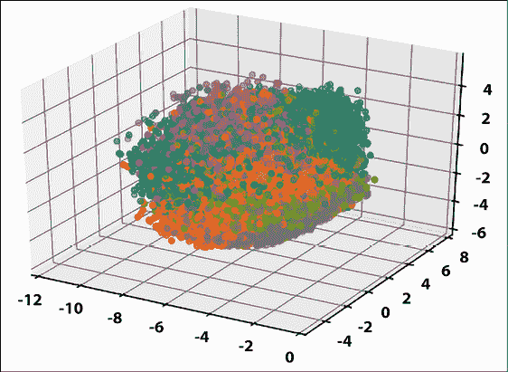
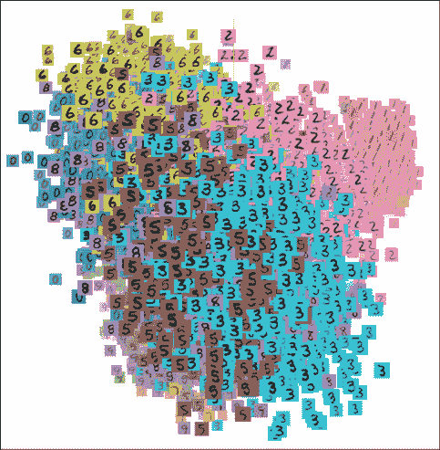
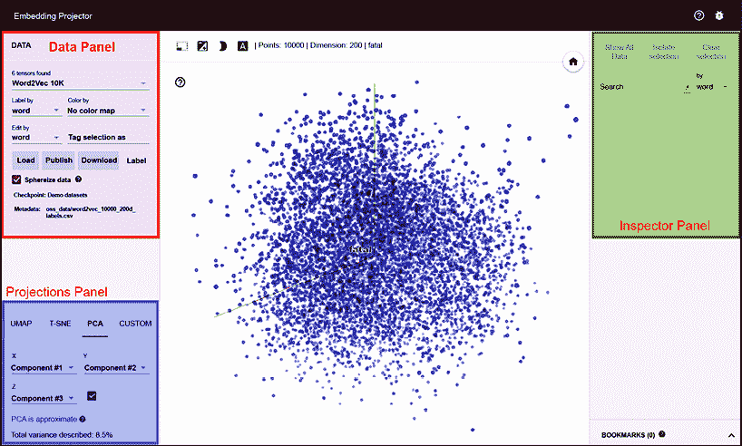
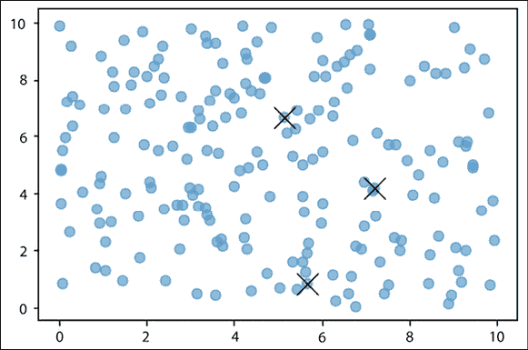
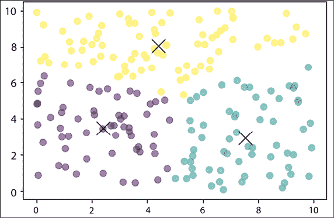
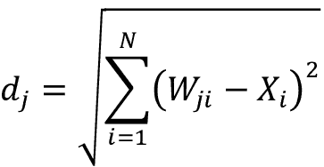
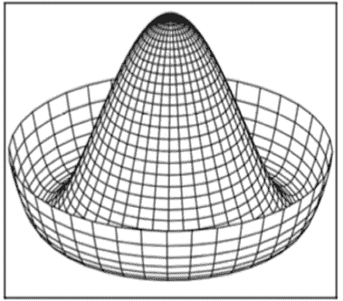
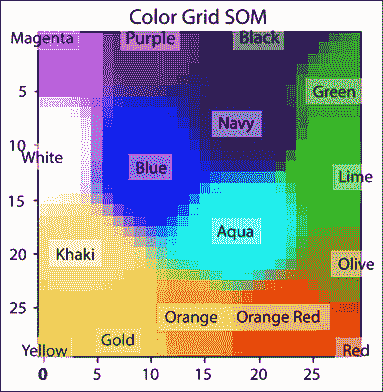
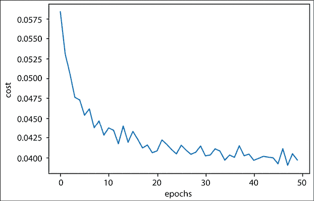

# 7

# 无监督学习

到目前为止，本书主要集中在监督学习及其通过监督学习进行学习的模型。从这一章开始，我们将探索一个较少被探索且更具挑战性的领域——无监督学习、 self-supervised 学习和对比学习。在本章中，我们将深入探讨一些流行且有用的无监督学习模型。与监督学习不同，监督学习中的训练数据集包括输入数据和目标标签，而无监督学习则处理仅提供输入数据的情况。模型通过自身学习输入数据的内在分布，无需任何目标标签的引导。聚类和降维是最常用的两种无监督学习技术。在本章中，我们将学习与这两种技术相关的不同机器学习和神经网络方法。我们将涵盖聚类和降维所需的技术，并详细讲解玻尔兹曼机，最后使用 TensorFlow 实现上述技术。所涉及的概念将扩展到构建**限制玻尔兹曼机**（**RBMs**）。本章将包括：

+   主成分分析

+   K 均值聚类

+   自组织映射

+   玻尔兹曼机

+   RBMs

本章的所有代码文件可以在[`packt.link/dltfchp7`](https://packt.link/dltfchp7)找到。

让我们从最常见且最常用的降维技术——主成分分析方法开始。

# 主成分分析

**主成分分析**（**PCA**）是最流行的多变量统计降维技术。它分析包含多个相关变量的训练数据，这些变量通常是相互关联的，并从训练数据中提取重要信息，形成一组新的正交变量，称为主成分。

我们可以使用两种方法进行 PCA：**特征分解**或**奇异值分解**（**SVD**）。

PCA 将* n *维输入数据减少到* r *维输入数据，其中* r <n *。简而言之，PCA 涉及平移原点并执行坐标轴旋转，使得其中一个轴（主轴）与数据点的方差最大。从原始数据集中，通过进行此变换并删除（移除）方差较小的正交轴，得到一个降维后的数据集。在此，我们使用 SVD 方法进行 PCA 降维。考虑*X*，它是一个* n *维数据，包含* p *个点，即* X *是一个大小为*p × n*的矩阵。从线性代数中我们知道，任何实矩阵都可以通过奇异值分解进行分解：


其中，*U* 和 *V* 是正交矩阵（即 *U.U*^T *= V.V*^T *= 1*），其大小分别为 *p × p* 和 *n × n*。 是一个大小为 *p × n* 的对角矩阵。*U* 矩阵称为**左奇异矩阵**，*V* 矩阵称为**右奇异矩阵**，而  这个对角矩阵包含了 *X* 的奇异值，作为其对角元素。这里假设 *X* 矩阵是已居中的。*V* 矩阵的列是主成分，而  的列是经过主成分变换后的数据。

现在，为了将数据从 *n* 维降至 *k* 维（其中 *k < n*），我们将选择 *U* 的前 *k* 列和  左上角的 *k × k* 部分。两者的乘积将给出我们的降维矩阵：


获得的 *Y* 数据将是降维后的数据。接下来，我们将在 TensorFlow 2.0 中实现 PCA。

## 在 MNIST 数据集上进行 PCA

现在让我们在 TensorFlow 2.0 中实现 PCA。我们一定会使用 TensorFlow；此外，我们还需要 NumPy 来进行一些基础的矩阵计算，并使用 Matplotlib、Matplotlib 工具包以及 Seaborn 来进行绘图：

```
import tensorflow as tf
import numpy as np
import matplotlib.pyplot as plt
from mpl_toolkits.mplot3d import Axes3D
import seaborn as sns 
```

接下来，我们加载 MNIST 数据集。由于我们使用 PCA 进行降维，因此不需要测试数据集或标签；然而，我们加载标签是为了在降维后验证 PCA 的效果。PCA 应该将相似的数据点聚集在一个簇中；因此，如果我们看到使用 PCA 形成的簇与我们的标签相似，那么这就表明我们的 PCA 有效：

```
((x_train, y_train), (_, _)) = tf.keras.datasets.mnist.load_data() 
```

在进行 PCA 之前，我们需要预处理数据。我们首先对数据进行归一化，使其值介于 0 和 1 之间，然后将图像从 28 × 28 矩阵重塑为一个 784 维的向量，最后通过减去均值来居中数据：

```
x_train = x_train / 255.
x_train = x_train.astype(np.float32)
x_train = np.reshape(x_train, (x_train.shape[0], 784))
mean = x_train.mean(axis = 1)
x_train = x_train - mean[:,None] 
```

现在我们的数据已经是正确的格式，我们利用 TensorFlow 强大的线性代数模块 (`linalg`) 来计算训练数据集的 SVD。TensorFlow 提供了 `svd()` 函数，定义在 `tf.linalg` 中，用来执行这个任务。然后，使用 `diag` 函数将 sigma 数组（`s`，即奇异值的列表）转换为对角矩阵：

```
s, u, v = tf.linalg.svd(x_train)
s = tf.linalg.diag(s) 
```

这将为我们提供一个大小为 784 × 784 的对角矩阵 *s*；一个大小为 60,000 × 784 的左奇异矩阵 *u*；以及一个大小为 784 × 784 的右奇异矩阵 *v*。这是因为函数 `svd()` 的参数 `full_matrices` 默认设置为 `False`。因此，它不会生成完整的 *U* 矩阵（在这种情况下是 60,000 × 60,000 的矩阵）；相反，如果输入 *X* 的大小为 *m × n*，它会生成大小为 *p = min(m, n)* 的 *U* 矩阵。

现在可以通过乘以 *u* 和 *s* 的相应切片来生成降维后的数据。我们将数据从 784 维降至 3 维；我们可以选择降至任何小于 784 的维度，但这里我们选择了 3 维，以便稍后更容易可视化。我们使用 `tf.Tensor.getitem` 以 Pythonic 方式对矩阵进行切片：

```
k = 3
pca = tf.matmul(u[:,0:k], s[0:k,0:k]) 
```

以下代码进行原始数据和降维数据形状的比较：

```
print('original data shape',x_train.shape)
print('reduced data shape', pca.shape) 
```

```
original data shape (60000, 784)
reduced data shape (60000, 3) 
```

最后，让我们在三维空间中绘制数据点：

```
Set = sns.color_palette("Set2", 10)
color_mapping = {key:value for (key,value) in enumerate(Set)}
colors = list(map(lambda x: color_mapping[x], y_train))
fig = plt.figure()
ax = Axes3D(fig)
ax.scatter(pca[:, 0], pca[:, 1],pca[:, 2], c=colors) 
```

图 7.1：使用 PCA 降维后的 MNIST 数据集散点图

您可以看到，颜色相同的点，因此标签相同的点聚集在一起。我们因此成功地使用 PCA 对 MNIST 图像进行了降维处理。每个原始图像的大小为 28 × 28。使用 PCA 方法，我们可以将其降至更小的尺寸。通常对于图像数据，降维是必要的。这是因为图像数据体积庞大，且包含大量冗余数据。

## TensorFlow 嵌入 API

TensorFlow 还提供了一个嵌入 API，可以使用 TensorBoard 查找和可视化 PCA 和 tSNE [1] 聚类。您可以在此查看 MNIST 图像的实时 PCA： [`projector.tensorflow.org`](http://projector.tensorflow.org)。下图为参考复制：

图 7.2：主成分分析的可视化，应用于 MNIST 数据集

您可以使用 TensorBoard 处理您的数据。它包含一个名为 **Embedding Projector** 的工具，允许您交互式地可视化嵌入。Embedding Projector 工具有三个面板：

+   **数据面板**：它位于左上角，您可以在此面板中选择数据、标签等。

+   **投影面板**：位于左下角，您可以在这里选择所需的投影类型。它提供三种选择：PCA、t-SNE 和自定义。

+   **检查器面板**：位于右侧，您可以在这里搜索特定的点，并查看最近邻的列表。



图 7.3：Embedding Projector 工具的截图

PCA 是一个用于可视化数据集和寻找变量间线性关系的有用工具。它也可以用于聚类、异常值检测和特征选择。接下来，我们将学习 K-means 算法，一种聚类数据的方法。

# K-means 聚类

K-means 聚类，顾名思义，是一种对数据进行聚类的技术，即将数据划分为指定数量的数据点。它是一种无监督学习技术。它通过识别给定数据中的模式来工作。记得《哈利·波特》中的分院帽吗？它在书中所做的就是聚类——将新的（未标记的）学生分成四个不同的类别：格兰芬多、拉文克劳、赫奇帕奇和斯莱特林。

人类非常擅长将物体分组；聚类算法尝试将这种能力赋予计算机。有许多可用的聚类技术，如层次聚类、贝叶斯聚类或划分聚类。K-means 聚类属于划分聚类；它将数据划分为 *k* 个簇。每个簇都有一个中心，称为质心。簇的数量 *k* 必须由用户指定。

K-means 算法按以下方式工作：

1.  随机选择 *k* 个数据点作为初始质心（簇中心）。

1.  将每个数据点分配给离其最近的质心；可以使用不同的度量来衡量“最近”，最常见的是欧几里得距离。

1.  使用当前的簇成员关系重新计算质心，使得平方距离的总和减少。

1.  重复最后两个步骤，直到达到收敛。

在之前的 TensorFlow 版本中，`KMeans` 类是在 `Contrib` 模块中实现的；然而，该类在 TensorFlow 2.0 中已不可用。在这里，我们将改用 TensorFlow 2.0 提供的高级数学函数来实现 K-means 聚类。

## TensorFlow 中的 K-means

为了演示 TensorFlow 中的 K-means，我们将在以下代码中使用随机生成的数据。我们生成的数据将包含 200 个样本，我们将其分成三个簇。首先导入所需的所有模块，定义变量，确定样本点的数量（`points_n`）、要形成的簇的数量（`clusters_n`）以及我们将进行的迭代次数（`iteration_n`）。我们还设置随机数种子以确保工作可复现：

```
import matplotlib.pyplot as plt
import numpy as np
import tensorflow as tf
points_n = 200
clusters_n = 3
iteration_n = 100
seed = 123
np.random.seed(seed)
tf.random.set_seed(seed) 
```

现在我们随机生成数据，并从中随机选择三个质心：

```
points = np.random.uniform(0, 10, (points_n, 2))
centroids = tf.slice(tf.random.shuffle(points), [0, 0], [clusters_n, -1]) 
```

现在让我们绘制这些点：

```
plt.scatter(points[:, 0], points[:, 1], s=50, alpha=0.5)
plt.plot(centroids[:, 0], centroids[:, 1], 'kx', markersize=15)
plt.show() 
```

你可以在下图中看到所有点的散点图以及随机选择的三个质心：



图 7.4：从三个随机选择的质心生成的随机数据绘制图

我们定义了函数 `closest_centroids()`，将每个点分配给离其最近的质心：

```
def closest_centroids(points, centroids):
    distances = tf.reduce_sum(tf.square(tf.subtract(points, centroids[:,None])), 2)
    assignments = tf.argmin(distances, 0)
    return assignments 
```

我们创建了另一个函数 `move_centroids()`。它重新计算质心，使得平方距离的总和减少：

```
def move_centroids(points, closest, centroids):
    return np.array([points[closest==k].mean(axis=0) for k in range(centroids.shape[0])]) 
```

现在我们迭代调用这两个函数 100 次。我们选择的迭代次数是任意的；你可以增加或减少迭代次数来观察效果：

```
for step in range(iteration_n):
    closest = closest_centroids(points, centroids)
    centroids = move_centroids(points, closest, centroids) 
```

现在让我们可视化质心在 100 次迭代后的变化：

```
plt.scatter(points[:, 0], points[:, 1], c=closest, s=50, alpha=0.5)
plt.plot(centroids[:, 0], centroids[:, 1], 'kx', markersize=15)
plt.show() 
```

在 *图 7.5* 中，你可以看到经过 100 次迭代后的最终质心。我们还根据每个数据点距离哪个质心最近来为其上色。黄色的点对应一个簇（最接近其中心的交叉点），紫色和绿色的簇点也同样如此：



图 7.5：经过 100 次迭代后的最终质心绘图

请注意，`plot` 命令在 `Matplotlib 3.1.1` 或更高版本中有效。

在上述代码中，我们决定将簇的数量限制为三个，但在大多数未标记数据的情况下，通常无法确定存在多少个簇。我们可以通过肘部法则来确定最优的簇数。该方法的原理是，我们应该选择一个能减少**平方误差和**（**SSE**）距离的簇数。如果 *k* 是簇的数量，那么随着 *k* 的增加，SSE 会减少，当 *k* 等于数据点的数量时，SSE 为 0；此时，每个点都是自己的簇。显然，我们不希望将簇的数量设为这个值，因此当我们绘制 SSE 与簇数之间的图表时，我们应该看到图表中出现一个拐点，就像手肘的形状，这也就是该方法得名——肘部法则。以下代码计算了数据的平方误差和：

```
def sse(points, centroids):
    sse1 = tf.reduce_sum(tf.square(tf.subtract(points, centroids[:,None])), 2).numpy()
    s = np.argmin(sse1, 0)
    distance = 0
    for i in range(len(points)):
      distance += sse1[s[i], i]
    return distance/len(points) 
```

现在让我们使用肘部法则来寻找数据集的最优簇数。为此，我们将从一个簇开始，也就是所有点都属于同一个簇，然后按顺序增加簇的数量。在代码中，我们每次增加一个簇，最多为十一簇。对于每个簇的数量，我们使用上述代码来找到质心（因此找到簇），并计算 SSE：

```
w_sse = []
for n in range(1, 11):
  centroids = tf.slice(tf.random.shuffle(points), [0, 0], [n, -1])
  for step in range(iteration_n):
    closest = closest_centroids(points, centroids)
    centroids = move_centroids(points, closest, centroids)
  #print(sse(points, centroids))
  w_sse.append(sse(points, centroids))
plt.plot(range(1, 11),w_sse) 
plt.xlabel('Number of clusters') 
```

*图 7.6* 显示了数据集的不同簇值。当簇的数量为四时，拐点非常明显：


图 7.6：绘制 SSE 与簇数的关系图

K-means 聚类非常流行，因为它快速、简单且稳健。但它也有一些缺点，最大的缺点是用户必须指定簇的数量。其次，该算法并不保证全局最优解；如果初始随机选择的质心发生变化，结果也可能会变化。第三，它对离群值非常敏感。

## K-means 的变种

在原始的 k-means 算法中，每个点都属于一个特定的簇（质心）；这被称为**硬聚类**。然而，我们可以让一个点同时属于所有簇，并通过隶属度函数来定义它属于某个特定簇（质心）的程度。这被称为*模糊聚类*或*软聚类*。

这种变体由 J. C. Dunn 于 1973 年提出，后来由 J. C. Bezdek 在 1981 年进行了改进。尽管软聚类收敛的时间较长，但当一个点属于多个类时，或者当我们想知道某个点与不同簇的相似度时，它是非常有用的。

加速的 k-means 算法是由 Charles Elkan 于 2003 年创建的。他利用了三角不等式关系（即直线是连接两点之间最短的距离）。他不仅在每次迭代时进行所有距离计算，还跟踪了点与质心之间的距离的上下限。

2006 年，David Arthur 和 Sergei Vassilvitskii 提出了 k-means++算法。他们提出的主要改进是在质心的初始化上。他们表明，如果选择相距较远的质心，k-means 算法就不太可能收敛到一个次优解。

另一种替代方法是在每次迭代时不使用整个数据集，而是使用小批量数据。这一修改由 David Sculey 在 2010 年提出。现在，既然我们已经讲解了 PCA 和 k-means，接下来我们将介绍一个有趣的网络——自组织网络（self-organized network）或胜者为王单元（winner-take-all units）。

# 自组织映射

k-means 和 PCA 都可以对输入数据进行聚类；然而，它们没有保持拓扑关系。在本节中，我们将讨论**自组织映射**（**SOMs**），有时也被称为**科洪能网络**（**Kohonen networks**）或**胜者为王单元**（**WTUs**）。它们保持拓扑关系。SOM 是一种非常特殊的神经网络，灵感来源于人类大脑的一个独特特征。在我们的大脑中，不同的感官输入是以拓扑有序的方式表示的。与其他神经网络不同，神经元之间不是通过权重相互连接的；相反，它们通过相互影响来进行学习。SOM 的最重要特点是，神经元以拓扑方式表示学习到的输入。它们由 Teuvo Kohonen 于 1982 年提出[7]。

在自组织映射（SOM）中，神经元通常放置在（1D 或 2D）格点的节点上。虽然也可以使用更高维度，但在实际应用中很少使用。格点中的每个神经元都通过权重矩阵与所有输入单元相连。*图 7.7*展示了一个具有 6 × 8（48 个神经元）和 5 个输入的 SOM。为了简洁起见，图中只显示了连接所有输入到一个神经元的权重向量。在这种情况下，每个神经元将有七个元素，从而形成一个大小为 40 × 5 的组合权重矩阵：


图 7.7：一个具有 5 个输入和 48 个神经元的自组织映射

SOM 通过竞争学习来学习。它可以看作是 PCA 的非线性推广，因此，像 PCA 一样，SOM 也可以用于降维。

为了实现 SOM，我们首先需要理解其工作原理。第一步是将网络的权重初始化为某个随机值，或者从输入中随机抽取样本。每个占据格点空间的神经元将被分配特定的位置。现在，当输入被呈现时，与输入距离最小的神经元被宣告为胜者（WTU）。这一过程是通过测量所有神经元的权重向量（*W*）和输入向量（*X*）之间的距离来实现的：



这里，*d*[j]是神经元*j*的权重与输入*X*之间的距离。具有最小*d*值的神经元就是胜者。

接下来，胜者神经元及其邻近神经元的权重将进行调整，确保下次如果相同的输入被呈现时，同一神经元仍然是胜者。

为了决定哪些邻近神经元需要被修改，网络使用一个邻域函数 ；通常，高斯墨西哥帽函数被选作邻域函数。邻域函数在数学上表示如下：


这里，是神经元影响半径的时间依赖性，*d*是神经元与胜出神经元的距离。从图形上看，该函数像一顶帽子（因此得名），如*图 7.8*所示：



图 7.8：以图形形式展示的“高斯墨西哥帽”函数

邻域函数的另一个重要特性是其半径随着时间的推移而减小。因此，在开始时，许多邻近神经元的权重会被修改，但随着网络的学习，最终只有少数神经元的权重（有时，甚至只有一个或没有）会在学习过程中被修改。

权重的变化由以下方程给出：


这个过程会对所有输入进行多次迭代。随着迭代的进行，我们会根据迭代次数逐步减少学习率和半径。

SOM 计算开销较大，因此对于非常大的数据集并不实用。不过，它们易于理解，并且能够很好地发现输入数据之间的相似性。因此，它们已被用于图像分割和确定自然语言处理中的词相似性映射。

## 使用 SOM 进行颜色映射

SOM 生成的输入空间特征图的一些有趣属性包括：

+   特征图提供了输入空间的良好表示。这一特性可以用于执行向量量化，从而使我们能够拥有连续的输入空间，通过使用 SOM，我们可以将其表示为离散的输出空间。

+   特征图是拓扑有序的，即输出格点中神经元的空间位置对应输入的特定特征。

+   特征图还反映了输入空间的统计分布；拥有最多输入样本的领域在特征图中会占据更大的区域。

SOM 的这些特性使其成为许多有趣应用的自然选择。这里，我们使用 SOM 将一系列给定的 R、G、B 像素值聚类到相应的颜色映射中。我们从导入模块开始：

```
import tensorflow as tf
import numpy as np
import matplotlib.pyplot as plt 
```

代码的主要部分是我们的类`WTU`。`__init__`函数初始化了 SOM 的各种超参数，包括我们 2D 格点的维度（`m, n`）、输入中的特征数量（`dim`）、邻域半径（`sigma`）、初始权重以及拓扑信息：

```
# Define the Winner Take All units
class WTU(object):
  #_learned = False
  def __init__(self, m, n, dim, num_iterations, eta = 0.5, sigma = None):
    """
    m x n : The dimension of 2D lattice in which neurons are arranged
    dim : Dimension of input training data
    num_iterations: Total number of training iterations
    eta : Learning rate
    sigma: The radius of neighbourhood function.
    """
    self._m = m
    self._n = n
    self._neighbourhood = []
    self._topography = []
    self._num_iterations = int(num_iterations)
    self._learned = False
    self.dim = dim
    self.eta = float(eta)

    if sigma is None:
      sigma = max(m,n)/2.0 # Constant radius
    else:
      sigma = float(sigma)
    self.sigma = sigma

    print('Network created with dimensions',m,n)

    # Weight Matrix and the topography of neurons
    self._W = tf.random.normal([m*n, dim], seed = 0)
    self._topography = np.array(list(self._neuron_location(m, n))) 
```

该类的最重要功能是`training()`函数，我们在其中使用之前讨论过的 Kohonen 算法来找到胜出单元，然后基于邻域函数更新权重：

```
def training(self,x, i):
    m = self._m
    n= self._n

    # Finding the Winner and its location
    d = tf.sqrt(tf.reduce_sum(tf.pow(self._W - tf.stack([x for i in range(m*n)]),2),1))
    self.WTU_idx = tf.argmin(d,0)

    slice_start = tf.pad(tf.reshape(self.WTU_idx, [1]),np.array([[0,1]]))
    self.WTU_loc = tf.reshape(tf.slice(self._topography, slice_start,[1,2]), [2])

    # Change learning rate and radius as a function of iterations
    learning_rate = 1 - i/self._num_iterations
    _eta_new = self.eta * learning_rate
    _sigma_new = self.sigma * learning_rate

    # Calculating Neighbourhood function
    distance_square = tf.reduce_sum(tf.pow(tf.subtract(
        self._topography, tf.stack([self.WTU_loc for i in range(m * n)])), 2), 1)
    neighbourhood_func = tf.exp(tf.negative(tf.math.divide(tf.cast(
distance_square, "float32"), tf.pow(_sigma_new, 2))))

    # multiply learning rate with neighbourhood func
    eta_into_Gamma = tf.multiply(_eta_new, neighbourhood_func)

    # Shape it so that it can be multiplied to calculate dW
    weight_multiplier = tf.stack([tf.tile(tf.slice(
        eta_into_Gamma, np.array([i]), np.array([1])), [self.dim])
        for i in range(m * n)])
    delta_W = tf.multiply(weight_multiplier,
        tf.subtract(tf.stack([x for i in range(m * n)]),self._W))
    new_W = self._W + delta_W
    self._W = new_W 
```

`fit()` 函数是一个辅助函数，它调用 `training()` 函数并存储质心网格，以便于后续检索：

```
def fit(self, X):
    """
    Function to carry out training
    """
    for i in range(self._num_iterations):
        for x in X:
            self.training(x,i)
    # Store a centroid grid for easy retrieval
    centroid_grid = [[] for i in range(self._m)]
    self._Wts = list(self._W)
    self._locations = list(self._topography)
    for i, loc in enumerate(self._locations):
        centroid_grid[loc[0]].append(self._Wts[i])
    self._centroid_grid = centroid_grid
    self._learned = True 
```

然后有一些更多的辅助函数来找到胜者并生成一个二维神经元格，还有一个将输入向量映射到二维格中相应神经元的函数：

```
def winner(self, x):
    idx = self.WTU_idx,self.WTU_loc
    return idx

def _neuron_location(self,m,n):
    """
    Function to generate the 2D lattice of neurons
    """
    for i in range(m):
       for j in range(n):
          yield np.array([i,j])
def get_centroids(self):
    """
    Function to return a list of 'm' lists, with each inner list containing the 'n' corresponding centroid locations as 1-D NumPy arrays.
    """
    if not self._learned:
       raise ValueError("SOM not trained yet")
    return self._centroid_grid
def map_vects(self, X):
    """
    Function to map each input vector to the relevant neuron in the lattice
    """
    if not self._learned:
       raise ValueError("SOM not trained yet")
       to_return = []
       for vect in X:
          min_index = min([i for i in range(len(self._Wts))],
                           key=lambda x: np.linalg.norm(vect -
                           self._Wts[x]))
          to_return.append(self._locations[min_index])
       return to_return 
```

我们还需要对输入数据进行归一化处理，因此我们创建了一个函数来实现这一操作：

```
def normalize(df):
    result = df.copy()
    for feature_name in df.columns:
        max_value = df[feature_name].max()
        min_value = df[feature_name].min()
        result[feature_name] = (df[feature_name] - min_value) / (max_value - min_value)
    return result.astype(np.float32) 
```

让我们读取数据。数据包含不同颜色的红色、绿色和蓝色通道值。让我们对它们进行归一化处理：

```
## Reading input data from file
import pandas as pd
df = pd.read_csv('colors.csv')  # The last column of data file is a label
data = normalize(df[['R', 'G', 'B']]).values
name = df['Color-Name'].values
n_dim = len(df.columns) - 1
# Data for Training
colors = data
color_names = name 
```

让我们创建我们的自组织映射（SOM）并进行拟合：

```
som = WTU(30, 30, n_dim, 400, sigma=10.0)
som.fit(colors) 
```

拟合函数运行稍微长一些，因为我们的代码并没有针对性能优化，而是为了说明概念。现在，让我们看看训练模型的结果。让我们运行以下代码：

```
# Get output grid
image_grid = som.get_centroids()
# Map colours to their closest neurons
mapped = som.map_vects(colors)
# Plot
plt.imshow(image_grid)
plt.title('Color Grid SOM')
for i, m in enumerate(mapped):
    plt.text(m[1], m[0], color_names[i], ha='center', va='center',
             bbox=dict(facecolor='white', alpha=0.5, lw=0)) 
```

你可以看到二维神经元格中的彩色图：



图 7.9：二维神经元格的彩色映射图

你可以看到，对于相似颜色的神经元，它们会被紧密地放置在一起。接下来，我们进入一个有趣的架构——限制玻尔兹曼机（RBM）。

# 限制玻尔兹曼机（RBM）

RBM 是一个两层的神经网络——第一层称为 **可见层**，第二层称为 **隐藏层**。它们被称为 **浅层神经网络**，因为它们只有两层深。最早由 Paul Smolensky 于 1986 年提出（他称其为和谐网络 [1]），后由 Geoffrey Hinton 在 2006 年提出 **对比散度**（**CD**）作为训练方法。可见层的所有神经元都与隐藏层的所有神经元相连，但存在一个 **限制**——同一层中的神经元不能相连。RBM 中的所有神经元本质上是二值的；它们要么激活，要么不激活。

RBM 可以用于降维、特征提取和协同过滤。RBM 的训练可以分为三个部分：前向传播、反向传播，然后进行比较。

让我们更深入地研究一下数学原理。我们可以将 RBM 的操作分为两次传播：

**前向传播**：可见单元（*V*）的信息通过权重（*W*）和偏置（*c*）传递到隐藏单元（*h*[0]）。隐藏单元是否激活取决于随机概率（ 是随机概率），该概率基本上是一个 Sigmoid 函数：


**反向传播**：然后，隐藏单元表示（*h*[0]）通过相同的权重 *W* 传回可见单元，但使用不同的偏置 *c*，此时模型重建输入。同样，输入会被采样：


这两次传播会重复 *k* 步骤，或者直到收敛[4]达到为止。根据研究人员的说法，*k=1* 已经能够得到良好的结果，所以我们将设置 *k = 1*。

可见向量 *V* 和隐藏向量 *h* 的联合配置具有如下能量：


每个可见向量 *V* 还与自由能相关，自由能是指某一配置所需的能量，使其与所有包含 *V* 的配置具有相同的概率：


使用对比散度目标函数，即 *Mean(F(V*[original]*)) - Mean(F(V*[reconstructed]*))*，权重的变化由以下公式给出：


这里， 是学习率。对偏置 *b* 和 *c* 也存在类似的表达式。

## 使用 RBM 进行图像重建

让我们在 TensorFlow 中构建一个 RBM。这个 RBM 将被设计用来重建手写数字。这是你学习的第一个生成模型；在接下来的章节中，我们还会学习一些其他的生成模型。我们导入 TensorFlow、NumPy 和 Matplotlib 库：

```
import tensorflow as tf
import numpy as np
import matplotlib.pyplot as plt 
```

我们定义了一个类 `RBM`。该类的 `__init_()` 函数初始化了可见层（`input_size`）和隐藏层（`output_size`）中的神经元数量。该函数初始化了隐藏层和可见层的权重和偏置。在下面的代码中，我们将它们初始化为零。你也可以尝试使用随机初始化：

```
#Class that defines the behavior of the RBM
class RBM(object):

    def __init__(self, input_size, output_size, lr=1.0, batchsize=100):
        """
        m: Number of neurons in visible layer
        n: number of neurons in hidden layer
        """
        # Defining the hyperparameters
        self._input_size = input_size # Size of Visible
        self._output_size = output_size # Size of outp
        self.learning_rate = lr # The step used in gradient descent
        self.batchsize = batchsize         # The size of how much data will be used for training per sub iteration

        # Initializing weights and biases as matrices full of zeroes
        self.w = tf.zeros([input_size, output_size], np.float32) # Creates and initializes the weights with 0
        self.hb = tf.zeros([output_size], np.float32) # Creates and initializes the hidden biases with 0
        self.vb = tf.zeros([input_size], np.float32) # Creates and initializes the visible biases with 0 
```

我们定义了前向和后向传播的函数：

```
 # Forward Pass
    def prob_h_given_v(self, visible, w, hb):
        # Sigmoid 
        return tf.nn.sigmoid(tf.matmul(visible, w) + hb)
    # Backward Pass
    def prob_v_given_h(self, hidden, w, vb):
        return tf.nn.sigmoid(tf.matmul(hidden, tf.transpose(w)) + vb) 
```

我们创建一个函数来生成随机二进制值。这是因为隐藏单元和可见单元的更新是通过随机概率进行的，具体取决于每个单元的输入（对于隐藏层是每个单元的输入，而对于可见层是自上而下的输入）：

```
 # Generate the sample probability
    def sample_prob(self, probs):
        return tf.nn.relu(tf.sign(probs - tf.random.uniform(tf.shape(probs)))) 
```

我们需要一些函数来重建输入：

```
def rbm_reconstruct(self,X):
    h = tf.nn.sigmoid(tf.matmul(X, self.w) + self.hb)
    reconstruct = tf.nn.sigmoid(tf.matmul(h, tf.transpose(self.w)) + self.vb)
    return reconstruct 
```

为了训练创建的 RBM，我们定义了 `train()` 函数。该函数计算对比散度的正负梯度项，并使用权重更新公式来更新权重和偏置：

```
# Training method for the model
def train(self, X, epochs=10):

    loss = []
    for epoch in range(epochs):
        #For each step/batch
        for start, end in zip(range(0, len(X), self.batchsize),range(self.batchsize,len(X), self.batchsize)):
            batch = X[start:end]

            #Initialize with sample probabilities

            h0 = self.sample_prob(self.prob_h_given_v(batch, self.w, self.hb))
            v1 = self.sample_prob(self.prob_v_given_h(h0, self.w, self.vb))
            h1 = self.prob_h_given_v(v1, self.w, self.hb)

            #Create the Gradients
            positive_grad = tf.matmul(tf.transpose(batch), h0)
            negative_grad = tf.matmul(tf.transpose(v1), h1)

            #Update learning rates 
            self.w = self.w + self.learning_rate *(positive_grad - negative_grad) / tf.dtypes.cast(tf.shape(batch)[0],tf.float32)
            self.vb = self.vb +  self.learning_rate * tf.reduce_mean(batch - v1, 0)
            self.hb = self.hb +  self.learning_rate * tf.reduce_mean(h0 - h1, 0)

        #Find the error rate
        err = tf.reduce_mean(tf.square(batch - v1))
        print ('Epoch: %d' % epoch,'reconstruction error: %f' % err)
        loss.append(err)

    return loss 
```

现在我们的类已经准备好，我们实例化一个 `RBM` 对象，并在 MNIST 数据集上对其进行训练：

```
(train_data, _), (test_data, _) =  tf.keras.datasets.mnist.load_data()
train_data = train_data/np.float32(255)
train_data = np.reshape(train_data, (train_data.shape[0], 784))
test_data = test_data/np.float32(255)
test_data = np.reshape(test_data, (test_data.shape[0], 784))
#Size of inputs is the number of inputs in the training set
input_size = train_data.shape[1]
rbm = RBM(input_size, 200)
err = rbm.train(train_data,50) 
```

让我们绘制学习曲线：

```
plt.plot(err)
plt.xlabel('epochs')
plt.ylabel('cost') 
```

在下图中，你可以看到我们 RBM 的学习曲线：



图 7.10：RBM 模型的学习曲线

现在，我们展示了用于可视化重建图像的代码：

```
out = rbm.rbm_reconstruct(test_data)
# Plotting original and reconstructed images
row, col = 2, 8
idx = np.random.randint(0, 100, row * col // 2)
f, axarr = plt.subplots(row, col, sharex=True, sharey=True, figsize=(20,4))
for fig, row in zip([test_data,out], axarr):
    for i,ax in zip(idx,row):
        ax.imshow(tf.reshape(fig[i],[28, 28]), cmap='Greys_r')
        ax.get_xaxis().set_visible(False)
        ax.get_yaxis().set_visible(False) 
```

以及重建后的图像：


图 7.11：使用 RBM 进行图像重建

上排是输入的手写图像，下排是重建的图像。你可以看到这些图像与人类手写的数字非常相似。在接下来的章节中，你将学习可以生成更复杂图像的模型，例如人工人脸。

## 深度信念网络

现在我们已经对限制玻尔兹曼机（RBMs）有了深入了解，并知道如何通过对比散度进行训练，我们可以继续研究 2006 年 Hinton 及其团队提出的第一个成功的深度神经网络架构——**深度信念网络**（**DBNs**），该内容见于论文*深度信念网络的快速学习算法*。在这个模型之前，训练深度架构是非常困难的，不仅仅是因为计算资源有限，还因为正如*第八章*《*自编码器*》中所讨论的那样，存在消失梯度问题。在 DBNs 中，首次展示了如何通过贪心的逐层训练来训练深度架构。

用最简单的话来说，DBNs 就是堆叠的 RBM。每个 RBM 都是通过对比散度单独训练的。我们从第一个 RBM 层的训练开始，一旦它训练完成，我们就训练第二个 RBM 层。第二个 RBM 的可见单元现在接收到第一个 RBM 的隐藏单元的输出，当它接收到输入数据时。这个过程在每个 RBM 层增加时重复进行。

让我们尝试堆叠我们的`RBM`类。为了构建 DBN，我们需要在`RBM`类中定义一个函数；一个 RBM 的隐藏单元的输出需要传递给下一个 RBM：

```
 #Create expected output for our DBN
    def rbm_output(self, X):
        out = tf.nn.sigmoid(tf.matmul(X, self.w) + self.hb)
        return out 
```

现在我们可以直接使用`RBM`类来创建堆叠的 RBM 结构。在以下代码中，我们创建一个 RBM 堆叠：第一个 RBM 将有 500 个隐藏单元，第二个 RBM 有 200 个隐藏单元，第三个 RBM 有 50 个隐藏单元：

```
RBM_hidden_sizes = [500, 200 , 50 ] #create 2 layers of RBM with size 400 and 100
#Since we are training, set input as training data
inpX = train_data
#Create list to hold our RBMs
rbm_list = []
#Size of inputs is the number of inputs in the training set
input_size = train_data.shape[1]
#For each RBM we want to generate
for i, size in enumerate(RBM_hidden_sizes):
    print ('RBM: ',i,' ',input_size,'->', size)
    rbm_list.append(RBM(input_size, size))
    input_size = size 
```

```
---------------------------------------------------------------------
RBM:  0   784 -> 500
RBM:  1   500 -> 200
RBM:  2   200 -> 50 
```

对于第一个 RBM，MNIST 数据是输入。第一个 RBM 的输出被作为输入传递给第二个 RBM，依此类推，直到通过连续的 RBM 层：

```
#For each RBM in our list
for rbm in rbm_list:
    print ('Next RBM:')
    #Train a new one
    rbm.train(tf.cast(inpX,tf.float32))
    #Return the output layer
    inpX = rbm.rbm_output(inpX) 
```

我们的 DBN 已经准备好了。这三个堆叠的 RBM 现在通过无监督学习进行了训练。DBNs 也可以通过监督学习进行训练。为此，我们需要微调已训练 RBM 的权重，并在最后添加一个完全连接层。在他们的论文《*使用深度信念网络进行分类*》中，Hebbo 和 Kim 展示了他们如何使用 DBN 进行 MNIST 分类；这是一个很好的入门介绍。

# 总结

本章介绍了主要的无监督学习算法。我们探讨了最适合于降维、聚类和图像重建的算法。我们首先讲解了降维算法 PCA，然后使用 k-means 和自组织映射进行聚类。接着，我们研究了限制玻尔兹曼机，并看到了如何将其应用于降维和图像重建。接下来，我们深入探讨了堆叠 RBM，即深度信念网络，并在 MNIST 数据集上训练了一个由三层 RBM 组成的 DBN。

在下一章，我们将探索另一种使用无监督学习范式的模型——自编码器。

# 参考文献

1.  Smith, Lindsay. (2006). *主成分分析教程*：[`www.cs.otago.ac.nz/cosc453/student_tutorials/principal_components.pdf`](http://www.cs.otago.ac.nz/cosc453/student_tutorials/principal_components.pdf)

1.  Movellan, J. R. *主成分分析教程*：[`mplab.ucsd.edu/tutorials/pca.pdf`](http://mplab.ucsd.edu/tutorials/pca.pdf)

1.  TensorFlow 投影器：[`projector.tensorflow.org/`](http://projector.tensorflow.org/)

1.  **奇异值分解**（**SVD**）教程。MIT：[`web.mit.edu/be.400/www/SVD/Singular_Value_Decomposition.htm`](https://web.mit.edu/be.400/www/SVD/Singular_Value_Decomposition.htm)

1.  Shlens, Jonathon. (2014). *主成分分析教程*。arXiv 预印本 arXiv:1404.1100：[`arxiv.org/abs/1404.1100`](https://arxiv.org/abs/1404.1100)

1.  Goodfellow, I., Bengio, Y., 和 Courville, A. (2016). *深度学习*。MIT 出版社：[`www.deeplearningbook.org`](https://www.deeplearningbook.org)

1.  Kohonen, T. (1982). *自组织形成拓扑正确的特征图*。生物控制论 43，第 1 期：59-69。

1.  Kanungo, Tapas 等人 (2002). *一种高效的 k-均值聚类算法：分析与实现*。IEEE 模式分析与机器智能学报 24.7：881-892。

1.  Ortega, Joaquín Pérez 等人。*关于 K-均值算法的研究问题：使用 Matlab 的实验试验*。CEUR 工作坊论文集：语义网与新技术。

1.  Chen, K. (2009). *关于度量空间和欧几里得空间中 k-中值和 k-均值聚类的核心集及其应用*。SIAM 计算学报 39.3：923-947。

1.  *确定数据集中的聚类数目*：[`en.wikipedia.org/wiki/Determining_the_number_of_clusters_in_a_data_set`](https://en.wikipedia.org/wiki/Determining_the_number_of_clusters_in_a_data_set)

1.  Lloyd, S. P. (1982). *PCM 中的最小二乘量化*：[`mlsp.cs.cmu.edu/courses/fall2010/class14/lloyd.pdf`](http://mlsp.cs.cmu.edu/courses/fall2010/class14/lloyd.pdf)

1.  Dunn, J. C. (1973-01-01). *ISODATA 过程的模糊相对物及其在检测紧凑且分离良好聚类中的应用*。控制论学报。3(3)：32-57。

1.  Bezdek, James C. (1981). *具有模糊目标函数算法的模式识别*。

1.  Peters, G., Crespo, F., Lingras, P., 和 Weber, R. (2013). *软聚类–模糊与粗糙方法及其扩展与派生*。国际近似推理杂志 54，第 2 期：307-322。

1.  Sculley, D. (2010). *Web 规模 k-均值聚类*。第 19 届国际万维网大会论文集，pp. 1177-1178。ACM。

1.  Smolensky, P. (1986). *动态系统中的信息处理：和谐理论的基础*。编号 CU-CS-321-86。科罗拉多大学博尔德分校计算机科学系。

1.  Salakhutdinov, R., Mnih, A., 和 Hinton, G. (2007). *限制玻尔兹曼机在协同过滤中的应用*。第 24 届国际机器学习会议论文集。ACM。

1.  Hinton, G. (2010). *训练限制玻尔兹曼机的实用指南*。Momentum 9.1：926。

# 加入我们书籍的 Discord 空间

加入我们的 Discord 社区，与志同道合的人相遇，并与超过 2000 名成员一起学习： [`packt.link/keras`](https://packt.link/keras)


