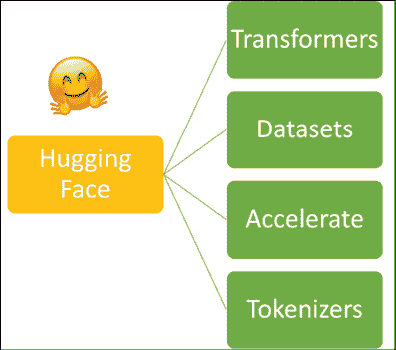
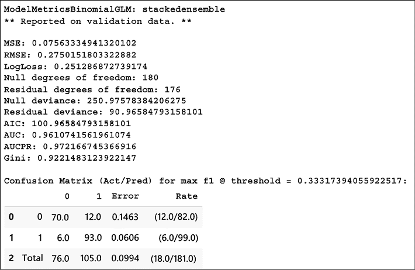
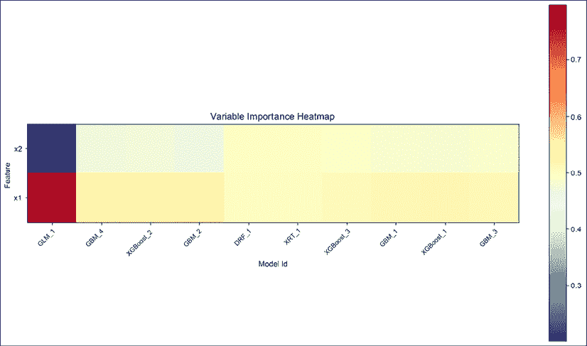
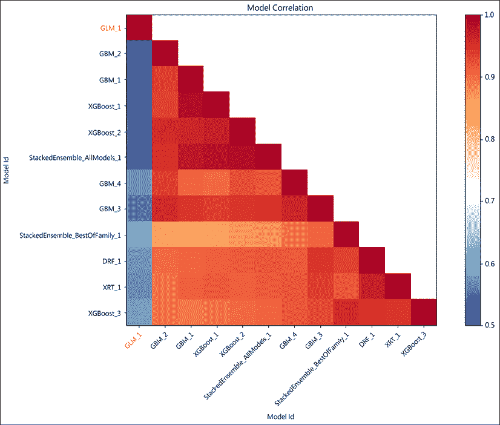

# 其他有用的深度学习库

来自 Google 的 TensorFlow 并不是唯一可用于深度学习任务的框架。市场上有许多不同的库和框架，每个都有其独特的功能、特性和应用场景。在本章中，我们将探索一些流行的深度学习库，并比较它们的功能。

本章将包括：

+   Hugging Face

+   H2O

+   PyTorch

+   ONNX

+   Open AI

本章的所有代码文件可以在 [`packt.link/dltfchp16`](https://packt.link/dltfchp16) 找到。

让我们开始吧！

# Hugging Face

Hugging Face 对我们来说并不陌生；*第六章*，*Transformers*，向我们介绍了这个库。Hugging Face 是一家以 NLP 为中心的初创公司，由 Delangue 和 Chaumond 于 2016 年创办。它在短时间内已成为处理所有 NLP 相关任务的最佳工具之一。AutoNLP 和加速推理 API 需要付费使用，但其核心 NLP 库 datasets、tokenizers、Accelerate 和 transformers（*图 16.1*）是免费的。它已经建立了一个由社区驱动的开源平台。



图 16.1：来自 Hugging Face 的 NLP 库

Hugging Face 生态系统的核心是其 transformers 库。Tokenizers 和 Datasets 库支持 transformers 库。要使用这些库，我们需要先安装它们。Transformers 可以通过简单的 `pip install` 命令进行安装：

```
pip install transformers 
```

Hugging Face 提供的一些开箱即用的模型包括文本摘要、问答、文本分类、音频分类、自动语音识别、特征提取、图像分类和翻译。在*图 16.2*中，我们可以看到 Hugging Face 提供的开箱即用的摘要模型的结果。


图 16.2：使用 Hugging Face 进行开箱即用的文本摘要

除了这些开箱即用的模型，我们还可以使用 Hugging Face Hub 上提供的大量模型和数据集，并可以与 PyTorch、TensorFlow 和 JAX 一起使用来构建定制化的模型。

# OpenAI

OpenAI 是另一个在强化学习领域中为人所知的名字。他们的 Gym 模块是全球开发人员用于开发和比较强化学习算法的标准工具包。在*第十一章*，*强化学习*，我们已经详细介绍了 Gym 模块。在本章中，我们将探讨 OpenAI 提供的另外两个工具。

## OpenAI GPT-3 API

“OpenAI GPT-3 是一个机器学习平台，允许开发者为深度学习构建自定义算法。该平台于 2017 年 12 月发布，并已广泛应用于人工智能领域的企业和个人。GPT-3 成功的主要原因之一是它易于使用，并且具有广泛的功能。这个平台能够从数据中学习，并可用于多种任务，包括深度学习、自然语言处理和图像识别。GPT-3 还因为是开源的，任何人都可以使用，因此它成为了任何想要学习深度学习及其各种应用方式的人的理想平台。总的来说，GPT-3 是一个功能强大且易于使用的机器学习平台，在人工智能领域被企业和个人广泛应用。”

这是 OpenAI GPT-3 API 生成的文本，当被要求撰写关于 GPT-3 本身的内容时 ([`beta.openai.com/playground`](https://beta.openai.com/playground))：


图 16.3：使用 OpenAI GPT-3 API 进行文本生成

OpenAI GPT-3 API 提供以下任务：

+   **文本补全**：在这里，GPT-3 API 被用来生成或操作文本，甚至是代码。你可以用它来写广告语、介绍或文章，或者你可以留下半句未写完的句子，要求它补全。人们已经用它来生成故事和广告文案。

+   **语义搜索**：这允许你对一组文档进行语义搜索。例如，你可以通过 API 上传文档；它最多可以处理 200 个文档，每个文件的最大大小为 150MB，总大小限制为 1GB。API 会根据语义相似度得分（通常在 0-300 之间）对文档进行排名。

+   **问答系统**：该 API 使用上传的文档作为真实来源；API 首先搜索文档中与问题相关的内容。然后根据语义相关性对其进行排序，最后回答问题。

+   **文本分类**：OpenAI GPT-3 的文本分类端点接受一组带标签的示例作为输入，然后利用其中的标签对查询文本进行标注。有许多例子表明，这一功能已被用于情感分析。

最初，OpenAI GPT-3 仅在申请后才可使用，但现在，任何人都可以使用该 API；不再需要排队等待。

## OpenAI DALL-E 2

OpenAI 的 GPT-3 API 涉及与自然语言处理（NLP）相关的所有内容；而 DALL-E 2 更进一步。DALL-E 最初由 OpenAI 于 2021 年 1 月发布。它声称能够根据提供给模型的文本描述生成照片级真实感图像。它还可以对现有图像进行真实感编辑；你可以使用它添加或删除图像中的物体和元素，当它执行这些操作时，会考虑阴影、反射和纹理的影响。*图 16.4* 展示了 DALL-E 2 的一些令人瞩目的成就。在顶部的图像中，我给 DALL-E 2 提供了一个描述我想要的文本：“阿尔伯特·爱因斯坦骑着恐龙飞越亚马逊雨林。”它生成了一个卡通风格的图像。下排的图像是使用 DALL-E 2 的图像编辑功能生成的。我添加了左侧的图像，它生成了四个变体。如果忽略面部模糊的话，变体看起来非常逼真：


图 16.4：上方是 DALL-E 2 生成的图像，下方是 DALL-E 2 编辑的图像

在撰写本书时（2022 年 8 月），DALL-E 2 还不能公开使用。但想象一下，当这个模型作为 API 发布后，艺术家和从事数字媒体创作的专业人士将拥有怎样的无限可能。

## OpenAI Codex

当学生开始学习编程的第一课时，作为老师，我通常建议他们将程序看作一组指令——唯一需要掌握的就是用你知道的语言尽可能清晰地编写这些指令。

好吧，Codex 使这一切成为可能，你只需要给它提供你想要实现的指令，它就会为你生成相应的代码。

OpenAI 将其推出作为一个通用编程模型，并且它已经在公开的 GitHub 代码上进行了训练。

以下是 Codex 生成的任务和相应代码的一些片段：

```
""" Ask the user for their name and say "Hello" in Python """ 
print("Hello, world!") 
name = input("Please type your name: ") 
print("Hello, " + name + "!")
""" Write a program in Python to find sum of n fibonacci sequences """ 
def Fibonacci(n): 
    if n < 0: 
        print("Incorrect input") 
    elif n == 1: 
       return 0 
    elif n == 2: 
        return 1 
    else: 
        return Fibonacci(n - 1) + Fibonacci(n - 2) 
n = int(input("Enter the number of terms: ")) 
# check if the number of terms is valid 
if n <= 0: 
    print("Please enter a positive integer") 
else: 
    print("Fibonacci sequence: ") 
    for I in range(1, n + 1): 
        print(Fibonacci(n), end=' ') 
```

第一个任务，如你所见，完成得非常完美。在第二个任务中，我们要求它计算斐波那契数列的和；然而，它生成了斐波那契数列本身，这是一个更常见的问题。这告诉我们，尽管它在处理常见任务方面非常出色，但对于真正的程序员的需求依然存在。

# PyTorch

与 TensorFlow 类似，PyTorch 是一个完整的深度学习框架。在基于 AI 的社交圈中，你经常会看到 PyTorch 和 TensorFlow 的死忠粉丝争论谁才是最好的。PyTorch 由 Facebook（现在是 Meta）开发，是一个开源的深度学习框架。许多研究人员偏爱它，因为它具有灵活和模块化的特点。PyTorch 还对生产部署提供了稳定的支持。像 TensorFlow 一样，PyTorch 的核心是其张量处理库和自动微分引擎。在 C++ 运行时环境中，它利用 TorchScript 实现图模式和急切模式之间的轻松转换。使 PyTorch 流行的主要特性是其支持动态计算，即能够动态构建计算图——这使得程序员能够在任何时候修改和检查计算图，增加了灵活性。

PyTorch 库由多个模块组成，这些模块作为构建复杂模型的基础块。此外，PyTorch 还提供了方便的功能来在不同设备之间传输变量和模型，例如 CPU、GPU 或 TPU。特别需要提到的是以下三个强大的模块：

+   **NN 模块**：这是所有层和构建深度学习网络所需函数的基类。下面，你可以看到一个代码片段，展示了如何使用 NN 模块构建网络。然后可以使用语句 `net = My_Net(1,10,5)` 来实例化该网络；这会创建一个具有一个输入通道、10 个输出神经元和 `5x5` 大小卷积核的网络：

    ```
    import torch.nn as nn
    import torch.nn.functional as F
    class My_Net(nn.Module):
        def __init__(self, input_channel, output_neurons, kernel_size):
            super(My_Net, self).__init__()
            self.conv1 = nn.Conv2d(input_channel, 6, kernel_size)
            self.conv2 = nn.Conv2d(6, 16, 5)
            self.fc1 = nn.Linear(16 * 5 * 5, 120)
            self.fc2 = nn.Linear(120, 84)
            self.fc3 = nn.Linear(84,output_neurons)
        def forward(self, x):
            x = F.max_pool2d(F.relu(self.conv1(x)), (2, 2))
            x = F.max_pool2d(F.relu(self.conv2(x)), 2)
            x = x.view(-1, self.num_flat_features(x))
            x = F.relu(self.fc1(x))
            x = F.relu(self.fc2(x))
            x = self.fc3(x)
            return x
        def num_flat_features(self, x):
            size = x.size()[1:]  
            num_features = 1
            for s in size:
                num_features *= s
            return num_features 
    ```

    这是该网络的概述：

    ```
    My_Net(
        (conv1): Conv2d(1, 6, kernel_size=(5, 5), stride=(1, 1))
        (conv2): Conv2d(6, 16, kernel_size=(5, 5), stride=(1,
        1))
        (fc1): Linear(in_features=400, out_features=120,
        bias=True)
        (fc2): Linear(in_features=120, out_features=84,
        bias=True)
        (fc3): Linear(in_features=84, out_features=10,
        bias=True)
    ) 
    ```

+   **Autograd 模块**：这是 PyTorch 的核心。该模块提供了用于实现自动微分的类和函数。该模块创建了一个称为动态计算图的无环图；图的叶子是输入张量，根是输出张量。它通过沿着路径从根追踪到叶子并利用链式法则相乘，来计算梯度。下面的代码片段展示了如何使用 Autograd 模块来计算梯度。`backward()` 函数计算损失相对于所有 `requires_grad` 设置为 `True` 的张量的梯度。假设你有一个变量 `w`，那么在调用 `backward()` 后，张量 `w.grad` 将给出损失相对于 `w` 的梯度。

    然后我们可以利用这个规则来根据学习规则更新变量 `w`：

    ```
    loss = (y_true – y_pred).pow(2).sum()
    loss.backward()
    # Here the autograd is used to compute the backward pass. 
    With torch.no_grad():
        W = w – lr_rate * w.grad
        w.grad = None # Manually set to zero after updating 
    ```

+   **Optim 模块**：Optim 模块实现了各种优化算法。Optim 中提供的一些优化器算法包括 SGD、AdaDelta、Adam、SparseAdam、AdaGrad 和 LBFGS。用户还可以使用 Optim 模块创建复杂的优化器。要使用 Optim 模块，只需构建一个优化器对象，该对象将保存当前状态并根据梯度更新参数。

PyTorch 被许多公司用于他们的 AI 解决方案。**特斯拉**使用 PyTorch 进行**自动驾驶**。特斯拉的自动驾驶系统使用车辆周围八个摄像头的视频，将这些视频传递通过 48 个神经网络进行物体检测、语义分割和单眼深度估计。该系统提供了 2 级车辆自动化。他们从所有八个摄像头获取视频，以生成道路布局、任何静态基础设施（如建筑物和交通/电力杆）以及 3D 物体（其他车辆、路上的行人等）。这些网络通过实时迭代进行训练。尽管有些技术性，但这是特斯拉 AI 主管 Andrej Karpathy 在 2019 年的一场演讲，它从鸟瞰视角展示了自动驾驶的能力：[`www.youtube.com/watch?v=oBklltKXtDE&t=670s`](https://www.youtube.com/watch?v=oBklltKXtDE&t=670s)。Uber 的 Pyro，一个概率深度学习库，以及 OpenAI 是其他使用 PyTorch 进行研发的大型 AI 公司的例子。

# ONNX

**开放神经网络交换** (**ONNX**) 提供了一个用于 AI 模型的开源格式。它支持深度学习模型和传统的机器学习模型。ONNX 是一个设计用来表示任何类型模型的格式，它通过使用不同框架创建的计算图的中间表示来实现这一目标。它支持 PyTorch、TensorFlow、MATLAB 等多个深度学习框架。因此，使用 ONNX，我们可以轻松地将模型从一个框架转换到另一个框架。这有助于减少从研究到部署的时间。例如，您可以使用 ONNX 将 PyTorch 模型转换为 ONNX.js 格式，然后可以直接在网页上部署。

# H2O.ai

H2O 是由 H2O.ai 开发的快速、可扩展的机器学习和深度学习框架，遵循开源 Apache 许可发布。根据公司官网的信息，截至本书编写时，已有超过 20,000 个组织使用 H2O 来满足他们的机器学习/深度学习需求。公司提供了许多产品，如 H2O AI 云、H2O Driverless AI、H2O wave 和 Sparkling Water。在本节中，我们将探索其开源产品 H2O。

它可以在 Hadoop、Spark 或 Kubernetes 集群的大数据基础设施上运行，也可以在独立模式下工作。它利用分布式系统和内存计算，使其能够在即使只有少量机器的集群中，也能处理大量数据。它有 R、Python、Java、Scala 和 JavaScript 的接口，甚至还有一个内置的 Web 界面。

H2O 包括大量基于统计的机器学习算法，如广义线性模型、朴素贝叶斯、随机森林、梯度提升以及所有主要的深度学习算法。H2O 的最佳部分是用户可以仅通过几行代码构建数千个模型、比较结果，甚至进行超参数调优。H2O 还拥有更好的数据预处理工具。

H2O 需要 Java 环境，请确保系统已安装 Java。您可以使用 PyPi 安装 H2O，以便在 Python 中使用，如下所示的代码：

```
pip install h2o 
```

## H2O 的 AutoML

H2O 最令人兴奋的功能之一是**AutoML**，即自动机器学习。它是开发的一种旨在为初学者和非专家提供友好的 ML 接口的尝试。H2O AutoML 自动化了训练和调整大量候选模型的过程。其界面设计得使用户只需指定其数据集、输入和输出特征以及任何对总训练模型数或时间约束的限制。其余工作由 AutoML 本身完成，在指定的时间限制内，它确定表现最佳的模型并提供一个**排行榜**。通常观察到，堆叠集成模型，即所有先前训练模型的集成，通常占据排行榜的顶部位置。高级用户可以使用大量选项；有关这些选项及其各种特性的详细信息，请参阅[`docs.h2o.ai/h2o/latest-stable/h2o-docs/automl.xhtml`](http://docs.h2o.ai/h2o/latest-stable/h2o-docs/automl.xhtml)。

欲了解更多关于 H2O 的信息，请访问它们的网站：[`h2o.ai`](http://h2o.ai)。

## 使用 H2O 的 AutoML

让我们在一个合成创建的数据集上尝试 H2O AutoML。我们使用 scikit-learn 的`make_circles`方法创建数据，并将其保存为 CSV 文件：

```
from sklearn.datasets import make_circles
import pandas as pd
X, y = make_circles(n_samples=1000, noise=0.2, factor=0.5, random_state=9)
df = pd.DataFrame(X, columns=['x1','x2'])
df['y'] = y
df.head()
df.to_csv('circle.csv', index=False, header=True) 
```

在使用 H2O 之前，我们需要初始化其服务器，这通过`init()`函数完成。

```
import h2o
h2o.init() 
```

以下显示了在初始化 H2O 服务器后我们将收到的输出：

```
Checking whether there is an H2O instance running at http://localhost:54321 ..... not found.
Attempting to start a local H2O server...
  Java Version: openjdk version "11.0.15" 2022-04-19; OpenJDK Runtime Environment (build 11.0.15+10-Ubuntu-0ubuntu0.18.04.1); OpenJDK 64-Bit Server VM (build 11.0.15+10-Ubuntu-0ubuntu0.18.04.1, mixed mode, sharing)
  Starting server from /usr/local/lib/python3.7/dist-packages/h2o/backend/bin/h2o.jar
  Ice root: /tmp/tmpm2fsae68
  JVM stdout: /tmp/tmpm2fsae68/h2o_unknownUser_started_from_python.out
  JVM stderr: /tmp/tmpm2fsae68/h2o_unknownUser_started_from_python.err
  Server is running at http://127.0.0.1:54321
Connecting to H2O server at http://127.0.0.1:54321 ... successful.
H2O_cluster_uptime:    05 secs
H2O_cluster_timezone:    Etc/UTC
H2O_data_parsing_timezone:    UTC
H2O_cluster_version:    3.36.1.1
H2O_cluster_version_age:    27 days 
H2O_cluster_name:    H2O_from_python_unknownUser_45enk6
H2O_cluster_total_nodes:    1
H2O_cluster_free_memory:    3.172 Gb
H2O_cluster_total_cores:    2
H2O_cluster_allowed_cores:    2
H2O_cluster_status:    locked, healthy
H2O_connection_url:    http://127.0.0.1:54321
H2O_connection_proxy:    {"http": null, "https": null}
H2O_internal_security:    False
Python_version:    3.7.13 final 
```

我们读取之前创建的合成数据文件。由于我们希望将问题视为分类问题，即点是否在圆内，我们将我们的标签`'y'`重新定义为`asfactor()` – 这将告诉 H2O 的 AutoML 模块将变量`y`视为分类变量，从而将问题视为分类问题。数据集按 60:20:20 的比例分为训练、验证和测试数据集：

```
class_df = h2o.import_file("circle.csv",\
                           destination_frame="circle_df")
class_df['y'] = class_df['y'].asfactor()
train_df,valid_df,test_df = class_df.split_frame(ratios=[0.6, 0.2],\
                                                 seed=133) 
```

现在我们从 H2O 调用 AutoML 模块，并在我们的训练数据集上进行训练。AutoML 将搜索最多 10 个模型，但您可以更改参数`max_models`来增加或减少要测试的模型数量：

```
from h2o.automl import H2OAutoML as AutoML
aml = AutoML(max_models = 10, max_runtime_secs=100, seed=2)
aml.train(training_frame= train_df, \
          validation_frame=valid_df, \
          y = 'y', x=['x1','x2']) 
```

对于每个模型，它都提供了性能摘要，例如，在*图 16.5*中，您可以看到二项式 GLM 的评估摘要：



图 16.5：H2O AutoML 模型之一的性能摘要

您可以检查 H2O AutoML 评估的所有模型的性能在排行榜上：

```
lb = aml.leaderboard
lb.head() 
```

这是排行榜的片段：

```
model_id     auc    logloss    aucpr    mean_per_class_error    rmse    mse
StackedEnsemble_BestOfFamily_1_AutoML_2_20220511_61356    0.937598    0.315269    0.940757    0.117037    0.309796    0.0959735
StackedEnsemble_AllModels_1_AutoML_2_20220511_61356     0.934905    0.323695    0.932648    0.120348    0.312413    0.0976021
XGBoost_2_AutoML_2_20220511_61356     0.93281     0.322668    0.938299    0.122004    0.313339    0.0981811
XGBoost_3_AutoML_2_20220511_61356     0.932392    0.330866    0.929846    0.130168    0.319367    0.101995 
GBM_2_AutoML_2_20220511_61356     0.926839    0.353181    0.923751    0.141713    0.331589    0.109951 
XRT_1_AutoML_2_20220511_61356     0.925743    0.546718    0.932139    0.154774    0.331096    0.109625 
GBM_3_AutoML_2_20220511_61356     0.923935    0.358691    0.917018    0.143374    0.334959    0.112197 
DRF_1_AutoML_2_20220511_61356     0.922535    0.705418    0.921029    0.146669    0.333494    0.111218 
GBM_4_AutoML_2_20220511_61356     0.921954    0.36403     0.911036    0.151582    0.336908    0.113507 
XGBoost_1_AutoML_2_20220511_61356     0.919142    0.365454    0.928126    0.130227    0.336754    0.113403 
```

## H2O 模型可解释性

H2O 提供了一个便捷的包装器，使用单个函数`explain()`结合数据集和模型，支持多种可解释性方法及其可视化。为了获取关于我们用于 AutoML 测试的模型的测试数据可解释性，我们将使用`aml.explain()`。下面，我们使用`explain`模块对`StackedEnsemble_BestOfFamily`模型（排行榜上的最高模型）进行解释（我们继续使用在上一节中创建的数据）：

```
exa = aml.leader.explain(test_df) 
```

结果如下：


图 16.6：由 H2O 解释模块生成的测试数据集混淆矩阵

真实值显示在行中，模型预测显示在列中。对于我们的数据，0 被正确预测了 104 次，1 被正确预测了 88 次。

### 部分依赖图

**部分依赖图**（**PDP**）提供了变量对模型响应的边际效应的图形表示。它可以告诉我们输出标签与输入特征之间的关系。*图 16.7* 显示了通过 H2O `explain`模块在我们的合成数据集上获得的 PDP 图：


图 16.7：输入特征 x[1] 和 x[2] 的 PDP

为每个特征构建 PDP 图时，H2O 会将其余特征视为常数。因此，在 x[1]（x[2]）的 PDP 图中，特征 x[2]（x[1]）保持不变，测量均值响应，同时 x[1]（x[2]）发生变化。图表显示，两个特征在决定点是否为圆形时都起着重要作用，尤其是对于值位于[-0.5, 0.5]之间的情况。

### 变量重要性热图

我们还可以检查不同模型中变量的重要性：



图 16.8：输入特征 x[1]和 x[2]的变量重要性热图

*图 16.8* 显示了不同算法对两个输入特征赋予的权重。我们可以看到，那些几乎对两个特征赋予相等重要性的模型在排行榜上表现良好，而**GLM_1**则对这两个特征处理得差异较大，其准确率仅为约 41%。

### 模型相关性

不同模型之间的预测是相关的；我们可以检查这种相关性：



图 16.9：模型相关性

*图 16.9* 显示了模型相关性；它显示了不同模型在测试数据集上的预测相关性。它通过计算相同预测的频率来衡量相关性。同样，我们可以看到，除了**GLM_1**之外，大多数其他模型的表现几乎相同，排行榜上的准确率在 84%到 93%之间。

我们在这里讨论的内容只是冰山一角；每个框架都有关于其功能和应用的完整书籍。根据你的使用场景，你应该选择相应的框架。如果你正在为生产环境构建模型，那么 TensorFlow 更适合 Web 和边缘应用。如果你需要更好地控制训练过程和梯度更新，PyTorch 更为合适。如果你经常需要跨平台工作，那么 ONNX 会很有用。最后，像 H2O 和 OpenAI 的 GPT-3 与 DALL-E 2 等平台提供了一个低门槛进入人工智能和深度学习领域的途径。

# 摘要

在本章中，我们简要介绍了其他一些流行的深度学习框架、库和平台的特点和功能。我们从 Hugging Face 开始，这是一个流行的 NLP 框架。接着，我们探索了 OpenAI 的 GPT-3 和 DALL-E 2，它们都是非常强大的框架。GPT-3 API 可以用于各种与 NLP 相关的任务，而 DALL-E 2 使用 GPT-3 从文本描述中生成图像。然后，我们介绍了 PyTorch 框架。许多人认为 PyTorch 和 TensorFlow 是平起平坐的竞争对手，事实上，PyTorch 确实有许多与 TensorFlow 相媲美的功能。在本章中，我们简要讨论了 PyTorch 的一些重要模块，如 NN 模块、Optim 模块和 Autograd 模块。我们还讨论了 ONNX，这是一个开源深度学习模型格式，并介绍了如何使用它将模型从一个框架转换到另一个框架。最后，本章介绍了 H2O 及其 AutoML 和 `explain` 模块。

在下一章中，我们将学习图神经网络。

# 加入我们书籍的 Discord 空间

加入我们的 Discord 社区，与志同道合的人交流，并与超过 2000 名成员一起学习： [`packt.link/keras`](https://packt.link/keras)


