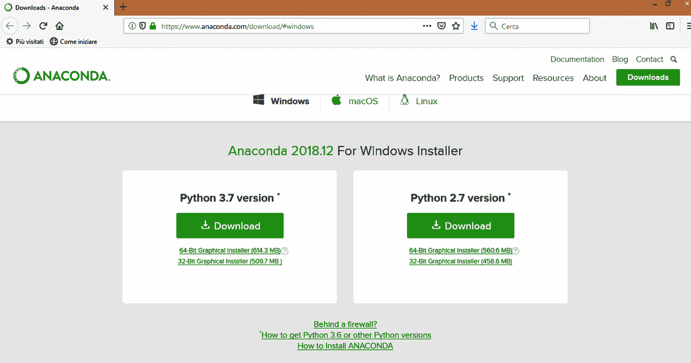
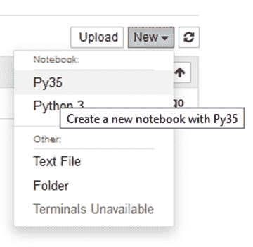
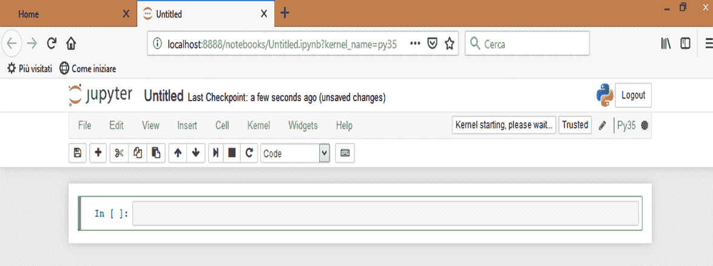
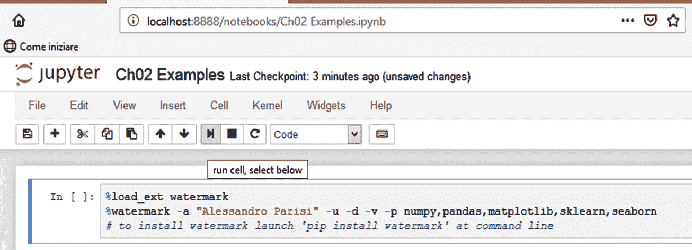
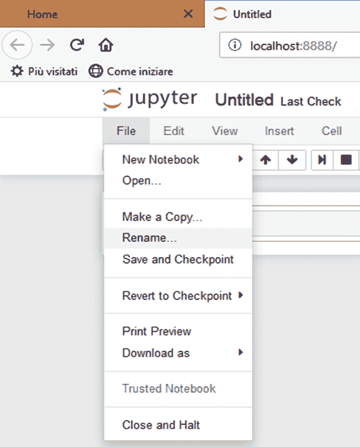
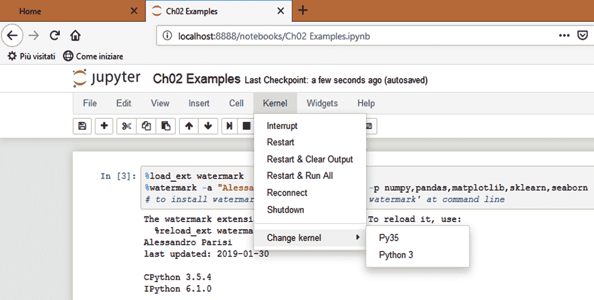
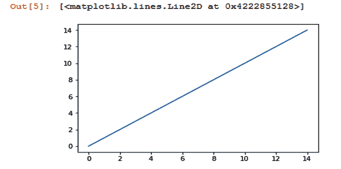
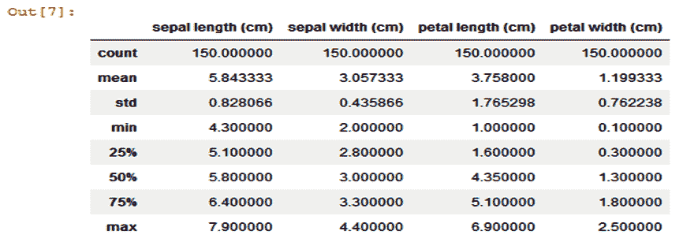

# 设置你的 AI 网络安全武器库

本章介绍了主要的软件要求及其配置。你将学习如何通过恶意代码样本喂养知识库，这些样本将作为输入传递给 AI 程序。还将介绍 IPython notebook，用于交互式执行 Python 工具和命令。

本章将涵盖以下主题：

+   了解 Python 在 AI 和网络安全中的应用

+   进入 Anaconda——数据科学家首选的开发环境

+   玩转 Jupyter Notebook

+   喂养你的 AI 武器库——在哪里可以找到数据和恶意样本

# 了解 Python 在 AI 和网络安全中的应用

在所有可以用于编程 AI 工具和算法的语言中，Python 是近年来持续增长并受到新老程序员青睐的语言。尽管竞争激烈，如 R 语言和 Java 都拥有成千上万的开发者，Python 已经获得了作为 **数据科学** 和 (最重要的) **机器学习** (**ML**)、**深度学习** (**DL**)，以及更广泛的 **人工智能** (**AI**) 算法开发首选语言的声誉。

Python 在这些领域的成功并不令人惊讶。Python 最初是为编写数值计算程序而开发的，但后来扩展到非专业领域，成为一种通用编程语言，与 C++ 和 Java 等更为人熟知的语言并列。

Python 的成功归因于以下几个原因：

+   **易于学习**：语言学习曲线的陡峭程度确实比其他语言，如 C++ 和 Java 要低得多。

+   **加速代码原型开发与代码重构过程**：得益于简洁的设计和清晰的语法，Python 编程比其他语言容易得多。调试代码也变得更加容易。用 Python 开发的程序原型在没有进一步修改的情况下发布并投入运行并不罕见。这些特性在数据科学和 AI 等领域至关重要。这些领域的特点是需要快速原型化新功能并重构旧功能，而不必浪费时间调试遗留代码，因此急需一种加速代码原型开发和重构的方法。

+   **解释性语言与面向对象编程**：能够以脚本的形式编写代码，该代码可以直接在命令行上启动，或者更好的是，以交互模式运行（如我们稍后所见），无需进行可执行格式的编译，这大大加速了开发过程和应用程序测试。面向对象编程还促进了 API 和可重用功能库的开发，确保代码的可靠性和健壮性。

+   **开源库的广泛可用性，扩展了编程功能**：到目前为止我们讨论的好处，转化为大量高级函数库的可用性，这些库可以自由供分析师和开发人员使用，并由庞大的 Python 社区提供。这些函数库可以轻松地相互集成，得益于简洁的语言设计，这促进了 API 的开发，开发人员可以方便地调用这些 API。

现在，让我们深入了解 Python 中最常用的 AI 编程库。

# Python 的 AI 库

正如预期的那样，Python 中有许多可用于数据科学和机器学习（ML）领域的库，包括深度学习（DL）和**强化学习**（**RL**）。

同样，也有许多图形表示和报告功能。接下来的章节，我们将分析这些库的特点。

# NumPy 作为 AI 的构建模块

在所有专门用于数据科学和 AI 的 Python 库中，毫无疑问，NumPy 占据了一个特殊的位置。利用 NumPy 实现的功能和 API，可以从零开始构建机器学习算法和工具。

当然，拥有专门的 AI 库（例如`scikit-learn`库）可以加速 AI 和机器学习工具的开发过程，但为了充分理解使用这些高级库带来的优势，理解它们构建的基础组件是非常有用的。这就是为什么了解 NumPy 的基本概念在这方面非常重要。

# NumPy 多维数组

**NumPy**的创建是为了解决重要的科学问题，其中包括**线性代数**和**矩阵计算**。与 Python 语言本身提供的数组列表等数据结构相比，它提供了特别**优化的版本**，使得**多维**数组对象`ndarrays`得以使用。实际上，`ndarray`类型的对象使得操作加速，速度可达到传统`for`循环的 25 倍，这对于管理存储在传统 Python 列表中的数据访问非常必要。

此外，NumPy 还允许对矩阵进行操作管理，这对于实现机器学习算法特别有用。与`ndarray`对象不同，矩阵是只能具有二维的对象，表示线性代数中使用的主要数据结构。

下面是一些定义 NumPy 对象的示例：

```
import numpy as np
np_array = np.array( [0, 1, 2, 3] )

# Creating an array with ten elements initialized as zero
np_zero_array = np.zeros(10)
```

# 使用 NumPy 进行矩阵操作

如前所述，矩阵及其上的操作在机器学习领域尤其重要，更一般来说，它们用于方便地表示需要输入 AI 算法的数据。

矩阵在管理和表示大量数据时特别有用。

符号本身通常用于标识矩阵中的元素，利用位置索引可以执行一致的、快速的操作，并进行涉及整个矩阵或特定子集的计算。例如，矩阵中的元素可以轻松识别，交叉行与列。

由一行（和多列）组成的特殊矩阵被称为**向量**。*向量可以在 Python 中表示为`list`类型的对象。

然而，在进行**矩阵与向量**之间的操作时，应考虑**线性代数**中规定的特定规则。

可以对矩阵执行的基本操作如下：

+   加法

+   减法

+   标量乘法（导致每个矩阵元素乘以一个常数值）

如果对矩阵进行这样的操作相对简单，并且仅作为**必要的前提条件**，要求相加或相减的矩阵必须是**相同大小**，那么两个矩阵的加法或减法结果将是一个**新矩阵**，其元素是对应元素按行列顺序求和的结果。

在进行矩阵与矩阵或矩阵与向量的**乘法**操作时，线性代数的规则部分不同，因为例如**交换律**不像在两个标量相乘的情况下那样适用。

实际上，在两个数相乘的情况下，因子顺序不影响乘积结果（也就是说，*2 x 3 = 3 x 2*），但在两个矩阵相乘的情况下，**顺序非常重要**：

```
aX != Xa
```

这里，`X`代表**矩阵**，`a`代表**系数向量**。此外，**并非总是**可以**乘法两个矩阵**，例如当两个矩阵的**维度不兼容**时。

因此，`numpy`库提供了`dot()`函数来计算两个矩阵之间的乘积（只要这个操作是可能的）：

```
import numpy as np
a = np.array([-8, 15])
X = np.array([[1, 5], 

              [3, 4],  

              [2, 3]])
y = np.dot(X, a)
```

在前面的示例中，我们使用`np.dot()`函数计算矩阵`X`和向量`a`的乘积。

该产品是模型的表达：

```
y = Xa
```

它代表了**机器学习中最基本的模型之一**，用于将一组**权重**(`a`)与**输入数据矩阵**(`X`)相关联，从而获得估算的**输出值**(`y`)。

# 使用 NumPy 实现一个简单的预测器

为了充分理解 NumPy 中`dot()`方法在矩阵乘法操作中的应用，我们可以尝试从零开始实现一个**简单的预测器**，根据一组多个输入和相对权重，通过矩阵与向量之间的乘积来预测未来的值：

```
import numpy as np
def predict(data, w):  
     return data.dot(w)

# w is the vector of weights
w = np.array([0.1, 0.2, 0.3]) 

# matrices as input datasets
data1 = np.array([0.3, 1.5, 2.8]) 
data2 = np.array([0.5, 0.4, 0.9]) 
data3 = np.array([2.3, 3.1, 0.5])
data_in = np.array([data1[0],data2[0],data3[0]]) 
print('Predicted value: $%.2f' %  predict(data_in, w) )
```

# Scikit-learn

最佳且最常用的机器学习库之一无疑是`scikit-learn`库。`scikit-learn`库最早于 2007 年开发，提供了一系列易于重用的模型和算法，用于定制解决方案的开发，涵盖了包括以下在内的主要预测方法和策略：

+   分类

+   回归

+   降维

+   聚类

这个列表并没有结束，事实上，`scikit-learn`还提供了现成的模块，允许执行以下任务：

+   数据预处理

+   特征提取

+   超参数优化

+   模型评估

`scikit-learn`的特点在于，它除了使用 SciPy 库进行科学计算外，还使用了`numpy`库。正如我们所见，NumPy 允许通过多维数组和矩阵来优化在大数据集上执行的计算操作。

在`scikit-learn`的优势中，我们不能忘记它为开发人员提供了一个非常简洁的**应用程序编程接口**（**API**），使得从库的类中开发定制化工具变得相对简单。

作为使用`scikit-learn`中**预测分析**模板的示例，我们将展示如何基于`y`权重向量，使用**线性回归**模型对训练数据（存储在`X`矩阵中）进行预测。

我们的目标是使用在`LinearRegression`类中实现的`fit()`和`predict()`方法：

```
import numpy as np
from sklearn.linear_model import LinearRegression

# X is a matrix that represents the training dataset

# y is a vector of weights, to be associated with input dataset

X = np.array([[3], [5], [7], [9], [11]]).reshape(-1, 1) 
y = [8.0, 9.1, 10.3, 11.4, 12.6]  
lreg_model = LinearRegression()  
lreg_model.fit(X, y) 

# New data (unseen before)
new_data = np.array([[13]]) 
print('Model Prediction for new data: $%.2f' 
       %  lreg_model.predict(new_data)[0]  )

```

执行后，脚本会输出以下内容：

```
Model Prediction for new data: $13.73
```

现在让我们继续学习 Matplotlib 和 Seaborn 库。

# Matplotlib 和 Seaborn

AI 和数据科学分析师最常用的分析工具之一就是**数据的图形表示**。这是一项被称为**探索性数据分析**（**EDA**）的初步数据分析活动。通过 EDA，可以通过对数据进行简单的视觉调查，识别出将其与规律性或**更好的预测模型**相关联的可能性。

在图形库中，毫无疑问，最著名且最常用的是`matplotlib`库，通过该库可以非常简单直观地创建图表和数据图像。

**Matplotlib**基本上是一个受 MATLAB 启发的**数据绘图工具**，与 R 中使用的`ggplot`工具类似。

在下面的代码中，我们展示了一个使用`matplotlib`库的简单示例，使用`plot()`方法绘制由`numpy`库的`arange()`方法（数组范围）获取的输入数据：

```
import numpy as np 
import matplotlib.pyplot as plt  
plt.plot(np.arange(15), np.arange(15))
plt.show() 
```

除了 Python 中的`matplotlib`库，还有另一个在数据科学家中广为人知的可视化工具，叫做**Seaborn**。

Seaborn 是 Matplotlib 的扩展，它为数据科学提供了各种可视化工具，简化了分析师的工作，使他们无需从头编写图形数据表示工具，利用 `matplotlib` 和 `scikit-learn` 提供的基本功能。

# Pandas

在 Python 最常用的库中，最后（但并非最不重要的）是 `pandas` 包，它有助于简化数据清理这一日常活动（这一活动占据了分析师大部分时间），以便进行后续的数据分析阶段。

`pandas` 的实现与 R 中的 `DataFrame` 包非常相似；`DataFrame` 实际上就是一种表格结构，用于以表格形式存储数据，其中列表示变量，行表示数据本身。

在以下示例中，我们将展示一个典型的 `DataFrame` 的使用示例，该 `DataFrame` 是通过实例化 `pandas` 中的 `DataFrame` 类获得的，输入参数是 `scikit-learn` 中的一个数据集（`iris` 数据集）。

在实例化 `DataFrame` 类型的 `iris_df` 对象之后，调用 `pandas` 库的 `head()` 和 `describe()` 方法，分别显示数据集的前五条记录和数据集中的一些主要统计量：

```
import pandas as pd  
from sklearn import datasets

iris = datasets.load_iris()
iris_df = pd.DataFrame(iris.data, columns = iris.feature_names)
iris_df.head()
iris_df.describe()
```

# 网络安全的 Python 库

Python 不仅是数据科学和人工智能领域最好的语言之一，还是渗透测试员和恶意软件分析师的首选语言（与 C 和汇编等低级语言一起使用）。

在 Python 中，有无数现成的库可以使用，它们简化了研究人员的日常工作。

接下来，我们将分析其中一些最常见和最常用的库。

# Pefile

Pefile 库对于分析 Windows 可执行文件非常有用，特别是在 **静态恶意软件分析** 阶段，寻找可能的妥协迹象或可执行文件中恶意代码的存在。实际上，Pefile 使得分析 **可移植执行文件** (**PE**) 文件格式变得非常容易，而这种格式是 Microsoft 平台上对象文件（作为外部可执行功能库包含或可获取的）的标准。

因此，不仅是经典的 `.exe` 文件，还有 `.dll` 库和 `.sys` 设备驱动程序，都遵循 PE 文件格式规范。安装 Pefile 库非常简单，只需使用如下示例中的 `pip` 命令即可：

```
pip install pefile
```

安装完成后，我们可以用一个简单的脚本测试该库，例如以下脚本，它将可执行文件 `notepad.exe` 加载到运行时内存中，然后从其可执行映像中提取一些在相关 PE 文件格式字段中保存的最重要信息：

```
import os
import pefile
notepad = pefile.PE("notepad.exe", fast_load=True)
dbgRVA = notepad.OPTIONAL_HEADER.DATA_DIRECTORY[6].VirtualAddress
imgver = notepad.OPTIONAL_HEADER.MajorImageVersion
expRVA = notepad.OPTIONAL_HEADER.DATA_DIRECTORY[0].VirtualAddress
iat = notepad.OPTIONAL_HEADER.DATA_DIRECTORY[12].VirtualAddress
sections = notepad.FILE_HEADER.NumberOfSections
dll = notepad.OPTIONAL_HEADER.DllCharacteristics
print("Notepad PE info: \n")
print ("Debug RVA: " + dbgRVA)
print ("\nImage Version: " + imgver)
print ("\nExport RVA: " + expRVA)
print ("\nImport Address Table: " + iat)
print ("\nNumber of Sections: " + sections)
print ("\nDynamic linking libraries: " + dll)
```

# 波动性

另一个被恶意软件分析师广泛使用的工具是 **volatility**，它允许分析可执行进程的运行时内存，突出显示可能存在的恶意软件代码。

Volatility 是一个可编程的 Python 工具，通常在恶意软件分析和渗透测试的发行版中默认安装，如 Kali Linux。Volatility 允许从内存转储中提取关于进程的重要信息（如 API 钩子、网络连接和内核模块），为分析师提供一套使用 Python 编程的工具。

这些工具允许从内存转储中提取系统上运行的所有进程以及关于注入的 **动态链接库**（**DLLs**）的相关信息，同时可以检测到 rootkit 的存在，或者更广泛地说，可以发现 **隐藏进程** 在运行时内存中的存在，这些进程常常逃脱常见杀毒软件的检测。

# 安装 Python 库

我们已经看到一些基本的 Python 库，它们对我们的分析工作很有帮助。那么我们如何在开发环境中安装这些库呢？

作为 Python 库，显然可以通过按照语言提供的传统工具进行安装；特别是，使用 `pip` 命令，或者启动每个库包提供的 `setup.py`。然而，在 AI 和数据科学领域中，使用 Anaconda 配置分析和开发环境有一种更简单的方法，正如我们将在接下来的章节中看到的那样。

# 进入 Anaconda —— 数据科学家的首选环境

由于可用的 Python 库数量庞大，它们的安装往往特别繁琐（如果不是枯燥无味的话），尤其对于那些刚接触数据科学和 AI 领域的人来说，安装过程尤其困难。

为了简化已经预配置的开发环境的设置，像 Anaconda ([`www.anaconda.com/download/`](http://www.anaconda.com/download/)) 这样的库和工具包集合被提供出来。这使得可以快速访问最常用的工具和库，从而加快开发活动，而无需浪费时间解决包之间的依赖问题，或与不同操作系统的安装问题。

在我写这篇文章时，最新发布的 Anaconda 版本是 5.3.0（可以从[`www.anaconda.com/anaconda-distribution-5-3-0-released/`](https://www.anaconda.com/anaconda-distribution-5-3-0-released/)下载）。

你可以选择适合你平台的安装发行版，无论是 Windows、Linux 还是 macOS，32 位还是 64 位，或者 Python 3.7 还是 2.7，如下图所示：



# Anaconda Python 优势

Anaconda 是一个由 700 多个 Python 开发包组成的集合，其中包括我们在前面几段中提到的数据分析和机器学习库，还有许多其他包：

+   NumPy

+   SciPy

+   Scikit-learn

+   Pandas

+   Matplotlib

此外，Anaconda 允许您配置自定义环境，在这些环境中，您可以安装特定版本的 Python，以及开发所需的包和库。

# Conda 工具

Anaconda 提供了一个非常强大的工具，conda。通过 conda，您可以管理和更新已安装的包，或安装新包，还可以以最简单的方式创建自定义环境。

要访问 conda 帮助菜单，请从命令提示符运行以下命令：

```
conda -h
```

# 在 Anaconda 中安装包

使用 conda 工具，可以安装预安装包集合中未包含的新包。要安装新包，只需执行以下命令：

```
conda install
```

正在执行的命令将在 Anaconda Continuum Analytics 的在线仓库中搜索包。请记住，始终可以通过传统的安装方法进行操作，使用`pip install`命令或启动包中的`setup.py`文件。

显然，在这种情况下，我们必须担心解决版本之间所有可能的依赖关系和兼容性问题。

# 创建自定义环境

如前所述，Anaconda 的一个优势是它能够创建自定义环境，在这些环境中，我们可以安装特定版本的 Python 以及各种包。事实上，Anaconda 通常预装了 Python 2.7 和 Python 3.7 的版本。您可以选择结合特定版本的 Python，而不会破坏默认环境。为此，您需要创建自定义环境。

假设我们想要创建一个自定义环境，在其中安装 Python 3.5（或其他版本）。只需像以下示例一样调用 conda 工具：

```
conda create -n py35 python=3.5
```

此时，`conda` 将创建并配置名为`py35`的新自定义环境，其中安装了 Python 3.5 版本。要激活新创建的环境，只需从命令提示符运行以下命令：

```
activate py35
```

从现在开始，所有启动的命令都将在`py35`自定义环境中执行。

# 一些有用的 Conda 命令

一些有用的 Conda 命令如下：

+   要激活新创建的`py35`自定义环境，请运行以下命令：

```
activate py35
```

+   通过执行以下命令在特定环境中安装包：

```
conda install -n py35 PACKAGE-NAME
conda install -n py35 seaborn
```

+   通过运行以下命令列出特定环境中已安装的包：

```
conda list -n py35
```

+   使用以下命令更新 Anaconda：

```
conda update conda
conda update –all
```

# 强化版 Python 与并行 GPU

为了充分利用某些机器学习库，尤其是深度学习（DL），需要部署专用硬件，包括使用除传统 CPU 外的**图形处理单元**（**GPU**）。由于当前的 GPU 确实经过优化，能够执行并行计算，因此这一特性对许多 DL 算法的高效执行非常有用。

参考硬件设备如下：

+   CPU 英特尔 Core i5 第六代或更高版本（或 AMD 同等产品）

+   最低 8 GB 内存（推荐 16 GB 或更高）

+   GPU  NVIDIA GeForce GTX 960 或更高版本（更多信息请访问 [`developer.nvidia.com/cuda-gpus`](https://developer.nvidia.com/cuda-gpus)）

+   Linux 操作系统（例如 Ubuntu）或 Microsoft Windows 10

通过利用 Anaconda 提供的 Numba 编译器，你可以将 Python 代码编译并在支持 CUDA 的 GPU 上运行。

有关更多信息，请参考你 GPU 制造商的官方网站以及 Numba 文档（[`numba.pydata.org/numba-doc/latest/user/index.html`](https://numba.pydata.org/numba-doc/latest/user/index.html)）。

# 玩转 Jupyter Notebooks

在开发者最常用的工具中，毫无疑问**Jupyter Notebook**是其中之一，它允许在一个文档中集成 Python 代码及其执行结果，包括图像和图形。通过这种方式，可以在开发活动中获得即时反馈，以迭代的方式管理编程的各个阶段。

在 Jupyter Notebook 中，可以调用在自定义环境中安装的各种特定库。Jupyter 是一个基于网页的工具，因此要运行笔记本，需执行以下命令：

```
jupyter notebook
```

也可以使用`port`参数指定服务的监听端口：

```
jupyter notebook --port 9000
```

这样，服务将在`9000`端口启动（而不是默认的`8888`端口）。

Jupyter 是 Anaconda 中预安装的包之一；无需安装软件，因为它已经可以随时使用。

在接下来的段落中，我们将通过一些示例学习如何使用 Jupyter Notebook。

# 我们的第一个 Jupyter Notebook

一旦启动 Jupyter，你可以打开根目录下已有的笔记本（可以在[`localhost:8888/tree`](http://localhost:8888/tree)查看该目录），或者从头开始创建一个新的笔记本：

笔记本实际上只是扩展名为 `.ipynb` 的文本文件，里面保存了（以 JSON 格式）Python 代码和其他媒体资源（如以 base64 编码的图像）。

要创建我们的第一个笔记本，只需使用仪表盘界面中提供的菜单项，这非常直观。

我们需要做的就是选择一个文件夹来放置新创建的笔记本，然后点击“New”按钮，选择最适合我们需求的 Python 版本，如下图所示：



到此为止，我们可以重命名新创建的笔记本，然后继续在文档中插入单元格：



我们可以指定单元格的内容类型，在代码（默认）、文本、Markdown 和其他选项之间进行选择：



# 探索 Jupyter 界面

接下来，我们将更详细地探讨一些常见的笔记本管理任务，从文件重命名开始。新创建的笔记本默认文件名为 `Untitled.ipynb`。在重命名笔记本时，我们必须记住这一点；此时笔记本不应处于运行状态。因此，请确保在为笔记本分配新名称之前，选择文件 | 关闭并停止 菜单项；只需在目录中选择要重命名的文件，然后在仪表板控制中点击重命名：



# 单元格中有什么？

单元格是可以插入不同类型内容的容器；单元格中最常见的内容显然是要在笔记本中执行的 Python 代码，但也可以插入纯文本或 Markdown。

当我们插入 Python 代码时，执行结果会立即显示在代码下方，位于同一个单元格内。要插入新单元格，请点击菜单栏中的 插入，并选择 插入下方单元格。

另外，也可以使用快捷键来操作。

# 有用的快捷键

为了加快最常用命令的执行，Jupyter 界面为我们提供了一系列的快捷键，包括以下内容：

+   *Ctrl* + *Enter*：运行选定的单元格

+   *Esc* 或 *Enter*：在编辑模式和命令模式之间切换

+   上下箭头：上下滚动单元格（命令模式）

+   按 *A* 或 *B*：在活动单元格的上方或下方插入新单元格

+   按 *Y*：将活动单元格设置为代码单元格

+   按 *M*：将活动单元格转换为 Markdown 单元格

+   按 *D* 两次：删除活动单元格

+   按 *Z*：撤销单元格删除

# 选择你的笔记本内核

笔记本的一个特别有趣的功能是，每个笔记本背后都有一个特定的内核。当我们执行包含 Python 代码的单元格时，该代码会在笔记本的**特定内核**中执行。

我们可以为单个笔记本选择并分配一个特定的内核，以防我们安装了多个不同的环境：



实际上，不仅可以为不同版本的 Python 安装不同的内核，还可以为其他语言（如 Java、C、R 和 Julia）安装内核。

# 实际操作

为了结束 Jupyter Notebook 的操作，我们现在将尝试插入一系列包含示例 Python 代码的单元格，回顾所需的库和包，并按以下步骤进行：

1.  继续插入一个新单元格，在其中编写以下命令：

```
# Execute plot() inline without calling show()
%matplotlib inline
import numpy as np 
import matplotlib.pyplot as plt  
plt.plot(np.arange(15), np.arange(15))
```

我们应该得到以下输出：



1.  现在，添加一个新单元格，在其中编写以下代码：

```
import numpy as np 
from sklearn.linear_model import LinearRegression

# X is a matrix that represents the training dataset
# y is a vector of weights, to be associated with input dataset

X = np.array([[3], [5], [7], [9], [11]]).reshape(-1, 1) 
y = [8.0, 9.1, 10.3, 11.4, 12.6]  
lreg_model = LinearRegression()  
lreg_model.fit(X, y) 

# New data (unseen before)
new_data = np.array([[13]]) 
print('Model Prediction for new data: $%.2f' 
       %  lreg_model.predict(new_data)[0]  ) 
```

运行上述代码后，我们应该会得到以下输出：

```
Model Prediction for new data: $13.73
```

1.  最后，我们插入一个新单元格，在其中编写以下代码：

```
import pandas as pd  
from sklearn import datasets
iris = datasets.load_iris()
iris_df = pd.DataFrame(iris.data, columns = iris.feature_names)
iris_df.head()
iris_df.describe()
```

启动单元格中的代码执行后，我们应该会得到以下输出：



恭喜！如果一切如描述所示，您已经成功验证了配置，并可以继续进行后续操作。

# 安装深度学习库

在本节中，我们将考虑安装一些主要的 Python 库用于人工智能的优势，特别是为了发挥深度学习的潜力。

我们将覆盖的库如下：

+   TensorFlow

+   Keras

+   PyTorch

在发现各个库的优势并进行安装之前，让我们先简单谈谈深度学习在网络安全中的优势和特点。

# 深度学习在网络安全中的优缺点

深度学习相比于其他人工智能领域的一个显著特点是，能够通过利用神经网络来发挥通用算法的优势。通过这种方式，可以面对包含多个不同应用领域的相似问题，并重用在不同背景下开发的常用算法。

深度学习方法利用**神经网络**（**NNs**）的可能性，添加多个处理层，每一层负责执行不同类型的处理，并与其他层共享处理结果。

在神经网络中，至少有一层是隐藏的，从而模拟人类大脑神经元的行为。

深度学习最常见的应用包括以下几种：

+   语音识别

+   视频异常检测

+   **自然语言处理**（**NLP**）

这些用例在网络安全领域尤为重要。

例如，在**生物识别认证**程序中，随着越来越多的深度学习算法的应用，深度学习也可以成功用于检测异常的用户行为，或者在**欺诈检测**过程中，识别支付工具的异常使用，如信用卡。

深度学习的另一个重要应用是检测可能的恶意软件或网络威胁。鉴于深度学习的广泛潜力，甚至坏人也开始使用它，这一点应该不足为奇。

特别是，最近进化型神经网络的传播，如**生成对抗网络**（**GANs**），对传统的生物识别认证程序构成了严峻挑战，这些程序依赖于**人脸识别**或**语音识别**。通过使用 GAN，实际上可以生成**生物识别证据的人工样本**，这些样本几乎无法与原始样本区分。

我们将在接下来的章节中深入探讨这一点。

现在，让我们来看一下如何在我们的开发环境中安装主要的深度学习库。

# TensorFlow

我们将要处理的第一个深度学习库是 TensorFlow；事实上，它扮演了一个特殊角色，因为它是专门为编程**深度神经网络**（**DNN**）模型而开发的。

要在 Anaconda 中安装 TensorFlow，首先必须创建一个自定义环境（如果还没有创建的话），可以按以下步骤操作：

在我们的案例中，我们将使用之前创建的自定义环境 `py35`：

1.  使用 conda 安装 TensorFlow：

```
conda install -n py35 -c conda-forge tensorflow
```

1.  使用以下命令安装特定版本的 TensorFlow：

```
conda install -n py35 -c conda-forge tensorflow=1.0.0
```

1.  我们可以通过在交互式 conda 会话中运行一个示例 TensorFlow 程序来测试我们的安装，方法如下：

```
activate py35
python
>>> import tensorflow as tf
>>> hello = tf.constant('Hello, TensorFlow!')
>>> sess = tf.Session()
>>> print(sess.run(hello))
```

获取更多文档，请访问 TensorFlow 官网：[`www.tensorflow.org/`](https://www.tensorflow.org/)

# Keras

我们将安装的另一个深度学习库是 `keras`。

Keras 的特点是可以安装在 TensorFlow 之上，从而构成一个高层次接口（相对于 TensorFlow）用于神经网络（NN）开发。与 TensorFlow 一样，对于 Keras，我们将继续在之前创建的自定义环境 `py35` 内进行安装，执行以下命令：

```
conda install -n py35 -c conda-forge keras
```

获取更多文档，请访问 Keras 官网：[`keras.io/`](https://keras.io/)。

# PyTorch

我们将在这里检查的最后一个深度学习库是 `pytorch`。

PyTorch 是 Facebook 开发的一个项目，专门设计用于执行大规模的图像分析。即使是 PyTorch，通过 conda 在 `py35` 环境中的安装也非常简单：

```
conda install -n py35 -c peterjc123 pytorch
```

# PyTorch 与 TensorFlow

为了比较这两个学习库，需要注意的是，PyTorch 是在 GPU 上执行张量计算任务时优化效果最好的解决方案，因为它特别设计用于在大规模场景下提升性能。

使用 PyTorch 的一些常见应用场景如下：

+   自然语言处理（NLP）

+   大规模图像处理

+   社交媒体分析

然而，仅从性能上进行比较，PyTorch 和 TensorFlow 都是非常优秀的选择；还有其他一些特点可能会让你偏向选择其中一个解决方案。

例如，在 TensorFlow 中，程序的调试比在 PyTorch 中更为复杂。这是因为，在 TensorFlow 中，开发过程更加繁琐（需要定义张量、初始化会话、在会话中跟踪张量等等），而 TensorFlow 模型的部署则无疑更受偏好。

# 总结

本章介绍了在网络安全领域开展分析和开发活动所必需的工具。我们审视了主要的 AI 库，并介绍了在网络安全领域使用深度学习的优缺点。

在接下来的章节中，我们将学习如何以最佳方式使用手头的工具，意识性地选择那些最能体现我们安全分析策略的工具。

在下一章中，我们将从开发适当的分类器开始，专注于电子邮件垃圾邮件检测。
