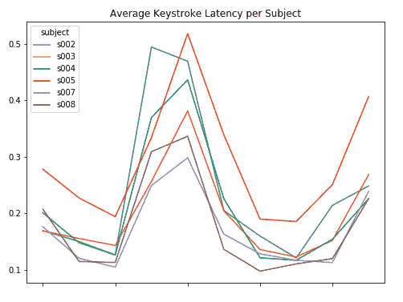
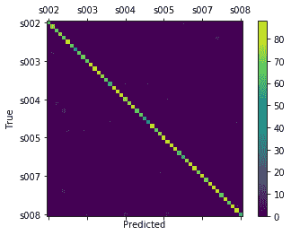
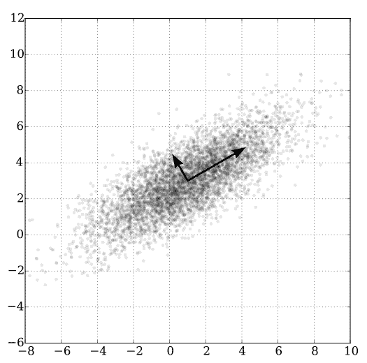
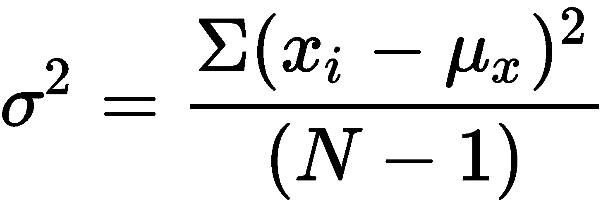
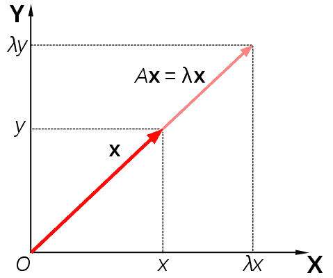
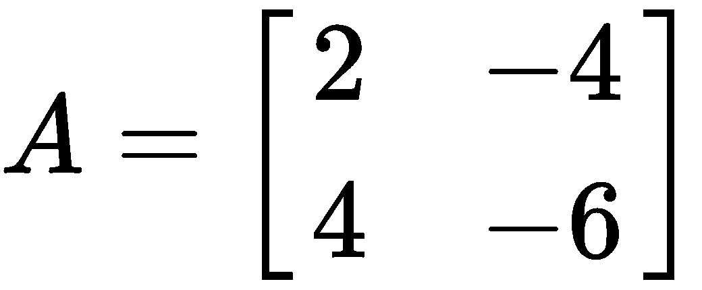
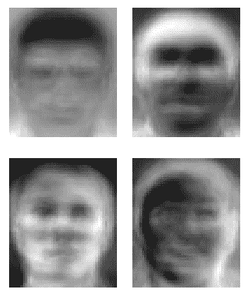

# 确保用户身份验证的安全

在网络安全领域，**人工智能**（**AI**）在保护用户敏感信息方面扮演着越来越重要的角色，包括他们用于访问网络账户和应用程序的凭证，以防止身份盗窃等滥用行为。

本章将涵盖以下主题：

+   防止身份验证滥用

+   账户声誉评分

+   用户身份验证通过击键识别

+   人脸识别生物识别身份验证

# 防止身份验证滥用

在当前这种日益去中心化的背景下，传统服务逐渐以数字形式提供（如电子商务、网上银行等），正确识别并防止可能针对用户数字身份的威胁变得尤为重要，例如身份盗窃的风险。此外，随着**物联网**（**IoT**）的迅速发展，通过伪造凭证（或从合法拥有者处盗取凭证）获得未经授权的访问权限的可能性比以往任何时候都更高。

这是由于网络空间的维度及其增加的攻击面所致，网络空间的攻击面由可以在人与机器之间以及机器与机器之间建立的连接数量的指数级增长所决定，这使得信息泄露的风险更大。

保护用户账户不仅是数据完整性的问题，也是任何企业的声誉风险，因为这可能会引发对第三方的法律责任。

只需想想有关虚假账户扩散的问题，这些账户是故意创建的，目的是获取用户的机密和敏感信息。还有恶搞账户的问题，它们可能会混淆和误导那些不知道这些虚假账户性质的合法用户。

随着自动化服务的普及，这些服务越来越多地由算法管理，从法律角度来看，确保通过自动化程序收集的敏感信息的正确性和合法性变得至关重要；企业可能会根据欧盟的**通用数据保护条例**（**GDPR**）所确立的责任原则被要求承担相应责任。

因此，必须采取所有必要的组织措施，以确保用户账户的安全，这通过监控可疑活动来实现，例如试图破解密码的行为。

保护用户账户的一个弱点是密码保护不足。

# 密码是否已经过时？

密码一直是确保用户账户安全的主要工具；然而，它们已经暴露出自己的局限性。

随着在线服务数量的增加（以及用于访问这些服务的不同平台的增多），用户必须记住的密码数量也随之增加。

由于构成可靠密码的字母数字代码的强度与其易于管理性相对立，用户常常为多个账户和服务使用相同的密码。

这有助于攻击面扩大，从而增加被入侵的风险。如果攻击者成功窃取了用户的凭证（例如，他们的个人电子邮件账户），那么他们很可能也能破坏其他凭证，因此成功窃取受害者的数字身份。

身份盗窃的风险，实际上是用户可能面临的主要威胁之一。一旦受害者的身份被侵犯，攻击者便可以展开一系列非法活动，比如通过以受害者名义开设银行账户进行洗钱，这一切都以受害者的凭证为掩护，而受害者往往对这些非法活动一无所知。

随着时间的推移，采纳集成密码认证和账户授权程序的安全措施并非偶然。这些措施部署了旨在提高上下文意识的监控任务，也就是说，分析和界定与使用访问凭证相关的活动，在对个体用户来说，处于正常（或可疑）情境中的活动。

保护用户账户不仅仅限于验证输入密码的正确性及密码与用户账户的一致性，还包括记录的各种账户活动，如来自不同地理区域的 IP 地址的同时访问，或者使用不同的设备，如 PC、智能手机、浏览器和操作系统，这些都是不常见的或之前从未使用过的。

这一监控的目标显然是检测攻击者可能通过利用之前被泄露的密码来访问用户账户，进而窃取凭证。

为了实现这种水平的上下文安全意识，必须将发生在用户账户上的监控活动与使用自动学习算法的异常检测程序结合，从而根据用户的习惯和行为学习区分不同的可疑活动。

还可以用身份验证程序来替代相同的密码，这些程序利用用户的生物识别凭证，如虹膜、声音、指纹或面部特征。

在这种情况下，将识别程序限制为单一生物特征证据并不合适，尽管它是强大的，但仍然是可以被伪造的（可以通过利用用于验证生物特征数据的传感器的局限性和漏洞来伪造）。相反，我们应当将其与其他验证用户凭据的方法结合起来。

# 常见的认证实践

为了确保凭据确实属于账户的合法拥有者，随着时间的推移，已经引入了各种形式的验证，其中一些基于采用第二重认证因素，如插入通过短信传送到用户电话号码的临时密码，或者通过与用户账户关联的电子邮件地址发送的 OTP 验证码。这类程序的可靠性基于次要因素，如用于接收和管理这些认证因素的支持和通道的完整性。

如果用户的电子邮件账户被黑客入侵，或者智能手机上安装了恶意软件，该恶意软件会自动转发短信验证码（OTP）给攻击者，那么第二重认证因素在安全方面的无效性就显而易见。

第二重认证因素的有效性假设基于所使用支持的多样化。换句话说，建议用户不要将所有个人敏感信息都保存在同一支持中（遵循其中一种最知名的风险管理最佳实践，即*不要把所有的鸡蛋放在同一个篮子里*）。

如果这种多样化假设未被验证，那么基于第二重认证因素的认证程序的可靠性也必然会失效。

# 如何识别虚假登录

从我们到目前为止所说的内容来看，应该清楚的是，基于安全令牌的认证程序，如密码、短信、OTP 等，至少应与自动化的异常检测程序结合使用。

与用户账户管理相关的异常之一是：

+   暴力破解访问尝试，旨在通过在有限时间内输入不同的密码来识别用户的密码

+   来自不同地理区域的 IP 地址的同时访问

+   用户使用不常见的设备、软件和操作系统

+   与人工操作员不兼容的频率和打字速度

显然，待监控事件的列表可以根据具体的分析背景增加和变化。然而，一旦提供了代表性事件的历史基础，自动检测异常是非常重要的。

# 虚假登录管理——反应式与预测性

一旦与可疑访问相关的代表性事件积累起来，了解所要遵循的管理策略就变得至关重要。

更传统的方式是配置**反应式**报警系统；也就是说，一旦发现可能的未经授权访问，报警系统会触发事件（反应），并自动暂停或封锁用户账户。

虽然反应策略实施起来较为简单，但它会带来以下重要的副作用和缺点：

+   **拒绝服务**（**DoS**）攻击可能会针对合法用户；攻击者通过模拟未经授权的访问尝试来触发报警系统自动封锁用户账户，从而损害组织的声誉，增加对用户和提供服务的公司造成的干扰。

+   反应式报警系统通常设有与相关事件相关的默认触发器。事件的校准是针对所有用户全局进行的，系统不会根据用户的特定行为来识别单个用户。

+   反应策略通过后视镜来看现实，即假设未来和过去一样，因此不能自动适应上下文的快速变化。

+   反应策略通常基于对异常活动峰值的监控，即如果行为超过了被认为是正常的某个预设水平，则被认为是可疑的。这种情况发生在**隐秘**模式下进行的攻击中，攻击者不会引起超过报警阈值的异常活动峰值。攻击者可以在系统内部保持隐蔽，并且能够不受干扰地进行信息收集和滥用操作。曾经发生过一起大规模的用户账户违规事件，目标是雅虎！网络门户。该事件是在隐秘模式下进行的，直到几年后，违规行为才被发现并公之于众。

相反，为了应对用户账户被攻击的策略，必须考虑可能影响用户和攻击者行为的上下文和场景变化，这就需要采用预测性异常检测方法，从对过去数据的分析出发，揭示潜在的模式，外推用户未来的行为，并及时识别潜在的攻击或欺诈尝试。

# 预测不可预测的事件

预测分析的任务是揭示隐藏的模式，识别数据中的潜在趋势。为此，需要结合各种数据挖掘和**机器学习**（**ML**）方法，以便利用来自组织中各类异构信息源的结构化和非结构化数据集。

通过这种方式，可以将原始数据转化为可操作的预测响应，应用不同的自动化学习算法对数据进行处理。

不同的算法显然会在预测准确性方面提供不同的结果。

正如我们在前几章中看到的，当我们需要处理**离散**的答案（垃圾邮件或正常邮件）时，分类算法特别适用，而当我们需要**连续**的输出（即，具有更高粒度的输出值）时，回归算法是我们首选的选择。

类似地，管理大规模分类任务时，我们可以考虑使用线性**支持向量机**（**SVMs**）和使用**决策树**及**随机森林**，这些通常在我们需要对数据进行分类时提供最佳结果。

需要特别提及的是无监督学习和聚类算法，它们在探索数据中潜在和未知的模式时特别有效，能够执行诸如异常检测、可疑用户行为等任务。

# 选择正确的特征

采取预测方法以检测可能的用户账户违规行为，意味着选择正确的监控特征。这些特征会根据我们认为可能发生的威胁而有所不同。

在防止通过暴力破解用户凭证（用户 ID 和密码）进行攻击的情况下，监控失败的访问尝试（登录次数）及其增长速率和随时间的变化可能就足够了。其他情况下，监控的元素可能是密码更改的频率、失败的登录、密码恢复等。

更困难的是检测可能由攻击者执行的隐形攻击，这些攻击者已经获取了正确的用户密码（因为他们之前已经破坏了与用户账户相关联的电子邮件账户，从而利用密码恢复程序），或者检测到被劫持的用户会话（也称为**会话劫持**，它是指滥用由合法用户正常启动的会话，并被攻击者利用以实现欺诈目的），而没有明显的账户凭证泄露。

在这种情况下，监控与用户登录相关联的 IP 地址可能很有用，以验证是否有来自相距遥远的地理区域的同时访问，或者是否在短时间内频繁访问，使用的是对特定用户不常用的设备和软件。

# 防止虚假账户创建

用户账户的创建也是一项需要监控的活动，以防止虚假账户在我们的平台上蔓延；只需想想这些虚假账户通过混淆和欺骗合法用户，诱使他们做出可能导致欺诈或账户泄露的行为。

需要监控的事件可以追溯到假档案创建过程中通常涉及的阶段，即请求激活新账户和识别现有账户中的假档案，这些账户因用户不当行为必须被阻止或取消。

新账户异常创建的一个可能指示器（这些账户很有可能是虚假档案）是，由同一 IP 地址在短时间内（例如不到一小时内）激活大量新账户。

对于现有账户，一个可以可靠地指示假档案存在的异常指示器可能是大量用户帖子在短时间内发布，这使我们认为一个旨在在平台上传播垃圾邮件的机器人可能存在。

# 账户声誉评分

因此，用户账户活动的监控必须考虑到新创建和现有账户，以防止现有账户被攻击者侵入后进行恶意活动。建议将声誉度量（声誉评分）与用户的行为相关联，以此来估算。这种声誉评分还能帮助我们识别隐蔽模式下进行的攻击，从而防止攻击未被察觉。它通过利用报警系统来监控异常和嘈杂的活动峰值，达到了这一目的。

在估算与每个用户账户相关的声誉分数时，我们可以考虑各种特征：

+   用户在一段时间内发布的帖子数量和频率

+   通过代理、VPN 或其他 IP 匿名化系统访问用户账户

+   使用不常见的用户代理（例如脚本）登录

+   用户在键盘上打字的速度

这些以及其他特征可以有效地考虑用于训练我们的算法，并动态地估算个别用户的声誉分数。

# 分类可疑的用户活动

一旦我们积累了足够的特征来填充我们的数据集，就需要决定采取什么样的策略来训练我们的算法。特别是，自然采用的方法是监督学习，这通过利用我们已掌握的信息并利用我们之前对被认为是可疑账户的分类来实现。事实上，我们可能已经在黑名单中积累了不少用户账户，或使用基于规则的检测系统将其标记为可疑。

作为正向训练的例子，我们可以考虑与被暂停或列入黑名单的账户相关的特征，而与仍然启用的账户相关的特征则可以作为负向训练的例子。我们只需要选择最适合我们用例的监督学习算法，然后进入训练阶段，使用之前识别并与前述正向和负向示例相关联的标签进行训练。

# 监督学习的优缺点

无论看起来跟随监督学习策略多么合乎逻辑，都必须考虑到其中的 методологические 风险。

其中一个主要问题是，我们的算法将难以识别新的可疑活动案例，因为它们已经受到先前分类标签的影响，而这些标签可能会受到系统性错误的影响。为了重新训练我们的模型，以便检测新的可疑活动形式，我们将被迫插入不同于之前的分类规则，这些新规则应能正确检测与新样本相关联的新标签。

然而，这并不能避免放大之前在我们模型中引入的系统性错误的风险；如果我们错误地将某些用户类别列入黑名单（例如，所有从属于特定地理区域的 IP 地址连接的用户，而该地区之前被认定为垃圾邮件活动的来源），我们将向模型中引入假阳性，这将导致模型自我反馈并加剧这一问题。

为了减少这些假阳性对结果的扭曲效果，我们应该在每个后续训练阶段对提交给算法的样本进行适当的加权。

# 聚类的优缺点

另一种可以用来对用户账户可疑活动进行分类的方法是聚类。通过根据用户活动类型（如用户发帖频率、在平台上花费的时间、登录频率等）将用户账户分为同质化组，也可以识别出可能涉及多个被相同攻击者攻击的账户的可疑活动。例如，这些攻击者可能试图通过协调多个账户的活动，传播垃圾邮件或发布不受欢迎的帖子。

聚类实际上是一种能够发现不同用户群体之间相似性（甚至是隐藏的相似性）的方法；一旦将用户分为不同的群集，我们就需要确定哪些群集实际上代表了可疑活动，并在每个群集中，识别出哪些账户涉及可能的欺诈行为。

然而，即便在聚类的情况下，也需要仔细选择使用的算法类型：事实上，并非所有的聚类算法都能有效地检测到可疑活动。

例如，聚类算法（如 k-means）要求正确确定聚类的数量（通过预先定义参数 k 的值，该值也决定了算法的名称），这一特性在实际检测可疑用户活动时并不十分适用，因为我们通常无法准确地定义将账户分组的聚类数量。

此外，像 k-means 这样的算法不能与以类别或二进制分类值表示的特征一起使用。

# 用户认证通过击键识别进行

鉴于我们之前提到的限制和方法学问题，近年来，我们越来越多地采用新型的生物识别方式来检测可疑用户账户。由于神经网络的广泛应用，这些技术的使用变得比过去更加便捷。

相同的用户认证过程通常也通过生物识别技术实现，生物识别技术（如果没有取而代之的话）会补充（甚至替代）传统的基于密码的认证方式。

当我们谈论生物识别时，可以考虑一些独特的身体特征，这些特征可以可靠地且独特地追溯到特定的用户，如虹膜、面部、指纹、声音等。行为和习惯也可以通过模式来识别，这些模式通常可以可靠地与个体用户关联；在这些生物识别行为中，击键输入（也称为击键动态）就像手写一样，有助于可靠地识别不同的个体。

# Coursera Signature Track

用户认证的第一个具体应用实例是 Coursera 引入的 Signature Track 技术，该技术几年前开始用于识别参与考试的学生，以确认他们在完成课程后所获得的成就证书的有效性。

Coursera 采用的 Signature Track 技术，在 Andrew Maas、Chris Heather、Chuong（Tom）Do、Relly Brandman、Daphne Koller 和 Andrew Ng 共同撰写的论文《MOOCs 与推动学习和学习研究的技术，提供大规模开放在线课程的认证证书》（*MOOCs and Technology to Advance Learning and Learning Research, Offering Verified Credentials in Massive Open Online Courses*）中有所描述，该论文发表于 Ubiquity Symposium（[`ubiquity.acm.org`](http://ubiquity.acm.org)），其目的是解决如何为每个学生分配用户凭证，以便能够可靠地验证他们的身份。

Signature Track 是一个过程，通过它可以将学生的课程作业与其真实身份相连接，因此，在课程结束时，学生将获得由 Coursera 和提供课程的大学共同颁发的经过验证的证书，证书上会写明他们的名字。

该证书具有唯一的验证代码，允许第三方（如雇主）验证真实候选人完成课程的情况。

Signature Track 的独特特征不仅与身份验证和身份确认程序相关，还与高规模维度相关，这得益于 Coursera 注册学生数量的不断增长；实际上，Coursera 的一门课程通常涉及 40,000 到 60,000 名学生。因此，身份验证和身份确认程序的特点是高效，不需要讲师或工作人员的干预。

此外，与其他网络服务（如在线银行或电子商务）不同，Coursera 用户账户的验证和身份认证管理变得复杂，因为用户容易将登录凭证提供给他人，以便他人代为完成作业。这一特殊性促使 Coursera 采用了两种基于人脸识别和与个体学生相关的打字模式的独立生物识别和摄影认证方法。在注册阶段，Coursera 要求学生通过网络摄像头提供一张照片，并附上身份证明文件的副本。

此外，在注册阶段，学生被要求在键盘上输入一句简短的句子，以便识别他们自己的生物识别击键资料。这是通过击键动态实现的。

# 击键动态

击键动态基于按键事件的节奏和韵律，这些特征对每个学生来说都是独特的；然而，由于一系列外部随机因素的影响，例如中断、错误修正或使用特殊功能键（如*Shift*或*Caps Lock*），这些事件无法直接用于机器学习算法。

因此，有必要将表示用户打字行为的原始数据转换为一组能够正确表示用户键盘动态的特征数据集，从而清除数据中的随机干扰因素。

# 基于击键动态的异常检测

关于使用击键动态进行异常检测的首批科学研究之一是 Kevin S. Killourhy 和 Roy A. Maxion 撰写的论文《Comparing Anomaly-Detection Algorithms for Keystroke Dynamics》。该研究的作者提出了收集击键动态数据集，以测量不同检测器性能的方法；他们收集了 51 名受试者输入 400 个密码时的数据，并提交了 14 种不同算法收集的数据，这些算法通过用户检测性能来评估。

本研究的目的是可靠地识别那些通过不同的打字模式窃取其他用户密码的冒充者。

尝试使用被盗密码进行身份验证的冒充者，将会根据与真实用户不同的击键动态特征被识别并及时阻止。

用于确定击键动态的一些特征如下：

+   **Keydown-keydown**：这是连续按键之间按下时间的间隔。

+   **Keyup-keydown**：这是按键释放与下一个按键按下之间的时间间隔。

+   **Hold**：这是每个按键按下和释放之间的时间间隔。

从原始数据中提取出一组时序特征，这些特征将被输入到用户检测算法中。

# 击键检测示例代码

以下是基于前一部分中提到的研究《比较击键动态中的异常检测》描述的数据集的击键动态实现示例；该数据集也可以在[`www.cs.cmu.edu/~keystroke/DSL-StrongPasswordData.csv`](https://www.cs.cmu.edu/~keystroke/DSL-StrongPasswordData.csv)处下载，格式为`.csv`。

如预期，数据集包含 51 个受试者，每个受试者输入 400 个密码；同时收集的度量包括这些保持时间（在数据集中以`H`标签表示）：

+   Keydown-keydown 时间（标记为`DD`）

+   Keyup-keydown 时间（标记为`UD`）

击键检测脚本的代码如下：

```
import numpy as np
import pandas as pd
from matplotlib import pyplot as plt
%matplotlib inline

from sklearn.model_selection import train_test_split
from sklearn import metrics

from sklearn.neighbors import KNeighborsClassifier
from sklearn import svm
from sklearn.neural_network import MLPClassifier

pwd_data = pd.read_csv("https://www.cs.cmu.edu/~keystroke/DSL-StrongPasswordData.csv", header = 0)

# Average Keystroke Latency per Subject

DD = [dd for dd in pwd_data.columns if dd.startswith('DD')]
plot = pwd_data[DD]
plot['subject'] = pwd_data['subject'].values
plot = plot.groupby('subject').mean()
plot.iloc[:6].T.plot(figsize=(8, 6), title='Average Keystroke Latency per Subject')
```

脚本的结果可以在以下图表中看到：



脚本继续进行数据集拆分，然后应用不同的分类器，如以下示例所示：

```
data_train, data_test = train_test_split(pwd_data, test_size = 0.2, random_state=0)

X_train = data_train[pwd_data.columns[2:]]
y_train = data_train['subject']

X_test = data_test[pwd_data.columns[2:]]
y_test = data_test['subject']

# K-Nearest Neighbor Classifier
knc = KNeighborsClassifier()
knc.fit(X_train, y_train)

y_pred = knc.predict(X_test)

knc_accuracy = metrics.accuracy_score(y_test, y_pred)
print('K-Nearest Neighbor Classifier Accuracy:', knc_accuracy)
K-Nearest Neighbor Classifier Accuracy: 0.3730392156862745

# Support Vector Linear Classifier
svc = svm.SVC(kernel='linear') 
svc.fit(X_train, y_train)
y_pred = svc.predict(X_test)

svc_accuracy = metrics.accuracy_score(y_test, y_pred)
print('Support Vector Linear Classifier Accuracy:', svc_accuracy)
Support Vector Linear Classifier Accuracy: 0.7629901960784313

# Multi Layer Perceptron Classifier
mlpc = MLPClassifier()
mlpc.fit(X_train,y_train)

y_pred = mlpc.predict(X_test)
mlpc_accuracy = metrics.accuracy_score(y_test, y_pred)
print('Multi Layer Perceptron Classifier Accuracy:', mlpc_accuracy)
Multi Linear Perceptron Classifier Accuracy: 0.9115196078431372
```

现在我们可以绘制`多层感知器（MLP）`结果的混淆矩阵：

```
# Drawing confusion matrix for Multi Layer Perceptron results
from sklearn.metrics import confusion_matrix

labels = list(pwd_data['subject'].unique())
cm = confusion_matrix(y_test, y_pred, labels) 

figure = plt.figure()
axes = figure.add_subplot(111)
figure.colorbar(axes.matshow(cm))
axes.set_xticklabels([''] + labels)
axes.set_yticklabels([''] + labels)
plt.xlabel('Predicted')
plt.ylabel('True')
```

脚本绘制的混淆矩阵如以下图所示：



在前面的代码示例中，使用了三种不同的分类器（均可在`scikit-learn`库中找到），并按预测准确度从低到高的顺序展示了它们的使用。

我们从`KNeighborsClassifier`聚类算法开始，经过支持向量机线性分类器，到**多层****感知器**（**MLP**）分类器，后者是报告预测准确度最高的分类器，准确度超过 90%。

还展示了每个受试者的平均击键延迟的图形表示以及使用多层感知器分类器获得的结果的混淆矩阵。

# 使用多层感知器进行用户检测

为什么多层感知器（MLP）分类器在预测准确性方面表现出显著更好的结果？

答案在于它代表了一个**人工神经网络**（**ANN**）。

人工神经网络（ANNs）构成了深度学习的基础元素，是深度学习算法所具有的高潜力的根基，允许例如对大量数据进行分类、进行人脸和语音识别，或者击败像卡斯帕罗夫这样的国际象棋世界冠军。

我们在第三章中遇到了感知器，*Ham or Spam? 使用 AI 检测电子邮件网络安全威胁*；我们也看到它在数据无法线性分割的分类场景中的局限性。然而，多层感知器克服了单一感知器的局限性。

实际上，MLP 由多个人工神经元层组成，每个层由感知器实现。

多层感知器（MLP）可以有三层或更多层的完全连接的人工神经元，这些神经元共同构成一个前馈网络。重要的是，MLP 可以逼近任何连续的数学函数；因此，我们可以添加任意数量的隐藏层，从而增强其整体预测能力。

# 面部识别的生物识别认证

除了使用键盘动态进行身份验证外，使用面部识别的身份验证方法越来越普遍。

这些过程受益于神经网络的不断扩展，以及硬件外设（如嵌入式摄像头）的普及，这些外设已预装在智能手机、平板电脑、PC 和其他设备上。

尽管乍看之下有些奇怪，使用生物识别证据的想法并不新颖，它可以追溯到不久之前的时代。虽然指纹的使用在上世纪初进入了警察操作领域，但某些基本形式的面部识别可以追溯到用于悬赏通缉犯的海报，这在西部荒野中非常常见，直到最近的侦探用的画面特征识别。

然而，毫无疑问，近年来我们见证了生物识别证据使用的真正爆发；考虑到与互联网使用以及与国家安全相关的威胁不断增加，这种趋势并非偶然，特别是在各国对抗恐怖主义的背景下。

在许多情况下，互联网使用促进了匿名性，特别是在那些网络接入控制不够系统和可靠的国家。如果通过 IP 地址或由用户名和密码组成的常见访问凭证进行的检查不够充分，就必须通过更严格的个人身份验证方式来补充。

# 面部识别的优缺点

在某些方面，面部识别的使用似乎是生物识别程序中首选的方式；利用智能手机和平板电脑等配备高清摄像头的设备的广泛普及，面部识别似乎是验证身份的最合乎逻辑和实用的解决方案。

然而，有一些技术方面不容忽视。

为了使面部识别成为一种可靠的身份识别方法，有必要确保所使用的图像没有受到环境因素（如反射、阴影、入射光等）的扭曲，这些因素会使得面部识别变得更加困难；面部的曝光角度在确定面部识别的可靠性方面也有其重要性。

当尝试在从人群图像中提取的面部样本上使用面部识别时，这些问题尤为明显；结果往往是，假阳性数量使得该识别方法变得无效。

因此，面部识别的有效性和可靠性，在我们能够在受控环境中使用时会更大，在这种环境下，潜在的干扰因素可以降到最低。而在我们试图在野外环境中使用它进行比较时（例如在人群中识别个体），其有效性则会较小。

我们不能忘记生物识别程序所依赖的基本假设：唯一性，即将生物识别证据专门归属于某个特定个体的可能性。在面部识别的情况下，这一假设并不总是成立。

除了明显的面部相似性案例（如长得像的人），同一个人随着时间的推移，面部也可能发生变化，原因可能是由于疾病、压力、事故或单纯的衰老引起的身体变化；此外，随着人口的增加，遇到虚假相关性的可能性也相应增加。由于这一简单的效应，为了提高识别程序的可靠性，必须考虑的数据量将随着数据集规模的增大而不成比例地增加。

所有这些因素使得可靠地训练面部识别算法变得尤其困难，从而使得面部识别的实时使用变得不太实用。

如果我们考虑到需要在存档证据与随时间积累的新图像之间进行的比较次数，我们立刻会意识到，进行全面验证，比较它们之间所有可能的组合，是不可行的。

正如指纹识别领域所发生的情况一样，我们应该将比较减少到仅仅是那些在概率上被认为可靠的、用于识别目的的特征（称为**分片**）；（在指纹的情况下，这些特征被称为细节点，即指纹中不常见的证据区域，如两条脊线融合或脊线终止），并使用适当的相似性度量方法，如**局部敏感哈希**（**LSH**）。

尽管面部识别程序在表面上看起来非常实用，但它们并非没有问题，且与它们可能产生的高假阳性率有关。

# 特征脸面部识别

在最常见的面部识别技术中，有一种名为**特征脸**的技术；正如我们将看到的，这个名字来源于其实现过程中所使用的线性代数方法。

从技术角度来看，面部识别是一个分类问题，旨在将面孔的名称与相应的图像进行结合。

我们必须区分面部识别与面部检测，后者是旨在识别图像中是否存在面孔的程序。面部识别是一个分类问题，假设已经存在一个包含面孔图像的档案，我们需要将一个面孔与一个名字进行匹配。

为此，我们必须能够比较我们档案中的图像和即将进行面部识别的新图像。

解决这个问题的直接方法可能是通过计算图像中特征之间的互反差异，将图像降维为多个特征向量。然而，正如我们之前提到的，鉴于需要在接近实时的情况下进行大量比较，这种方法将是不切实际的。

就其本质而言，图像具有较高的**维度**（即不同特征），这些维度可能包含许多与识别无关的无关信息（构成**白噪声**）。为了进行可靠的比较，我们需要将维度数目减少到与识别目的密切相关的那些维度。

因此，利用**特征脸**的面部识别技术基于一种无监督的降维算法，称为**主成分分析**（**PCA**），这并非巧合。

# 使用主成分分析（PCA）进行降维

PCA 可以识别数据集的代表性变量（也称为**主成分**），并选择数据分布较为分散的那些维度。

为了理解为什么我们需要对高维数据（如图像）进行降维，以及如何通过 PCA 实现降维，我们可以考虑以下描述性示例。

假设我们需要区分食物的营养价值；我们应该考虑哪种营养成分？例如维生素、蛋白质、脂肪和碳水化合物？

为了回答这个问题，我们必须能够确定哪个营养成分作为主成分，也就是说，我们应该考虑哪种营养成分（或营养成分的组合）作为各种食物的特征元素？

问题在于，并非所有食物都含有相同的营养成分（例如，维生素在蔬菜中含量较多，而在肉类中则较少）。因此，我们可以将一组不同的营养成分视为主成分，例如通过将脂肪（肉类中存在的营养成分）加入到蔬菜中的维生素（含量较多）中。

然后，我们将添加（或删除）营养素，以识别可以作为主成分的最佳元素组合，也就是说，沿着这个成分，数据的分布最为广泛。

我们还必须考虑到某些营养素可能高度相关，这意味着它们沿相同方向变化，而其他营养素则沿相反方向变化（例如，随着维生素的增加，脂肪水平降低；为了衡量相关性程度，我们可以使用线性相关系数 R）。

如果我们能识别出具有高相关性的元素，就可以减少在定义主成分时考虑的变量数量；这正是 PCA 的目的：实现维度减少（减少描述给定数据集的维度数）。

# 主成分分析

从形式上讲，PCA 由选择一个空间的超平面组成，该超平面是数据（在空间中由点表示）主要分布的方向；这在数学上转化为寻找方差最大值所在的轴。

以下截图展示了一个数据集的主成分：



（图片来源：维基百科，链接：https://en.wikipedia.org/wiki/File:GaussianScatterPCA.svg）

为了识别这个轴，我们需要计算与我们的数据相关的协方差矩阵，识别矩阵中最大的特征向量，这些特征向量对应于主成分相关的轴。通过这样做，我们可以减少数据的维度。

特征向量（以及与之相关的特征值）这一概念来源于线性代数，并为基于特征脸的人脸识别技术命名。

接下来，我们将简要分析这些概念，并展示它们的数学形式化。

# 方差、协方差和协方差矩阵

要理解特征向量和特征值的概念，我们必须首先回顾以下一些数学定义：

+   **方差**：这衡量数据内部的离散程度，表示为数据与其平均值之间偏差的平均值，如下所示：



+   **协方差**：这衡量两个变量之间的线性相关程度；其数学表示如下：


+   **协方差矩阵**：这是一个包含每对数据之间计算出的协方差的矩阵，这些数据来自一个数据集。

我们可以使用 Python 库 NumPy 计算方差、协方差的值，并表示协方差矩阵。在以下示例中，我们展示了一个由 NumPy 列表数组表示的协方差矩阵（列表表示向量），最后，我们使用指令`print(np.cov(X).T)`打印协方差矩阵，如下所示：

```
import numpy as np

X = np.array([
 [3, 0.1, -2.4],
 [3.1, 0.3, -2.6],
 [3.4, 0.2, -1.9],
])

print(np.cov(X).T)
```

# 特征向量和特征值

现在我们可以介绍特征向量和特征值的概念，它们来自线性代数。

方阵*A*的特征向量表示为满足以下条件的向量*v*：


同样地，值λ（由一个标量表示）构成了向量*v*的对应特征值。

需要牢记的是，特征向量（及其对应的特征值）只能为方阵计算，而并非所有方阵都有特征向量和特征值。

要理解特征向量和特征值对主成分分析（PCA）的相关性，我们必须记住，向量（如特征向量）表示线性空间中的一个有向元素（具有方向性），而标量（如特征值）表示强度的度量（没有方向性）。

因此，之前显示的方程式表示的是线性变换；将特征向量*v*与矩阵*A*相乘并不会改变*v*的方向（它保持不变），只是改变其强度，这个强度由特征值λ的值来决定；在实践中，就好像我们在重新缩放*v*向量。

下图展示了由于特征值乘法引起的向量的重新缩放：



（图片来源：Wikipedia，网址：https://en.wikipedia.org/wiki/File:Eigenvalue_equation.svg）

因此，为了识别协方差矩阵中的主成分，我们需要寻找对应于较大特征值的特征向量。在这种情况下，我们可以使用 NumPy 库来执行我们的计算。

假设我们有以下方阵*A*：



特征向量和特征值（如果存在）的计算可以归结为以下 NumPy 指令：

```
import numpy as np
eigenvalues, eigenvectors = np.linalg.eig(np.array([[2, -4], [4, -6]]))
```

# 特征脸示例

所以，在这里我们来到了 PCA 技术在面部识别中的应用。接下来的示例中，我们将把我们档案中的每一张图像与图像中代表的人的名字关联起来。

为了实现这一点，我们需要将图像的维度（由多个特征组成，代表像素的不同特性）降至主要成分，即与识别目的最相关的特征。这些主要成分就是特征脸（Eigenfaces）。

以下屏幕截图显示了几个特征脸：



（图片来源：Wikipedia，网址：https://en.wikipedia.org/wiki/File:Eigenfaces.png）

因此，我们数据集中每一张图像都可以解释为这些特征脸的组合。

该图像数据集包含**野外标签面孔**（**LFW**）档案（Gary B. Huang，Manu Ramesh，Tamara Berg 和 Erik Learned-Miller——*Labeled Faces in the Wild: A Database for Studying Face Recognition in Unconstrained Environments*，马萨诸塞大学，阿姆赫斯特，技术报告 07-49，2007 年 10 月），可以在[`vis-www.cs.umass.edu/lfw/lfw-funneled.tgz.`](http://vis-www.cs.umass.edu/lfw/lfw-funneled.tgz) 下载。

在这个例子中，与前一个键盘动态的例子一样，我们将使用 MPL 分类器进行图像分类。

MLP 分类器的结果通过`classification_report()`显示，该报告展示了精度、召回率和 F1 分数等指标的值，如下例所示：

```
from sklearn.datasets import fetch_lfw_people
from sklearn.decomposition import PCA
from sklearn.neural_network import MLPClassifier
from sklearn.model_selection import train_test_split
from sklearn.metrics import classification_report

lfw = fetch_lfw_people(min_faces_per_person=150)

X_data = lfw.data
y_target = lfw.target
names = lfw.target_names

X_train, X_test, y_train, y_test = train_test_split(X_data, y_target, test_size=0.3)

pca = PCA(n_components=150, whiten=True)
pca.fit(X_train)

pca_train = pca.transform(X_train)
pca_test = pca.transform(X_test)

mlpc = MLPClassifier()
mlpc.fit(pca_train, y_train)

y_pred = mlpc.predict(pca_test)
print(classification_report(y_test, y_pred, target_names=names))
```

执行前述脚本后返回的输出如下：

```

                precision    recall  f1-score   support

  Colin Powell       0.92      0.89      0.90        79
 George W Bush       0.94      0.96      0.95       151

     micro avg       0.93      0.93      0.93       230
     macro avg       0.93      0.92      0.93       230
  weighted avg       0.93      0.93      0.93       230
```

# 总结

本章展示了可以用来提高用户认证程序的有效性并及时检测可能存在的受损用户账户的不同技术。

这些技术基于生物识别证据的使用，如面部识别，或生物行为识别，如键盘动态，这些都可以通过使用神经网络等 AI 算法来实现，如 MLP。

我们还看到如何通过使用 PCA 将数据的维度减少到其主要成分。

最后，强调了使用生物识别证据进行用户认证和识别的优缺点。

在下一章中，我们将学习如何使用云端 AI 解决方案进行欺诈防范。
