# 物联网中的室内定位

许多物联网应用，如室内导航、零售商的定位营销、智能家居、智能校园和医院，都依赖于室内定位。这些应用生成的输入数据通常来自多个来源，如红外线、超声波、Wi-Fi、RFID、超宽带、蓝牙等。

这些设备和技术的通信指纹，如 Wi-Fi 指纹数据，可以使用深度学习模型进行分析，以预测设备或用户在室内环境中的位置。在本章中，我们将讨论如何将深度学习技术应用于物联网应用中的室内定位，并提供一个实践示例。此外，我们还将讨论一些物联网环境中室内定位服务的部署设置。本章将简要涵盖以下主题：

+   在物联网应用中引入室内定位

+   **深度学习**（**DL**）在物联网应用中的室内定位

+   示例 – Wi-Fi 指纹定位中的室内定位

+   基于深度学习的室内定位的不同部署选项

# 室内定位概述

随着移动互联网的快速发展，**基于位置的** **服务**（**LBS**）在大型公共室内场所变得越来越流行。在这种室内位置中，**接收信号强度指示器**（**RSSI**）通常作为估算物联网设备从**无线接入点**（**WAPs**）接收到的功率水平的指标。然而，当与信号源的距离增加时，信号变弱，无线数据速率变慢，导致总体数据吞吐量降低。

# 室内定位技术

目前已经提出了几种基于不同测量技术的室内定位技术，如超声波、红外线、图像、光、磁场和无线信号。例如，基于**蓝牙低能耗**（**BLE**）的室内定位因其低成本、低功耗以及几乎所有移动设备上普遍可用，受到了越来越多的关注。另一方面，Wi-Fi 定位系统则基于 Wi-Fi 信号的**信道状态信息**（**CSI**）。

最近，已经提出了深度学习（DL）方法，其中使用深度学习模型来学习高维 CSI 信号的指纹模式。虽然每次 Wi-Fi 扫描包含了其周围接入点（AP）的信号强度测量，但只观察到环境中总数网络的一个子集。

此外，由于这些设备是低端的，处理能力非常小，因此在这些方法中使用的不可预测的信号增强或减弱组合会影响多路径信号，从而打破 RSSI 与传输距离之间的关系，导致效果较差。另一方面，指纹识别方法并不依赖于距离的恢复，而是仅使用测量到的 RSSI 作为空间模式。因此，它对多路径效应的敏感度较低。

# 指纹识别

常用的指纹识别方法通常分为两个阶段：离线阶段和在线阶段。

一个阶段使用指纹数据库构建位置依赖的参数，这些参数从测量到的 RSSI 参考位置中提取，称为**离线阶段**。在定位阶段，也称为**在线阶段**，RSSI 测量值被映射到参考位置，使用数据库中最相关的 RSSI 指纹来完成，这可以通过以下方式解释：


在前述方程中，表示数据库中参考位置的总数，表示第参考位置的指纹模式，是该参考位置的空间坐标。指纹模式，，可以是来自多个信标站的原始 RSSI 值，或者是从 RSSI 中提取的其他特征向量，可以通过以下方式表示：


然而，原始 RSSI 值在现有的指纹识别系统中被用作空间模式。在前述方程中，*m*是 BLE 信标站或 Wi-Fi 接入点（AP）的总数，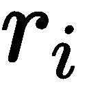表示第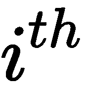站的测量 RSSI 值。

现在，我们大致了解了什么是室内定位。在下一节中，我们将看到如何使用机器学习和深度学习（DL）算法来开发这样的室内定位系统。

# 基于深度学习（DL）的物联网室内定位

现在，如果我们想要开发一个深度学习应用并部署低端设备，这些物联网设备将无法处理它们。特别是，处理非常高维度的数据会成为瓶颈。因此，使用像**k 近邻（k-NNs）**这样的机器学习算法，户外定位问题可以在合理的精度下得到解决，因为移动设备中包含 GPS 传感器，这意味着我们现在手头有更多的数据。

然而，室内定位仍然是一个未解决的研究问题，主要是由于室内环境中 GPS 信号的丧失，尽管有先进的室内定位技术。幸运的是，通过使用深度学习（DL）技术，我们可以以合理的精度解决这个问题，尤其是由于使用**自编码器**（**AEs**）及其表示能力，可以成为一个很好的替代方案和可行的选择。在这种情况下，我们有两种选择：

1.  在 AE 网络前添加一个全连接层和一个 softmax 层，这将作为一个端到端的分类器。

1.  使用其他分类算法，如逻辑回归、k-NN、随机森林或支持向量机进行位置估计（即分类），如下图所示：

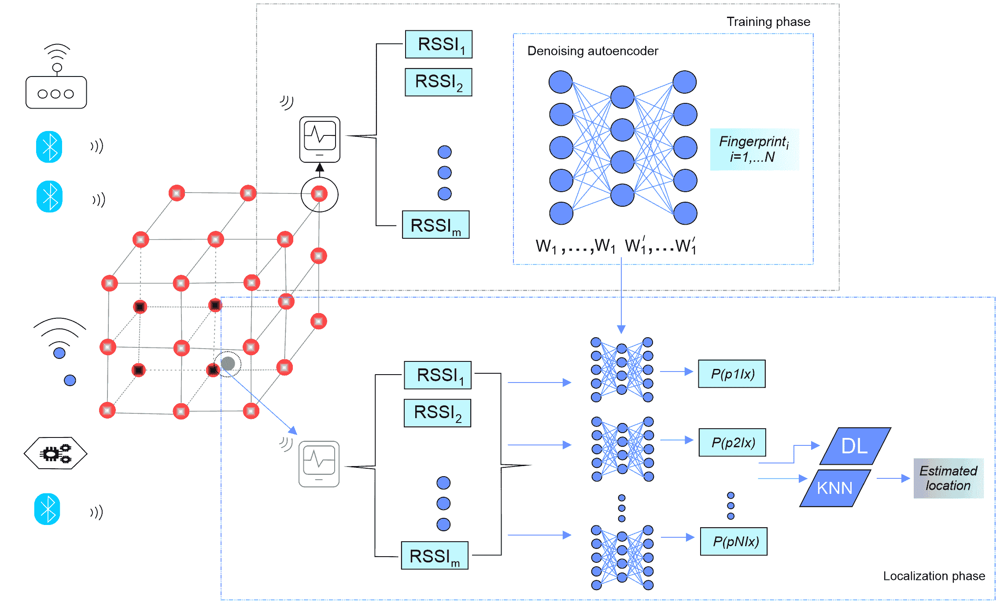

这个思路是使用 AEs 进行表示学习，以便网络能够很好地学习特征。然后，编码器部分的输出可以用来初始化分类器部分的权重。在接下来的部分，我们将讨论 k-NN 和 AEs，并看看它们如何用于解决室内定位问题。

# K 近邻（k-NN）分类器

k-NN 算法是一种非参数方法，可以使用来自物联网设备的指纹数据进行训练。该方法试图将从网关收集到的 RSSI 值分类到一个参考点而非坐标。输入包括 k 个最接近的 RSSI 值，输出将是一个类的成员资格。然后，输入样本通过其邻居的多数投票进行分类，物体被分配到其 k 个最近邻中最常见的类。

从技术上讲，如果指纹数据库由(*X, y*)组成——其中*X*是 RSSI 值，*y*是已知位置的集合——那么 k-NN 首先计算距离 ，其中*x*是未知样本。然后，它计算一个集合，，包含来自 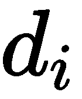 的 k 个最小距离的索引。接着，返回 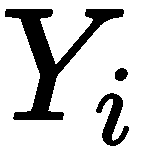 的多数标签，其中 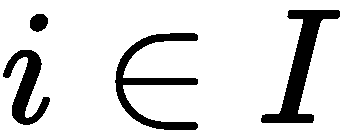。换句话说，通过使用 k-NN，分类是通过计算观察数据与数据库中训练 RSSI 样本记录的相似度来进行的。最终，在前 k 个最相似记录中出现次数最多的网格单元就是估计的位置，如下图所示：


使用 k-NN 算法进行物联网设备的定位

在前面的图示中，当 k=4 时，Wi-Fi 数据包跟踪被归类为网格 c（绿色三角形）记录，而当 *k=6* 时，则被归类为网格 a（红色矩形）。因此，k-NN 可以被视为一种懒惰学习方法，在这种方法中，函数仅在局部进行近似，所有计算都推迟到分类发生时。k-NN 算法的优点是它对噪声数据具有鲁棒性。特别地，使用加权距离的反平方作为距离度量。尽管如此，如果它已经在大量训练数据上进行了训练，它仍然表现良好。

也存在一些潜在的缺点。例如，我们需要确定 *K* 参数值，即最近邻居的数量。它在使用不同的距离度量时表现差异较大。使用 k-NN 算法的计算成本较高，因为需要计算训练数据中每个样本的距离。在数据维度非常高的情况下，这一问题尤为严重。在下一节中，我们将使用 k-NN 作为端到端分类器，而不是使用神经网络设置，提供基于 AE 的分类器与 k-NN 分类器之间的比较分析。

# AE 分类器

如 第二章《物联网深度学习架构》所述，AEs 是一种特殊类型的神经网络，它们能够从输入数据中自动学习。AEs 由两个部分组成：编码器和解码器。编码器将输入压缩为潜在空间表示。然后，解码器部分尝试从该表示中重建原始输入数据：

+   **编码器**：使用一种称为  的函数，将输入编码或压缩为潜在空间表示。

+   **解码器**：使用一种称为 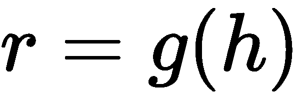 的函数，从潜在空间表示中解码或重建输入。

因此，AE 可以通过  的函数来描述，其中我们希望 *0* 尽可能接近原始输入 *x*。AEs 在数据去噪和降维数据可视化方面非常有用。AEs 比 PCA 更有效地学习数据投影，称为 **表示**。下图展示了一个去噪 AE 的架构：

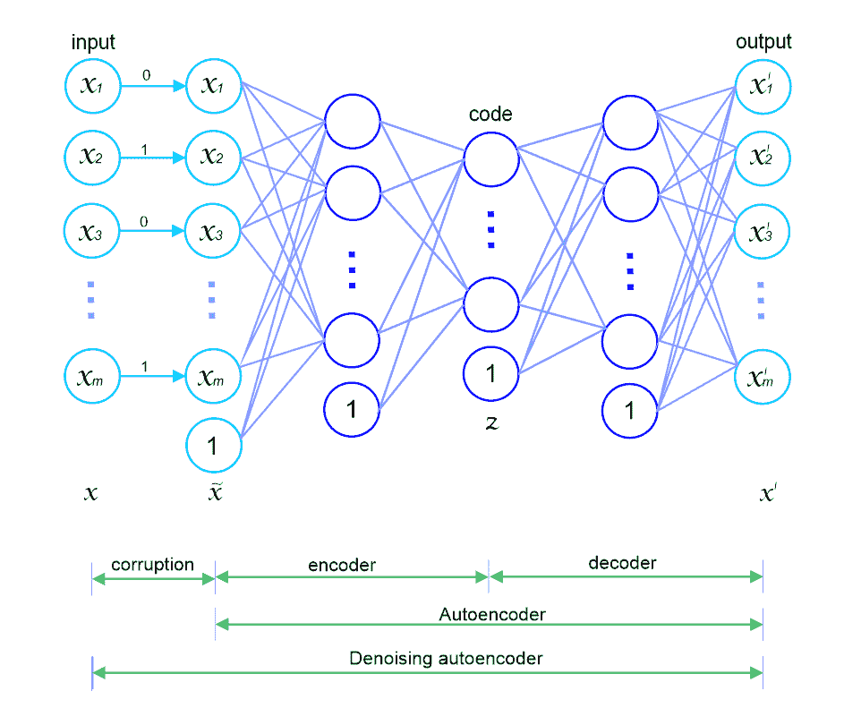

因此，一旦我们手头有了指纹数据库，AEs 就可以通过原始的 RSSI 测量值进行训练，训练好的网络本身则用作特定参考位置的指纹模式。由于深度网络可以通过每层的权重表示，因此指纹模式可以表达为以下形式：


在上述公式中，*l* 是 AE（自编码器）的隐藏层编码层的数量， 和 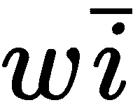 表示编码隐藏层及其解码镜像层的权重，如下图所示：

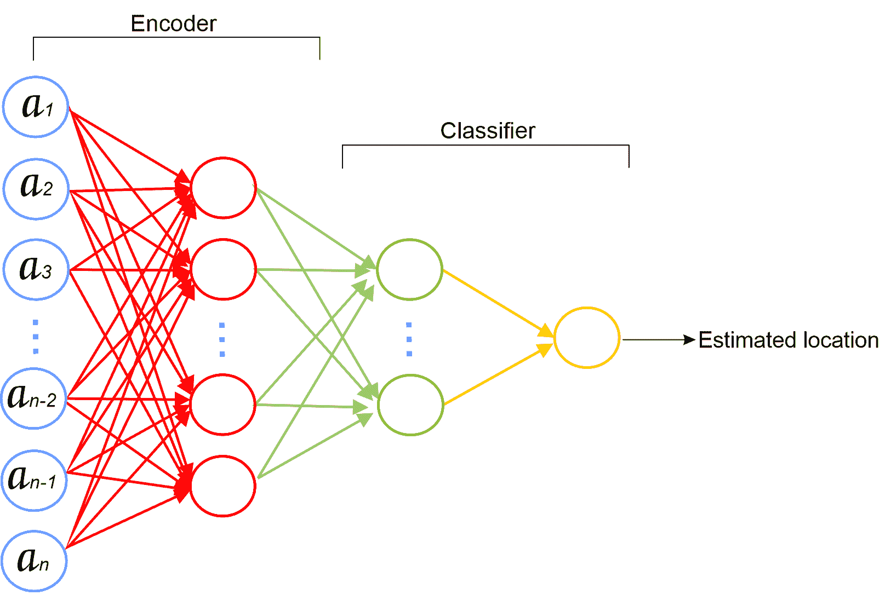

然后，我们可以将 AE 中央隐藏层的输出作为全连接 Softmax 层的输入，以预测位置，如上图所示。现在我们已经知道神经网络或机器学习环境下的室内定位工作原理，接下来可以开始使用 Wi-Fi 指纹的实际示例。

# 示例 – 使用 Wi-Fi 指纹进行室内定位

在这个示例中，我们将使用**多建筑、多楼层的室内定位**数据库和堆叠的 AE 来进行 Wi-Fi 指纹定位。只需进行一些最小的努力，这个应用可以部署到移动机器人上，使用 Wi-Fi 定位子系统。

# 描述数据集

`UJIIndoorLoc` 数据集是一个多建筑、多楼层的室内定位数据库，旨在测试基于 Wi-Fi 指纹的室内定位系统。自动用户定位包括估算用户的位置信息，如经度、纬度和海拔，这些信息通过手机收集。`UJIIndoorLoc`数据库覆盖了 Jaume I 大学的三栋建筑，楼层数为 4 层或以上，总面积接近 110,000 平方米，数据收集于 2013 年，涉及 20 多位用户和 25 台 Android 设备。该数据库包含两个 CSV 文件：

+   `trainingData.csv`：19,937 条训练/参考记录

+   `validationData.csv`：1,111 条验证/测试记录

529 个属性包含 Wi-Fi 指纹及其采集的坐标。每个 Wi-Fi 指纹可以通过检测到的 WAP 和相应的 RSSI 来描述。强度值以负整数形式表示，范围从-104 dBm（非常差的信号）到 0 dBm。正值 100 表示 WAP 未被检测到。在数据库创建过程中，检测到了 520 个不同的 WAP。因此，Wi-Fi 指纹由 520 个强度值组成。坐标的纬度、经度、楼层和**BuildingID**信息是需要预测的属性。以下是数据集的快速总结：

+   **属性 001 到 520（即 WAP001 到 WAP520）**：这些是接入点的强度测量值，取值范围为-104 到 0 和+100。100 表示未检测到 WAP001。

+   **属性 521（经度）**：负实数值，从 7,695,938,754,929,900 到-7299.786516730871000

+   **属性 522（纬度）**：正实数值，从 4,864,745.7,450,159,714 到 4,865,017.3,646,842,018。

+   **属性 523（楼层）**：建筑物内的楼层高度。整数值范围从 0 到 4。

+   **属性 524（建筑 ID）**：用于识别建筑的 ID，作为从 0 到 2 的分类整数值提供。

+   **属性 525（空间 ID）**：用于识别空间的内部 ID 号码，例如办公室、走廊或教室。

+   **属性 526（相对位置）**：相对于空间的相对位置（1—室内，2—室外，门前）。

+   **属性 527（用户 ID）**：用户标识符。

+   **属性 528（手机 ID）**：安卓设备标识符（见下文）。

+   **属性 529（时间戳）**：捕获时间的 UNIX 时间。

# 网络构建

我们将使用的 AE 分类器将包含一个由编码器和解码器组成的 AE 部分。以下的 AE 架构用于确定 Wi-Fi 所在的楼层和建筑位置。AE 的输入是扫描中检测到的信号强度。然后，每个可见网络的一个值被视为 RSSI 记录。解码器的输出是来自压缩表示的重建输入，如下图所示（来源：*使用深度学习的低努力场所识别与 Wi-Fi 指纹*，Michał N.等人，arXiv:1611.02049v1）：

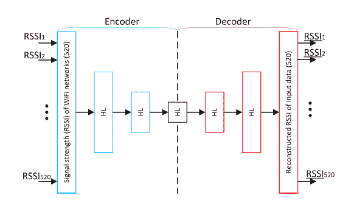

用于特征空间表示的 AE 架构

分类器部分由两个隐藏层组成；根据问题的复杂性，需要选择神经元的数量。当 AE 的权重进行无监督学习完成后，网络的解码器部分将断开。然后，通常会在编码器输出后放置全连接层，通过将整个网络转化为分类器。在以下图中，预训练的编码器部分连接到全连接的 softmax 层（来源：*使用深度学习的低努力场所识别与 Wi-Fi 指纹*，Michał N.等人，arXiv:1611.02049v1）：

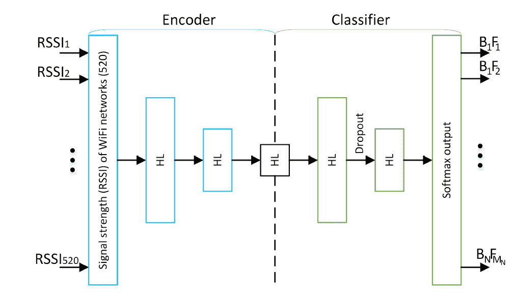

用于基于 Wi-Fi 扫描输入分类建筑及其楼层的 AE 分类器架构

最终的输出层是一个 softmax 层，它输出当前样本属于分析类别的概率。现在，让我们不再拖延，开始实现前述网络。

# 实现

我们将使用 Keras 来实现这一概念。首先，让我们导入必要的包和库，如下所示：

```
import pandas as pd
import numpy as np
import tensorflow as tf
from sklearn.preprocessing import scale
from keras.models import Sequential
from keras.layers import Input, Dense, Flatten, Dropout, Embedding, BatchNormalization
from keras.layers.convolutional import Conv1D,MaxPooling1D
from keras.layers import LSTM
from keras.layers.merge import concatenate
from keras.layers import GaussianNoise
from pickle import load
from keras import optimizers
from sklearn.metrics import classification_report
from sklearn.metrics import confusion_matrix
from sklearn.metrics import precision_recall_curve
from sklearn.metrics import precision_recall_fscore_support
import pandas_profiling
```

一旦我们导入了所有必要的包，就可以继续准备训练集和测试集，分别用于训练和评估模型。

# 探索性分析

使用**Python pandas**库进行数据探索性分析提供了许多强大的功能——毫无疑问。然而，使用`df.describe()`、`df.dtypes`，或者使用`df.isnull().sum()`并分别绘制这些图表总是非常耗时。有时，你甚至无法以一种高级的方式获取所需的信息。实际上，你必须编写额外的代码行将它们转换成可展示的格式。然而，为了让你的工作更轻松，现在你可以开始使用`pandas_profiling`库（请参阅[`github.com/pandas-profiling/pandas-profiling`](https://github.com/pandas-profiling/pandas-profiling)）。只需一行代码，就能提供你所需要的信息：

```
pandas_profiling.ProfileReport(df)
```

当然，使用`pandas_profiling`来快速了解你的数据是非常值得的。让我们试试看！首先，我们通过显式传递`header=0`来读取训练数据，以便能够替换现有的列名：

```
trainDF = pd.read_csv("trainingData.csv",header = 0)
```

要获取由于高度相关性而被拒绝的变量列表，可以使用以下命令：

```
profile = pandas_profiling.ProfileReport(trainDF) 
```

这将生成一份报告，显示关于数据集的信息：


让我们来看一下报告的前几行。正如我们所看到的，数据中没有任何空值，所有变量都是数值型的，这非常好。然而，有些特征意义较小，因为它们与其他变量高度相关（例如，74 个变量被拒绝），还有一些变量分布非常偏斜，给出了非常宽广的分布。甚至我们的训练数据集也有 637 行重复数据。被拒绝的变量不会对模型的学习产生帮助。因此，这些可以从训练数据中删除（不过这一步是可选的）。这些被拒绝的变量列表可以通过以下`get_rejected_variables`方法来获取：

```
rejected_variables = profile.get_rejected_variables(threshold=0.9)
```

如果你想生成 HTML 报告文件，可以将分析结果保存到一个对象中，并使用`to_file`函数，如下所示：

```
profile.to_file(outputfile="Report.html")
```

这将生成一个包含必要信息的`HTML`报告。现在我们了解了数据和变量，接下来让我们专注于特征工程步骤，在此过程中我们将准备训练和测试所需的数据。

# 准备训练集和测试集

首先，我们将数据进行标准化，中心化到均值。然后，我们对每个分量进行单位方差缩放。这将有助于我们的模型更快地收敛：

```
featureDF = np.asarray(trainDF.iloc[:,0:520]) # First 520 features 
featureDF[featureDF == 100] = -110
featureDF = (featureDF - featureDF.mean()) / featureDF.var()
```

然后，我们构建真实标签。我们将所有的建筑物 ID 和楼层 ID 转换为字符串：

```
labelDF = np.asarray(trainDF["BUILDINGID"].map(str) + trainDF["FLOOR"].map(str)) 
labelDF = np.asarray(pd.get_dummies(labelDF))
```

然后，让我们尝试创建两个变量：`train_x`和`train_y`。这将有助于在训练评估过程中避免混淆：

```
train_x = featureDF
train_y = labelDF
print(train_x.shape)
print(train_x.shape[1])
```

现在，与训练集类似，我们也准备好测试集：

```
testDF = pd.read_csv("validationData.csv",header = 0)
test_featureDF = np.asarray(testDF.iloc[:,0:520])
test_featureDF[test_featureDF == 100] = -110
test_x = (test_featureDF - test_featureDF.mean()) / test_featureDF.var()
test_labelDF = np.asarray(testDF["BUILDINGID"].map(str) + testDF["FLOOR"].map(str))
test_y = np.asarray(pd.get_dummies(test_labelDF))
print(test_x.shape)
print(test_y.shape[1])
```

一旦我们准备好了训练集和测试集，就可以继续创建一个自编码器（AE）。

# 创建自编码器（AE）

让我们创建独立的编码器和解码器函数，因为你稍后会使用编码器权重进行分类。首先，我们定义一些参数，比如 epoch 数量和批量大小。此外，我们计算输入数据的形状和构建与训练 AE 所需的类别数：

```
number_epochs = 100
batch_size = 32
input_size = train_x.shape[1] # 520
num_classes = train_y.shape[1] # 13
```

然后，我们创建 AE 的编码器部分，它有三个隐藏层：

```
def encoder():
    model = Sequential()
    model.add(Dense(256, input_dim=input_size, activation='relu', use_bias=True))
    model.add(Dense(128, activation='relu', use_bias=True))
    model.add(Dense(64, activation='relu', use_bias=True))    
    return model
```

接下来，我们创建 AE 的解码器部分，它有三个隐藏层，接着是 `compile()` 方法：

```
def decoder(encoder):   
    encoder.add(Dense(128, input_dim=64, activation='relu', use_bias=True))
    encoder.add(Dense(256, activation='relu', use_bias=True))
    encoder.add(Dense(input_size, activation='relu', use_bias=True))
    encoder.compile(optimizer='adam', loss='mse')
    return encoder 
```

然后，我们将它们堆叠在一起以构建 AE：

```
encoderModel = encoder() # Encoder
auto_encoder = decoder(encoderModel) # The autoencoder 
auto_encoder.summary()
```

让我们看看 AE 的结构和总结：

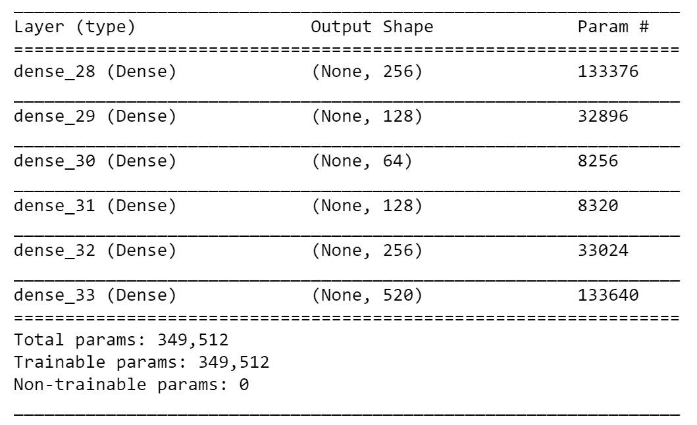

然后，我们可以使用训练数据训练 AE 100 次，其中 10% 的训练数据将用于验证：

```
auto_encoder.fit(train_x, train_x, epochs = 100, batch_size = batch_size, 
                 validation_split=0.1, verbose = 1)
```

由于我们在前面的代码块中设置了 `verbose =1`，因此在训练过程中，你将看到以下日志：

```
Train on 17943 samples, validate on 1994 samples
Epoch 1/100
17943/17943 [==============================] - 5s 269us/step - loss: 0.0109 - val_loss: 0.0071
Epoch 2/100
17943/17943 [==============================] - 4s 204us/step - loss: 0.0085 - val_loss: 0.0066
Epoch 3/100
17943/17943 [==============================] - 3s 185us/step - loss: 0.0081 - val_loss: 0.0062
Epoch 4/100
17943/17943 [==============================] - 4s 200us/step - loss: 0.0077 - val_loss: 0.0062
Epoch 98/100
17943/17943 [==============================] - 6s 360us/step - loss: 0.0067 - val_loss: 0.0055
.......
Epoch 99/100
17943/17943 [==============================] - 5s 271us/step - loss: 0.0067 - val_loss: 0.0055
Epoch 100/100
17943/17943 [==============================] - 7s 375us/step - loss: 0.0067 - val_loss: 0.0055
```

然后，我们将编码器网络的输出作为训练集和测试集的潜在特征：

```
X_train_re = encoderModel.predict(train_x)
X_test_re = encoderModel.predict(test_x)
```

# 创建 AE 分类器

接下来，我们将通过将前三层的训练状态设置为 `True` 来重新训练 `auto_encoder` 模型，而不是将它们保持为 `False`：

```
for layer in auto_encoder.layers[0:3]:
    layer.trainable = True  
```

或者，我们也可以通过以下方式删除前三层：

```
for i in range(number_of_layers_to_remove):
    auto_encoder.pop()
```

然后，我们在前面添加全连接层，`BatchNormalization` 层紧随其后，接着是第一个密集层。接着，我们添加另一个密集层，再后面是 `BatchNormalization` 和 `Dropout` 层。然后，我们放置另一个密集层，接着是 `GaussionNoise` 层和一个 `Dropout` 层，最后是 softmax 层：

```
auto_encoder.add(Dense(128, input_dim=64, activation='relu', use_bias=True)) 
auto_encoder.add(BatchNormalization())                     
auto_encoder.add(Dense(64, activation='relu', kernel_initializer = 'he_normal', use_bias=True)) 
auto_encoder.add(BatchNormalization())
auto_encoder.add(Dropout(0.2))    
auto_encoder.add(Dense(32, activation='relu', kernel_initializer = 'he_normal', use_bias=True))
auto_encoder.add(GaussianNoise(0.1))
auto_encoder.add(Dropout(0.1))  
auto_encoder.add(Dense(num_classes, activation = 'softmax', use_bias=True))
```

最后，我们得到了完整的 AE 分类器：

```
full_model = autoEncoderClassifier(auto_encoder)
```

完整的代码如下：

```
def autoEncoderClassifier(auto_encoder):
    for layer in auto_encoder.layers[0:3]:
        layer.trainable = True        

    auto_encoder.add(Dense(128, input_dim=64, activation='relu', use_bias=True)) 
    auto_encoder.add(BatchNormalization())                     
    auto_encoder.add(Dense(64, activation='relu', kernel_initializer = 'he_normal', use_bias=True)) 
    auto_encoder.add(BatchNormalization())
    auto_encoder.add(Dropout(0.2))    
    auto_encoder.add(Dense(32, activation='relu', kernel_initializer = 'he_normal', use_bias=True))
    auto_encoder.add(GaussianNoise(0.1))
    auto_encoder.add(Dropout(0.1))  
    auto_encoder.add(Dense(num_classes, activation = 'softmax', use_bias=True))
    return auto_encoder

full_model = autoEncoderClassifier(auto_encoder)
```

然后，我们在开始训练之前编译模型：

```
full_model.compile(loss = 'categorical_crossentropy', optimizer = optimizers.adam(lr = 0.001), metrics = ['accuracy'])
```

现在，我们开始以监督方式微调网络：

```
history = full_model.fit(X_train_re, train_y, epochs = 50, batch_size = 200, validation_split = 0.2, verbose = 1)
```

由于我们在前面的代码块中设置了`verbose =1`，因此在训练过程中，你会看到以下日志：

```
Train on 15949 samples, validate on 3988 samples
Epoch 1/50
15949/15949 [==============================] - 10s 651us/step - loss: 0.9263 - acc: 0.7086 - val_loss: 1.4313 - val_acc: 0.5747
Epoch 2/50
15949/15949 [==============================] - 5s 289us/step - loss: 0.6103 - acc: 0.7749 - val_loss: 1.2776 - val_acc: 0.5619
Epoch 3/50
15949/15949 [==============================] - 5s 292us/step - loss: 0.5499 - acc: 0.7942 - val_loss: 1.3871 - val_acc: 0.5364
.......
Epoch 49/50
15949/15949 [==============================] - 5s 342us/step - loss: 1.3861 - acc: 0.4662 - val_loss: 1.8799 - val_acc: 0.2706
Epoch 50/50
15949/15949 [==============================] - 5s 308us/step - loss: 1.3735 - acc: 0.4805 - val_loss: 2.1081 - val_acc: 0.2199
```

现在让我们看看训练损失与验证损失的对比，这将帮助我们理解训练过程。这也将帮助我们判断我们的神经网络是否存在过拟合和欠拟合等问题：

```
import pandas as pd
import numpy as np
import matplotlib.pyplot as plt
%matplotlib inline

plt.plot(history.history['acc'])
plt.plot(history.history['val_acc'])
plt.ylabel('Accuracy')
plt.xlabel('Epochs')
plt.legend(['Training loss', 'Validation loss'], loc='upper left')
plt.show()
```

前面的代码块将绘制训练损失和验证损失：

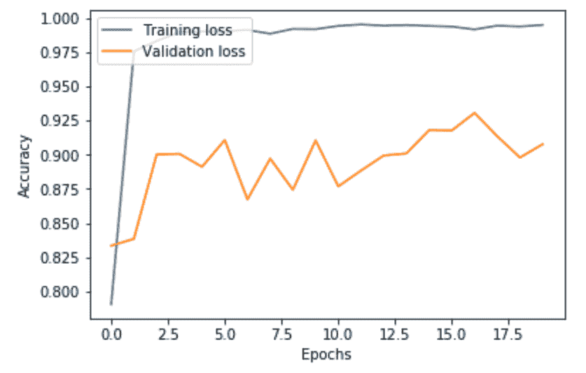

如前面的图所示，跨越多个 epoch 的训练损失大于验证损失，这是过拟合的表现。我们没有足够的训练样本来很好地训练神经网络。一些样本在数据集中甚至重复，这些样本在网络中实际上变得非常琐碎和冗余。这可能是添加 **Dropout** 和 **Gaussian** 噪声层没有太大帮助的原因。无论如何，我们也可以保存训练好的模型，以便将来重用，我们将在下一部分讨论这个问题。

# 保存训练好的模型

现在我们已经完全训练好了 AE 分类器，可以保存它，以便稍后从磁盘恢复：

```
import os
from pickle import load
from keras.models import load_model
os.environ["PATH"] += os.pathsep + 'C:/Program Files (x86)/Graphviz2.38/bin/'
from keras.utils.vis_utils import plot_model

plot_model(full_model, show_shapes=True, to_file='Localization.png')
# save the model
full_model.save('model.h5')
# load the model
model = load_model('model.h5') 
```

在下一部分中，我们将对测试集进行评估，我们将在下一个小节中讨论这个问题。

# 评估模型

现在我们的模型已经完全训练好了，可以在未见过的数据上评估其性能：

```
results = full_model.evaluate(X_test_re, test_y)
print('Test accuracy: ', results[1])
```

上述代码行将显示准确度得分，类似如下：

```
1111/1111 [==============================] - 0s 142us/step
Test accuracy: 0.8874887488748875
```

然后，让我们计算性能指标：

```
predicted_classes = full_model.predict(test_x)
pred_y = np.argmax(np.round(predicted_classes),axis=1)
y = np.argmax(np.round(test_y),axis=1)
p, r, f1, s = precision_recall_fscore_support(y, pred_y, average='weighted')
print("Precision: " + str(p*100) + "%")
print("Recall: " + str(r*100) + "%")
print("F1-score: " + str(f1*100) + "%")
```

上述代码块将显示以下输出，F1-score 大约为 88%：

```
Precision: 90.29611866225324%
Recall: 88.11881188118812%
F1-score: 88.17976604784566%
```

此外，我们可以打印分类报告以了解类特定的定位情况：

```
print(classification_report(y, pred_y))
```

上述代码行将产生以下输出：


此外，我们将绘制混淆矩阵：

```
print(confusion_matrix(y, pred_y))
```

上述代码行将生成以下混淆矩阵：

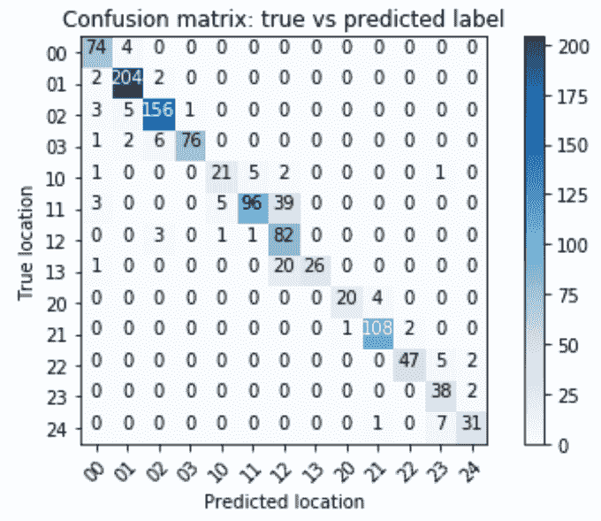

如前述混淆矩阵所示，我们的 AE 分类器大多数情况下被误判为类别 11，并且将多达 39 个样本预测为属于网格 12。但是，我们仍然取得了非常好的准确率。改进的可能建议如下：

+   在移除被拒绝的变量后训练网络

+   在更多的训练轮次上训练网络

+   使用网格搜索和交叉验证进行超参数调优

+   向网络中添加更多的层

一旦找到经过更多数据训练的优化模型，并且能够提供稳定、改进的性能，它就可以部署到 IoT 设备上。我们将在下一部分讨论一些可能的部署选项。

# 部署技术

正如我们之前所讨论的，每次 Wi-Fi 扫描都包含其周围可用 AP 的信号强度测量，但仅会观察到环境中所有网络的一个子集。许多 IoT 设备，如手机或树莓派，处理能力较低。因此，部署这样的深度学习模型将是一项具有挑战性的任务。

许多解决方案提供商和科技公司提供商业化的智能定位服务。利用室内外定位数据中的 Wi-Fi 指纹技术，现如今可以实现设备的精确追踪。在这些公司中，大多数使用 RSSI 指纹定位作为核心技术。在这种情况下，具有不同敏感度的信号或消息（这当然取决于距离）可以被网关接收。如果网络中有  网关，那么从特定的室内或室外位置获取的 RSSI 值将形成该位置的 RSSI 指纹，其中包含 *n* 个条目，如下所示：

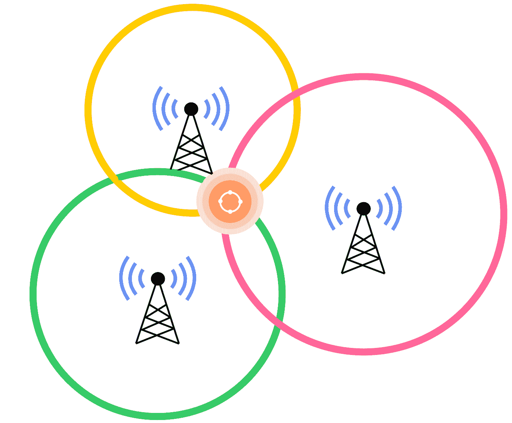

上述图表对应于以下方程：


然而，在有大量网关（>4）的情况下，指纹可能在某个范围内明显独特。一种部署技术是通过训练好的模型在后台提供服务，并作为 Android 或 iOS 移动应用程序提供服务。然后，应用程序监控已部署在室内位置的物联网设备信号，将其作为 RSSI 值插入到 SQLite 数据库中，并根据 RSSI 值准备测试集，向预先训练好的模型发送查询，以获取位置。

下图展示了一个示意架构，概述了该部署所需的所有步骤：

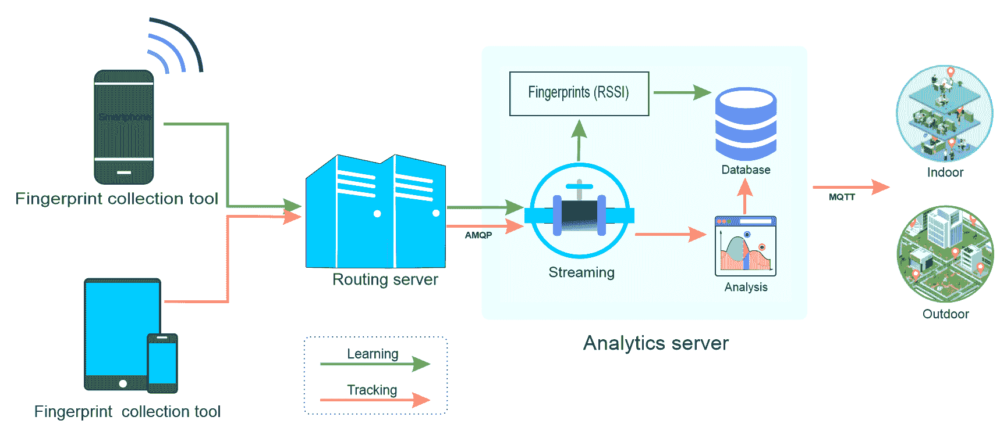

在这种情况下，训练过的模型将作为迁移学习的方式。然而，训练过的模型可以作为一个 web 应用程序，通过 Flask 或 DJango Python 框架来提供服务。然后，来自物联网设备的 RSSI 值和信号可以存储在数据库中，以丰富历史数据。随后，可以通过 Android 或 iOS 应用程序来追踪位置。

# 总结

在本章中，我们讨论了物联网设备的室内定位工作原理。特别是，我们看到了深度学习技术如何应用于物联网应用中的室内定位，并通过一个实际示例展示了如何使用这些数据。此外，我们还探讨了物联网环境中室内定位服务的一些部署设置。

在第六章《物联网中的生理和心理状态检测》中，我们将讨论基于深度学习的物联网应用中人体生理和心理状态检测技术。结合现实场景，我们将讨论两个基于生理和心理状态检测的物联网应用。
