# 深度学习在医疗物联网中的应用

物联网有着广泛的应用领域，包括健康和医疗保健。物联网在医疗健康中的应用正在以危险的速度增长，市场研究表明，全球物联网医疗市场到 2025 年有望达到 5343 亿美元。这些应用中的大多数，包括远程和实时病人监控，将产生异构流数据和/或大数据。然而，从这些数据中分析并提取有用信息，对于医疗健康专业人员来说是一个巨大的挑战。在这种背景下，**机器学习**（**ML**）和**深度学习**（**DL**）模型能够通过自动化分析、分类各类数据以及检测数据中的异常来应对这一挑战。医疗行业广泛使用机器学习和深度学习进行各种应用。因此，机器学习/深度学习模型在物联网医疗健康应用中的使用，对于真正实现医疗物联网至关重要。

在本章中，我们将介绍基于深度学习（DL）的物联网（IoT）解决方案在医疗健康领域的应用。首先，我们将概述物联网在医疗健康中的各类应用。接着，我们将简要讨论两个使用案例，展示如何通过基于深度学习的物联网解决方案来改进和/或自动化医疗服务。第二部分将介绍这两个案例中，基于深度学习的医疗事件和/或疾病检测的实际经验。本章将涵盖以下主题：

+   物联网与医疗健康应用

+   使用案例一：远程慢性病管理

+   远程慢性病管理的实施

+   使用案例二：物联网在痤疮检测与护理中的应用

+   痤疮检测与护理的实施

+   深度学习在医疗物联网中的应用

+   卷积神经网络（CNN）和长短时记忆网络（LSTM）在医疗物联网应用中的应用

+   数据收集

+   数据预处理

+   模型训练

+   模型评估

# 物联网在医疗健康中的应用

全球范围内，健康和医疗服务面临着巨大的挑战，例如成本飙升、人口老龄化、慢性病和/或多重病症的患病率增加，以及医疗专业人员短缺。此外，依赖于平均数据和/或定性数据以及一刀切的处方方式的传统医疗服务效果并不理想。在这种背景下，物联网在医疗服务中的应用通过以下特性应对了这些挑战：

+   与各种现有技术的无缝集成

+   大数据处理与分析的支持

+   个性化服务

+   基于远程与实时监控的连接医疗服务

+   定量数据，相比定性数据，能够提供更有效的服务

+   医疗专业人员与患者之间的互动与实时互动

+   服务的普遍可达性

+   高效的医疗资源管理

所有这些基于物联网的解决方案特点将通过提供各种服务颠覆医疗行业。这些服务可以在两种不同的环境中查看和提供：

+   医院和诊所

+   非临床病人环境

以下图表突出展示了这两种环境中的一些主要应用，并列出了每个环境中的潜在服务：

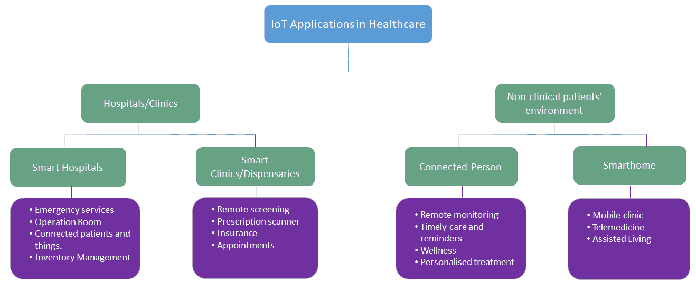

以下是物联网医疗的关键子领域：

+   **智能医院**：在全球范围内，无论是发达国家还是发展中国家，医院都面临病人过多的问题。此外，它们还面临资源短缺——包括缺乏熟练的专业人员和设备。在大多数国家的农村地区，情况尤为严重，那里的人们几乎无法或完全无法获得医疗服务。在这种背景下，基于物联网的远程服务，如远程监测和远程医疗，可以提供许多基础的医疗服务。此外，远程监测老年病人和慢性病患者可以大大降低与医疗相关的成本，并提高病人和医疗专业人员的生活质量。智能和联网的救护车可以提供车载即时和紧急服务，并减少与紧急服务相关的事故。在手术室中，连接的医生（本地和远程）、工作人员和医疗设备可以提供更好、更顺畅的手术环境。此外，医院的库存管理可以通过物联网应用得到极大的改善。

+   **诊所**：许多人去**全科医生**（**GP**）诊所接受初级保健服务。这些服务提供者也可以通过使用物联网应用受益。例如，全科医生可以虚拟查看和分析病人的病理报告，这节省了双方的时间。重要的是，病人将获得更多用于护理相关讨论的时间，而不是单纯的信息收集。诊所可以实时核实病人的保险覆盖情况。诊所和全科医生诊所的预约管理是一个全球性挑战。在英格兰，每年大约有 1500 万次预约未能按时进行，这使**国民健康服务**（**NHS**）损失了数百万英镑。物联网应用可以改善这一情况。

+   **非临床病人环境**：物联网的两个潜在应用领域是连接的——病人和智能家居。在这里，智能家居可以随时随地为病人提供医疗服务。远程监测处方干预措施，如物理治疗，可以通过连接的病人应用程序进行。此外，病人可以获得个性化服务，例如提醒服药。为老年人提供监测和医疗服务是全球性的重大挑战。智能家居解决方案可以通过跌倒检测、服药提醒、远程医疗和一般辅助生活等服务改善现有服务，并为这些高风险人群提供新的服务。

从上述讨论中可以明显看出，物联网在医疗领域具有巨大的潜力。在接下来的部分，我们将简要讨论物联网在医疗领域的两个用例。

# 用例一 – 慢性病的远程管理

慢性病——包括心血管疾病、高血压和糖尿病——每年全球造成超过 4000 万人的死亡。这个问题在发展中国家和发达国家有不同的表现。在发展中国家，慢性病患者在许多基本健康服务方面存在访问限制或无法获取，包括早期或及时的检测设施，这导致了大量死亡。另一方面，在发达国家，医学研究已显著提高了预期寿命。例如，通过早期发现和疾病监测来实现这一点。然而，在包括英国在内的发达国家，每增加 2 年的预期寿命，我们只能获得 1 年的高质量生命。因此，我们在慢性病和残疾中度过的生命比例正在上升。管理多种慢性疾病患者的成本达到数万亿美元/英镑。幸运的是，基于物联网的慢性病患者远程监测能够解决大部分这些问题，并提供具有成本效益的服务。

# 用例一的实施

我们正在考虑一个基于物联网（IoT）的远程患者监测应用程序，适用于用例一。以下图表简要展示了基于物联网的远程患者监测与管理系统如何运作：

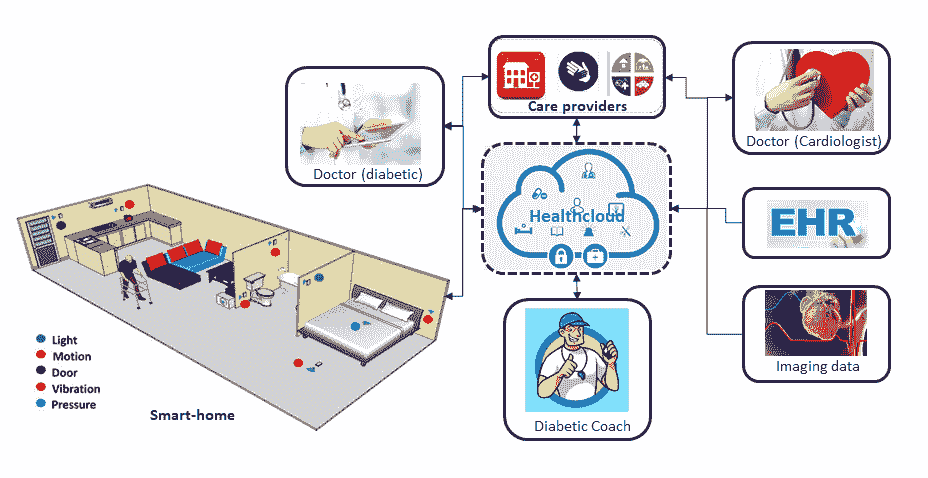

如图所示，基于物联网的远程患者监测系统由三个主要元素组成，分别是智能家居、护理提供者和健康云：

+   **智能家居**：这是解决方案的核心，包括患者和各种物联网设备。智能家居由以下关键组件组成：

    +   **患者**：患者将连接到多个传感器，包括**心电图（ECG）**、血压传感器、加速度计和陀螺仪。这些传感器将收集生理和活动相关的数据，并将其发送给护理提供者，以便进行必要的实时反馈。

    +   **环境感知**：仅靠身体传感器和可穿戴设备不足以覆盖患者的所有活动。此外，患者因多种原因对身体上有过多传感器感到不适，包括需要无缝移动。智能家居将安装各种环境传感器，包括光线、振动、运动、压力和门传感器。这些传感器将提供关于患者的上下文信息。

    +   **边缘计算平台**：我们为此组件提供了多种选择，例如智能手机/平板电脑、边缘网关或 Raspberry Pi 3。在这个用例中，我们考虑使用 Raspberry Pi 3。前面提到的所有传感器都可以连接到 Raspberry Pi 3。大多数传感器将持续监测环境和/或患者的活动，其他传感器则是事件驱动的（例如，门传感器会在有人开门或敲门时被激活）。这些传感器将把数据发送到 Raspberry Pi 3 进行进一步处理，包括检测高血压、体温异常或摔倒等事件。最后，处理后的数据将通过家庭路由器和健康云发送给护理提供者。重要的是，Raspberry Pi 3 将安装各种预训练的深度学习/机器学习模型，包括用于检测心脏异常的 ECG 测量分类器。

+   **健康云用于模型学习和数据分析**：健康云是一个云计算平台，主要设计用于与健康护理相关的服务，主要负责以下内容：

    +   深度学习模型训练

    +   数据分析

模型训练组件将训练必要的深度学习模型，用于分类或分类来自患者的各种生理信号以及背景数据，以做出明智的决策。健康云将接收来自 Raspberry Pi 3 的各种数据，其中一些数据可能相互冲突。在这种情况下，数据分析工具将分析并展示数据，以供医疗专业人员做出决策。

+   **护理提供者**：护理提供者可以是提供护理服务的医院或诊所。由于许多患者患有多种慢性病，大多数需要与不止一位专科医生直接或间接联系。一旦医生收到患者及其环境的信息，他们将根据其他数据（包括来自**电子健康记录（EHR）**的历史数据）做出决策。决策做出后，结果将反馈给患者，并在必要时通过适当的设备（如胰岛素泵）执行决策。

基于 ECG（心电图）的心脏健康检查是上述用例中的一个重要元素。在本章的第二部分，我们将描述基于深度学习的 ECG 测量分类的实现，以便于先前用例的实施。

# 用例二 – 用于痤疮检测和护理的物联网

痤疮是世界上最常见的皮肤病之一。大多数人在一生中的某个阶段都会受到痤疮的影响。通常，痤疮出现在面部，并以斑点（如下图所示）和油性皮肤的形式出现。有时，皮肤可能会变得发热或触碰时感到疼痛。痤疮可以表现为白头、黑头、脓疱、丘疹、囊肿和结节。前三种也被称为粉刺。不同类型的痤疮需要不同的治疗和护理；因此，痤疮的检测和自动分类可能会很有用。痤疮可能与三种类似的皮肤病混淆——玫瑰痤疮、湿疹或过敏反应——因为患者通常会自行诊断和治疗。错误的诊断和治疗可能会使病情加重。以下图展示了痤疮的两种表现形式：


一般来说，痤疮不仅是一个身体健康问题，对于许多患者来说，还是一个心理健康问题。根据研究，痤疮与抑郁症密切相关。在《英国皮肤病学杂志》上发布的一项研究中，研究人员分析了 1986 年至 2012 年间英国患有痤疮的患者记录，并对这些患者的心理健康问题做出了强有力的结论。他们得出结论，患有痤疮的患者发展为抑郁症的风险比没有痤疮的患者高出 63%。

在本章中，我们将介绍一种创新的解决方案，使用物联网（IoT）和深度学习（DL）模型来解决痤疮检测/诊断问题。

# 用例二的实现

大多数患有痤疮及相关皮肤病的人使用镜子来检测痤疮并监测治疗进展。因此，创新的想法是创建一面智能联网镜子，帮助用户检测和识别皮肤（主要是面部）异常，包括痤疮。

以下图展示了实现自动痤疮检测、分类和护理服务的物联网基础设施：

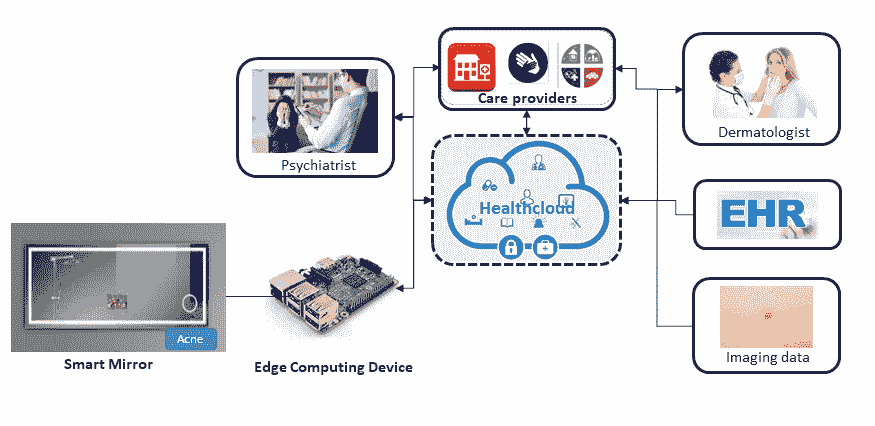

如图所示，基于物联网的自动痤疮检测、分类和护理系统由三大元素组成——智能镜子、护理提供者和健康云：

+   **智能镜子**：这是解决方案的核心，包含以下三个组件：

    +   **摄像头**：镜子内置高分辨率摄像头，能够以嵌入的方式捕捉面部图像。镜子上将有一个按钮，用于激活检测过程，因为患者可能并不总是对该服务感兴趣或有需求。镜子还将有一个小显示屏，展示结果和/或护理提供者针对痤疮的建议治疗方案。

+   +   **边缘计算平台**：我们有多种选择，包括智能手机/平板、边缘网关或树莓派 3。在这个用例中，我们考虑使用连接到摄像头的树莓派 3。一旦它接收到图像，它将通过预安装的深度学习模型检测任何皮肤问题，包括痤疮。最终，树莓派 3 将把检测结果及图像发送给护理提供者，以获得治疗建议。此外，还可以在树莓派 3 中集成一个模型（不在本书的范围内），分析面部图像以进行潜在的抑郁症检测，并由精神科医生提供相应支持。

+   **健康云用于模型学习和数据**：健康云是一个主要为医疗健康相关服务设计的云计算平台。该平台将用于训练深度学习模型，以实现基于图像的痤疮及其他皮肤问题的检测和分类。健康云还负责更新预先安装在树莓派 3 或物联网设备中的任何模型。

+   **护理提供者**：护理提供者可以是提供护理服务的医院和诊所。由于痤疮可能引起抑郁，我们考虑了两位潜在的医生——一位是皮肤科医生，处理皮肤相关问题；另一位是精神科医生，处理抑郁症相关问题。一旦医生收到检测到的信息和图像，他们将结合其他数据（包括患者的历史图像）作出决定。最终，建议的治疗方案或反馈将发送给患者。

在接下来的章节中，我们将描述针对上述使用案例所需的基于深度学习的解决方案的实现。所有必要的代码可以在本章的代码文件夹中找到。

# 深度学习在医疗健康中的应用

深度学习（DL）模型正不断发展，成为各行业最强大和最有效的计算资源。它们通过改善用户体验和推动更为明智的决策，显著地为各行业创造价值。医疗健康是深度学习的一个重要应用领域，随着异构医疗数据的日益增多，深度学习在这一领域得到了进一步发展。

与许多其他行业不同，健康和医疗行业在多个领域获得了高附加值的应用，包括研究、创新和实际的医疗环境。这些应用中，许多是面向患者的（如癌症的早期检测和预测，以及个性化医疗），而其他应用则是为了改善医疗信息技术各方面的用户体验。下图突出显示了深度学习在医疗健康领域的一些应用领域：


# 卷积神经网络（CNN）和长短期记忆网络（LSTM）在医疗健康应用中的应用

医疗保健应用产生大量数据，且这些数据来自异构来源，格式也各异。包括来自**磁共振成像**(**MRI**)、X 射线和超声的筛查和诊断数据，其中大量数据以图像格式存在。人体生理信号，如**肌电图**(**EMG**)、**脑电图**(**EEG**)、ECG 和**眼电图**(**EOG**)等，是时间序列数据。电子健康记录（EHR）包括结构化数据（如诊断、处方和实验室检查）以及非结构化数据（如自由文本的临床记录）。此外，高通量生物学数据，如基因组学，生成关于人体内部结构的高维数据。所有这些不同的医疗数据都需要机器学习，尤其是深度学习（DL）的支持，以提取有价值的信息并获得有关潜在问题的洞察。

许多深度学习（DL）模型已被用于分析这些异构医疗数据。卷积神经网络（CNN）和长短时记忆网络（LSTM）（递归神经网络，RNN）是最广泛使用的 DL 模型，因为它们的特性与大多数医疗数据类型非常契合。例如，CNN 模型最适合图像处理，并且用于各种医学图像。相比之下，LSTM/RNN 最适合大多数生理信号，因为它们具有处理信号时序特性的记忆特性。ECG 测量值是筛查心血管疾病的关键生理信号之一。因此，远程患者监控系统包括一个基于 DL 的 ECG 信号分析器，用于检测各种心脏病状况，如**房颤**(**AF**）。

考虑到 ECG 信号的时间特性，我们将考虑使用 LSTM 来实现远程患者监控系统。此外，我们将测试 CNN 作为 ECG 信号的对比。基于物联网的痤疮检测和护理系统将依赖图像。因此，我们将使用 CNN 架构来实现此系统。这两种 DL 模型在章节中已简要介绍；请参考这些章节以了解概览。

# 数据收集

健康和医疗保健应用的数据收集是一个具有挑战性的任务，原因包括隐私和伦理问题。在这种背景下，我们决定为这两个应用场景使用两个不同的开源数据集。

# 应用场景一

用于第一种应用场景的 ECG 数据集是从 2017 年 PhysioNet/计算心脏病学挑战中收集的。该数据集包含 8,528 个 ECG 测量值。这些测量值通过 AliveCor 手持设备记录（如下图所示），有趣的是，这是一个医疗物联网（IoT）应用示例：

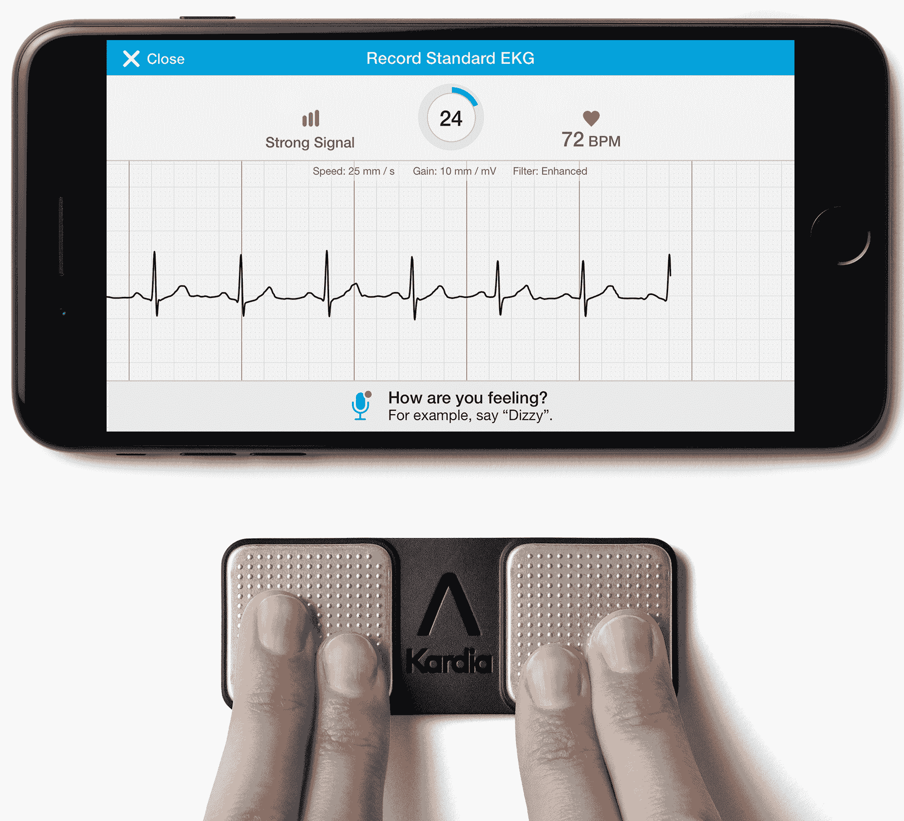

ECG 测量的采样率为 300 Hz，噪声通过 AliveCor 设备的带通滤波器去除。每个记录的测量值符合 MATLAB V4 WFDB 格式，由两个文件组成：

+   一个 `.mat` 扩展名的文件，呈现主要的 ECG 信号信息

+   具有`.hea`扩展名的相应头文件，包含了测量的波形相关信息

数据集包括四种不同类别的信号：正常节律、房颤、其他节律或过于嘈杂以至于无法分类。以下图表展示了这些不同类别的心电图信号的可视化：

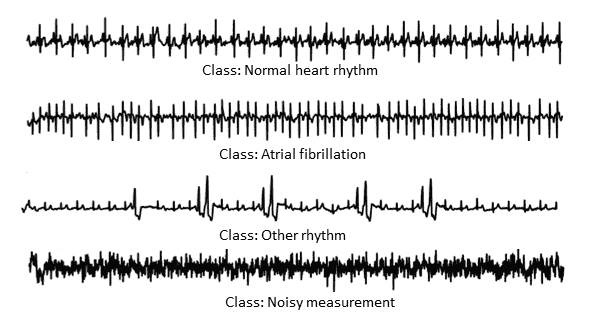

房颤是心房快速而不规则跳动的特征，表明心律不正常。其他异常心律被视为其他节律类别。最后，任何不能反映这三类之一的测量，因为噪音太大而无法分类，被定义为嘈杂的测量。基于深度学习模型的分类器需要提取这些测量中的特征，以对来自患者的记录信号进行分类，并与相关的心脏问题进行关联。为了更好地理解和实际实施，需要进一步研究心电图信号，这不在本书的范围内。以下图表展示了正常与房颤心脏信号测量的对比：


# 用例二

对于痤疮检测和护理系统用例，我们依赖于一个图像数据集。我们从*Dermnet 皮肤病图谱*中收集了图片，这是一个关于各种皮肤病的开源数据库。数据库包含 23 个数据集，每个数据集都涉及不同的皮肤病，每个类别（包括痤疮和酒渣鼻）都有子类别。由于页面太多，这些数据集不易下载。我们使用 Python 的 Beautiful Soup 模块编写了一个图像爬虫，我们使爬虫通用化，以便读者可以在不同的皮肤病上测试他们的 LSTM/CNN 模型。爬虫`image_scraper.py`位于本章代码子文件夹`use-case-2`中。要爬取所有 23 个数据集，请运行以下命令：

```
python image_scraper.py
```

以下截图显示了各种皮肤病的下载图像文件夹：

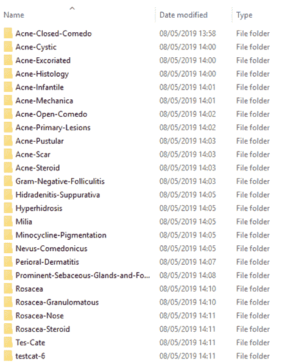

# 数据探索

在接下来的部分，我们将探索用于两个用例的数据集。具体如下：

+   心电图数据集

+   痤疮数据集

# 心电图数据集

下图显示了包含四类数据的心电图数据集的快照。如图所示，每个信号都具有独特的特征，可以被深度学习模型利用：

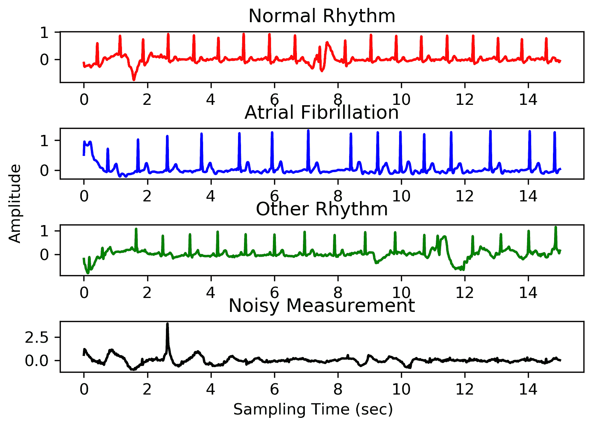

我们可以使用可用的代码`ecg_singal_explorer.py`在本章的`use-case-1`代码文件夹中生成这种探索结果或类似的结果。

# 痤疮数据集

我们已经使用了痤疮和酒渣鼻图像数据集。以下截图展示了数据集的文件夹视图，包括各类中的图片数量。不幸的是，正如我们所见，只有四个文件夹或类别有 100 张或更多的图片：

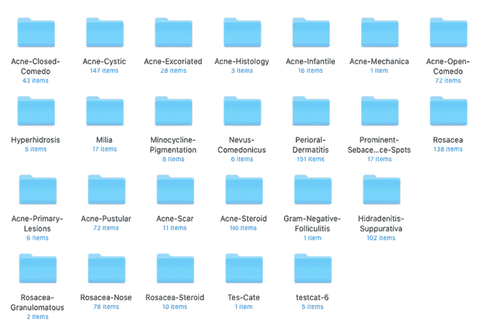

由于我们使用的是 MobileNet v1 架构，任何图像数少于 100 张的类别可能会出现错误。事实上，我们已经测试过，并发现了与数据大小相关的错误。在这种情况下，我们选择了一个减少的数据集，该数据集仅包含四个类别，每个类别的图像数都超过 100 张。

下图展示了经过探索后的减少版痤疮数据集：


# 数据预处理

数据预处理是深度学习管道中的一个关键步骤。ECG 数据集无法直接用于模型训练和验证。ECG 信号的预处理程序已包含在模型训练和验证代码`LSTM_ECG.py`和`CNN1D_ECG.py`中，分别用于运行模型并对输入的`.mat`数据进行预处理。然而，痤疮图像数据集已经准备好用于训练和验证。

# 模型训练

如前所述，我们在用例一中使用 LSTM 和 CNN，特别是 1D CNN。在用例二中，我们使用 MobileNet v1。所有这些深度学习实现都支持迁移学习，因此无需从头开始训练即可在物联网设备中使用。

# 用例一

我们为 ECG 数据分类使用了五层 LSTM 架构，如下图所示：

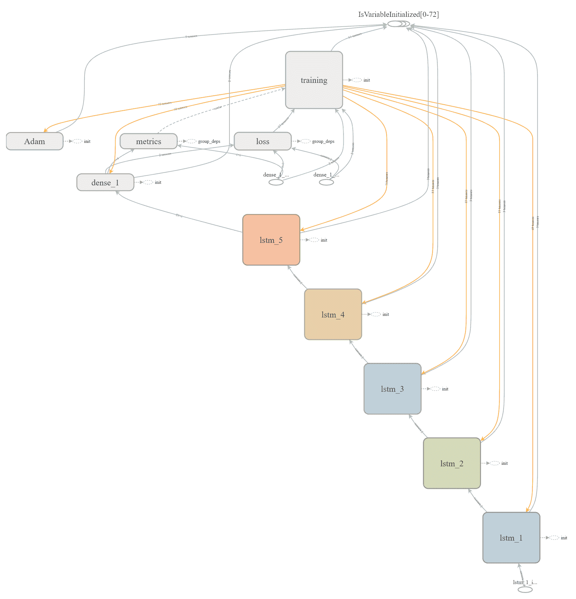

我们可以通过运行`LSTM_ECG.py`文件来训练和测试模型，该文件位于本章代码文件夹中的`use-case-1`子文件夹内：

```
python LSTM_ECG.py
```

对于远程患者管理系统中的 ECG 数据，我们还测试并验证了一个 CNN 模型。下图展示了我们用于 ECG 数据集的 CNN 架构。从图中可以看出，CNN 架构由四个卷积层组成：


我们可以通过运行`CNN1D_ECG.py`文件来训练和测试模型，该文件位于本章代码文件夹中的`use-case-1`子文件夹内：

```
python CNN1D_ECG.py
```

# 用例二

我们在第二个用例中使用了 MobileNet v1。下图展示了该模型的架构：


为了在痤疮数据集上训练和验证模型，我们需要运行`retrain_CNN.py`文件，该文件位于本章代码文件夹中的`use-case-2`子文件夹内。要训练和测试模型*，*我们只需在命令提示符下运行以下命令。

```
python retrain_CNN.py \
--output_graph=trained_model_mobilenetv1/retrained_graph.pb \
--output_labels=trained_model_mobilenetv1/retrained_labels.txt   \
--architecture mobilenet_1.0_224 \
--image_dir= dataset-Acne-reduced
```

MobileNet v1 训练的最后两个参数是强制性的，其他参数则是可选的。

# 模型评估

我们评估了模型的三个不同方面：

+   学习/（重新）训练时间

+   存储需求

+   性能（准确率）

在训练时间方面，在一台带 GPU 支持的台式机（Intel Xenon CPU E5-1650 v3 @3.5 GHz，32 GB RAM）上，LSTM 和 CNN 1D 在 ECG 数据上的训练时间超过一小时，而 MobileNet v1 在痤疮数据集上的训练时间不到 1 小时。

模型的存储需求是资源受限的物联网设备中的一个重要考量。下图展示了我们为两个用例测试的三个模型的存储需求：


如图所示，LSTM 保存的模型占用了 234 MB 的存储空间，CNN 1D 占用了 8.5 MB，MobileNet v1（CNN）占用了 16.3 MB。在存储需求方面，除了当前版本的 LSTM 外，所有模型都可以部署在许多资源受限的 IoT 设备上，包括 Raspberry Pi 3 或智能手机。

最后，我们评估了模型的性能。在这两个用例中，数据集范围内的评估或测试已在桌面 PC 平台/服务器端的训练阶段执行，但我们也可以在 Raspberry Pi 3 或任何 IoT 边缘计算设备上进行测试，因为这些模型是可迁移的。

# 模型性能（用例一）

以下截图显示了在 ECG 数据集上使用 LSTM 的训练和验证结果。从截图中可以看到，测试准确率始终接近 1.0 或 100%。然而，验证准确率不理想，且在两次不同的模型运行（100 和 500 个 epoch）中，验证准确率在 50%左右。以下截图显示了 LSTM 模型在训练阶段的进展：

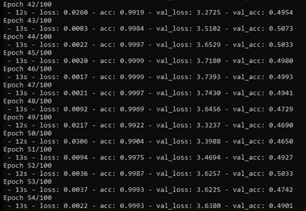

以下图表通过 TensorBoard 的日志文件生成，展示了 LSTM 模型在 ECG 数据集上的训练准确率：

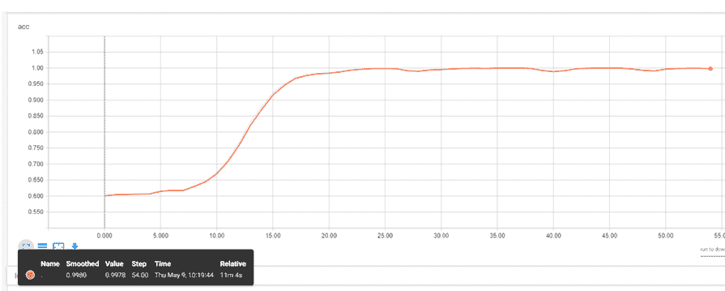

以下图表展示了 LSTM 模型在 ECG 数据集上的验证结果的混淆矩阵：

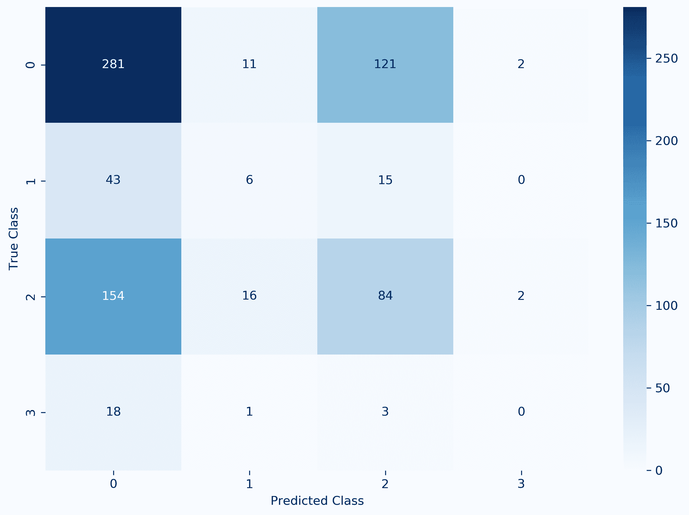

矩阵清楚地显示了 LSTM 模型在 ECG 数据集上的糟糕表现。特别是，它未能识别大多数 AF（异常心律）测量。

LSTM 在 ECG 数据集上的表现不佳，促使我们在该数据集上测试了 CNN 1D 模型。以下图示展示了 CNN 1D 模型在 ECG 数据集上的性能。如图所示，CNN 的单维度模型的测试准确率始终高于 0.96 或 96%（略低于 LSTM 模型），且其验证准确率始终在 0.82 左右，明显高于 LSTM。具备这种准确度的模型应该能够在大多数情况下正确分类患者的心律，并进行相应报告。以下截图显示了 CNN 1D 模型在训练阶段的进展及其最终训练和验证准确率：

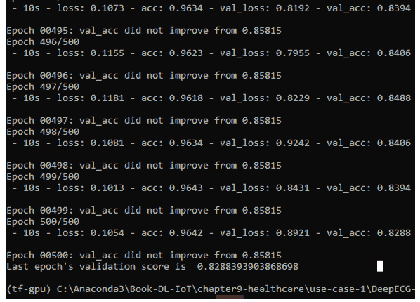

以下图表通过 TensorBoard 的日志文件生成，展示了 CNN 1D 模型在 ECG 数据集上的验证准确率：

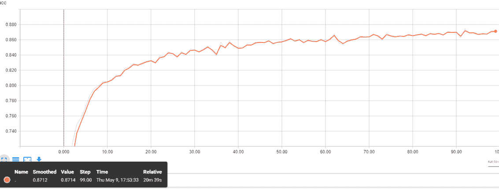

以下图表展示了 CNN 1D 模型在 ECG 数据集上的验证结果的归一化混淆矩阵：

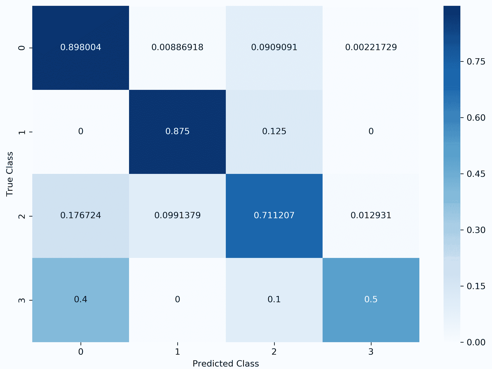

矩阵清楚地突出显示了该模型在 ECG 数据上的表现远超 LSTM 模型。重要的是，它成功地识别了大多数（87.5%）的房颤（AF）测量值（异常心律）。

通过增加模型网络的密度，CCN 1D 模型的性能可以得到改善，甚至可以接近 100%。然而，这会使得模型变得复杂，训练后的模型需要更多的内存，这使得它不适用于资源受限的物联网设备。

# 模型性能（用例二）

我们已经在减少后的痤疮数据集上训练并验证了 MobileNet v1 模型。以下截图展示了模型的评估结果。从截图中可以看到，大多数步骤中的训练准确率为 1.0 或 100%，最终的测试准确率为 0.89 或 89%：

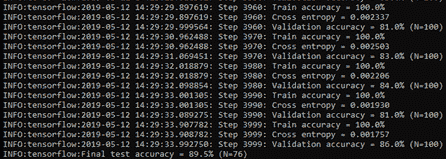

以下图表是通过 TensorBoard 生成的，基于模型的训练和验证准确率日志文件，显示了训练准确率在初期步骤中略有不一致，而之后稳定接近 1.0 或 100%。另一方面，验证准确率在 80% 到 89% 范围内略有不一致：

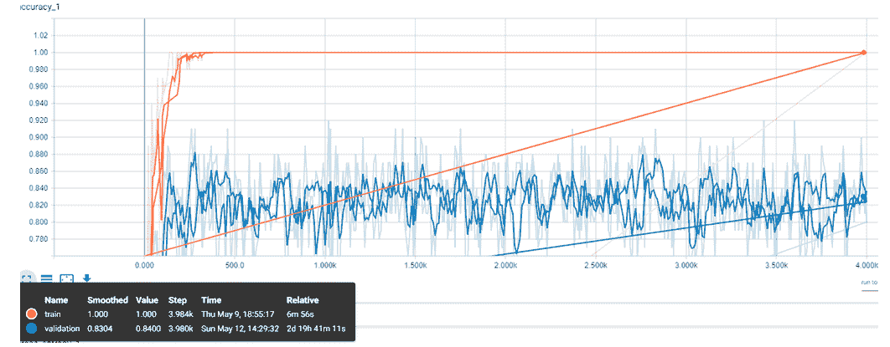

我们相信，即使存在这些不一致，模型仍然能够在超过 80% 的案例中检测到痤疮的类型。

# 总结

医疗行业正在采用机器学习（ML）和深度学习（DL）技术进行各种应用。物联网（IoT）医疗应用需要采用 ML 和 DL 技术，才能真正实现医疗物联网的目标。本章中，我们尝试展示了基于 DL 的物联网解决方案如何有用，以及它们如何在医疗应用中得以实施。在本章的第一部分，我们介绍了物联网在医疗行业的各种应用概述。随后，我们简要讨论了两个使用案例，通过 DL 支持的物联网解决方案可以改善和/或自动化医疗服务。在本章的第二部分，我们展示了基于 DL 的医疗事件和/或皮肤病检测案例的实践经验。

深度学习（DL）在物联网应用中的使用正在兴起。然而，DL 技术与物联网结合存在一些挑战，这些问题需要尽快解决，以便最大限度地发挥这两种令人兴奋的技术整合的潜力。在下一章，也是最后一章中，我们将识别并讨论这些挑战。此外，我们将提供一些未来的方向，以减轻一些问题。

# 参考文献

+   Bahar Farahani, Farshad Firouzi, Victor Chang, Mustafa Badaroglu, Nicholas Constant, 和 Kunal Mankodiya，*面向雾计算驱动的物联网电子健康：物联网在医学和医疗中的承诺与挑战*，《未来一代计算机系统》，第 78 卷，第二部分，2018 年，第 659-676 页

+   错过的全科医生预约让 NHS 损失数百万：[`www.england.nhs.uk/2019/01/missed-gp-appointments-costing-nhs-millions/`](https://www.england.nhs.uk/2019/01/missed-gp-appointments-costing-nhs-millions/)

+   世界卫生组织，（2017 年 9 月 10 日），*非传染性疾病*：[`www.who.int/mediacentre/factsheets/fs355/en/`](http://www.who.int/mediacentre/factsheets/fs355/en/)

+   MACAELA MACKENZIE，*粉刺如何影响心理健康的各种方式*：[`www.allure.com/story/how-acne-affects-mental-health-depression`](https://www.allure.com/story/how-acne-affects-mental-health-depression)

+   Vallerand IA, Lewinson RT, Parsons LM, Lowerison MW, Frolkis AD, Kaplan GG, Barnabe C, Bulloch AGM 和 Patten SB：*在英国患有粉刺的患者中抑郁的风险：基于人群的队列研究*，Br. J. Dermatol，（2018）178（3）：e194-e195

+   Riccardo Miotto, Fei Wang, Shuang Wang, Xiaoqian Jiang 和 Joel T Dudley，*医疗健康的深度学习：回顾、机遇和挑战*，Briefings in Bioinformatics，Volume 19，Issue 6，2018 年 11 月，pp. 1236–1246

+   Goldberger AL, Amaral LAN, Glass L, Hausdorff JM, Ivanov PCh, Mark RG, Mietus JE, Moody GB, Peng C-K, Stanley HE。*PhysioBank, PhysioToolkit 和 PhysioNet：复杂生理信号的新研究资源的组成部分*，*Circulation*（2000）101（23）：e215-e220

+   AliveCor：[`www.alivecor.com/`](https://www.alivecor.com/)

+   *皮肤病图谱 Dermnet*：[`www.dermnet.com/dermatology-pictures-skin-disease-pictures/`](http://www.dermnet.com/dermatology-pictures-skin-disease-pictures/)
