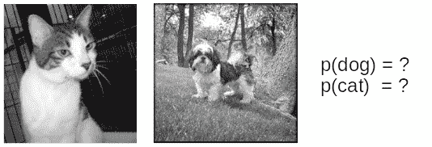
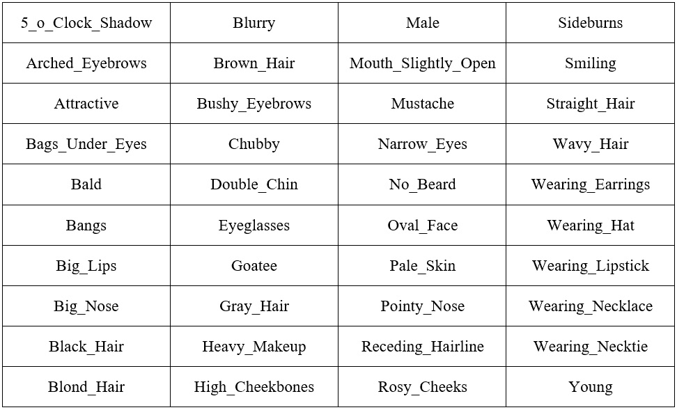
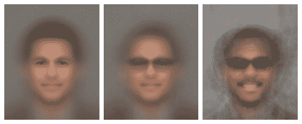
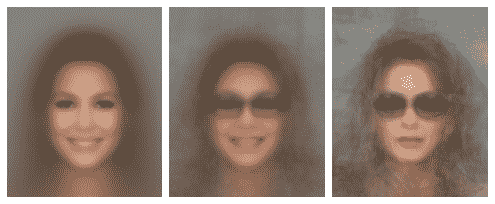
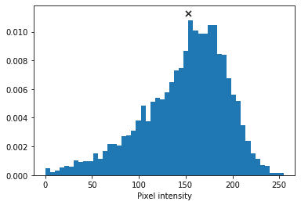
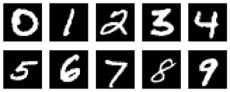
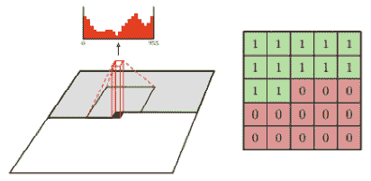
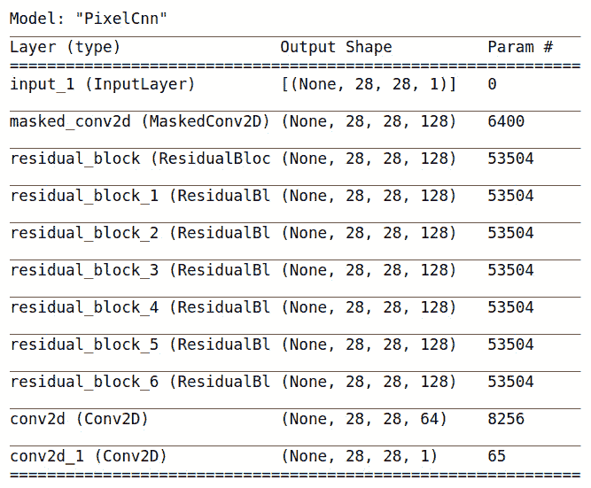
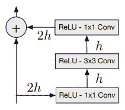
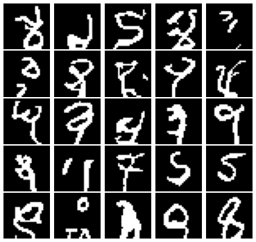

# *第一章*：使用 TensorFlow 开始图像生成

本书专注于使用 TensorFlow 2 通过无监督学习生成图像和视频。我们假设你已经有使用现代机器学习框架（如 TensorFlow 1）构建图像分类器的经验，尤其是使用**卷积神经网络**（**CNNs**）。因此，我们不会涉及深度学习和 CNN 的基础知识。在本书中，我们将主要使用 TensorFlow 2 中的高级 Keras API，学习起来比较简单。不过，我们假设你对图像生成没有任何先验知识，我们会涵盖所有必要的内容，帮助你入门。你首先需要了解的概念是**概率分布**。

概率分布是机器学习中的基础，尤其在生成模型中尤为重要。别担心，我向你保证，本章不会涉及任何复杂的数学公式。我们将首先学习什么是概率，以及如何在不使用神经网络或复杂算法的情况下，使用它生成面孔。

没错：在只需基本数学和 NumPy 代码的帮助下，你将学习如何创建一个概率生成模型。之后，你将学习如何使用 TensorFlow 2 构建**PixelCNN**模型来生成手写数字。本章内容丰富，包含很多有用的信息；在跳到其他章节之前，你需要先阅读本章。

本章将覆盖以下主要主题：

+   理解概率

+   使用概率模型生成面孔

+   从零开始构建 PixelCNN 模型

# 技术要求

代码可以在这里找到：[`github.com/PacktPublishing/Hands-On-Image-Generation-with-TensorFlow-2.0/tree/master/Chapter01`](https://github.com/PacktPublishing/Hands-On-Image-Generation-with-TensorFlow-2.0/tree/master/Chapter01)。

# 理解概率

你无法避免在任何机器学习文献中遇到*概率*这个术语，它可能令人困惑，因为在不同的上下文中它有不同的含义。概率通常在数学公式中表示为*p*，你会在学术论文、教程和博客中到处看到它。尽管它看似是一个容易理解的概念，但实际上却相当混乱。这是因为根据上下文的不同，概率有多种不同的定义和解释。我们将通过一些例子来阐明这一点。在本节中，我们将探讨概率在以下几种情境中的应用：

+   分布

+   信念

## 概率分布

假设我们想训练一个神经网络来分类猫和狗的图像，并且我们找到了一个数据集，其中包含 600 张狗的图片和 400 张猫的图片。如你所知，在将数据输入神经网络之前，数据需要先进行混洗。否则，如果它在一个小批次中只看到同一标签的图像，网络就会懒惰，认为所有图像都有相同的标签，而不费力去区分它们。如果我们随机抽样数据集，那么概率可以写成如下：

*pdata(dog) = 0.6*

*pdata(cat) = 0.4*

这里的概率指的是**数据分布**。在这个例子中，指的是猫和狗图像数量与数据集中总图像数量的比例。这里的概率是静态的，对于给定的数据集不会变化。

在训练深度神经网络时，数据集通常太大，无法放入一个批次中，我们需要将其分成多个小批次来进行一轮训练。如果数据集经过充分混洗，那么小批次的**抽样分布**将与数据分布相似。如果数据集不平衡，其中某些类别的标签图像远多于其他类别的图像，那么神经网络可能会倾向于预测它看到更多的图像。这就是一种**过拟合**的表现。因此，我们可以通过不同的方式抽样数据，给予较少代表的类别更多权重。如果我们希望在抽样中平衡各个类别，那么抽样概率将如下所示：

*psample(dog) = 0.5*

*psample(cat) = 0.5*

注：

**概率分布** **p(x)** 是数据点 *x* 出现的概率。在机器学习中，有两种常用的分布。**均匀分布** 是每个数据点有相同出现机会的分布；这是人们通常提到随机抽样时所暗示的，没有指定分布类型的情况。**高斯分布** 是另一种常用的分布。它如此常见，以至于人们也称之为**正态分布**。概率在中心（均值）处达到峰值，并在两侧逐渐衰减。高斯分布还有一些良好的数学性质，使其成为数学家的最爱。我们将在下一章看到更多内容。

## 预测置信度

在经历了数百次迭代后，模型终于完成了训练，我迫不及待想要用一张图片来测试这个新模型。模型输出以下概率：

*p(dog) = 0.6*

*p(cat) = 0.4*

等等，AI 是在告诉我这个动物是一个 60%狗基因和 40%猫遗传的混合种吗？当然不是！

在这里，概率不再指的是分布；相反，它们告诉我们我们对预测的信心有多大，换句话说，就是我们对输出结果有多强的信任。现在，这不再是通过计数事件的发生来量化的。如果你完全确定某个东西是狗，你可以设定 *p(dog) =* *1.0* 和 *p(cat) = 0.0*。这就是所谓的**贝叶斯概率**。

注意

传统的统计方法将概率视为某事件发生的可能性，例如，婴儿出生时的性别概率。关于频率主义和贝叶斯方法哪个更好的问题，在更广泛的统计领域中有过激烈的争论，这超出了本书的范围。然而，贝叶斯方法在深度学习和工程中可能更为重要。它已被用于开发许多重要的算法，包括**卡尔曼滤波**，用于追踪火箭轨迹。在计算火箭轨迹的投影时，卡尔曼滤波会同时使用**全球定位系统**（**GPS**）和**速度传感器**的数据。这两组数据都有噪声，但 GPS 数据起初不太可靠（即置信度较低），因此在计算中给予其较小的权重。我们在本书中不需要学习贝叶斯定理；理解概率可以视为置信度评分而非频率就足够了。贝叶斯概率最近也被用于搜索深度神经网络的超参数。

我们现在已经澄清了在一般机器学习中常用的两种主要概率类型——分布概率和置信度。从现在开始，我们将假设“概率”指的是概率分布，而不是置信度。接下来，我们将讨论在图像生成中起着至关重要作用的一个分布——**像素分布**。

## 像素的联合概率

看看下面的图片——你能判断它们是狗还是猫吗？你认为分类器如何生成置信度评分？



图 1.1 – 一只猫和一只狗的照片

这些照片是狗还是猫呢？嗯，答案显而易见，但同时，这对我们接下来的讨论并不重要。当你看这些照片时，你可能心里想，第一张照片是猫，第二张是狗。我们看的是整张图片，但这并不是计算机所看到的。计算机看到的是**像素**。

注意

像素是数字图像中最小的空间单元，代表一个单一的颜色。你不可能有一个像素，其中一半是黑色，另一半是白色。最常用的颜色方案是 8 位 RGB，其中一个像素由三种通道组成，分别是 R（红色）、G（绿色）和 B（蓝色）。它们的值范围从 0 到 255（255 为最大强度）。例如，一个黑色像素的值是 [0, 0, 0]，而一个白色像素的值是 [255, 255, 255]。

描述图像的**像素分布**最简单的方法是通过计算具有不同强度级别（从 0 到 255）的像素数量；你可以通过绘制直方图来可视化这一点。在数字摄影中，一个常用的工具是查看单独的 R、G 和 B 通道的直方图，以了解色彩平衡。虽然这能提供一些信息给我们——例如，天空图像很可能有很多蓝色像素，因此直方图可以可靠地告诉我们一些相关信息——但是直方图并不能告诉我们像素之间的关系。换句话说，直方图不包含空间信息，也就是，蓝色像素之间的距离是多少。我们需要一个更好的度量来处理这种情况。

与其说 *p(x)*，其中 *x* 是整个图像，我们可以将 *x* 定义为 *x*1*、x*2*、x*3*，… *x*n。现在，*p(x)* 可以定义为像素的**联合概率** *p(x*1*，x*2*，x*3*，… x*n*)*，其中 *n* 是像素的数量，每个像素之间用逗号分隔。

我们将使用以下图像来说明联合概率的含义。以下是三张具有 2 x 2 像素的二进制值图像，其中 0 表示黑色，1 表示白色。我们将左上角的像素称为 *x*1，右上角的像素称为 *x*2，左下角的像素称为 *x*3，右下角的像素称为 *x*4：


图 1.2 – 具有 2 x 2 像素的图像

我们首先通过计算白色 *x*1 的数量并将其除以图像的总数来计算 *p(x1 = 白色)*。然后，我们对 *x*2 做同样的事情，如下所示：

*p(x*1 *= 白色) = 2 / 3*

*p(x*2 *= 白色) = 0 / 3*

现在我们说 *p(x1)* 和 *p(x2)* 是相互独立的，因为我们分别计算了它们。如果我们计算两个像素都为黑色的联合概率，我们得到如下结果：

*p(x*1 *= 黑色, x*2 *= 黑色) = 0 / 3*

然后，我们可以计算这两个像素的完整联合概率，如下所示：

*p(x*1 *= 黑色, x*2 *= 白色) = 0 / 3*

*p(x*1 *= 白色, x*2 *= 黑色) = 3 / 3*

*p(x*1 *= 白色, x*2 *= 白色) = 0 / 3*

我们需要执行相同的步骤 16 次，以计算完整的联合概率*p(x*1*, x*2*, x*3*, x*4*)*。现在，我们可以完全描述像素分布，并使用该分布来计算边际分布，如*p(x*1*, x*2*, x*3*)*或*p(x*1*)*。然而，对于 RGB 值的联合分布，计算所需的步骤会呈指数增长，因为每个像素有 256 x 256 x 256 = 16,777,216 种可能性。这时，深度神经网络就派上用场了。神经网络可以训练来学习像素数据分布*P*data。因此，神经网络就是我们的概率模型*P*model。

重要提示

本书中将使用的符号如下：*大写 X*代表数据集，*小写 x*代表从数据集中采样的图像，*带下标 x*i 代表像素。

图像生成的目的是生成具有像素分布*p(x)*的图像，这种分布类似于*p(X)*。例如，一个橙子图像数据集将具有很高的概率，出现很多靠近彼此分布的橙色像素。因此，在生成图像之前，我们将首先从真实数据*p*data*(X)*中构建一个概率模型*p*model*(x)*。然后，我们通过从*p*model*(x)*中采样来生成图像。

# 使用概率模型生成面孔

好了，数学部分到此为止。现在是时候动手生成你的第一张图像了。在这一部分，我们将学习如何通过从概率模型中采样来生成图像，甚至不需要使用神经网络。

## 平均面孔

我们将使用由香港中文大学创建的大规模 CelebFaces Attributes（CelebA）数据集（[`mmlab.ie.cuhk.edu.hk/projects/CelebA.html`](http://mmlab.ie.cuhk.edu.hk/projects/CelebA.html)）。可以直接通过 Python 的`tensorflow_datasets`模块在`ch1_generate_first_image.ipynb` Jupyter 笔记本中下载，如以下代码所示：

```
import tensorflow_datasets as tfds
import matplotlib.pyplot as plt
import numpy as np
ds_train, ds_info = tfds.load('celeb_a', split='test', 
                               shuffle_files=False, 
                               with_info=True)
fig = tfds.show_examples(ds_info, ds_train)
```

TensorFlow 数据集允许我们通过使用`tfds.show_examples()` API 来预览一些图像示例。以下是一些男性和女性名人面孔的样本：


图 1.3 – 来自 CelebA 数据集的样本图像

如图所示，每张图像中都有一个名人的面孔。每张图片都是独一无二的，展示了各种性别、姿势、表情和发型；有些人戴眼镜，有些则没有。我们来看看如何利用图像的概率分布帮助我们创造一个新的面孔。我们将使用最简单的统计方法之一——均值，这意味着取图像像素的平均值。更具体地说，我们是通过平均每张图像的*x*i 来计算新图像的*x*i。为了加快处理速度，我们将仅使用数据集中的 2,000 个样本来完成这项任务，如下所示：

```
sample_size = 2000
ds_train = ds_train.batch(sample_size)
features = next(iter(ds_train.take(1)))
sample_images = features['image']
new_image = np.mean(sample_images, axis=0)
plt.imshow(new_image.astype(np.uint8))
```

哇哦！那就是你生成的第一张图像，效果真棒！我最初以为它会看起来有点像毕加索的画作，但事实证明，平均图像其实相当连贯：


](img/B14538_01_04.jpg)

图 1.4 – 平均面孔

## 条件概率

CelebA 数据集的最棒之处在于，每张图像都有如下的面部属性标签：



](img/B14538_01_05.jpg)

图 1.5 – CelebA 数据集中按字母顺序排列的 40 个属性

我们将使用这些属性生成一张新图像。假设我们想要生成一张男性图像。我们该怎么做呢？我们不通过计算每张图像的概率，而只使用那些将`男性`属性设置为`true`的图像。我们可以这样表达：

*p(x | y)*

我们称这为在给定 *y* 条件下 *x* 的概率，或者更非正式地称为在 *y* 条件下 *x* 的概率。这就是`男性`属性，这个变量不再是一个随机概率；每个样本都会有 `男性` 属性，我们可以确定每个面孔都属于男性。以下图显示了使用其他属性以及`男性`属性生成的新平均面孔，例如 *男性 + 眼镜* 和 *男性 + 眼镜 + 胡子 + 微笑*。请注意，随着条件的增加，样本数量减少，平均图像也变得更嘈杂：



图 1.6 – 从左到右添加属性。 (a) 男性 (b) 男性 + 眼镜 (c) 男性 + 眼镜 + 胡子 + 微笑

你可以使用 Jupyter notebook 通过不同的属性生成新的面孔，但并不是每种组合都会产生令人满意的结果。以下是一些通过不同属性生成的女性面孔。最右边的图像很有趣。我使用了`女性`、`微笑`、`眼镜`和`尖鼻子`等属性，但事实证明，具有这些属性的人通常也有波浪形的头发，而这在这个样本中并未包括。可视化是一个有用的工具，可以为你提供数据集的见解：



](img/B14538_01_07.jpg)

图 1.7 – 不同属性的女性面孔

提示

生成图像时，你可以尝试使用中位数，而不是使用平均值，这可能会生成更清晰的图像。只需将 `np.mean()` 替换为 `np.median()`。

## 概率生成模型

我们希望通过图像生成算法实现三个主要目标：

1.  生成看起来像给定数据集中的图像。

1.  生成各种图像。

1.  控制生成的图像。

仅仅通过取图像中像素的均值，我们就展示了如何实现目标 *1* 和 *3*。然而，一个限制是我们每种条件下只能生成一张图像。对于一个算法来说，这真的不是很有效，只从数百或数千张训练图像中生成一张图像。

以下图表显示了数据集中一个任意像素的一个颜色通道的分布。图表上的 *x* 标记是中位数值。当我们使用数据的均值或中位数时，我们总是在采样同一个点，因此结果不会有变化。有没有办法生成多个不同的面孔？有的，我们可以尝试通过从整个像素分布中进行采样来增加生成图像的变化：



图 1.8 – 像素颜色通道的分布

一本机器学习教材可能会要求你首先创建一个概率模型 `pmodel`，通过计算每个像素的联合概率。但是，由于样本空间非常庞大（记住，一个 RGB 像素可以有 16,777,216 种不同的值），实现起来计算成本非常高。此外，因为这是一本实践书，我们将直接从数据集中提取像素样本。为了在新图像中创建一个 *x*0 像素，我们通过运行以下代码从数据集中的所有图像的 *x*0 像素中随机采样：

```
new_image = np.zeros(sample_images.shape[1:], dtype=np.uint8)
for i in range(h):
    for j in range(w):
        rand_int = np.random.randint(0, sample_images.shape[0])
        new_image[i,j] = sample_images[rand_int,i,j]
```

图像是通过随机采样生成的。令人失望的是，尽管图像之间有一些变化，但它们之间的差异并不大，而我们的目标之一是能够生成多样化的面孔。此外，与使用均值时相比，图像的噪声明显增多。其原因是像素分布是相互独立的。

例如，对于嘴唇中的一个给定像素，我们可以合理地预计其颜色为粉色或红色，相邻的像素也是如此。然而，由于我们从脸部位于不同位置和姿势的图像中独立采样，这会导致像素之间的颜色不连续，最终产生这种噪声效果：


图 1.9 – 通过随机采样生成的图像

提示

你可能会想，为什么平均面孔看起来比随机采样的更平滑。首先，是因为像素之间的平均距离较小。想象一个随机采样的场景，其中一个像素采样值接近 0，而下一个像素接近 255。这样，这些像素的平均值可能会位于两者之间，因此它们之间的差异会较小。另一方面，图像背景中的像素通常呈现均匀分布；例如，它们可能都是蓝天的一部分，白色墙壁，绿色树叶，等等。由于这些像素均匀分布在颜色谱上，平均值大约是[127, 127, 127]，这恰好是灰色。

## 参数化建模

我们刚才所做的，是使用像素直方图作为我们的`pmodel`，但这里有一些不足之处。首先，由于样本空间很大，并不是每个可能的颜色都存在于我们的样本分布中。因此，生成的图像永远不会包含数据集中不存在的颜色。例如，我们希望能够生成全谱的肤色，而不仅仅是数据集中存在的某个特定的棕色。如果你尝试在条件下生成面孔，你会发现并不是每种条件的组合都是可能的。例如，对于*胡须+鬓角+浓妆+卷发*，根本没有一个样本符合这些条件！

其次，随着我们增加数据集的大小或图像分辨率，样本空间会增大。这可以通过使用参数化模型来解决。下图中的垂直条形图显示了 1,000 个随机生成的数字的直方图：


图 1.10 – 高斯直方图和模型

我们可以看到有些条形图没有任何数值。我们可以在数据上拟合一个高斯模型，其中**概率密度函数**（**PDF**）以黑线的形式绘制。高斯分布的 PDF 方程如下：


这里，*µ* 是均值，*σ* 是标准差。

我们可以看到，PDF 覆盖了直方图的空白，这意味着我们可以为缺失的数字生成概率。这个高斯模型只有两个参数——均值和标准差。

这 1,000 个数字现在可以压缩为仅两个参数，我们可以使用这个模型生成任意数量的样本；我们不再受限于拟合模型的数据。当然，自然图像是复杂的，不能通过简单的模型（如高斯模型）来描述，实际上也不能通过任何数学模型来描述。这就是神经网络发挥作用的地方。现在，我们将使用神经网络作为一个参数化的图像生成模型，其中参数是网络的权重和偏差。

# 从头开始构建 PixelCNN 模型

深度神经网络生成算法的三大类：

+   **生成对抗网络**（**GANs**）

+   **变分自编码器**（**VAEs**）

+   **自回归模型**

变分自编码器（VAE）将在下一章介绍，我们将在一些模型中使用它们。生成对抗网络（GAN）是本书中主要使用的算法，关于它的更多细节将在后续章节中介绍。在这里，我们将介绍较少人知的**自回归模型**系列，并将在后续章节重点讨论 VAE 和 GAN。尽管在图像生成中不那么常见，自回归仍然是一个活跃的研究领域，DeepMind 的 WaveNet 就使用它来生成逼真的音频。在本节中，我们将介绍自回归模型，并从零开始构建一个**PixelCNN**模型。

## 自回归模型

这里的 *Auto* 意味着 *自我*，而在机器学习术语中，*regress* 意味着 *预测新值*。将它们结合起来，autoregressive 意味着我们使用一个模型基于该模型的历史数据点来预测新的数据点。

让我们回顾一下图像的概率分布 *p(x)*，它是联合像素概率 *p(x*1*, x*2*, … x*n*)*，由于维度较高，难以建模。在这里，我们假设一个像素的值仅依赖于其前一个像素的值。换句话说，一个像素仅依赖于它前面的像素，即 *p(x*i*) = p(x*i *| x*i-1*) p(x*i-1*)*。不深入数学细节，我们可以将联合概率近似为条件概率的乘积：

*p(x) = p(x*n*, x*n-1*, …, x*2*, x*1*)*

*p(x) = p(x*n *| x*n-1*)… p(x*3 *| x*2*) p(x*2 *| x*1*) p(x*1*)*

举个具体的例子，假设我们有一些图像，图像中大约在中心位置只有一个红色的苹果，并且苹果周围有绿色的叶子。换句话说，只有两种颜色：红色和绿色。*x*1 是左上角的像素，因此 *p(x*1*)* 是左上角像素是绿色还是红色的概率。如果 *x*1 是绿色，那么它右边的像素 *p(x*2*)* 也很可能是绿色，因为很可能是更多的叶子。然而，尽管概率较小，它也可能是红色。

随着我们继续，最终会遇到一个红色像素（太好了！我们找到了苹果！）。从那个像素开始，接下来的几个像素也很可能是红色的。现在我们可以看到，这比必须一起考虑所有像素要简单得多。

## PixelRNN

**PixelRNN** 由 Google 收购的 DeepMind 在 2016 年发明。正如 **RNN**（**循环神经网络**）所暗示的那样，该模型使用一种称为 **长短时记忆**（**LSTM**）的 RNN 来学习图像的分布。它每次读取图像的一行，在 LSTM 中进行一步处理，并用 1D 卷积层处理该行，然后将激活值传递到后续层，预测该行的像素。

由于 LSTM 运行速度较慢，训练和生成样本需要较长时间。因此，它逐渐失去了流行，并且自其诞生以来没有太多改进。因此，我们不会在此过多停留，而是将注意力转向同一篇论文中也被提出的一个变体——PixelCNN。

## 使用 TensorFlow 2 构建 PixelCNN 模型

PixelCNN 仅由卷积层组成，使其比 PixelRNN 快得多。在这里，我们将实现一个简单的 PixelCNN 模型用于 MNIST。代码可以在 `ch1_pixelcnn.ipynb` 中找到。

### 输入和标签

MNIST 由 28 x 28 x 1 的灰度图像组成，展示手写数字。它只有一个通道，使用 256 个灰度级来描绘灰色的阴影：



图 1.11 – MNIST 数字示例

在这个实验中，我们通过将图像转换为仅包含两个可能值的二进制格式来简化问题：`0`表示黑色，`1`表示白色。代码如下所示：

```
def binarize(image, label):
    image = tf.cast(image, tf.float32)
    image = tf.math.round(image/255.)
    return image, tf.cast(image, tf.int32)
```

该函数需要两个输入——一张图像和一个标签。函数的前两行将图像转换为二进制`float32`格式，换句话说，就是`0.0`或`1.0`。在本教程中，我们不使用标签信息；相反，我们将二进制图像转换为整数并返回。我们不必将其转换为整数，但为了遵循标签使用整数的惯例，我们还是这么做。回顾一下，输入和标签都是 28 x 28 x 1 的二进制 MNIST 图像，唯一不同的是数据类型。

### 掩膜

与逐行读取的 PixelRNN 不同，PixelCNN 从左到右、从上到下滑动卷积核遍历图像。在执行卷积以预测当前像素时，传统的卷积核能够看到当前输入像素以及周围的像素，包括未来的像素，这打破了我们的条件概率假设。

为了避免这种情况，我们需要确保 CNN 在预测时不会看到它正在预测的像素。换句话说，我们需要确保 CNN 在预测输出像素*x*i 时，不能看到输入像素*x*i。

这是通过使用掩膜卷积实现的，其中在执行卷积之前，掩膜被应用到卷积核权重上。下图展示了一个 7 x 7 卷积核的掩膜，其中从中心开始的权重为 0。这阻止了 CNN 看到它正在预测的像素（卷积核的中心）以及所有未来的像素。这被称为**类型 A 掩膜**，仅应用于输入层。由于第一层已经阻止了中心像素，我们在后续层中不再需要隐藏中心特征。实际上，我们需要将卷积核的中心设置为 1，以便它能够读取来自前一层的特征。这被称为类型 B 掩膜：



图 1.12 – 7 x 7 卷积核掩膜（来源：Aäron van den Oord 等人，2016 年，《使用 PixelCNN 解码器的条件图像生成》，[`arxiv.org/abs/1606.05328`](https://arxiv.org/abs/1606.05328))

接下来，我们将学习如何创建自定义层。

### 实现自定义层

接下来，我们将为掩膜卷积创建一个自定义层。我们可以通过从基类`tf.keras.layers.Layer`继承模型子类来在 TensorFlow 中创建自定义层，如下所示。我们将能够像使用其他 Keras 层一样使用它。以下是自定义层类的基本结构：

```
class MaskedConv2D(tf.keras.layers.Layer):
    def __init__(self):
        ...       
    def build(self, input_shape):
        ...
    def call(self, inputs):
        ...
        return output
```

`build()`将输入张量的形状作为参数，我们将使用这些信息来创建正确形状的变量。此函数只在构建层时运行一次。我们可以通过声明掩膜为非训练变量或常量来创建掩膜，这样 TensorFlow 就会知道它不需要反向传播的梯度：

```
    def build(self, input_shape):
        self.w = self.add_weight(shape=[self.kernel,
                                        self.kernel,
                                        input_shape[-1],
                                        self.filters],
                                initializer='glorot_normal',
                                trainable=True)
        self.b = self.add_weight(shape=(self.filters,),
                                initializer='zeros',
                                trainable=True)
        mask = np.ones(self.kernel**2, dtype=np.float32)
        center = len(mask)//2
        mask[center+1:] = 0
        if self.mask_type == 'A':
            mask[center] = 0
        mask = mask.reshape((self.kernel, self.kernel, 1, 1))
        self.mask = tf.constant(mask, dtype='float32')
```

`call()`是执行计算的前向传播函数。在这个掩蔽卷积层中，我们通过将权重乘以掩膜将下半部分清零，然后使用低级的`tf.nn` API 执行卷积操作：

```
    def call(self, inputs):
        masked_w = tf.math.multiply(self.w, self.mask)
        output = tf.nn.conv2d(inputs, masked_w, 1, "SAME") +  	                   self.b
        return output
```

提示

`tf.keras.layers`是一个高级 API，易于使用，无需了解底层细节。然而，有时我们需要使用低级的`tf.nn` API 来创建自定义函数，这要求我们首先指定或创建需要使用的张量。

### 网络层

PixelCNN 架构非常简单。经过带有掩膜 A 的第一个 7 x 7 `conv2d`层后，接下来是几层带有掩膜 B 的残差块（参见下表）。为了保持 28 x 28 的相同特征图尺寸，这些层没有进行下采样；例如，这些层中的最大池化和填充被设置为`SAME`。然后，顶部特征会被送入两层 1 x 1 的卷积层，最终生成输出，如下截图所示：



](img/B14538_01_13.jpg)

图 1.13 – PixelCNN 架构，展示了层和输出形状

残差块在许多高性能的基于 CNN 的模型中都有应用，并且通过 ResNet 而广为人知，ResNet 是由 Kaiming He 等人在 2015 年发明的。以下图示展示了 PixelCNN 中使用的残差块变种。左侧路径被称为**跳跃连接路径**，它简单地传递来自前一层的特征。在右侧路径中，有三个连续的卷积层，过滤器大小为 1 x 1、3 x 3 和 1 x 1。该路径优化输入特征的残差，因此得名**残差网络**：



图 1.14 – 残差块，其中 h 表示滤波器的数量。（来源：Aäron van den Oord 等人，《Pixel Recurrent Neural Networks》）

### 交叉熵损失

**交叉熵损失**，也称为**对数损失**，衡量模型的性能，其中输出的概率在 0 和 1 之间。以下是二元交叉熵损失的公式，其中只有两个类别，标签*y*可以是 0 或 1，*p(x)*是模型的预测。公式如下：


让我们来看一个例子，其中标签为 1，第二项为零，第一项为*log p(x)*的和。公式中的对数是自然对数（loge），但根据惯例，方程中省略了 e 的底数。如果模型确信*x*属于标签 1，那么*log(1)*为零。另一方面，如果模型错误地将其猜测为标签 0，并预测*x*为标签*1*的概率很低，例如*p(x) = 0.1*，则*-log(p(x))*将变为较高的损失*2.3*。因此，最小化交叉熵损失将最大化模型的准确性。这个损失函数通常用于分类模型，但在生成模型中也非常流行。

在 PixelCNN 中，单个图像像素被用作标签。在我们的二值化 MNIST 数据集中，我们希望预测输出像素是 0 还是 1，这使得该问题成为一个分类问题，交叉熵作为损失函数。

可以有两种输出类型：

+   由于在二值化图像中只能为 0 或 1，我们可以通过使用`sigmoid()`简化网络，以预测白色像素的概率，即*p(x*i*=1)*。损失函数为二元交叉熵。这就是我们将在 PixelCNN 模型中使用的损失函数。

+   可选地，我们还可以将网络推广以接受灰度或 RGB 图像。我们可以使用`softmax()`激活函数为每个（子）像素生成*N*个概率。对于二值化图像，*N*将为*2*；对于灰度图像，*N*将为*256*；对于 RGB 图像，*N*将为*3 x 256*。如果标签是独热编码，则损失函数为稀疏类别交叉熵或类别交叉熵。

最后，我们现在可以准备编译和训练神经网络。如下面的代码所示，我们对`loss`和`metrics`使用二元交叉熵，并将`RMSprop`作为优化器。有许多不同的优化器可以使用，它们的主要区别在于如何根据过去的统计数据调整个别变量的学习率。有些优化器加速了训练，但可能会导致过冲，无法达到全局最小值。没有一种最好的优化器适用于所有情况，因此建议您尝试不同的优化器。

然而，您将经常看到的两个优化器是**Adam**和**RMSprop**。Adam 优化器因其快速学习而在图像生成中非常流行，而 RMSprop 则是谷歌频繁使用的一种优化器，用于生成最先进的模型。

以下是用于编译和拟合`pixelcnn`模型的代码：

```
pixelcnn = SimplePixelCnn()
pixelcnn.compile(
    loss = tf.keras.losses.BinaryCrossentropy(),
    optimizer=tf.keras.optimizers.RMSprop(learning_rate=0.001),
    metrics=[ tf.keras.metrics.BinaryCrossentropy()])
pixelcnn.fit(ds_train, epochs = 10, validation_data=ds_test)
```

接下来，我们将从前述模型生成一张新图像。

### 样本图像

训练后，我们可以通过以下步骤使用该模型生成新的图像：

1.  创建一个与输入图像形状相同的空张量，并用零填充它。将其输入到网络中，并获得*p(x*1*)*，即第一个像素的概率。

1.  从*p(x*1*)*中采样，并将样本值赋给输入张量中的像素*x*1。

1.  将输入再次送入网络并执行步骤 2 以处理下一个像素。

1.  重复步骤 2 和 3，直到*x*N 被生成。

自回归模型的一个主要缺点是它比较慢，因为需要逐像素生成，且无法并行化。以下是我们在训练 50 轮后，由简单的 PixelCNN 模型生成的图像。它们看起来还不像标准的数字，但已经开始呈现出手写笔画的形态。现在我们能够从零输入张量生成新的图像，真是太神奇了（也就是说，我们可以从无到有生成图像）。如果通过训练模型更长时间并进行一些超参数调优，您能生成更好的数字吗？



图 1.15 – 由我们的 PixelCNN 模型生成的一些图像

到此为止，我们已经结束了这一章！

# 总结

哇！我觉得我们在这一章学到了很多内容，从理解像素概率分布到使用它构建概率模型生成图像。我们学会了如何使用 TensorFlow 2 构建自定义层，并利用它们构建自回归 PixelCNN 模型来生成手写数字图像。

在下一章中，我们将学习如何使用变分自编码器（VAE）进行表示学习。这一次，我们将从全新的角度来看待像素。我们将训练一个神经网络来学习面部特征，并进行面部编辑，例如将一个看起来悲伤的女孩转变成一个带着胡子的微笑男士。
