# *第三章*：生成对抗网络

**生成对抗网络**，通常称为 **GANs**，目前是图像和视频生成中最突出的技术。正如卷积神经网络的发明者 Yann LeCun 博士在 2016 年所说，*“…这是过去 10 年里机器学习中最有趣的想法。”* 使用 GAN 生成的图像在真实性方面优于其他竞争技术，自从 2014 年由当时的研究生 Ian Goodfellow 发明以来，技术已经取得了巨大的进展。

在本章中，我们将首先了解 GAN 的基本原理，并构建一个 DCGAN 来生成 Fashion MNIST。我们将学习训练 GAN 时面临的挑战。最后，我们将学习如何构建 WGAN 及其变体 WGAN-GP，以解决生成面孔时遇到的许多挑战。

在本章中，我们将涵盖以下主题：

+   理解 GAN 的基本原理

+   构建深度卷积生成对抗网络（DCGAN）

+   训练 GAN 的挑战

+   构建 Wasserstein GAN（WGAN）

# 技术要求

Jupyter 笔记本和代码可以在此找到：

[`github.com/PacktPublishing/Hands-On-Image-Generation-with-TensorFlow-2.0/tree/master/Chapter03`](https://github.com/PacktPublishing/Hands-On-Image-Generation-with-TensorFlow-2.0/tree/master/Chapter03)

本章使用的笔记本如下：

+   `ch3_dcgan.ipynb`

+   `ch3_mode_collapse`

+   `ch3_wgan_fashion_mnist.ipynb`

+   `ch3_wgan_gp_fashion_mnist.ipynb`

+   `ch3_wgan_gp_celeb_a.ipynb`

# 理解 GAN 的基本原理

生成模型的目的是学习数据分布，并从中采样生成新的数据。对于我们在前几章中讨论的模型，例如 PixelCNN 和 VAE，它们的生成部分在训练过程中可以查看图像分布。因此，它们被称为**显式密度模型**。相比之下，GAN 的生成部分从未直接查看过图像；它只知道生成的图像是真实的还是伪造的。因此，GAN 被归类为**隐式密度模型**。

我们可以用一个类比来比较显式模型和隐式模型。假设一位艺术生 G 获得了一些毕加索的画作，并被要求学习如何画伪造的毕加索画作。学生可以在学习绘画的过程中参考这些画作，因此这是一个显式模型。在另一个场景中，我们要求学生 G 伪造毕加索画作，但我们不展示任何画作，他们也不知道毕加索的画作是什么样的。他们唯一的学习方式是通过来自学生 D 的反馈，学生 D 正在学习识别伪造的毕加索画作。反馈非常简单——画作要么是*伪造的*，要么是*真实的*。这就是我们的隐式密度 GAN 模型。

或许有一天，它们偶然画了一个扭曲的面孔，并从反馈中学到这看起来像一幅真正的毕加索画作。于是，它们开始以这种风格作画来愚弄学生 D。学生 G 和 D 是生成对抗网络（GAN）中的两个网络，分别称为**生成器**和**判别器**。这是与其他生成模型相比，网络架构的最大不同之处。

我们将从学习 GAN 的构建模块开始，然后是损失函数。原始 GAN 没有重构损失，这是它与其他算法不同的另一个方面。然后，我们将为 GAN 创建自定义的训练步骤，之后我们就可以训练我们的第一个 GAN 了。

## GAN 的架构

生成对抗网络中的*对抗*一词根据词典定义意味着*涉及对立或分歧*。有两个网络，分别称为生成器和判别器，它们彼此竞争。生成器，顾名思义，生成*假*图像；而判别器会查看生成的图像，以判断它们是“真实”还是“虚假”。每个网络都在努力赢得比赛——判别器希望正确识别每一张真实或虚假的图像，而生成器则希望愚弄判别器，使其相信由其生成的假图像是真实的。下图展示了 GAN 的架构：

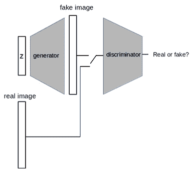

图 3.1 – GAN 架构

GAN 架构与 VAE（参见*第二章*，*变分自编码器*）有一些相似之处。事实上，你可以重新排列 VAE 框图中的模块，并添加一些线条和开关，来生成这个 GAN 框图。如果 VAE 由两个独立的网络组成，我们可以认为：

+   GAN 的生成器就像 VAE 的解码器

+   GAN 的判别器就像 VAE 的编码器

生成器将低维简单分布转换为具有复杂分布的高维图像，就像解码器的工作原理一样。事实上，它们是完全相同的；我们可以直接复制并粘贴解码器的代码，并将其重命名为生成器，反之亦然，它就能正常工作。生成器的输入通常是来自正态分布的样本，尽管有些使用均匀分布。

我们将真实图像和假图像分别送入判别器的不同小批次。真实图像来自数据集，而假图像由生成器生成。判别器输出一个单一的概率值，用于判断输入图像是“真实”还是“假”。它是一个二分类器，我们可以使用 CNN 来实现它。从技术上讲，判别器的作用与编码器不同，但它们都减少了输入的维度。

结果证明，在模型中有两个网络其实并不可怕。生成器和判别器是我们旧朋友的伪装和新名字。我们已经知道如何构建这些模型，因此现在不用担心构建的细节。事实上，原始的 GAN 论文只用了一个多层感知器，由一些基本的全连接层组成。

## 价值函数

价值函数捕捉了 GAN 工作原理的基本内容。方程如下：


这里：

+   *D* 代表判别器。

+   *G* 是生成器。

+   *x* 是输入数据，*z* 是潜在变量。

我们在代码中也会使用相同的符号。这是生成器试图最小化的函数，而判别器则希望最大化它。

当你理解它后，代码实现会容易很多，而且会变得更加有意义。此外，我们接下来关于 GAN 挑战和改进的讨论，很多都围绕损失函数展开。因此，花时间研究它是非常值得的。GAN 损失函数在某些文献中也被称为 **对抗性损失**。现在它看起来相当复杂，但我会一步步分解并展示如何将其转化为我们可以实现的简单损失函数。

### 判别器损失

价值函数的第一项是正确分类真实图像的值。从左侧项我们可以知道，判别器希望最大化它。**期望**是一个数学术语，指的是随机变量每个样本的加权平均值的总和。在这个方程中，权重是数据的概率，变量是判别器输出的对数，如下所示：


在一个大小为 *N* 的小批量中，*p(x)* 是 *1/N*。这是因为 *x* 是一张单独的图像。我们可以改变符号为负号并尝试最小化它，而不是最大化它。这可以通过以下方程实现，称为 **对数损失**：


这里：

+   *y*i 是标签，对于真实图像，标签为 *1*。

+   *p(y*i*)* 是样本为真实的概率。

价值函数的第二项是关于假图像的；*z* 是随机噪声，*G(z)* 是生成的假图像。*D(G(z))* 是判别器对图像是否真实的信心分数。如果我们将假图像的标签设置为 *0*，我们可以使用相同的方法将其转换为以下方程：


现在，将所有内容汇总，我们得到了判别器损失函数，即二元交叉熵损失：


以下代码展示了如何实现判别器损失。你可以在 Jupyter notebook `ch3_dcgan.ipynb` 中找到相关代码：

```py
import tf.keras.losses.binary_crossentropy as bce
def discriminator_loss(pred_fake, pred_real):
    real_loss = bce(tf.ones_like(pred_real), pred_real)
    fake_loss = bce(tf.zeros_like(pred_fake), pred_fake)
    d_loss = 0.5 *(real_loss + fake_loss)
    return d_loss
```

在我们的训练中，我们分别对真实和假图像进行前向传递，使用相同的批量大小。因此，我们分别计算它们的二元交叉熵损失，并取平均作为损失。

### 生成器损失

生成器仅在模型评估伪造图像时参与，因此我们只需要查看值函数的第二个右侧项，并将其简化为以下形式：


在训练开始时，生成器在生成图像方面并不擅长，因此鉴别器总是很有信心地将其分类为*0*，使得*D(G(z))*始终为*0*，因此*log (1 – 0)*也为*0*。当模型输出的误差始终为*0*时，就没有梯度可以进行反向传播。因此，生成器的权重不会更新，生成器也无法学习。这种现象被称为**梯度饱和**，因为在鉴别器的 sigmoid 输出中几乎没有梯度。为了避免这个问题，公式被转化为最大化*D(G(z))*而不是最小化*1-D(G(z))*，如下所示：


使用这个函数的 GAN 也被称为**非饱和 GAN（NS-GANs）**。事实上，几乎所有的**经典 GAN**实现都使用这个值函数，而不是原始的 GAN 函数。

经典 GAN

在 GAN 发明后，研究人员对 GAN 的兴趣激增，许多研究人员给自己的 GAN 命名。有些人试图追踪多年来命名的 GAN，但这个列表变得过长。经典 GAN 是一个松散的术语，用来指代没有任何复杂变种的第一个基础 GAN。经典 GAN 通常通过两到三层隐藏密集层来实现。

我们可以通过与鉴别器相同的数学步骤推导出生成器的损失，这最终会得出与鉴别器损失函数相同的结果，唯一的不同是，真实图像使用标签 1。对于初学者来说，可能会感到困惑，为什么要为伪造图像使用真实标签。如果我们推导出这个公式，或者我们可以理解为，我们想要欺骗鉴别器，让它认为生成的图像是真的，因此我们使用真实标签。代码如下：

```py
    def generator_loss(pred_fake):
        g_loss = bce(tf.ones_like(pred_fake), pred_fake)
        return g_loss
```

恭喜你，你已经将 GAN 中最复杂的公式转化为简单的二元交叉熵损失，并在几行代码中实现了它！现在让我们看看 GAN 的训练流程。

## GAN 训练步骤

在 TensorFlow 或任何其他高级机器学习框架中训练传统神经网络时，我们指定模型、损失函数、优化器，然后调用`model.fit()`。TensorFlow 会为我们完成所有工作——我们只需坐着等待损失下降。不幸的是，我们无法像训练 VAE 时那样将生成器和鉴别器连接为一个单一模型，直接调用`model.fit()`来训练 GAN。

在深入探讨 GAN 问题之前，让我们先暂停一下，回顾一下在进行单次训练步骤时，模型内部到底发生了什么：

1.  执行一次前向传播以计算损失。

1.  从损失中，反向传播梯度，针对变量（权重和偏置）进行调整。

1.  然后是变量更新步骤。优化器将缩放梯度并将其加到变量中，完成一次训练步骤。

这些是深度神经网络中的通用训练步骤。不同的优化器仅在计算缩放因子的方式上有所不同。

现在回到 GAN，看看梯度的流动。当我们使用真实图像进行训练时，只有判别器参与——网络输入是一个真实图像，输出是标签 *1*。生成器在这里不起作用，因此我们不能使用 `model.fit()`。然而，我们仍然可以只使用判别器来拟合模型，即 `D.fit()`，这样就不会有阻塞问题。当我们使用假图像时，问题就出现了，梯度通过判别器反向传播到生成器。那么，问题到底是什么呢？让我们将生成器损失和判别器损失放到一起，看看假图像的情况：

```py
g_loss = bce(tf.ones_like(pred_fake), pred_fake) 
# generator
fake_loss = bce(tf.zeros_like(pred_fake), pred_fake) 
# generator
```

如果你试着找出它们之间的差异，你会发现它们的标签符号是相反的！这意味着，使用生成器损失来训练整个模型会让判别器朝着相反的方向移动，无法学习区分能力。这是适得其反的，我们不希望有一个未经训练的判别器，这会阻碍生成器的学习。因此，我们必须分别训练生成器和判别器。在训练生成器时，我们会冻结判别器的变量。

设计 GAN 训练流程有两种方法。一种是使用高级的 Keras 模型，这需要更少的代码，因此看起来更简洁。我们只需定义一次模型，并调用 `train_on_batch()` 来执行所有步骤，包括前向传播、反向传播和权重更新。然而，当需要实现更复杂的损失函数时，它的灵活性较差。

另一种方法是使用低级代码，这样我们可以控制每个步骤。对于我们的第一个 GAN，我们将使用来自官方 TensorFlow GAN 教程中的低级自定义训练步骤函数（[`www.tensorflow.org/tutorials/generative/dcgan`](https://www.tensorflow.org/tutorials/generative/dcgan)），如下所示：

```py
def train_step(g_input, real_input):
    with tf.GradientTape() as g_tape,\
         tf.GradientTape() as d_tape:
        # Forward pass
        fake_input = G(g_input)
        pred_fake = D(fake_input)
        pred_real = D(real_input)   
        # Calculate losses
        d_loss = discriminator_loss(pred_fake, pred_real)
        g_loss = generator_loss(pred_fake)
```

`tf.GradientTape()` 用于记录单次前向传播的梯度。你可能见过另一个类似的 API，`tf.Gradient()`，它有类似的功能，但后者在 TensorFlow 的急切执行模式下无法使用。我们将看到之前提到的三个步骤如何在 `train_step()` 中实现。前面的代码片段展示了执行前向传播以计算损失的第一步。

第二步是使用 tape 梯度计算生成器和判别器的梯度，分别根据它们的损失进行计算：

```py
        gradient_g = g_tape.gradient(g_loss,\ 						G.trainable_variables)
        gradient_d = d_tape.gradient(d_loss,\ 						D.trainable_variables)
```

第三步也是最后一步，是使用优化器将梯度应用到变量上：

```py
        G_optimizer.apply_gradients(zip(gradient_g, 					self.G.trainable_variables))
        D_optimizer.apply_gradients(zip(gradient_d, 					self.D.trainable_variables))
```

现在你已经学会了训练 GAN 所需的一切。剩下的任务是设置输入管道、生成器和判别器，我们将在接下来的章节中详细介绍。

自定义模型拟合

在 TensorFlow 2.2 之后，现在可以为 Keras 模型创建一个自定义的`train_step()`，而无需重新编写整个训练管道。然后，我们可以像往常一样使用`model.fit()`。这也使得使用多个 GPU 进行训练成为可能。不幸的是，这一新特性没有及时发布，因此未能在本书中的代码中使用。然而，请查看[`www.tensorflow.org/guide/keras/customizing_what_happens_in_fit`](https://www.tensorflow.org/guide/keras/customizing_what_happens_in_fit)的 TensorFlow 教程，并随时修改 GAN 的代码以使用自定义模型拟合。

# 构建深度卷积 GAN（DCGAN）

尽管 Vanilla GAN 已经证明自己是一个生成模型，但它在训练过程中仍存在一些问题。其中之一就是很难扩展网络，使其更深以增加容量。**DCGAN**的作者在当时引入了一些卷积神经网络（CNN）的最新进展，使得网络更深并稳定了训练。这些进展包括去除**maxpool**层，用步长卷积替代它进行下采样，并去除了全连接层。这些方法已经成为设计新 CNN 的标准方式。

## 架构设计指南

DCGAN 并不是一个严格固定的神经网络，它的层不是预定义的，也没有固定的参数集，如卷积核大小和层数。相反，它更像是一种架构设计指南。DCGAN 中使用的批量归一化、激活函数和上采样方法对 GAN 的发展产生了影响。因此，我们将进一步探讨这些内容，这将为设计我们自己的 GAN 提供指导。

### 批量归一化

**批量归一化**在机器学习领域非正式地称为**batchnorm**。在深度神经网络训练的早期，每一层都会在反向传播后更新其权重，以产生更接近目标的输出。然而，后续层的权重也发生了变化，这就像一个不断变化的目标，使得深度网络的训练变得困难。Batchnorm 通过将每一层的输入标准化为零均值和单位方差来解决这一问题，从而稳定训练。这些操作发生在 batchnorm 内部：

+   计算小批量中每个通道的张量*x*的均值*µ*和标准差*σ*（因此得名*batch*归一化）。

+   归一化张量：*x' = (x – µ) / σ*。

+   执行仿射变换：*y = α * x' + β*，其中*α*和*β*是可训练变量。

在 DCGAN 中，批归一化（batchnorm）被添加到生成器和判别器的所有层中，除了判别器的第一层和生成器的最后一层。需要注意的是，新的研究表明，批归一化并不是图像生成的最佳归一化技术，因为它会去除一些重要信息。我们将在后续章节中研究其他归一化技术，但在那之前我们会继续在我们的 GAN 中使用批归一化。我们需要知道的一点是，为了使用批归一化，我们必须使用较大的小批量数据，否则，批统计量可能在不同批次之间差异很大，导致训练不稳定。

### 激活函数

以下图展示了我们将在 DCGAN 中使用的激活函数：


图 3.2 – 在生成器和判别器的中间层使用 ReLU 和泄漏 ReLU

由于判别器的任务是作为二分类器，因此我们使用 sigmoid 函数将输出压缩到*0*（假）和*1*（真）之间。另一方面，生成器的输出使用*tanh*，它将图像的值限定在*-1*和*+1*之间。因此，在预处理步骤中，我们需要将图像缩放到这个范围。

对于中间层，生成器在所有层中使用 ReLU，而判别器则使用泄漏 ReLU。标准的 ReLU 中，激活值对于正输入呈线性增加，而对于所有负输入值则为零。这在负值时限制了梯度流动，从而导致生成器无法接收到梯度以更新其权重并进行学习。泄漏 ReLU 通过允许负激活值时小的梯度流动来缓解这个问题。

正如我们在前面的图中看到的，对于大于或等于*0*的输入，它与 ReLU 相同，其中输出等于输入，斜率为*1*。对于小于*0*的输入，输出被缩放为输入的*0.2*。在 TensorFlow 中，泄漏 ReLU 的默认斜率为*0.3*，而 DCGAN 使用的是*0.2*。这只是一个超参数，你可以尝试任何其他的值。

### 上采样

在 DCGAN 中，生成器的上采样是通过转置卷积层实现的。然而，已经证明，这会在生成的图像中产生棋盘格图案，尤其是在颜色较强的图像中。因此，我们用`UpSampling2D`替代它，该方法通过使用双线性插值来执行常规的图像大小调整方法。

## 构建 Fashion-MNIST 的 DCGAN

这个练习的 Jupyter notebook 是`ch3_dcgan.ipynb`。

MNIST 已经在许多机器学习入门教程中被使用，大家都非常熟悉它。随着机器学习的最新进展，这个数据集开始显得有些对深度学习来说过于简单。因此，一个新的数据集 Fashion-MNIST 被创建，作为 MNIST 数据集的直接替代品。它的训练和测试样本数量完全相同，都是 10 类的 28x28 灰度图像。我们将用这个数据集来训练我们的 DCGAN。

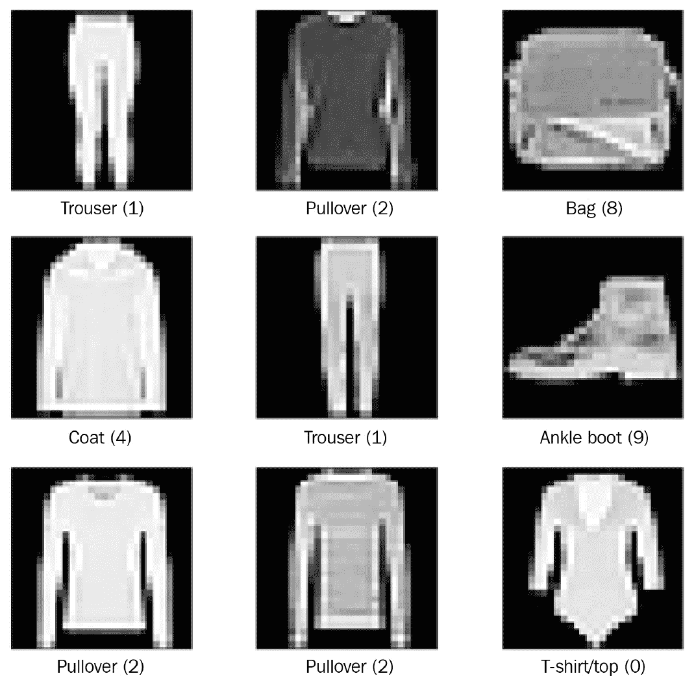

图 3.3 – Fashion-MNIST 数据集的图像示例

### 生成器

生成器的设计可以分为两部分：

+   将 1D 潜在向量转换为 3D 激活图。

+   将激活图的空间分辨率翻倍，直到它与目标图像匹配。

首先要做的是计算上采样阶段的数量。由于图像的形状是 28x28，我们可以使用两个上采样阶段将维度从 7->14->28 增加。

对于简单数据，我们可以在每个上采样阶段使用一个卷积层，但也可以使用更多的层。此方法类似于 CNN，其中有多个卷积层在相同的空间分辨率下工作，然后再进行下采样。

接下来，我们将决定第一个卷积层的通道数。假设我们使用 [512, 256, 128, 1]，其中最后一个通道数是图像通道数。根据这些信息，我们可以得出第一个全连接层的神经元数为 `7 x 7 x 512`。`7x7` 是我们计算出的空间分辨率，`512` 是第一个卷积层的滤波器数量。在全连接层之后，我们将其重塑为 `(7,7,512)`，这样它就可以输入到卷积层。然后，我们只需要定义卷积层的滤波器数量，并添加 batchnorm 和 ReLU，如以下代码所示：

```py
def Generator(self, z_dim): 
        model = tf.keras.Sequential(name='Generator') 
        model.add(layers.Input(shape=[z_dim])) 
        model.add(layers.Dense(7*7*512))        
        model.add(layers.BatchNormalization(momentum=0.9)) 
        model.add(layers.LeakyReLU())
        model.add(layers.Reshape((7,7,512))) 
        model.add(layers.UpSampling2D((2,2), 				    interpolation="bilinear"))
        model.add(layers.Conv2D(256, 3, padding='same')) 
        model.add(layers.BatchNormalization(momentum=0.9)) 
        model.add(layers.LeakyReLU())         
        model.add(layers.UpSampling2D((2,2), 				    interpolation="bilinear"))        
        model.add(layers.Conv2D(128, 3, padding='same')) 
        model.add(layers.LeakyReLU())
        model.add(layers.Conv2D(image_shape[-1], 3,  			padding='same', activation='tanh')) 
    return model     
```

生成器的模型摘要如下：

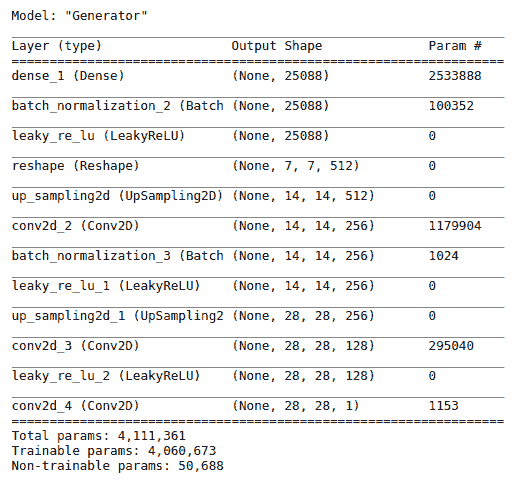

图 3.4 – DCGAN 生成器模型摘要

生成器的模型摘要展示了激活图的形状，这些激活图的空间分辨率在 `(7×7 到 14×14 到 28×28)` 之间翻倍，而通道数在 `(512 到 256 到 128)` 之间减半。

### 判别器

判别器的设计非常简单，就像一个普通的分类器 CNN，但使用了泄漏 ReLU 激活函数。实际上，DCGAN 论文中甚至没有提到判别器的架构。根据经验，判别器的层数应该少于或等于生成器的层数，以免判别器过强，导致生成器无法学习。以下是创建判别器的代码：

```py
def Discriminator(self, input_shape): 
    model = tf.keras.Sequential(name='Discriminator') 
    model.add(layers.Input(shape=input_shape)) 
    model.add(layers.Conv2D(32, 3, strides=(2,2),  					 padding='same'))
    model.add(layers.BatchNormalization(momentum=0.9))
    model.add(layers.ReLU()) 
    model.add(layers.Conv2D(64, 3, strides=(2,2), 					 padding='same')) 
    model.add(layers.BatchNormalization(momentum=0.9)) 
    model.add(layers.ReLU())
    model.add(layers.Flatten()) 
    model.add(layers.Dense(1, activation='sigmoid')) 
    return model
```

判别器的模型摘要是一个简单的 CNN 分类器，摘要如下：

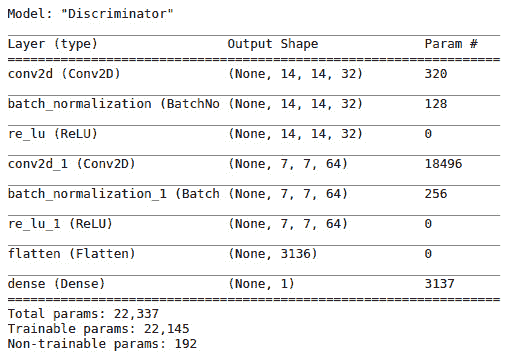

图 3.5 – DCGAN 判别器模型摘要

## 训练我们的 DCGAN

现在我们可以开始训练我们的第一个 GAN。下图展示了在不同训练步骤中生成的样本：

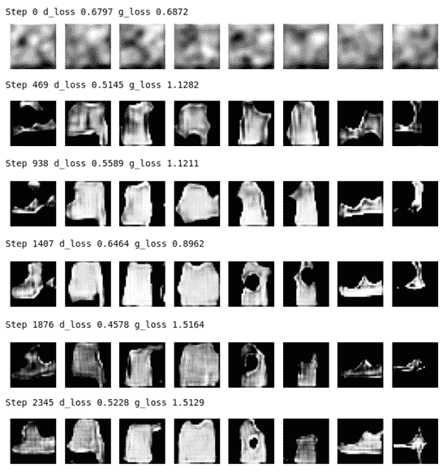

图 3.6 – DCGAN 训练中的生成图像

第一排的样本是在网络权重初始化后、任何训练步骤之前生成的。正如我们所看到的，它们只是一些随机噪声。随着训练的进行，生成的图像变得越来越好。然而，生成器的损失比只生成随机噪声时要高。

损失并不是生成图像质量的绝对度量，它仅提供相对的标准，用于比较生成器相对于判别器的表现，反之亦然。生成器的损失较低，仅仅是因为判别器尚未学会如何执行其任务。这就是 GAN 的一个挑战，损失无法提供足够的信息来衡量模型的质量。

下图展示了训练过程中判别器和生成器的损失：

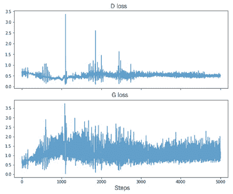

图 3.7 – 判别器和生成器训练损失

我们可以看到，在前 1,000 步中达到了平衡，损失在此之后大致保持稳定。然而，损失并不是判断何时停止训练的决定性指标。现在，我们可以每过几轮保存一次权重，并通过目测选择生成最美观图像的那个！

理论上，当*判别器 = 数据分布*时，判别器达到全局最优。换句话说，如果*数据分布 = 0.5*（一半数据为真实，一半为假数据），那么*判别器 = 0.5*意味着它无法再区分这两类数据，预测结果和掷硬币一样。

# GAN 训练中的挑战

GAN 训练 notoriously 难。我们将讨论训练 GAN 的一些主要挑战。

## 无信息损失与度量标准

在训练 CNN 进行分类或检测任务时，我们可以通过观察损失图形的形状来判断网络是否已经收敛或是否出现过拟合，从而知道何时停止训练。然后，度量指标会与损失相关联。例如，当损失最小的时候，分类准确率通常是最高的。然而，我们无法对 GAN 的损失做同样的处理，因为它没有最小值，而是在训练一段时间后围绕某些常数值波动。我们也不能将生成的图像质量与损失相关联。为了应对这个问题，早期的 GAN 提出了一些度量标准，其中之一就是**启发得分（inception score）**。

使用一个被称为 `ImageNet` 数据集的分类 CNN。如果某个类别的置信度很高，它更可能是真实的图像。还有一个叫做 **Fréchet 启动距离**（Fréchet Inception Distance，FID）的度量，它衡量生成图像的多样性。这些度量通常只在学术论文中使用，用来与其他模型做对比（以便声称他们的模型更优），因此我们在本书中不会详细介绍这些内容。人类的视觉检查仍然是评估生成图像质量的最可靠方式。

## 不稳定性

GAN 对超参数的变化极为敏感，包括学习率和滤波器内核大小。即便在经过大量超参数调优，并且架构正确的情况下，在重新训练模型时，仍然可能发生以下情况：

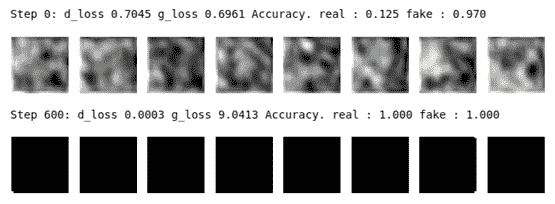

图 3.8 – 生成器陷入局部最小值

如果网络权重不幸地随机初始化为一些不良值，生成器可能会陷入某些不良的局部最小值，并且可能永远无法恢复，而判别器却一直在改进。因此，生成器会放弃，生成的图像仅为无意义的图像。这也被称为**收敛失败**，即损失函数无法收敛。我们需要停止训练，重新初始化网络，并重新开始训练。这也是我没有选择更复杂的数据集，如 CelebA 来介绍 GAN 的原因，但不用担心，我们会在本章结束前解决这个问题。

## 消失梯度

不稳定性的一个原因是生成器的消失梯度。正如我们之前提到的，当我们训练生成器时，梯度会通过判别器流动。如果判别器非常确定图像是假的，那么反向传播到生成器的梯度就会非常小，甚至为零。以下是一些缓解方法：

+   将价值函数从最小化 log *(1-D(G(z)))* 改为最大化 log *D(G(z))*, 这我们已经做过了。实际上，仅此一项仍然不足以解决问题。

+   使用允许更多梯度流动的激活函数，如 leaky ReLU。

+   通过减少判别器的网络容量或增加生成器的训练步骤，来平衡生成器和判别器之间的关系。

+   使用 *单边标签平滑*，将真实图像的标签从 *1* 降低到例如 *0.9*，以减少判别器的置信度。

## 模式崩溃

**模式崩溃**发生在生成器生成的图像彼此相似时。这与收敛失败不同，后者是指 GAN 只生成无意义的图像。

即使生成的图像看起来很好，模式崩溃仍然可能发生，且它会限制在类的小子集（类间模式崩溃）或同一类中的几张相同图像（类内模式崩溃）之间。我们可以通过在一个包含两个高斯分布的混合体上训练 Vanilla GAN 来演示模式崩溃，您可以在`ch3_mode_collapse`笔记本中运行此实验。

下图展示了训练过程中生成样本的形态，呈现出两个高斯块的形状。一个样本是圆形的，另一个是椭圆形的：

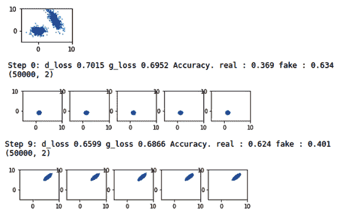

图 3.9 – 上面的图是实际样本，下面的图展示了训练过程中在两个不同周期生成的样本

随着 Vanilla GAN 的训练，生成的样本可能看起来像一个小批次中的两个模式之一，但永远不会是两个模式同时出现。对于 Fashion-MNIST，可能生成器每次都会生成看起来相同的鞋子。毕竟，生成器的目标是生成真实感的图像，只要判别器认为这些图像是真实的，生成器就不会因为每次显示相同的鞋子而受到惩罚。正如原始 GAN 论文中数学证明的那样，当判别器达到了最优时，生成器将朝着优化**Jensen-Shannon 散度**（**JSD**）的方向进行调整。

对于我们的目的，我们只需要知道 JSD 是**Kullback-Leibler 散度**（**KLD**）的对称版本，其上界为*log(2)*，而不是无限大的上界。不幸的是，JSD 也是模式崩溃的原因，如下图所示：


图 3.10 – 通过最小化 KLD、MMD 和 JSD 对从高斯混合分布中抽取的数据进行拟合的标准高斯分布（来源：L. Theis 等，2016 年，《关于生成模型评估的笔记》，https://arxiv.org/abs/1511.01844）

我们不会讨论**最大均值差异**（**MMD**），因为它在 GAN 中并未使用。数据是两个高斯分布，其中一个的质量密度比另一个大。我们对数据进行拟合一个单一的高斯分布。换句话说，我们试图估计一个最佳的均值和标准差来描述这两种类型的高斯分布。通过 KLD，我们可以看到，尽管拟合的高斯分布偏向于较大的高斯块，但它仍然覆盖了较小的高斯块。JSD 则不同，它只拟合最显著的高斯块。这也解释了 GAN 中的模式崩溃——当某些生成图像的概率较高时，这些模式会被优化器*锁定*。

# 构建 Wasserstein GAN

许多人尝试通过使用启发式方法来解决 GAN 训练的不稳定性，例如尝试不同的网络架构、超参数和优化器。2016 年，一个重大突破发生了，那就是引入了**Wasserstein GAN (WGAN)**。

WGAN 减轻甚至消除了我们之前讨论的许多 GAN 挑战。它不再需要精心设计网络架构，也不需要精确平衡判别器和生成器。模式崩溃问题也大大减少。

从原始 GAN 到 WGAN 的最大根本改进是损失函数的变化。理论上，如果两个分布是非交叠的，JSD 将不再是连续的，因此不可微，从而导致梯度为零。WGAN 通过使用一个新的损失函数解决了这个问题，这个损失函数在任何地方都是连续且可微的！

本练习的笔记本是`ch3_wgan_fashion_mnist.ipynb`。

提示

在这一部分，尤其是 WGAN-GP 部分，代码实现可以不学习，因为它更复杂。尽管从理论上来说更为优越，我们仍然可以使用一个更简单的损失函数，通过精心设计的模型架构和超参数稳定地训练 GAN。然而，你应该尝试理解 Lipschitz 约束这个术语，因为它在多个先进技术的发展中起到了重要作用，这些技术将在后续章节中介绍。

## 理解 Wasserstein 损失

让我们回顾一下非饱和值函数：


WGAN 使用一个新的损失函数，称为**地球搬运工距离**或简称 Wasserstein 距离。它衡量将一个分布转换为另一个分布所需的距离或努力。从数学角度来看，它是每个真实图像和生成图像联合分布的最小距离，这是不可计算的，涉及一些超出本书范围的数学假设，值函数变为：


现在，让我们将前面的方程与 NS 损失进行比较，并用它来推导损失函数。最显著的变化是*log()*被去除，另一个变化是虚假图像项的符号发生了变化。因此，第一项的损失函数为：


这是判别器输出的平均值，乘以*-1*。我们还可以通过使用*y*i 作为标签来推广，其中*+1 表示真实图像*，而*-1 表示假图像*。因此，我们可以将 Wasserstein 损失实现为一个 TensorFlow Keras 自定义损失函数，如下所示：

```py
    def wasserstein_loss(self, y_true, y_pred):
        w_loss = -tf.reduce_mean(y_true*y_pred)
        return w_loss
```

由于这个损失函数不再是二元交叉熵，判别器的目标不再是对真实与假图像进行分类或区分。相反，它的目标是最大化真实图像相对于假图像的得分。因此，在 WGAN 中，判别器被赋予了一个新名称——**评论员**。

生成器和鉴别器架构保持不变。唯一的变化是从鉴别器的输出中移除了 S 形函数。因此，评论家的预测是无界的，可以是非常大的正负值。通过实施**1-Lipschitz**约束来检查这一点。

## 实施 1-Lipschitz 约束

在 Wasserstein 损失中提到的数学假设是**1-Lipschitz 函数**。如果评论家*D(x)*满足以下不等式，则称为*1-Lipschitz*：


对于两个图像*x*1 和*x*2，它们的绝对评论家输出差异必须小于或等于它们的平均像素绝对差异。换句话说，评论家的输出不应该因为不同的图像（无论是真实图像还是伪造图像）而有太大的差异。当 WGAN 被发明时，作者们无法想出一个合适的实现来强制不等式。因此，他们想出了一个技巧，即将评论家的权重剪裁到一些小值。通过这样做，层的输出和最终评论家的输出都被限制在一些小值范围内。在 WGAN 论文中，权重被剪裁到*[-0.01, 0.01]*的范围内。

权重修剪可以通过两种方式实现。一种方法是编写一个自定义约束函数，并在实例化新层时使用它，如下所示：

```py
class WeightsClip(tf.keras.constraints.Constraint):
    def __init__(self, min_value=-0.01, max_value=0.01):
        self.min_value = min_value
        self.max_value = max_value
    def __call__(self, w):
        return tf.clip_by_value(w, self.min, 						self.max_value)
```

然后我们可以将函数传递给接受约束函数的层，如下所示：

```py
model = tf.keras.Sequential(name='critics')        
model.add(Conv2D(16, 3, strides=2, padding='same', 
                  kernel_constraint=WeightsClip(),
                  bias_constraint=WeightsClip()))
model.add(BatchNormalization(
 			 beta_constraint=WeightsClip(),
 		 gamma_constraint=WeightsClip()))
```

然而，在每层创建时添加约束代码可能会使代码看起来臃肿。由于我们不需要挑选要剪裁的层，我们可以使用循环来读取权重并剪裁它们，然后再写回如下：

```py
for layer in critic.layers:
    weights = layer.get_weights() 
    weights = [tf.clip_by_value(w, -0.01, 0.01) for  			w in weights]
    layer.set_weights(weights)
```

这是我们在代码示例中使用的方法。

## 重构训练步骤

在原始 GAN 理论中，鉴别器应该在生成器之前被最优化地训练。由于生成器的梯度消失随着鉴别器变得更好而变得不可能实现。现在，通过 Wasserstein 损失函数，梯度在任何地方都是可导的，我们不必担心评论家过于优秀而与生成器比较。

因此，在 WGAN 中，评论家每进行一次生成器训练步骤，就训练五次。为了实现这一点，我们将评论家训练步骤拆分为一个单独的函数，然后可以通过多次循环来执行：

```py
for _ in range(self.n_critic):
    real_images = next(data_generator)
    critic_loss = self.train_critic(real_images, 						    batch_size)
```

我们还需要重新调整生成器训练步骤。在我们的 DCGAN 代码中，我们使用两个模型 - 生成器和鉴别器。为了训练生成器，我们还使用梯度带来更新权重。所有这些都相当繁琐。有另一种方法可以实现生成器的训练步骤，即通过将两个模型合并为一个如下所示：

```py
self.critic = self.build_critic()
self.critic.trainable = False
self.generator = self.build_generator()
critic_output = self.critic(self.generator.output)
self.model = Model(self.generator.input, critic_output)
self.model.compile(loss = self.wasserstein_loss,  			  optimizer = RMSprop(3e-4))
self.critic.trainable = True
```

在前述代码中，我们通过将`trainable=False`冻结评论家层，并将其链到生成器以创建一个新模型并编译它。之后，我们可以再次将评论家设置为可训练，这不会影响我们已经编译的模型。

我们使用 `train_on_batch()` API 执行单次训练步骤，它会自动完成前向传播、损失计算、反向传播和权重更新：

```py
g_loss = self.model.train_on_batch(g_input,  						  real_labels)
```

对于本次练习，我们将图像尺寸调整为 32x32，这样我们就可以在生成器中使用更深的层次来放大图像。WGAN 的生成器和判别器架构如下所示：

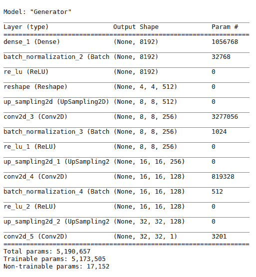

图 3.11 – WGAN 生成器的模型摘要

生成器架构遵循常规设计，随着特征图大小的增大，通道数逐渐减小。以下是 WGAN 判别器的模型摘要：

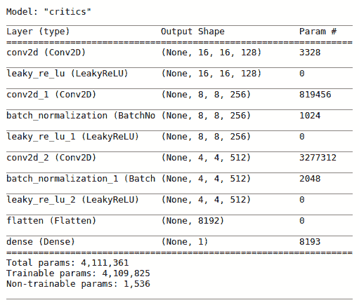

图 3.12 – WGAN 判别器的模型摘要

尽管相较于 DCGAN 有所改进，但我发现训练 WGAN 仍然很困难，而且所生成的图像质量并不优于 DCGAN。接下来我们将实现一种 WGAN 变体，能够更快地训练并生成更清晰的图像。

## 实现梯度惩罚（WGAN-GP）

权重裁剪并不是强制执行 Lipschitz 约束的理想方法，WGAN 的作者也承认了这一点。它有两个缺点：能力未充分利用和梯度爆炸/消失。由于我们限制了权重，也限制了判别器的学习能力。研究发现，权重裁剪迫使网络只能学习简单的函数。因此，神经网络的能力被低效使用。

其次，裁剪值需要仔细调节。如果设置得太高，梯度会爆炸，从而违反 Lipschitz 约束。如果设置得太低，梯度会消失，导致网络回溯时出现问题。另外，权重裁剪会将梯度推向两个极限，具体如下图所示：

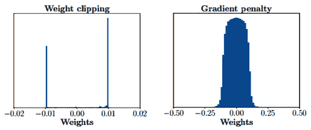

图 3.13 – 左：权重裁剪将权重推向两个值。右：梯度由梯度惩罚产生。来源：I. Gulrajani 等人，2017，改进的 Wasserstein GAN 训练

因此，提出了**梯度惩罚**（**GP**）来替代权重裁剪，以强制执行 Lipschitz 约束，具体如下：


我们将逐个查看方程中的每个变量，并在代码中实现它们。本次练习的 Jupyter 笔记本文件为 `ch3_wgan_gp_fashion_mnist.ipynb`。

我们通常用 *x* 来表示真实图像，但现在方程中有一个 。这个  是在真实图像和假图像之间的逐点插值。图像的比例，或者说 epsilon，是从 *[0,1]* 的均匀分布中抽取的：

```py
epsilon = tf.random.uniform((batch_size,1,1,1))
interpolates = epsilon*real_images + \ 					(1-epsilon)*fake_images
```

有数学证明*“最优评论员包含连接来自 Pr 和 Pg 的配对点的梯度范数为 1 的直线”，* 这是引用自 WGAN-GP 论文 *改进的 Wasserstein GAN 训练方法*（[`arxiv.org/pdf/1704.00028.pdf`](https://arxiv.org/pdf/1704.00028.pdf)）。对于我们的目的，我们可以理解为梯度来自真实和虚假图像的混合，我们不需要分别为真实和虚假图像计算惩罚。

项目  是评论员输出相对于插值的梯度。我们可以再次使用梯度带获取梯度：

```py
with tf.GradientTape() as gradient_tape:
 	gradient_tape.watch(interpolates) 
	critic_interpolates = self.critic(interpolates)
 	gradient_d = gradient_tape.gradient( 						 critic_interpolates,  						 [interpolates])
```

下一步是计算 L2 范数：


我们对每个值进行平方，将它们相加，然后取平方根，如下所示：

```py
grad_loss = tf.square(grad)
grad_loss = tf.reduce_sum(grad_loss, 				    axis=np.arange(1, 						len(grad)loss.shape)))
graid_loss = tf.sqrt(grad_loss)
```

在执行 `tf.reduce_sum()` 时，我们会排除轴上的第一维，因为该维度是批次大小。惩罚的目的是使梯度范数接近 `1`，这是计算梯度损失的最后一步：

```py
grad_loss = tf.reduce_mean(tf.square(grad_loss - 1))
```

方程中的 lambda 是梯度惩罚与其他评论员损失的比率，论文中设定为 10。现在，我们将所有评论员损失和梯度惩罚加起来进行反向传播并更新权重：

```py
total_loss = loss_real + loss_fake + LAMBDA * grad_loss
gradients = total_tape.gradient(total_loss, 						self.critic.variables)
self.optimizer_critic.apply_gradients(zip(gradients, 						self.critic.variables))
```

这就是你需要添加到 WGAN 中以将其转换为 WGAN-GP 的所有内容。不过有两件事需要去掉：

+   权重剪辑

+   评论员中的批量归一化

梯度惩罚是为了惩罚评论员对每个输入的梯度范数。然而，批量归一化会改变梯度的批量统计信息。为了解决这个问题，批量归一化被移除了，并且发现它仍然有效。这已成为 GAN 中的常见做法。

评论员架构与 WGAN 相同，只是去除了批量归一化：

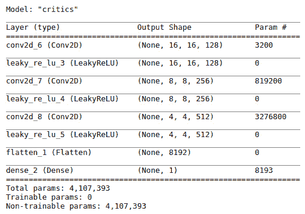

图 3.14 – WGAN-GP 模型总结

以下是经过训练的 WGAN-GP 生成的样本：

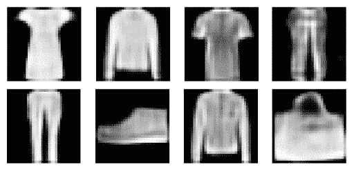

图 3.15 – WGAN-GP 生成的样本

它们看起来非常清晰漂亮，就像来自 Fashion-MNIST 数据集的样本。训练过程非常稳定，且很快收敛！接下来，我们将通过在 CelebA 上进行训练来测试 WGAN-GP！

## 调整 WGAN-GP 以适应 CelebA

我们将对 WGAN-GP 进行一些小的调整，以便在 CelebA 数据集上进行训练。首先，由于我们将使用比之前 32 更大的图像大小 64，因此我们需要添加另一个上采样阶段。然后，我们将批量归一化替换为 **层归一化**，这是 WGAN-GP 作者建议的做法。下图显示了不同类型的归一化，适用于维度为 **(N, H, W, C)** 的张量，其中符号代表批量大小、高度、宽度和通道：


图 3.16 – 深度学习中使用的不同类型的标准化方法。（来源：Y. Wu, K. He, 2018, Group Normalization）

批归一化通过统计计算 **(N, H, W)** 沿每个通道产生一个统计量。相比之下，层归一化计算一个样本内所有张量的统计量，即 **(H, W, C)**，因此不会在样本之间产生相关性，在图像生成中效果更好。它是批归一化的替代方案，其中我们将 *Batch* 替换为 *Layer*：

```py
model.add(layers.BatchNormalization())
model.add(layers.LayerNormalization())
```

此练习的 Jupyter 笔记本是 `ch3_wgan_gp_celeb_a.ipynb`。以下是我们的 WGAN-GP 生成的图像。尽管 WGAN-GP 的训练时间更长，因为需要额外步骤进行梯度惩罚，但训练能够更快地收敛：

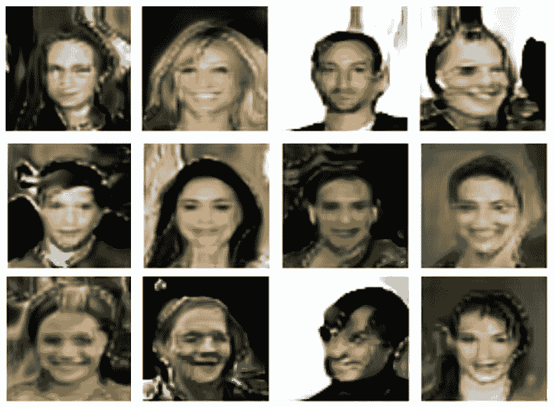

图 3.17 – WGAN-GP 生成的名人面孔

与 VAE 相比，它们看起来并不完美，部分原因是没有重建损失来确保面部特征停留在它们应该在的位置上。尽管如此，这鼓励了 GAN 更具想象力，结果生成了更多种类的面孔。我也没有注意到模式崩溃。WGAN-GP 是实现 GAN 训练稳定性的里程碑。许多后续的 GAN 使用 Wasserstein 损失和梯度惩罚，包括渐进式 GAN，在*第七章**，高保真度人脸生成*中我们将详细讨论。

# 总结

我们在这一章确实学到了很多。我们首先学习了 GAN 的理论和损失函数，以及如何将数学价值函数转化为二元交叉熵损失的代码实现。我们使用卷积层、批归一化层和泄漏 ReLU 实现了 DCGAN，使网络更深入。然而，训练 GAN 仍然面临挑战，包括由于 Jensen-Shannon 散度导致的不稳定性和模式崩溃。

许多这些问题都被 WGAN 与 Wasserstein 距离、权重裁剪以及在评论者输出中去除 Sigmoid 解决了。最后，WGAN-GP 引入了梯度惩罚来正确施加 1-Lipschitz 约束，并为稳定的 GAN 训练提供了框架。然后，我们用层归一化替换了批归一化，在 CelebA 数据集上成功训练，生成了多样的面孔。

这标志着本书第一部分的结束。恭喜你走到了这一步！到现在为止，你已经学习了如何使用不同类型的生成模型来生成图像。这包括了自回归模型如 PixelCNN，在*第一章*中介绍的《使用 TensorFlow 进行图像生成入门》、变分自编码器以及本章中的 GAN。你现在已经熟悉了分布、损失函数的概念，以及如何构建神经网络来进行图像生成。

有了这个坚实的基础，我们将在书的第二部分探索一些有趣的应用，在那里我们还将学习一些高级技术和酷炫的应用。在下一章，我们将学习如何使用 GAN 进行图像到图像的转换。
