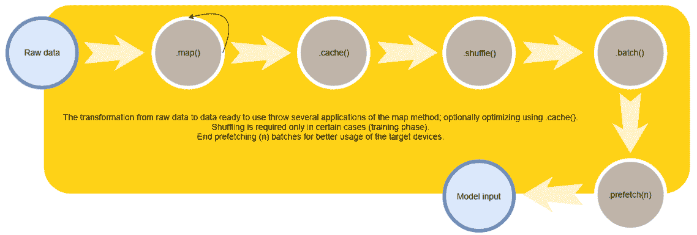
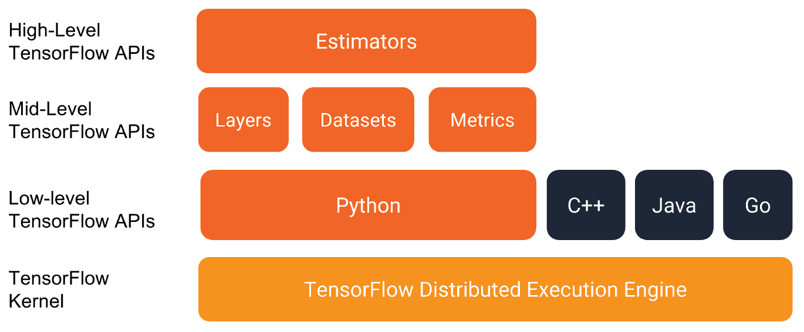
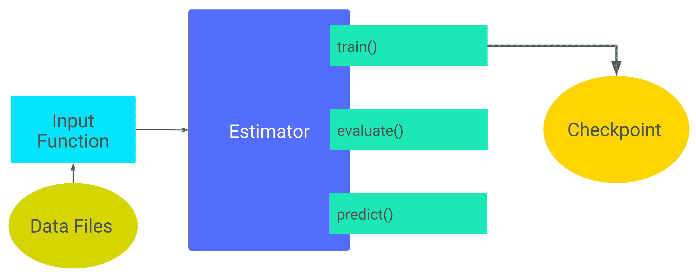
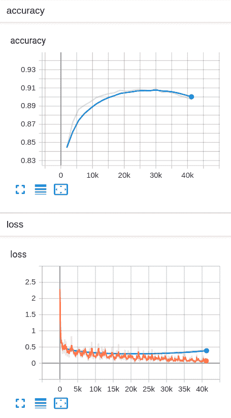

# 高效的数据输入管道和 Estimator API

在本章中，我们将重点介绍 TensorFlow API 中最常用的两个模块：`tf.data` 和 `tf.estimator`。

TensorFlow 1.x 的设计非常优秀，以至于在 TensorFlow 2.0 中几乎没有什么变化；实际上，`tf.data` 和 `tf.estimator` 是 TensorFlow 1.x 生命周期中最早引入的两个高级模块。

`tf.data` 模块是一个高级 API，允许你定义高效的输入管道，而无需担心线程、队列、同步和分布式文件系统。该 API 的设计考虑了简便性，旨在克服以前低级 API 的可用性问题。

`tf.estimator` API 旨在简化和标准化机器学习编程，允许训练、评估、运行推理并导出用于服务的参数化模型，让用户只关注模型和输入定义。

`tf.data` 和 `tf.estimator` APIs 完全兼容，并且强烈建议一起使用。此外，正如我们将在接下来的章节中看到的，每个 Keras 模型、整个即时执行（eager execution）甚至 AutoGraph 都与 `tf.data.Dataset` 对象完全兼容。这种兼容性通过在几行代码中定义和使用高效的数据输入管道，加速了训练和评估阶段。

在本章中，我们将涵盖以下主题：

+   高效的数据输入管道

+   `tf.estimator` API

# 高效的数据输入管道

数据是每个机器学习管道中最关键的部分；模型从数据中学习，它的数量和质量是每个机器学习应用程序的游戏规则改变者。

将数据提供给 Keras 模型到目前为止看起来很自然：我们可以将数据集作为 NumPy 数组获取，创建批次，然后将批次传递给模型，通过小批量梯度下降进行训练。

然而，迄今为止展示的输入方式实际上是极其低效且容易出错，原因如下：

+   完整的数据集可能有数千 GB 大：没有任何单一的标准计算机，甚至是深度学习工作站，都有足够的内存来加载如此庞大的数据集。

+   手动创建输入批次意味着需要手动处理切片索引；这可能会出错。

+   数据增强，给每个输入样本应用随机扰动，会减慢模型训练过程，因为增强过程需要在将数据提供给模型之前完成。并行化这些操作意味着你需要关注线程之间的同步问题以及与并行计算相关的许多常见问题。此外，模板代码的复杂性也增加了。

+   将参数位于 GPU/TPU 上的模型从驻留在 CPU 上的主 Python 进程中提供数据，涉及加载/卸载数据，这是一个可能导致计算不理想的过程：硬件利用率可能低于 100%，这完全是浪费。

TensorFlow 对 Keras API 规范的实现，`tf.keras`，原生支持通过`tf.data` API 馈送模型，建议在使用急切执行（eager execution）、AutoGraph 和估算器 API 时使用它们。

定义输入管道是一个常见的做法，可以将其框架化为 ETL（提取、转换和加载）过程。

# 输入管道结构

定义训练输入管道是一个标准过程；可以将遵循的步骤框架化为**提取、转换和加载**（**ETL**）过程：即将数据从数据源复制到目标系统的过程，以便使用这些数据。

ETL 过程包括以下三个步骤，`tf.data.Dataset`对象可以轻松实现这些步骤：

1.  **提取**：从数据源读取数据。数据源可以是本地的（持久存储，已加载到内存中）或远程的（云存储，远程文件系统）。

1.  **转换**：对数据进行转换，以清理、增强（随机裁剪图像、翻转、颜色失真、添加噪声），使数据能被模型解释。通过对数据进行打乱和批处理，完成转换。

1.  **加载**：将转换后的数据加载到更适合训练需求的设备（如 GPU 或 TPU）中，并执行训练。

这些 ETL 步骤不仅可以在训练阶段执行，还可以在推理阶段执行。

如果训练/推理的目标设备不是 CPU，而是其他设备，`tf.data` API 有效地利用了 CPU，将目标设备保留用于模型的推理/训练；事实上，GPU 或 TPU 等目标设备使得训练参数模型更快，而 CPU 则被大量用于输入数据的顺序处理。

然而，这个过程容易成为整个训练过程的瓶颈，因为目标设备可能以比 CPU 生产数据更快的速度消耗数据。

`tf.data` API 通过其`tf.data.Dataset`类，使我们能够轻松定义数据输入管道，这些管道透明地解决了之前的问题，同时增加了强大的高级特性，使其使用变得更加愉快。需要特别注意性能优化，因为仍然由开发者负责正确定义 ETL 过程，以确保目标设备的 100%使用率，手动去除任何瓶颈。

# tf.data.Dataset 对象

`tf.data.Dataset`对象表示输入管道，作为一组元素，并附带对这些元素进行处理的有序转换集合。

每个元素包含一个或多个`tf.Tensor`对象。例如，对于一个图像分类问题，`tf.data.Dataset`的元素可能是单个训练样本，包含一对张量，分别表示图像及其相关标签。

创建数据集对象有几种方法，具体取决于*数据源*。

根据数据的位置和格式，`tf.data.Dataset` 类提供了许多静态方法，可以轻松创建数据集：

+   **内存中的张量**: `tf.data.Dataset.from_tensors` 或 `tf.data.Dataset.from_tensor_slices`。在这种情况下，张量可以是 NumPy 数组或 `tf.Tensor` 对象。

+   **来自 Python 生成器**: `tf.data.Dataset.from_generator`。

+   **从匹配模式的文件列表中**: `tf.data.Dataset.list_files`。

此外，还有两个专门化的 `tf.data.Dataset` 对象，用于处理两种常用的文件格式：

+   `tf.data.TFRecordDataset` 用于处理 `TFRecord` 文件。

+   `tf.data.TextLineDataset` 用于处理文本文件，逐行读取文件。

`TFRecord` 文件格式的描述在随后的优化部分中给出。

一旦构建了数据集对象，就可以通过链式调用方法将其转换为一个新的 `tf.data.Dataset` 对象。`tf.data` API 广泛使用方法链来自然地表达应用于数据的转换序列。

在 TensorFlow 1.x 中，由于输入管道也是计算图的一个成员，因此需要创建一个迭代器节点。从 2.0 版本开始，`tf.data.Dataset` 对象是可迭代的，这意味着你可以通过 `for` 循环枚举其元素，或使用 `iter` 关键字创建一个 Python 迭代器。

请注意，可迭代并不意味着是一个 Python 迭代器。

你可以通过使用 `for` 循环 `for value in dataset` 来遍历数据集，但不能使用 `next(dataset)` 提取元素。

相反，可以在创建迭代器后，使用 Python 的 `iter` 关键字来使用 `next(iterator)`：

`iterator = iter(dataset)` `value = next(iterator)`。

数据集对象是一个非常灵活的数据结构，它允许创建不仅仅是数字或数字元组的数据集，而是任何 Python 数据结构。如下一个代码片段所示，可以有效地将 Python 字典与 TensorFlow 生成的值混合：

`(tf2)`

```py
dataset = tf.data.Dataset.from_tensor_slices({
    "a": tf.random.uniform([4]),
    "b": tf.random.uniform([4, 100], maxval=100, dtype=tf.int32)
})
for value in dataset:
    # Do something with the dict value
    print(value["a"])
```

`tf.data.Dataset` 对象通过其方法提供的转换集支持任何结构的数据集。

假设我们想要定义一个数据集，它生成无限数量的向量，每个向量有 100 个元素，包含随机值（我们将在专门讨论 GANs 的章节 第九章，*生成对抗网络* 中进行此操作）；使用 `tf.data.Dataset.from_generator`，只需几行代码即可完成：

`(tf2)`

```py
def noise():
    while True:
        yield tf.random.uniform((100,))

dataset = tf.data.Dataset.from_generator(noise, (tf.float32))
```

`from_generator` 方法的唯一特殊之处是需要将参数类型（此处为 `tf.float32`）作为第二个参数传递；这是必需的，因为在构建图时，我们需要提前知道参数的类型。

通过方法链，可以创建新的数据集对象，将刚刚构建的数据集转化为机器学习模型所期望的输入数据。例如，如果我们想在噪声向量的每个元素上加上 10，打乱数据集内容，并创建 32 个向量为一批的批次，只需调用三个方法即可：

`(tf2)`

```py
buffer_size = 10
batch_size = 32
dataset = dataset.map(lambda x: x + 10).shuffle(buffer_size).batch(batch_size)
```

`map`方法是`tf.data.Dataset`对象中最常用的方法，因为它允许我们对输入数据集的每个元素应用一个函数，从而生成一个新的、转化后的数据集。

`shuffle`方法在每个训练管道中都使用，因为它通过一个固定大小的缓冲区随机打乱输入数据集；这意味着，打乱后的数据首先从输入中获取`buffer_size`个元素，然后对其进行打乱并生成输出。

`batch`方法从输入中收集`batch_size`个元素，并创建一个批次作为输出。此转换的唯一限制是批次中的所有元素必须具有相同的形状。

要训练模型，必须将所有训练集的元素输入模型多个周期。`tf.data.Dataset`类提供了`repeat(num_epochs)`方法来实现这一点。

因此，输入数据管道可以总结如下图所示：



该图展示了典型的数据输入管道：通过链式方法调用将原始数据转化为模型可用的数据。预取和缓存是优化建议，接下来的部分会详细讲解。

请注意，直到此时，仍未提及线程、同步或远程文件系统的概念。

所有这些操作都被`tf.data` API 隐藏起来：

+   输入路径（例如，当使用`tf.data.Dataset.list_files`方法时）可以是远程的。TensorFlow 内部使用`tf.io.gfile`包，它是一个没有线程锁定的文件输入/输出封装器。该模块使得可以像读取本地文件系统一样读取远程文件系统。例如，可以通过`gs://bucket/`格式的地址从 Google Cloud Storage 存储桶读取，而无需担心认证、远程请求以及与远程文件系统交互所需的所有样板代码。

+   对数据应用的每个转换操作都高效地利用所有 CPU 资源——与数据集对象一起创建的线程数量等于 CPU 核心数，并在可能进行并行转换时，按顺序和并行方式处理数据。

+   这些线程之间的同步完全由`tf.data` API 管理。

所有通过方法链描述的转换操作都由`tf.data.Dataset`在 CPU 上实例化的线程执行，以自动执行可以并行的操作，从而大大提升性能。

此外，`tf.data.Dataset` 足够高层，以至于将所有线程的执行和同步隐藏起来，但这种自动化的解决方案可能不是最优的：目标设备可能没有完全被使用，用户需要消除瓶颈，以便实现目标设备的 100% 使用。

# 性能优化

到目前为止展示的 `tf.data` API 描述了一个顺序的数据输入管道，该管道通过应用转换将数据从原始格式转变为有用格式。

所有这些操作都在 CPU 上执行，而目标设备（CPU、TPU 或一般来说，消费者）则在等待数据。如果目标设备消耗数据的速度快于生产速度，那么目标设备将会有 0% 的利用率。

在并行编程中，这个问题已经通过预取解决。

# 预取

当消费者在工作时，生产者不应闲置，而应在后台工作，以便生成消费者在下一次迭代中所需的数据。

`tf.data` API 提供了 `prefetch(n)` 方法，通过该方法可以应用一种转换，使得生产者和消费者的工作能够重叠。最佳实践是在输入管道的末尾添加 `prefetch(n)`，以便将 CPU 上执行的转换与目标设备上的计算重叠。

选择 `n` 非常简单：`n` 是训练步骤中消费的元素数量，由于绝大多数模型使用数据批次进行训练，每个训练步骤使用一个批次，因此 `n=1`。

从磁盘读取数据的过程，尤其是在读取大文件、从慢速 HDD 或使用远程文件系统时，可能非常耗时。通常使用缓存来减少这种开销。

# 缓存元素

`cache` 转换可以用来将数据缓存到内存中，完全消除对数据源的访问。当使用远程文件系统或读取过程较慢时，这可以带来巨大好处。仅当数据可以适配到内存中时，才有可能在第一次训练周期后缓存数据。

`cache` 方法在转换管道中起到了屏障的作用：`cache` 方法之前执行的所有操作只会执行一次，因此在管道中放置此转换可以带来巨大的好处。实际上，它可以在计算密集型转换之后或在任何慢速过程之后应用，以加速接下来的所有操作。

# 使用 TFRecords

读取数据是一个时间密集型的过程。通常，数据不能像它在线性存储在磁盘上一样被读取，而是文件必须经过处理和转换才能正确读取。

`TFRecord` 格式是一种二进制和语言无关的格式（使用 `protobuf` 定义），用于存储一系列二进制记录。TensorFlow 允许读取和写入由一系列 `tf.Example` 消息组成的 `TFRecord` 文件。

`tf.Example` 是一种灵活的消息类型，表示一个 `{"key": value}` 映射，其中 `key` 是特征名称，`value` 是其二进制表示。

例如，`tf.Example` 可以是字典（伪代码形式）：

```py
{
    "height": image.height,
    "width": image.widht,
    "depth": image.depth,
    "label": label,
    "image": image.bytes()
}
```

数据集的一行（包括图像、标签及其他附加信息）被序列化为一个示例并存储在 `TFRecord` 文件中，尤其是图像没有采用压缩格式存储，而是直接使用其二进制表示形式。这使得图像可以线性读取，作为字节序列，无需应用任何图像解码算法，从而节省时间（但会占用更多磁盘空间）。

在引入 `tfds`（TensorFlow 数据集）之前，读取和写入 `TFRecord` 文件是一个重复且繁琐的过程，因为我们需要处理如何序列化和反序列化输入特征，以便与 `TFRecord` 二进制格式兼容。TensorFlow 数据集（即构建在 `TFRecord` 文件规范之上的高级 API）标准化了高效数据集创建的过程，强制要求创建任何数据集的 `TFRecord` 表示形式。此外，`tfds` 已经包含了许多正确存储在 `TFRecord` 格式中的现成数据集，其官方指南也完美解释了如何构建数据集，描述其特征，以创建准备使用的 `TFRecord` 表示形式。

由于 `TFRecord` 的描述和使用超出了本书的范围，接下来的章节将仅介绍 TensorFlow 数据集的使用。有关创建 TensorFlow 数据集构建器的完整指南，请参见 第八章，*语义分割和自定义数据集构建器*。如果您对 `TFRecord` 表示形式感兴趣，请参考官方文档：[`www.tensorflow.org/beta/tutorials/load_data/tf_records`](https://www.tensorflow.org/beta/tutorials/load_data/tf_records)。

# 构建数据集

以下示例展示了如何使用 Fashion-MNIST 数据集构建一个 `tf.data.Dataset` 对象。这是一个完整的数据集示例，采用了之前描述的所有最佳实践；请花时间理解为何采用这种方法链式操作，并理解性能优化应用的位置。

在以下代码中，我们定义了 `train_dataset` 函数，该函数返回一个已准备好的 `tf.data.Dataset` 对象：

`(tf2)`

```py
import tensorflow as tf 
from tensorflow.keras.datasets import fashion_mnist 

def train_dataset(batch_size=32, num_epochs=1): 
    (train_x, train_y), (test_x, test_y) = fashion_mnist.load_data()
    input_x, input_y = train_x, train_y 

    def scale_fn(image, label): 
        return (tf.image.convert_image_dtype(image, tf.float32) - 0.5) * 2.0, label 

    dataset = tf.data.Dataset.from_tensor_slices( 
        (tf.expand_dims(input_x, -1), tf.expand_dims(input_y, -1)) 
    ).map(scale_fn) 

    dataset = dataset.cache().repeat(num_epochs)
    dataset = dataset.shuffle(batch_size)

    return dataset.batch(batch_size).prefetch(1)
```

然而，训练数据集应该包含增强的数据，以应对过拟合问题。使用 TensorFlow `tf.image` 包对图像数据进行数据增强非常直接。

# 数据增强

到目前为止定义的 ETL 过程仅转换原始数据，应用的转换不会改变图像内容。而数据增强则需要对原始数据应用有意义的转换，目的是创建更大的数据集，并因此训练一个对这些变化更为鲁棒的模型。

在处理图像时，可以使用 `tf.image` 包提供的完整 API 来增强数据集。增强步骤包括定义一个函数，并通过使用数据集的 `map` 方法将其应用于训练集。

有效的变换集合取决于数据集——例如，如果我们使用的是 MNIST 数据集，那么将输入图像上下翻转就不是一个好主意（没有人希望看到一个标记为 9 的数字 6 图像），但由于我们使用的是 fashion-MNIST 数据集，我们可以随意翻转或旋转输入图像（一条裤子即使被随机翻转或旋转，依然是条裤子）。

`tf.image` 包已经包含了具有随机行为的函数，专为数据增强设计。这些函数以 50%的概率对输入图像应用变换；这是我们期望的行为，因为我们希望向模型输入原始图像和增强图像。因此，可以按如下方式定义一个对输入数据应用有意义变换的函数：

`(tf2)`

```py
def augment(image):
    image = tf.image.random_flip_left_right(image)
    image = tf.image.random_flip_up_down(image)
    image = tf.image.random_brightness(image, max_delta=0.1)
    return image
```

将此增强函数应用于数据集，并使用数据集的 `map` 方法，作为一个练习留给你完成。

尽管借助 `tf.data` API 很容易构建自己的数据集，以便在标准任务（分类、目标检测或语义分割）上对每个新算法进行基准测试，但这一过程可能是重复的，因而容易出错。TensorFlow 开发者与 TensorFlow 开发社区一起，标准化了 ETL 管道的 *提取* 和 *转换* 过程，开发了 TensorFlow Datasets。

TensorFlow 提供的数据增强函数有时不够用，尤其是在处理需要大量变换才能有用的小数据集时。有许多用 Python 编写的数据增强库，可以轻松地集成到数据集增强步骤中。以下是两个最常见的库：

**imgaug**: [`github.com/aleju/imgaug`](https://github.com/aleju/imgaug)

**albumentations**: [`github.com/albu/albumentations`](https://github.com/albu/albumentations)

使用 `tf.py_function` 可以在 `map` 方法中执行 Python 代码，从而利用这些库生成丰富的变换集（这是 `tf.image` 包所没有提供的）。

# TensorFlow Datasets – tfds

TensorFlow Datasets 是一个现成可用的数据集集合，它处理 ETL 过程中的下载和准备阶段，并构建 `tf.data.Dataset` 对象。

这个项目为机器学习从业者带来的显著优势是极大简化了最常用基准数据集的下载和准备工作。

TensorFlow 数据集（`tfds`）不仅下载并将数据集转换为标准格式，还会将数据集本地转换为其`TFRecord`表示形式，使得从磁盘读取非常高效，并为用户提供一个从`TFRecord`中读取并准备好使用的`tf.data.Dataset`对象。该 API 具有构建器的概念***。***每个构建器都是一个可用的数据集。

与`tf.data` API 不同，TensorFlow 数据集作为一个独立的包，需要单独安装。

# 安装

作为一个 Python 包，通过`pip`安装非常简单：

```py
pip install tensorflow-datasets
```

就是这样。该包非常轻量，因为所有数据集仅在需要时下载。

# 使用

该包提供了两个主要方法：`list_builders()`和`load()`：

+   `list_builders()`返回可用数据集的列表。

+   `load(name, split)`接受一个可用构建器的名称和所需的拆分。拆分值取决于构建器，因为每个构建器都有自己的信息。

使用`tfds`加载 MNIST 的训练和测试拆分，在可用构建器的列表中显示如下：

`(tf2)`

```py
import tensorflow_datasets as tfds

# See available datasets
print(tfds.list_builders())
# Construct 2 tf.data.Dataset objects
# The training dataset and the test dataset
ds_train, ds_test = tfds.load(name="mnist", split=["train", "test"])
```

在一行代码中，我们下载、处理并将数据集转换为 TFRecord，并创建两个`tf.data.Dataset`对象来读取它们。

在这一行代码中，我们没有关于数据集本身的任何信息：没有关于返回对象的数据类型、图像和标签的形状等线索。

要获取整个数据集的完整描述，可以使用与数据集相关联的构建器并打印`info`属性；该属性包含所有工作所需的信息，从学术引用到数据格式：

`(tf2)`

```py
builder = tfds.builder("mnist")
print(builder.info)
```

执行它后，我们得到如下结果：

```py
tfds.core.DatasetInfo(
    name='mnist',
    version=1.0.0,
    description='The MNIST database of handwritten digits.',
    urls=['http://yann.lecun.com/exdb/mnist/'],
    features=FeaturesDict({
        'image': Image(shape=(28, 28, 1), dtype=tf.uint8),
        'label': ClassLabel(shape=(), dtype=tf.int64, num_classes=10)
    },
    total_num_examples=70000,
    splits={
        'test': <tfds.core.SplitInfo num_examples=10000>,
        'train': <tfds.core.SplitInfo num_examples=60000>
    },
    supervised_keys=('image', 'label'),
    citation='"""
        @article{lecun2010mnist,
          title={MNIST handwritten digit database},
          author={LeCun, Yann and Cortes, Corinna and Burges, CJ},
          journal={ATT Labs [Online]. Available: http://yann. lecun. com/exdb/mnist},
          volume={2},
          year={2010}
        }

    """',
)
```

这就是我们所需的一切。

强烈推荐使用`tfds`；此外，由于返回的是`tf.data.Dataset`对象，因此无需学习如何使用其他复杂的 API，因为`tf.data` API 是标准的，并且我们可以在 TensorFlow 2.0 中随处使用它。

# Keras 集成

数据集对象原生支持 Keras 的`tf.keras`规范在 TensorFlow 中的实现。这意味着在训练/评估模型时，使用 NumPy 数组或使用`tf.data.Dataset`对象是一样的。使用`tf.keras.Sequential` API 定义的分类模型，在第四章，*TensorFlow 2.0 架构*中，使用之前定义的`train_dataset`函数创建的`tf.data.Dataset`对象训练会更快。

在以下代码中，我们只是使用标准的`.compile`和`.fit`方法调用，来编译（定义训练循环）和拟合数据集（这是一个`tf.data.Dataset`）：

`(tf2)`

```py
model.compile(
    optimizer=tf.keras.optimizers.Adam(1e-5),
    loss='sparse_categorical_crossentropy',
    metrics=['accuracy'])

model.fit(train_dataset(num_epochs=10))
```

TensorFlow 2.0 默认是急切执行的，原生支持遍历`tf.data.Dataset`对象，以构建我们自己的自定义训练循环。

# 急切集成

`tf.data.Dataset` 对象是可迭代的，这意味着可以使用 for 循环枚举其元素，或者使用 `iter` 关键字创建一个 Python 迭代器。请注意，可迭代并不意味着是 Python 迭代器，正如本章开头所指出的那样。

遍历数据集对象是非常简单的：我们可以使用标准的 Python `for` 循环在每次迭代中提取一个批次。

通过使用数据集对象来配置输入管道，比当前使用的解决方案要更好。

手动通过计算索引从数据集中提取元素的过程容易出错且效率低，而 `tf.data.Dataset` 对象经过高度优化。此外，数据集对象与 `tf.function` 完全兼容，因此整个训练循环可以图转换并加速。

此外，代码行数大大减少，提高了可读性。以下代码块表示上一章的图加速（通过 `@tf.function`）自定义训练循环，参见 [第四章](https://cdp.packtpub.com/hands_on_applied_neural_networks_with_tensorflow_2_x/wp-admin/post.php?post=28&action=edit#post_27)，*TensorFlow 2.0 架构*；该循环使用了之前定义的 `train_dataset` 函数：

`(tf2)`

```py
def train():
    # Define the model
    n_classes = 10
    model = make_model(n_classes)

    # Input data
    dataset = train_dataset(num_epochs=10)

    # Training parameters
    loss = tf.losses.SparseCategoricalCrossentropy(from_logits=True)
    step = tf.Variable(1, name="global_step")
    optimizer = tf.optimizers.Adam(1e-3)
    accuracy = tf.metrics.Accuracy()

    # Train step function
    @tf.function
    def train_step(inputs, labels):
        with tf.GradientTape() as tape:
            logits = model(inputs)
            loss_value = loss(labels, logits)

        gradients = tape.gradient(loss_value, model.trainable_variables)
        optimizer.apply_gradients(zip(gradients, model.trainable_variables))
        step.assign_add(1)

        accuracy_value = accuracy(labels, tf.argmax(logits, -1))
        return loss_value, accuracy_value

    @tf.function
    def loop():
        for features, labels in dataset:
            loss_value, accuracy_value = train_step(features, labels)
            if tf.equal(tf.math.mod(step, 10), 0):
                tf.print(step, ": ", loss_value, " - accuracy: ",
                         accuracy_value)

    loop()
```

欢迎仔细阅读源代码，并与上一章的自定义训练循环进行对比，参见 [第四章](https://cdp.packtpub.com/hands_on_applied_neural_networks_with_tensorflow_2_x/wp-admin/post.php?post=28&action=edit#post_27)，*TensorFlow 2.0 架构*。

# Estimator API

在前一节中，我们看到 `tf.data` API 如何简化并标准化输入管道的定义。我们还看到，`tf.data` API 完全整合到了 TensorFlow Keras 实现中，并且能够在自定义训练循环的急切或图加速版本中使用。

就像输入数据管道一样，整个机器学习编程中有很多重复的部分。特别是在定义了第一个版本的机器学习模型后，实践者会关注以下几个方面：

+   训练

+   评估

+   预测

在多次迭代这些步骤之后，将训练好的模型导出以供服务是自然的结果。

当然，定义训练循环、评估过程和预测过程在每个机器学习过程中是非常相似的。例如，对于一个预测模型，我们关心的是训练模型指定次数的 epochs，在过程结束时测量训练集和验证集的某个指标，并重复这个过程，调整超参数直到结果令人满意。

为了简化机器学习编程并帮助开发者专注于过程中的非重复部分，TensorFlow 引入了通过 `tf.estimator` API 的 Estimator 概念。

`tf.estimator` API 是一个高级 API，它封装了机器学习管道中的重复和标准化过程。有关 Estimator 的更多信息，请参见官方文档（[`www.tensorflow.org/guide/estimators`](https://www.tensorflow.org/guide/estimators)）。以下是 Estimator 带来的主要优点：

+   你可以在本地主机或分布式多服务器环境中运行基于 Estimator 的模型，而无需更改模型。此外，你还可以在 CPU、GPU 或 TPU 上运行基于 Estimator 的模型，无需重新编写代码。

+   Estimator 简化了模型开发者之间实现的共享。

+   你可以使用高层次、直观的代码开发最先进的模型。简而言之，通常使用 Estimator 创建模型比使用低级 TensorFlow API 要容易得多。

+   Estimator 本身是建立在`tf.keras.layers`上的，这简化了自定义。

+   Estimator 为你构建图。

+   Estimator 提供了一个安全分布式的训练循环，控制如何以及何时进行：

    +   构建图

    +   初始化变量

    +   加载数据

    +   处理异常

    +   创建检查点文件并从故障中恢复

    +   为 TensorBoard 保存摘要



Estimator API 建立在 TensorFlow 中层层次之上；特别地，Estimator 本身是使用 Keras 层构建的，以简化自定义。图片来源：tensorflow.org

机器学习管道的标准化过程通过一个描述它的类的定义进行：`tf.estimator.Estimator`。

要使用这个类，你需要使用一个由`tf.estimator.Estimator`对象的公共方法强制执行的、定义良好的编程模型，如下图所示：



Estimator 编程模型由 Estimator 对象的公共方法强制执行；API 本身处理检查点保存和重新加载；用户只需实现输入函数和模型本身；训练、评估和预测的标准过程由 API 实现。图片来源：tensorflow.org

使用 Estimator API 有两种不同的方式：构建自定义 Estimator 或使用预制 Estimator。

预制和自定义的 Estimator 遵循相同的编程模型；唯一的区别是，在自定义 Estimator 中，用户必须编写一个`model_fn`模型函数，而在预制 Estimator 中，模型定义是现成的（代价是灵活性较低）。

Estimator API 强制你使用的编程模型包括两个组件的实现：

+   数据输入管道的实现，实现`input_fn`函数

+   （可选）模型的实现，处理训练、评估和预测情况，并实现`model_fn`函数

请注意，文档中提到了**图**（graphs）。事实上，为了保证高性能，Estimator API 是建立在（隐藏的）图表示上的。即使 TensorFlow 2.0 默认使用急切执行（eager execution）范式，`model_fn`和`input_fn`也不会立即执行，Estimator 会在调用这些函数之前切换到图模式，这就是为什么代码必须与图模式执行兼容的原因。

实际上，Estimator API 是将数据与模型分离的良好实践的标准化。这一点通过`tf.estimator.Estimator`对象的构造函数得到了很好的体现，该对象是本章的主题：

```py
__init__(
    model_fn,
    model_dir=None,
    config=None,
    params=None,
    warm_start_from=None
)
```

值得注意的是，在构造函数中并未提到`input_fn`，这也是有道理的，因为输入可以在估算器的生命周期中发生变化，而模型则不能。

让我们来看一下`input_fn`函数应该如何实现。

# 数据输入管道

首先，让我们看看标准的 ETL 过程：

+   **提取**：从数据源读取数据。数据源可以是本地的（持久存储、已经加载到内存中）或远程的（云存储、远程文件系统）。

+   **转换**：对数据应用变换操作，以清洗数据、增强数据（随机裁剪图像、翻转、颜色扭曲、添加噪声），并使数据可以被模型理解。通过打乱数据并进行批处理来结束变换过程。

+   **加载**：将变换后的数据加载到最适合训练需求的设备（GPU 或 TPU）中，并执行训练。

`tf.estimator.Estimator` API 将前两阶段合并在`input_fn`函数的实现中，该函数被传递给`train`和`evaluate`方法。

`input_fn`函数是一个 Python 函数，它返回一个`tf.data.Dataset`对象，该对象生成模型消耗的`features`和`labels`对象，仅此而已。

正如在第一章中提出的理论所知，*什么是机器学习？*，使用数据集的正确方式是将其分为三个不重叠的部分：训练集、验证集和测试集。

为了正确实现这一点，建议定义一个输入函数，该函数接受一个输入参数，能够改变返回的`tf.data.Dataset`对象，并返回一个新的函数作为输入传递给 Estimator 对象。Estimator API 包含了*模式*（mode）的概念。

模型和数据集也可能处于不同的模式，这取决于我们处于管道的哪个阶段。模式通过`enum`类型`tf.estimator.ModeKeys`来实现，该类型包含三个标准键：

+   `TRAIN`：训练模式

+   `EVAL`：评估模式

+   `PREDICT`：推理模式

因此，可以使用`tf.estimator.ModeKeys`输入变量来改变返回的数据集（这一点 Estimator API 并不强制要求，反而很方便）。

假设我们有兴趣为 Fashion-MNIST 数据集的分类模型定义正确的输入管道，我们只需要获取数据，拆分数据集（由于没有提供评估集，我们将测试集分成两半），并构建我们需要的数据集对象。

输入函数的输入签名完全由开发者决定；这种自由度允许我们通过将每个数据集参数作为函数输入来参数化地定义数据集对象：

`(tf2)`

```py
import tensorflow as tf 
from tensorflow.keras.datasets import fashion_mnist 

def get_input_fn(mode, batch_size=32, num_epochs=1): 
    (train_x, train_y), (test_x, test_y) = fashion_mnist.load_data() 
    half = test_x.shape[0] // 2 
    if mode == tf.estimator.ModeKeys.TRAIN: 
        input_x, input_y = train_x, train_y 
        train = True 
    elif mode == tf.estimator.ModeKeys.EVAL: 
        input_x, input_y = test_x[:half], test_y[:half] 
        train = False 
    elif mode == tf.estimator.ModeKeys.PREDICT: 
        input_x, input_y = test_x[half:-1], test_y[half:-1] 
        train = False 
    else: 
        raise ValueError("tf.estimator.ModeKeys required!") 

    def scale_fn(image, label): 
        return ( 
            (tf.image.convert_image_dtype(image, tf.float32) - 0.5) * 2.0, 
            tf.cast(label, tf.int32), 
        ) 

    def input_fn(): 
        dataset = tf.data.Dataset.from_tensor_slices( 
            (tf.expand_dims(input_x, -1), tf.expand_dims(input_y, -1)) 
        ).map(scale_fn) 
        if train: 
            dataset = dataset.shuffle(10).repeat(num_epochs) 
        dataset = dataset.batch(batch_size).prefetch(1) 
        return dataset 

    return input_fn
```

在定义输入函数之后，Estimator API 引入的编程模型为我们提供了两种选择：通过手动定义要训练的模型来创建我们自己的自定义估算器，或者使用所谓的现成（预制）估算器。

# 自定义估算器

现成估算器和自定义估算器共享相同的架构：它们的目标是构建一个`tf.estimator.EstimatorSpec`对象，该对象完整定义了将由`tf.estimator.Estimator`执行的模型；因此，任何`model_fn`的返回值就是 Estimator 规格。

`model_fn`函数遵循以下签名：

```py
model_fn(
    features,
    labels,
    mode = None,
    params = None,
    config = None
)
```

函数参数如下：

+   `features` 是从`input_fn`返回的第一个项目。

+   `labels` 是从`input_fn`返回的第二个项目。

+   `mode` 是一个 `tf.estimator.ModeKeys` 对象，指定模型的状态，是处于训练、评估还是预测阶段。

+   `params` 是一个包含超参数的字典，可以用来轻松调优模型。

+   `config` 是一个`tf.estimator.RunConfig`对象，它允许你配置与运行时执行相关的参数，例如模型参数目录和要使用的分布式节点数量。

请注意，`features`、`labels` 和 `mode` 是`model_fn`定义中最重要的部分，`model_fn`的签名必须使用这些参数名称；否则，会抛出`ValueError`异常。

要求输入签名与模型完全匹配，证明估算器必须在标准场景中使用，在这些场景中，整个机器学习管道可以从这种标准化中获得巨大的加速。

`model_fn`的目标是双重的：它必须使用 Keras 定义模型，并定义在不同`mode`下的行为。指定行为的方式是返回一个正确构建的`tf.estimator.EstimatorSpec`。

由于使用 Estimator API 编写模型函数非常简单，下面是使用 Estimator API 解决分类问题的完整实现。模型定义是纯 Keras 的，所使用的函数是之前定义的`make_model(num_classes)`。

我们邀请你仔细观察当`mode`参数变化时模型行为的变化：

**重要**：虽然 Estimator API 存在于 TensorFlow 2.0 中，但它仍然在图模式下工作。因此，`model_fn` 可以使用 Keras 来构建模型，但训练和摘要日志操作必须使用`tf.compat.v1`兼容模块来定义。

请参阅第三章，*TensorFlow 图架构*，以更好地理解图定义。`(tf2)`

```py
def model_fn(features, labels, mode): 
    v1 = tf.compat.v1 
    model = make_model(10) 
    logits = model(features) 

    if mode == tf.estimator.ModeKeys.PREDICT: 
        # Extract the predictions 
        predictions = v1.argmax(logits, -1) 
        return tf.estimator.EstimatorSpec(mode, predictions=predictions) 

    loss = v1.reduce_mean( 
        v1.nn.sparse_softmax_cross_entropy_with_logits( 
            logits=logits, labels=v1.squeeze(labels) 
        ) 
    ) 

    global_step = v1.train.get_global_step() 

    # Compute evaluation metrics. 
    accuracy = v1.metrics.accuracy( 
        labels=labels, predictions=v1.argmax(logits, -1), name="accuracy" 
    ) 
    # The metrics dictionary is used by the estimator during the evaluation 
    metrics = {"accuracy": accuracy} 

    if mode == tf.estimator.ModeKeys.EVAL: 
        return tf.estimator.EstimatorSpec(mode, loss=loss, eval_metric_ops=metrics) 
    if mode == tf.estimator.ModeKeys.TRAIN: 
        opt = v1.train.AdamOptimizer(1e-4) 
        train_op = opt.minimize( 
            loss, var_list=model.trainable_variables, global_step=global_step 
        ) 

        return tf.estimator.EstimatorSpec(mode, loss=loss, train_op=train_op) 

    raise NotImplementedError(f"Unknown mode {mode}")
```

`model_fn`函数的工作方式与 TensorFlow 1.x 的标准图模型完全相同；整个模型的行为（三种可能的情况）都被编码在该函数中，函数返回的 Estimator 规格中。

训练和评估模型性能需要在每个训练周期结束时编写几行代码：

`(tf2)`

```py
print("Every log is on TensorBoard, please run TensorBoard --logidr log") 
estimator = tf.estimator.Estimator(model_fn, model_dir="log") 
for epoch in range(50): 
    print(f"Training for the {epoch}-th epoch") 
    estimator.train(get_input_fn(tf.estimator.ModeKeys.TRAIN, num_epochs=1)) 
    print("Evaluating...") 
    estimator.evaluate(get_input_fn(tf.estimator.ModeKeys.EVAL))
```

50 个训练周期的循环显示，估计器 API 会自动处理恢复模型参数并在每次`.train`调用结束时保存它们，无需用户干预，完全自动化。

通过运行`TensorBoard --logdir log`，可以查看损失和准确率的趋势。橙色表示训练过程，而蓝色表示验证过程：



TensorBoard 中显示的验证准确率以及训练和验证损失值

编写自定义估计器要求你思考 TensorFlow 图架构，并像在 1.x 版本中一样使用它们。

在 TensorFlow 2.0 中，像 1.x 版本一样，可以使用预制估计器自动定义计算图，这些估计器自动定义`model_fn`函数，而无需考虑图的方式。

# 预制估计器

TensorFlow 2.0 有两种不同类型的预制 Estimator：一种是自动从 Keras 模型定义中创建的，另一种是基于 TensorFlow 1.x API 构建的现成估计器。

# 使用 Keras 模型

在 TensorFlow 2.0 中构建 Estimator 对象的推荐方式是使用 Keras 模型本身。

`tf.keras.estimator`包提供了将`tf.keras.Model`对象自动转换为其 Estimator 对等体所需的所有工具。实际上，当 Keras 模型被编译时，整个训练和评估循环已经定义；因此，`compile`方法几乎定义了一个 Estimator-like 架构，`tf.keras.estimator`包可以使用该架构。

即使使用 Keras，你仍然必须始终定义`tf.estimator.EstimatorSpec`对象，这些对象定义了在训练和评估阶段使用的`input_fn`函数。

无需为这两种情况定义单独的`EstimatorSpec`对象，但可以并建议使用`tf.estimator.TrainSpec`和`tf.estimator.EvalSpec`分别定义模型的行为。

因此，给定通常的`make_model(num_classes)`函数，该函数创建一个 Keras 模型，实际上很容易定义规格并将模型转换为估计器：

`(tf2)`

```py
# Define train & eval specs
train_spec = tf.estimator.TrainSpec(input_fn=get_input_fn(tf.estimator.ModeKeys.TRAIN, num_epochs=50))
eval_spec = tf.estimator.EvalSpec(input_fn=get_input_fn(tf.estimator.ModeKeys.EVAL, num_epochs=1))

# Get the Keras model
model = make_model(10)
# Compile it
model.compile(optimizer='adam',
              loss='sparse_categorical_crossentropy',
              metrics=['accuracy'])

# Convert it to estimator
estimator = tf.keras.estimator.model_to_estimator(
  keras_model = model
)

# Train and evalution loop
tf.estimator.train_and_evaluate(estimator, train_spec, eval_spec)
```

# 使用现成的估计器

模型架构基本上是标准的：卷积神经网络由卷积层和池化层交替组成；全连接神经网络由堆叠的密集层组成，每一层有不同数量的隐藏单元，依此类推。

`tf.estimator`包包含了大量预制的模型，随时可以使用。完整的列表可以在文档中查看：[`www.tensorflow.org/versions/r2.0/api_docs/python/tf/estimator`](https://www.tensorflow.org/versions/r2.0/api_docs/python/tf/estimator).
data2 = tf.data.Dataset.from_generator(lambda: range(100), (tf.int32))

def l1():
    for v in data:
        tf.print(v)
def l2():
    for v in data2:
        tf.print(v)
```

`l1`和`l2`函数可以使用`@tf.function`转换为其图形表示吗？使用`tf.autograph`模块分析生成的代码，以解释答案。

1.  何时应使用`tf.data.Dataset.cache`方法？

1.  使用`tf.io.gfile`包将未压缩的 fashion-MNIST 数据集副本本地存储。

1.  创建一个`tf.data.Dataset`对象，读取上一点中创建的文件；使用`tf.io.gfile`包。

1.  将上一章的完整示例转换为`tf.data`。

1.  将上一章的完整示例转换为`tf.Estimator`。

1.  使用`tfds`加载`"cat_vs_dog"`数据集。查看其构建器信息：这是一个单一分割数据集。使用`tf.data.Dataset.skip`和`tf.data.dataset.take`方法将其分为三个不重叠的部分：训练集、验证集和测试集。将每张图片调整为`32x32x3`，并交换标签。

1.  使用之前创建的三个数据集来定义`input_fn`，当`mode`变化时，选择正确的分割。

1.  使用简单的卷积神经网络定义一个自定义的`model_fn`函数，用于分类猫和狗（标签交换）。在 TensorBoard 上记录结果，并衡量准确率、损失值以及验证集上输出神经元的分布。

1.  使用预设的估算器解决问题 11。是否可以使用一个现成的 Estimator 复现使用自定义`model_fn`函数开发的相同解决方案？

1.  从自定义 Estimator 部分展示的准确率和验证损失曲线中，可以看出模型行为不正常；这种病态情况的名称是什么？如何缓解这种情况？

1.  通过调整`loss`值和/或更改模型架构，尽量减少模型的病态情况（参考前面的问题）。你的解决方案应该至少达到 0.96 的验证准确率。
