# 生成对抗网络

本章将介绍**生成对抗网络**（**GANs**）及对抗训练过程。在第一部分，我们将概述 GAN 框架的理论内容，同时强调对抗训练过程的优势以及使用神经网络作为创建 GAN 的模型所带来的灵活性。理论部分将为你提供一个直观的了解，帮助你理解在对抗训练过程中 GAN 的哪些部分被优化，并展示为什么应使用非饱和值函数，而不是原始的值函数。

接下来，我们将通过一步步实现 GAN 模型及其训练，并用视觉方式解释这个过程中发生的事情。通过观察模型的学习过程，你将熟悉目标分布和学习分布的概念。

本章第二部分将介绍 GAN 框架向条件版本的自然扩展，并展示如何创建条件图像生成器。本章与之前的章节一样，最后将会有一个练习部分，鼓励大家不要跳过。

本章将涵盖以下主题：

+   理解 GAN 及其应用

+   无条件 GAN

+   条件 GAN

# 理解 GAN 及其应用

由*Ian Goodfellow 等人*在 2014 年提出的论文《生成对抗网络》（*Generative Adversarial Networks*）中，GANs 彻底改变了生成模型的领域，为令人惊叹的应用铺平了道路。

GANs 是通过对抗过程估计生成模型的框架，其中两个模型，生成器和判别器，进行同时训练。

生成模型（生成器，Generator）的目标是捕捉训练集中包含的数据分布，而判别模型则充当二分类器。它的目标是估计一个样本来自训练数据的概率，而不是来自生成器。在下面的图示中，展示了对抗训练的总体架构：

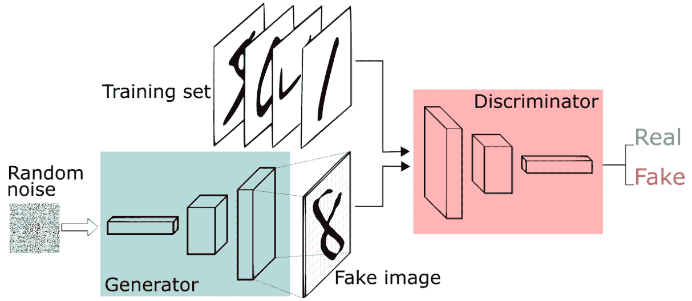

对抗训练过程的图形化表示。生成器的目标是通过学习生成越来越像训练集的样本来欺骗判别器。（图像来源：[`www.freecodecamp.org/news/an-intuitive-introduction-to-generative-adversarial-networks-gans-7a2264a81394/`](https://www.freecodecamp.org/news/an-intuitive-introduction-to-generative-adversarial-networks-gans-7a2264a81394/)—Thalles Silva）

这个想法是训练一个生成模型，而无需明确定义损失函数。相反，我们使用来自另一个网络的信号作为反馈。生成器的目标是愚弄判别器，而判别器的目标是正确分类输入样本是真实的还是虚假的。对抗训练的强大之处在于，生成器和判别器都可以是非线性、参数化的模型，例如神经网络。因此，可以使用梯度下降法来训练它们。

为了学习生成器在数据上的分布，生成器从**先验噪声分布**，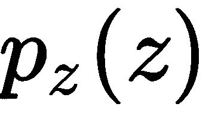，到数据空间的映射，*映射*。

判别器，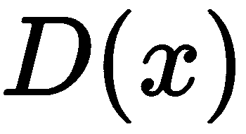，是一个函数（神经网络），其输出一个标量，表示来自真实数据分布的概率，而不是来自。

原始的 GAN 框架通过使用博弈论方法来表达问题，并将其作为一个最小-最大博弈，其中两个玩家——生成器和判别器——相互竞争。

# 价值函数

价值函数是以期望回报的形式表示玩家目标的数学方法。GAN 博弈通过以下价值函数来表示：


这个价值函数表示了两个玩家所进行的博弈，以及他们各自的长期目标。

判别器的目标是正确分类真实和虚假样本，这一目标通过最大化和两项来表示。前者代表正确分类来自真实数据分布的样本（因此，目标是得到），而后者代表正确分类虚假样本（在这种情况下，目标是得到）。

另一方面，生成器的目标是愚弄判别器，它的目标是**最小化**。你可以通过生成与真实样本越来越相似的样本来最小化这一项，从而试图愚弄判别器。

值得注意的一点是，最小-最大博弈仅在价值函数的第二项中进行，因为在第一项中，只有判别器在参与。它通过学习正确分类来自真实数据分布的数据来实现这一点。

尽管这种公式清晰且相当容易理解，但它有一个实际的缺点。在训练的早期阶段，判别器可以通过最大化轻松学会如何正确分类假数据，因为生成的样本与真实样本差异太大。由于从生成样本的质量学习较差，判别器可以以较高的置信度拒绝这些样本，因为它们与训练数据明显不同。这种拒绝表现为将生成样本的正确分类标为假()，使得项饱和。因此，之前的公式可能无法为*G*提供足够的梯度以良好地进行学习。解决这一实际问题的方法是定义一个不饱和的新价值函数。

# 非饱和价值函数

提出的解决方案是训练*G*以**最大化**，而不是最小化。直观地看，我们可以将提出的解决方案视为以不同方式进行相同的最小-最大游戏。

判别器的目标是最大化正确分类真实样本和假样本的概率，与之前的公式没有变化。另一方面，生成器的目标是最小化判别器正确分类生成样本为假的概率，但要通过使判别器将假样本分类为真实的方式显式地欺骗判别器。

同一游戏的价值函数，由两名玩家以不同方式进行游戏，可以表示如下：


如前所述，敌对训练框架的力量来自于*G*和*D*都可以是神经网络，并且它们都可以通过梯度下降进行训练。

# 模型定义和训练阶段

将生成器和判别器定义为神经网络，使我们能够利用多年来开发的所有神经网络架构来解决问题，每种架构都专门用于处理某种数据类型。

模型的定义没有约束；事实上，可以以完全任意的方式定义其架构。唯一的约束是由我们所处理的数据的结构决定的；架构取决于数据类型，所有类型如下：

+   **图像**：卷积神经网络

+   **序列、文本**：递归神经网络

+   **数值、类别值**：全连接网络

一旦我们根据数据类型定义了模型的架构，就可以使用它们来进行最小-最大游戏。

对抗训练包括交替执行训练步骤。每个训练步骤都是一个玩家动作，生成器和判别器交替进行对抗。游戏遵循以下规则：

+   **判别器**：判别器首先进行操作，可以将以下三个步骤重复执行 1 到*k*次，其中*k*是超参数（通常*k*等于 1）：

1.  1.  从噪声分布中采样一个* m *噪声样本的迷你批量，，来自噪声先验的

    1.  从真实数据分布中采样一个* m *样本的迷你批量，，来自真实数据分布的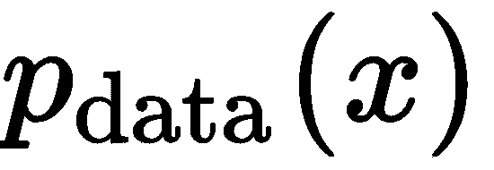

    1.  通过随机梯度上升训练判别器：****

这里，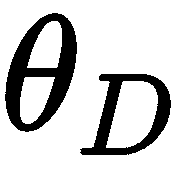是判别器的参数

+   **生成器**：生成器始终在判别器操作之后进行，并且每次仅执行一次：

1.  1.  从噪声分布中采样一个* m *噪声样本的迷你批量，，来自噪声先验的

    1.  通过随机梯度上升训练生成器（这是一个最大化问题，因为游戏的目标是非饱和值函数）：

        

这里，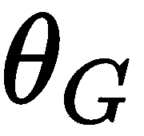是生成器的参数

就像任何通过梯度下降训练的神经网络一样，更新可以使用任何标准优化算法（Adam，SGD，带动量的 SGD 等）。游戏应该持续，直到判别器不再完全被生成器欺骗，也就是说，当判别器对每个输入样本的预测概率总是为 0.5 时。0.5 的值可能听起来很奇怪，但直观地说，这意味着生成器现在能够生成与真实样本相似的样本，而判别器只能做随机猜测。

# GANs 的应用

乍一看，生成模型的效用有限。拥有一个生成与我们已有的（真实样本数据集）相似的模型有什么意义？

在实践中，从数据分布中学习在异常检测领域非常有用，并且在“仅限人类”的领域（如艺术、绘画和音乐生成）中也有重要应用。此外，GANs 在其条件形式中的应用令人惊讶，被广泛用于创造具有巨大市场价值的应用程序（更多信息请参阅本章的*条件 GANs*部分）。

使用 GANs，可以让机器从随机噪声开始生成极其逼真的面孔。以下图像展示了将 GAN 应用于面部生成问题。这些结果来源于论文《*Progressive Growing of GANs for Improved Quality, Stability, and Variation*》（T. Karras 等，2017，NVIDIA）：


这些人并不存在。每一张图片，尽管超逼真，都是通过生成对抗网络（GAN）生成的。你可以亲自尝试，通过访问[`thispersondoesnotexist.com/`](https://thispersondoesnotexist.com/)来体验一下。（图片来源，论文标题为*Progressive Growing of GANs for Improved Quality, Stability, and Variation*）。

在 GAN 出现之前，另一个几乎不可能实现的惊人应用是领域转换，指的是你使用 GAN 从一个领域转换到另一个领域，例如，从素描转换到真实图像，或从鸟瞰图转换为地图。

下图来自论文*Image-to-Image Translation with Conditional Adversarial Networks*（Isola 等，2017），展示了条件 GAN 如何解决几年前被认为不可能完成的任务：

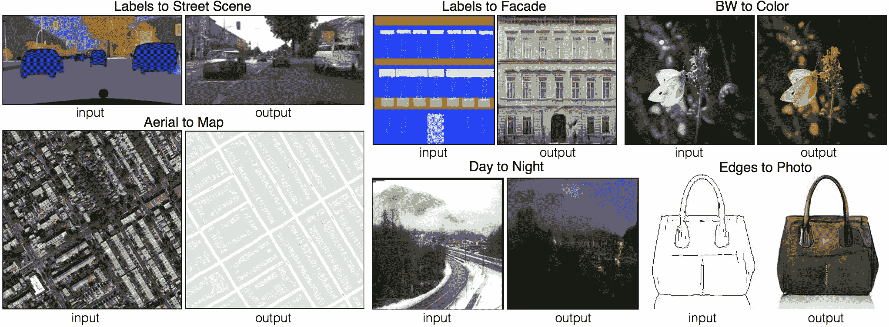

GAN 使得解决领域转换问题成为可能。现在，给黑白图像上色或仅通过素描生成照片变得可行。图片来源：*Image-to-Image Translation with Conditional Adversarial Networks*（Isola 等，2017）。

GAN 的应用令人惊叹，其实际应用也在不断被发现。从下一部分开始，我们将学习如何在纯 TensorFlow 2.0 中实现其中的一些应用。

# 无条件 GAN

看到 GAN 被提到为无条件的并不常见，因为这是默认的原始配置。然而，在本书中，我们决定强调原始 GAN 公式的这一特性，以便让你意识到 GAN 的两大主要分类：

+   无条件 GAN

+   条件 GAN

我们在上一部分描述的生成模型属于无条件 GAN 类别。该生成模型训练的目标是捕捉训练数据分布，并生成从捕捉的分布中随机抽样的样本。条件配置是该框架的略微修改版本，并将在下一部分介绍。

由于 TensorFlow 2.0 的默认即时执行风格，实施对抗训练变得非常简单。实际上，为了实现 Goodfellow 等人论文中描述的对抗训练循环（*Generative Adversarial Networks*），需要逐行按原样实现。当然，创建一个自定义训练循环，特别是需要交替训练两个不同模型的步骤时，最好的方法不是使用 Keras，而是手动实现。

就像任何其他机器学习问题一样，我们必须从数据开始。在这一部分，我们将定义一个生成模型，目的是学习关于以 10 为中心、标准差较小的随机正态数据分布。

# 准备数据

由于本节的目标是学习数据分布，我们将从基础开始，以便建立对对抗训练过程的直觉。最简单且最容易的方式是通过查看随机正态分布来可视化数据分布。因此，我们可以选择一个均值为 10，标准差为 0.1 的高斯（或正态）分布作为我们的目标数据分布：


由于即时执行过程，我们可以使用 TensorFlow 2.0 本身从目标分布中采样一个值。我们通过使用 `tf.random.normal` 函数来做到这一点。以下代码片段展示了一个函数，该函数从目标分布中采样（2000）个数据点：

`(tf2)`

```py
import tensorflow as tf

def sample_dataset():
    dataset_shape = (2000, 1)
    return tf.random.normal(mean=10., shape=dataset_shape, stddev=0.1, dtype=tf.float32)
```

为了更好地理解 GAN 能学到什么，以及在对抗训练过程中发生了什么，我们使用 `matplotlib` 来将数据可视化成直方图：

`(tf2)`

```py
import matplotlib.pyplot as plt

counts, bin, ignored = plt.hist(sample_dataset().numpy(), 100)
axes = plt.gca()
axes.set_xlim([-1,11])
axes.set_ylim([0, 60])
plt.show()
```

这显示了目标分布，如下图所示。如预期的那样，如果标准差较小，直方图将在均值处达到峰值：


目标分布的直方图——从一个均值为 10，标准差为 0.1 的高斯分布中采样的 5000 个数据点

现在我们已经定义了目标数据分布，并且有了一个从中采样的函数（`sample_dataset`），我们准备好定义生成器和判别器网络了。

正如我们在本章开头所述，对抗训练过程的力量在于生成器和判别器都可以是神经网络，并且模型可以使用梯度下降法进行训练。

# 定义生成器

生成器的目标是表现得像目标分布。因此，我们必须将其定义为一个具有单个神经元的网络。我们可以从目标分布中每次采样一个数字，生成器也应该能够做到这一点。

模型架构定义没有明确的指导原则或约束条件。唯一的限制来自于问题的性质，这些限制体现在输入和输出的维度。输出维度，如前所述，取决于目标分布，而输入维度是噪声先验的任意维度，通常设置为 100。

为了解决这个问题，我们将定义一个简单的三层神经网络，包含两个隐藏层，每个层有 64 个神经元：

`(tf2)`

```py
def generator(input_shape):
    """Defines the generator keras.Model.
    Args:
        input_shape: the desired input shape (e.g.: (latent_space_size))
    Returns:
        G: The generator model
    """
    inputs = tf.keras.layers.Input(input_shape)
    net = tf.keras.layers.Dense(units=64, activation=tf.nn.elu, name="fc1")(inputs)
    net = tf.keras.layers.Dense(units=64, activation=tf.nn.elu, name="fc2")(net)
    net = tf.keras.layers.Dense(units=1, name="G")(net)
    G = tf.keras.Model(inputs=inputs, outputs=net)
    return G
```

`generator` 函数返回一个 Keras 模型。虽然只用一个 Sequential 模型也足够，但我们使用了 Keras 函数式 API 来定义该模型。

# 定义判别器

就像生成器一样，判别器的架构依赖于目标分布。目标是将样本分类为两类。因此，输入层依赖于从目标分布中采样的样本的大小；在我们的案例中，它是 1。输出层是一个单独的线性神经元，用于将样本分类为两类。

激活函数是线性的，因为 Keras 的损失函数应用了 sigmoid：

`(tf2)`

```py
def disciminator(input_shape):
    """Defines the Discriminator keras.Model.
    Args:
        input_shape: the desired input shape (e.g.: (the generator output shape))
    Returns:
        D: the Discriminator model
    """
    inputs = tf.keras.layers.Input(input_shape)
    net = tf.keras.layers.Dense(units=32, activation=tf.nn.elu, name="fc1")(inputs)
    net = tf.keras.layers.Dense(units=1, name="D")(net)
    D = tf.keras.Model(inputs=inputs, outputs=net)
    return D
```

定义生成器和判别器架构之后，我们只需通过指定正确的输入形状来实例化 Keras 模型：

`(tf2)`

```py
# Define the real input shape
input_shape = (1,)

# Define the Discriminator model
D = disciminator(input_shape)

# Arbitrary set the shape of the noise prior
latent_space_shape = (100,)
# Define the input noise shape and define the generator
G = generator(latent_space_shape)
```

模型和目标数据分布已经定义；唯一缺少的就是表达它们之间的关系，这通过定义损失函数来完成。

# 定义损失函数

如前所述，判别器的输出是线性的，因为我们将要使用的 `loss` 函数为我们应用了非线性。为了按照原始公式实现对抗训练过程，使用的 `loss` 函数是二进制交叉熵：

`(tf2)`

```py
bce = tf.keras.losses.BinaryCrossentropy(from_logits=True)
```

`bce` 对象用于计算两个分布之间的二进制交叉熵：

+   学到的分布，由判别器的输出表示，通过应用 sigmoid 函数将其压缩到 [0,1] 范围内，因为 `from_logits` 参数被设置为 `True`。如果判别器将输入分类为来自真实数据分布，则该值会接近 1。

+   条件经验分布在类别标签上，即一个离散的概率分布，其中真实样本的概率被标记为 1，其他情况下为 0。

数学上，条件经验分布与生成器输出（压缩到 [0,1]）之间的二进制交叉熵表示如下：


我们希望训练判别器正确分类真实和伪造数据：正确分类真实数据可以看作是最大化 ，而正确分类伪造数据是最大化 。

通过将期望值替换为批次中 *m* 个样本的经验均值，可以将正确分类一个样本的对数概率的最大化表示为两个 BCE 的和：


第一项是标签 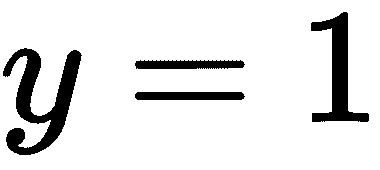 在给定真实样本作为输入时的判别器输出之间的 BCE，而第二项是标签 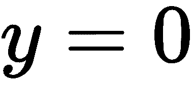 在给定假样本作为输入时的判别器输出之间的 BCE。

在 TensorFlow 中实现这个损失函数非常简单：

`(tf2)`

```py
def d_loss(d_real, d_fake):
    """The disciminator loss function."""
    return bce(tf.ones_like(d_real), d_real) + bce(tf.zeros_like(d_fake), d_fake)
```

我们之前创建的同一 `bce` 对象在 `d_loss` 函数中使用，因为它是一个无状态对象，仅计算其输入之间的二元交叉熵。

请注意，在最大化它们的 `bce` 调用中不需要添加减号；二元交叉熵的数学公式已经包含减号。

生成器损失函数遵循这一理论。仅实施非饱和值函数包括 TensorFlow 实现以下公式：


该公式是生成图像的对数概率与真实图像的分布（标记为 1）之间的二元交叉熵。在实践中，我们希望最大化生成样本的对数概率，更新生成器参数以使判别器将其分类为真实（标签 1）。

TensorFlow 实现非常简单：

`(tf2)`

```py
def g_loss(generated_output):
    """The Generator loss function."""
    return bce(tf.ones_like(generated_output), generated_output)
```

一切都准备好实施对抗训练过程。

# 无条件 GAN 中的对抗训练过程

如我们在本章开头解释的那样，对抗训练过程是我们交替执行判别器和生成器的训练步骤的过程。生成器需要通过判别器计算的值来执行其参数更新，而判别器需要生成的样本（也称为假输入）和真实样本。

TensorFlow 允许我们轻松定义自定义训练循环。特别是 `tf.GradientTape` 对象非常有用，用于计算特定模型的梯度，即使存在两个相互作用的模型。实际上，由于每个 Keras 模型的 `trainable_variables` 属性，可以计算某个函数的梯度，但只针对这些变量。

训练过程与 GAN 论文描述的过程完全相同（*生成对抗网络 - Ian Goodfellow 等人*），由于急切模式。此外，由于这个训练过程可能计算密集（特别是在我们希望捕获的数据分布复杂的大型数据集上），值得使用 `@tf.function` 装饰训练步骤函数，以便通过将其转换为图形加快计算速度：

`(tf2)`

```py
def train():
    # Define the optimizers and the train operations
    optimizer = tf.keras.optimizers.Adam(1e-5)

    @tf.function
    def train_step():
        with tf.GradientTape(persistent=True) as tape:
            real_data = sample_dataset()
            noise_vector = tf.random.normal(
                mean=0, stddev=1,
                shape=(real_data.shape[0], latent_space_shape[0]))
            # Sample from the Generator
            fake_data = G(noise_vector)
            # Compute the D loss
            d_fake_data = D(fake_data)
            d_real_data = D(real_data)
            d_loss_value = d_loss(d_real_data, d_fake_data)
            # Compute the G loss
            g_loss_value = g_loss(d_fake_data)
        # Now that we comptuted the losses we can compute the gradient
        # and optimize the networks
        d_gradients = tape.gradient(d_loss_value, D.trainable_variables)
        g_gradients = tape.gradient(g_loss_value, G.trainable_variables)
        # Deletng the tape, since we defined it as persistent
        # (because we used it twice)
        del tape

        optimizer.apply_gradients(zip(d_gradients, D.trainable_variables))
        optimizer.apply_gradients(zip(g_gradients, G.trainable_variables))
        return real_data, fake_data, g_loss_value, d_loss_value
```

为了可视化生成器在训练过程中学习到的内容，我们绘制了从目标分布中采样的相同图形值（橙色），以及从生成器中采样的值（蓝色）：

`(tf2)`

```py
    fig, ax = plt.subplots()
    for step in range(40000):
        real_data, fake_data,g_loss_value, d_loss_value = train_step()
        if step % 200 == 0:
            print("G loss: ", g_loss_value.numpy(), " D loss: ", d_loss_value.numpy(), " step: ", step)

            # Sample 5000 values from the Generator and draw the histogram
            ax.hist(fake_data.numpy(), 100)
            ax.hist(real_data.numpy(), 100)
            # these are matplotlib.patch.Patch properties
            props = dict(boxstyle='round', facecolor='wheat', alpha=0.5)

            # place a text box in upper left in axes coords
            textstr = f"step={step}"
            ax.text(0.05, 0.95, textstr, transform=ax.transAxes, fontsize=14,
                    verticalalignment='top', bbox=props)

            axes = plt.gca()
            axes.set_xlim([-1,11])
            axes.set_ylim([0, 60])
            display.display(pl.gcf())
            display.clear_output(wait=True)
            plt.gca().clear()
```

现在我们已经将整个训练循环定义为一个函数，可以通过调用 `train()` 来执行它。

`train_step` 函数是整个代码片段中最重要的部分，因为它包含了对抗训练的实现。值得强调的一个特点是，通过使用 `trainable_variables`，我们能够计算损失函数相对于我们感兴趣的模型参数的梯度，同时将其他所有因素保持不变。

第二个特点是使用了持久化的梯度带对象。使用持久化的带对象使我们能够在内存中分配一个单独的对象（即带对象），并且将其使用两次。如果带对象是非持久化创建的，我们就无法重用它，因为它会在第一次 `.gradient` 调用后自动销毁。

我们没有使用 TensorBoard 来可视化数据（这个留给你做练习），而是遵循了到目前为止使用的 matplotlib 方法，并且每 200 步训练从目标分布和学习到的分布中分别采样 5,000 个数据点，然后通过绘制相应的直方图进行可视化。

在训练的初期阶段，学习到的分布与目标分布不同，如下图所示：

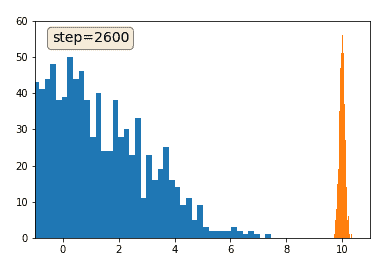

在第 2,600 步训练时的数据可视化。目标分布是均值为 10，标准差为 0.1 的随机正态分布。从学习到的分布中采样的值正在慢慢向目标分布移动。

在训练阶段，我们可以看到生成器如何学习逼近目标分布：

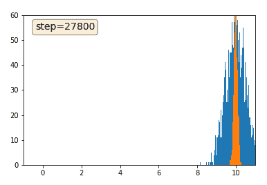

在第 27,800 步训练时的数据可视化。学习到的分布正在接近均值 10，并且正在减少其方差。

在训练的后期阶段，两个分布几乎完全重合，训练过程可以停止：

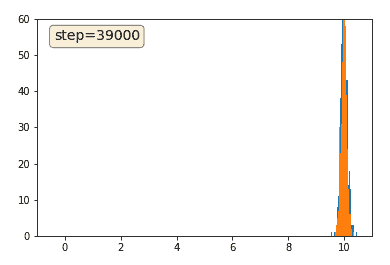

在第 39,000 步训练时的数据可视化。目标分布和学习到的分布重叠。

多亏了 Keras 模型的表达能力和 TensorFlow eager 模式的易用性（加上通过 `tf.function` 进行图转换），定义两个模型并手动实现对抗训练过程几乎变得微不足道。

尽管看似微不足道，这实际上是我们在处理不同数据类型时使用的相同训练循环。事实上，同样的训练循环可以用于训练图像、文本甚至音频生成器，唯一的区别是我们在这些情况下使用不同的生成器和判别器架构。

稍微修改过的 GAN 框架允许你收集条件生成的样本；例如，当给定条件时，生成器被训练生成特定的样本。

# 条件生成对抗网络（Conditional GANs）

Mirza 等人在他们的论文*条件生成对抗网络*中，提出了一种条件版本的 GAN 框架。这个修改非常容易理解，并且是今天广泛应用的惊人 GAN 应用的基础。

一些最令人惊叹的 GAN 应用，例如通过语义标签生成街景，或者给定灰度输入对图像进行上色，作为条件 GAN 思想的专门版本，经过图像超分辨率处理。

条件生成对抗网络基于这样的思想：如果生成器（G）和判别器（D）都根据某些附加信息进行条件化，那么 GAN 就可以扩展为条件模型，*y*。这些附加信息可以是任何形式的附加数据，从类别标签到语义图，或者来自其他模态的数据。通过将附加信息作为额外的输入层同时馈入生成器和判别器，可以实现这种条件化。下面的图示来自*条件生成对抗网络*论文，清楚地展示了生成器和判别器模型如何扩展以支持条件化：

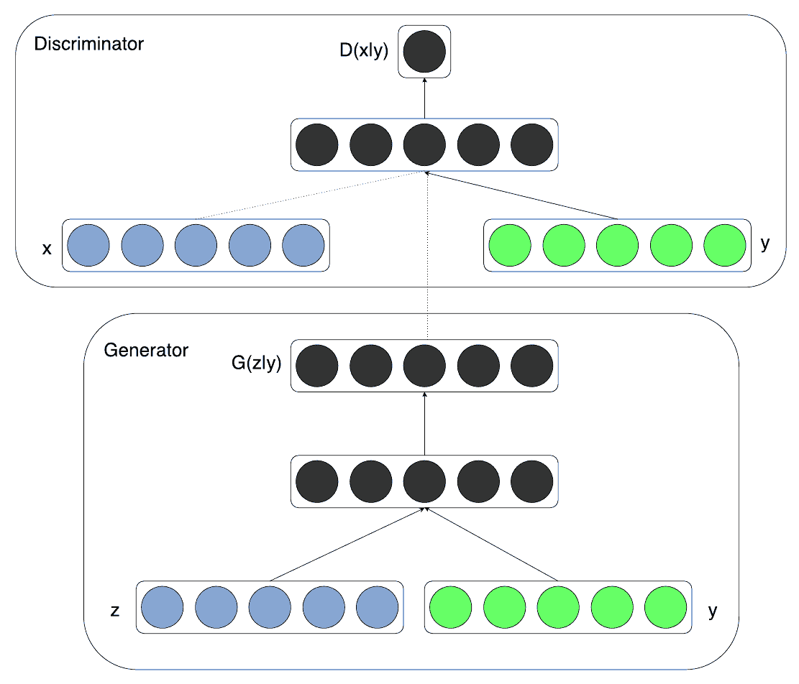

条件生成对抗网络。生成器和判别器有一个附加的输入，y，表示条件化模型的辅助信息（图片来源：*条件生成对抗网络*，Mirza 等，2014）。

生成器架构被扩展为将噪声的联合隐层表示与条件结合。没有关于如何将条件输入生成器网络的限制。你可以简单地将条件与噪声向量连接起来。或者，如果条件比较复杂，可以使用神经网络对其进行编码，并将其输出连接到生成器的某一层。判别器同样也可以采用相同的逻辑。

对模型进行条件化改变了值函数，因为我们从中采样的数据分布现在是条件化的：


在对抗训练过程中没有其他变化，关于非饱和值函数的考虑仍然适用。

在本节中，我们将实现一个条件的 Fashion-MNIST 生成器。

# 获取条件生成对抗网络（GAN）数据

通过使用 TensorFlow 数据集，获取数据非常直接。由于目标是创建一个 Fashion-MNIST 生成器，我们将使用类别标签作为条件。从`tfds.load`调用返回的数据是字典格式。因此，我们需要定义一个函数，将字典映射到一个只包含图像和对应标签的元组。在这个阶段，我们还可以准备整个数据输入管道：

`(tf2)`

```py
import tensorflow as tf
import tensorflow_datasets as tfds
import matplotlib.pyplot as plt

dataset = tfds.load("fashion_mnist", split="train")

def convert(row):
  image = tf.image.convert_image_dtype(row["image"], tf.float32)
  label = tf.cast(row["label"], tf.float32)
  return image, label

batch_size = 32
dataset = dataset.map(convert).batch(batch_size).prefetch(1)
```

# 定义条件生成对抗网络中的生成器

由于我们处理的是图像，天然的选择是使用卷积神经网络。特别是，使用我们在第八章中介绍的反卷积操作，*语义分割和自定义数据集构建器*，可以轻松定义一个类似解码器的网络，从潜在表示和条件开始生成图像：

`(tf2)`

```py
def get_generator(latent_dimension):

  # Condition subnetwork: encode the condition in a hidden representation
  condition = tf.keras.layers.Input((1,))
  net = tf.keras.layers.Dense(32, activation=tf.nn.elu)(condition)
  net = tf.keras.layers.Dense(64, activation=tf.nn.elu)(net)

  # Concatenate the hidden condition representation to noise and upsample
  noise = tf.keras.layers.Input(latent_dimension)
  inputs = tf.keras.layers.Concatenate()([noise, net])

  # Convert inputs from (batch_size, latent_dimension + 1) 
  # To a 4-D tensor, that can be used with convolutions
  inputs = tf.keras.layers.Reshape((1,1, inputs.shape[-1]))(inputs)

  depth = 128
  kernel_size= 5
  net = tf.keras.layers.Conv2DTranspose(
      depth, kernel_size,
      padding="valid",
      strides=1,
      activation=tf.nn.relu)(inputs) # 5x5
  net = tf.keras.layers.Conv2DTranspose(
      depth//2, kernel_size,
      padding="valid",
      strides=2,
      activation=tf.nn.relu)(net) #13x13
  net = tf.keras.layers.Conv2DTranspose(
      depth//4, kernel_size,
      padding="valid",
      strides=2,
      activation=tf.nn.relu,
      use_bias=False)(net) # 29x29
  # Standard convolution with a 2x2 kernel to obtain a 28x28x1 out
  # The output is a sigmoid, since the images are in the [0,1] range
  net = tf.keras.layers.Conv2D(
      1, 2,
      padding="valid",
      strides=1,
      activation=tf.nn.sigmoid,
      use_bias=False)(net)
  model = tf.keras.Model(inputs=[noise, condition], outputs=net)
  return model
```

# 在条件 GAN 中定义判别器

判别器架构很简单。条件化判别器的标准方法是将图像的编码表示与条件的编码表示连接在一起，并将条件放置在一个独特的向量中。这样做需要定义两个子网络——第一个子网络将图像编码为特征向量，第二个子网络将条件编码为另一个向量。以下代码阐明了这个概念：

`(tf2)`

```py
def get_Discriminator():
  # Encoder subnetwork: feature extactor to get a feature vector
  image = tf.keras.layers.Input((28,28,1))
  depth = 32
  kernel_size=3
  net = tf.keras.layers.Conv2D(
      depth, kernel_size,
      padding="same",
      strides=2,
      activation=tf.nn.relu)(image) #14x14x32
  net = tf.keras.layers.Conv2D(
      depth*2, kernel_size,
      padding="same",
      strides=2,
      activation=tf.nn.relu)(net) #7x7x64

  net = tf.keras.layers.Conv2D(
      depth*3, kernel_size,
      padding="same",
      strides=2,
      activation=tf.nn.relu)(net) #4x4x96

  feature_vector = tf.keras.layers.Flatten()(net) # 4*4*96
```

在定义了将图像编码为特征向量的编码子网络后，我们准备创建条件的隐藏表示并将其与特征向量连接起来。这样做后，我们可以创建 Keras 模型并返回它：

`(tf2)`

```py
  # Create a hidden representation of the condition
  condition = tf.keras.layers.Input((1,))
  hidden = tf.keras.layers.Dense(32, activation=tf.nn.elu)(condition)
  hidden = tf.keras.layers.Dense(64, activation=tf.nn.elu)(hidden)

  # Concatenate the feature vector and the hidden label representation
  out = tf.keras.layers.Concatenate()([feature_vector, hidden])

  # Add the final classification layers with a single linear neuron
  out = tf.keras.layers.Dense(128, activation=tf.nn.relu)(out)
  out = tf.keras.layers.Dense(1)(out)

  model = tf.keras.Model(inputs=[image, condition], outputs=out)
  return model
```

# 对抗训练过程

对抗训练过程与我们为无条件 GAN 展示的过程相同。`loss` 函数完全相同：

`(tf2)`

```py
bce = tf.keras.losses.BinaryCrossentropy(from_logits=True)

def d_loss(d_real, d_fake):
    """The disciminator loss function."""
    return bce(tf.ones_like(d_real), d_real) + bce(tf.zeros_like(d_fake), d_fake)

def g_loss(generated_output):
    """The Generator loss function."""
    return bce(tf.ones_like(generated_output), generated_output)
```

唯一的区别是我们的模型现在接受两个输入参数。

在决定噪声的先验维度并实例化 G 和 D 模型之后，定义训练函数需要对之前的训练循环做一些微小的修改。至于无条件 GAN 的训练循环定义，matplotlib 被用来记录图像。改进这个脚本的工作留给你去完成：

`(tf2)`

```py
latent_dimension = 100
G = get_generator(latent_dimension)
D = get_Discriminator()

def train():
    # Define the optimizers and the train operations
    optimizer = tf.keras.optimizers.Adam(1e-5)

    @tf.function
    def train_step(image, label):
        with tf.GradientTape(persistent=True) as tape:
            noise_vector = tf.random.normal(
            mean=0, stddev=1,
            shape=(image.shape[0], latent_dimension))
            # Sample from the Generator
            fake_data = G([noise_vector, label])
            # Compute the D loss
            d_fake_data = D([fake_data, label])
            d_real_data = D([image, label])

            d_loss_value = d_loss(d_real_data, d_fake_data)
            # Compute the G loss
            g_loss_value = g_loss(d_fake_data)
        # Now that we comptuted the losses we can compute the gradient
        # and optimize the networks
        d_gradients = tape.gradient(d_loss_value, D.trainable_variables)
        g_gradients = tape.gradient(g_loss_value, G.trainable_variables)
        # Deletng the tape, since we defined it as persistent
        del tape

        optimizer.apply_gradients(zip(d_gradients, D.trainable_variables))
        optimizer.apply_gradients(zip(g_gradients, G.trainable_variables))
        return g_loss_value, d_loss_value, fake_data[0], label[0]

    epochs = 10
    epochs = 10
    for epoch in range(epochs):
        for image, label in dataset:
            g_loss_value, d_loss_value, generated, condition = train_step(image, label)

        print("epoch ", epoch, "complete")
        print("loss:", g_loss_value, "d_loss: ", d_loss_value)
        print("condition ", info.features['label'].int2str(
                    tf.squeeze(tf.cast(condition, tf.int32)).numpy()))
        plt.imshow(tf.squeeze(generated).numpy(), cmap='gray')
        plt.show()
```

训练循环遍历训练集 10 个周期，并显示一个生成的 Fashion-MNIST 元素图像及其标签。在几个周期后，生成的图像变得越来越逼真，并开始与标签匹配，如下图所示：

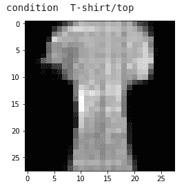

生成的样本将输入随机噪声和条件 T 恤/上衣馈送给生成器。

# 总结

在本章中，我们研究了 GAN 和对抗训练过程。在第一部分中，介绍了对抗训练过程的理论解释，重点讨论了值函数，它用于将问题表述为一个最小-最大博弈。我们还展示了如何通过非饱和值函数，在实践中解决生成器如何解决饱和问题的学习。

我们接着看了如何在纯 TensorFlow 2.0 中实现用于创建无条件 GAN 的生成器和判别器模型。在这一部分，展示了 TensorFlow 2.0 的表达能力以及自定义训练循环的定义。事实上，展示了如何通过遵循 GAN 论文（*生成对抗网络——Ian Goodfellow 等*）中描述的步骤，轻松创建 Keras 模型并编写实现对抗训练过程的自定义训练循环。

Keras 函数式 API 也被广泛使用，其中实现了一个条件生成器，用于生成类似 Fashion-MNIST 的图像。该实现向我们展示了通过使用 Keras 函数式 API，如何将第二个输入（条件）传递给生成器和判别器，并轻松定义灵活的神经网络架构。

GAN 的宇宙在复杂的架构和巧妙的应用创意方面十分丰富。本章旨在解释 GAN 框架，并不声称涵盖所有内容；关于 GAN 的材料足够多，我甚至可以写一本完整的书。

本章以习题部分结束，其中包含一个挑战（问题 16 和 17）：你能创建一个生成真实图像的条件 GAN 吗？从一个语义标签开始？

到目前为止，我们专注于如何训练各种模型，从简单的分类器到生成模型，而不考虑部署阶段。

在下一章，第十章，*将模型投入生产*，将展示每个实际机器学习应用的最后一步——学习模型的部署。

# 习题

尝试回答并解决以下习题，以扩展你从本章中获得的知识：

1.  什么是对抗训练过程？

1.  编写判别器和生成器所进行的极小极大博弈的价值函数。

1.  解释为什么在训练的早期阶段，极小极大价值函数的公式可能会饱和。

1.  编写并解释非饱和价值函数。

1.  编写对抗训练过程的规则。

1.  有没有关于如何向 GAN 传递条件的建议？

1.  创建条件 GAN 意味着什么？

1.  是否只能使用全连接神经网络来创建 GAN？

1.  哪种神经网络架构更适合图像生成问题？

1.  更新无条件 GAN 的代码：在 TensorBoard 上记录生成器和判别器的损失值，同时记录 matplotlib 图表。

1.  无条件 GAN：在每个周期结束时保存模型参数到检查点。添加对模型恢复的支持，可以从最新的检查点重新开始。

1.  通过将无条件 GAN 的代码扩展为条件 GAN，进行修改。给定条件 0 时，生成器必须表现得像正态分布，均值为 10，标准差为 0.1。给定条件 1 时，生成器必须产生一个从均值为 100、标准差为 1 的高斯分布中采样得到的值。

1.  在 TensorBoard 中记录计算得出的梯度幅值，用于更新判别器和生成器。如果梯度幅值的绝对值大于 1，应用梯度裁剪。

1.  对条件 GAN 重复执行第 1 和第 2 个练习。

1.  条件 GAN：不要使用 matplotlib 绘制图像；使用`tf.summary.image`和 TensorBoard。

1.  使用我们在上一章中创建的数据集，第八章，*语义分割和自定义数据集构建器*，创建一个条件 GAN，执行领域转换，从语义标签到图像。

1.  使用 TensorFlow Hub 下载一个预训练的特征提取器，并将其作为构建块，用于创建条件 GAN 的判别器，该 GAN 根据语义标签生成逼真的场景。
