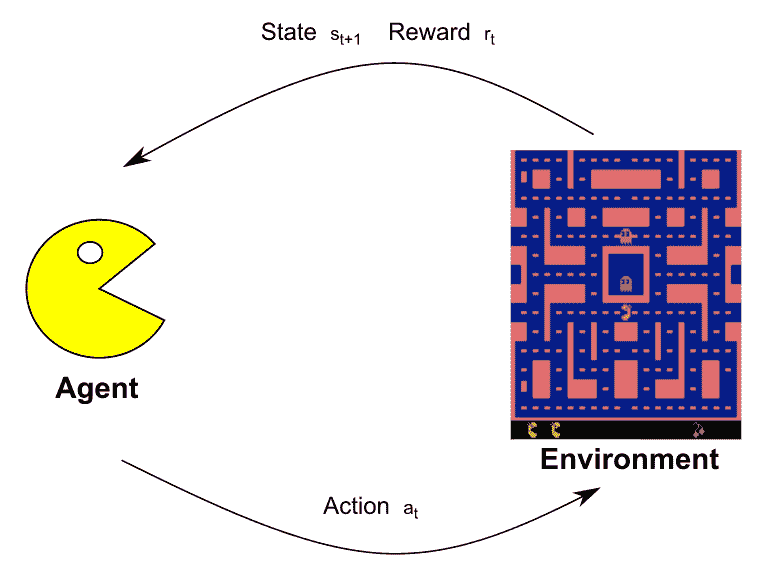
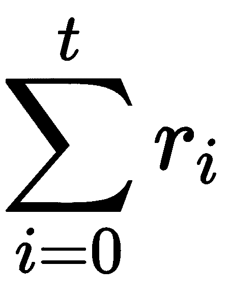
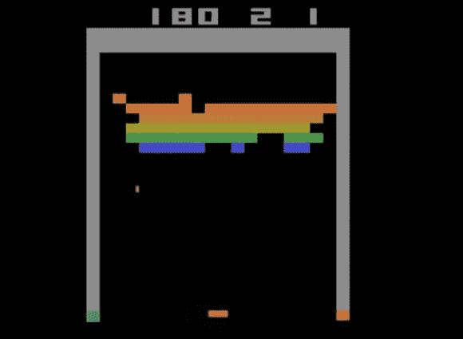
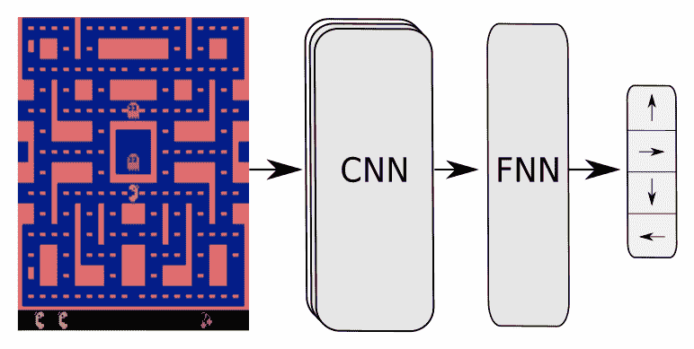
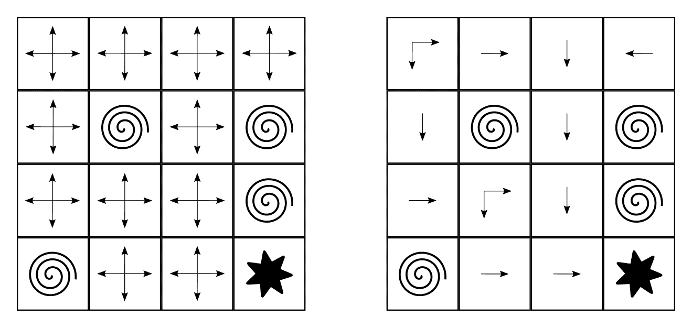
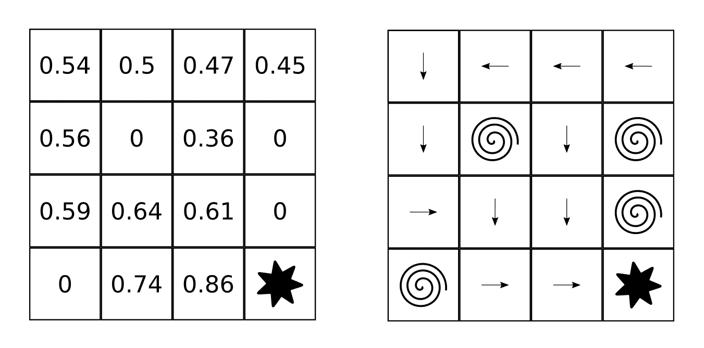
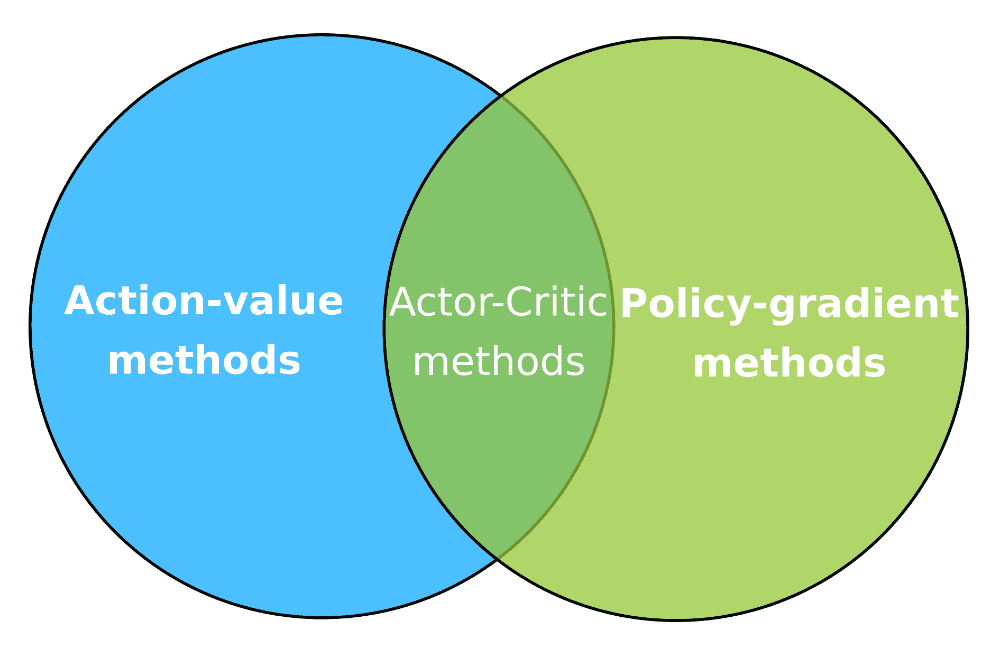

# 强化学习的概览

人类和动物通过试验和错误的过程进行学习。这个过程基于我们的奖励机制，对我们的行为作出反应。这个过程的目标是通过多次重复，激励那些引发正向反应的行为的重复，并减少那些引发负向反应的行为的重复。通过试验和错误的机制，我们学会与周围的人和世界互动，追求复杂而有意义的目标，而不是即时的满足感。

通过互动和经验学习至关重要。试想一下，如果你只能通过观看别人踢足球来学习，结果会怎样？如果你基于这种学习方式去参加一场足球比赛，你可能表现得非常差劲。

这一点在 20 世纪中期得到了验证，特别是理查德·赫尔德和艾伦·海因 1963 年关于两只小猫的研究。两只小猫都在旋转木马上成长。其中一只小猫能够自由活动（主动），而另一只则被限制，只能被动地跟随主动小猫的动作。当两只小猫都被引入光线时，只有能够主动移动的小猫发展出了正常的深度感知和运动技能，而被动的小猫没有。最明显的表现是，被动小猫对接近物体的眨眼反应缺失。这项相当简单的实验表明，无论是否存在视觉剥夺，动物与环境的身体互动对于学习来说是必要的。

受到动物和人类学习方式的启发，**强化学习**（**RL**）围绕从与环境的主动互动中进行试验和错误的理念构建。具体来说，在强化学习中，智能体在与世界互动的过程中逐步学习。通过这种方式，就可以训练计算机以类似人类的方式，尽管较为初级，但仍能学习和行为。

本书完全关于强化学习。本书的目的是通过实践方法，给你提供对这一领域最好的理解。在前几章，你将从学习强化学习的最基本概念开始。随着你掌握这些概念，我们将开始开发我们第一个强化学习算法。随着书本内容的深入，你将创建更强大、更复杂的算法来解决更有趣、更具吸引力的问题。你会看到，强化学习非常广泛，存在许多算法以不同的方式解决各种问题。尽管如此，我们仍会尽力为你提供一个简单但完整的描述，伴随清晰且实用的算法实现。

本章首先让你熟悉强化学习的基本概念，了解不同方法之间的区别，以及策略、价值函数、奖励和环境模型等关键概念。你还将了解强化学习的历史和应用。

本章将涉及以下主题：

+   强化学习简介

+   强化学习的要素

+   强化学习的应用

# 强化学习简介

强化学习（RL）是机器学习的一个领域，处理顺序决策问题，旨在实现预定目标。一个强化学习问题由一个决策者组成，称为**代理（Agent）**，以及代理所互动的物理或虚拟世界，称为**环境（Environment）**。代理通过**动作（Action）**与环境互动，从而产生效果。结果，环境会反馈给代理一个新的**状态（State）**和**奖励（Reward）**。这两个信号是代理采取的动作的后果。特别地，奖励是表示动作好坏的一个值，状态则是代理和环境的当前表现。这个循环在下图中展示：

在此图中，代理通过 PacMan 表示，基于当前环境状态，选择采取哪种行动。它的行为会影响环境，例如它的位置和敌人的位置，这些都将由环境反馈回来，形成新的状态和奖励。这个循环会一直持续，直到游戏结束。

代理的最终目标是最大化整个过程中的总奖励。

它的生命周期。我们简化符号表示：如果  是时间  的动作，且  是时间  的奖励，那么代理将采取  动作，以最大化所有奖励  的总和。

为了最大化累积奖励，代理必须在每种情况下学习最佳行为。为此，代理必须在考虑每一个动作的同时，优化长期目标。在具有许多离散或连续状态和动作的环境中，学习非常困难，因为代理需要对每种情况负责。更为复杂的是，强化学习可能包含非常稀疏和延迟的奖励，令学习过程更加艰难。

举一个强化学习问题的例子，并解释稀疏奖励的复杂性，可以参考著名的故事《汉塞尔与格蕾特》。故事中，父母将两个孩子带入森林准备抛弃他们，但汉塞尔知道父母的意图，于是他在离开家时带上了一片面包，成功地留下了面包屑的踪迹，以便带领他和妹妹找到回家的路。在强化学习框架中，代理人是汉塞尔和格蕾特，环境是森林。每当他们找到一片面包屑时，就能获得+1 的奖励，当他们回到家时，获得+10 的奖励。在这种情况下，面包屑的轨迹越密集，兄妹俩找到回家的路就越容易。这是因为从一片面包屑走到另一片面包屑，他们需要探索的区域更小。不幸的是，在现实世界中，稀疏奖励比密集奖励要普遍得多。

强化学习（RL）的一个重要特点是它能够应对动态、不确定和非确定性的环境。这些特性对于强化学习在现实世界中的应用至关重要。以下几点是如何将现实世界的问题转化为强化学习环境的示例：

+   自动驾驶汽车是一个流行但难以用强化学习来解决的概念。这是因为在驾驶过程中需要考虑许多因素（如行人、其他汽车、自行车和交通信号灯）以及高度不确定的环境。在这种情况下，自动驾驶汽车是代理人，可以操作方向盘、加速器和刹车。环境是它周围的世界。显然，代理人无法意识到周围整个世界的情况，因为它只能通过传感器（例如相机、雷达和 GPS）捕获有限的信息。自动驾驶汽车的目标是以最短的时间到达目的地，同时遵守交通规则，避免损坏任何物品。因此，如果发生负面事件，代理人可能会收到负奖励，而在代理人到达目的地时，可以根据行驶时间获得正奖励。

+   在国际象棋游戏中，目标是将对方的棋子将死。在强化学习框架中，玩家是代理人，环境是棋盘的当前状态。代理人可以根据自己棋子的移动方式来移动棋子。由于某个动作，环境会返回一个与胜负相对应的正面或负面奖励。在其他情况下，奖励为 0，下一个状态是对手移动后的棋盘状态。与自动驾驶汽车的例子不同，这里环境状态等同于代理人状态。换句话说，代理人对环境有着完美的视角。

# 比较强化学习和监督学习

强化学习和**监督学习**是两种相似但不同的数据学习范式。许多问题可以通过监督学习和强化学习来解决；然而，在大多数情况下，它们适用于解决不同的任务。

监督学习通过一个固定的数据集进行泛化学习，数据集由包含示例的数据组成。每个示例由输入和期望的输出（或标签）组成，标签提供了即时的学习反馈。

相比之下，强化学习更加关注在特定情境下可以采取的顺序性动作。在这种情况下，唯一的监督来自奖励信号。在这种情境下，没有像监督学习那样的正确动作可供选择。

强化学习（RL）可以被视为一种更通用、更完整的学习框架。RL 独特的主要特征如下：

+   奖励可能是密集的、稀疏的或非常延迟的。在许多情况下，奖励仅在任务结束时获得（例如，在国际象棋游戏中）。

+   这个问题是顺序性和时间依赖性的；动作会影响下一步动作，而这些动作又会影响可能的奖励和状态。

+   一个智能体必须采取具有更高潜力实现目标的行动（利用），但它也应该尝试不同的行动，确保探索环境的其他部分（探索）。这个问题被称为探索-利用困境（或探索-利用权衡），它管理着在环境的探索与利用之间的平衡。这一点也非常重要，因为与监督学习不同，强化学习可以影响环境，因为它可以自由地收集新的数据，只要它认为这些数据有用。

+   环境是随机的和非确定性的，智能体必须在学习和预测下一步动作时考虑到这一点。事实上，我们将看到，许多强化学习的组件可以设计成输出一个单一的确定性值或一系列值及其概率。

第三种学习类型是**无监督学习**，用于在没有任何监督信息的情况下识别数据中的模式。数据压缩、聚类和生成模型是无监督学习的例子。它也可以在强化学习环境中使用，以便探索并了解环境。无监督学习与强化学习的结合被称为**无监督强化学习**。在这种情况下，没有奖励给出，智能体可能会产生内在动机，偏向于探索新的情境，在这些情境中它们能够探索环境。

值得注意的是，自动驾驶汽车相关的问题也曾被当作监督学习问题来解决，但结果较差。主要问题源于在训练过程中使用的数据与智能体在其生命周期中遇到的数据分布不同。

# 强化学习的历史

强化学习（RL）的第一个数学基础是在 1960 年代和 1970 年代的最优控制领域中建立的。这解决了动态系统随时间变化的行为度量最小化问题。该方法涉及求解一组已知动态系统的方程。在这一时期，**马尔可夫决策过程**（**MDP**）这一关键概念被提出。它为在随机情境中建模决策提供了一个通用框架。在这些年里，一种称为**动态规划**（**DP**）的最优控制求解方法被提出。DP 是一种将复杂问题分解成一系列简单子问题来求解 MDP 的方法。

注意，DP 仅为已知动态系统提供了一种更简单的解决最优控制的方法；其中并不涉及学习。它还存在**维度灾难**的问题，因为计算需求会随着状态数量的增加呈指数增长。

即使这些方法不涉及学习，正如理查德·S·萨顿和安德鲁·G·巴托所指出的，我们仍然必须将最优控制的求解方法，如 DP，也视为强化学习方法。

在 1980 年代，通过时间上连续的预测进行学习的概念——即所谓的**时间差学习**（**TD 学习**）方法——最终被提出。TD 学习引入了一类强大的新算法，这些算法将在本书中进行解释。

使用 TD 学习解决的第一个问题足够小，可以通过表格或数组表示。这些方法被称为**表格方法**，通常作为最优解出现，但不具备可扩展性。事实上，许多强化学习任务涉及庞大的状态空间，使得表格方法无法采用。在这些问题中，使用函数逼近来找到一个近似解，从而减少计算资源的消耗。

在强化学习中采用函数逼近，尤其是人工神经网络（包括深度神经网络），并非易事；然而，正如许多场合所展示的那样，它们能够取得惊人的结果。深度学习在强化学习中的应用被称为**深度强化学习**（**深度 RL**），自从 2015 年深度强化学习算法**深度 Q 网络**（**DQN**）展现出超越人类的能力，在原始图像上玩 Atari 游戏以来，它取得了巨大的普及。深度强化学习的另一个显著成就发生在 2017 年，当时 AlphaGo 成为了第一个击败李世石——这位人类职业围棋选手及 18 届世界冠军——的程序。这些突破不仅表明机器可以在高维空间中表现得比人类更好（在人类对于图像的感知方式上），而且它们还能够以有趣的方式进行行为。例如，在玩 Breakout（一个 Atari 街机游戏，玩家需要摧毁所有砖块）时，深度强化学习系统发现了一个创造性的捷径，系统发现只要在砖块的左侧打通一个隧道，并将球引导到那个方向，就可以摧毁更多砖块，从而通过一次动作提高总体得分。如下图所示：

还有许多其他有趣的案例，其中智能体展示了卓越的行为或策略，这些行为或策略人类之前并未掌握，例如 AlphaGo 在与李世石对弈时所执行的一步棋。从人类角度来看，那一步棋似乎毫无意义，但最终帮助 AlphaGo 获得了胜利（这一步棋被称为**37 号棋**）。

如今，在处理高维状态或动作空间时，深度神经网络作为函数逼近的使用几乎已成为默认选择。深度强化学习已被应用于更具挑战性的问题，例如数据中心能源优化、自动驾驶汽车、多期投资组合优化和机器人技术，仅举几例。

# 深度强化学习（Deep RL）

现在你可能会问自己——为什么深度学习与强化学习结合能表现得如此出色？主要原因是深度学习能够处理具有高维状态空间的问题。在深度强化学习出现之前，状态空间必须分解为更简单的表示，称为**特征**。这些特征很难设计，在某些情况下，只有专家才能做到。现在，使用深度神经网络，如**卷积神经网络**（**CNN**）或**递归神经网络**（**RNN**），强化学习可以直接从原始像素或序列数据（如自然语言）中学习不同层次的抽象。这种配置如下图所示：

此外，深度强化学习问题现在可以完全通过端到端的方式来解决。在深度学习时代之前，强化学习算法涉及两个不同的流程：一个用于处理系统的感知，另一个用于负责决策制定。而现在，借助深度强化学习算法，这些过程已被整合并通过端到端训练，从原始像素直接到行动。例如，如前所示的图表，通过使用卷积神经网络（CNN）处理视觉组件，并通过**全连接神经网络**（**FNN**）将 CNN 的输出转化为行动，可以端到端地训练吃豆人。

如今，深度强化学习是一个非常热门的话题。其主要原因是，深度强化学习被认为是能够让我们构建高度智能机器的技术类型。作为证明，两个致力于解决智能问题的著名人工智能公司——DeepMind 和 OpenAI，正在深入研究强化学习。

除了深度强化学习取得的巨大进展外，仍然有很长的路要走。仍然存在许多需要解决的挑战，部分挑战列举如下：

+   与人类相比，深度强化学习的学习速度过于缓慢。

+   强化学习中的迁移学习仍然是一个未解的难题。

+   奖励函数的设计和定义非常困难。

+   强化学习智能体在诸如物理世界等高度复杂和动态的环境中很难学习。

尽管如此，这一领域的研究正在迅速增长，越来越多的公司开始在他们的产品中采用强化学习。

# 强化学习的元素

如我们所知，智能体通过行动与环境互动。这将导致环境发生变化，并反馈给智能体一个与行动质量和智能体新状态成比例的奖励。通过不断的试验和错误，智能体逐步学会在每种情况下采取最佳行动，从而在长期内获得更大的累积奖励。在强化学习框架中，特定状态下行动的选择由**策略**决定，而从该状态可以获得的累积奖励被称为**价值函数**。简而言之，如果智能体想要实现最优行为，那么在每种情况下，策略必须选择将其带到具有最高价值的下一个状态的行动。现在，让我们深入了解这些基本概念。

# 策略

策略定义了在给定状态下，代理如何选择一个行动。策略选择最大化从该状态开始的累积奖励的行动，而不是选择即时奖励较大的行动。它关注的是代理的长期目标。例如，如果一辆车距离目的地还有 30 公里，但仅剩下 10 公里的续航，而下一个加油站分别在 1 公里和 60 公里远的地方，那么策略将选择在第一个加油站（1 公里远）加油，以避免油量耗尽。这个决定在短期内并不最优，因为加油需要一些时间，但它最终会确保完成目标。

以下图示展示了一个简单的例子，其中一个在 4x4 网格中移动的行为者需要朝着星星移动，同时避免螺旋状的障碍物。策略推荐的行动由指向移动方向的箭头表示。左侧的图示展示了一个随机初始策略，而右侧的图示展示了最终的最优策略。在有两个同样最优的行动情况下，代理可以**任意**选择采取哪一个行动：

一个重要的区别是随机策略和确定性策略之间的差异。在确定性情况下，策略提供了一个确定性的行动。而在随机情况下，策略则为每个行动提供一个概率。行动概率的概念很有用，因为它考虑到了环境的动态性并有助于其探索。

一种对强化学习算法的分类方法是基于策略在学习过程中如何改进。较简单的情况是当作用于环境的策略与在学习过程中改进的策略相似。换句话说，策略从它自己生成的数据中学习。这些算法被称为**on-policy**。相比之下，**off-policy**算法涉及两种策略——一种作用于环境，另一种进行学习但实际上并未被使用。前者称为**行为策略**，后者称为**目标策略**。行为策略的目标是与环境互动并收集信息，以便改进**被动**的目标策略。正如我们将在接下来的章节中看到的那样，off-policy 算法比 on-policy 算法更不稳定且难以设计，但它们更具样本效率，这意味着它们需要更少的经验来学习。

为了更好地理解这两个概念，我们可以想象某人需要学习一项新技能。如果这个人的行为像在策略算法中那样，那么每当他们尝试一系列动作时，他们会根据积累的奖励改变自己的信念和行为。相比之下，如果这个人的行为像是脱离策略的算法，他们（目标策略）也可以通过观看自己以前做同一项技能的老视频（行为策略）来学习——也就是说，他们可以利用旧经验来帮助自己进步。

**策略梯度方法**是一类强化学习算法，它直接从性能相对于策略的梯度中学习一个参数化的策略（如深度神经网络）。这些算法有许多优点，包括能够处理连续动作和以不同粒度探索环境。它们将在第六章 *学习随机优化与 PG 优化*、第七章 *TRPO 与 PPO 实现*以及第八章 *DDPG 与 TD3 应用*中详细介绍。

# 值函数

**值函数**表示一个状态的长期质量。这是代理从某一给定状态开始时，预计在未来获得的累计奖励。如果奖励衡量的是即时表现，则值函数衡量的是长期表现。这意味着高奖励并不一定意味着高值函数，低奖励也不意味着低值函数。

此外，值函数可以是状态的函数，也可以是状态-动作对的函数。前者称为**状态值函数**，后者称为**动作值函数**：

这里，图表显示了最终状态值（左侧）和相应的最优策略（右侧）。

使用与策略概念说明相同的网格世界示例，我们可以展示状态值函数。首先，我们可以假设除了代理到达星星时获得+1 奖励外，在其他情况下奖励为 0。此外，假设强风以 0.33 的概率将代理吹向另一个方向。在这种情况下，状态值将类似于前图左侧所示的状态。最优策略将选择能够将代理带到下一个状态并具有最高状态值的动作，如前图右侧所示。

**动作价值方法**（或价值函数方法）是强化学习算法的另一大类。这些方法通过学习一个动作价值函数并利用它来选择要执行的动作。从第三章 *通过动态规划解决问题* 开始，你将进一步了解这些算法。值得注意的是，一些策略梯度方法为了结合两者的优点，也可以使用一个价值函数来学习合适的策略。这些方法被称为**演员-评论家** **方法**。下图展示了强化学习算法的三大类：

# 奖励

在每个时间步，即每次智能体行动之后，环境会向智能体返回一个数字，表示该动作的好坏。这被称为**奖励**。正如我们已经提到的，智能体的最终目标是最大化在与环境互动过程中获得的累计奖励。

在文献中，奖励被认为是环境的一部分，但实际上这并不完全准确。奖励也可以来自智能体，但永远不会来自决策部分。出于这个原因，并且为了简化公式，奖励总是由环境发送。

奖励是注入到强化学习循环中的唯一监督信号，因此设计正确的奖励机制对于获得行为良好的智能体至关重要。如果奖励存在缺陷，智能体可能会发现并跟随不正确的行为。例如，*海岸赛跑者* 是一款目标是比其他玩家先到达终点的船赛游戏。在比赛过程中，船只会因击中目标而获得奖励。OpenAI 的研究人员曾使用强化学习训练智能体来玩这款游戏。结果他们发现，训练后的船并没有尽可能快地驶向终点，而是绕圈行驶，捕捉重新出现的目标，同时撞击并着火。这样，船只找到了最大化总奖励的方法，但并没有按照预期的方式行动。这种行为源于短期奖励和长期奖励之间的不正确平衡。

奖励的出现频率可能会因环境而异。频繁出现的奖励被称为**密集奖励**；然而，如果奖励仅在游戏过程中出现几次，或只在游戏结束时出现，则称为**稀疏奖励**。在后一种情况下，智能体可能很难捕捉到奖励并找到最优的行动。

**模仿学习**和**逆向强化学习**是两种强大的技术，用于处理环境中缺乏奖励的情况。模仿学习利用专家演示将状态映射到动作上。另一方面，逆向强化学习通过专家的最优行为推导出奖励函数。模仿学习和逆向强化学习将在第十章 *使用 DAgger 算法进行模仿学习* 中进行研究。

# 模型

该模型是代理的一个可选组件，这意味着它不是寻找环境策略所必需的。模型详细描述了环境的行为，给定一个状态和一个动作，预测下一个状态和奖励。如果已知模型，可以使用规划算法与模型进行交互并推荐未来的动作。例如，在具有离散动作的环境中，可以使用前瞻搜索（例如，蒙特卡洛树搜索）来模拟潜在的轨迹。

环境的模型可以提前给定，或者通过与环境的交互来学习。如果环境复杂，使用深度神经网络来近似它是个不错的选择。使用已知环境模型或通过学习来获取模型的强化学习算法被称为**基于模型的方法**。这些解决方案与无模型方法相对，且将在第九章，*基于模型的强化学习*中做更详细的解释。

# 强化学习的应用

强化学习已广泛应用于多个领域，包括机器人技术、金融、医疗保健和智能交通系统。通常，这些应用可以分为三个主要领域——自动化机器（如自动驾驶汽车、智能电网和机器人技术）、优化过程（例如，计划性维护、供应链和流程规划）和控制（例如，故障检测和质量控制）。

最初，强化学习仅应用于简单的问题，但深度强化学习为解决不同问题开辟了道路，使得处理更复杂的任务成为可能。如今，深度强化学习已显示出一些非常有前景的结果。不幸的是，许多突破局限于研究应用或游戏，并且在许多情况下，很难弥合纯粹研究导向的应用和工业问题之间的差距。尽管如此，越来越多的公司正朝着在其行业和产品中采用强化学习的方向发展。

现在我们将看看已经在应用或将受益于强化学习（RL）的主要领域。

# 游戏

游戏是强化学习的一个完美试验场，因为它们是为了挑战人类能力而创建的，并且要完成这些游戏，需要人类大脑常见的技能（如记忆、推理和协调）。因此，一台能够与人类同等甚至更好的计算机必须具备这些相同的特质。此外，游戏容易复现，可以在计算机中轻松模拟。视频游戏因其部分可观察性（即只有一小部分游戏是可见的）和巨大的搜索空间（即计算机不可能模拟所有可能的配置）而被证明是非常难以解决的。

在 2015 年，AlphaGo 在古老的围棋比赛中击败了李世石，突破了游戏领域的一个重要里程碑。这场胜利发生时，许多人曾预测 AlphaGo 不会获胜。当时人们认为，在未来 10 年内，任何计算机都无法击败围棋专家。AlphaGo 利用强化学习和监督学习从人类职业选手的比赛中学习。几年的时间过去了，AlphaGo 的下一个版本——AlphaGo Zero，击败了 AlphaGo 100 局，且一局不败。AlphaGo Zero 通过自我对弈，仅用了三天时间就学会了下围棋。

**自我对弈**是一种非常有效的算法训练方式，因为它只是与自己对弈。通过自我对弈，一些有用的子技能或行为也可能会出现，否则这些技能或行为是无法被发现的。

为了捕捉真实世界的混乱和连续性，一个由五个神经网络组成的团队——OpenAI Five，接受了训练，参与玩*DOTA 2*这款实时战略游戏。该游戏中有两个队伍（每队五名玩家）相互对抗。玩这款游戏的陡峭学习曲线来源于游戏的长时间跨度（每局游戏平均持续 45 分钟，且有成千上万的动作）、部分可观察性（每个玩家只能看到自己周围的一小块区域），以及高维度的连续动作和观察空间。2018 年，OpenAI Five 在《国际邀请赛》上与顶级*DOTA 2*玩家对战，虽然最终输了比赛，但展现出了在协作和战略技能方面的天生能力。最终，在 2019 年 4 月 13 日，OpenAI Five 正式击败了世界冠军，成为第一个在电子竞技游戏中击败职业队伍的人工智能。

# 机器人技术与工业 4.0

强化学习在工业机器人领域是一个非常活跃的研究方向，因为这是现实世界中自然而然会采用的范式。工业智能机器人的潜力和益处巨大且广泛。强化学习推动了工业 4.0（即第四次工业革命），通过智能设备、系统和机器人来执行高度复杂和理性化的操作。能够预测维护、进行实时诊断和管理制造活动的系统可以集成在一起，从而更好地实现控制和提高生产力。

# 机器学习

由于 RL 的灵活性，它不仅可以应用于独立任务，还可以作为一种在监督学习算法中进行微调的方法。在许多**自然语言处理**（**NLP**）和计算机视觉任务中，优化的指标是不可微分的，因此在监督设置中使用神经网络时，需要一个辅助的可微分损失函数。然而，这两个损失函数之间的差异会影响最终的性能。解决这个问题的一种方法是，首先使用监督学习并结合辅助损失函数训练系统，然后利用 RL 对网络进行微调，优化最终的指标。例如，这个过程在机器翻译和问答等子领域中可以发挥作用，因为这些领域的评估指标复杂且不可微分。

此外，RL 还可以解决 NLP 问题，例如对话系统和文本生成。计算机视觉、定位、运动分析、视觉控制和视觉跟踪都可以通过深度 RL 进行训练。

深度学习旨在克服手动特征工程的繁重任务，同时仍然需要手动设计神经网络架构。这是一项繁琐的工作，涉及多个部分，需要以最佳方式进行组合。那么，为什么我们不能自动化这一过程呢？事实上，我们可以。**神经架构设计**（**NAD**）是一种使用强化学习（RL）设计深度神经网络架构的方法。这在计算上非常昂贵，但该技术能够创建能够在图像分类中达到最先进结果的 DNN 架构。

# 经济与金融

商业管理是 RL 的另一种自然应用。它已成功用于互联网广告，目的是最大化按点击付费的广告，用于产品推荐、客户管理和营销。此外，金融领域也从 RL 中获益，应用包括期权定价和多期优化等任务。

# 医疗健康

RL 在医疗健康领域被用于诊断和治疗。它可以为医生和护士构建一个基于 AI 的助手的基础，特别是 RL 可以为患者提供个性化的渐进治疗——这一过程称为动态治疗方案。在医疗健康中的其他 RL 应用包括个性化血糖控制、脓毒症和艾滋病的个性化治疗。

# 智能交通系统

智能交通系统可以借助 RL 来开发和改进各种交通系统。其应用范围包括控制拥堵的智能网络（如交通信号控制）、交通监控和安全（如碰撞预测）到自动驾驶汽车。

# 能源优化与智能电网

能源优化和智能电网对于智能发电、分配和消费电力至关重要。决策能源系统和控制能源系统可以采用强化学习技术，提供对环境变化的动态响应。强化学习还可以用于根据动态电价调整电力需求或减少能源使用。

# 总结

强化学习（RL）是一种以目标为导向的决策方法。与其他范式不同，它直接与环境进行交互，并且具有延迟奖励机制。强化学习与深度学习的结合在具有高维状态空间和感知输入问题中非常有用。策略和价值函数的概念至关重要，因为它们指示了采取的行动以及环境状态的质量。在强化学习中，环境的模型并不是必需的，但它可以提供额外的信息，从而提高策略的质量。

现在，所有关键概念已被介绍，接下来的章节将重点介绍实际的强化学习算法。但首先，在下一章中，你将获得使用 OpenAI 和 TensorFlow 开发强化学习算法的基础知识。

# 问题

+   什么是强化学习（RL）？

+   一个智能体的最终目标是什么？

+   监督学习和强化学习之间的主要区别是什么？

+   结合深度学习和强化学习有什么好处？

+   “强化”一词来源于哪里？

+   策略和价值函数之间有什么区别？

+   通过与环境的互动，是否可以学习到环境的模型？

# 深入阅读

+   有关有缺陷奖励函数的示例，请参阅以下链接：[`blog.openai.com/faulty-reward-functions/`](https://blog.openai.com/faulty-reward-functions/)。

+   有关深度强化学习的更多信息，请参阅以下链接：[`karpathy.github.io/2016/05/31/rl/`](http://karpathy.github.io/2016/05/31/rl/)。
