第一章：

# TensorFlow Enterprise 概览

在本章节的介绍中，您将学习如何在**Google Cloud Platform**（**GCP**）环境中设置和运行 TensorFlow Enterprise。这将帮助您获得一些关于 TensorFlow Enterprise 如何与 GCP 中的其他服务集成的初步实践经验。TensorFlow Enterprise 最重要的改进之一是与 Google Cloud 中的数据存储选项（如 Google Cloud Storage 和 BigQuery）的集成。

本章首先介绍如何完成云环境的一次性设置并启用必要的云服务 API。然后我们将看到如何在大规模下轻松地与这些数据存储系统进行协作。

在本章中，我们将讨论以下主题：

+   了解 TensorFlow Enterprise

+   配置 TensorFlow Enterprise 的云环境

+   访问数据源

# 了解 TensorFlow Enterprise

**TensorFlow** 已经成为一个包含众多有价值资产的生态系统。其受欢迎和多功能的核心在于一个全面的机器学习库和随着新特性和能力迅速发展的模型模板。受欢迎的背后是代价，这个代价表现为复杂性、复杂的依赖关系以及 API 更新或弃用时间表，这些都可能轻易地破坏那些不久前辛苦建立的模型和工作流。学习并在代码中使用最新改进以构建模型来实验您的想法和假设是一回事，但如果您的工作是为长期生产使用、维护和支持构建模型，那又是另外一回事。

与早期的 TensorFlow 相关的另一个问题是代码调试过程。在 TensorFlow 1 中，惰性执行使得测试或调试代码变得相当棘手，因为代码除非被包装在一个*会话*（即图形）中，否则不会执行。从 TensorFlow 2 开始，急切执行（eager execution）终于成为了一个一等公民。另外，TensorFlow 2 的另一个受欢迎的新增功能是采用了 Keras 高级 API。这使得编码、实验和维护模型变得更加容易，同时也提高了代码的可读性及训练流程。

对于企业采用来说，通常有三个主要的挑战需要关注：

+   第一个挑战是 **规模**。生产级模型必须使用大量数据进行训练，通常将其适配到单节点计算机的内存中并不现实或可能。这也可以被看作是另一个问题：如何将训练数据传递给模型？看起来，自然和本能的做法是声明并使用整个数据集作为类似 Python 结构的 **NumPy 数组** 或 **pandas DataFrame**，就像我们在许多开源示例中看到的那样。但如果数据量过大，那么使用另一种方式将数据传入模型实例似乎是合理的，这类似于 Python 迭代器。实际上，**TensorFlow.io** 和 **TensorFlow 数据集库** 专门为了解决这个问题。我们将在后续章节中看到它们如何将数据批量传递给模型训练过程。

+   第二个挑战通常是在考虑企业采用 TensorFlow 时出现的 **可管理性** 问题。TensorFlow 的向后兼容性不是其强项，因为 API 会非常快速地更新和发布新版本，从而替代或淘汰旧版本。这包括但不限于库版本、API 签名和使用风格的弃用。正如你现在可以想象的，这对于开发、调试和维护代码库来说是一个致命问题；它也不利于管理生产环境的稳定性和可复现性，以及其评分结果。这对于管理和控制机器学习开发基础设施以及企业项目中的标准实践的人来说，很容易变成一场噩梦。

+   第三个挑战是 API 改进、补丁发布和 bug 修复的工作。为了解决这个问题，TensorFlow 将这些工作纳入了 **长期支持**。通常，对于任何 TensorFlow 发布版本，Google 的 TensorFlow 团队承诺仅提供最多一年的修复。然而，对于企业来说，这对于他们从开发周期中获得适当的投资回报来说太短。因此，对于企业的关键任务性能，TensorFlow 发布的长期承诺是至关重要的。

**TensorFlow Enterprise** 是为了解决这些挑战而创建的。TensorFlow Enterprise 是 TensorFlow 的一个特殊发行版，仅通过 Google Cloud 的各项服务提供。TensorFlow Enterprise 可以通过以下方式获得：

+   Google Cloud AI Notebooks

+   Google Cloud AI 深度学习虚拟机

+   Google Cloud AI 深度学习容器

+   部分可用于 Google Cloud AI 训练

依赖项，如驱动程序和库版本兼容性，由 Google Cloud 管理。它还提供与其他 Google Cloud 服务（如 Cloud Storage 和数据仓库（**BigQuery**））的优化连接。目前，TensorFlow Enterprise 支持 Google Cloud 的版本 1.15、2.1 和 2.3，GCP 和 TensorFlow 团队将为其提供最长三年的长期支持，包括错误修复和更新。

除了这些独占服务和托管功能外，TensorFlow 团队还通过提供**白手套服务**将企业支持提升到另一个层次。这是与 Google Cloud Support 独立的服务。在这种情况下，Google 的 TensorFlow 工程师将与合格的企业客户合作，解决问题或提供前沿 AI 应用中的错误修复。

## TensorFlow Enterprise 包

在撰写本书时，TensorFlow Enterprise 包括以下几个包：

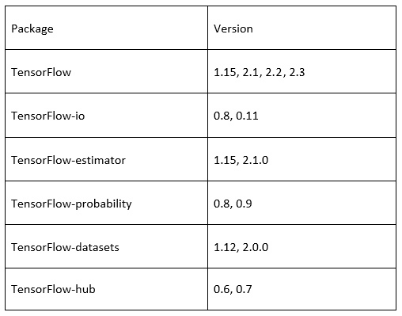

图 1.1 – TensorFlow 包

我们将在*第二章*，*在 Google AI Platform 上运行 TensorFlow Enterprise* 中详细讲解如何启动 JupyterLab，但目前作为演示，可以在 **JupyterLab** 单元格中执行以下命令作为 CLI 命令。它将提供您实例中每个包的版本信息，确保版本一致性：

```py
!pip list | grep tensorflow
```

这是输出结果：

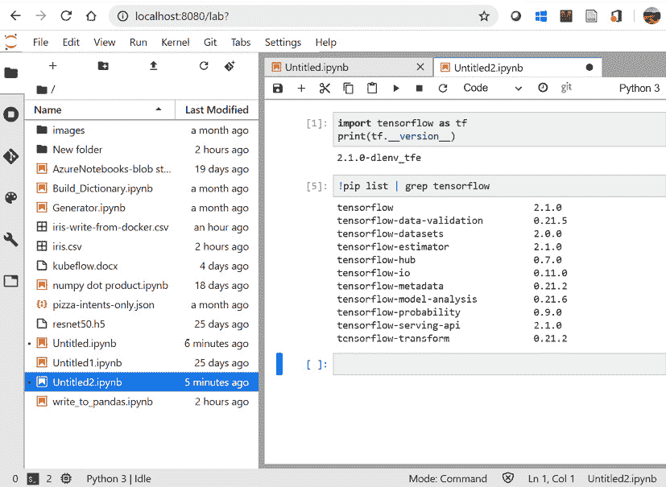

图 1.2 – Google Cloud AI Platform JupyterLab 环境

我们确认环境正在运行 TensorFlow Enterprise 发行版及所有库版本。了解这些信息有助于今后的调试和协作工作。

# 配置 TensorFlow Enterprise 的云环境

假设您已经设置了 Google Cloud 账户并配置了计费方式，在开始使用 TensorFlow Enterprise 之前，您需要在 Google Cloud 中完成一些一次性设置步骤。这些设置包括以下步骤：

1.  创建云项目并启用计费。

1.  创建 Google Cloud Storage 存储桶。

1.  启用必要的 API。

以下是这些步骤的一些快速说明。

## 设置云环境

现在我们将看看在开始使用 TensorFlow Enterprise 之前，需要在 **Google Cloud** 中进行哪些设置。这些设置是必要的，以便 Google Cloud 的关键服务能够无缝集成到用户租户中。例如，**项目 ID** 用于启用资源创建凭证和访问权限，在 TensorFlow 工作流中处理数据时访问不同的服务。通过项目 ID，您可以将数据读写到 Cloud Storage 和数据仓库中。

### 创建项目

这是第一步。此步骤是为了启用计费，以便您可以使用几乎所有的谷歌云资源。大多数资源会要求提供项目 ID。它还可以帮助您通过了解哪些服务贡献于每个工作负载，来组织和跟踪您的支出。让我们开始吧：

1.  创建项目 ID 的页面 URL 是[`console.cloud.google.com/cloud-resource-manager`](https://console.cloud.google.com/cloud-resource-manager)。

    在您登录 GCP 门户后，您将看到一个类似于此的面板：

    

    图 1.3 – 谷歌云项目创建面板

1.  点击**创建项目**: 

    图 1.4 – 创建新项目

1.  然后提供一个项目名称，平台会立即为您生成一个项目 ID。您可以接受它或进行编辑。如果您已经有一些活动的项目，它可能会给您一个警告，提示您可以创建的项目数量：

    图 1.5 – 项目名称和项目 ID 分配

1.  记下项目名称和项目 ID。将它们保存以供将来使用。点击**创建**，很快您将看到该项目的系统仪表板：

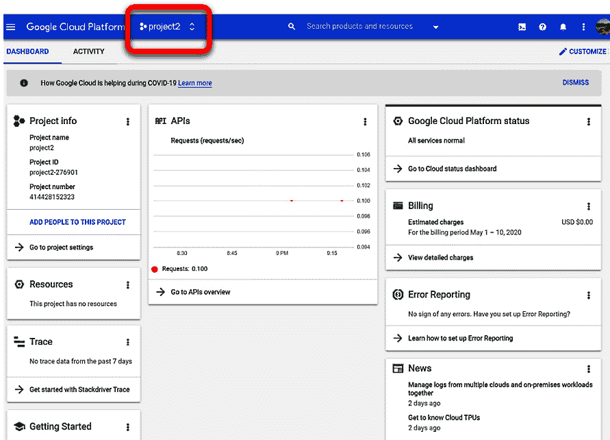

图 1.6 – 主要项目管理面板

项目 ID 在访问数据存储时会频繁使用。它也用于跟踪云租户中的资源消耗和分配。

## 创建谷歌云存储桶

**谷歌** **云存储桶**是存储模型和模型资产的一种常见方式，尤其是来自模型训练工作的资产。创建存储桶非常简单。只需在左侧面板中找到**存储**并选择**浏览器**：


图 1.7 – 谷歌云存储选项

点击**创建存储桶**，并按照面板中的指示操作。在所有情况下，系统会为您选择默认选项：

1.  **选择数据存储位置**。这是成本和可用性之间的权衡，按性能衡量。默认设置是多区域，以确保最高的可用性。

1.  **选择数据的默认存储类**。此选项让您决定与检索操作相关的成本。默认设置是频繁访问数据的标准级别。

1.  **选择如何控制对对象的访问**。这为存储桶提供了两种不同的访问级别。默认设置是**对象级别权限（ACLs）**以及**存储桶级别权限（IAM）**。

1.  **高级设置（可选）**。在这里，您可以选择加密类型、存储桶保留策略以及任何存储桶标签。默认设置是谷歌托管的密钥，没有保留策略和标签：

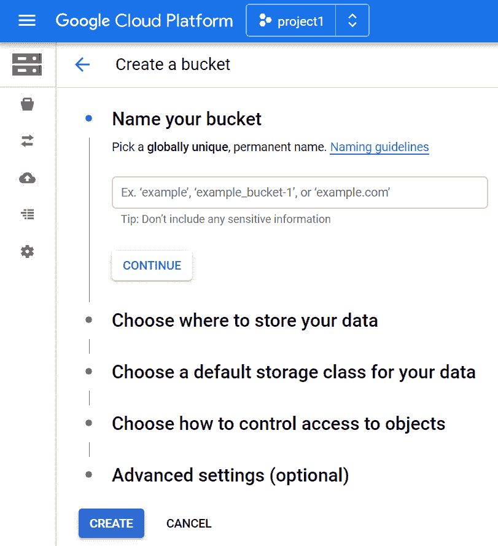

图 1.8 – 存储桶创建过程和选择

## 启用 API

现在我们有了一个项目，但在开始使用 Google Cloud 服务之前，我们需要启用一些 API。这个过程只需要做一次，通常是在创建项目 ID 时完成：

1.  现在，让我们为你选择的项目启用计算引擎 API：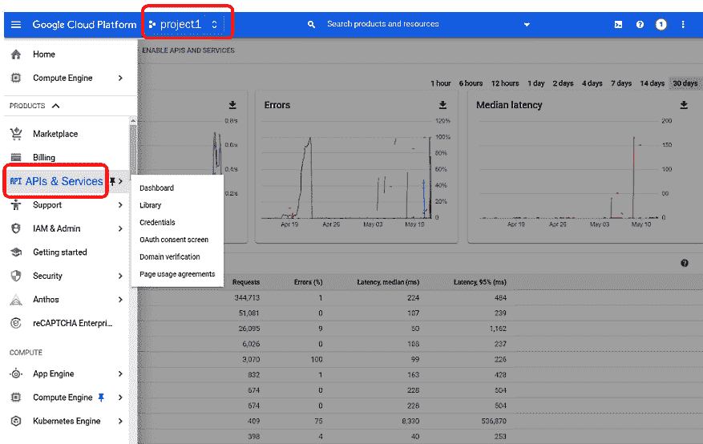

    图 1.9 – 项目的 Google Cloud APIs 和服务

    可选：然后选择**启用 API 和服务**。

    你可以现在启用，或者在本书中的练习过程中启用。如果你第一次使用某个特定的云服务，你可以在进行时启用相应的 API：

    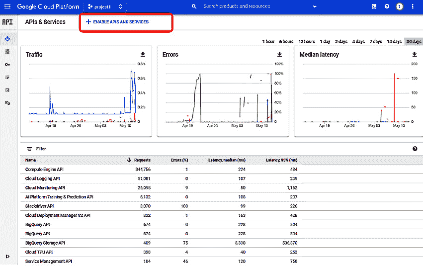

    图 1.10 – 启用 API 和服务

1.  在搜索框中输入 `Compute Engine API`：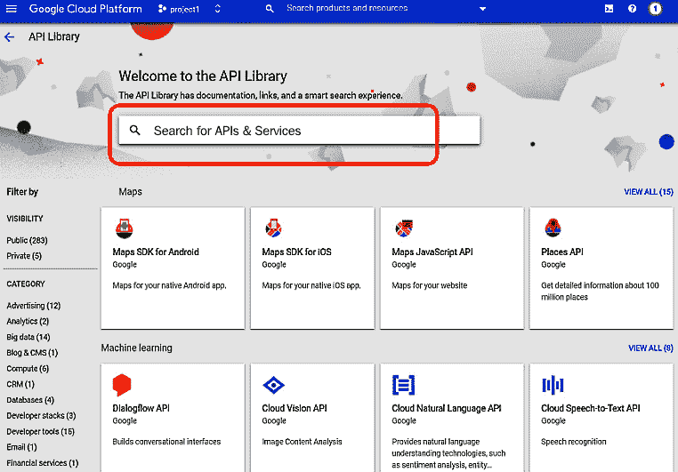

    图 1.11 – 启用计算引擎 API

1.  你将看到你项目中**计算引擎 API**的状态，如下图所示。如果没有启用，请启用它：

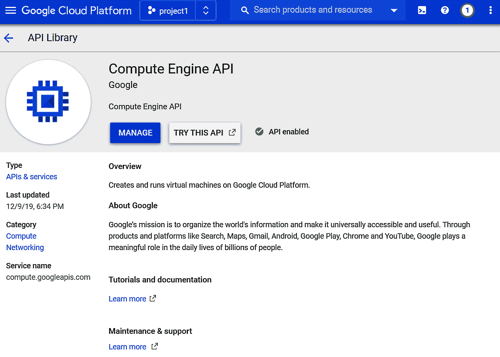

图 1.12 – Google Cloud 计算引擎 API

现在，这已经足够了。在你完成本书中的示例时，GCP 会要求你启用更多的 API，你可以在相关时启用它们。

如果你愿意，你可以重复前面的步骤来启用其他几个 API：具体来说，*BigQuery API*、*BigQuery 数据传输 API*、*BigQuery 连接 API*、*服务使用 API*、*Cloud Storage* 和 *存储传输 API*。

接下来，我们来看一下如何将存储桶中的数据移动到 BigQuery 数据仓库中的表格。

# 创建数据仓库

我们将使用一个简单的例子，将存储在 Google Cloud 存储桶中的数据放入一个可以通过 BigQuery 查询的表格中。最简单的方法是使用 BigQuery 用户界面。确保它处于正确的项目中。我们将使用这个例子来创建一个包含一个表格的数据集。

你可以通过在 GCP 门户的搜索栏中搜索 BigQuery 来导航到它，如下图所示：

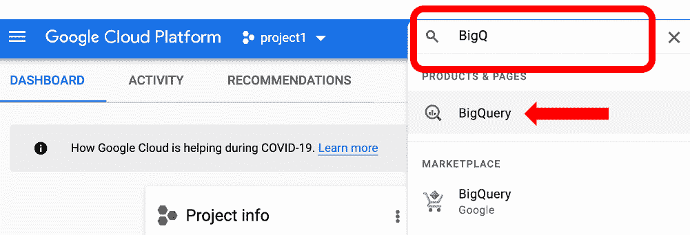

图 1.13 – 搜索 BigQuery

你将看到**BigQuery**被推荐。点击它，它会带你进入 BigQuery 门户：

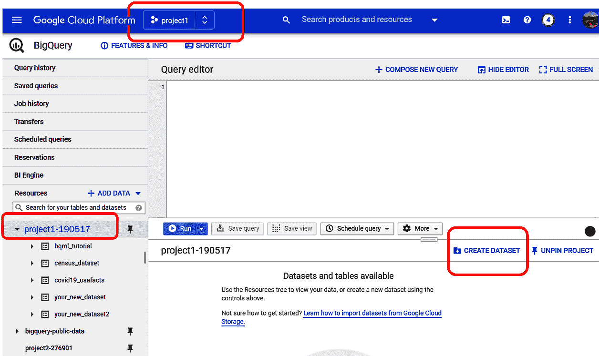

图 1.14 – BigQuery 和数据仓库查询门户

下面是创建 BigQuery 数据仓库中持久表格的步骤：

1.  选择**创建数据集**：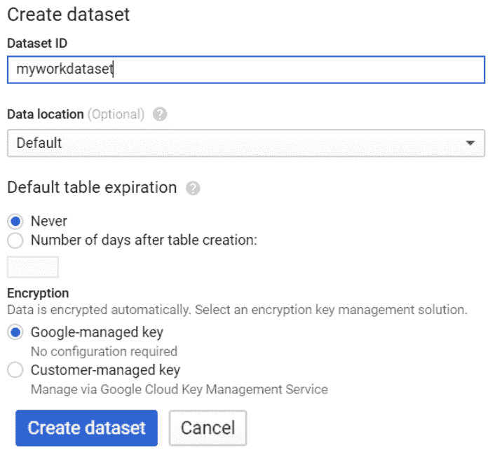

    图 1.15 – 为项目创建数据集

1.  确保你位于刚才创建的数据集中。现在点击**创建表格**：

    图 1.16 – 为数据集创建表格

    在 **源** 部分，在 **创建表格自** 部分，选择 **Google Cloud Storage**：

    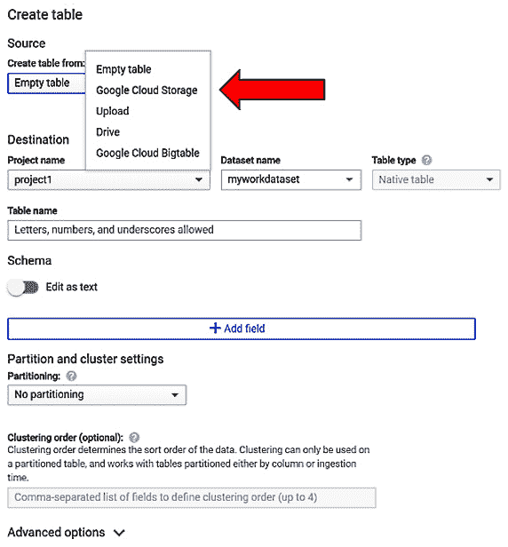

    图 1.17 – 通过指定数据源填充表格

1.  然后它将过渡到另一个对话框。你可以输入文件名或使用 **浏览** 选项查找存储在存储桶中的文件。在这种情况下，我的 Google Cloud Storage 存储桶中已经放置了一个 CSV 文件。你可以将自己的 CSV 文件上传到存储桶，或者从 [`data.mendeley.com/datasets/7xwsksdpy3/1`](https://data.mendeley.com/datasets/7xwsksdpy3/1) 下载我使用的那个文件。另外，输入列名和数据类型作为模式：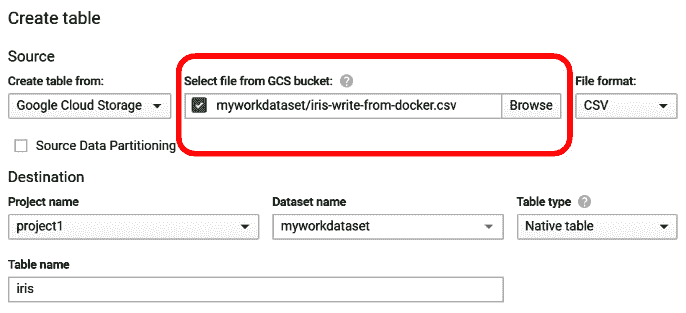

    图 1.18 – 使用存储在存储桶中的现有 CSV 文件填充表格的示例

1.  在 **模式** 部分，使用 **自动检测**，在 **高级选项** 中，由于第一行是列名数组，我们需要告诉它跳过第一行：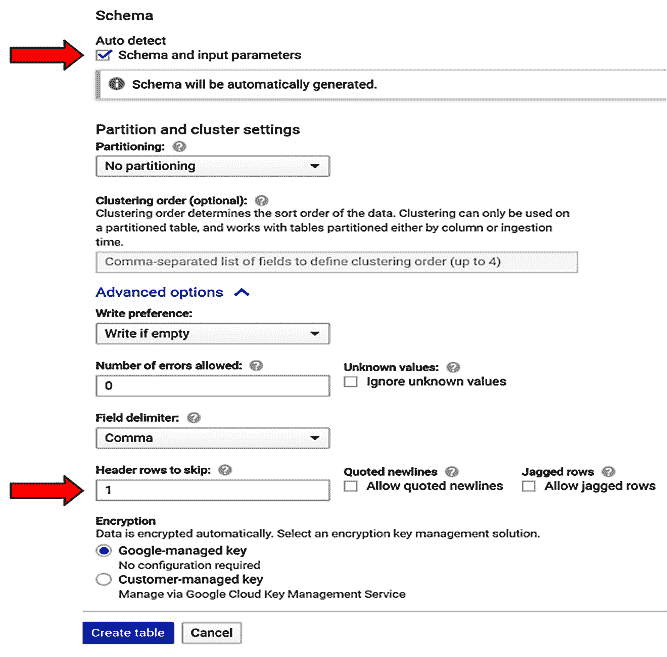

    图 1.19 – 处理表格的列名

1.  一旦表格创建完成，你可以点击 **查询表格** 来更新 SQL 查询语法，或者直接输入这个查询：

    ```py
    SELECT * FROM `project1-190517.myworkdataset.iris` LIMIT 1000
    ```

1.  执行前面的查询并点击 **运行**：

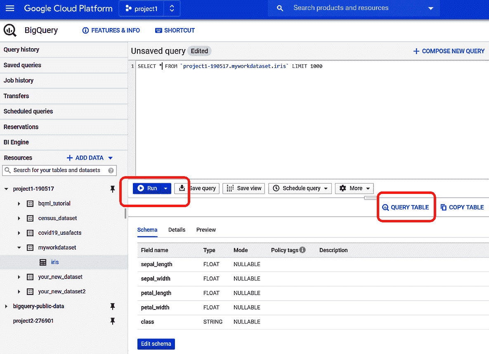

图 1.20 – 运行查询以检查表格

有许多不同的数据源类型，也有许多不同的方式将原始数据创建为数据仓库。这只是结构化数据的简单示例。如需有关其他数据源和类型的更多信息，请参考 BigQuery 文档：[`cloud.google.com/bigquery/docs/loading-data-cloud-storage-csv#console`](https://cloud.google.com/bigquery/docs/loading-data-cloud-storage-csv#console)。

现在你已经学会了如何使用存储桶中的原始数据，在 BigQuery 数据仓库中创建持久表格。

我们使用了一个 CSV 文件作为示例，并将其作为表格添加到 BigQuery。在接下来的章节中，我们将看到如何将 TensorFlow 连接到存储在 BigQuery 和 Cloud Storage 存储桶中的数据。现在我们准备启动一个在 AI Platform 上运行的 TensorFlow Enterprise 实例。

# 在 AI Platform 中使用 TensorFlow Enterprise

在本节中，我们将亲自体验如何轻松访问存储在 Google Cloud Storage 选项中的数据，例如存储桶或 BigQuery。为此，我们需要配置一个环境来执行一些示例 TensorFlow API 代码和命令行工具。本节中使用 TensorFlow Enterprise 的最简单方法是通过 Google Cloud 中的 AI Platform Notebook：

1.  在 GCP 门户中，搜索 `AI Platform`。

1.  然后选择**NEW INSTANCE**，选择**TensorFlow Enterprise 2.3**并选择**Without GPUs**。然后点击**OPEN JUPYTERLAB**：

    图 1.21 – Google Cloud AI Platform 与实例创建

1.  点击**Python 3**，它将提供一个新的笔记本，以执行本章余下的示例：

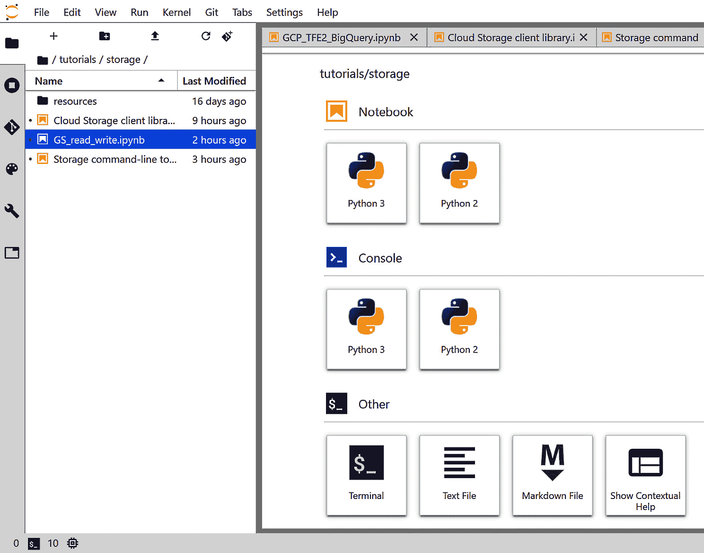

图 1.22 – 由 AI Platform 托管的 JupyterLab 环境

一个运行在 AI Platform 上的 TensorFlow Enterprise 实例现在已准备好使用。接下来，我们将使用该平台进行一些数据 I/O 操作。

# 访问数据源

TensorFlow Enterprise 可以轻松访问 Google Cloud Storage 和 BigQuery 中的数据源。这些数据源可以轻松存储从几 GB 到 TB 级别的数据。然而，以这种规模读取训练数据到 JupyterLab 运行时是不可行的。因此，使用流式数据批次进行训练是处理数据导入的方式。`tf.data` API 是构建数据导入管道的方式，能够从分布式系统中的文件中聚合数据。经过这一步后，数据对象可以通过变换步骤，演化成一个新的训练数据对象。

在本节中，我们将学习以下任务的基本编码模式：

+   从 Cloud Storage 存储桶中读取数据

+   从 BigQuery 表中读取数据

+   将数据写入 Cloud Storage 存储桶

+   将数据写入 BigQuery 表

在这之后，你将能够很好地掌握如何读取和写入 Google Cloud Storage 选项中的数据，并持久化你的数据或 TensorFlow 运行时所生成的对象。

## Cloud Storage 读取器

`tf.data`，因此一个`tf.data`对象可以轻松地访问 Google Cloud Storage 中的数据。例如，下面的代码片段演示了如何读取一个`tfrecord`数据集：

```py
my_train_dataset = tf.data.TFRecordDataset('gs://<BUCKET_NAME>/<FILE_NAME>*.tfrecord')
```

```py
my_train_dataset = my_train_dataset.repeat()
```

```py
my_train_dataset = my_train_dataset.batch()
```

```py
…
```

```py
model.fit(my_train_dataset, …)
```

在前面的示例中，存储在存储桶中的文件被序列化为`tfrecord`，它是原始数据的二进制格式。这是一种非常常见的存储和序列化大量数据或文件的方式，适用于 TensorFlow 在云中使用。这种格式可以提高通过网络流式传输数据时的读取效率。我们将在未来的章节中更详细地讨论`tfrecord`。

## BigQuery 读取器

同样，**BigQuery 读取器**也集成在 TensorFlow Enterprise 环境中，因此存储在 BigQuery 中的训练数据或衍生数据集可以被 TensorFlow Enterprise 消费。

有三种常用的方法可以读取存储在 BigQuery 数据仓库中的表。第一种方法是使用`%%bigquery` *魔法命令*。第二种方法是在*常规 Python 运行时中使用 BigQuery API*，第三种方法是*使用 TensorFlow I/O*。每种方法都有其优点。

BigQuery 魔法命令

这种方法非常适合在 JupyterLab 单元中直接运行 SQL 语句。这等同于切换单元的命令解释器。`%%bigquery` 解释器执行标准 SQL 查询，并将结果作为 pandas DataFrame 返回。

以下代码片段展示了如何使用 `%%bigquery` 解释器，并为结果分配一个 pandas DataFrame 名称。每一步都是一个 JupyterLab 单元：

1.  指定一个项目 ID。此 JupyterLab 单元使用默认解释器。因此，这里是一个 Python 变量。如果 BigQuery 表与您当前运行的项目相同，那么无需指定项目 ID：

    ```py
    project_id = '<PROJECT-XXXXX>'
    ```

1.  调用 `%%bigquery` 魔法命令，并为结果指定项目 ID 和 DataFrame 名称：

    ```py
    %%bigquery --project $project_id mydataframe
    SELECT * from `bigquery-public-data.covid19_jhu_csse.summary` limit 5
    ```

    如果表与您当前运行的项目相同，则无需 --project 参数。

1.  验证结果是一个 pandas DataFrame：

    ```py
    type(mydataframe)
    ```

1.  显示 DataFrame：

    ```py
    mydataframe
    ```

本示例的完整代码片段如下：

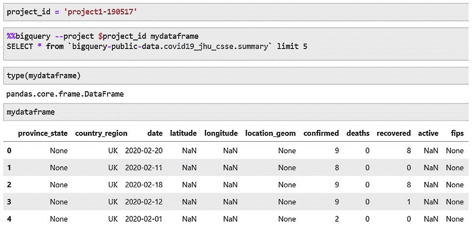

```py
me integration
```

这里是关键要点：

+   必须提供项目 ID 才能使用 BigQuery API。

+   您可以将像项目 ID 这样的 Python 变量作为值传递给运行 `%%bigquery` 解释器的单元，使用 `$` 前缀。

+   为了便于 Python 预处理功能或 TensorFlow 使用，您需要为保存查询结果的 DataFrame 指定一个名称。

### Python BigQuery API

我们可以通过 Google Cloud 的 BigQuery 客户端调用 BigQuery API。这将直接访问数据，执行查询，并立即返回结果。此方法不需要用户了解表的架构。实际上，它仅仅是通过库调用将 SQL 语句包装在 BigQuery 客户端中。

这个代码片段演示了如何调用 BigQuery API，并使用它将结果返回为 pandas DataFrame：

```py
from google.cloud import bigquery
```

```py
project_id ='project-xxxxx'
```

```py
client = bigquery.Client(project=project_id)
```

```py
sample_count = 1000
```

```py
row_count = client.query('''
```

```py
  SELECT 
```

```py
    COUNT(*) as total
```

```py
  FROM `bigquery-public-data.covid19_jhu_csse.summary`''').to_dataframe().total[0]
```

```py
df = client.query('''
```

```py
  SELECT
```

```py
    *
```

```py
  FROM
```

```py
    `bigquery-public-data.covid19_jhu_csse.summary`
```

```py
  WHERE RAND() < %d/%d
```

```py
''' % (sample_count, row_count)).to_dataframe()
```

```py
print('Full dataset has %d rows' % row_count)
```

上述代码的输出如下：


图 1.24 – 代码输出

让我们仔细看看上述代码：

+   需要导入 BigQuery 库来创建 BigQuery 客户端。

+   使用该 API 创建 BigQuery 客户端时需要提供项目 ID。

+   该客户端包装了一个 SQL 语句并执行它。

+   返回的数据可以立即轻松地转换为 pandas DataFrame。

BigQuery 表的 pandas DataFrame 版本包含以下列：


图 1.25 – BigQuery 表的 pandas DataFrame 版本

现在可以进一步使用。它现在是一个 pandas DataFrame，占用了您 Python 运行时的内存空间。

这个方法非常直接，因为它可以帮助你探索数据架构并进行简单的聚合和过滤，而且由于它本质上是一个 SQL 语句包装器，你可以非常轻松地将数据从仓库中取出并开始使用。你不需要了解表格架构就能做到这一点。

然而，这种方法的问题在于当表格足够大以至于超出了内存容量时。TensorFlow I/O 可以帮助解决这个问题。

### TensorFlow I/O

对于 TensorFlow 使用 BigQuery 数据，最好使用 TensorFlow I/O 来调用 BigQuery API。因为 TensorFlow I/O 会提供一个代表查询结果的数据集对象，而不是像之前的方法那样提供整个结果。数据集对象是训练期间流式传输训练数据的方式。因此，不必一次性将所有训练数据加载到内存中。这与小批量训练互为补充，而小批量训练无疑是深度学习中最常用的梯度下降优化实现。然而，这比前面的方法稍微复杂一些，它要求你了解表格的架构。本示例使用的是 Google Cloud 托管的公共数据集。

我们需要从表格中感兴趣的列开始。我们可以使用之前的方法来检查列名和数据类型，并创建会话定义：

1.  按如下方式加载所需的库并设置变量：

    ```py
    import tensorflow as tf
    from tensorflow_io.bigquery import BigQueryClient
    PROJECT_ID = 'project-xxxxx' # This is from what you created in your Google Cloud Account. 
    DATASET_GCP_PROJECT_ID = 'bigquery-public-data'
    DATASET_ID = 'covid19_jhu_csse'
    TABLE_ID = 'summary'
    ```

1.  实例化一个 BigQuery 客户端并指定批次大小：

    ```py
    batch_size = 2048
    client = BigQueryClient()
    ```

1.  使用客户端创建一个读取会话并指定感兴趣的列和数据类型。注意，在使用 BigQuery 客户端时，你需要知道正确的列名及其相应的数据类型：

    ```py
    read_session = client.read_session(
        'projects/' + PROJECT_ID,
        DATASET_GCP_PROJECT_ID, TABLE_ID, DATASET_ID,
        ['province_state',
           'country_region',
           'confirmed',
           'deaths',
           'date',
           'recovered'
           ],
        [tf.string,
           tf.string,
           tf.int64,
           tf.int64,
           tf.int32,
           tf.int64],
          requested_streams=10
    )
    ```

1.  现在我们可以使用创建的会话对象来执行读取操作：

    ```py
    dataset = read_session.parallel_read_rows(sloppy=True).batch(batch_size)
    ```

1.  让我们用`type()`来查看数据集：

    ```py
    type(dataset)
    ```

    这是输出结果：

    

    图 1.26 – 输出

1.  为了实际查看数据，我们需要将数据集操作转换为 Python 迭代器，并使用`next()`查看第一批次的内容：

    ```py
    itr = tf.compat.v1.data.make_one_shot_iterator(
        dataset
    )
     next(itr)
    ```

前面的命令输出显示它被组织为一个有序字典，其中键是列名，值是张量：


图 1.27 – 原始数据作为迭代器

这里是关键的要点：

+   TensorFlow I/O 的 BigQuery 客户端需要设置读取会话，读取会话由你感兴趣的表格的列名组成。

+   然后这个客户端执行一个读取操作，包含数据批次处理。

+   读取操作的输出是 TensorFlow 操作。

+   这些操作可能会被转换为 Python 迭代器，这样它就可以输出操作读取的实际数据。

+   这提高了训练过程中内存使用的效率，因为数据是按批次发送进行训练的。

## 在 BigQuery 中持久化数据

我们已经了解了如何读取存储在 Google Storage 解决方案中的数据，例如 Cloud Storage 存储桶或 BigQuery 数据仓库，并如何使 AI Platform 的 TensorFlow Enterprise 实例可以在 JupyterLab 中使用这些数据。现在让我们来看一些将数据写回，或将工作数据持久化到云存储中的方法。

我们的第一个示例涉及写入存储在 JupyterLab 运行时目录中的文件（在一些 TensorFlow Enterprise 文档中，这也称为*本地*文件）。一般过程如下：

1.  为了方便起见，执行一个 BigQuery SQL `read`命令，从公共数据集中查询一个表。

1.  将结果本地保存为**逗号分隔文件**（**CSV**）。

1.  将 CSV 文件写入我们 BigQuery 数据集中的一个表。

每个步骤都是一个代码单元。以下逐步代码片段适用于任何三个 AI 平台的 JupyterLab（AI Notebook，AI Deep Learning VM 和 Deep Learning Container）：

1.  指定项目 ID：

    ```py
    project_id = 'project1-190517'
    ```

1.  执行 BigQuery SQL 命令并将结果分配给 pandas DataFrame：

    ```py
    %%bigquery --project $project_id mydataframe
    SELECT * from `bigquery-public-data.covid19_jhu_csse.summary`
    ```

    BigQuery 的查询结果默认返回为 pandas DataFrame。在这种情况下，我们将 DataFrame 的名称指定为`mydataframe`。

1.  将 pandas DataFrame 写入本地目录中的 CSV 文件。在这种情况下，我们使用了 JupyterLab 运行时的`/home`目录：

    ```py
    import pandas as pd
    mydataframe.to_csv('my_new_data.csv')
    ```

1.  指定数据集名称：

    ```py
    dataset_id = 'my_new_dataset'
    ```

1.  使用 BigQuery 命令行工具在此项目的数据集中创建一个空表。该命令以`!bq`开头：

    ```py
    !bq --location=US mk --dataset $dataset_id
    ```

    该命令创建了一个新的数据集。这个数据集还没有任何表格。我们将在下一步将一个新表写入该数据集。

1.  将本地 CSV 文件写入新表：

    ```py
    'my_new_data.csv' will suffice. Otherwise, a full path is required. Also, {dataset_id}.my_new_data_table indicates that we want to write the CSV file into this particular dataset and the table name.
    ```

1.  现在你可以导航到 BigQuery 门户，你会看到数据集和表格：图 1.28 – BigQuery 门户和导航到数据集

    

    图 1.28 – BigQuery 门户和导航到数据集

    在这种情况下，我们有一个数据集，包含一个表。

1.  然后，执行一个简单的查询，如下所示：


图 1.29 – 用于检查表的查询

这是一个非常简单的查询，我们只是想显示 1,000 条随机选择的行。现在您可以执行此查询，输出将如下面的截图所示。

以下查询输出显示了我们刚刚创建的 BigQuery 表中的数据：

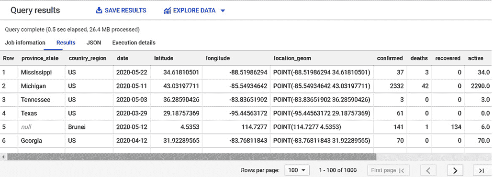

图 1.30 – 示例表格输出

以下是关键要点：

+   在 AI Platform 的 JupyterLab 运行时中生成的 TensorFlow 工作流数据，可以无缝地作为表持久化到 BigQuery 中。

+   将数据以结构化格式（如 pandas DataFrame 或 CSV 文件）持久化到 BigQuery 中，可以轻松使用 BigQuery 命令行工具完成。

+   当你需要在 JupyterLab 运行时和 BigQuery 之间移动数据对象（如表格）时，使用 BigQuery 命令行工具和`!bq`可以节省时间和精力。

## 在存储桶中持久化数据

在前面的 *在 BigQuery 中持久化数据* 部分，我们看到如何将 CSV 文件或 pandas DataFrame 等结构化数据源持久化为 BigQuery 数据集中的表。在本节中，我们将看到如何将工作数据（如 NumPy 数组）持久化。在这种情况下，适合的目标存储是 Google Cloud Storage 存储桶。

本演示的工作流如下：

1.  为了方便，从 `tf.keras.dataset` 中读取 NumPy 数组。

1.  将 NumPy 数组保存为 pickle (`pkl`) 文件。（仅供参考：虽然 pickle 文件格式方便且易于用于序列化 Python 对象，但也有其缺点。首先，它可能很慢，并且生成的对象比原始对象大。其次，pickle 文件可能包含漏洞或安全风险，任何打开它的进程都有可能受到影响。这里只是为了方便使用。）

1.  使用 `!gsutil` 存储命令行工具将文件从 JupyterLab 的 `/home` 目录（在一些文档中，这被称为*本地目录*）传输到存储桶。

1.  使用 `!gsutil` 将存储桶中的内容传输回 JupyterLab 运行时。由于我们将使用 Python 与 `!gsutil`，因此需要将内容保持在不同的单元格中。

按照以下步骤完成工作流：

1.  我们使用 IMDB 数据集，因为它已经以 NumPy 格式提供：

    ```py
    import tensorflow as tf
    import pickle as pkl
    (x_train, y_train), (x_test, y_test) = tf.keras.datasets.imdb.load_data(
        path='imdb.npz',
        num_words=None,
        skip_top=0,
        maxlen=None,
        seed=113,
        start_char=1,
        oov_char=2,
        index_from=3
    )
    with open('/home/jupyter/x_train.pkl','wb') as f:
        pkl.dump(x_train, f)
    ```

    `x_train`、`y_train`、`x_test` 和 `y_test` 将作为 NumPy 数组返回。我们将使用 `x_train` 进行本演示。`x_train` 数组将作为 `pkl` 文件保存在 JupyterLab 运行时中。

    上述代码打开了作为 TensorFlow 一部分分发的 IMDB 电影评论数据集。该数据集的格式为 NumPy 数组元组，并分为训练和测试分区。接下来，我们将 `x_train` 数组保存为运行时 `/home` 目录下的 pickle 文件。然后，在下一步中，该 pickle 文件将被持久化到存储桶中。

1.  为新的存储桶指定一个名称：

    ```py
    bucket_name = 'ai-platform-bucket'
    ```

1.  使用指定的名称创建一个新的存储桶：

    ```py
    !gsutil mb gs://{bucket_name}/
    ```

    使用 `!gsutil` 将 `pkl` 文件从运行时移动到存储桶：

    ```py
    !gsutil cp /home/jupyter/x_train.pkl gs://{bucket_name}/
    ```

1.  读取 `pkl` 文件：

    ```py
    !gsutil cp gs://{bucket_name}/x_train.pkl /home/jupyter/x_train_readback.pkl
    ```

1.  现在我们来查看 Cloud Storage 存储桶：

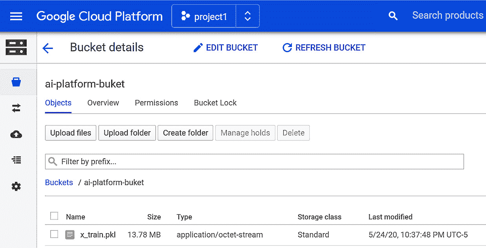

图 1.31 – 从 AI 平台的工作流中将对象序列化到存储桶中

这里是关键要点：

+   在 TensorFlow 工作流中生成的工作数据可以作为序列化对象持久化到存储桶中。

+   Google AI Platform 的 JupyterLab 环境提供了 TensorFlow 运行时与 Cloud Storage 命令行工具 `gsutil` 之间的无缝集成。

+   当你需要在 Google Cloud Storage 和 AI Platform 之间传输内容时，使用 `!gsutil` 命令行工具。

# 总结

本章概述了由 Google Cloud AI Platform 托管的 TensorFlow 企业环境。我们还看到该平台如何无缝集成特定工具，例如命令行 API，以促进数据或对象在 JupyterLab 环境和我们的存储解决方案之间的轻松传输。这些工具使得访问存储在 BigQuery 或存储桶中的数据变得简单，这两个数据源是 TensorFlow 中最常用的。

在下一章，我们将更详细地了解 AI Platform 中使用 TensorFlow 企业版的三种方式：Notebook、深度学习虚拟机（Deep Learning VM）和深度学习容器（Deep Learning Containers）。
