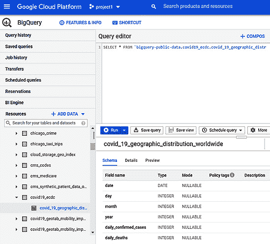
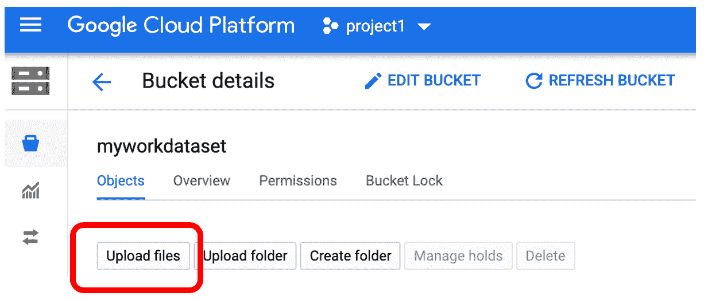
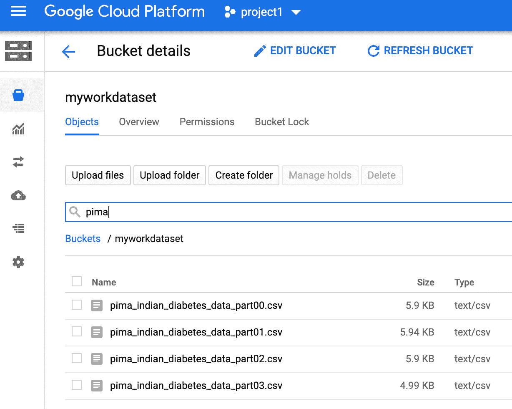
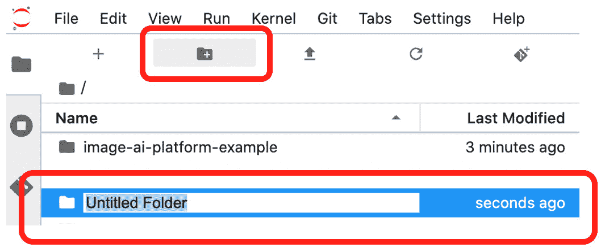
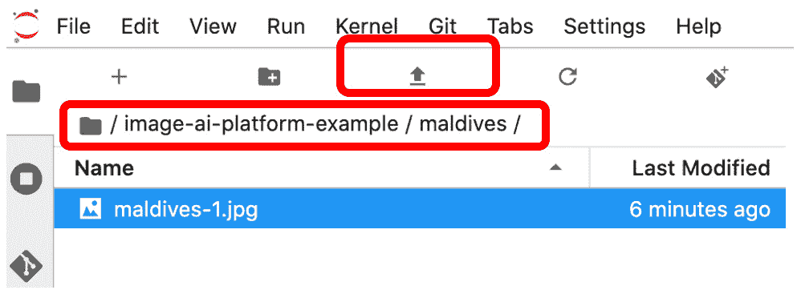
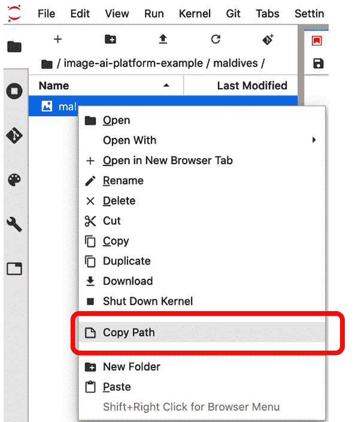
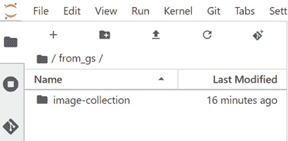
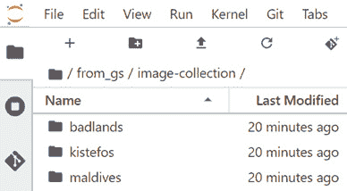
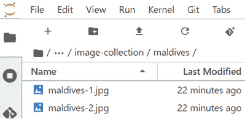

第三章：

# 数据准备和处理技术

在本章中，您将学习如何将两种常见的数据类型转换为适合摄取管道的结构——将结构化的 CSV 或 pandas DataFrame 转换为数据集，以及将图像等非结构化数据转换为 **TFRecord**。

在此过程中，我们还将介绍一些在许多情况下都能重复使用的小技巧和实用功能。您还将理解转换过程的基本原理。

如前一章所示，TensorFlow Enterprise 利用 Google Cloud AI 平台提供的灵活性来访问训练数据。一旦解决了对训练数据的访问问题，我们的下一步任务是开发一个工作流，让模型高效地消耗数据。在本章中，我们将学习如何检查和处理常用的数据结构。

虽然 TensorFlow 可以直接处理 Pythonic 数据结构，如 pandas 或 numpy，但为了提高资源吞吐量和摄取效率，TensorFlow 构建了数据集 API，用于将数据从其原生 Pythonic 结构转换为 TensorFlow 特定的结构。数据集 API 可以处理和解析许多常用的数据类型。例如，具有定义模式的结构化或表格数据通常呈现为 pandas DataFrame。数据集 API 将这种数据结构转换为 TensorFlow 数据集。图像数据通常呈现为 numpy 数组。在 TensorFlow 中，建议将其转换为 `TFRecord`。

在处理这些数据结构时，确保转换过程正确且数据可验证非常重要。本章将演示一些有助于确保数据结构转换正确的技术；例如，解码字节流为图像。通常，将这些数据结构解码为可读格式有助于快速检查数据质量。

我们将从应用于结构化数据的 TensorFlow 数据集开始。特别是，我们将涵盖以下主要内容：

+   将表格数据转换为 TensorFlow 数据集

+   将分布式 CSV 文件转换为 TensorFlow 数据集

+   处理图像数据以供输入管道使用

+   解码 `TFRecord` 并重建图像

+   处理大规模图像数据

# 将表格数据转换为 TensorFlow 数据集

**表格** 或 **逗号分隔值（CSV）** 数据通常具有固定的模式和数据类型，这类数据常常会遇到。我们通常会将它转化为 pandas DataFrame。我们在上一章中看到，当数据托管在 **BigQuery 表** 中时，如何通过 BigQuery 的魔法命令将查询结果直接返回为 pandas DataFrame。

让我们来看一下如何处理可以适应内存的数据。在这个例子中，我们将使用 BigQuery 魔法命令读取一个公共数据集，这样我们就可以轻松地将数据导入 pandas DataFrame。然后，我们将把它转换为 TensorFlow 数据集。TensorFlow 数据集是一种数据结构，用于按批次流式传输训练数据，而不会占用计算节点的运行内存。

## 将 BigQuery 表格转换为 TensorFlow 数据集

以下每一步都会在单元格中执行。再次提醒，使用任何你喜欢的 AI 平台（AI Notebook、深度学习 VM、深度学习容器）。AI notebook 是最简单和最便宜的选择：

注意

本示例中的表格仅用于演示目的。我们将把`daily_deaths`视为机器学习模型训练的目标。虽然我们将其视为训练数据（换句话说，包含特征列和目标列），但在实际的数据工程实践中，还会涉及其他步骤，如特征工程、聚合和归一化。

1.  让我们查看来自 BigQuery 的数据，以便确认其数据结构和每列的数据类型，然后预览表格：

    图 3.1 – 使用 BigQuery 检查数据结构

    一旦运行上述查询，你将看到如下所示的输出：

    

    图 3.2 – 表格预览

1.  加载库、定义变量，并仅在你运行在不同项目中时定义项目 ID：

    ```
    PROJECT_ID = '<PROJECT_ID>' 
    import tensorflow as tf
    import pandas as pd
    ```

1.  使用 BigQuery 魔法命令将表格读取到 pandas DataFrame（`train_raw_df`）中：

    ```
    %%bigquery train_raw_df
    SELECT countries_and_territories, geo_id, country_territory_code, 
    year, month, day, confirmed_cases, daily_deaths, pop_data_2019
    FROM bigquery-public-data.covid19_ecdc.covid_19_geographic_distribution_worldwide
    ```

1.  看几个样本行：

    ```
    train_raw_df.sample(n=5)
    ```

    以下是输出结果：

    

    图 3.3 – 表格中几行数据的输出

1.  一些列是类别型的。我们需要将它们编码为整数。首先，我们将该列指定为 pandas 类别特征：

    ```
    train_raw_df['countries_and_territories'] = pd.Categorical(train_raw_df['countries_and_territories'])
    ```

1.  然后我们将列内容替换为类别编码：

    ```
    train_raw_df['countries_and_territories'] = train_raw_df.countries_and_territories.cat.codes
    ```

1.  然后，我们对其他类别列重复此过程：

    ```
    train_raw_df['geo_id'] = pd.Categorical(train_raw_df['geo_id'])
    train_raw_df['geo_id'] = train_raw_df.geo_id.cat.codes
    train_raw_df['country_territory_code'] = pd.Categorical(train_raw_df['country_territory_code'])
    train_raw_df['country_territory_code'] = train_raw_df.country_territory_code.cat.codes
    ```

1.  按数据类型创建列表来存放列名。这样做的原因是确保数据集能够将我们 DataFrame 中的列转换为正确的 TensorFlow 数据类型：

    ```
    int32_features = ['confirmed_cases']
    float32_features = ['pop_data_2019']
    int16_features = ['year', 'month', 'day']
    categorical_features = ['countries_and_territories', 'geo_id', 'country_territory_code']
    int32_target = ['daily_deaths']
    ```

1.  从 pandas DataFrame 创建数据集时，我们需要指定正确的列名和数据类型。列名根据其数据类型存放在相应的列表中：

    ```
    training_dataset = tf.data.Dataset.from_tensor_slices(
            (
                tf.cast(train_raw_df[int32_features].values, 
                tf.int32),
                tf.cast(train_raw_df[float32_features].
                values, tf.float32),
                tf.cast(train_raw_df[int16_features].values, 
                tf.int16),
                tf.cast(train_raw_df[categorical_features].
                values, tf.int32),
                tf.cast(train_raw_df[int32_target].values, 
                tf.int32)
            )
        )
    ```

1.  查看数据集的结构，确保其元数据与前一步创建过程中指定的内容一致：

    ```
    training_dataset
    ```

    输出结果如下：

    ```
    <TensorSliceDataset shapes: ((1,), (1,), (3,), (3,), (1,)), types: (tf.int32, tf.float32, tf.int16, tf.int32, tf.int32)>
    ```

    张量的形状和数据类型与前一步中所示的顺序完全一致。

现在你已经从 pandas DataFrame 创建了一个数据集。这个数据集现在是输入管道的一部分。如果这个数据集的特征和目标已正确归一化和选择（例如，执行了归一化操作如最小-最大缩放，或标准化操作如 Z 分数转换，如果可以假定列数据的分布为高斯分布），那么它可以直接用于模型训练。

到目前为止，通过这次练习，你已经学到了以下几点：

+   尽可能使用 BigQuery 来首先检查数据模式和数据类型。

+   对于可以适应内存的数据，利用 BigQuery 魔法命令输出 pandas DataFrame。

+   根据数据类型对列名进行分组，以便清晰和组织。

+   将类别特征编码为整数，以便它们可以转换为与 TensorFlow 数据集兼容的 TensorFlow 数据类型。

# 将分布式 CSV 文件转换为 TensorFlow 数据集

如果你不确定数据的大小，或者不确定它是否能完全适应 Python 运行时的内存，那么将数据读取到 pandas DataFrame 中就不是一个可行的选项。在这种情况下，我们可以使用 **TF 数据集** 来直接访问数据，而不需要打开它。

通常，当数据以部分形式存储在存储桶中时，命名约定遵循一般模式。这个模式类似于 `*`。

在将分布式文件存储到 Google Cloud Storage 桶时，文件名的常见模式如下：

```
<FILE_NAME>-<pattern>-001.csv
```

```
…
```

```
<FILE_NAME>-<pattern>-00n.csv
```

或者，存在以下模式：

```
<FILE_NAME>-<pattern>-aa.csv
```

```
…
```

```
<FILE_NAME>-<pattern>-zz.csv
```

文件名中总是有一个模式。TensorFlow 模块 `tf.io.gfile.glob` 是一个方便的 API，它可以在分布式文件系统中编码此类文件名模式。这对于推断存储在存储桶中的分布式文件至关重要。在这一部分，我们将使用这个 API 来推断我们分布在存储桶中的结构化数据（多个 CSV 文件）。推断后，我们将使用 `tf.data.experimental.make_csv_dataset` 将其转换为数据集。

## 准备一个示例 CSV

由于我们需要多个相同模式的 CSV 文件进行演示，我们可以使用开源的 CSV 数据集，如 **皮马印第安人糖尿病** 数据集（CSV）作为数据来源。该 CSV 文件托管在 [`raw.githubusercontent.com/jbrownlee/Datasets/master/pima-indians-diabetes.data.csv`](https://raw.githubusercontent.com/jbrownlee/Datasets/master/pima-indians-diabetes.data.csv)。

你可以在本地系统上运行以下命令（你已经下载了上述文件）：

```
wget https://raw.githubusercontent.com/jbrownlee/Datasets/master/pima-indians-diabetes.data.csv
```

再次强调，为了演示的目的，我们需要将这些数据拆分为多个较小的 CSV 文件，然后将这些 CSV 文件上传到 Google Cloud Storage 桶。

该文件的列名如下：

```
['Pregnancies', 'Glucose', 'BloodPressure', 'SkinThickness', 'Insulin', 'BMI', 'DiabetesPedigree', 'Age', 'Outcome']
```

由于 CSV 文件中未包含列名，因此我们可以在不提取标题行的情况下将文件拆分为多个部分。让我们从以下步骤开始：

1.  将文件拆分为多个部分。

    下载 CSV 文件后，你可以使用以下`awk`命令将其拆分为多个部分。这个命令会在每 200 行处将文件拆分成多个 CSV 部分：

    ```
    awk '{filename = 'pima_indian_diabetes_data_part0' int((NR-1)/200) '.csv'; print >> filename}' pima-indians-diabetes.data.csv
    ```

    生成了以下 CSV 文件：

    ```
    -rw-r--r--  1 mbp16  staff      6043 Jul 21 16:25 pima_indian_diabetes_data_part00.csv
    -rw-r--r--  1 mbp16  staff      6085 Jul 21 16:25 pima_indian_diabetes_data_part01.csv
    -rw-r--r--  1 mbp16  staff      6039 Jul 21 16:25 pima_indian_diabetes_data_part02.csv
    -rw-r--r--  1 mbp16  staff      5112 Jul 21 16:25 pima_indian_diabetes_data_part03.csv
    ```

1.  将文件上传到存储。下载完文件并生成多个 CSV 文件后，你可以将这些文件上传到 Google Cloud Storage 桶中：



图 3.4 – 上传 CSV 文件到 Cloud Storage 桶

所有文件都在这里：



图 3.5 – Cloud Storage 桶中的多部分 CSV 文件

## 使用 TensorFlow I/O 构建文件名模式

文件上传完成后，接下来我们进入 AI 平台笔记本环境，执行以下代码行：

```
import tensorflow as tf
```

```
distributed_files_pattern = 'gs://myworkdataset/pima_indian_diabetes_data_part*'
```

```
filenames = tf.io.gfile.glob(distributed_files_pattern)
```

`Tf.io.gfile.glob`接收一个文件模式字符串作为输入，并创建一个`filenames`列表：

```
['gs://myworkdataset/pima_indian_diabetes_data_part00.csv',
```

```
 'gs://myworkdataset/pima_indian_diabetes_data_part01.csv',
```

```
 'gs://myworkdataset/pima_indian_diabetes_data_part02.csv',
```

```
 'gs://myworkdataset/pima_indian_diabetes_data_part03.csv']
```

现在我们已经有了匹配模式的文件名列表，我们可以准备将这些文件转换为数据集了。

## 从 CSV 文件创建数据集

通常，多个 CSV 文件要么没有表头，要么全部都有表头。在这种情况下，没有表头。我们需要在将 CSV 转换为数据集之前准备列名：

```
COLUMN_NAMES = ['Pregnancies', 'Glucose', 'BloodPressure', 
```

```
                'SkinThickness', 'Insulin', 'BMI', 
```

```
                'DiabetesPedigree', 'Age', 'Outcome']
```

这是列名的来源：[`data.world/data-society/pima-indians-diabetes-database`](https://data.world/data-society/pima-indians-diabetes-database)。

然后我们需要指定这些文件的第一行不是表头，因为我们要将 CSV 文件转换为数据集：

```
ds = tf.data.experimental.make_csv_dataset(
```

```
      filenames,
```

```
      header = False,
```

```
      column_names = COLUMN_NAMES,
```

```
      batch_size=5, # Intentionally make it small for 
```

```
      # convenience.
```

```
      label_name='Outcome',
```

```
      num_epochs=1,
```

```
      ignore_errors=True)
```

在`make_csv_dataset`中，我们使用文件名列表作为输入，并指定没有表头，然后我们分配`COLUMN_NAMES`，制作小批量结果展示，选择一列作为目标列（`'Outcome'`），并将训练周期数设置为`1`，因为我们此时并不会用它训练模型。

## 检查数据集

现在我们可以验证数据集的内容了。回想一下，由于我们指定了一列作为标签，这意味着其余列是特征。输出将是一个包含特征和目标的元组。

让我们以数据集的第一批数据为例，其中包含五个观测值，并打印出特征列和目标列的数据。在数据集中，数据以数组的形式存储，每一列现在是一个键值对。在`features`中是另一级别的键值对，表示每个特征：

```
for features, target in ds.take(1):
```

```
    print(''Outcome': {}'.format(target))
```

```
    print(''Features:'')
```

```
    for k, v in features.items():
```

```
        print('  {!r:20s}: {}'.format(k, v))
```

输出如下：

```
'Outcome': [1 0 0 0 0]
```

```
'Features:'
```

```
  'Pregnancies'       : [ 7 12  1  0  2]
```

```
  'Glucose'           : [129  88 128  93  96]
```

```
  'BloodPressure'     : [ 68  74  82 100  68]
```

```
  'SkinThickness'     : [49 40 17 39 13]
```

```
  'Insulin'           : [125  54 183  72  49]
```

```
  'BMI'               : [38.5 35.3 27.5 43.4 21.1]
```

```
  'DiabetesPedigree'  : [0.439 0.378 0.115 1.021 0.647]
```

```
  'Age'               : [43 48 22 35 26]
```

在训练过程中，数据将以批处理的形式传递给训练过程，而不是作为单个文件打开，可能会消耗大量运行时内存。在前面的示例中，我们看到作为一种最佳实践，存储在云存储中的分布式文件遵循一定的命名模式。`tf.io.gfile.glob` API 可以轻松推断分布在云存储桶中的多个文件。我们可以轻松使用`tf.data.experimental.make_csv_dataset`从`gfile`实例创建数据集实例。总体而言，`tf.io`和`tf.data` API 一起使得构建数据输入管道成为可能，而无需显式地将数据读取到内存中。

# 处理输入管道的图像数据

尽管有许多类型的非结构化数据，但图像可能是最常见的一种类型。TensorFlow 提供了`TFRecord`作为图像数据的一种数据集类型。在本节中，我们将学习如何将云存储中的图像数据转换为`TFRecord`对象，以供输入管道使用。

在 TensorFlow 管道中处理图像数据时，原始图像通常会转换为`TFRecord`对象，这与 CSV 或 DataFrame 相同。与原始 numpy 数组相比，`TFRecord`对象是图像集合的更高效且可扩展的表示形式。将原始图像转换为`TFRecord`对象不是一个简单的过程。在`TFRecord`中，数据以二进制字符串的形式存储。在本节中，我们将逐步展示如何实现这一过程。

让我们从将原始图像转换为`TFRecord`对象的过程开始。随时将您自己的图像上传到 JupyterLab 实例：

1.  上传您选择的图像到 JupyterLab 运行时。为我们将要上传的图像创建一个文件夹。给该文件夹命名，这就是图像将被上传的文件夹：

    图 3.6 – 在笔记本运行时创建文件夹

    现在文件夹已经命名，您可以继续执行下一步。

1.  双击您刚才命名的文件夹。现在您已进入该文件夹。在此示例中，我将该文件夹命名为`image-ai-platform-examle`。然后，在这个文件夹内，我创建了另一个名为`maldives`的文件夹。一旦进入该文件夹，您可以点击上传按钮，将您自己的几张图像上传到此文件夹：

    图 3.7 – 将项目上传到 JupyterLab 运行时

    这里，我上传了一张名为`maldives-1.jpg`的图像。

1.  您可以通过右键点击图像文件来获取该图像的路径：

    图 3.8 – 查找上传到笔记本的图像路径

    您可以将文件路径粘贴到记事本或编辑器中，便于下一步的快速参考。

1.  选择`images-ai-platform-example/maldives/maldives-1.jpg`：

1.  显示图像以进行验证：

    ```
    import IPython.display as display
    my_image = 'images-ai-platform-example/maldives/maldives-1.jpg'
    display.display(display.Image(filename=my_image))
    ```

    这是输出结果：

    

    图 3.9 – 显示图像

1.  创建一个字典，将文件名与标签映射。我们可以使用 `my_image` 别名作为键，并且可以验证此字典：

    ```
    image_labels = {
        my_image : 0
    }
    image_labels.items()
    ```

    输出应如下所示：

    ```
    dict_items([('images-ai-platform-example/maldives/maldives-1.jpg', 0)])
    ```

## 构建 protobuf 消息

现在我们有了 `image_labels`，它将图像文件映射到其标签。接下来，我们需要做的是将此图像转换为 `tf.Example` `image_label`，`tf.Example` 消息由键值对组成。键值对是图像的元数据，包括三个维度及其相应的值、标签及其值，最后是图像本身的字节数组格式。值表示为 `tf.Tensor`。现在让我们构建这个 protobuf 消息。

此时，`tf.Example` protobuf 消息只能接受三种类型的 `tf.Tensor`。它们如下所示：

+   `tf.train.ByteList` 可以处理 `string` 和 `byte`。

+   `tf.train.FloatList` 可以处理 `float (float32)` 和 `double (float64)`。

+   `tf.train.Int64List` 可以处理 `bool`、`enum`、`int32`、`uint32`、`int64` 和 `uint64`。

根据 TensorFlow 文档，其他大多数通用数据类型可以强制转换为这三种类型之一，相关文档请参见：[`www.tensorflow.org/tutorials/load_data/tfrecord#tftrainexample`](https://www.tensorflow.org/tutorials/load_data/tfrecord#tftrainexample)：

1.  首先，我们可以使用 TensorFlow 文档中提供的这些函数。这些函数可以将值转换为与 `tf.Example` 兼容的类型：

    ```
    def _bytes_feature(value):
      '''Returns a bytes_list from a string / byte.'''
      if isinstance(value, type(tf.constant(0))):
        value = value.numpy() # BytesList won't unpack a 
        # string from an EagerTensor.
      return tf.train.Feature(bytes_list=
      tf.train.BytesList(value=[value]))
    def _float_feature(value):
      '''Returns a float_list from a float / double.'''
      return tf.train.Feature(float_list=
      tf.train.FloatList(value=[value]))
    def _int64_feature(value):
      '''Returns an int64_list from a bool / enum / int / 
      uint.'''
      return tf.train.Feature(int64_list=
      tf.train.Int64List(value=[value]))
    ```

    一般来说，从前述函数的模式中，我们可以看到，数据中的原始值首先被强制转换为三种可接受类型之一，然后再转换为 `feature`。

1.  然后，我们可以将图像作为字节串打开并提取其尺寸：

    ```
    image_string = open(my_image, 'rb').read()
    image_shape = tf.image.decode_jpeg(image_string).shape
    image_shape
    ```

1.  现在我们构建一个字典，将这些键值对组合在一起：

    ```
    label = image_labels[my_image]
    feature_dictionary = {
          'height': _int64_feature(image_shape[0]),
          'width': _int64_feature(image_shape[1]),
          'depth': _int64_feature(image_shape[2]),
          'label': _int64_feature(label),
          'image_raw': _bytes_feature(image_string),
      }
    ```

    请注意，特征字典由元数据的键值对组成，其中值是 `tf.Example` 的三种强制转换数据类型之一。

1.  然后我们将此字典转换为 `tf.Train.Features`：

    ```
    features_msg = tf.train.Features(feature=feature_dictionary)
    ```

1.  将 `tf.Features` protobuf 消息转换为 `tf.Example` protobuf 消息：

    ```
    example_msg = tf.train.Example(features=features_msg)
    ```

1.  现在，创建一个存储 `tfrecords` 的目录：

    ```
    !mkdir tfrecords-collection
    ```

1.  指定目标名称，然后执行写操作：

    ```
    record_file = 'tfrecords-collection/maldives-1.tfrecord'
    with tf.io.TFRecordWriter(record_file) as writer:
        writer.write(example_msg.SerializeToString())
    ```

    该图像现在已写入 protobuf 消息，它是一个键值对集合，用于存储其尺寸、标签和原始图像（图像值以字节串形式存储）。

# 解码 TFRecord 并重建图像

在上一节中，我们学习了如何将`.jpg`图像写入`TFRecord`数据集。现在我们将看到如何将其读回并显示。一个重要的要求是，你必须知道`TFRecord` protobuf 的特征结构，这是通过其键来指示的。特征结构与上一节中用于构建`TFRecord`的特征描述是相同的。换句话说，就像原始图像被结构化为具有定义特征描述的`tf.Example` protobuf 一样，我们可以使用该特征描述来解析或重建图像，使用存储在特征描述中的相同知识：

1.  从存储路径中读取`TFRecord`：

    ```
    read_back_tfrecord = tf.data.TFRecordDataset('tfrecords-collection/maldives-1.tfrecord')
    ```

1.  创建一个字典来指定`TFRecord`中的键和值，并使用它来解析`TFRecord`数据集中的所有元素：

    ```
    # Create a dictionary describing the features.
    image_feature_description = {
        'height': tf.io.FixedLenFeature([], tf.int64),
        'width': tf.io.FixedLenFeature([], tf.int64),
        'depth': tf.io.FixedLenFeature([], tf.int64),
        'label': tf.io.FixedLenFeature([], tf.int64),
        'image_raw': tf.io.FixedLenFeature([], tf.string),
    }
    def _parse_image_function(example_proto):
      # Parse the input tf.Example proto using the dictionary 
      # above.
      return tf.io.parse_single_example(example_proto, 
      image_feature_description)
    parsed_image_dataset = read_back_tfrecord.map(_parse_image_function)
    ```

    在前面的代码中，`_parse_image_function`使用`image_feature_description`来解析`TFRecord` protobuf。我们使用`map`函数将`_parse_image_function`应用于`read_back_tfrecord`中的每个图像。

1.  接下来，我们将使用以下代码来显示图像：

    ```
    for image_features in parsed_image_dataset:
      image_raw = image_features['image_raw'].numpy()
      display.display(display.Image(data=image_raw))
    ```

    这是输出结果：


图 3.10 – 将数据集显示为图像

在本节中，你学会了如何将原始数据（图像）转换为`TFRecord`格式，并通过读取`TFRecord`并将其显示为图像来验证转换是否正确。从这个例子中，我们还可以看到，为了解码和检查`TFRecord`数据，我们需要在编码过程中使用的特征字典。在使用`TFRecord`时，记住这一点非常重要。

# 大规模处理图像数据

处理数据及其相应标签很简单，如果一切数据都可以加载到 Python 引擎的运行时内存中。然而，在构建数据管道以供模型训练工作流使用时，我们希望以批量的方式摄取或流式传输数据，以便不依赖于运行时内存来保存所有训练数据。在这种情况下，必须保持数据（图像）与标签之间的一对一关系。接下来我们将看到如何使用`TFRecord`来实现这一点。我们已经看到如何将一张图像转换为`TFRecord`。对于多张图像，转换过程对于每张图像都是完全相同的。

让我们来看一下如何重用和重构上一节中的代码，以应用于一批图像。由于你已经看到如何处理单个图像，所以在理解此处的代码和原理时，你应该几乎没有问题。

通常，在处理分类图像时，我们会按照以下目录结构组织图像，从一个基本目录开始（换句话说，项目名称）。下一级目录为`train`、`validation`和`test`。在这三个目录中，每个目录下都有图像类别目录。换句话说，标签是最底层的目录名称。例如，目录可以组织为以下结构：

```
/home/<user_name>/Documents/<project_name>
```

然后，在此级别下，我们将拥有以下内容：

```
/home/<user_name>/Documents/<project_name>train
```

```
/home/<user_name>/Documents/<project_name>train/<class_1_dir>
```

```
/home/<user_name>/Documents/<project_name>train/<class_2_dir>
```

```
/home/<user_name>/Documents/<project_name>train/<class_n_dir>
```

```
/home/<user_name>/Documents/<project_name>validation
```

```
/home/<user_name>/Documents/<project_name>/validation/<class_1_dir>
```

```
/home/<user_name>/Documents/<project_name>/validation/<class_2_dir>
```

```
/home/<user_name>/Documents/<project_name>/validation/<class_n_dir>
```

```
/home/<user_name>/Documents/<project_name>test
```

```
/home/<user_name>/Documents/<project_name> /test /<class_1_dir>
```

```
/home/<user_name>/Documents/<project_name> test/<class_2_dir>
```

```
/home/<user_name>/Documents/<project_name> /test/<class_n_dir>
```

另一种展示图像按类别组织的方式如下：

```
-base_dir
```

```
       -train_dir
```

```
            -class_1_dir 
```

```
            -class_2_dir
```

```
            -class_n_dir
```

```
       -validation_dir
```

```
           -class_1_dir
```

```
           -class_2_dir
```

```
           -class_n_dir
```

```
       -test
```

```
          -class_1_dir
```

```
          -class_2_dir
```

```
          -class_n_dir
```

图像根据其类别放置在相应的目录中。在本节中，示例简化为云存储中的以下结构：

```
-bucket
```

```
 -badlands (Badlands national park)
```

```
 -kistefos (Kistefos Museum)
```

```
 -maldives (Maldives beaches)
```

你可以在以下链接找到示例的 jpg 图片：[`github.com/PacktPublishing/learn-tensorflow-enterprise/tree/master/chapter_03/from_gs`](https://github.com/PacktPublishing/learn-tensorflow-enterprise/tree/master/chapter_03/from_gs)

每个文件夹名称对应图像的标签。一般步骤如下：

1.  将存储在云存储桶中的图像复制到 JupyterLab 运行时。

1.  将图像文件名映射到它们各自的标签。

1.  将每个图像的尺寸、标签和字节数组写入`tf.Example` protobuf。

1.  将多个 protobuf 文件一起存储在一个`TFRecord`中。

## 执行步骤

下面是每个单元格中需要运行的详细步骤：

1.  将图像从存储桶复制到笔记本运行时：

    ```
    !mkdir from_gs
    !gsutil cp -r gs://image-collection from_gs
    ```

    在这一步骤中，创建了一个文件夹`from_gs`，并将`image-collection`桶复制到其中。

    将基本目录视为`/from_gs/image-collection`：

    

    图 3.11 – 基本目录

1.  由于此示例用于演示如何创建`TFRecordDataset`，而不是将数据划分为训练、验证和测试，因此我们可以直接进入图像类别目录级别，如下截图所示：

    图 3.12 – 图像类别目录级别

    检查其中一个图像类别目录后，我们可以看到图像文件：

    

    图 3.13 – 图像文件

1.  导入库并将标签名称指定为`CLASS_NAMES`：

    ```
    import tensorflow as tf
    import numpy as np
    import IPython.display as display
    import pathlib
    data_dir = pathlib.Path('from_gs/image-collection')
    data_dir = pathlib.Path(data_dir)
    CLASS_NAMES = np.array([item.name for item in data_dir.glob('*')])
    CLASS_NAMES
    ```

    并且`CLASS_NAMES`被正确捕获，如下所示：

    ```
    array(['kistefos', 'badlands', 'maldives'], dtype='<U8')
    ```

1.  现在，我们需要构建一个字典，将文件名映射到它们对应的标签（来自`CLASS_NAMES`）。我们可以使用`glob`来编码目录和文件名模式。创建几个空列表，以便我们可以递归遍历目录，并将路径到文件名添加到文件名列表中，将标签（由目录名表示）添加到类别列表中：

    ```
    import glob
    file_name_list = []
    class_list = []
    for name in glob.glob('from_gs/image-collection/*/*.jpg', recursive=True): 
      file_name_list.append(name)
      # label is next to the last substring before the file 
      # name.
      class_str = name.split('/')[-2]
      idx_tuple = np.where(CLASS_NAMES == class_str)
      idx = int(idx_tuple[0]) # first element of the idx 
      # tuple is the index
      class_list.append(idx)
    ```

1.  一旦两个列表按准确顺序填充，我们可以将这些列表组合在一起并将结果编码为键值对（字典）：

    ```
    image_label_dict = dict(zip(file_name_list, class_list))
    image_label_dict should look similar to:
    {'from_gs/image-collection/kistefos/kistefos-1.jpg': 0,
     'from_gs/image-collection/kistefos/kistefos-3.jpg': 0,
     'from_gs/image-collection/kistefos/kistefos-2.jpg': 0,
     'from_gs/image-collection/badlands/badlands-1.jpg': 1,
     'from_gs/image-collection/badlands/badlands-2.jpg': 1,
     'from_gs/image-collection/maldives/maldives-2.jpg': 2,
     'from_gs/image-collection/maldives/maldives-1.jpg': 2}
    ```

    如所示，这是一个字典，键是文件路径，值编码相应的标签（图像类别）。

1.  我们想要将数据转换为 `tf.Example` protobuf 消息，这也是 `TFRecord` 的前身格式。`tf.Example` 要求我们在图像中指定特征（如图像宽度像素数、高度像素数，或者以 `numpy` 数组形式表示的小数值等数据）。`tf.Example` 指定的三种数据类型是 `tf.train.BytesList`、`tf.train.FloatList` 和 `tf.train.Int64List`。因此，常见的 Python 数据类型需要强制转换为这三种类型中的一种。这是每个 `tf.Example` 数据类型可以接受并强制转换的内容：

    +   `tf.train.BytesList`：`string`，`byte`

    +   `tf.train.FloatList`：`float`（float32，float64）

    +   `tf.train.Int64List`：`bool`，`enum`，`int32`，`uint32`，`int64`，`uint64`

        为了将常见的数据类型强制转换为相应的兼容 `tf.Example` 数据类型，TensorFlow 团队提供了以下辅助函数：

        如果我们想要将一串文本（字节字符串）转换成 `tf.train.ByteList` 类型的特征，下面的函数首先将文本（它是一个急切张量）转换成 `numpy` 数组，因为 `tf.train.BytesList` 目前只能将 `numpy` 格式解包成字节列表。在将一个 protobuf 消息的值转换为 `ByteList` 类型之后，它会被转换为一个带有 `ByteList` 数据类型的特征对象：

        ```
        def _bytes_feature(value):
          if not tf.is_tensor(value):
            value = tf.convert_to_tensor(value)
          value = value.numpy()
          bytes_list_msg = tf.train.BytesList(value = [value])
          coerced_list = tf.train.Feature(bytes_list = 
          bytes_list_msg)
          return coerced_list
        ```

        如果我们需要将浮点数转换为 `tf.train.FloatList` 类型的特征，下面的函数可以完成这个任务：

        ```
        def _float_feature(value):
          float_list_msg = tf.train.FloatList(value=[value])
          coerced_list = tf.train.Feature(float_list = 
          float_list_msg)
          return coerced_list
        ```

1.  最后，对于生成 `tf.train.Int64List` 类型的特征，可以按照以下方式完成：

    ```
    def _int64_feature(value):
      int64_list_msg = tf.train.Int64List(value=[value])
      coerced_list = tf.train.Feature(int64_list = 
      int64_list_msg)
      return coerced_list
    ```

    注意事项

    `tf.train.Feature` 一次只能接受一个特征。这些函数处理的是一次转换和强制转换一个数据特征。这个函数不同于 `tf.train.Features`，后者接受一个包含多个特征的字典。在下一步中，我们将使用 `tf.train.Features`。

1.  将创建 `tf.Example` protobuf 消息的工作流整合到一个包装函数中。这个函数接受两个输入：一个表示图像的字节字符串，以及该图像的对应标签。

    在这个函数内部，首先通过 `decode_jpeg` 的输出指定图像形状，`decode_jpeg` 将字节数组转换为 `jpeg` 格式。维度值存储在 `image_shape` 中，作为 `numpy` 数组，我们可以将这些值传入特征字典。在 `feature` 字典内，指定了键，并且从前面步骤中的辅助函数中得到了相应的值并进行了类型转换。特征字典随后被用来指定特征的 schema 到 `features` protobuf 中。然后，`feature` protobuf 被转换为一个示例 protobuf，这是最终的格式，将被序列化为 `TFRecord`：

    ```
    def image_example(image_str, label):
      image_shape = tf.image.decode_jpeg(image_string).shape
      feature = {
          'height': _int64_feature(image_shape[0]),
          'width': _int64_feature(image_shape[1]),
          'depth': _int64_feature(image_shape[2]),
          'label': _int64_feature(label),
          'image_raw': _bytes_feature(image_string),
      }
      features_msg = tf.train.Features(feature=feature)
      example_msg = tf.train.Example(features=features_msg)
      return example_msg
    ```

1.  通过遍历 `image_label_dict` 将多个图像文件写入 `TFRecords`：

    ```
    record_file = 'image-collection.tfrecords'
    with tf.io.TFRecordWriter(record_file) as writer:
      for filename, label in image_image_label_dict.items():
        image_string = open(filename, 'rb').read()
        tf_example = image_example(image_string, label)
        writer.write(tf_example.SerializeToString())
    ```

在前面的步骤中，我们将所有七张图像按三类写入了一个 `TFRecord`。

## 读取 TFRecord 并将其显示为图像

为了确保 TFRecord 格式呈现的图像数据无误，如果我们能读取回这些数据并显示出来，确认一切都被正确格式化，那将是非常有帮助的。现在，让我们读取`TFRecord`并将其显示为图像：

1.  使用与前一节相同的 API 读取`tfrecords`：

    ```
    image_collection_dataset = tf.data.TFRecordDataset('image-collection.tfrecords')
    ```

1.  定义数据集的规格：

    ```
    feature_specs = {
        'height': tf.io.FixedLenFeature([], tf.int64),
        'width': tf.io.FixedLenFeature([], tf.int64),
        'depth': tf.io.FixedLenFeature([], tf.int64),
        'label': tf.io.FixedLenFeature([], tf.int64),
        'image_raw': tf.io.FixedLenFeature([], tf.string),
    }
    ```

1.  解析 protobuf。这与前一节所示的完全相同：

    ```
    def parse_image(example):
      return tf.io.parse_single_example(example, 
      feature_specs)
    parsed_image_dataset = image_collection_dataset.map(parse_image)
    ```

1.  使用以下代码帮助显示图像：

    ```
    import IPython.display as display
    for image_features in parsed_image_dataset:
      image_raw = image_features['image_raw'].numpy()
      display.display(display.Image(data=image_raw))
    ```

你应该能看到这个 protobuf 消息中包含的所有图像。为了简便起见，我们只展示两张图像，并注意图 3.14 和图 3.15 的尺寸不同，protobuf 能够正确保留和恢复这些尺寸。

这是第一张图像：


图 3.14 – 马尔代夫类别图像 (1)

这是第二张图像：


图 3.15 – 马尔代夫类别图像 (2)

关于在一个 TFRecord 中包含多个图像的几点说明

你已经看到，无论是单张图像还是多张图像，一切都可以写入一个单一的`TFRecord`。没有绝对的对错，哪种方式更优，取决于内存和 I/O 带宽等因素。一个经验法则是，如果图像数量足够多，应将训练图像分布到至少 32 - 128 个分片（每个分片是一个`TFRecord`），以便在 I/O 过程中保持文件级并行性。

# 摘要

本章提供了关于如何处理常见的结构化和非结构化数据的解释和示例。我们首先介绍了如何读取和格式化 pandas DataFrame 或 CSV 类型的数据结构，并将其转换为高效的数据摄取管道数据集。然后，在处理非结构化数据时，我们以图像文件为例。在处理图像数据时，我们必须以层次化的方式组织这些图像文件，使得标签可以轻松地映射到每个图像文件。`TFRecord`是处理图像数据的首选格式，它将图像的尺寸、标签和原始图像字节封装在一个被称为`tf.Example`的格式中。

在下一章中，我们将查看可重用的模型和模式，它们可以处理我们在这里学到的数据结构。
