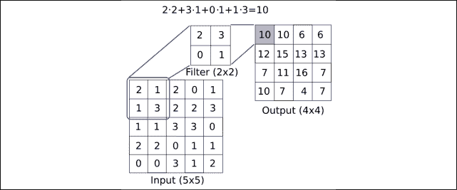
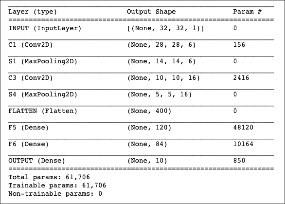
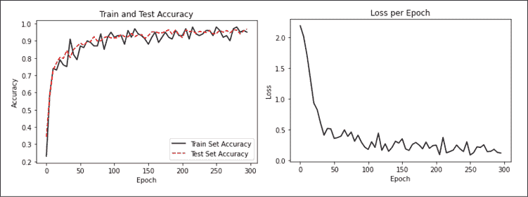
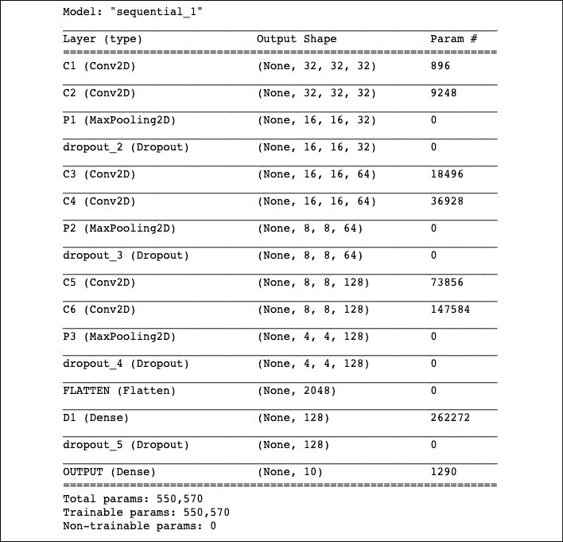
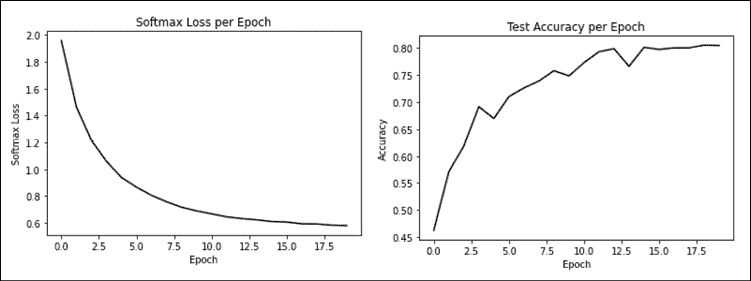
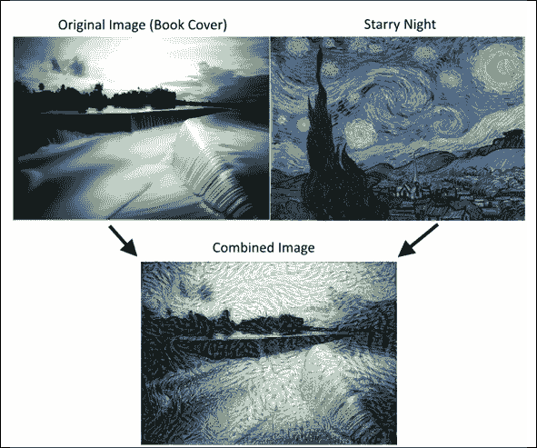
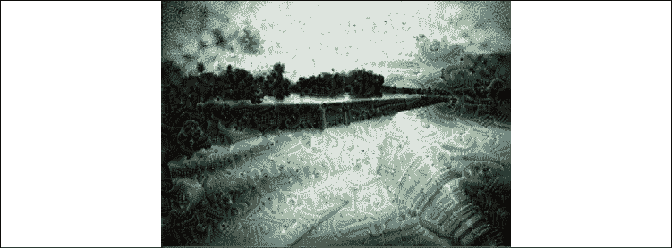

# 卷积神经网络

**卷积神经网络**（**CNNs**）是近年来图像识别领域取得重大突破的关键。在本章中，我们将讨论以下主题：

+   实现一个简单的 CNN

+   实现一个高级 CNN

+   重新训练现有的 CNN 模型

+   应用 StyleNet 和神经风格项目

+   实现 DeepDream

提醒读者，本章的所有代码可以在这里在线获取：[`github.com/PacktPublishing/Machine-Learning-Using-TensorFlow-Cookbook`](https://github.com/PacktPublishing/Machine-Learning-Using-TensorFlow-Cookbook)，以及 Packt 仓库：[`github.com/PacktPublishing/Machine-Learning-Using-TensorFlow-Cookbook`](https://github.com/PacktPublishing/Machine-Learning-Using-TensorFlow-Cookbook)。

# 介绍

在前面的章节中，我们讨论了**密集神经网络**（**DNNs**），其中一层的每个神经元都与相邻层的每个神经元相连接。在本章中，我们将重点介绍一种在图像分类中表现良好的特殊类型的神经网络：CNN。

CNN 是由两个组件组成的：一个特征提取模块，后接一个可训练的分类器。第一个组件包括一堆卷积、激活和池化层。一个 DNN 负责分类。每一层的神经元都与下一层的神经元相连接。

在数学中，卷积是一个应用于另一个函数输出的运算。在我们的例子中，我们考虑使用矩阵乘法（滤波器）作用于图像。对于我们的目的，我们将图像视为一个数字矩阵。这些数字可以代表像素或图像属性。我们将对这些矩阵应用卷积操作，方法是将一个固定宽度的滤波器在图像上移动，并使用逐元素相乘得到结果。

请参阅下图，以便更好地理解图像卷积的工作原理：



图 8.1：一个 2x2 的卷积滤波器应用于一个 5x5 的输入矩阵，生成一个新的 4x4 特征层

在*图 8.1*中，我们看到如何将卷积滤波器应用于图像（长×宽×深度），从而创建一个新的特征层。在这里，我们使用一个*2x2*的卷积滤波器，作用于*5x5*输入的有效空间，并且在两个方向上的步幅都为 1。结果是一个*4x4*的矩阵。这个新特征层突出了输入图像中激活滤波器最多的区域。

CNN 还具有其他操作来满足更多的需求，例如引入非线性（ReLU），或聚合参数（最大池化、平均池化）以及其他类似操作。上面的示例图展示了在一个*5x5*数组上应用卷积操作，卷积滤波器是一个*2x2*的矩阵。步幅为 1，并且我们只考虑有效的放置位置。在此操作中的可训练变量将是*2x2*滤波器的权重。

在卷积操作之后，通常会跟随一个聚合操作，例如最大池化。池化操作的目标是减少参数数量、计算负担和内存使用。最大池化保留了最强的特征。

以下图示提供了最大池化操作的一个示例。在这个例子中，池化操作的区域是一个 *2x2* 的区域，步长为 2。


图 8.2：在 4x4 输入图像上应用最大池化操作

*图 8.2* 展示了最大池化操作的工作原理。在这里，我们有一个 *2x2* 的窗口，在一个 *4x4* 的输入图像上滑动，步长为 2。结果是一个 *2x2* 的矩阵，它就是每个区域的最大值。

虽然我们将通过创建自己的 CNN 来进行图像识别，但我建议使用现有的架构，正如我们在本章其余部分将要做的那样。

通常我们会使用一个预训练的网络，并通过新的数据集和一个新的全连接层对其进行再训练。这种方法很有利，因为我们不必从零开始训练模型；我们只需要对预训练模型进行微调，以适应我们的新任务。我们将在本章稍后的 *重新训练现有的 CNN 模型* 部分进行演示，其中我们将重新训练现有架构，以提高 CIFAR-10 的预测性能。

不再拖延，我们立即开始实现一个简单的 CNN。

# 实现一个简单的 CNN

在这个实例中，我们将开发一个基于 LeNet-5 架构的 CNN，LeNet-5 首次由 Yann LeCun 等人于 1998 年提出，用于手写和机器打印字符的识别。


图 8.3：LeNet-5 架构 – 原始图像来源于 [LeCun 等人, 1998]

该架构由两组 CNN 组成，包含卷积-ReLU-最大池化操作，用于特征提取，随后是一个扁平化层和两个全连接层，用于分类图像。

我们的目标是提高对 MNIST 数字的预测准确性。

## 准备开始

要访问 MNIST 数据，Keras 提供了一个包（`tf.keras.datasets`），它具有出色的数据集加载功能。（请注意，TensorFlow 也提供了自己的现成数据集集合，通过 TF Datasets API。）加载数据后，我们将设置模型变量，创建模型，按批次训练模型，然后可视化损失、准确率和一些样本数字。

## 如何做到...

执行以下步骤：

1.  首先，我们将加载必要的库并启动图形会话：

    ```
    import matplotlib.pyplot as plt
    import numpy as np
    import tensorflow as tf 
    ```

1.  接下来，我们将加载数据并将图像重塑为四维矩阵：

    ```
    (x_train, y_train), (x_test, y_test) = tf.keras.datasets.mnist.load_data() 
    # Reshape
    x_train = x_train.reshape(-1, 28, 28, 1)
    x_test = x_test.reshape(-1, 28, 28, 1)
    #Padding the images by 2 pixels
    x_train = np.pad(x_train, ((0,0),(2,2),(2,2),(0,0)), 'constant')
    x_test = np.pad(x_test, ((0,0),(2,2),(2,2),(0,0)), 'constant') 
    ```

    请注意，这里下载的 MNIST 数据集包括训练集和测试集。该数据集由灰度图像（形状为(num_sample, 28, 28)的整数数组）和标签（范围为 0-9 的整数）组成。我们对图像进行了 2 像素的填充，因为在 LeNet-5 论文中，输入图像是*32x32*的。

1.  现在，我们将设置模型的参数。记住，图像的深度（通道数）是 1，因为这些图像是灰度图像。我们还将设置一个种子，以确保结果可复现：

    ```
    image_width = x_train[0].shape[0]
    image_height = x_train[0].shape[1]
    num_channels = 1 # grayscale = 1 channel
    seed = 98
    np.random.seed(seed)
    tf.random.set_seed(seed) 
    ```

1.  我们将声明我们的训练数据变量和测试数据变量。我们将为训练和评估使用不同的批次大小。你可以根据可用的物理内存调整这些大小：

    ```
    batch_size = 100
    evaluation_size = 500
    epochs = 300
    eval_every = 5 
    ```

1.  我们将对图像进行归一化，将所有像素的值转换为统一的尺度：

    ```
    x_train = x_train / 255
    x_test = x_test/ 255 
    ```

1.  现在我们将声明我们的模型。我们将有一个特征提取模块，由两个卷积/ReLU/最大池化层组成，接着是一个由全连接层构成的分类器。此外，为了使分类器能够工作，我们将特征提取模块的输出展平，以便可以在分类器中使用。请注意，我们在分类器的最后一层使用了 softmax 激活函数。Softmax 将数值输出（logits）转换为概率，使其总和为 1：

    ```
    input_data = tf.keras.Input(dtype=tf.float32, shape=(image_width,image_height, num_channels), name="INPUT")
    # First Conv-ReLU-MaxPool Layer
    conv1 = tf.keras.layers.Conv2D(filters=6,
                                   kernel_size=5,
                                   padding='VALID',
                                   activation="relu",
                                   name="C1")(input_data)
    max_pool1 = tf.keras.layers.MaxPool2D(pool_size=2,
                                          strides=2, 
                                          padding='SAME',
                                          name="S1")(conv1)
    # Second Conv-ReLU-MaxPool Layer
    conv2 = tf.keras.layers.Conv2D(filters=16,
                                   kernel_size=5,
                                   padding='VALID',
                                   strides=1,
                                   activation="relu",
                                   name="C3")(max_pool1)
    max_pool2 = tf.keras.layers.MaxPool2D(pool_size=2,
                                          strides=2, 
                                          padding='SAME',
                                          name="S4")(conv2)
    # Flatten Layer
    flatten = tf.keras.layers.Flatten(name="FLATTEN")(max_pool2)
    # First Fully Connected Layer
    fully_connected1 = tf.keras.layers.Dense(units=120,
                                             activation="relu",
                                             name="F5")(flatten)
    # Second Fully Connected Layer
    fully_connected2 = tf.keras.layers.Dense(units=84,
                                             activation="relu",
                                             name="F6")(fully_connected1)
    # Final Fully Connected Layer
    final_model_output = tf.keras.layers.Dense(units=10,
                                               activation="softmax",
                                               name="OUTPUT"
                                               )(fully_connected2)

    model = tf.keras.Model(inputs= input_data, outputs=final_model_output) 
    ```

1.  接下来，我们将使用 Adam（自适应矩估计）优化器来编译模型。Adam 使用自适应学习率和动量，使我们能够更快地达到局部最小值，从而加速收敛。由于我们的目标是整数，而不是独热编码格式，我们将使用稀疏分类交叉熵损失函数。然后，我们还将添加一个准确度指标，以评估模型在每个批次上的准确性：

    ```
    model.compile(
        optimizer="adam", 
        loss="sparse_categorical_crossentropy",
        metrics=["accuracy"] 
    ```

1.  接下来，我们打印网络的字符串摘要：

    ```
    model.summary() 
    ```

    

    图 8.4：LeNet-5 架构

    LeNet-5 模型有 7 层，包含 61,706 个可训练参数。现在，让我们开始训练模型。

1.  现在我们可以开始训练我们的模型了。我们通过随机选择的批次来遍历数据。每隔一段时间，我们选择在训练集和测试集批次上评估模型，并记录准确率和损失值。我们可以看到，经过 300 个周期后，我们很快在测试数据上达到了 96-97%的准确率：

    ```
    train_loss = []
    train_acc = []
    test_acc = []
    for i in range(epochs):
        rand_index = np.random.choice(len(x_train), size=batch_size)
        rand_x = x_train[rand_index]
        rand_y = y_train[rand_index]

        history_train = model.train_on_batch(rand_x, rand_y)

        if (i+1) % eval_every == 0:
            eval_index = np.random.choice(len(x_test), size=evaluation_size)
            eval_x = x_test[eval_index]
            eval_y = y_test[eval_index]

            history_eval = model.evaluate(eval_x,eval_y)

            # Record and print results
            train_loss.append(history_train[0])
            train_acc.append(history_train[1])
            test_acc.append(history_eval[1])
            acc_and_loss = [(i+1), history_train
     [0], history_train[1], history_eval[1]]
            acc_and_loss = [np.round(x,2) for x in acc_and_loss]
            print('Epoch # {}. Train Loss: {:.2f}. Train Acc (Test Acc): {:.2f} ({:.2f})'.format(*acc_and_loss)) 
    ```

1.  这将产生以下输出：

    ```
    Epoch # 5\. Train Loss: 2.19\. Train Acc (Test Acc): 0.23 (0.34)
    Epoch # 10\. Train Loss: 2.01\. Train Acc (Test Acc): 0.59 (0.58)
    Epoch # 15\. Train Loss: 1.71\. Train Acc (Test Acc): 0.74 (0.73)
    Epoch # 20\. Train Loss: 1.32\. Train Acc (Test Acc): 0.73 (0.77)
     ...
    Epoch # 290\. Train Loss: 0.18\. Train Acc (Test Acc): 0.95 (0.94)
    Epoch # 295\. Train Loss: 0.13\. Train Acc (Test Acc): 0.96 (0.96)
    Epoch # 300\. Train Loss: 0.12\. Train Acc (Test Acc): 0.95 (0.97) 
    ```

1.  以下是使用`Matplotlib`绘制损失和准确率的代码：

    ```
    # Matlotlib code to plot the loss and accuracy
    eval_indices = range(0, epochs, eval_every)
    # Plot loss over time
    plt.plot(eval_indices, train_loss, 'k-')
    plt.title('Loss per Epoch')
    plt.xlabel('Epoch')
    plt.ylabel('Loss')
    plt.show()
    # Plot train and test accuracy
    plt.plot(eval_indices, train_acc, 'k-', label='Train Set Accuracy')
    plt.plot(eval_indices, test_acc, 'r--', label='Test Set Accuracy')
    plt.title('Train and Test Accuracy')
    plt.xlabel('Epoch')
    plt.ylabel('Accuracy')
    plt.legend(loc='lower right')
    plt.show() 
    ```

    然后我们得到以下图表：

    

    图 8.5：左图是我们 300 个训练周期中训练集和测试集的准确率。右图是 300 个周期中的 softmax 损失值。

1.  如果我们想要绘制最新批次结果的示例，这里是绘制包含六个最新结果的样本的代码：

    ```
    # Plot some samples and their predictions
    actuals = y_test[30:36]
    preds = model.predict(x_test[30:36])
    predictions = np.argmax(preds,axis=1)
    images = np.squeeze(x_test[30:36])
    Nrows = 2
    Ncols = 3
    for i in range(6):
        plt.subplot(Nrows, Ncols, i+1)
        plt.imshow(np.reshape(images[i], [32,32]), cmap='Greys_r')
        plt.title('Actual: ' + str(actuals[i]) + ' Pred: ' + str(predictions[i]),
                                   fontsize=10)
        frame = plt.gca()
        frame.axes.get_xaxis().set_visible(False)
        frame.axes.get_yaxis().set_visible(False)
    plt.show() 
    ```

    上述代码的输出如下：

    

图 8.6：六个随机图像的图示，标题中包括实际值和预测值。左下角的图片被预测为 6，实际上它是 4。

使用一个简单的 CNN，我们在此数据集上取得了较好的准确率和损失结果。

## 它是如何工作的...

我们在 MNIST 数据集上的表现有所提升，构建了一个从零开始训练并迅速达到约 97%准确率的模型。我们的特征提取模块是卷积、ReLU 和最大池化的组合。我们的分类器是全连接层的堆叠。我们在批次大小为 100 的情况下进行训练，并查看了跨越各个 epoch 的准确率和损失情况。最后，我们还绘制了六个随机数字，发现模型预测失败，未能正确预测一张图片。模型预测为 6，实际上是 4。

CNN 在图像识别方面表现非常出色。部分原因在于卷积层生成其低级特征，当遇到图像中的重要部分时，这些特征会被激活。这种模型能够自我创建特征并将其用于预测。

## 还有更多...

在过去几年里，CNN 模型在图像识别方面取得了巨大进展。许多新颖的想法正在被探索，并且新的架构频繁被发现。该领域有一个庞大的科学论文库，名为 arXiv.org（[`arxiv.org/`](https://arxiv.org/)），由康奈尔大学创建和维护。arXiv.org 包含许多领域的最新文章，包括计算机科学及其子领域，如计算机视觉和图像识别（[`arxiv.org/list/cs.CV/recent`](https://arxiv.org/list/cs.CV/recent)）。

## 另见

这里有一些你可以用来了解 CNN 的优秀资源：

+   斯坦福大学有一个很好的维基，详情请见：[`scarlet.stanford.edu/teach/index.php/An_Introduction_to_Convolutional_Neural_Networks`](http://scarlet.stanford.edu/teach/index.php/An_Introduction_to_Convolutional_Neural_Networks)

+   *深度学习* 由 Michael Nielsen 编写，详情请见：[`neuralnetworksanddeeplearning.com/chap6.html`](http://neuralnetworksanddeeplearning.com/chap6.html)

+   *卷积神经网络简介* 由吴建新编写，详情请见：[`pdfs.semanticscholar.org/450c/a19932fcef1ca6d0442cbf52fec38fb9d1e5.pdf`](https://pdfs.semanticscholar.org/450c/a19932fcef1ca6d0442cbf52fec38fb9d1e5.pdf)

+   *LeNet-5，卷积神经网络* 由 Yann LeCun 编写：[`yann.lecun.com/exdb/lenet/`](http://yann.lecun.com/exdb/lenet/)

+   *基于梯度的学习应用于文档识别* 由 Yann LeCun 等人编写：[`yann.lecun.com/exdb/publis/pdf/lecun-01a.pdf`](http://yann.lecun.com/exdb/publis/pdf/lecun-01a.pdf)

# 实现一个高级 CNN

能够扩展 CNN 模型进行图像识别至关重要，这样我们才能理解如何增加网络的深度。这样，如果我们有足够的数据，我们可能提高预测的准确性。扩展 CNN 网络的深度是以标准方式进行的：我们只需重复卷积、最大池化和 ReLU 直到我们对深度感到满意。许多更精确的图像识别网络都是以这种方式运行的。

数据加载和预处理可能会让人头疼：大多数图像数据集过大，无法完全加载到内存中，但为了提高模型性能，图像预处理是必须的。我们可以使用 TensorFlow 的 `tf.data` API 创建输入管道。这个 API 提供了一套用于加载和预处理数据的工具。通过它，我们将从 CIFAR-10 数据集实例化一个 `tf.data.Dataset` 对象（通过 Keras 数据集 API `tf.keras.datasets` 下载），将该数据集的连续元素合并成批次，并对每张图像应用变换。另外，在图像识别数据中，通常会在训练前随机扰动图像。在这里，我们将随机裁剪、翻转并调整亮度。

## 准备就绪

在本食谱中，我们将实现一种更高级的图像数据读取方法，并使用一个更大的 CNN 对 CIFAR-10 数据集进行图像识别（[`www.cs.toronto.edu/~kriz/cifar.html`](https://www.cs.toronto.edu/~kriz/cifar.html)）。该数据集包含 60,000 张*32x32*的图像，属于 10 个可能类别中的一个。图像的潜在标签包括飞机、汽车、鸟、猫、鹿、狗、青蛙、马、船和卡车。请参阅*另见*部分的第一点。

官方的 TensorFlow `tf.data` 教程可以在本食谱末尾的*另见*部分找到。

## 如何操作...

执行以下步骤：

1.  首先，我们加载必要的库：

    ```
    import matplotlib.pyplot as plt
    import numpy as np
    import tensorflow as tf
    from tensorflow import keras 
    ```

1.  现在我们将声明一些数据集和模型参数，然后声明一些图像变换参数，例如随机裁剪图像的大小：

    ```
    # Set dataset and model parameters
    batch_size = 128
    buffer_size= 128
    epochs=20
    #Set transformation parameters
    crop_height = 24
    crop_width = 24 
    ```

1.  现在我们将使用 `keras.datasets` API 从 CIFAR-10 数据集中获取训练和测试图像。这个 API 提供了几个可以完全加载到内存的小型数据集，因此数据会以 NumPy 数组的形式表示（NumPy 是用于科学计算的核心 Python 库）：

    ```
    (x_train, y_train), (x_test, y_test) = tf.keras.datasets.cifar10.load_data() 
    ```

1.  接下来，我们将使用 `tf.data.Dataset` 从 NumPy 数组创建训练和测试的 TensorFlow 数据集，以便利用 `tf.data` API 构建一个灵活高效的图像管道：

    ```
    dataset_train = tf.data.Dataset.from_tensor_slices((x_train, y_train))
    dataset_test = tf.data.Dataset.from_tensor_slices((x_test, y_test)) 
    ```

1.  我们将定义一个读取函数，该函数将加载并稍微扭曲图像，以便使用 TensorFlow 内建的图像修改功能进行训练：

    ```
    # Define CIFAR reader
    def read_cifar_files(image, label):
        final_image = tf.image.resize_with_crop_or_pad(image, crop_width, crop_height)
        final_image = image / 255
        # Randomly flip the image horizontally, change the brightness and contrast
        final_image = tf.image.random_flip_left_right(final_image)
        final_image = tf.image.random_brightness(final_image,max_delta=0.1)
        final_image = tf.image.random_contrast(final_image,lower=0.5, upper=0.8)
        return final_image, label 
    ```

1.  现在我们有了一个图像处理管道函数和两个 TensorFlow 数据集，我们可以初始化训练图像管道和测试图像管道：

    ```
    dataset_train_processed = dataset_train.shuffle(buffer_size).batch(batch_size).map(read_cifar_files)
    dataset_test_processed = dataset_test.batch(batch_size).map(lambda image,label: read_cifar_files(image, label, False)) 
    ```

    请注意，在这个例子中，我们的输入数据适合内存，因此我们使用`from_tensor_slices()`方法将所有图像转换为`tf.Tensor`。但是`tf.data` API 允许处理不适合内存的大型数据集。对数据集的迭代是以流式传输的方式进行的。

1.  接下来，我们可以创建我们的序列模型。我们将使用的模型有两个卷积层，后面跟着三个全连接层。两个卷积层将分别创建 64 个特征。第一个全连接层将第二个卷积层与 384 个隐藏节点连接起来。第二个全连接操作将这 384 个隐藏节点连接到 192 个隐藏节点。最后一个隐藏层操作将这 192 个节点连接到我们要预测的 10 个输出类别。在最后一层我们将使用 softmax 函数，因为一张图片只能取一个确切的类别，所以输出应该是对这 10 个目标的概率分布：

    ```
    model = keras.Sequential(
        [# First Conv-ReLU-Conv-ReLU-MaxPool Layer
         tf.keras.layers.Conv2D(input_shape=[32,32,3],
                                filters=32,
                                kernel_size=3,
                                padding='SAME',
                                activation="relu",
                                kernel_initializer='he_uniform',
                                name="C1"),
        tf.keras.layers.Conv2D(filters=32,
                               kernel_size=3,
                               padding='SAME',
                               activation="relu",
                               kernel_initializer='he_uniform',
                               name="C2"),
         tf.keras.layers.MaxPool2D((2,2),
                                   name="P1"),
         tf.keras.layers.Dropout(0.2),
        # Second Conv-ReLU-Conv-ReLU-MaxPool Layer
         tf.keras.layers.Conv2D(filters=64,
                                kernel_size=3,
                                padding='SAME',
                                activation="relu",
                                kernel_initializer='he_uniform',
                                name="C3"),
        tf.keras.layers.Conv2D(filters=64,
                               kernel_size=3,
                               padding='SAME',
                               activation="relu",
                               kernel_initializer='he_uniform',
                               name="C4"),
         tf.keras.layers.MaxPool2D((2,2),
                                   name="P2"),
         tf.keras.layers.Dropout(0.2),
        # Third Conv-ReLU-Conv-ReLU-MaxPool Layer
         tf.keras.layers.Conv2D(filters=128,
                                kernel_size=3,
                                padding='SAME',
                                activation="relu",
                                kernel_initializer='he_uniform',
                                name="C5"),
        tf.keras.layers.Conv2D(filters=128,
                               kernel_size=3,
                               padding='SAME',
                               activation="relu",
                               kernel_initializer='he_uniform',
                               name="C6"),
         tf.keras.layers.MaxPool2D((2,2),
                                   name="P3"),
         tf.keras.layers.Dropout(0.2),
         # Flatten Layer
         tf.keras.layers.Flatten(name="FLATTEN"),
         # Fully Connected Layer
         tf.keras.layers.Dense(units=128,
                               activation="relu",
                               name="D1"),
        tf.keras.layers.Dropout(0.2),
        # Final Fully Connected Layer
        tf.keras.layers.Dense(units=10,
                              activation="softmax",
                              name="OUTPUT")
        ]) 
    ```

1.  现在我们将编译我们的模型。我们的损失将是分类交叉熵损失。我们添加了一个精度度量，它接收模型预测的 logits 和实际目标，并返回用于记录训练/测试集统计信息的准确率。我们还运行 summary 方法以打印一个总结页面：

    ```
    model.compile(loss="sparse_categorical_crossentropy",
        metrics=["accuracy"]
    )
    model.summary() 
    ```

    

    图 8.7：模型摘要由 3 个 VGG 块组成（VGG - Visual Geometry Group - 块是一系列卷积层，后跟用于空间下采样的最大池化层），随后是一个分类器。

1.  现在我们拟合模型，通过我们的训练和测试输入管道进行循环。我们将保存训练损失和测试准确率：

    ```
    history = model.fit(dataset_train_processed, 
                        validation_data=dataset_test_processed, 
                        epochs=epochs) 
    ```

1.  最后，这里是一些`Matplotlib`代码，将绘制整个训练过程中的损失和测试准确率：

    ```
    # Print loss and accuracy
    # Matlotlib code to plot the loss and accuracy
    epochs_indices = range(0, 10, 1)
    # Plot loss over time
    plt.plot(epochs_indices, history.history["loss"], 'k-')
    plt.title('Softmax Loss per Epoch')
    plt.xlabel('Epoch')
    plt.ylabel('Softmax Loss')
    plt.show()
    # Plot accuracy over time
    plt.plot(epochs_indices, history.history["val_accuracy"], 'k-')
    plt.title('Test Accuracy per Epoch')
    plt.xlabel('Epoch')
    plt.ylabel('Accuracy')
    plt.show() 
    ```

    我们为这个配方得到以下图表：

    

图 8.8：训练损失在左侧，测试准确率在右侧。对于 CIFAR-10 图像识别 CNN，我们能够在测试集上达到大约 80%的准确率。

## 它是如何工作的...

在我们下载了 CIFAR-10 数据之后，我们建立了一个图像管道。我们使用这个训练和测试管道来尝试预测图像的正确类别。到最后，模型在测试集上达到了大约 80%的准确率。我们可以通过使用更多数据、微调优化器或增加更多 epochs 来达到更高的准确率。

## 另请参阅

+   有关 CIFAR-10 数据集的更多信息，请参阅《从小图像中学习多层特征》，Alex Krizhevsky，2009：[`www.cs.toronto.edu/~kriz/learning-features-2009-TR.pdf`](https://www.cs.toronto.edu/~kriz/learning-features-2009-TR.pdf)。

+   `tf.data` TensorFlow 教程：[`www.tensorflow.org/guide/data`](https://www.tensorflow.org/guide/data)。

+   面向工程师的 Keras 简介（数据加载和预处理）：[`keras.io/getting_started/intro_to_keras_for_engineers/#data-loading-amp-preprocessing`](https://keras.io/getting_started/intro_to_keras_for_engineers/#data-loading-amp-preprocessing)。

# 重新训练现有的 CNN 模型

从零开始训练一个新的图像识别模型需要大量时间和计算资源。如果我们能拿一个预训练的网络，并用我们的图像重新训练它，可能会节省计算时间。在这个方案中，我们将展示如何使用一个预训练的 TensorFlow 图像识别模型，并对其进行微调，以便处理不同的图像集。

我们将演示如何使用来自预训练网络的迁移学习来处理 CIFAR-10。这个方法的思路是重用先前模型中卷积层的权重和结构，并重新训练网络顶部的全连接层。这个方法被称为**微调**。

## 准备就绪

我们将使用的 CNN 网络采用一种非常流行的架构，叫做**Inception**。Inception CNN 模型由谷歌创建，在许多图像识别基准测试中表现出色。详细信息请参见*另见*部分第二个项目中提到的论文。

我们将介绍的主要 Python 脚本展示了如何获取 CIFAR-10 图像数据，并将其转换为 Inception 重训练格式。之后，我们将再次说明如何在我们的图像上训练 Inception v3 网络。

## 如何实现...

执行以下步骤：

1.  我们将从加载必要的库开始：

    ```
    import tensorflow as tf
    from tensorflow import keras
    from tensorflow.keras.applications.inception_v3 import InceptionV3
    from tensorflow.keras.applications.inception_v3 import preprocess_input, decode_predictions 
    ```

1.  我们现在将设置稍后通过`tf.data.Dataset` API 使用的参数：

    ```
    batch_size = 32
    buffer_size= 1000 
    ```

1.  现在，我们将下载 CIFAR-10 数据，并声明用于稍后保存图像时引用的 10 个类别：

    ```
    (x_train, y_train), (x_test, y_test) = tf.keras.datasets.cifar10.load_data()
    objects = ['airplane', 'automobile', 'bird', 'cat', 'deer',
               'dog', 'frog', 'horse', 'ship', 'truck'] 
    ```

1.  然后，我们将使用`tf.data.Dataset`初始化数据管道，用于训练和测试数据集：

    ```
    dataset_train = tf.data.Dataset.from_tensor_slices((x_train, y_train))
    dataset_test = tf.data.Dataset.from_tensor_slices((x_test, y_test)) 
    ```

1.  Inception v3 在 ImageNet 数据集上进行过预训练，因此我们的 CIFAR-10 图像必须与这些图像的格式匹配。预期的宽度和高度应不小于 75，因此我们将图像调整为*75x75*的空间大小。然后，图像应该被归一化，我们将对每张图像应用 Inception 预处理任务（`preprocess_input`方法）。

    ```
    def preprocess_cifar10(img, label):
        img = tf.cast(img, tf.float32)
        img = tf.image.resize(img, (75, 75))
    return tf.keras.applications.inception_v3.preprocess_input(img) , label
    dataset_train_processed = dataset_train.shuffle(buffer_size).batch(batch_size).map(preprocess_cifar10)
    dataset_test_processed = dataset_test.batch(batch_size).map(preprocess_cifar10) 
    ```

1.  现在，我们将基于 InceptionV3 模型创建我们的模型。我们将使用`tensorflow.keras.applications` API 加载 InceptionV3 模型。该 API 包含可以用于预测、特征提取和微调的预训练深度学习模型。然后，我们将加载没有分类头的权重。

    ```
    inception_model = InceptionV3(
        include_top=False,
        weights="imagenet",
        input_shape=(75,75,3)
    ) 
    ```

1.  我们在 InceptionV3 模型的基础上构建自己的模型，添加一个具有三层全连接层的分类器。

    ```
    x = inception_model.output
    x= keras.layers.GlobalAveragePooling2D()(x)
    x = keras.layers.Dense(1024, activation="relu")(x)
    x = keras.layers.Dense(128, activation="relu")(x)
    output = keras.layers.Dense(10, activation="softmax")(x)
    model=keras.Model(inputs=inception_model.input, outputs = output) 
    ```

1.  我们将把 Inception 的基础层设置为不可训练。只有分类器的权重会在反向传播阶段更新（Inception 的权重不会更新）：

    ```
    for inception_layer in inception_model.layers:
        inception_layer.trainable= False 
    ```

1.  现在我们将编译我们的模型。我们的损失函数将是分类交叉熵损失。我们添加了一个精度指标，该指标接收模型预测的对数和实际目标，并返回用于记录训练/测试集统计数据的精度：

    ```
    model.compile(optimizer="adam", loss="sparse_categorical_crossentropy", metrics=["accuracy"]) 
    ```

1.  现在我们将拟合模型，通过我们的训练和测试输入流水线循环进行：

    ```
    model.fit(x=dataset_train_processed , 
              validation_data=dataset_test_processed) 
    ```

1.  到最后，该模型在测试集上达到了约 63% 的准确率：

    ```
    loss: 1.1316 - accuracy: 0.6018 - val_loss: 1.0361 - val_accuracy: 0.6366... 
    ```

## 它是如何工作的...

在下载了 CIFAR-10 数据之后，我们建立了一个图像流水线来将图像转换为所需的 Inception 格式。我们在 InceptionV3 模型之上添加了一个分类器，并对其进行了训练，以预测 CIFAR-10 图像的正确类别。到最后，该模型在测试集上达到了约 63% 的准确率。请记住，我们正在微调模型并重新训练顶部的全连接层，以适应我们的十类数据。

## 参见

+   TensorFlow Inception-v3 文档：[`www.tensorflow.org/api_docs/python/tf/keras/applications/inception_v3`](https://www.tensorflow.org/api_docs/python/tf/keras/applications/inception_v3)

+   Keras Applications 文档：[`keras.io/api/applications/`](https://keras.io/api/applications/)

+   GoogLeNet Inception-v3 论文：[`arxiv.org/abs/1512.00567`](https://arxiv.org/abs/1512.00567)

# 应用 StyleNet 和神经风格项目

一旦我们训练了一个图像识别的 CNN，我们可以使用网络本身进行一些有趣的数据和图像处理。StyleNet 是一个过程，试图从一个图片中学习风格，并将其应用到第二张图片，同时保持第二张图片的结构（或内容）不变。为了做到这一点，我们必须找到与风格强相关的中间 CNN 节点，独立于图片内容。

StyleNet 是一个过程，它接受两幅图像并将一幅图像的风格应用到第二幅图像的内容上。它基于 2015 年 Leon Gatys 的著名论文，*A Neural Algorithm of Artistic Style*（参见下一节*参见*部分下的第一条）进行操作。作者在一些 CNN 中发现了一种包含中间层的特性。其中一些似乎编码了图片的风格，而另一些则编码了其内容。因此，如果我们在风格图片上训练风格层，并在原始图片上训练内容层，并反向传播这些计算出的损失，我们就可以将原始图片更改为更像风格图片。

## 准备工作

这个食谱是官方 TensorFlow 神经风格迁移的改编版本，可在本食谱结尾的*参见*部分找到。

为了实现这一点，我们将使用 Gatys 在*A Neural Algorithm of Artistic Style*中推荐的网络，称为**imagenet-vgg-19**。

## 如何做...

执行以下步骤：

1.  首先，我们将通过加载必要的库启动我们的 Python 脚本：

    ```
    import imageio
    import numpy as np
    from skimage.transform import resize
    import tensorflow as tf
    import matplotlib.pyplot as plt
    import matplotlib as mpl
    import IPython.display as display
    import PIL.Image 
    ```

1.  然后，我们可以声明两张图像的位置：原始图像和风格图像。对于我们的示例，我们将使用本书的封面图像作为原始图像；风格图像我们将使用文森特·凡高的 *《星夜》*。你也可以使用任何你想要的两张图片。如果你选择使用这些图片，它们可以在本书的 GitHub 网站上找到，[`github.com/PacktPublishing/Machine-Learning-Using-TensorFlow-Cookbook`](https://github.com/PacktPublishing/Machine-Learning-Using-TensorFlow-Cookbook)（导航到 StyleNet 部分）：

    ```
    content_image_file = 'images/book_cover.jpg' 
    style_image_file = 'images/starry_night.jpg' 
    ```

1.  现在，我们将使用 `scipy` 加载两张图像，并调整风格图像的大小，使其与内容图像的尺寸相符：

    ```
    # Read the images
    content_image = imageio.imread(content_image_file)
    style_image = imageio.imread(style_image_file)
    content_image = tf.image.convert_image_dtype(content_image, tf.float32)
    style_image = tf.image.convert_image_dtype(style_image, tf.float32)
    # Get shape of target and make the style image the same
    target_shape = content_image.shape
    style_image = resize(style_image, target_shape) 
    ```

1.  接下来，我们将展示内容图像和风格图像：

    ```
    mpl.rcParams['figure.figsize'] = (12,12)
    mpl.rcParams['axes.grid'] = False
    plt.subplot(1, 2, 1)
    plt.imshow(content_image)
    plt.title("Content Image")
    plt.subplot(1, 2, 2)
    plt.imshow(style_image)
    plt.title("Style Image") 
    ```

    

    图 8.9：示例内容和风格图像

1.  现在，我们将加载在 ImageNet 上预训练的 VGG-19 模型，但不包括分类头。我们将使用 `tensorflow.keras.applications` API。这个 API 包含了可用于预测、特征提取和微调的预训练深度学习模型。

    ```
    vgg = tf.keras.applications.VGG19(include_top=False, weights='imagenet')
    vgg.trainable = False 
    ```

1.  接下来，我们将展示 VGG-19 的架构：

    ```
    [layer.name for layer in vgg.layers] 
    ```

1.  在神经风格迁移中，我们希望将一张图像的风格应用到另一张图像的内容上。卷积神经网络（CNN）由多个卷积层和池化层组成。卷积层提取复杂特征，而池化层提供空间信息。Gatys 的论文推荐了一些策略，用于为内容图像和风格图像分配中间层。我们应当保留 `block4_conv2` 作为内容图像的层，可以尝试其他 `blockX_conv1` 层输出的不同组合来作为风格图像的层：

    ```
    content_layers = ['block4_conv2', 'block5_conv2']
    style_layers = ['block1_conv1', 'block2_conv1', 'block3_conv1', 'block4_conv1', 'block5_conv1']
    num_content_layers = len(content_layers)
    num_style_layers = len(style_layers) 
    ```

1.  虽然中间特征图的值代表了图像的内容，但风格可以通过这些特征图的均值和相关性来描述。在这里，我们定义了 Gram 矩阵来捕捉图像的风格。Gram 矩阵衡量每个特征图之间的相关性程度。这个计算是针对每个中间特征图进行的，只获得图像的纹理信息。注意，我们会丢失关于图像空间结构的信息。

    ```
    def gram_matrix(input_tensor):
      result = tf.linalg.einsum('bijc,bijd->bcd', input_tensor, input_tensor)
      input_shape = tf.shape(input_tensor)
      num_locations = tf.cast(input_shape[1]*input_shape[2], tf.float32)
      return result/(num_locations) 
    ```

1.  接下来，我们构建一个模型，返回包含每个层名称及其相关内容/风格张量的风格和内容字典。Gram 矩阵应用于风格层：

    ```
    class StyleContentModel(tf.keras.models.Model):
      def __init__(self, style_layers, content_layers):
        super(StyleContentModel, self).__init__()
        self.vgg = tf.keras.applications.VGG19(include_top=False, weights='imagenet')
        outputs = [vgg.get_layer(name).output for name in style_layers + content_layers]
        self.vgg = tf.keras.Model([vgg.input], outputs)
        self.style_layers = style_layers
        self.content_layers = content_layers
        self.num_style_layers = len(style_layers)
        self.vgg.trainable = False
      def call(self, inputs):
        "Expects float input in [0,1]"
        inputs = inputs*255.0
        inputs = inputs[tf.newaxis, :]
        preprocessed_input = tf.keras.applications.vgg19.preprocess_input(inputs)
        outputs = self.vgg(preprocessed_input)
        style_outputs, content_outputs = (outputs[:self.num_style_layers], 
                                                                outputs[self.num_style_layers:])
        style_outputs = [gram_matrix(style_output)
                         for style_output in style_outputs]
        content_dict = {content_name:value 
                        for content_name, value 
                        in zip(self.content_layers, content_outputs)}
        style_dict = {style_name:value
                      for style_name, value
                      in zip(self.style_layers, style_outputs)}

        return {'content':content_dict, 'style':style_dict} 
    ```

1.  设置风格和内容的目标值，它们将用于损失计算：

    ```
    extractor = StyleContentModel(style_layers, content_layers)
    style_targets = extractor(style_image)['style']
    content_targets = extractor(content_image)['content'] 
    ```

1.  Adam 和 LBFGS 通常会有相同的误差并且很快收敛，但 LBFGS 在处理大图像时优于 Adam。虽然论文推荐使用 LBFGS，由于我们的图像较小，我们将选择 Adam 优化器。

    ```
    #Optimizer configuration
    learning_rate = 0.05
    beta1 = 0.9
    beta2 = 0.999
    opt = tf.optimizers.Adam(learning_rate=learning_rate, beta_1=beta1, beta_2=beta2) 
    ```

1.  接下来，我们将计算总损失，它是内容损失和风格损失的加权和：

    ```
    content_weight = 5.0
    style_weight = 1.0 
    ```

1.  内容损失将比较我们的原始图像和当前图像（通过内容层特征）。风格损失将比较我们预先计算的风格特征与输入图像中的风格特征。第三个也是最终的损失项将有助于平滑图像。我们在这里使用总变差损失来惩罚相邻像素的剧烈变化，如下所示：

    ```
    def style_content_loss(outputs):
        style_outputs = outputs['style']
        content_outputs = outputs['content']
        style_loss = tf.add_n([tf.reduce_mean((style_outputs[name]-style_targets[name])**2) 
                               for name in style_outputs.keys()])
        style_loss *= style_weight / num_style_layers
        content_loss = tf.add_n([tf.reduce_mean((content_outputs[name]-content_targets[name])**2) 
                              for name in content_outputs.keys()])
        content_loss *= content_weight / num_content_layers
        loss = style_loss + content_loss
        return loss 
    ```

1.  接下来，我们声明一个工具函数。由于我们有一个浮动图像，需要将像素值保持在 0 和 1 之间：

    ```
    def clip_0_1(image):
      return tf.clip_by_value(image, clip_value_min=0.0, clip_value_max=1.0) 
    ```

1.  现在，我们声明另一个工具函数，将张量转换为图像：

    ```
    def tensor_to_image(tensor):
      tensor = tensor*255
      tensor = np.array(tensor, dtype=np.uint8)
      if np.ndim(tensor)>3:
        assert tensor.shape[0] == 1
        tensor = tensor[0]
      return PIL.Image.fromarray(tensor) 
    ```

1.  接下来，我们使用梯度带运行梯度下降，生成我们的新图像，并显示如下：

    ```
    epochs = 100
    image = tf.Variable(content_image)
    for generation in range(epochs):

        with tf.GradientTape() as tape:
            outputs = extractor(image)
            loss = style_content_loss(outputs)
        grad = tape.gradient(loss, image)
        opt.apply_gradients([(grad, image)])
        image.assign(clip_0_1(image))
        print(".", end='')
    display.display(tensor_to_image(image)) 
    ```

    

图 8.10：使用 StyleNet 算法将书籍封面图像与《星夜》结合

请注意，可以通过更改内容和样式权重来使用不同的强调方式。

## 它是如何工作的…

我们首先加载了两张图像，然后加载了预训练的网络权重，并将层分配给内容图像和风格图像。我们计算了三个损失函数：内容图像损失、风格损失和总变差损失。然后，我们训练了随机噪声图片，以使用风格图像的风格和原始图像的内容。风格迁移可以用于照片和视频编辑应用、游戏、艺术、虚拟现实等。例如，在 2019 年游戏开发者大会上，Google 推出了 Stadia，可以实时改变游戏的艺术风格。其实时演示视频可在本食谱最后的*另见*部分查看。

## 另见

+   *艺术风格的神经算法*，由 Gatys、Ecker、Bethge 著，2015 年：[`arxiv.org/abs/1508.06576`](https://arxiv.org/abs/1508.06576)

+   Leon Gatys 在 2016 年 CVPR（*计算机视觉与模式识别*）上的演讲推荐视频可以在这里查看：[`www.youtube.com/watch?v=UFffxcCQMPQ`](https://www.youtube.com/watch?v=UFffxcCQMPQ)

+   要查看神经风格迁移过程的原始 TensorFlow 代码，请参见[`www.tensorflow.org/tutorials/generative/style_transfer`](https://www.tensorflow.org/tutorials/generative/style_transfer)

+   若要深入了解理论，请参见[`towardsdatascience.com/neural-style-transfer-tutorial-part-1-f5cd3315fa7f`](https://towardsdatascience.com/neural-style-transfer-tutorial-part-1-f5cd3315fa7f)

+   Google Stadia – 风格迁移 ML：[`stadiasource.com/article/2/Stadia-Introducing-Style-Transfer-ML-GDC2019`](https://stadiasource.com/article/2/Stadia-Introducing-Style-Transfer-ML-GDC2019)

# 实现 DeepDream

训练好的 CNN 还有一个用途，那就是利用一些中间节点检测标签特征（例如，猫的耳朵或鸟的羽毛）。利用这一点，我们可以找到将任何图像转化为反映这些节点特征的方式，适用于我们选择的任何节点。这个教程是官方 TensorFlow DeepDream 教程的改编版本（参见下文 *另见* 部分的第一个项目）。欢迎访问 DeepDream 的创造者亚历山大·莫尔维茨夫（Alexander Mordvintsev）在 Google AI 博客上写的文章（下文 *另见* 部分的第二个项目）。希望通过这个教程，能够帮助你使用 DeepDream 算法探索 CNN 和其中创建的特征。

## 准备工作

最初，这项技术是为了更好地理解 CNN 如何“看”图像而发明的。DeepDream 的目标是过度解读模型检测到的模式，并生成具有超现实模式的激发性视觉内容。这种算法是一种新型的迷幻艺术。

## 如何进行操作…

执行以下步骤：

1.  要开始使用 DeepDream，我们首先需要加载必要的库：

    ```
    import numpy as np
    import PIL.Image
    import imageio
    import matplotlib.pyplot as plt
    import matplotlib as mpl
    import tensorflow as tf
    import IPython.display as display 
    ```

1.  我们将准备图像进行梦幻化处理。我们将读取原始图像，将其重塑为最大 500 尺寸，并显示出来：

    ```
    # Read the images	
    original_img_file = path + 'images/book_cover.jpg' 
    original_img = imageio.imread(original_img_file)
    # Reshape to 500 max dimension
    new_shape = tf.cast((500, 500 * original_img.shape[1] / original_img.shape[0]), tf.int32)
    original_img = tf.image.resize(original_img, new_shape, method='nearest').numpy()
    # Display the image
    mpl.rcParams['figure.figsize'] = (20,6)
    mpl.rcParams['axes.grid'] = False
    plt.imshow(original_img)
    plt.title("Original Image") 
    ```

1.  我们将加载在 ImageNet 上预训练的 Inception 模型，并去除分类头。我们将使用 `tf.keras.applications` API：

    ```
    inception_model = tf.keras.applications.InceptionV3(include_top=False, weights='imagenet') 
    ```

1.  我们总结了这个模型。我们可以注意到，Inception 模型相当庞大：

    ```
    inception_model.summary() 
    ```

1.  接下来，我们将选择用于后续 DeepDream 处理的卷积层。在 CNN 中，较早的层提取基本特征，如边缘、形状、纹理等，而较深的层则提取高级特征，如云、树木或鸟类。为了创建 DeepDream 图像，我们将专注于卷积层混合的地方。现在，我们将创建一个以这两个混合层为输出的特征提取模型：

    ```
    names = ['mixed3', 'mixed5']
    layers = [inception_model.get_layer(name).output for name in names]
    deep_dream_model = tf.keras.Model(inputs=inception_model.input, outputs=layers) 
    ```

1.  现在我们将定义损失函数，返回所有输出层的总和：

    ```
    def compute_loss(img, model):
      # Add a dimension to the image to have a batch of size 1.
      img_batch = tf.expand_dims(img, axis=0)
      # Apply the model to the images and get the outputs to retrieve the activation.
      layer_activations = model(img_batch)

      # Compute the loss for each layer
      losses = []
      for act in layer_activations:
        loss = tf.math.reduce_mean(act)
        losses.append(loss)
      return  tf.reduce_sum(losses) 
    ```

1.  我们声明了两个实用函数，用于撤销缩放并显示处理后的图像：

    ```
    def deprocess(img):
      img = 255*(img + 1.0)/2.0
      return tf.cast(img, tf.uint8)
    def show(img):
      display.display(PIL.Image.fromarray(np.array(img))) 
    ```

1.  接下来，我们将应用梯度上升过程。在 DeepDream 中，我们不是通过梯度下降最小化损失，而是通过梯度上升最大化这些层的激活，通过最大化它们的损失。这样，我们会过度解读模型检测到的模式，并生成具有超现实模式的激发性视觉内容：

    ```
    def run_deep_dream(image, steps=100, step_size=0.01):
        # Apply the Inception preprocessing
        image = tf.keras.applications.inception_v3.preprocess_input(image)
        image = tf.convert_to_tensor(image)
        loss = tf.constant(0.0)
        for n in tf.range(steps):
            # We use gradient tape to track TensorFlow computations
            with tf.GradientTape() as tape:
                # We use watch to force TensorFlow to track the image
                tape.watch(image)
                # We compute the loss
                loss = compute_loss(image, deep_dream_model)
            # Compute the gradients
            gradients = tape.gradient(loss, image)
            # Normalize the gradients.
            gradients /= tf.math.reduce_std(gradients) + 1e-8 

            # Perform the gradient ascent by directly adding the gradients to the image
            image = image + gradients*step_size
            image = tf.clip_by_value(image, -1, 1)
            # Display the intermediate image
            if (n % 100 ==0):
                display.clear_output(wait=True)
                show(deprocess(image))
                print ("Step {}, loss {}".format(n, loss))
        # Display the final image
        result = deprocess(image)
        display.clear_output(wait=True)
        show(result)
        return result 
    ```

1.  然后，我们将在原始图像上运行 DeepDream：

    ```
    dream_img = run_deep_dream(image=original_img, 
                               steps=100, step_size=0.01) 
    ```

    输出结果如下：

    

    图 8.11：DeepDream 应用于原始图像

    虽然结果不错，但还是可以做得更好！我们注意到图像输出很杂乱，模式似乎以相同的粒度应用，并且输出分辨率较低。

1.  为了改善图像，我们可以使用“八度”概念。我们对同一张图像进行梯度上升，并多次调整图像大小（每次增大图像的大小就是一次八度的改进）。通过这个过程，较小尺度上检测到的特征可以应用到更高尺度上，展现出更多细节的图案。

    ```
    OCTAVE_SCALE = 1.30
    image = tf.constant(np.array(original_img))
    base_shape = tf.shape(image)[:-1]
    float_base_shape = tf.cast(base_shape, tf.float32)
    for n in range(-2, 3):
        # Increase the size of the image
        new_shape = tf.cast(float_base_shape*(OCTAVE_SCALE**n), tf.int32)
        image = tf.image.resize(image, new_shape).numpy()
        # Apply deep dream
        image = run_deep_dream(image=image, steps=50, step_size=0.01)
    # Display output
    display.clear_output(wait=True)
    image = tf.image.resize(image, base_shape)
    image = tf.image.convert_image_dtype(image/255.0, dtype=tf.uint8)
    show(image) 
    ```

    输出结果如下：

    

图 8.12：应用八度概念后的原始图像 DeepDream

通过使用八度概念，结果变得非常有趣：输出变得不那么嘈杂，网络能更好地放大它所看到的图案。

## 还有更多...

我们建议读者使用官方的 DeepDream 教程作为进一步了解的来源，同时也可以访问原始的 Google 研究博客文章，了解 DeepDream（请参阅以下 *另见* 部分）。

## 另见

+   TensorFlow 深度梦境教程：[`www.tensorflow.org/tutorials/generative/deepdream`](https://www.tensorflow.org/tutorials/generative/deepdream)

+   原始的 Google 研究博客文章关于 DeepDream：[`research.googleblog.com/2015/06/inceptionism-going-deeper-into-neural.html`](https://research.googleblog.com/2015/06/inceptionism-going-deeper-into-neural.html)
