# 卷积神经网络进行图像分类

**卷积神经网络**（**CNNs**）是进行图像分类时的首选算法。在 1960 年代，神经科学家 Hubel 和 Wiesel 对猫和猴子的视觉皮层进行了研究。他们的工作揭示了我们如何以层次结构处理视觉信息，展示了视觉系统是如何组织成一系列层次的，每一层都负责视觉处理的不同方面。这一发现为他们赢得了诺贝尔奖，但更重要的是，它为 CNN 的构建奠定了基础。CNN 本质上非常适合处理具有空间结构的数据，例如图像。

然而，在早期，由于多种因素的影响，例如训练数据不足、网络架构不成熟、计算资源匮乏，以及缺乏现代技术（如数据增强和丢弃法），CNN 未能获得广泛关注。在 2012 年 ImageNet 大规模视觉识别挑战赛中，一种名为 AlexNet 的 CNN 架构震惊了**机器学习**（**ML**）社区，它比其他所有方法都超出了一个较大的优势。今天，机器学习从业者通过应用 CNN，在计算机视觉任务（如图像分类、图像分割和目标检测等）中取得了最先进的表现。

在本章中，我们将研究 CNN，看看它们与我们迄今为止使用的全连接神经网络有什么不同。我们将从全连接网络在处理图像数据时面临的挑战开始，接着探索 CNN 的结构。我们将研究 CNN 架构的核心构建模块及其对网络性能的整体影响。接下来，我们将使用 Fashion MNIST 数据集构建一个图像分类器，然后开始构建一个真实世界的图像分类器。我们将处理不同大小的彩色图像，且图像中的目标物体位置不同。

本章结束时，您将对卷积神经网络（CNN）有一个清晰的理解，并了解为什么在图像分类任务中，它们比全连接网络更具优势。此外，您还将能够在真实世界的图像分类问题中，构建、训练、调整和测试 CNN 模型。

本章我们将讨论以下主题：

+   CNN 的结构解析

+   使用 CNN 进行 Fashion MNIST 分类

+   真实世界的图像

+   天气数据分类

+   应用超参数以提高模型的性能

+   评估图像分类器

# 使用全连接网络进行图像识别的挑战

在*第五章*《使用神经网络进行图像分类》中，我们将**深度神经网络**（**DNN**）应用于时尚 MNIST 数据集。我们看到输入层中的每个神经元都与隐藏层中的每个神经元相连，而隐藏层中的神经元又与输出层中的神经元相连，因此称为*全连接*。虽然这种架构可以解决许多机器学习问题，但由于图像数据的空间特性，它并不适合用于图像分类任务。假设你正在看一张人脸的照片；人脸特征的位置和朝向使得即便你只专注于某个特定特征（例如眼睛），你也能知道那是一张人脸。你本能地通过人脸各个特征之间的空间关系知道它是一张人脸；然而，DNN 在查看图像时无法看到这种全貌。它们将图像中的每个像素处理为独立的特征，而没有考虑这些特征之间的空间关系。

使用全连接架构的另一个问题是维度灾难。假设我们正在处理一张尺寸为 150 x 150、具有 3 个颜色通道的真实世界图像，**红色、绿色和蓝色**（**RGB**）；我们将有一个 67,500 的输入大小。由于所有神经元都与下一层的神经元相连，如果我们将这些值输入到一个拥有 500 个神经元的隐藏层中，那么参数数量将为 67,500 x 500 = 33,750,000，并且随着我们增加更多层，这个参数数量将呈指数级增长，使得将这种网络应用于图像分类任务变得资源密集。我们可能还会遇到的另一个问题是过拟合；这是由于网络中大量参数的存在。如果我们处理的是更大尺寸的图像，或者我们为网络增加更多神经元，训练的可训练参数数量将呈指数级增长，而训练这样一个网络可能变得不切实际，因为成本和资源需求过高。考虑到这些挑战，迫切需要一种更为复杂的架构，这就是 CNN 的优势所在，它能够揭示空间关系和层次结构，确保无论特征位于图像的哪个位置，都能被识别出来。

注意

**空间关系**指的是图像中各个特征在位置、距离和朝向上的相对排列方式。

# CNN 的结构

在上一节中，我们看到 DNN 在处理视觉识别任务时面临的一些挑战。这些问题包括缺乏空间感知、高维性、计算低效和过拟合的风险。我们如何克服这些挑战呢？这就是 CNN 登场的地方。CNN 天生就特别适合处理图像数据。让我们通过*图 7.1*来了解 CNN 为何及如何脱颖而出：

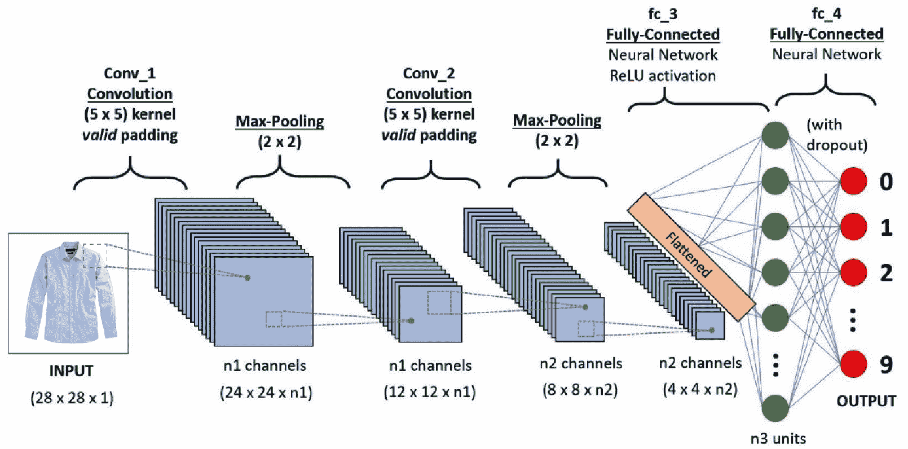

图 7.1 – CNN 的结构

让我们来分解图中的不同层：

1.  **卷积层 – 网络的眼睛**：我们的旅程从将图像输入卷积层开始；这个层可以看作是我们网络的“眼睛”。它们的主要工作是提取重要特征。与 DNN（深度神经网络）不同，DNN 中的每个神经元都与下一层的每个神经元相连，而 CNN 通过应用滤波器（也叫做卷积核）以分层的方式捕捉图像中的局部模式。滤波器滑过输入图像的一段区域后，所产生的输出称为特征图。如*图 7**.2*所示，我们可以看到每个特征图突出显示了我们输入到网络中的衬衫特定图案。图像通过 CNN 按层次结构处理，早期层的滤波器擅长捕捉简单的特征，而后续层的滤波器则捕捉更复杂的模式，模仿人类视觉皮层的层级结构。CNN 的另一个重要特点是参数共享——这是因为模式只需要学习一次，然后应用到图像的其他地方。这确保了模型的视觉能力不依赖于特定位置。在机器学习中，我们称这个概念为**平移不变性**——网络能够检测衬衫，无论它是对齐在图像的左边、右边还是居中。

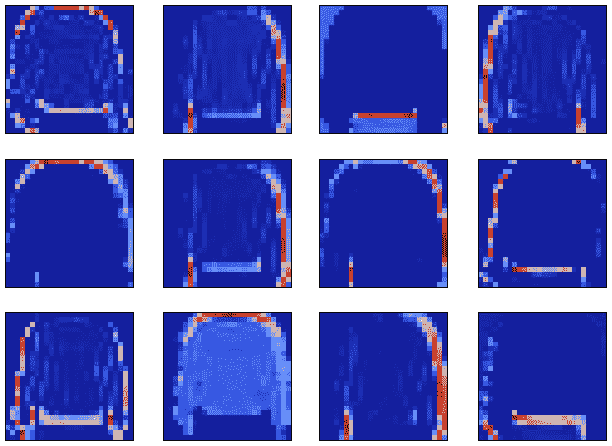

图 7.2 – 卷积层捕捉的特征可视化

1.  **池化层 – 总结器**：卷积层之后是池化层。这个层可以看作是 CNN 中的总结器，它专注于压缩特征图的整体维度，同时保留重要特征，如*图 7**.3*所示。通过系统地对特征图进行下采样，CNN 不仅显著减少了图像处理所需的参数数量，而且提高了 CNN 的整体计算效率。

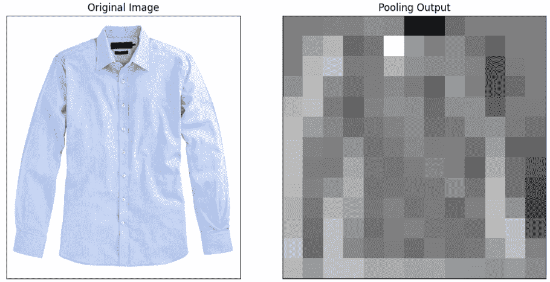

图 7.3 – 池化操作示例，保留重要细节

1.  **全连接层 – 决策者**：我们的图像通过一系列卷积和池化层，这些层提取特征并减少特征图的维度，最终到达全连接层。这个层可以看作是决策者。这个层提供了高级推理，它将通过各层收集的所有重要细节整合在一起，用来做出最终的分类判断。CNN 的一个显著特点是其端到端的学习过程，它无缝地整合了特征提取和图像分类。这种有条理且分层的学习方法使得 CNN 成为图像识别和分析的理想工具。

我们仅仅触及了卷积神经网络（CNN）如何工作的表面。现在，让我们深入探讨不同层内发生的关键操作，从卷积开始。

## 卷积

我们现在知道，卷积层应用过滤器，这些过滤器会滑过输入图像的各个区域。典型的 CNN 应用多个过滤器，每个过滤器通过与输入图像的交互来学习特定类型的特征。通过组合检测到的特征，CNN 能够全面理解图像特征，并利用这些详细信息来对输入图像进行分类。从数学上讲，这一卷积过程涉及输入图像的一块区域与过滤器（一个小矩阵）之间的点积运算，如*图 7.4*所示。这个过程生成了一个输出，称为**激活图**或**特征图**。

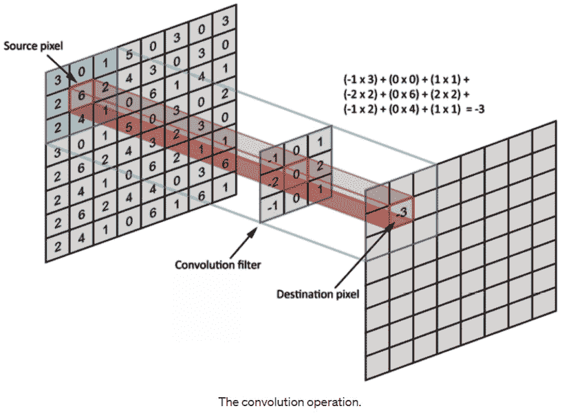

图 7.4 – 卷积操作 – 应用过滤器到输入图像生成特征图

当过滤器滑过图像的各个区域时，它为每个点操作生成一个特征图。特征图是输入图像的一个表示，其中某些视觉模式通过过滤器得到增强，如*图 7.2*所示。当我们将网络中所有过滤器的特征图叠加在一起时，我们就能得到输入图像的丰富多维视图，为后续层提供足够的信息来学习更复杂的模式。

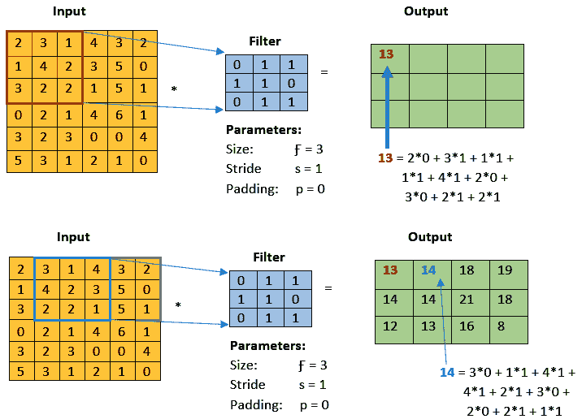

图 7.5 – a（上）和 b（下）：点积计算

在*图 7.5 a*中，我们看到一个点积操作正在进行中，过滤器滑过输入图像的一个区域，得到一个目标像素值 13。如果我们将过滤器向右移动 1 个像素，如*图 7.5 b*所示，我们将得到下一个目标像素值 14。如果我们继续每次移动 1 个像素，滑过输入图像，就会得到*图 7.5 b*中显示的完整输出。

我们现在已经了解了卷积操作的工作原理；然而，我们可以在 CNN 中应用多种类型的卷积层。对于图像分类，我们通常使用 2D 卷积层，而对于音频处理则应用 1D 卷积层，视频处理则使用 3D 卷积层。在设计卷积层时，有许多可调的超参数会影响网络的性能，比如滤波器的数量、滤波器的大小、步幅和填充。探讨这些超参数如何影响我们的网络是非常重要的。

让我们通过观察卷积层中过滤器数量的影响，来开始这次探索。

## 滤波器数量的影响

通过增加卷积神经网络（CNN）中滤波器的数量，我们可以使其学习到输入图像更丰富、更多样化的表示。滤波器越多，学习到的表示越多。然而，更多的滤波器意味着更多的参数需要训练，这不仅会增加计算成本，还可能会减慢训练过程并增加过拟合的风险。在决定为网络应用多少滤波器时，重要的是要考虑所使用数据的类型。如果数据具有较大的变异性，可能需要更多的滤波器来捕捉数据的多样性；而对于较小的数据集，则应该更为保守，以减少过拟合的风险。

## 滤波器大小的影响

我们现在知道，滤波器是滑过输入图像以生成特征图的小矩阵。我们应用于输入图像的滤波器的大小将决定从输入图像中提取的特征的层次和类型。滤波器大小是指滤波器的维度——即滤波器矩阵的高度和宽度。通常，你会遇到 3x3、5x5 和 7x7 滤波器。较小的滤波器会覆盖输入图像的较小区域，而较大的滤波器则会覆盖输入图像的更广泛部分：

+   **特征的粒度** – 像 3x3 滤波器这样的较小滤波器可以用于捕捉图像中更细致、更局部的细节，如边缘、纹理和角落，而像 7x7 滤波器这样的较大滤波器则可以学习更广泛的模式，如面部形状或物体部件。

+   **计算效率** – 较小的滤波器覆盖输入图像较小的感受野，如*图 7**.6*所示，这意味着它们需要更多的计算操作。

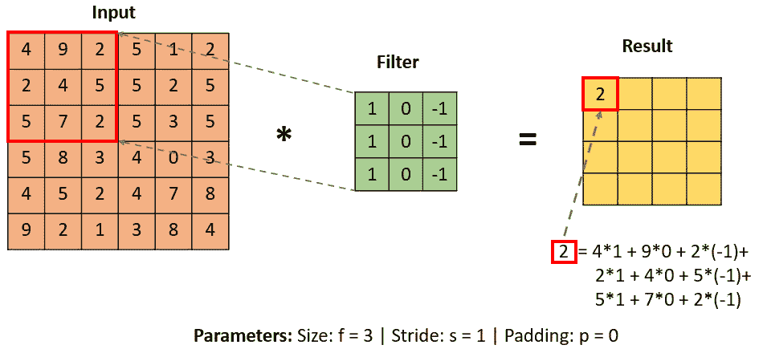

图 7.6 – 使用 3x3 滤波器的卷积操作

另一方面，较大的滤波器覆盖了输入图像的较大部分，如*图 7**.7*所示。然而，许多现代卷积神经网络（例如，VGG）使用的是 3x3 滤波器。将这些较小的滤波器叠加在一起会增加网络的深度，并增强这些滤波器捕捉更复杂模式的能力，同时相比于使用大滤波器，所需的参数更少，这使得较小的滤波器更容易训练。

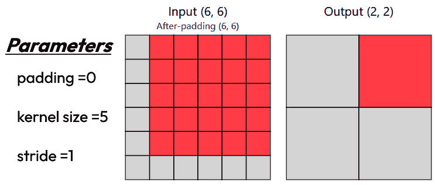

图 7.7 – 使用 5x5 滤波器的卷积操作

+   **参数数量** – 较大的滤波器通常比较小的滤波器拥有更多的权重；例如，5x5 滤波器会有 25 个参数，而 3x3 滤波器会有 9 个参数。这里为了简便起见，我们忽略了深度。因此，较大的滤波器相对于较小的滤波器，会使模型变得更加复杂。

## 步幅的影响

步幅是卷积神经网络（CNN）中的一个重要超参数。它决定了滤波器在输入图像上移动的像素数。我们可以将步幅类比为我们走路时的步伐；如果步伐小，达到目的地会花费更长时间，而较大的步伐则可以更快到达目的地。在*图 7.8*中，我们应用了步幅为 1，这意味着滤波器每次在输入图像上移动 1 个像素。

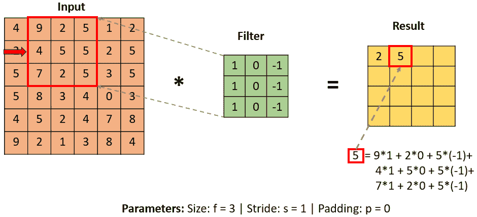

图 7.8 – 步幅为 1 的卷积操作

如果我们应用步幅为 2，意味着滤波器每次移动 2 个像素，如*图 7.9*所示。我们看到，较大的步幅会导致输出特征图的空间维度减小。通过比较这两幅图的输出，我们可以看到这一点。

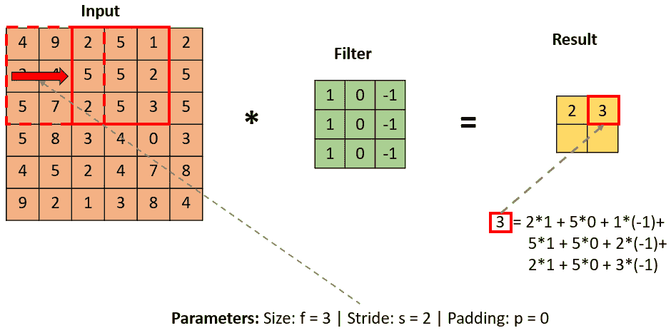

图 7.9 – 步幅为 2 的卷积操作

当我们应用较大的步幅时，它可以提高计算效率，但也会降低输入图像的空间分辨率。因此，在为我们的网络选择合适的步幅时，需要考虑这种权衡。接下来，我们来看看边界效应。

## 边界问题

当滤波器在输入图像上滑动并执行卷积操作时，很快就会到达边界或边缘，此时由于图像边界外缺少像素，难以执行点积操作。由于边缘或边界信息的丢失，这导致输出特征图小于输入图像。这个问题在机器学习中被称为**边效应**或**边界问题**。在*图 7.10*中，我们可以看到，由于滤波器的一部分会超出定义的图像边界，我们无法将滤波器集中在突出显示的像素值 3 上，因此无法在左下角执行点积操作。


图 7.10 – 显示边界问题

为了解决边界问题并保持输出特征图的空间维度，我们可能需要应用填充。接下来我们讨论这个概念。

## 填充的影响

**填充**是一种可以应用于卷积过程中的技术，通过向边缘添加额外的像素来防止边界效应，如*图 7.11*所示。

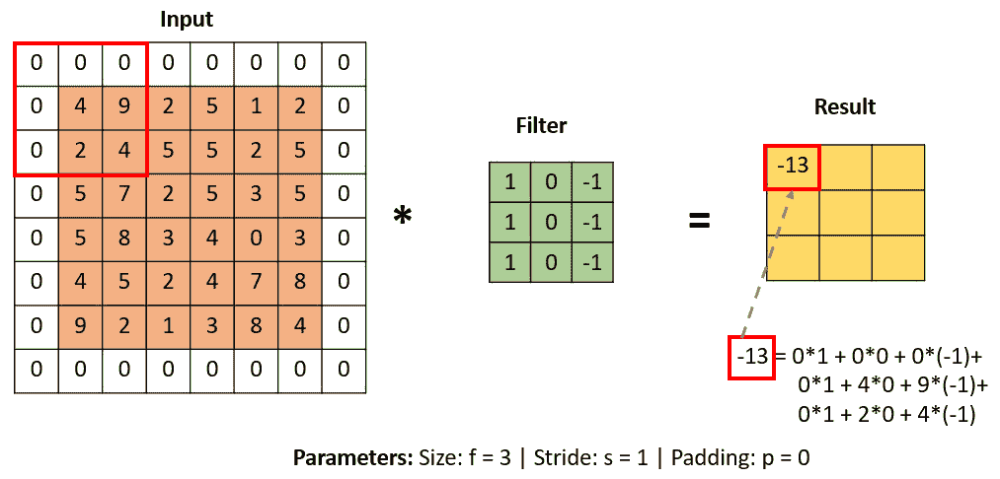

图 7.11 – 进行卷积操作的填充图像

现在，我们可以在边缘的像素上执行点积操作，从而保留边缘的信息。填充也可以应用于保持卷积前后的空间维度。这在具有多个卷积层的深度卷积神经网络（CNN）架构中可能会非常有用。我们来看一下两种主要的填充类型：

+   **有效填充（无填充）**：这里没有应用填充。当我们希望减少空间维度，尤其是在较深的层时，这种方法非常有用。

+   **相同填充**：这里我们设置填充以确保输出特征图和输入图像的尺寸相同。我们在保持空间维度至关重要时使用这种方法。

在我们继续检查池化层之前，让我们将之前讨论过的卷积层的不同超参数组合起来，并看看它们的实际效果。

## 综合起来

在*图 7.12*中，我们有一个 7x7 的输入图像和一个 3x3 的滤波器。在这里，我们使用步幅为 1 并将填充设置为有效（无填充）。

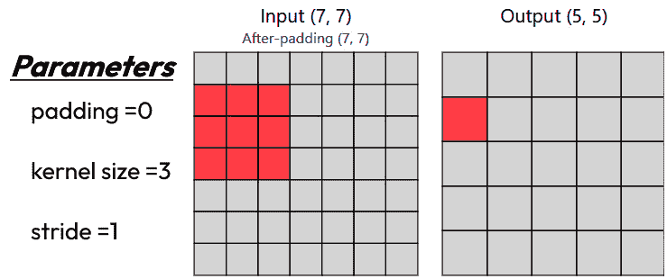

图 7.12 – 设置超参数

为了计算卷积操作的输出特征图，我们可以应用以下公式：

(W − F + 2P _ S) + 1

在这个公式中，以下内容适用：

+   *W* 代表输入图像的大小

+   *F* 代表滤波器大小

+   *S* 代表步幅

+   *P* 代表填充

当我们将相应的值代入公式时，得到的结果值为 5，这意味着我们将得到一个 5x5 的输出特征图。如果我们更改任何一个值，它都会以某种方式影响输出特征图的大小。例如，如果我们增加步幅大小，输出特征图将变得更小，而如果我们将填充设置为 same，则会增加输出的大小。现在，我们可以从卷积操作转到池化操作。

# 池化

**池化**是一个重要的操作，发生在卷积神经网络（CNN）的池化层中。它是一种用于下采样卷积层生成的单个特征图空间维度的技术。让我们来看看一些常见的池化层类型。我们将从最大池化开始，如*图 7.13*所示。在这里，我们可以看到最大池化操作是如何工作的。池化层简单地从输入数据的每个区域提取最大值。

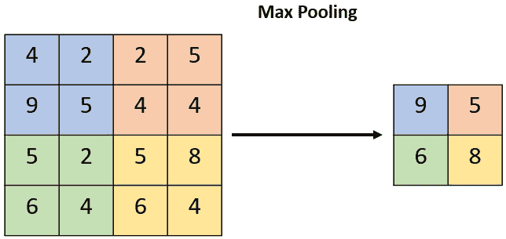

图 7.13 – 最大池化操作

最大池化具有多个优点，因为它直观且易于实现。它也很高效，因为它只提取区域中的最大值，并且在各类任务中都取得了良好的效果。

平均池化，顾名思义，通过对指定区域取平均值来减少数据的维度，如*图 7.14*所示。

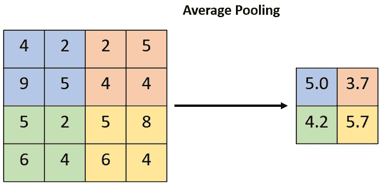

图 7.14 – 平均池化操作

另一方面，最小池化会提取输入数据指定区域中的最小值。池化减少了输出特征图的空间大小，从而减少了存储中间表示所需的内存。池化对网络是有益的；然而，过度池化可能适得其反，因为这可能导致信息丢失。经过池化层后，我们到达了全连接层，这是我们网络的决策者。

## 全连接层

我们的 CNN 架构的最后一个组成部分是全连接层。与卷积层不同，在这里，每个神经元都与下一层中的每个神经元相连接。这个层负责决策，例如分类我们的输入图像是衬衫还是帽子。全连接层将从早期层学到的特征映射到相应的标签。现在我们已经在理论上覆盖了 CNN，接下来我们将其应用到我们的时尚数据集上。

# Fashion MNIST 2.0

到现在为止，你已经熟悉了这个数据集，因为我们在*第五章*，《*神经网络图像分类*》，和*第六章*，《*改进模型*》中使用了它。现在，让我们看看 CNN 与我们迄今为止使用的简单神经网络相比如何。我们将继续保持之前的精神，首先导入所需的库：

1.  我们将导入所需的库以进行预处理、建模和使用 TensorFlow 可视化我们的机器学习模型：

    ```py
    import tensorflow as tf
    ```

    ```py
    import numpy as np
    ```

    ```py
    import matplotlib.pyplot as plt
    ```

1.  接下来，我们将使用`load_data()`函数从 TensorFlow 数据集中加载 Fashion MNIST 数据集。此函数返回我们的训练和测试数据，这些数据由 NumPy 数组组成。训练数据包括`x_train`和`y_train`，测试数据由`x_test`和`y_test`组成：

    ```py
    (x_train,y_train),(x_test,y_test) = tf.keras.datasets.fashion_mnist.load_data()
    ```

1.  我们可以通过对训练数据和测试数据使用`len`函数来确认数据的大小：

    ```py
    len(x_train), len(x_test)
    ```

当我们运行代码时，我们得到以下输出：

```py
(60000, 10000)
```

我们可以看到，我们的训练数据集有 60,000 张图像，测试数据集有 10,000 张图像。

1.  在 CNN 中， 与我们之前使用的 DNN 不同，我们需要考虑输入图像的颜色通道。目前，我们的训练和测试数据是灰度图像，其形状为`(batch_size, height, width)`，并且只有一个通道。然而，CNN 模型需要一个 4D 输入张量，由`batch_size`、`height`、`width`和`channels`组成。我们可以通过简单地重塑数据并将元素转换为`float32`值来修复这个数据不匹配问题：

    ```py
    # Reshape the images(batch_size, height, width, channels)
    ```

    ```py
    x_train = x_train.reshape(x_train.shape[0],
    ```

    ```py
        28, 28, 1).astype('float32')
    ```

    ```py
    x_test = x_test.reshape(x_test.shape[0],
    ```

    ```py
        28, 28, 1).astype('float32')
    ```

这个预处理步骤在训练机器学习模型之前是标准步骤，因为大多数模型需要浮动点输入。由于我们的图像是灰度图像，因此只有一个颜色通道，这就是我们将数据重塑为包含单一通道维度的原因。

1.  我们数据的像素值（训练数据和测试数据）范围从 `0` 到 `255`，其中 `0` 代表黑色，`255` 代表白色。我们通过将像素值除以 255 来规范化数据，从而将像素值缩放到 `0` 到 `1` 的区间。这样做的目的是让模型更快收敛，并提高其性能：

    ```py
    # Normalize the pixel values
    ```

    ```py
    x_train /= 255
    ```

    ```py
    x_test /= 255
    ```

1.  我们使用 `tf.keras` 中 `utils` 模块的 `to_categorical` 函数，将标签（`y_train` 和 `y_test`）中的整数值（`0` 到 `9`）转换为一维独热编码数组。`to_categorical` 函数接受两个参数：需要转换的标签和类别的数量；它返回一个一维独热编码数组，如 *图 7.15* 所示。


图 7.15 – 一维独热编码数组

一维独热编码向量的长度为 `10`，其中在对应标签的索引位置上为 `1`，其他位置则为 `0`：

```py
# Convert the labels to one hot encoding format
y_train = tf.keras.utils.to_categorical(y_train, 10)
y_test = tf.keras.utils.to_categorical(y_test, 10)
```

1.  使用 `tf.keras.model` 中的顺序模型 API，我们将创建一个卷积神经网络（CNN）架构：

    ```py
    # Build the Sequential model
    ```

    ```py
    model = tf.keras.models.Sequential()
    ```

    ```py
    # Add convolutional layer
    ```

    ```py
    model.add(tf.keras.layers.Conv2D(64,kernel_size=(3,3),
    ```

    ```py
        activation='relu',
    ```

    ```py
        input_shape=(28, 28, 1)))
    ```

    ```py
    # Add max pooling layer
    ```

    ```py
    model.add(tf.keras.layers.MaxPooling2D(pool_size=(2, 2)))
    ```

    ```py
    # Flatten the data
    ```

    ```py
    model.add(tf.keras.layers.Flatten())
    ```

    ```py
    # Add fully connected layer
    ```

    ```py
    model.add(tf.keras.layers.Dense(128,
    ```

    ```py
                                    activation='relu'))
    ```

    ```py
    # Apply softmax
    ```

    ```py
    model.add(tf.keras.layers.Dense(10,
    ```

    ```py
                                    activation='softmax'))
    ```

第一层是一个卷积层，包含 64 个 3x3 的滤波器，用来处理输入图像，输入图像的形状是 28x28 像素，1 个通道（灰度图）。ReLU 被用作激活函数。随后的最大池化层是一个 2D 池化层，应用最大池化对卷积层的输出进行降采样，减少特征图的维度。`flatten` 层将池化层的输出展平为一维数组，然后由全连接层处理。输出层使用 `softmax` 激活函数进行多类分类，并包含 10 个神经元，每个类一个神经元。

1.  接下来，我们将在训练数据上编译并训练模型：

    ```py
    # Compile and fit the model
    ```

    ```py
    model.compile(loss='categorical_crossentropy',
    ```

    ```py
                  optimizer='adam', metrics=['accuracy'])
    ```

    ```py
    model.fit(x_train, y_train, epochs=10,
    ```

    ```py
              validation_split=0.2)
    ```

`compile()` 函数有三个参数：损失函数（`categorical_crossentropy`，因为这是一个多类分类任务）、优化器（`adam`）和度量标准（`accuracy`）。编译模型后，我们使用 `fit()` 函数在训练数据上训练模型。我们将迭代次数设定为 `10`，并使用 20% 的训练数据进行验证。

在 10 次迭代后，我们得到了训练准确率为 `0.9785`，验证准确率为 `0.9133`：

```py
Epoch 6/10
1500/1500 [==============================] - 5s 3ms/step - loss: 0.1267 - accuracy: 0.9532 - val_loss: 0.2548 - val_accuracy: 0.9158
Epoch 7/10
1500/1500 [==============================] - 5s 4ms/step - loss: 0.1061 - accuracy: 0.9606 - val_loss: 0.2767 - val_accuracy: 0.9159
Epoch 8/10
1500/1500 [==============================] - 6s 4ms/step - loss: 0.0880 - accuracy: 0.9681 - val_loss: 0.2957 - val_accuracy: 0.9146
Epoch 9/10
1500/1500 [==============================] - 6s 4ms/step - loss: 0.0697 - accuracy: 0.9749 - val_loss: 0.3177 - val_accuracy: 0.9135
Epoch 10/10
1500/1500 [==============================] - 6s 4ms/step - loss: 0.0588 - accuracy: 0.9785 - val_loss: 0.3472 - val_accuracy: 0.9133
```

1.  `summary` 函数是一个非常有用的方式，用来快速概览模型架构，并理解每层的参数数量以及输出张量的形状：

    ```py
    model.summary()
    ```

输出返回了组成我们当前模型架构的五个层。它还显示了每个层的输出形状和参数数量。总的参数数量是 1,386,506。通过输出，我们可以看到卷积层的输出形状是 26x26，这是由于边缘效应造成的，因为我们没有使用填充。接下来，最大池化层将像素大小减半，然后我们将数据展平并生成预测：

```py
Model: "sequential"
______________________________________________________
 Layer (type)             Output Shape         Param #
======================================================
 conv2d (Conv2D)          (None, 26, 26,64)    640
 max_pooling2d (MaxPooling2D  (None,13,13,64)  0    )
 flatten (Flatten)            (None, 10816)    0
 dense (Dense)                (None, 128)      1384576
 dense_1 (Dense)              (None, 10)       1290
======================================================
Total params: 1,386,506
Trainable params: 1,386,506
Non-trainable params: 0
_________________________________________________________________
```

1.  最后，我们将使用 `evaluate` 函数在测试数据上评估我们的模型。`evaluate` 函数返回模型在测试数据上的损失和准确度：

    ```py
    # Evaluate the model
    ```

    ```py
    score = model.evaluate(x_test, y_test)
    ```

我们的模型在测试数据上实现了 `0.9079` 的准确率，超过了在 *第六章**，改进模型* 中使用的架构的性能。我们可以通过调整超参数和应用数据增强来进一步提高模型的性能。让我们把注意力转向现实世界的图像，CNNs 显然比我们以前的模型更出色。

# 处理现实世界图像

现实世界中的图像提出了不同类型的挑战，因为这些图像通常是彩色图像，具有三个色彩通道（红色、绿色和蓝色），不像我们从时尚 MNIST 数据集中使用的灰度图像。在 *图 7**.16* 中，我们看到了一些即将建模的来自天气数据集的实际图像示例，您会注意到这些图像的大小各异。这引入了另一层复杂性，需要额外的预处理步骤，如调整大小或裁剪，以确保我们所有的图像在输入神经网络之前具有统一的尺寸。


图 7.16 – 天气数据集中的图像

在处理现实世界图像时，我们可能会遇到的另一个问题是各种噪声源的存在。例如，我们的数据集中可能有在光线不均匀或意外模糊条件下拍摄的图像。同样，在我们的现实世界数据集中可能会有多个对象或其他意外的背景干扰图像。

要解决这些问题，我们可以应用去噪技术，如去噪，以改善数据的质量。我们还可以使用对象检测技术，如边界框或分割，帮助我们在具有多个对象的图像中识别目标对象。好消息是 TensorFlow 配备了一套完整的工具集，专门处理这些挑战。来自 TensorFlow 的一个重要工具是 `tf.image` 模块，提供了一系列图像预处理功能，如调整大小、亮度、对比度、色调和饱和度的应用、边界框、裁剪、翻转等等。

然而，这个模块超出了本书及考试的范围。但是，如果你希望深入了解这个模块，可以访问 TensorFlow 文档：[`www.tensorflow.org/api_docs/python/tf/image`](https://www.tensorflow.org/api_docs/python/tf/image)。TensorFlow 的另一个工具是`ImageDataGenerator`，它使我们能够实时执行数据增强操作，提供了在将图像输入训练管道时对其进行预处理和增广（例如旋转和翻转图像）的能力。接下来，我们将使用实际的图像数据集，看看`ImageDataGenerator`如何发挥作用。

## 天气数据集分类

在这个案例研究中，我们将作为计算机视觉顾问为一个新兴的初创公司 WeatherBIG 提供支持。你被分配了开发一个图像分类系统的任务，该系统将用于识别不同的天气状况；该任务的数据集可以通过以下链接在 Kaggle 上找到：[`www.kaggle.com/datasets/rahul29g/weatherdataset`](https://www.kaggle.com/datasets/rahul29g/weatherdataset)。该数据集已被分成三个文件夹，包括训练文件夹、验证文件夹和测试文件夹。每个文件夹下都有各自的天气类别子文件夹。让我们开始这个任务：

1.  我们首先导入几个库来构建我们的图像分类器：

    ```py
    import os
    ```

    ```py
    import pathlib
    ```

    ```py
    import matplotlib.pyplot as plt
    ```

    ```py
    import matplotlib.image as mpimg
    ```

    ```py
    import random
    ```

    ```py
    import numpy as np
    ```

    ```py
    from PIL import Image
    ```

    ```py
    import tensorflow as tf
    ```

    ```py
    from tensorflow import keras
    ```

    ```py
    from tensorflow.keras.preprocessing.image import ImageDataGenerator
    ```

我们在之前的实验中使用了这些库中的几个；然而，接下来我们将介绍一些第一次使用的库的功能。`os`模块作为我们操作系统的桥梁。它使我们能够读取和写入文件系统，而`pathlib`提供了一种直观的面向对象的方式来简化文件导航任务。对于图像操作，我们使用`PIL`，此外还有来自`tensorflow.keras.preprocessing.image`模块的`ImageDataGenerator`类，用于我们的数据预处理、批次生成和数据增强步骤。

1.  你可以从[`www.kaggle.com/datasets/rahul29g/weatherdataset`](https://www.kaggle.com/datasets/rahul29g/weatherdataset)获取/下载此案例研究的数据集，并将其上传到 Google Drive。完成后，你可以轻松地跟随本节中的代码进行操作。在我的例子中，数据存储在此根目录：`/content/drive/MyDrive/weather dataset`。在你的情况下，根目录将会不同，所以请确保将目录路径更改为与数据集存储在 Google Drive 中的目录匹配：`root_dir = "/content/drive/MyDrive/weather dataset"`。

1.  接下来，我们应用`os.walk`函数来访问根目录，并生成关于所有目录和子目录内容的信息：

    ```py
    for dirpath, dirnames, filenames in os.walk(root_dir):
    ```

    ```py
        print(f"Directory: {dirpath}")
    ```

    ```py
        print(f"Number of images: {len(filenames)}")
    ```

    ```py
        print()
    ```

运行代码会返回一个元组，包含每个目录的路径以及每个目录中图片的数量，如*图 7.17*所示：


图 7.17 – 快照目录及其子目录

我们通过这一步来了解每个目录和子目录的内容。

1.  我们使用`retrieve_labels`函数从训练、测试和验证目录中提取并显示标签及其对应的计数。为了实现这个函数，我们使用`os`模块中的`listdir`方法，并传入相应的目录路径（`train_dir`、`test_dir`和`val_dir`）：

    ```py
    def retrieve_labels(train_dir, test_dir, val_dir):
    ```

    ```py
        # Retrieve labels from training directory
    ```

    ```py
        train_labels = os.listdir(train_dir)
    ```

    ```py
        print(f"Training labels: {train_labels}")
    ```

    ```py
        print(f"Number of training labels: {len(train_labels)}")
    ```

    ```py
        print()
    ```

    ```py
        # Retrieve labels from test directory
    ```

    ```py
        test_labels = os.listdir(test_dir)
    ```

    ```py
        print(f"Test labels: {test_labels}")
    ```

    ```py
        print(f"Number of test labels: {len(test_labels)}")
    ```

    ```py
        print()
    ```

    ```py
        # Retrieve labels from validation directory
    ```

    ```py
        val_labels = os.listdir(val_dir)
    ```

    ```py
        print(f"Validation labels: {val_labels}")
    ```

    ```py
        print(f"Number of validation labels: {len(val_labels)}")
    ```

    ```py
        print()
    ```

1.  我们分别在`train_dir`、`test_dir`和`val_dir`参数中指定训练、测试和验证目录的路径：

    ```py
    train_dir = "/content/drive/MyDrive/weather dataset/train"
    ```

    ```py
    test_dir = "/content/drive/MyDrive/weather dataset/test"
    ```

    ```py
    val_dir = "/content/drive/MyDrive/weather dataset/validation"
    ```

    ```py
    retrieve_labels(train_dir, test_dir, val_dir)
    ```

当我们运行代码时，它将返回训练数据、测试数据、验证数据标签以及标签的数量：

```py
Training labels: ['cloud', 'shine', 'rain', 'sunrise']
Number of training labels: 4
Test labels: ['sunrise', 'shine', 'cloud', 'rain']
Number of test labels: 4
Validation labels: ['shine', 'sunrise', 'cloud', 'rain']
Number of validation labels: 4
```

1.  在我们的探索中，创建一个名为`view_random_images`的函数，从数据集中的子目录中随机访问并显示图片。该函数接受包含子目录的主目录以及我们希望显示的图片数量。我们使用`listdir`来访问子目录，并引入随机性来选择图片。我们使用`random`库中的`shuffle`函数进行打乱并随机选择图片。我们利用 Matplotlib 来显示指定数量的随机图片：

    ```py
    def view_random_images(target_dir, num_images):
    ```

    ```py
      """
    ```

    ```py
      View num_images random images from the subdirectories of target_dir as a subplot.
    ```

    ```py
      """
    ```

    ```py
      # Get list of subdirectories
    ```

    ```py
        subdirs = [d for d in os.listdir(
    ```

    ```py
            target_dir) if os.path.isdir(os.path.join(
    ```

    ```py
                target_dir, d))]
    ```

    ```py
      # Select num_images random subdirectories
    ```

    ```py
        random.shuffle(subdirs)
    ```

    ```py
        selected_subdirs = subdirs[:num_images]
    ```

    ```py
      # Create a subplot
    ```

    ```py
        fig, axes = plt.subplots(1, num_images, figsize=(15,9))
    ```

    ```py
        for i, subdir in enumerate(selected_subdirs):
    ```

    ```py
          # Get list of images in subdirectory
    ```

    ```py
            image_paths = [f for f in os.listdir(
    ```

    ```py
                os.path.join(target_dir, subdir))]
    ```

    ```py
          # Select a random image
    ```

    ```py
            image_path = random.choice(image_paths)
    ```

    ```py
          # Load image
    ```

    ```py
            image = plt.imread(os.path.join(target_dir,
    ```

    ```py
                subdir, image_path))
    ```

    ```py
          # Display image in subplot
    ```

    ```py
            axes[i].imshow(image)
    ```

    ```py
            axes[i].axis("off")
    ```

    ```py
            axes[i].set_title(subdir)
    ```

    ```py
        print(f"Shape of image: {image.shape}")    
    ```

    ```py
        #width,height, colour chDNNels
    ```

    ```py
        plt.show()
    ```

1.  让我们通过将`num_images`设置为`4`来尝试这个函数，并查看`train`目录中的一些数据：

    ```py
    view_random_images(target_dir="/content/drive/MyDrive/weather dataset/train/", num_images=4)
    ```

这将返回四张随机选择的图片，如下所示：


7.18 – 从天气数据集中随机选择的图片

从显示的数据来看，图片的尺寸（高度和宽度）各不相同，我们需要解决这个预处理问题。我们将使用 TensorFlow 中的`ImageDataGenerator`类。接下来我们将讨论这个问题。

## 图片数据预处理

我们在*图 7.18*中看到，训练图片的大小各不相同。在这里，我们将在训练前调整并规范化数据。此外，我们还希望开发一种有效的方法来批量加载训练数据，确保优化内存使用并与模型的训练过程无缝对接。为了实现这一目标，我们将使用`TensorFlow.keras.preprocessing.image`模块中的`ImageDataGenerator`类。在*第八章*《处理过拟合》中，我们将进一步应用`ImageDataGenerator`，通过旋转、翻转和缩放等方式生成训练数据的变种，扩大我们的训练数据集。这将有助于我们的模型变得更强大，并减少过拟合的风险。

另一个有助于我们数据预处理任务的有用工具是`flow_from_directory`方法。我们可以使用此方法构建数据管道。当我们处理大规模、实际数据时，它尤其有用，因为它能够自动读取、调整大小并将图像批量化，以便进行模型训练或推理。`flow_from_directory`方法接受三个主要参数。第一个是包含图像数据的目录路径。接下来，我们指定在将图像输入神经网络之前，图像的期望大小。然后，我们还需要指定批量大小，以确定我们希望同时处理的图像数量。我们还可以通过指定其他参数，如颜色模式、类别模式和是否打乱数据，来进一步定制该过程。现在，让我们来看一下一个多分类问题的典型目录结构，如*图 7.19*所示。

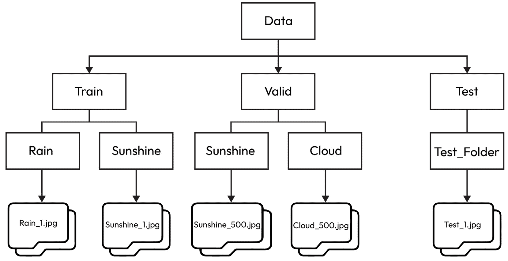

图 7.19 – 多分类问题的目录结构

在应用`flow_from_directory`方法时，重要的是我们需要将图像组织在一个结构良好的目录中，每个唯一的类别标签都有一个子目录，如*图 7.19*所示。在这里，我们有四个子目录，每个子目录对应我们的天气数据集中的一个类别标签。一旦所有图像都放入了适当的子目录，我们就可以应用`flow_from_directory`来设置一个迭代器。这个迭代器是可调的，我们可以定义图像大小、批量大小等参数，并决定是否打乱数据。接下来，我们将这些新想法应用到我们当前的案例研究中：

```py
# Preprocess data (get all of the pixel values between 1 and 0, also called scaling/normalization)
train_datagen = ImageDataGenerator(rescale=1./255)
valid_datagen = ImageDataGenerator(rescale=1./255)
test_datagen = ImageDataGenerator(rescale=1./255)
```

在这里，我们定义了三个`ImageDataGenerator`类的实例：一个用于训练，一个用于验证，一个用于测试。我们对每个实例中的图像像素值应用了 1/255 的缩放因子，以便对数据进行归一化：

```py
# Import data from directories and turn it into batches
train_data = train_datagen.flow_from_directory(train_dir,
    batch_size=64, # number of images to process at a time
    target_size=(224,224), # convert all images to be 224 x 224
    class_mode="categorical")
valid_data = valid_datagen.flow_from_directory(val_dir,
    batch_size=64,
    target_size=(224,224),
    class_mode="categorical")
test_data = test_datagen.flow_from_directory(test_dir,
    batch_size=64,
    target_size=(224,224),
    class_mode="categorical")
```

我们使用`flow_from_directory`从各自的训练、验证和测试目录中导入图像，结果数据存储在`train_data`、`valid_data`和`test_data`变量中。除了在`flow_from_directory`方法中指定目录外，您会注意到我们不仅指定了目标大小（224 x 244）和批量大小（64），还指定了我们正在处理的问题类型为`categorical`，因为我们处理的是一个多分类问题。我们现在已经成功完成了数据预处理步骤。接下来，我们将开始对数据建模：

```py
model_1 = tf.keras.models.Sequential([
    tf.keras.layers.Conv2D(filters=16,
        kernel_size=3, # can also be (3, 3)
        activation="relu",
        input_shape=(224, 224, 3)),
        #(height, width, colour channels)
tf.keras.layers.MaxPool2D(2,2),
    tf.keras.layers.Conv2D(32, 3, activation="relu"),
    tf.keras.layers.MaxPool2D(2,2),
    tf.keras.layers.Conv2D(64, 3, activation="relu"),
    tf.keras.layers.MaxPool2D(2,2),
    tf.keras.layers.Flatten(),
    tf.keras.layers.Dense(1050, activation="relu"),
    tf.keras.layers.Dense(4, activation="softmax")
    # binary activation output
])
# Compile the model
model_1.compile(loss="CategoricalCrossentropy",
    optimizer=tf.keras.optimizers.Adam(),
    metrics=["accuracy"])
# Fit the model
history_1 = model_1.fit(train_data,
    epochs=10,
    validation_data=valid_data,
    )
```

在这里，我们使用一个由三组卷积层和池化层组成的 CNN 架构。在第一层卷积层中，我们应用了 16 个 3×3 的过滤器。请注意，输入形状也与我们在预处理步骤中定义的形状匹配。在第一层卷积层之后，我们应用了 2x2 的最大池化。接下来，我们进入第二层卷积层，使用 32 个 3×3 的过滤器，后面跟着另一个 2x2 的最大池化层。最后一层卷积层有 64 个 3×3 的过滤器，后面跟着另一个最大池化层，进一步对数据进行下采样。

接下来，我们进入全连接层。在这里，我们首先将之前层的 3D 输出展平为 1D 数组。然后，我们将数据传递到密集层进行最终分类。接下来，我们编译并拟合我们的模型到数据上。需要注意的是，在我们的`compile`步骤中，我们使用`CategoricalCrossentropy`作为`loss`函数，因为我们正在处理一个多类任务，并将`metrics`设置为`accuracy`。最终输出是一个概率分布，表示我们数据集中的四个类别，具有最高概率的类别即为预测标签：

```py
Epoch 6/10
13/13 [==============================] - 8s 622ms/step - loss: 0.1961 - accuracy: 0.9368 - val_loss: 0.2428 - val_accuracy: 0.8994
Epoch 7/10
13/13 [==============================] - 8s 653ms/step - loss: 0.1897 - accuracy: 0.9241 - val_loss: 0.2967 - val_accuracy: 0.9218
Epoch 8/10
13/13 [==============================] - 8s 613ms/step - loss: 0.1093 - accuracy: 0.9671 - val_loss: 0.3447 - val_accuracy: 0.8939
Epoch 9/10
13/13 [==============================] - 8s 604ms/step - loss: 0.1756 - accuracy: 0.9381 - val_loss: 0.6276 - val_accuracy: 0.8324
Epoch 10/10
13/13 [==============================] - 8s 629ms/step - loss: 0.1472 - accuracy: 0.9418 - val_loss: 0.2633 - val_accuracy: 0.9106
```

我们训练了我们的模型 10 个周期，达到了在训练数据上的 94%训练准确率和在验证数据上的 91%准确率。我们使用`summary`方法来获取模型中不同层的信息。这些信息包括每层的概述、输出形状以及使用的参数数量（可训练和不可训练）：

```py
Model: "sequential"
___________________________________________________________
 Layer (type)                 Output Shape         Param #
===========================================================
 conv2d (Conv2D)              (None, 222, 222, 16) 448
 max_pooling2d (MaxPooling2D) (None, 111, 111, 16) 0
 conv2d_1 (Conv2D)            (None, 109, 109, 32) 4640
 max_pooling2d_1 (MaxPooling  (None, 54, 54, 32)   0
 2D)
 conv2d_2 (Conv2D)            (None, 52, 52, 64)   18496
 max_pooling2d_2 (MaxPooling  (None, 26, 26, 64)   0
 2D)
 flatten (Flatten)            (None, 43264)        0
 dense (Dense)                (None, 1050)         45428250
 dense_1 (Dense)              (None, 4)            4204
===========================================================
Total params: 45,456,038
Trainable params: 45,456,038
Non-trainable params: 0
___________________________________________________________
```

从模型的总结中，我们看到我们的架构包含三层卷积层（`Conv2D`），每一层都配有一个池化层（`MaxPooling2D`）。信息从这些层流入到全连接层，在那里进行最终的分类。让我们深入分析每一层，解读它们提供的信息。第一层卷积层的输出形状为`(None, 222, 222, 16)`。这里，`None`表示我们没有硬编码批次大小，这使得我们能够灵活地使用不同的批次大小。接下来，`222, 222`表示输出特征图的尺寸；如果不应用填充，我们会因为边界效应而丢失 2 个像素的高度和宽度。最后，`16`表示使用的过滤器或内核的数量，这意味着每个过滤器将输出 16 个不同的特征图。你还会注意到这一层有`448`个参数。为了计算卷积层中的参数数量，我们使用以下公式：

*(过滤器宽度 × 过滤器高度 × 输入通道数 + 1（偏置）) × 过滤器数量 = 卷积层的总参数数量*

当我们将数值代入公式时，我们得到（3 × 3 × 3 + 1）× 16 = 448 个参数。

下一个层是第一个池化层，它是一个`MaxPooling2D`层，用于对卷积层的输出特征图进行降采样。在这里，我们的输出形状为`(None, 111, 111, 16)`。从输出中可以看到，空间维度已经缩小了一半，同时也要注意，池化层没有参数，正如我们在模型总结中看到的所有池化层一样。

接下来，我们进入第二个卷积层，注意到我们的输出深度已经增加到了`32`。这是因为我们在该层使用了 32 个过滤器，因此将返回 32 个不同的特征图。同时，由于边界效应，我们的特征图的空间维度再次被减少了两个像素。我们可以通过以下方式轻松计算该层的参数数量：（3 × 3 × 16 + 1）× 32 = 4,640 个参数。

接下来，我们进入第二个池化层，它进一步对特征图进行降采样，输出尺寸为`(None, 54, 54, 32)`。最后的卷积层使用 64 个过滤器，因此输出形状为`(None, 52, 52, 64)`，有 18,496 个参数。最后的池化层再次将数据维度降至`(None, 26, 26, 64)`。最后池化层的输出被送入`Flatten`层，后者将数据从 3D 张量重塑为 1D 张量，尺寸为 26 x 26 x 64 = 43,264。这个数据接着被送入第一个`Dense`层，其输出形状为`(None, 1050)`。为了计算`Dense`层的参数数量，我们使用以下公式：

*(输入节点数 + 1) × 输出节点数*

当我们输入这些数值时，得到(43,264 + 1) × 1,050 = 45,428,250 个参数。最终的`Dense`层是输出层，其形状为`(None, 4)`，其中`4`表示我们要预测的独特类别数。由于连接、偏置和输出神经元数量，该层有(1,050 + 1) × 4 = 4,204 个参数。

接下来，我们使用`evaluate`方法评估我们的模型：

```py
model_1.evaluate(test_data)
```

我们在测试数据上达到了 91%的准确率。

让我们将我们的 CNN 架构与两个 DNN 进行比较：

```py
model_2 = tf.keras.Sequential([
    tf.keras.layers.Flatten(input_shape=(224, 224, 3)),
    tf.keras.layers.Dense(1200, activation='relu'),
    tf.keras.layers.Dense(600, activation='relu'),
    tf.keras.layers.Dense(300, activation='relu'),
    tf.keras.layers.Dense(4, activation='softmax')
])
# Compile the model
model_2.compile(loss='categorical_crossentropy',
    optimizer=tf.keras.optimizers.Adam(),
    metrics=["accuracy"])
# Fit the model
history_2 = model_2.fit(train_data,
    epochs=10,
    validation_data=valid_data)
```

我们构建了一个名为`model_2`的 DNN，由 4 个`Dense`层组成，分别有`1200`、`600`、`300`和`4`个神经元。除了输出层使用`softmax`函数进行分类外，其他所有层都使用 ReLU 作为激活函数。我们与`model_1`的方式相同，编译并拟合`model_2`：

```py
Epoch 6/10
13/13 [==============================] - 8s 625ms/step - loss: 2.2083 - accuracy: 0.6953 - val_loss: 0.9884 - val_accuracy: 0.7933
Epoch 7/10
13/13 [==============================] - 8s 606ms/step - loss: 2.7116 - accuracy: 0.6435 - val_loss: 2.0749 - val_accuracy: 0.6704
Epoch 8/10
13/13 [==============================] - 8s 636ms/step - loss: 2.8324 - accuracy: 0.6877 - val_loss: 1.7241 - val_accuracy: 0.7430
Epoch 9/10
13/13 [==============================] - 8s 599ms/step - loss: 1.8597 - accuracy: 0.6890 - val_loss: 1.1507 - val_accuracy: 0.7877
Epoch 10/10
13/13 [==============================] - 8s 612ms/step - loss: 1.0902 - accuracy: 0.7813 - val_loss: 0.9915 - val_accuracy: 0.7486
```

经过 10 个 epoch，我们达到了 74.86%的验证准确率，当我们查看模型的总结时，发现我们总共使用了 181,536,904 个参数，这是我们 CNN 架构参数的 4 倍。

接下来，我们来看另一个 DNN 架构：

```py
model_3 = tf.keras.Sequential([
    tf.keras.layers.Flatten(input_shape=(224, 224, 3)),
    tf.keras.layers.Dense(1000, activation='relu'),
    tf.keras.layers.Dense(500, activation='relu'),
    tf.keras.layers.Dense(500, activation='relu'),
    tf.keras.layers.Dense(4, activation='softmax')
])
# Compile the model
model_3.compile(loss='categorical_crossentropy',
    optimizer=tf.keras.optimizers.Adam(),
    metrics=["accuracy"])
# Fit the model
history_3 = model_3.fit(train_data,
    epochs=10,
    validation_data=valid_data)
```

我们使用另外一组 4 个`Dense`层，分别有`1000`、`500`、`500`和`4`个神经元。我们同样为`model_3`进行了 10 个 epoch 的拟合和编译：

```py
Epoch 6/10
13/13 [==============================] - 9s 665ms/step - loss: 1.6911 - accuracy: 0.6814 - val_loss: 0.5861 - val_accuracy: 0.7877
Epoch 7/10
13/13 [==============================] - 8s 606ms/step - loss: 0.7309 - accuracy: 0.7952 - val_loss: 0.5100 - val_accuracy: 0.8268
Epoch 8/10
13/13 [==============================] - 8s 572ms/step - loss: 0.6797 - accuracy: 0.7863 - val_loss: 0.9520 - val_accuracy: 0.7263
Epoch 9/10
13/13 [==============================] - 8s 632ms/step - loss: 0.7430 - accuracy: 0.7724 - val_loss: 0.5220 - val_accuracy: 0.7933
Epoch 10/10
13/13 [==============================] - 8s 620ms/step - loss: 0.5845 - accuracy: 0.7737 - val_loss: 0.5881 - val_accuracy: 0.7765
```

在经过 10 个 epoch 后，我们达到了 77.65%的验证准确率，该模型大约有 151,282,004 个参数；结果与我们的 CNN 架构相差较大。接下来，让我们在测试数据上比较三种模型，这是我们评估模型的标准。为此，我们将编写一个函数来生成一个 DataFrame，显示模型的名称、损失和准确率：

```py
def evaluate_models(models, model_names,test_data):
    # Initialize lists for the results
    losses = []
    accuracies = []
    # Iterate over the models
    for model in models:
        # Evaluate the model
        loss, accuracy = model.evaluate(test_data)
        losses.append(loss)
        accuracies.append(accuracy)
       # Convert the results to percentages
    losses = [round(loss * 100, 2) for loss in losses]
    accuracies = [round(accuracy * 100, 2) for accuracy in accuracies]
    # Create a dataframe with the results
    results = pd.DataFrame({"Model": model_names,
        "Loss": losses,
        "Accuracy": accuracies})
    return results
```

`evaluate_models()`函数接受一个模型列表、模型名称和测试数据作为输入，并返回一个包含每个模型评估结果（以百分比形式）的 DataFrame：

```py
# Define the models and model names
models = [model_1, model_2, model_3]
model_names = ["Model 1", "Model 2", "Model 3"]
# Evaluate the models
results = evaluate_models(models, model_names,test_data)
# Display the results
results
```

当我们运行代码时，它会生成如*图 7.20*所示的表格。

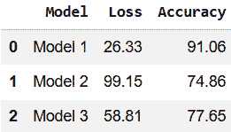

图 7.20 – 显示所有三种模型实验结果的 DataFrame

从结果中，我们可以清楚地看到模型 1 表现最好。你可能希望尝试更大的 DNN，但很快会遇到内存不足的问题。对于更大的数据集，DNN 的结果可能会大幅下降。接下来，让我们看看模型 1 在训练和验证数据上的表现：

```py
def plot_loss_accuracy(history_1):
  # Extract the loss and accuracy history for both training and validation data
    loss = history_1.history['loss']
    val_loss = history_1.history['val_loss']
    acc = history_1.history['accuracy']
    val_acc = history_1.history['val_accuracy']
  # Create subplots
    fig, (ax1, ax2) = plt.subplots(1, 2, figsize=(9, 6))
  # Plot the loss history
    ax1.plot(loss, label='Training loss')
    ax1.plot(val_loss, label='Validation loss')
    ax1.set_title('Loss history')
    ax1.set_xlabel('Epoch')
    ax1.set_ylabel('Loss')
    ax1.legend()
  # Plot the accuracy history
    ax2.plot(acc, label='Training accuracy')
    ax2.plot(val_acc, label='Validation accuracy')
    ax2.set_title('Accuracy history')
    ax2.set_xlabel('Epoch')
    ax2.set_ylabel('Accuracy')
    ax2.legend()
    plt.show()
```

我们创建了一个函数，使用 matplotlib 绘制训练和验证的损失与准确率图。我们将`history_1`传递给这个函数：

```py
# Lets plot the training and validation loss and accuracy
plot_loss_accuracy(history_1)
```

这将生成以下输出：

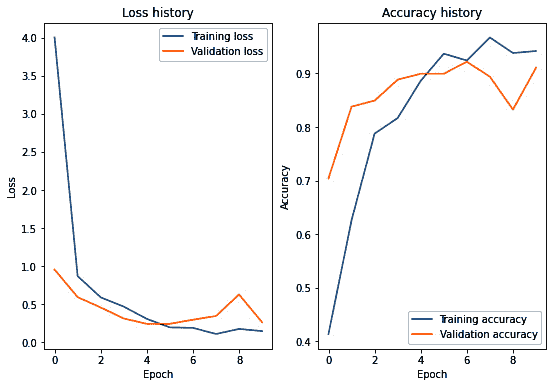

图 7.21 – 模型 1 的损失和准确率图

从图中可以看到，我们的训练准确率稳步上升，但在接近第 10 个 epoch 时，准确率未能达到最高点。同时，我们的验证数据的准确率出现了急剧下降。我们的损失从第 4 个 epoch 开始偏离。

# 总结

在这一章中，我们见识了 CNN 的强大。我们首先探讨了 DNN 在视觉识别任务中面临的挑战。接着，我们深入了解了 CNN 的构造，重点讲解了卷积层、池化层和全连接层等各个部分。在这里，我们观察了不同超参数的影响，并讨论了边界效应。接下来，我们利用所学知识，构建了一个实际的天气分类器，使用了两个 DNN 和一个 CNN。我们的 CNN 模型优于 DNN，展示了 CNN 在处理基于图像的问题中的优势。同时，我们还讨论并应用了一些 TensorFlow 函数，这些函数可以简化数据预处理和建模过程，特别是在处理图像数据时。

到目前为止，你应该已经很好地理解了 CNN 的结构和操作原理，以及如何使用它们解决实际的图像分类问题，并掌握了利用 TensorFlow 中各种工具有效、高效地预处理图像数据，从而提高模型性能。在下一章中，我们将讨论神经网络中的过拟合问题，并探索各种技术来克服这一挑战，确保我们的模型能很好地泛化到未见过的数据上。

在下一章中，我们将使用一些老技巧，如回调和超参数调整，看看是否能提高模型性能。我们还将实验数据增强和其他新技术，以进一步提高模型的表现。我们将在此任务上暂时画上句号，直到*第八章**，* *处理过拟合*。

# 问题

让我们测试一下本章所学内容：

1.  一个典型的 CNN 架构有哪些组成部分？

1.  卷积层在 CNN 架构中是如何工作的？

1.  什么是池化，为什么在 CNN 架构中使用池化？

1.  在 CNN 架构中，全连接层的目的是什么？

1.  填充对卷积操作有什么影响？

1.  使用 TensorFlow 图像数据生成器的优势是什么？

# 进一步阅读

要了解更多内容，您可以查看以下资源：

+   Dumoulin, V., & Visin, F. (2016). *《深度学习的卷积算术指南》*。[`arxiv.org/abs/1603.07285`](http://arxiv.org/abs/1603.07285)

+   Gulli, A., Kapoor, A. 和 Pal, S., 2019. *《使用 TensorFlow 2 和 Keras 的深度学习》*。伯明翰：Packt Publishing Ltd

+   Kapoor, A., Gulli, A. 和 Pal, S. (2020) *《深度学习与 TensorFlow 和 Keras 第三版：构建和部署监督、非监督、深度和强化学习模型》*。Packt Publishing Ltd

+   Krizhevsky, A., Sutskever, I., & Hinton, G. E. (2012). *《使用深度卷积神经网络进行 ImageNet 分类》*。《神经信息处理系统进展》(第 1097-1105 页)

+   Zhang, Y., & Yang, H. (2018). *《使用卷积神经网络和多类线性判别分析进行食物分类》*。2018 年 IEEE 国际信息重用与集成会议（IRI）(第 1-5 页)。IEEE

+   Zhang, Z., Ma, H., Fu, H., & Zha, C. (2020). *《基于单图像的无场景多类天气分类》*。IEEE Access, 8, 146038-146049\. doi:10.1109

+   `tf.image`模块：[`www.tensorflow.org/api_docs/python/tf/image`](https://www.tensorflow.org/api_docs/python/tf/image)
