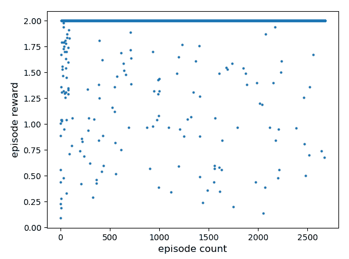
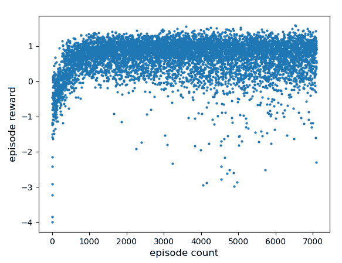

# 异步方法 - A3C 和 A2C

我们在上一章中看过 DDPG 算法。DDPG 算法（以及之前看到的 DQN 算法）的一个主要缺点是使用重放缓冲区来获取独立同分布的数据样本进行训练。使用重放缓冲区会消耗大量内存，这在强健的 RL 应用中是不可取的。为了解决这个问题，Google DeepMind 的研究人员提出了一种叫做 **异步优势演员评论家**（**A3C**）的在线算法。A3C 不使用重放缓冲区；而是使用并行工作处理器，在这里创建环境的不同实例并收集经验样本。一旦收集到有限且固定数量的样本，它们将用于计算策略梯度，并异步发送到中央处理器更新策略。更新后的策略随后会发送回工作处理器。使用并行处理器体验环境的不同场景可以产生独立同分布的样本，这些样本可以用来训练策略。本章将介绍 A3C，同时也会简要提到它的一个变种，叫做 **优势演员评论家**（**A2C**）。

本章将涵盖以下主题：

+   A3C 算法

+   A3C 算法应用于 CartPole

+   A3C 算法应用于 LunarLander

+   A2C 算法

在本章中，您将了解 A3C 和 A2C 算法，并学习如何使用 Python 和 TensorFlow 编写代码。我们还将把 A3C 算法应用于解决两个 OpenAI Gym 问题：CartPole 和 LunarLander。

# 技术要求

要顺利完成本章，以下知识将非常有帮助：

+   TensorFlow（版本 1.4 或更高）

+   Python（版本 2 或 3）

+   NumPy

# A3C 算法

如前所述，A3C 中有并行工作者，每个工作者将计算策略梯度并将其传递给中央（或主）处理器。A3C 论文还使用 `advantage` 函数来减少策略梯度中的方差。`loss` 函数由三部分组成，它们加权相加；包括价值损失、策略损失和熵正则化项。价值损失，*L[v]*，是状态值和目标值的 L2 损失，后者是通过折扣奖励和奖励总和计算得出的。策略损失，*L[p]*，是策略分布的对数与 `advantage` 函数 *A* 的乘积。熵正则化，*L[e]*，是香农熵，它是策略分布与其对数的乘积，并带有负号。熵正则化项类似于探索的奖励；熵越高，策略的正则化效果越好。这三项的加权分别为 0.5、1 和 -0.005。

# 损失函数

值损失计算为三个损失项的加权和：值损失 *L[v]*，策略损失 *L[p]* 和熵正则化项 *L[e]*，它们的计算方式如下：


*L* 是总损失，需要最小化。注意，我们希望最大化 `advantage` 函数，因此在 *L[p]* 中有一个负号，因为我们在最小化 *L*。同样，我们希望最大化熵项，而由于我们在最小化 *L*，因此在 *L* 中有一个负号的项 *-0.005 L[e]*。

# CartPole 和 LunarLander

在本节中，我们将 A3C 应用于 OpenAI Gym 的 CartPole 和 LunarLander。

# CartPole

CartPole 由一个垂直的杆子和一个推车组成，需要通过将推车向左或向右移动来保持平衡。CartPole 的状态维度为四，动作维度为二。

更多关于 CartPole 的详情，请查看以下链接：[`gym.openai.com/envs/CartPole-v0/`](https://gym.openai.com/envs/CartPole-v0/)。

# LunarLander

LunarLander，顾名思义，涉及着陆器在月球表面着陆。例如，当阿波罗 11 号的鹰号着陆器在 1969 年着陆月球表面时，宇航员尼尔·阿姆斯特朗和巴兹·奥尔德林必须在下降的最后阶段控制火箭推进器，并安全地将航天器降落到月球表面。之后，阿姆斯特朗走上月球并说道那句如今家喻户晓的话：“*人类的一小步， mankind 的一大步*”。在 LunarLander 中，月球表面有两面黄色旗帜，目标是将航天器降落在这两面旗帜之间。与阿波罗 11 号的鹰号着陆器不同，LunarLander 的燃料是无限的。LunarLander 的状态维度为八，动作维度为四，四个动作分别是：不做任何操作、启动左侧推进器、启动主推进器，或者启动右侧推进器。

查看以下链接，获取环境的示意图：[`gym.openai.com/envs/LunarLander-v2/`](https://gym.openai.com/envs/LunarLander-v2/)。

# A3C 算法应用于 CartPole

在这里，我们将用 TensorFlow 编写 A3C 并应用它，以便训练一个代理来学习 CartPole 问题。编写代码时需要以下代码文件：

+   `cartpole.py`：此文件将启动训练或测试过程

+   `a3c.py`：此文件中编写了 A3C 算法

+   `utils.py`：此文件包含实用函数

# 编写 cartpole.py

现在，我们将开始编写 `cartpole.py`。请按照以下步骤开始：

1.  首先，我们导入相关包：

```
import numpy as np
import matplotlib.pyplot as plt
import tensorflow as tf
import gym
import os
import threading
import multiprocessing

from random import choice
from time import sleep
from time import time

from a3c import *
from utils import *
```

1.  接下来，我们设置问题的参数。我们只需训练 `200` 个回合（没错，CartPole 是个简单问题！）。我们将折扣因子 gamma 设置为 `0.99`。CartPole 的状态和动作维度分别为 `4` 和 `2`。如果你想加载一个预训练的模型并继续训练，请将 `load_model` 设置为 `True`；如果从头开始训练，请将其设置为 `False`。我们还将设置 `model_path`：

```
max_episode_steps = 200
gamma = 0.99
s_size = 4 
a_size = 2 
load_model = False
model_path = './model'
```

1.  我们重置 TensorFlow 图，并创建一个用于存储模型的目录。我们将主处理器称为 CPU 0，工作线程的 CPU 编号为非零值。主处理器将执行以下任务：首先，它将创建一个 `global_episodes` 对象，用于计算全局变量的数量。工作线程的总数将存储在 `num_workers` 中，我们可以通过调用 Python 的 multiprocessing 库中的 `cpu_count()` 来获取系统中可用的处理器数量。我们将使用 Adam 优化器，并将其存储在名为 `trainer` 的对象中，同时设定适当的学习率。接着，我们将定义一个名为 `AC` 的演员-评论家类，因此我们必须首先创建一个 `AC` 类型的主网络对象，命名为 `master_network`，并传递适当的参数给该类的构造函数。然后，对于每个工作线程，我们将创建一个独立的 CartPole 环境实例和一个 `Worker` 类实例（稍后定义）。最后，为了保存模型，我们还将创建一个 TensorFlow saver：

```
tf.reset_default_graph()

if not os.path.exists(model_path):
    os.makedirs(model_path)

with tf.device("/cpu:0"): 

    # keep count of global episodes
    global_episodes = tf.Variable(0,dtype=tf.int32,name='global_episodes',trainable=False)

    # number of worker threads
    num_workers = multiprocessing.cpu_count() 

    # Adam optimizer
    trainer = tf.train.AdamOptimizer(learning_rate=2e-4, use_locking=True) 

    # global network
    master_network = AC(s_size,a_size,'global',None) 

    workers = []
    for i in range(num_workers):
        env = gym.make('CartPole-v0')
        workers.append(Worker(env,i,s_size,a_size,trainer,model_path,global_episodes))

    # tf saver
    saver = tf.train.Saver(max_to_keep=5)
```

1.  然后，我们启动 TensorFlow 会话。在会话中，我们为不同的工作线程创建一个 TensorFlow 协调器。接着，我们要么加载或恢复一个预训练的模型，要么运行 `tf.global_variables_initializer()` 来为所有权重和偏差分配初始值：

```
with tf.Session() as sess:

    # tf coordinator for threads
    coord = tf.train.Coordinator()

    if load_model == True:
        print ('Loading Model...')
        ckpt = tf.train.get_checkpoint_state(model_path)
        saver.restore(sess,ckpt.model_checkpoint_path)
    else:
        sess.run(tf.global_variables_initializer())
```

1.  然后，我们启动 `worker_threads`。具体来说，我们调用 `work()` 函数，它是 `Worker()` 类的一部分（稍后定义）。`threading.Thread()` 将为每个 `worker` 分配一个线程。通过调用 `start()`，我们启动了 `worker` 线程。最后，我们需要合并这些线程，确保它们在所有线程完成之前不会终止：

```
    # start the worker threads
    worker_threads = []
    for worker in workers:
        worker_work = lambda: worker.work(max_episode_steps, gamma, sess, coord,saver)
        t = threading.Thread(target=(worker_work))
        t.start()
        worker_threads.append(t)
    coord.join(worker_threads)
```

你可以在 [`www.tensorflow.org/api_docs/python/tf/train/Coordinator`](https://www.tensorflow.org/api_docs/python/tf/train/Coordinator) 了解更多关于 TensorFlow 协调器的信息。

# 编写 a3c.py

现在我们将编写 `a3c.py`。这涉及以下步骤：

1.  导入包

1.  设置权重和偏差的初始化器

1.  定义 `AC` 类

1.  定义 `Worker` 类

首先，我们需要导入必要的包：

```
import numpy as np
import matplotlib.pyplot as plt
import tensorflow as tf
import gym
import threading
import multiprocessing

from random import choice
from time import sleep
from time import time
from threading import Lock

from utils import *
```

然后，我们需要为权重和偏差设置初始化器；具体来说，我们使用 Xavier 初始化器来初始化权重，并使用零初始化偏差。对于网络的最后输出层，权重是指定范围内的均匀随机数：

```
xavier = tf.contrib.layers.xavier_initializer()
bias_const = tf.constant_initializer(0.05)
rand_unif = tf.keras.initializers.RandomUniform(minval=-3e-3,maxval=3e-3)
regularizer = tf.contrib.layers.l2_regularizer(scale=5e-4)
```

# AC 类

现在我们将描述 `AC` 类，它也是 `a3c.py` 的一部分。我们为 `AC` 类定义了构造函数，包含一个输入占位符，以及两个全连接的隐藏层，分别有 `256` 和 `128` 个神经元，并使用 `elu` 激活函数。接着是策略网络，使用 `softmax` 激活函数，因为我们在 CartPole 中的动作是离散的。此外，我们还有一个没有激活函数的值网络。请注意，我们对策略和价值网络共享相同的隐藏层，这与过去的示例不同：

```
class AC():
    def __init__(self,s_size,a_size,scope,trainer):
        with tf.variable_scope(scope):

            self.inputs = tf.placeholder(shape=[None,s_size],dtype=tf.float32)

            # 2 FC layers 
            net = tf.layers.dense(self.inputs, 256, activation=tf.nn.elu, kernel_initializer=xavier, bias_initializer=bias_const, kernel_regularizer=regularizer)
            net = tf.layers.dense(net, 128, activation=tf.nn.elu, kernel_initializer=xavier, bias_initializer=bias_const, kernel_regularizer=regularizer)

            # policy
            self.policy = tf.layers.dense(net, a_size, activation=tf.nn.softmax, kernel_initializer=xavier, bias_initializer=bias_const)

            # value
            self.value = tf.layers.dense(net, 1, activation=None, kernel_initializer=rand_unif, bias_initializer=bias_const)
```

对于`worker`线程，我们需要定义`loss`函数。因此，当 TensorFlow 作用域不是`global`时，我们定义一个动作占位符，以及其独热表示；我们还为`target`值和`advantage`函数定义占位符。然后，我们计算策略分布和独热动作的乘积，将它们相加，并将它们存储在`policy_times_a`对象中。然后，我们组合这些项来构建`loss`函数，正如我们之前提到的。我们计算值的 L2 损失的批次总和；策略分布乘以其对数的香农熵，带有一个负号；作为策略分布对数的乘积的`loss`函数；以及批次样本上`advantage`函数的总和。最后，我们使用适当的权重结合这些损失来计算总损失，存储在`self.loss`中：

```
# only workers need tf operations for loss functions and gradient updating
            if scope != 'global':
                self.actions = tf.placeholder(shape=[None],dtype=tf.int32)
                self.actions_onehot = tf.one_hot(self.actions,a_size,dtype=tf.float32)
                self.target_v = tf.placeholder(shape=[None],dtype=tf.float32)
                self.advantages = tf.placeholder(shape=[None],dtype=tf.float32)

                self.policy_times_a = tf.reduce_sum(self.policy * self.actions_onehot, [1])

                # loss 
                self.value_loss = 0.5 * tf.reduce_sum(tf.square(self.target_v - tf.reshape(self.value,[-1])))
                self.entropy = - tf.reduce_sum(self.policy * tf.log(self.policy + 1.0e-8))
                self.policy_loss = -tf.reduce_sum(tf.log(self.policy_times_a + 1.0e-8) * self.advantages)
                self.loss = 0.5 * self.value_loss + self.policy_loss - self.entropy * 0.005
```

正如您在上一章中看到的，我们使用`tf.gradients()`来计算策略梯度；具体来说，我们计算`loss`函数相对于本地网络变量的梯度，后者从`tf.get_collection()`中获得。为了减少梯度爆炸问题，我们使用 TensorFlow 的`tf.clip_by_global_norm()`函数将梯度裁剪为`40.0`的大小。然后，我们可以使用`tf.get_collection()`来收集全局网络的网络参数，作用于 Adam 优化器中的梯度，使用`apply_gradients()`。这将计算策略梯度：

```
# get gradients from local networks using local losses; clip them to avoid exploding gradients
local_vars = tf.get_collection(tf.GraphKeys.TRAINABLE_VARIABLES, scope)
self.gradients = tf.gradients(self.loss,local_vars)
self.var_norms = tf.global_norm(local_vars)
grads,self.grad_norms = tf.clip_by_global_norm(self.gradients,40.0)

# apply local gradients to global network using tf.apply_gradients()
global_vars = tf.get_collection(tf.GraphKeys.TRAINABLE_VARIABLES, 'global')
self.apply_grads = trainer.apply_gradients(zip(grads,global_vars))
```

# Worker()类

现在我们将描述`Worker()`类，每个工作线程都会使用。首先，我们为该类定义`__init__()`构造函数。在其中，我们定义工作人员的名称、编号、模型路径、Adam 优化器、全局剧集计数以及增加它的操作符：

```
class Worker():
    def __init__(self,env,name,s_size,a_size,trainer,model_path,global_episodes):
        self.name = "worker_" + str(name)
        self.number = name 
        self.model_path = model_path
        self.trainer = trainer
        self.global_episodes = global_episodes
        self.increment = self.global_episodes.assign_add(1)
```

我们还创建了`AC`类的本地实例，并传入适当的参数。然后，我们创建一个 TensorFlow 操作，将全局模型参数复制到本地。我们还创建了一个在对角线上具有一的 NumPy 单位矩阵，以及一个环境对象：

```
# local copy of the AC network 
self.local_AC = AC(s_size,a_size,self.name,trainer)

# tensorflow op to copy global params to local network
self.update_local_ops = update_target_graph('global',self.name) 

self.actions = np.identity(a_size,dtype=bool).tolist()
self.env = env
```

接下来，我们创建了`train()`函数，这是`Worker`类中最重要的部分。状态、动作、奖励、下一个状态或观察值和价值是从作为参数传递给函数的经验列表中获取的。我们使用一个名为`discount()`的实用函数计算了奖励的折现总和，很快我们将定义它。类似地，`advantage`函数也被折现了：

```
# train function
    def train(self,experience,sess,gamma,bootstrap_value):
        experience = np.array(experience)
        observations = experience[:,0]
        actions = experience[:,1]
        rewards = experience[:,2]
        next_observations = experience[:,3]
        values = experience[:,5]

        # discounted rewards
        self.rewards_plus = np.asarray(rewards.tolist() + [bootstrap_value])
        discounted_rewards = discount(self.rewards_plus,gamma)[:-1]

        # value 
        self.value_plus = np.asarray(values.tolist() + [bootstrap_value])

        # advantage function 
        advantages = rewards + gamma * self.value_plus[1:] - self.value_plus[:-1]
        advantages = discount(advantages,gamma)
```

然后，我们通过调用之前定义的 TensorFlow 操作来更新全局网络参数，并传入通过 TensorFlow 的 `feed_dict` 函数传递给占位符的所需输入。请注意，由于我们有多个工作线程在执行这个更新操作，因此需要避免冲突。换句话说，在任意时间点，只有一个线程可以更新主网络参数；两个或更多线程同时执行更新操作时，更新不会按顺序进行，这可能会导致问题。如果一个线程在另一个线程更新全局参数时也在进行更新，那么前一个线程的更新会被后一个线程覆盖，这是我们不希望发生的情况。这是通过 Python 的 threading 库中的 `Lock()` 函数实现的。我们创建一个 `Lock()` 实例，命名为 `lock`。`lock.acquire()` 只会授予当前线程访问权限，当前线程会执行更新操作，完成后通过 `lock.release()` 释放锁。最后，我们从函数中返回损失值：

```
# lock for updating global params
lock = Lock()
lock.acquire() 

# update global network params
fd = {self.local_AC.target_v:discounted_rewards, self.local_AC.inputs:np.vstack(observations), self.local_AC.actions:actions, self.local_AC.advantages:advantages}
value_loss, policy_loss, entropy, _, _, _ = sess.run([self.local_AC.value_loss, self.local_AC.policy_loss, self.local_AC.entropy, self.local_AC.grad_norms, self.local_AC.var_norms, self.local_AC.apply_grads], feed_dict=fd)

# release lock
lock.release() 

return value_loss / len(experience), policy_loss / len(experience), entropy / len(experience)
```

接下来，我们需要定义工作线程的 `work()` 函数。首先，我们获取全局的 episode 计数，并将 `total_steps` 设置为零。然后，在 TensorFlow 会话中，当线程仍然协调时，我们使用 `self.update_local_ops` 将全局参数复制到本地网络。接下来，我们启动一个 episode。由于 episode 尚未结束，我们获取策略分布并将其存储在 `a_dist` 中。我们从这个分布中使用 NumPy 的 `random.choice()` 函数采样一个动作。这个动作 `a` 被输入到环境的 `step()` 函数中，以获取新的状态、奖励和终止布尔值。我们可以通过将奖励除以 `100.0` 来调整奖励值。

经验存储在本地缓冲区中，称为 `episode_buffer`。我们还将奖励添加到 `episode_reward` 中，并增加 `total_steps` 计数以及 `episode_step_count`：

```
# worker's work function
def work(self,max_episode_steps, gamma, sess, coord, saver):
    episode_count = sess.run(self.global_episodes)
    total_steps = 0
    print ("Starting worker " + str(self.number))

        with sess.as_default(), sess.graph.as_default(): 
            while not coord.should_stop():

                # copy global params to local network 
                sess.run(self.update_local_ops)

                # lists for book keeping
                episode_buffer = []
                episode_values = []
                episode_frames = []

                episode_reward = 0
                episode_step_count = 0
                d = False

                s = self.env.reset()
                episode_frames.append(s)

                while not d:

                    # action and value
                    a_dist, v = sess.run([self.local_AC.policy,self.local_AC.value], feed_dict={self.local_AC.inputs:[s]})
                    a = np.random.choice(np.arange(len(a_dist[0])), p=a_dist[0])

                    if (self.name == 'worker_0'):
                       self.env.render()

                    # step
                    s1, r, d, info = self.env.step(a)

                    # normalize reward
                    r = r/100.0

                    if d == False:
                        episode_frames.append(s1)
                    else:
                        s1 = s

                    # collect experience in buffer 
                    episode_buffer.append([s,a,r,s1,d,v[0,0]])

                    episode_values.append(v[0,0])

                    episode_reward += r
                    s = s1 
                    total_steps += 1
                    episode_step_count += 1
```

如果缓冲区中有 `25` 个条目，说明是时候进行更新了。首先，计算并将值存储在 `v1` 中，然后将其传递给 `train()` 函数，该函数将输出三个损失值：价值、策略和熵。之后，重置 `episode_buffer`。如果 episode 已结束，我们就跳出循环。最后，我们在屏幕上打印出 episode 计数和奖励。请注意，我们使用了 `25` 个条目作为进行更新的时机。可以随意调整这个值，看看该超参数如何影响训练过程：

```
# if buffer has 25 entries, time for an update 
if len(episode_buffer) == 25 and d != True and episode_step_count != max_episode_steps - 1:
    v1 = sess.run(self.local_AC.value, feed_dict={self.local_AC.inputs:[s]})[0,0]
    value_loss, policy_loss, entropy = self.train(episode_buffer,sess,gamma,v1)
    episode_buffer = []
    sess.run(self.update_local_ops)

# idiot check to ensure we did not miss update for some unforseen reason 
if (len(episode_buffer) > 30):
    print(self.name, "buffer full ", len(episode_buffer))
    sys.exit()

if d == True:
    break

print("episode: ", episode_count, "| worker: ", self.name, "| episode reward: ", episode_reward, "| step count: ", episode_step_count)
```

在退出 episode 循环后，我们使用缓冲区中的剩余样本来训练网络。`worker_0` 包含全局或主网络，我们可以通过 `saver.save` 保存它。我们还可以调用 `self.increment` 操作，将全局 episode 计数加一：

```
# Update the network using the episode buffer at the end of the episode
if len(episode_buffer) != 0:
    value_loss, policy_loss, entropy = self.train(episode_buffer,sess,gamma,0.0)

print("loss: ", self.name, value_loss, policy_loss, entropy)

# write to file for worker_0
if (self.name == 'worker_0'): 
    with open("performance.txt", "a") as myfile:
        myfile.write(str(episode_count) + " " + str(episode_reward) + " " + str(episode_step_count) + "\n")

# save model params for worker_0
if (episode_count % 25 == 0 and self.name == 'worker_0' and episode_count != 0):
        saver.save(sess,self.model_path+'/model-'+str(episode_count)+'.cptk')
print ("Saved Model")

if self.name == 'worker_0':
    sess.run(self.increment)
episode_count += 1
```

这就是 `a3c.py` 的内容。

# 编写 utils.py

最后，我们将编写`utils.py`中的`utility`函数。我们将导入所需的包，并且还将定义之前使用的`update_target_graph()`函数。它以源和目标参数的作用域作为参数，并将源中的参数复制到目标中：

```
import numpy as np
import tensorflow as tf
from random import choice

# copy model params 
def update_target_graph(from_scope,to_scope):
    from_params = tf.get_collection(tf.GraphKeys.TRAINABLE_VARIABLES, from_scope)
    to_params = tf.get_collection(tf.GraphKeys.TRAINABLE_VARIABLES, to_scope)

    copy_ops = []
    for from_param,to_param in zip(from_params,to_params):
        copy_ops.append(to_param.assign(from_param))
    return copy_ops
```

另一个我们需要的工具函数是`discount()`函数。它会将输入列表`x`倒序运行，并按折扣因子`gamma`的权重进行求和。然后返回折扣后的值：

```

# Discounting function used to calculate discounted returns.
def discount(x, gamma):
    dsr = np.zeros_like(x,dtype=np.float32)
    running_sum = 0.0
    for i in reversed(range(0, len(x))):
       running_sum = gamma * running_sum + x[i]
       dsr[i] = running_sum 
    return dsr
```

# 在 CartPole 上训练

`cartpole.py`的代码可以使用以下命令运行：

```
python cartpole.py
```

代码将回合奖励存储在`performance.txt`文件中。以下截图展示了训练过程中回合奖励的图表：



图 1：在 A3C 训练下的 CartPole 回合奖励

请注意，由于我们已经塑形了奖励，您在上图中看到的回合奖励与其他研究人员在论文和/或博客中报告的值不同。

# A3C 算法应用于 LunarLander

我们将扩展相同的代码来训练一个智能体解决 LunarLander 问题，该问题比 CartPole 更具挑战性。大部分代码与之前相同，因此我们只会描述需要对前面的代码进行的更改。首先，LunarLander 问题的奖励塑形不同。因此，我们将在`a3c.py`文件中包含一个名为`reward_shaping()`的函数。它将检查着陆器是否已撞击月球表面；如果是，回合将被终止，并会受到`-1.0`的惩罚。如果着陆器未移动，回合将被终止，并支付`-0.5`的惩罚：

```
def reward_shaping(r, s, s1):
     # check if y-coord < 0; implies lander crashed
     if (s1[1] < 0.0):
       print('-----lander crashed!----- ')
       d = True 
       r -= 1.0

     # check if lander is stuck
     xx = s[0] - s1[0]
     yy = s[1] - s1[1]
     dist = np.sqrt(xx*xx + yy*yy) 
     if (dist < 1.0e-4):
       print('-----lander stuck!----- ')
       d = True 
       r -= 0.5
     return r, d
```

我们将在`env.step()`之后调用此函数：

```
# reward shaping for lunar lander
r, d = reward_shaping(r, s, s1)
```

# 编写 lunar.py

之前练习中的`cartpole.py`文件已重命名为`lunar.py`。所做的更改如下。首先，我们将每个回合的最大时间步数设置为`1000`，折扣因子设置为`gamma = 0.999`，状态和动作维度分别设置为`8`和`4`：

```
max_episode_steps = 1000
gamma = 0.999
s_size = 8 
a_size = 4
```

环境设置为`LunarLander-v2`：

```
env = gym.make('LunarLander-v2')
```

这就是在 LunarLander 上训练 A3C 的代码更改。

# 在 LunarLander 上训练

你可以通过以下命令开始训练：

```
python lunar.py
```

这将训练智能体并将回合奖励存储在`performance.txt`文件中，我们可以如下绘制图表：



图 2：使用 A3C 的 LunarLander 回合奖励

如你所见，智能体已经学会了将航天器安全着陆到月球表面。祝你着陆愉快！再强调一次，回合奖励与其他强化学习从业者在论文和博客中报告的值不同，因为我们对奖励进行了缩放。

# A2C 算法

A2C 和 A3C 的区别在于 A2C 执行同步更新。在这里，所有工作线程会等待直到它们完成经验收集并计算出梯度。只有在这个过程中，全球（或主）网络的参数才会被更新。这与 A3C 不同，后者的更新是异步进行的，也就是说工作线程不会等待其他线程完成。A2C 比 A3C 更容易编码，但这里没有进行这部分的处理。如果你对此感兴趣，可以将前面提到的 A3C 代码转换为 A2C，之后可以对比两种算法的性能。

# 总结

在本章中，我们介绍了 A3C 算法，它是一种适用于离散和连续动作问题的在线策略算法。你已经看到三种不同的损失项是如何结合成一个并优化的。Python 的线程库非常有用，可以运行多个线程，每个线程中都有一个策略网络的副本。这些不同的工作线程计算策略梯度，并将其传递给主线程以更新神经网络的参数。我们将 A3C 应用于训练 CartPole 和 LunarLander 问题的智能体，且智能体学习得非常好。A3C 是一种非常强健的算法，不需要重放缓冲区，尽管它确实需要一个本地缓冲区来收集少量经验，之后这些经验将用于更新网络。最后，我们还介绍了该算法的同步版本——A2C。

本章应该已经极大地提升了你对另一种深度强化学习算法的理解。在下一章，我们将学习本书中的最后两个强化学习算法：TRPO 和 PPO。

# 问题

1.  A3C 是在线策略算法还是离线策略算法？

1.  为什么使用香农熵项？

1.  使用大量工作线程有什么问题？

1.  为什么在策略神经网络中使用 softmax？

1.  为什么我们需要一个`advantage`函数？

1.  这是一个练习：对于 LunarLander 问题，重复训练过程，不进行奖励塑形，看看智能体学习的速度是比本章看到的更快还是更慢。

# 进一步阅读

+   *深度强化学习中的异步方法*，作者：*Volodymyr Mnih*，*Adrià Puigdomènech Badia*，*Mehdi Mirza*，*Alex Graves*，*Timothy P. Lillicrap*，*Tim Harley*，*David Silver*，和*Koray Kavukcuoglu*，A3C 论文来自*DeepMind*，arXiv:1602.01783：[`arxiv.org/abs/1602.01783`](https://arxiv.org/abs/1602.01783)

+   *深度强化学习实战*，作者：*Maxim Lapan*，*Packt Publishing*：[`www.packtpub.com/big-data-and-business-intelligence/deep-reinforcement-learning-hands`](https://www.packtpub.com/big-data-and-business-intelligence/deep-reinforcement-learning-hands)
