# 前言

# 关于本书

如果你希望学习如何在 TensorFlow 中构建深度学习模型以解决实际问题，那么这本书非常适合你。

本书从介绍 TensorFlow 开始，带领你了解张量的基本数学运算，以及数据预处理方法，用以构建模型并通过 TensorFlow 资源节省开发时间。你将构建回归和分类模型，使用正则化防止模型对训练数据过拟合，并创建卷积神经网络以解决图像数据集上的分类任务。最后，你将学习实现预训练、递归和生成模型，并创建自己定制的 TensorFlow 组件，在模型中使用。

在阅读完本书后，你将具备使用 TensorFlow 框架构建、训练和评估深度学习模型的实际技能。

## 关于作者

*Matthew Moocarme* 是一位经验丰富的数据科学家，拥有超过八年的创建和使用机器学习模型的经验。他有物理科学背景，持有 CUNY 研究生中心的物理学博士学位。目前，他带领一个数据科学家和工程师团队，在媒体和广告领域构建和整合机器学习模型，应用于各种场景。在闲暇时，Matthew 通过发布作品、参加会议演讲和举办工作坊与数据科学社区分享自己的知识。

*Anthony So* 是数据科学领域的知名领袖。他在利用高级分析和人工智能解决不同行业复杂商业问题方面拥有丰富经验，涉及金融服务、媒体和电信等行业。他目前是一个最具创新力的金融科技初创公司首席数据官。他也是多本畅销书的作者，涵盖数据科学、机器学习和深度学习等领域。他曾在多个黑客松比赛中获奖，如 Unearthed、GovHack 和 Pepper Money 等。Anthony 拥有两个硕士学位，一个是计算机科学，另一个是数据科学与创新。

*Anthony Maddalone* 是 TieSet 的研究工程师，TieSet 是位于硅谷的分布式人工智能和联邦学习领域的领导者。他曾是一个成功初创公司的创始人兼 CEO。Anthony 和妻子及两个孩子一起生活在科罗拉多州，享受户外活动的时光。他还是乔治亚理工学院工业工程方向的分析学硕士候选人。

## 本书适合人群

本书适合任何希望加深对深度学习理解，并开始使用 TensorFlow 构建神经网络的人。如果你具备 Python 编程及其库的基本知识，以及对数据科学和机器学习基础的通用理解，将帮助你更轻松地掌握本书所涉及的内容。

## 关于章节

*第一章*，*TensorFlow 机器学习简介*，介绍了支撑 TensorFlow 和机器学习模型开发的数学概念，包括张量和线性代数。

*第二章*，*加载和处理数据*，教你如何加载和处理各种数据类型，包括表格数据、图像、音频和文本，以便将它们输入到机器学习模型中。

*第三章*，*TensorFlow 开发*，介绍了 TensorFlow 提供的各种开发工具，帮助你构建模型，包括 TensorBoard、TensorFlow Hub 和 Google Colab。这些工具可以加快开发速度，并帮助你理解模型的架构和性能。

*第四章*，*回归与分类模型*，引导你通过使用 TensorFlow 构建回归和分类任务的模型。你将学习如何构建简单的模型、使用哪些层以及为每个任务选择合适的损失函数。

*第五章*，*分类模型*，展示了如何使用 TensorFlow 构建分类模型。你将学习如何定制神经网络的架构，以适应二分类、多类分类或多标签分类。

*第六章*，*正则化与超参数调优*，讨论了帮助防止模型过拟合的不同方法，例如正则化、丢弃法（dropout）或提前停止（early stopping）。你还将学习如何进行自动超参数调优。

*第七章*，*卷积神经网络*，展示了如何构建包含卷积层的神经网络。这些网络因其在处理图像时的优良表现而广受欢迎，因为它们包含卷积层。

*第八章*，*预训练网络*，教你如何利用预训练模型来实现更好的性能，而无需从头开始训练模型。

*第九章*，*递归神经网络*，介绍了另一种类型的深度学习架构——递归神经网络，这种架构最适合处理时序数据，例如时间序列或文本。

*第十章*，*自定义 TensorFlow 组件*，通过教你如何构建自己的自定义 TensorFlow 组件，如损失函数和神经网络层，扩展你的技能。

*第十一章*，*生成模型*，展示了如何通过训练模型在数据集上发现潜在的模式和表示，从而生成新的和创新的数据。训练好的模型将能够生成完全新的、令人信服的真实例子。

## 规范

文本中的代码词、数据库表名、文件夹名称、文件名、文件扩展名、路径名、虚拟 URL 和用户输入按如下方式显示：

"TensorFlow 可以通过导入特定的库在 Python 中使用。你可以使用 `import` 语句在 Python 中导入库。"

屏幕上看到的单词，例如在菜单或对话框中显示的，也会以相同的格式呈现。

代码块的设置如下：

```
int_variable = tf.Variable(4113, tf.int16)
int_variable
```

新的重点词汇如下所示：“**反向传播**是确定损失函数对模型参数的导数的过程。”

代码片段中的关键部分被加粗如下：

```
df = pd.read_csv('Bias_correction_ucl.csv')
```

## 代码展示

跨越多行的代码通过反斜杠 (`\`) 来分隔。当代码执行时，Python 会忽略反斜杠，并将下一行的代码视为当前行的直接延续。

例如，

```
year_dummies = pd.get_dummies(df['Date'].dt.year, \
                              prefix='year')
year_dummies
```

代码中添加了注释，以帮助解释特定的逻辑部分。单行注释使用 `#` 符号表示，如下所示：

```
# Importing the matplotlib library
import matplotlib.pyplot as plt
```

## 最低硬件要求

为了获得最佳体验，我们推荐以下硬件配置：

+   处理器：双核或更高

+   内存：4 GB RAM

+   存储：10 GB 可用空间

## 下载代码包

从 GitHub 下载代码文件，地址为 [`packt.link/Z7pcq`](https://packt.link/Z7pcq)。请参考这些代码文件以获取完整的代码包。这里的文件包含每一章的练习、活动以及一些中间代码。当您遇到困难时，这些文件可以作为有用的参考。

在 GitHub 仓库页面，您可以点击绿色的 `Code` 按钮，然后点击 `Download ZIP` 选项，将完整代码作为 ZIP 文件下载到您的磁盘（参见 *图 0.1*）。然后，您可以将这些代码文件解压到您选择的文件夹中，例如 `C:\Code`。

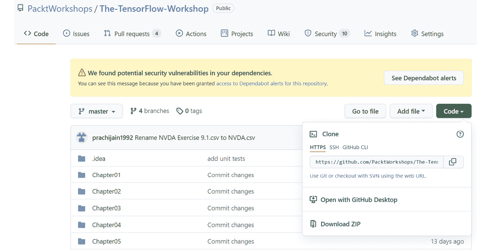

图 0.1：下载 ZIP 选项

在您的系统上，解压后的 ZIP 文件应该包含 GitHub 仓库中的所有文件：

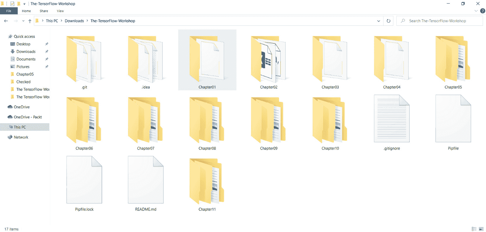

图 0.2：GitHub 代码目录结构

## 设置您的环境

在详细探索本书之前，您需要设置特定的软件和工具。在接下来的部分，您将看到如何进行设置。

### 在您的系统上安装 Anaconda

本书中所有练习和活动的代码都可以通过 Jupyter Notebook 执行。您需要先安装 Anaconda Navigator，它是一个可以访问 Jupyter 笔记本的界面。Anaconda Navigator 会作为 Anaconda Individual Edition 的一部分安装，Anaconda 是一个适用于 Windows、macOS 和 Linux 的开源 Python 分发平台。安装 Anaconda 时也会安装 Python。请前往 [`www.anaconda.com/distribution/`](https://www.anaconda.com/distribution/)：

1.  在打开的页面中，点击 `Download` 按钮（由 *1* 标注）。确保下载的是 `Individual Edition`。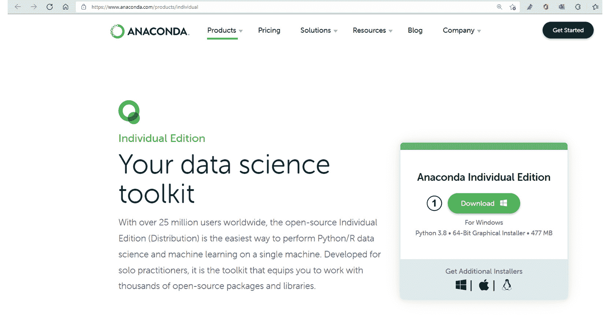

    图 0.3：Anaconda 主页

1.  安装程序应立即开始下载。网站会默认根据您的系统配置选择合适的安装程序。如果您更喜欢为其他操作系统（Windows、macOS 或 Linux）以及系统配置（32 位或 64 位）下载 Anaconda，可以点击框底部的`获取附加安装程序`链接（参考*图 0.3*）。页面应该会滚动到一个部分（参考*图 0.4*），允许您根据所需的操作系统和配置选择不同的选项。本书建议您使用最新版本的 Python（3.8 或更高版本）。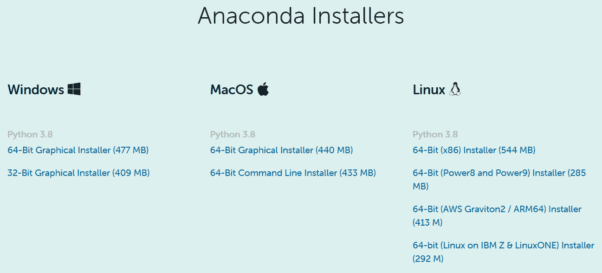

    图 0.4: 根据操作系统下载 Anaconda

1.  请按照屏幕上显示的安装步骤进行操作。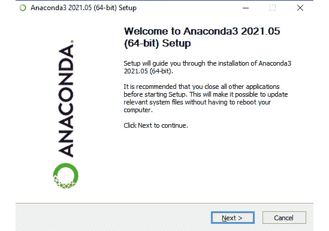

    图 0.5: Anaconda 设置

1.  在 Windows 系统中，如果您之前从未在系统中安装过 Python，可以勾选提示将 Anaconda 添加到您的`PATH`的复选框。这样，您就可以在默认命令提示符中运行 Anaconda 特有的命令（如`conda`）。如果您已经安装了 Python，或者之前安装过 Anaconda 的旧版本，建议您不要勾选此选项（您可以通过 Anaconda Prompt 应用来运行 Anaconda 命令）。根据您的系统配置，安装可能需要一些时间。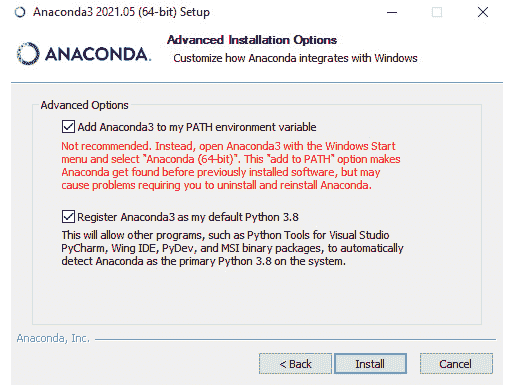

    图 0.6: Anaconda 安装步骤

    若要获取更详细的安装说明，您可以点击以下链接查阅官方文档：Linux 版请点击此链接（[`docs.anaconda.com/anaconda/install/linux/`](https://docs.anaconda.com/anaconda/install/linux/)）；macOS 版请点击此链接（[`docs.anaconda.com/anaconda/install/mac-os/`](https://docs.anaconda.com/anaconda/install/mac-os/)）；Windows 版请点击此链接（[`docs.anaconda.com/anaconda/install/windows/`](https://docs.anaconda.com/anaconda/install/windows/)）。

1.  要检查 Anaconda Navigator 是否正确安装，请在您的应用程序中查找`Anaconda Navigator`。查找一个具有以下图标的应用程序。根据您的操作系统，图标的外观可能会有所不同。

    图 0.7: Anaconda Navigator 图标

    您还可以使用操作系统的搜索功能来搜索该应用程序。例如，在 Windows 10 上，您可以使用*Windows 键* + *S*组合键，然后输入*Anaconda Navigator*。在 macOS 上，您可以使用 Spotlight 搜索。在 Linux 上，您可以打开终端，输入`anaconda-navigator`命令并按*Return*键。

    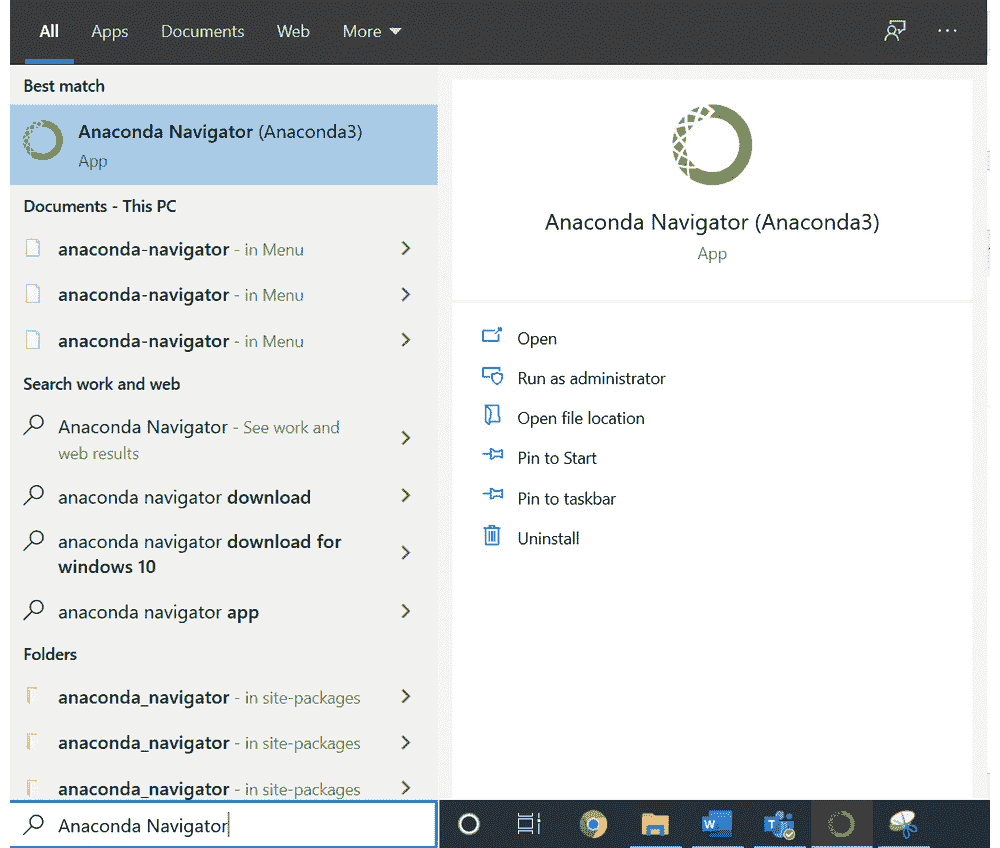

    图 0.8: 在 Windows 10 上搜索 Anaconda Navigator

    有关如何验证是否已安装 Anaconda Navigator 的详细步骤，请参考以下链接：[`docs.anaconda.com/anaconda/install/verify-install/`](https://docs.anaconda.com/anaconda/install/verify-install/)。

1.  点击图标打开 Anaconda Navigator。首次加载可能需要一些时间，但安装成功后，你应该看到类似的界面：

图 0.9：Anaconda Navigator 界面

如果你对安装过程有更多问题，可以参考 Anaconda 文档中的常见问题列表：[`docs.anaconda.com/anaconda/user-guide/faq/`](https://docs.anaconda.com/anaconda/user-guide/faq/)。

### 启动 Jupyter Notebook

打开 Anaconda Navigator 后，你可以从这个界面启动 Jupyter Notebook。以下步骤将指导你如何操作：

1.  打开 Anaconda Navigator，你应该能看到以下界面：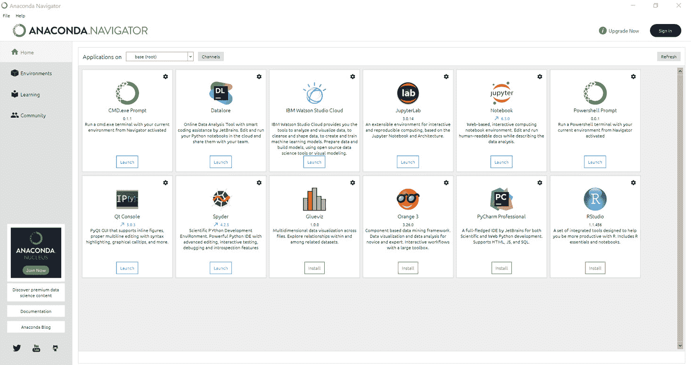

    图 0.10：Anaconda Navigator 界面

1.  现在，点击 `Launch` 在 `Jupyter Notebook` 面板下启动本地系统上的 Jupyter Notebook 界面：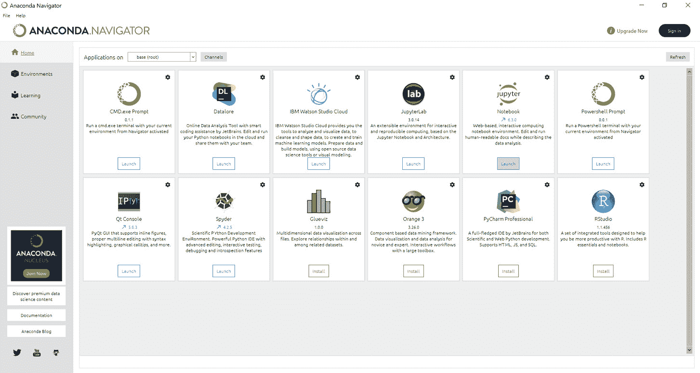

    图 0.11：Jupyter Notebook 启动选项

1.  点击 `Launch` 按钮后，你会注意到，尽管前面截图显示的窗口没有变化，但在默认浏览器中会打开一个新标签页。这就是所谓的*Notebook Dashboard*。它会默认打开到你的根目录。对于 Windows 用户，这个路径类似于 `C:\Users\<用户名>`。在 macOS 和 Linux 上，它会是 `/home/<用户名>/`。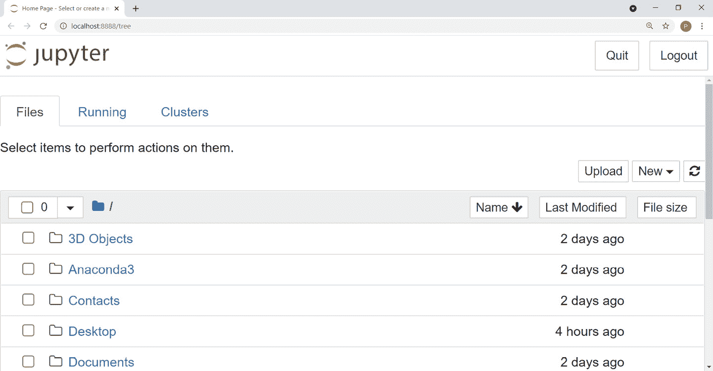

    图 0.12：Notebook Dashboard

    请注意，你也可以通过在终端或命令提示符中运行 `jupyter notebook` 命令来直接打开 Jupyter Notebook，或者像在*图 0.8*中那样，在应用程序中搜索 `Jupyter Notebook`。

1.  你可以使用这个仪表板作为文件浏览器，导航到你下载或存储书中代码文件的目录（关于如何从 GitHub 下载文件，请参考*下载代码包*章节）。一旦你导航到目标目录，就可以开始创建新的笔记本。或者，如果你已经从我们的代码库下载了代码，也可以打开现有的笔记本（笔记本文件扩展名为 `.inpyb`）。这里的菜单非常简便易用：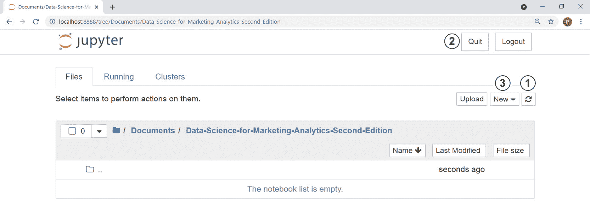

    图 0.13：Jupyter Notebook 导航菜单选项介绍

    如果你通过操作系统的文件资源管理器更改了目录，但在 Jupyter Notebook 导航器中没有显示更改后的文件，可以点击`刷新笔记本列表`按钮（标注为*1*）。要退出，点击`退出按钮`（标注为*2*）。要创建一个新文件（一个新的 Jupyter 笔记本），你可以点击`新建`按钮（标注为*3*）。

1.  点击`New`按钮将会弹出如下的下拉菜单：

图 0.14：创建一个新的 Jupyter 笔记本

你可以通过选择`Python 3`来开始并创建你的第一个笔记本；然而，建议你同时安装我们提供的虚拟环境，这样可以帮助你安装本书所需的所有软件包。接下来的章节将教你如何安装它。

注意

你可以在这里找到关于 Jupyter 笔记本界面和快捷键的详细教程：[`jupyter-notebook.readthedocs.io/en/stable/notebook.html#the-jupyter-notebook`](https://jupyter-notebook.readthedocs.io/en/stable/notebook.html#the-jupyter-notebook)。

### 安装 tensorflow 虚拟环境

当你运行习题和活动的代码时，你会发现即使安装了 Anaconda，仍然有一些库需要在书中的不同阶段单独安装。也许你已经安装了这些库，但它们的版本可能与我们使用的版本不同，这可能会导致不同的结果。正因如此，我们在本书中提供了一个`environment.yml`文件，它将：

1.  一次性安装本书所需的所有软件包和库。

1.  确保你的库版本与我们为本书编写代码时使用的版本匹配。

1.  确保你根据本课程编写的代码与任何其他编程环境分开。

你可以通过点击以下链接下载`environment.yml`文件：[`packt.link/Z7pcq`](https://packt.link/Z7pcq)。

保存此文件，最好将其保存在你运行本书代码的同一文件夹中。如果你已经按照《下载代码包》章节的说明从 GitHub 下载了代码，那么该文件应该已经存在于父目录中，你无需单独下载它。

要设置环境，请按照以下步骤操作：

1.  在 macOS 上，从 Launchpad 打开终端（你可以在此处找到关于终端的更多信息：[`support.apple.com/en-in/guide/terminal/apd5265185d-f365-44cb-8b09-71a064a42125/mac`](https://support.apple.com/en-in/guide/terminal/apd5265185d-f365-44cb-8b09-71a064a42125/mac)）。在 Linux 上，打开你所在发行版的终端应用程序。在 Windows 上，你可以直接搜索应用程序并打开 Anaconda Prompt。你可以通过打开`开始`菜单并搜索`Anaconda Prompt`来做到这一点。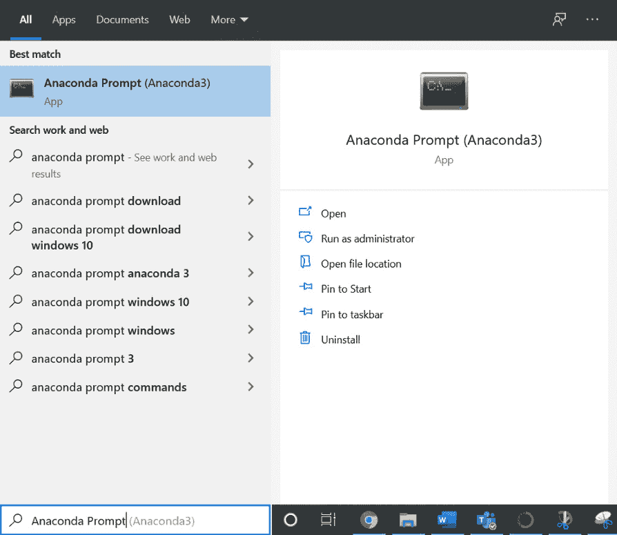

    图 0.15：在 Windows 中搜索 Anaconda Prompt

    应该会打开一个新的终端，默认情况下，它将在你的主目录中启动：

    

    ](img/B16341_0_16.jpg)

    图 0.16：Anaconda 终端提示符

    在 Linux 系统中，它将显示如下：

    

    ](img/B16341_0_17.jpg)

    图 0.17：Linux 中的终端

1.  在终端中，使用`cd`命令导航到保存`environment.yml`文件的目录。例如，如果你把文件保存在`Documents\The-TensorFlow-Workshop`中，那么在命令提示符下输入以下命令并按*Enter*键：

    ```
    cd Documents\The-TensorFlow-Workshop
    ```

    请注意，命令可能会根据你的目录结构和操作系统有所不同。

1.  现在你已导航到正确的文件夹，在终端中键入或粘贴以下命令来创建新的`conda`环境。按*Enter*键运行该命令：

    ```
    conda env create -f environment.yml
    ```

    这将安装`tensorflow`虚拟环境及运行本书代码所需的库。如果安装过程中有提示要求你确认，输入`y`并按*Enter*键继续创建环境。根据你的系统配置，过程可能需要一些时间才能完成。

    注意

    若要查看完整的`conda`命令列表，请访问以下链接：[`conda.io/projects/conda/en/latest/index.html`](https://conda.io/projects/conda/en/latest/index.html)。

    若要查看有关如何管理`conda`环境的详细指南，请访问以下链接：[`conda.io/projects/conda/en/latest/user-guide/tasks/manage-environments.html`](https://conda.io/projects/conda/en/latest/user-guide/tasks/manage-environments.html)。

1.  完成后，在终端中键入或粘贴以下命令来激活新安装的环境——`tensorflow`：

    ```
    conda activate tensorflow
    ```

    如果安装成功，你将看到环境名称的括号内由`base`更改为`tensorflow`：

    

    ](img/B16341_0_18.jpg)

    图 0.18：环境名称出现在终端

1.  在新激活的`conda`环境中运行以下命令来安装`ipykernel`：

    ```
    pip3 instead of pip. 
    ```

1.  在同一环境中，运行以下命令以将`ipykernel`添加为 Jupyter 内核：

    ```
    python -m ipykernel install --user --name=tensorflow
    ```

1.  **仅限 Windows：**如果你使用的是 Windows 系统，请键入或粘贴以下命令。否则，你可以跳过此步骤并退出终端：

    ```
    conda install pywin32
    ```

1.  启动 Jupyter 笔记本时，选择创建的`tensorflow`内核。

    ](img/B16341_0_19.jpg)

图 0.19：选择 tensorflow 内核

一个新标签页将会打开，里面是一个新的、未命名的 Jupyter 笔记本，你可以开始编写代码：


](img/B16341_0_20.jpg)

图 0.20：新的 Jupyter 笔记本

## 联系我们

我们欢迎读者的反馈。

`customercare@packtpub.com`。

**勘误**：尽管我们已尽一切努力确保内容的准确性，但错误难免会发生。如果你在本书中发现错误，我们将不胜感激，感谢你能向我们报告。请访问 [www.packtpub.com/support/errata](http://www.packtpub.com/support/errata) 并填写表格。

`copyright@packt.com` 并附上材料的链接。

**如果你有兴趣成为一名作者**：如果你在某个领域拥有专业知识，并且有兴趣写作或为书籍做贡献，请访问 [authors.packtpub.com](http://authors.packtpub.com)。

## 请留下评论

通过在亚马逊上留下详细、公正的评论，让我们知道你的想法。我们感谢所有的反馈——这帮助我们继续制作优秀的产品，并帮助有志的开发者提升技能。请花几分钟时间给出你的想法——这对我们意义重大。你可以通过点击以下链接留下评论：[`packt.link/r/1800205252`](https://packt.link/r/1800205252)。
