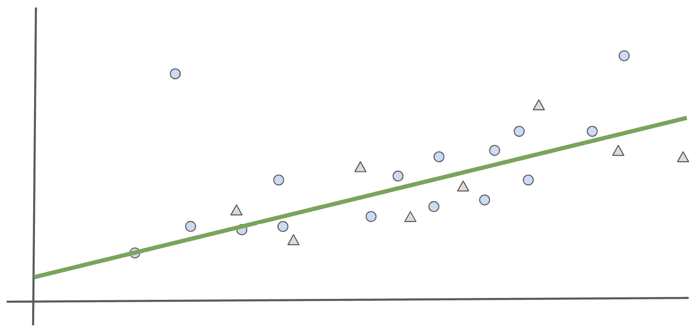
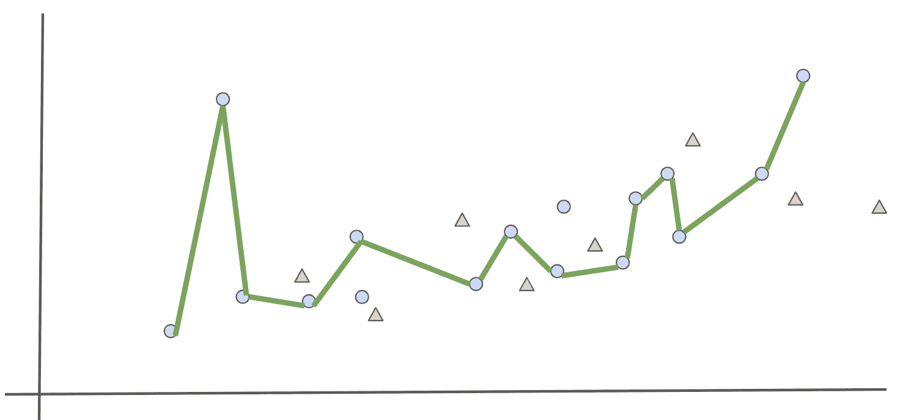
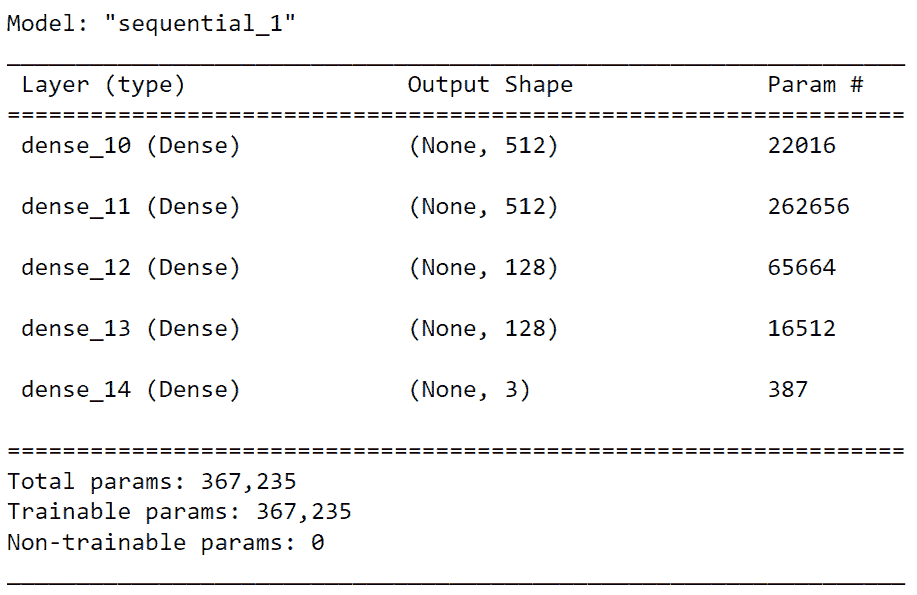
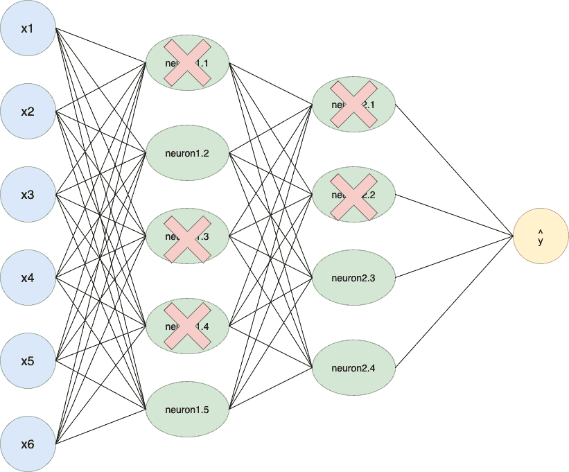
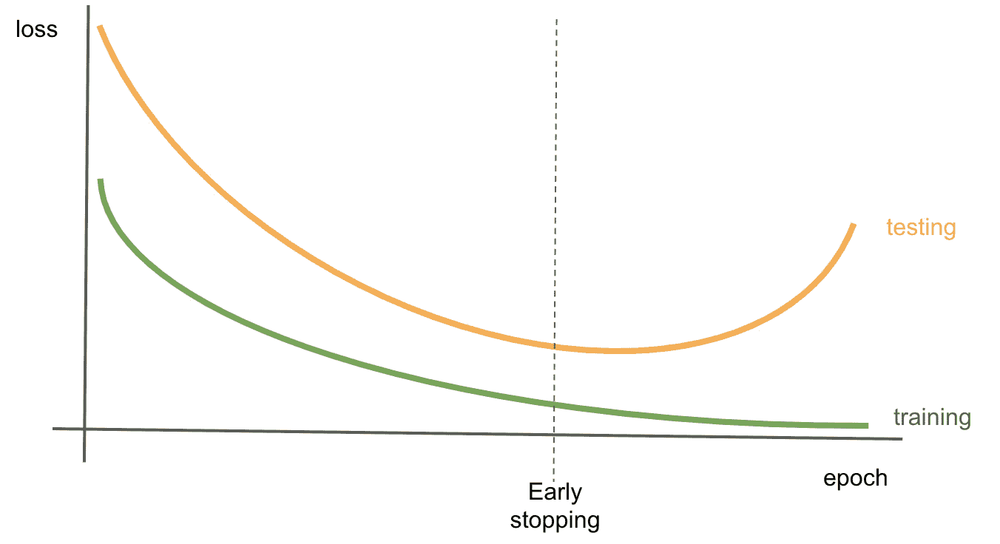
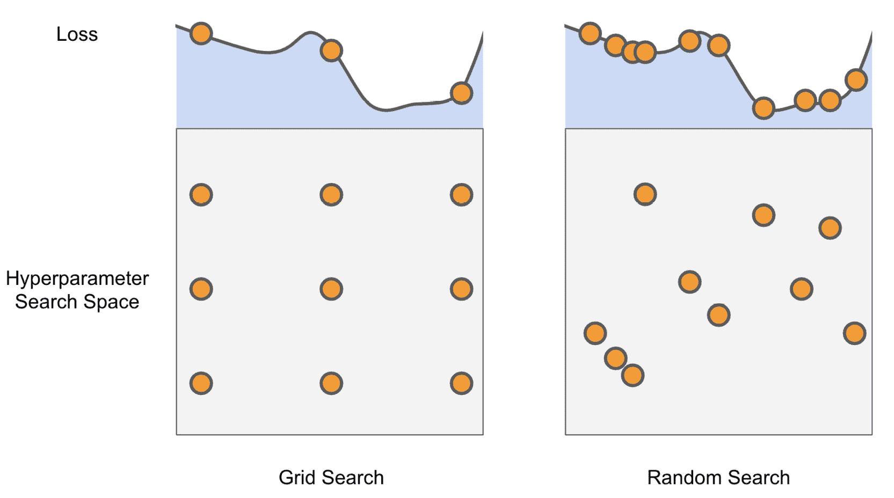

# 6\. 正则化与超参数调整

概述

在本章中，您将了解超参数调整。您将通过使用 TensorFlow 在深度学习模型上执行正则化来获得实际经验，以减少过拟合。您将探讨 L1、L2 和 dropout 正则化等概念。最后，您将介绍 Keras Tuner 包，用于执行自动超参数调整。

到本章结束时，您将能够应用正则化和调整超参数，以减少过拟合模型的风险并提高其性能。

# 引言

在上一章中，您学习了分类模型如何在响应变量是离散的情况下解决问题。您还看到了用于评估此类分类器性能的不同指标。您通过使用 TensorFlow 构建和训练二进制、多类别和多标签分类器获得了实际经验。

在评估模型时，您将面临三种不同的情况：模型过拟合、模型欠拟合和模型表现良好。最后一种情况是理想的，即模型准确地预测正确结果并且能够很好地泛化到未见数据上。

如果模型欠拟合，意味着它既没有达到令人满意的性能，也没有准确预测目标变量。在这种情况下，数据科学家可以尝试调整不同的超参数，并找到最佳组合来提升模型的准确性。另一种可能性是改进输入数据集，处理诸如数据清洁度或特征工程等问题。

当模型只能在训练集上表现出色，并在测试集上表现不佳时，我们称其为过拟合。在这种情况下，模型只学习了与训练数据相关的数据模式。正则化有助于降低过拟合的风险。

# 正则化技术

数据科学家的主要目标是训练一个在训练过程中能够实现高性能并且在未见数据上能够泛化良好的模型。该模型应能够在训练过程中使用的数据和新数据上预测正确的结果。这也是为什么模型总是在测试集上进行评估的原因。这一组数据用作评估模型在生产中输出正确结果能力的代理。



图 6.1: 模型既不过拟合也不欠拟合

在 *Figure 6.1* 中，线性模型（线）似乎能够相对准确地预测训练集（圆圈）和测试集（三角形）的结果。

但有时模型无法很好地泛化，会对训练集过拟合。在这种情况下，模型在训练集和测试集上的表现会有很大的差异。



图 6.2: 模型过拟合

*图 6.2* 显示模型（线条）只学会了对训练集（圆圈）进行准确预测，并且在测试集（三角形）上的表现很差。这个模型显然是过拟合的。

幸运的是，有一些**正则化技术**，数据科学家可以利用这些技术来减少并防止过拟合，相关内容将在以下章节中定义。

## L1 正则化

对于深度学习模型，当某些特征的权重高于它们应有的值时，就会发生过拟合。模型过于强调这些特征，因为它认为它们对预测训练集非常重要。不幸的是，这些特征对测试集或任何新数据的相关性较低。正则化技术会惩罚这些权重并减少它们对模型预测的影响。

正则化有多种方式。其中一种方式是将正则化组件添加到成本函数中：


图 6.3: 将正则化组件添加到成本函数

添加这个正则化组件会导致模型的权重变小，因为神经网络在进行前向和反向传播时会尽量减少成本函数的值。

一个非常流行的正则化组件是 L1。它的公式如下：


图 6.4: L1 正则化

 是一个超参数，用于定义 L1 正则化的惩罚程度。`W` 是模型的权重。使用 L1 正则化时，你将权重的绝对值之和加到模型的损失中。

L1 正则化有时被称为 `0`。因此，只有相关特征用于进行预测。

在 TensorFlow 中，你可以使用以下代码片段定义 L1 正则化：

```
from tensorflow.keras.regularizers import l1
l1_reg = l1(l=0.01)
```

`l` 参数对应于  超参数。实例化的 L1 正则化可以被添加到 TensorFlow Keras 的任何层中：

```
from tensorflow.keras.layers import Dense
Dense(10, kernel_regularizer=l1_reg)
```

在上面的示例中，你将之前定义的 L1 正则化器添加到了一个具有 `10` 个单元的全连接层中。

## L2 正则化

*L2* 正则化与 *L1* 相似，都将正则化组件添加到成本函数中，但它们的公式不同：


图 6.5: L2 正则化

L2 正则化倾向于减少不相关特征的权重。它们会接近 `0`，但不会完全为 `0`。因此，它减少了这些特征的影响，但不像 L1 那样完全禁用它们。

在 TensorFlow 中，你可以按以下方式定义 L2 正则化：

```
from tensorflow.keras.regularizers import l2
from tensorflow.keras.layers import Dense
l2_reg = l2(l=0.01)
Dense(20, kernel_regularizer=l2_reg)
```

在前面的示例中，你定义了一个 L2 正则化器并将其添加到一个具有 `20` 个单元的全连接层中。

TensorFlow 提供了另一个正则化器类，它结合了 L1 和 L2 正则化器。你可以使用以下代码片段实例化它：

```
from tensorflow.keras.regularizers 
import l1_l2
l1_l2_reg = l1_l2(l1=0.01, l2=0.001)
```

在前面的示例中，您实例化了 L1 和 L2 正则化器，并将 L1 和 L2 的系数分别指定为 `0.01` 和 `0.001`。您可以观察到，相比 L2，L1 正则化的权重较大。这些值是超参数，可以根据数据集进行微调。

在接下来的练习中，您将通过对模型应用 L2 正则化来实践这一点。

## 练习 6.01: 使用 L2 正则化器预测 Connect-4 游戏结果

在本练习中，您将使用 TensorFlow 构建并训练两个多分类模型，以预测 Connect-4 游戏中玩家一的结果。

该数据集的每一行包含不同游戏局面的情况和不同的棋盘位置。对于每个局面，模型尝试预测第一个玩家的结果：胜、负或平。第一个模型没有任何正则化，而第二个模型应用了 L2 正则化：

注意

数据集可以通过以下链接访问：[`packt.link/xysRc`](https://packt.link/xysRc)。

原始数据集可以在以下位置找到：[`archive.ics.uci.edu/ml/datasets/Connect-4`](http://archive.ics.uci.edu/ml/datasets/Connect-4)。

1.  打开一个新的 Jupyter notebook。

1.  导入 pandas 库，并使用 `pd` 作为别名：

    ```
    import pandas as pd
    ```

1.  创建一个名为 `file_url` 的变量，其中包含数据集的 URL：

    ```
    file_url = 'https://raw.githubusercontent.com/PacktWorkshops'\
              '/The-TensorFlow-Workshop/master/Chapter06/dataset'\
              '/connect-4.csv'
    ```

1.  使用 `read_csv()` 函数将数据集加载到名为 `data` 的 DataFrame 中，并提供 CSV 文件的 URL。使用 `head()` 函数打印前五行：

    ```
    data = pd.read_csv(file_url)
    data.head()
    ```

    预期的输出将如下所示：

    

    ](img/B16341_06_06.jpg)

    图 6.6: 数据集的前五行

    上图展示了数据集的前五行。

1.  使用 `pop()` 方法提取目标变量（`class` 列），并将其保存为名为 `target` 的变量：

    ```
    target = data.pop('class')
    ```

1.  导入 TensorFlow 库，并使用 `tf` 作为别名。然后，从 `tensorflow.keras.layers` 中导入 `Dense` 类：

    ```
    import tensorflow as tf
    from tensorflow.keras.layers import Dense
    ```

1.  设置种子为 `8`，以获得可重复的结果：

    ```
    tf.random.set_seed(8)
    ```

1.  使用 `tf.keras.Sequential()` 实例化一个顺序模型，并将其存储在名为 `model` 的变量中：

    ```
    model = tf.keras.Sequential()
    ```

1.  使用 `Dense()` 创建一个包含 `512` 个单元的全连接层，并指定 ReLu 作为激活函数，输入形状为 `(42,)`，对应数据集中的特征数量。将其保存为名为 `fc1` 的变量：

    ```
    fc1 = Dense(512, input_shape=(42,), activation='relu')
    ```

1.  使用 `Dense()` 创建三个全连接层，分别包含 `512`、`128` 和 `128` 个单元，并指定 ReLu 作为激活函数。将它们分别保存为 `fc2`、`fc3` 和 `fc4` 变量：

    ```
    fc2 = Dense(512, activation='relu')
    fc3 = Dense(128, activation='relu')
    fc4 = Dense(128, activation='relu')
    ```

1.  使用 `Dense()` 创建一个包含三个单元的全连接层（对应类别的数量），并指定 softmax 作为激活函数。将其保存为名为 `fc5` 的变量：

    ```
    fc5 = Dense(3, activation='softmax')
    ```

1.  使用 `add()` 方法按顺序将所有五个全连接层添加到模型中：

    ```
    model.add(fc1)
    model.add(fc2)
    model.add(fc3)
    model.add(fc4)
    model.add(fc5)
    ```

1.  使用 `summary()` 方法打印模型的摘要：

    ```
    model.summary()
    ```

    预期的输出将如下所示：

    

    ](img/B16341_06_07.jpg)

    图 6.7：模型架构总结

1.  从`tf.keras.losses`实例化`SparseCategoricalCrossentropy()`函数，并将其保存为名为`loss`的变量：

    ```
    loss = tf.keras.losses.SparseCategoricalCrossentropy()
    ```

1.  从`tf.keras.optimizers`实例化`Adam()`，将学习率设置为`0.001`并保存为名为`optimizer`的变量：

    ```
    optimizer = tf.keras.optimizers.Adam(0.001)
    ```

1.  使用`compile()`方法编译模型，并指定你在*步骤 14*和*步骤 15*中创建的优化器和损失函数，以及`accuracy`作为显示的度量指标：

    ```
    model.compile(optimizer=optimizer, loss=loss, \
                  metrics=['accuracy'])
    ```

1.  使用`fit()`方法启动模型训练过程，训练五个周期，并将数据拆分为包含 20% 数据的验证集：

    ```
    model.fit(data, target, epochs=5, validation_split=0.2)
    ```

    预期输出将如下所示：

    

    图 6.8：训练过程的日志

    前面的输出显示模型出现了过拟合。它在训练集上的准确度为`0.85`，但在验证集上的准确度仅为`0.58`。现在，训练另一个带有 L2 正则化的模型。

1.  创建五个完全连接的层，类似于先前模型的结构，并为`kernel_regularizer`参数指定 L2 正则化器。将正则化器因子设置为`0.001`。将这些层保存在五个变量中，分别命名为`reg_fc1`、`reg_fc2`、`reg_fc3`、`reg_fc4`和`reg_fc5`：

    ```
    reg_fc1 = Dense(512, input_shape=(42,), activation='relu', \
                    kernel_regularizer=tf.keras.regularizers\
                                         .l2(l=0.1))
    reg_fc2 = Dense(512, activation='relu', \
                    kernel_regularizer=tf.keras.regularizers\
                                         .l2(l=0.1))
    reg_fc3 = Dense(128, activation='relu', \
                    kernel_regularizer=tf.keras.regularizers\
                                         .l2(l=0.1))
    reg_fc4 = Dense(128, activation='relu', \
                    kernel_regularizer=tf.keras.regularizers\
                                         .l2(l=0.1))
    reg_fc5 = Dense(3, activation='softmax')
    ```

1.  使用`tf.keras.Sequential()`实例化一个顺序模型，将其保存在名为`model2`的变量中，并使用`add()`方法按顺序将所有五个完全连接的层添加到模型中：

    ```
    model2 = tf.keras.Sequential()
    model2.add(reg_fc1)
    model2.add(reg_fc2)
    model2.add(reg_fc3)
    model2.add(reg_fc4)
    model2.add(reg_fc5)
    ```

1.  打印模型摘要：

    ```
    model2.summary()
    ```

    预期输出将如下所示：

    

    图 6.9：模型架构总结

1.  使用`compile()`方法编译模型，并指定你在*步骤 14*和*步骤 15*中创建的优化器和损失函数，以及`accuracy`作为显示的度量指标：

    ```
    model2.compile(optimizer=optimizer, loss=loss, \
                   metrics=['accuracy'])
    ```

1.  使用`fit()`方法启动模型训练过程，训练五个周期，并将数据拆分为包含 20% 数据的验证集：

    ```
    model2.fit(data, target, epochs=5, validation_split=0.2)
    ```

    预期输出将如下所示：

    

图 6.10：训练过程的日志

在加入 L2 正则化后，模型在训练集（`0.68`）和测试集（`0.58`）上的准确度差异较小。模型不再像之前那样过拟合，但其性能仍不理想。

现在你已经知道如何将 L1 和 L2 正则化应用于神经网络，下一部分将介绍另一种正则化技术，称为**丢弃法（dropout）**。

## 丢弃法正则化

与 L1 和 L2 正则化不同，丢弃法是专门针对神经网络的正则化技术。其背后的逻辑非常简单：网络将随机将某些特征的权重置为`0`。这将迫使模型依赖于其他本应被忽视的特征，从而提高它们的权重。



图 6.11：神经网络的丢弃法

上述示例展示了一个 dropout 为 50%的架构。这意味着在每次迭代中，模型的 50%的单元被关闭。以下代码片段展示了如何在 TensorFlow 中创建一个 50% dropout 层：

```
from tensorflow.keras.layers import Dropout
do = Dropout(0.5)
```

在下一个练习中，你将通过应用 dropout 扩展前面的模型。

## 练习 6.02：使用 Dropout 预测 Connect-4 游戏结果

在这个练习中，你将使用与*练习 6.01*相同的数据集，*使用 L2 正则化器预测 Connect-4 游戏结果*。你将使用 dropout 技术作为正则化器，在 TensorFlow 中构建并训练一个多类别模型，预测 Connect-4 游戏中玩家 1 的类别结果：

注释

数据集可以在此访问：[`packt.link/0Bo1B`](https://packt.link/0Bo1B)。

原始数据集可以在此找到：[`archive.ics.uci.edu/ml/datasets/Connect-4`](http://archive.ics.uci.edu/ml/datasets/Connect-4)。

1.  打开一个新的 Jupyter notebook。

1.  导入 pandas 库并使用`pd`作为别名：

    ```
    import pandas as pd
    ```

1.  创建一个变量`file_url`，用于存储数据集的 URL：

    ```
    file_url = 'https://raw.githubusercontent.com/PacktWorkshops'\
               '/The-TensorFlow-Workshop/master/Chapter06/dataset'\
               '/connect-4.csv'
    ```

1.  使用`read_csv()`函数将数据集加载到一个 DataFrame `data`中，并提供 CSV 文件的 URL。使用`head()`函数打印前五行：

    ```
    data = pd.read_csv(file_url)
    data.head()
    ```

    期望的输出如下所示：

    

    图 6.12：数据集的前五行

1.  使用`pop()`方法提取目标变量（名为`class`的列），并将其保存到一个名为`target`的变量中：

    ```
    target = data.pop('class')
    ```

1.  导入 TensorFlow 库并使用`tf`作为别名。然后，从`tensorflow.keras.layers`导入`Dense`类：

    ```
    import tensorflow as tf
    from tensorflow.keras.layers import Dense
    ```

1.  将种子设置为`8`，以获得可重复的结果：

    ```
    tf.random.set_seed(8)
    ```

1.  使用`tf.keras.Sequential()`实例化一个顺序模型，并将其存储在一个名为`model`的变量中：

    ```
    model = tf.keras.Sequential()
    ```

1.  创建一个`512`个单元的全连接层，使用`Dense()`并指定 ReLu 作为激活函数，输入形状为`(42,)`，对应数据集中的特征数量。将其保存为一个名为`fc1`的变量：

    ```
    fc1 = Dense(512, input_shape=(42,), activation='relu')
    ```

1.  创建三个全连接层，分别为`512`、`128`和`128`个单元，使用`Dense()`并指定 ReLu 作为激活函数。将它们分别保存为三个变量，命名为`fc2`、`fc3`和`fc4`：

    ```
    fc2 = Dense(512, activation='relu')
    fc3 = Dense(128, activation='relu')
    fc4 = Dense(128, activation='relu')
    ```

1.  创建一个具有三个单元（对应类别数）的全连接层，使用`Dense()`并指定 softmax 作为激活函数。将其保存为一个名为`fc5`的变量：

    ```
    fc5 = Dense(3, activation='softmax')
    ```

1.  顺序地将所有五个全连接层添加到模型中，每个层之间插入一个`0.75`的 dropout 层，使用`add()`方法：

    ```
    model.add(fc1)
    model.add(Dropout(0.75))
    model.add(fc2)
    model.add(Dropout(0.75))
    model.add(fc3)
    model.add(Dropout(0.75))
    model.add(fc4)
    model.add(Dropout(0.75))
    model.add(fc5)
    ```

1.  打印模型的摘要：

    ```
    model.summary()
    ```

    期望的输出如下所示：

    

    图 6.13：模型架构总结

1.  从`tf.keras.losses`实例化一个`SparseCategoricalCrossentropy()`函数，并将其保存为一个名为`loss`的变量：

    ```
    loss = tf.keras.losses.SparseCategoricalCrossentropy()
    ```

1.  从`tf.keras.optimizers`中实例化`Adam()`，学习率设置为`0.001`，并将其保存在名为`optimizer`的变量中：

    ```
    optimizer = tf.keras.optimizers.Adam(0.001)
    ```

1.  使用`compile()`方法编译模型，指定优化器和损失函数，并设置`accuracy`为要显示的指标：

    ```
    model.compile(optimizer=optimizer, loss=loss, \
                  metrics=['accuracy'])
    ```

1.  使用`fit()`方法开始模型训练过程，进行五个 epoch，并将数据分成 20%的验证集：

    ```
    model.fit(data, target, epochs=5, validation_split=0.2)
    ```

    输出将如下所示：

    

图 6.14：训练过程的日志

在加入 dropout 后，模型在训练集（`0.69`）和测试集（`0.59`）之间的准确度分数变得相似。模型的过拟合程度不如之前严重，但其性能仍然不理想。

现在你已经学会了如何将 L1、L2 或 dropout 作为模型的正则化方法。在深度学习中，还有一种非常简单的技术可以避免过拟合，那就是提前停止。

## 提前停止

神经网络过拟合的另一个原因是训练过程。你训练模型的时间越长，模型就越会试图提升其性能。通过训练更长的时间（更多的 epoch），它最终会开始找到只与训练集相关的模式。在这种情况下，训练集和测试集（或验证集）之间的得分差异将在一定数量的 epoch 后开始增大。

为了防止这种情况发生，当两个数据集之间的差距开始增大时，你可以停止模型训练。这个技术叫做**提前停止**。



图 6.15：通过提前停止来防止过拟合

上面的图表显示了一个模型在训练集和测试集（或验证集）上的损失值变化，随着 epoch 的增加。在早期的 epoch 中，两个数据集的损失值相差较大。随着训练的进行，模型开始学习到预测相关的模式，并且两者的损失逐渐收敛。但过了一段时间，它们开始分歧。训练集的损失不断下降，而测试集（或验证集）的损失则在增加。你可以观察到模型出现了过拟合，并且只在优化训练集。停止训练，正好在两个损失开始增大时，可以防止模型过拟合。

在 TensorFlow 中，你可以通过设置回调函数来实现这一点，回调函数会分析每个 epoch 结束时模型的表现，并比较训练集和测试集之间的得分。要定义提前停止回调函数，你需要做如下操作：

```
from tensorflow.keras.callbacks import EarlyStopping
EarlyStopping(monitor='val_accuracy', patience=5)
```

上面的代码展示了如何实例化一个`EarlyStopping`类，该类会监控验证集的准确度得分，并在连续五个 epoch 内没有改进的情况下停止训练过程。

在下一个活动中，你将练习将 L1 和 L2 正则化应用于模型。

## 活动 6.01：使用 L1 和 L2 正则化器预测收入

`census-income-train.csv`数据集包含从美国人口普查局进行的 1994 年和 1995 年现有人口调查中提取的加权人口普查数据。该数据集是美国人口普查局共享的原始数据集的子集。在本次活动中，您的任务是构建并训练一个回归模型，根据个人的人口普查数据预测收入。可以通过以下链接访问数据集：[`packt.link/G8xFd`](https://packt.link/G8xFd)。

以下步骤将帮助您完成活动：

1.  打开一个新的 Jupyter 笔记本。

1.  导入所需的库。

1.  创建一个名为`usecols`的列表，包含列名`AAGE`、`ADTIND`、`ADTOCC`、`SEOTR`、`WKSWORK`和`PTOTVAL`。

1.  使用`read_csv()`方法加载数据。

1.  将数据拆分为训练集（前 15,000 行）和测试集（最后 5,000 行）。

1.  构建一个多类分类器，该分类器具有五个全连接层，分别包含`512`、`512`、`128`、`128`和`26`个单元。

1.  在训练集上训练模型。

    预期的输出结果如下：

    

    ](img/B16341_06_16.jpg)

图 6.16：训练过程的日志

注意

本活动的解决方案可以通过此链接找到。

在接下来的部分，您将看到如何调整超参数以获得更好的结果。

# 超参数调整

之前，您已经了解了如何通过使用不同的正则化技术来处理过拟合模型。这些技术帮助模型更好地泛化到未见过的数据，但正如您所看到的，它们也可能导致性能下降，使得模型欠拟合。

使用神经网络时，数据科学家可以访问不同的超参数，调整它们以改善模型的表现。例如，您可以尝试不同的学习率，看看是否有一个学习率能获得更好的结果，您可以尝试每个隐藏层的不同单元数，或者您可以测试不同的 dropout 比例，看是否能够在过拟合和欠拟合之间实现更好的平衡。

然而，选择一个超参数可能会影响另一个超参数的效果。因此，随着您想调整的超参数和取值数量的增加，测试的组合数量将呈指数增长。如果您需要手动完成这些组合的模型训练，这将需要大量的时间。幸运的是，某些包可以自动扫描您定义的超参数搜索空间，并为您找到最佳的组合。在接下来的部分，您将看到如何使用其中一个包：Keras Tuner。

## Keras Tuner

不幸的是，Keras Tuner 包并不包含在 TensorFlow 中。您需要通过运行以下命令手动安装它：

```
pip install keras-tuner
```

这个包非常简单易用。需要理解两个概念：**超参数**和**调整器**。

超参数是用于定义将在调优器评估的参数的类。你可以使用不同类型的超参数，主要有以下几种：

+   `hp.Boolean`：一个选择 `True` 或 `False` 的选项

+   `hp.Int`：一个具有整数范围的选择

+   `hp.Float`：一个具有小数范围的选择

+   `hp.Choice`：一个从可能值列表中选择的选项

以下代码片段展示了如何定义一个超参数 `learning_rate`，它只能取四个值中的一个——`0.1`、`0.01`、`0.001` 或 `0.0001`：

```
hp.Choice('learning_rate', values = [0.1, 0.01, 0.001, 0.0001])
```

Keras Tuner 包中的调优器是一种算法，它将查看超参数搜索空间，测试一些组合，并找到给出最佳结果的组合。Keras Tuner 包提供了不同的调优器，在接下来的部分中，你将了解其中的三种：**随机搜索**、**Hyperband** 和 **贝叶斯优化**。

一旦使用你选择的算法定义了超参数，你可以调用 `search()` 方法来启动在训练集和测试集上的超参数调优过程，如下所示：

```
tuner.search(X_train, y_train, validation_data=(X_test, y_test))
```

搜索完成后，你可以通过 `get_best_hyperparameters()` 获取最佳组合，然后具体查看你定义的某个超参数：

```
best_hps = tuner.get_best_hyperparameters()[0]
best_hps.get('learning_rate')
```

最后，`hypermodel.build()` 方法将使用找到的最佳超参数实例化一个 TensorFlow Keras 模型：

```
model = tuner.hypermodel.build(best_hps)
```

就这么简单。现在，让我们来看一下随机搜索调优器。

## 随机搜索

随机搜索是该包中可用的算法之一。顾名思义，它通过在搜索空间中随机采样来定义待测试的组合。尽管该算法不会测试每一个可能的组合，但随机搜索通常能够提供非常好的结果。

注意

测试每一个搜索空间组合的算法叫做网格搜索。



图 6.17：网格搜索与随机搜索的比较

前面的图示例展示了网格搜索与随机搜索之间的区别。你可以看到，网格搜索将搜索空间划分为网格，并测试每一个组合，但有些可能会导致相同的损失值，从而降低效率。另一方面，随机搜索更高效地覆盖了搜索空间，并帮助找到最优解。

在 Keras Tuner 中，在实例化调优器之前，你需要定义一个模型构建函数，该函数将定义用于训练的 TensorFlow Keras 模型的架构，并设置你希望测试的超参数。以下是一个这样的函数示例：

```
def model_builder(hp):
    model = tf.keras.Sequential()
    hp_lr = hp.Choice('learning_rate', \
                      values = [0.1, 0.01, 0.001, 0.0001])
    model.add(Dense(512, input_shape=(100,), activation='relu'))
    model.add(Dense(128, activation='relu'))
    model.add(Dense(10, activation='softmax'))
    loss = tf.keras.losses.SparseCategoricalCrossentropy()
    optimizer = tf.keras.optimizers.Adam(hp_lr)
    model.compile(optimizer=optimizer, loss=loss, \
                  metrics=['accuracy'])
    return model
```

在前面的代码片段中，你创建了一个由三个全连接层（`512`、`128` 和 `10` 单元）组成的模型，该模型将使用分类交叉熵损失函数和 Adam 优化器进行训练。你定义了一个将由 Keras Tuner 评估的 `learning_rate` 超参数。

一旦定义了模型构建函数，你可以像下面这样实例化一个随机搜索调参器：

```
import kerastuner as kt
tuner = kt.RandomSearch(model_builder, objective='val_accuracy', \
                        max_trials=10)
```

在之前的代码中，你实例化了一个`RandomSearch`调参器，它将使用验证准确度作为`objective`指标，查看`model_builder`函数中定义的模型和超参数，并进行最多`10`次试验。

在下一个练习中，你将使用随机搜索找到模型的最佳超参数集。

## 练习 6.03：使用 Keras Tuner 的随机搜索预测 Connect-4 游戏结果

在这个练习中，你将使用与*练习 6.01*相同的数据集，*使用 L2 正则化器预测 Connect-4 游戏结果*。你将构建并训练一个多类模型，使用 Keras Tuner 包通过随机搜索找到 L2 正则化的最佳正则化因子，预测 Connect-4 游戏中玩家 1 的胜负结果：

注意

数据集可以通过以下链接访问：[`packt.link/aTSbC`](https://packt.link/aTSbC)。

原始数据集可以在这里找到：[`archive.ics.uci.edu/ml/datasets/Connect-4`](http://archive.ics.uci.edu/ml/datasets/Connect-4)。

1.  打开一个新的 Jupyter notebook。

1.  导入 pandas 库，并使用`pd`作为别名：

    ```
    import pandas as pd
    ```

1.  创建一个名为`file_url`的变量，包含数据集的 URL：

    ```
    file_url = 'https://raw.githubusercontent.com/PacktWorkshops'\
              '/The-TensorFlow-Workshop/master/Chapter06/dataset'\
              '/connect-4.csv'
    ```

1.  使用`read_csv()`方法将数据集加载到一个名为`data`的 DataFrame 中，并提供 CSV 文件的 URL。使用`head()`方法打印前五行：

    ```
    data = pd.read_csv(file_url)
    data.head()
    ```

    输出将如下所示：

    

    图 6.18：数据集的前五行

1.  使用`pop()`方法提取目标变量（名为`class`的列），并将其保存在一个名为`target`的变量中：

    ```
    target = data.pop('class')
    ```

1.  从`sklearn.model_selection`导入`train_test_split`：

    ```
    from sklearn.model_selection import train_test_split
    ```

1.  使用`train_test_split()`将数据拆分为训练集和测试集，20%的数据用于测试，`42`作为`random_state`：

    ```
    X_train, X_test, y_train, y_test = train_test_split\
                                       (data, target, \
                                        test_size=0.2, \
                                        random_state=42)
    ```

1.  安装`kerastuner`包，然后导入并将其别名设为`kt`：

    ```
    !pip install keras-tuner
    import kerastuner as kt
    ```

1.  导入 TensorFlow 库，并使用`tf`作为别名。然后，从`tensorflow.keras.layers`导入`Dense`类：

    ```
    import tensorflow as tf
    from tensorflow.keras.layers import Dense
    ```

1.  使用`tf.random.set_seed()`将种子设置为`8`，以获得可重复的结果：

    ```
    tf.random.set_seed(8)
    ```

1.  定义一个名为`model_builder`的函数，该函数将创建一个与*练习 6.02*相同架构的顺序模型，使用 L2 正则化，但这次为正则化因子提供一个`hp.Choice`超参数：

    ```
    def model_builder(hp):
        model = tf.keras.Sequential()
        p_l2 = hp.Choice('l2', values = [0.1, 0.01, 0.001, 0.0001])
        reg_fc1 = Dense(512, input_shape=(42,), activation='relu', \
                        kernel_regularizer=tf.keras.regularizers\
                                             .l2(l=hp_l2))
        reg_fc2 = Dense(512, activation='relu', \
                        kernel_regularizer=tf.keras.regularizers\
                                             .l2(l=hp_l2))
        reg_fc3 = Dense(128, activation='relu', \
                        kernel_regularizer=tf.keras.regularizers\
                                             .l2(l=hp_l2))
        reg_fc4 = Dense(128, activation='relu', \
                        kernel_regularizer=tf.keras.regularizers\
                                             .l2(l=hp_l2))
        reg_fc5 = Dense(3, activation='softmax')

        model.add(reg_fc1)
        model.add(reg_fc2)
        model.add(reg_fc3)
        model.add(reg_fc4)
        model.add(reg_fc5)
        loss = tf.keras.losses.SparseCategoricalCrossentropy()
        optimizer = tf.keras.optimizers.Adam(0.001)
        model.compile(optimizer = optimizer, loss = loss, \
                      metrics = ['accuracy'])
        return model
    ```

1.  实例化一个`RandomSearch`调参器，将`val_accuracy`赋值给`objective`，并将`10`赋值给`max_trials`：

    ```
    tuner = kt.RandomSearch(model_builder, objective='val_accuracy', \
                            max_trials=10)
    ```

1.  使用`search()`方法在训练集和测试集上启动超参数搜索：

    ```
    tuner.search(X_train, y_train, validation_data=(X_test, y_test))
    ```

1.  使用`get_best_hyperparameters()`提取最佳的超参数组合（索引`0`），并将其保存到一个名为`best_hps`的变量中：

    ```
    best_hps = tuner.get_best_hyperparameters()[0]
    ```

1.  提取`l2`正则化超参数的最佳值，保存到一个名为`best_l2`的变量中，并打印其值：

    ```
    best_l2 = best_hps.get('l2')
    best_l2
    ```

    你应该得到以下结果：

    ```
    0.0001
    ```

    随机搜索找到的 `l2` 超参数的最佳值是 `0.0001`。

1.  使用`fit()`方法开始模型训练过程，训练五个周期，并使用测试集作为`validation_data`：

    ```
    model = tuner.hypermodel.build(best_hps)
    model.fit(X_train, y_train, epochs=5, \
              validation_data=(X_test, y_test))
    ```

    你将得到以下输出：

    

图 6.19：训练过程的日志

使用随机搜索调优器，你找到了 L2 正则化的最佳值（`0.0001`），该值帮助模型在训练集上达到了 `0.83` 的准确度，在测试集上达到了 `0.81` 的准确度。这些得分相比 *练习 6.01*，*使用 L2 正则化预测 Connect-4 游戏结果*（训练集 `0.69` 和测试集 `0.59`）有了很大的提升。

在下一部分，你将使用另一种 Keras 调优器，名为 Hyperband。

## Hyperband

Hyperband 是 Keras Tuner 包中另一个可用的调优器。像随机搜索一样，它从搜索空间中随机选择候选项，但效率更高。其背后的思想是测试一组组合仅进行一到两次迭代，只保留表现最好的候选项，并对其进行更长时间的训练。因此，算法不会像随机搜索那样浪费时间训练表现不佳的组合，而是直接将它们从下一轮中丢弃。只有那些实现更高性能的组合才会进行更长时间的训练。要实例化 Hyperband 调优器，执行以下命令：

```
tuner = kt.Hyperband(model_builder, objective='val_accuracy', \
                     max_epochs=5)
```

这个调优器以模型构建函数和目标度量作为输入参数，类似于随机搜索。但它需要一个额外的参数`max_epochs`，对应于在超参数搜索期间，模型允许训练的最大迭代次数。

## 练习 6.04：使用 Keras Tuner 的 Hyperband 预测 Connect-4 游戏结果

在这个练习中，你将使用与 *练习 6.01*，*使用 L2 正则化预测 Connect-4 游戏结果* 相同的数据集。你将构建并训练一个多分类模型，使用 Keras Tuner 包通过 Hyperband 查找最佳学习率和输入层的单元数，以预测 Connect-4 游戏中玩家 1 的结果：

注意

数据集可以通过此链接访问：[`packt.link/WLgen`](https://packt.link/WLgen)。

原始数据集可以通过以下链接找到：[`archive.ics.uci.edu/ml/datasets/Connect-4`](http://archive.ics.uci.edu/ml/datasets/Connect-4)。

1.  打开一个新的 Jupyter notebook。

1.  导入 pandas 库并将其别名设为`pd`：

    ```
    import pandas as pd
    ```

1.  创建一个名为`file_url`的变量，其中包含数据集的 URL：

    ```
    file_url = 'https://raw.githubusercontent.com/PacktWorkshops'\
               '/The-TensorFlow-Workshop/master/Chapter06/dataset'\
               '/connect-4.csv'
    ```

1.  使用 `read_csv()` 方法将数据集加载到名为 `data` 的 DataFrame 中，并提供 CSV 文件的 URL。使用 `head()` 方法打印前五行：

    ```
    data = pd.read_csv(file_url)
    data.head()
    ```

    输出结果如下：

    

    图 6.20：数据集的前五行

1.  使用`pop()`方法提取目标变量（`class`），并将其保存到名为`target`的变量中：

    ```
    target = data.pop('class')
    ```

1.  从`sklearn.model_selection`导入`train_test_split`：

    ```
    from sklearn.model_selection import train_test_split
    ```

1.  使用`train_test_split()`将数据划分为训练集和测试集，20%的数据用于测试，`42`作为`random_state`：

    ```
    X_train, X_test, y_train, y_test = train_test_split\
                                       (data, target, \
                                        test_size=0.2, \
                                        random_state=42)
    ```

1.  安装`keras-tuner`包，然后导入并将其别名为`kt`：

    ```
    !pip install keras-tuner
    import kerastuner as kt
    ```

1.  导入 TensorFlow 库并使用`tf`作为别名，然后从`tensorflow.keras.layers`导入`Dense`类：

    ```
    import tensorflow as tf
    from tensorflow.keras.layers import Dense
    ```

1.  使用`tf.random.set_seed()`将种子设置为`8`，以获得可重复的结果：

    ```
    tf.random.set_seed(8)
    ```

1.  定义一个名为`model_builder`的函数，创建一个与*练习 6.02*、*使用 Dropout 预测 Connect-4 游戏结果*相同架构的顺序模型，并应用 L2 正则化，正则化因子为`0.0001`。但这次，提供一个超参数`hp.Choice`用于学习率（`0.01`、`0.001`或`0.0001`），并使用`hp.Int`函数设置输入全连接层单元数（在`128`到`512`之间，步长为`64`）：

    ```
    def model_builder(hp):
        model = tf.keras.Sequential()
        hp_units = hp.Int('units', min_value=128, max_value=512, \
                          step=64)
        reg_fc1 = Dense(hp_units, input_shape=(42,), \
                        activation='relu', \
                        kernel_regularizer=tf.keras.regularizers\
                                             .l2(l=0.0001))
        reg_fc2 = Dense(512, activation='relu', \
                        kernel_regularizer=tf.keras.regularizers\
                                             .l2(l=0.0001))
        reg_fc3 = Dense(128, activation='relu', \
                        kernel_regularizer=tf.keras.regularizers\
                                             .l2(l=0.0001))
        reg_fc4 = Dense(128, activation='relu', \
                        kernel_regularizer=tf.keras.regularizers\
                                             .l2(l=0.0001))
        reg_fc5 = Dense(3, activation='softmax')
        model.add(reg_fc1)
        model.add(reg_fc2)
        model.add(reg_fc3)
        model.add(reg_fc4)
        model.add(reg_fc5)
        loss = tf.keras.losses.SparseCategoricalCrossentropy()
        hp_learning_rate = hp.Choice('learning_rate', \
                                     values = [0.01, 0.001, 0.0001])
        optimizer = tf.keras.optimizers.Adam(hp_learning_rate)
        model.compile(optimizer = optimizer, loss = loss, \
                      metrics = ['accuracy'])
        return model
    ```

1.  实例化一个 Hyperband 调优器，并将`val_accuracy`分配给`objective`度量，将`5`赋值给`max_epochs`：

    ```
    tuner = kt.Hyperband(model_builder, objective='val_accuracy', \
                         max_epochs=5)
    ```

1.  使用`search()`在训练集和测试集上启动超参数搜索：

    ```
    tuner.search(X_train, y_train, validation_data=(X_test, y_test))
    ```

1.  使用`get_best_hyperparameters()`提取最佳超参数组合（索引`0`），并将其保存到名为`best_hps`的变量中：

    ```
    best_hps = tuner.get_best_hyperparameters()[0]
    ```

1.  提取输入层单元数的最佳值，将其保存在名为`best_units`的变量中，并打印其值：

    ```
    best_units = best_hps.get('units')
    best_units
    ```

    你将获得以下输出：

    ```
    192
    ```

    Hyperband 找到的输入层单元数的最佳值是`192`。

1.  提取学习率的最佳值，将其保存在名为`best_lr`的变量中，并打印其值：

    ```
    best_lr = best_hps.get('learning_rate')
    best_lr
    ```

1.  输出将是以下内容：

    ```
    0.001
    ```

    Hyperband 找到的学习率超参数的最佳值是`0.001`。

1.  使用`fit()`方法开始模型训练过程，训练 5 个 epoch，并使用测试集作为`validation_data`：

    ```
    model.fit(X_train, y_train, epochs=5, \
              validation_data=(X_test, y_test))
    ```

    你将获得以下输出：

    

图 6.21：训练过程的日志

使用 Hyperband 作为调优器，你找到了输入层单元数（`192`）和学习率（`0.001`）的最佳值。使用这些超参数，最终模型在训练集和测试集上的准确率都达到了`0.81`。模型没有过拟合，且达到了令人满意的准确度。

另一个非常流行的调优器是贝叶斯优化，你将在接下来的章节中学习到它。

## 贝叶斯优化

贝叶斯优化是另一种非常流行的用于自动超参数调整的算法。它使用概率来确定最佳的超参数组合。其目标是从一组超参数中迭代地构建优化目标函数的概率模型。在每次迭代中，概率模型都会根据获得的结果进行更新。因此，与随机搜索和 Hyperband 不同，贝叶斯优化会考虑过去的结果以改善新的结果。下面的代码片段将展示如何在 Keras Tuner 中实例化一个贝叶斯优化器：

```
tuner = kt.BayesianOptimization(model_builder, \
                                objective='val_accuracy', \
                                max_trials=10)
```

预期参数类似于随机搜索，包括模型构建函数，`objective`指标和最大试验次数。

在下一个活动中，你将使用贝叶斯优化来预测一个人的收入。

## 活动 6.02：使用 Keras Tuner 进行贝叶斯优化预测收入

在这个活动中，你将使用与“活动 6.01”中相同的数据集，“使用 L1 和 L2 正则化预测收入”。你的任务是基于人口普查数据构建和训练一个回归器，以预测个人的收入。你将使用 Keras Tuner 进行自动超参数调整，并找到学习率、输入层单元数和 L2 正则化的最佳组合。

接下来的步骤将帮助你完成活动：

1.  用`read_csv()`从 pandas 加载数据。

1.  使用`pop()`方法提取目标变量。

1.  将数据分割为训练集（前 15,000 行）和测试集（后 5,000 行）。

1.  创建包含五个全连接层的多类分类器模型，分别为`512`、`512`、`128`、`128`和`26`个单元，并调整三个不同的超参数：学习率（在`0.01`到`0.001`之间）、输入层单元数（在`128`到`512`之间，步长为`64`）和 L2 正则化（在`0.1`、`0.01`和`0.001`之间）。

1.  使用贝叶斯优化找到最佳超参数组合。

1.  使用找到的最佳超参数在训练集上训练模型。

    预期输出如下：

    

图 6.22：训练过程的日志

注意

此活动的解决方案可通过此链接找到。

# 摘要

你在这一章的旅程开始于对模型训练不同场景的介绍。当一个模型在训练集上的表现远远优于测试集时，我们称其为过拟合。欠拟合模型只能在训练后才能取得良好结果。最后，一个好的模型在训练集和测试集上都能表现良好。

接着，你接触了几种可以帮助防止模型过拟合的正则化技术。你首先了解了 L1 和 L2 正则化，它们向成本函数中添加了惩罚项。这一额外的惩罚项有助于通过减少某些特征的权重来简化模型。随后，你学习了两种特定于神经网络的正则化技术：dropout 和早停。Dropout 随机丢弃模型架构中的一些单元，迫使模型考虑其他特征来进行预测。早停是一种机制，一旦测试集的性能开始恶化，便自动停止模型的训练。

在此之后，你学习了如何使用 Keras Tuner 包进行自动超参数调优。你考虑了三种特定类型的调优器：随机搜索、Hyperband 和贝叶斯优化。你了解了如何实例化它们，执行超参数搜索，并提取最佳值和模型。这个过程帮助你在训练的模型上获得了更好的性能，尤其是在练习和活动中。

在下一章中，你将学习更多关于**卷积神经网络**（**CNNs**）的内容。这种架构在过去几年中为计算机视觉领域带来了突破性的成果。接下来的章节将向你展示如何使用这种架构识别图像中的物体。
