# *第九章*：在多个平台上部署深度强化学习代理

本章提供了将深度强化学习代理模型部署到桌面、Web、移动设备等应用中的教程。每个教程都是可定制的模板，你可以根据自己的用例构建和部署自己的深度强化学习应用。你还将学习如何导出强化学习代理模型，以便在各种生产环境中进行部署，支持的格式包括**TensorFlow Lite**、**TensorFlow.js**和**ONNX**，并了解如何利用 Nvidia **Triton** 启动生产就绪的基于强化学习的 AI 服务。

本章将涵盖以下教程：

+   使用 TensorFlow Lite 打包深度强化学习代理以便在移动设备和物联网设备上部署

+   在移动设备上部署强化学习代理

+   使用 TensorFlow.js 为 Web 和 Node.js 打包深度强化学习代理

+   将深度强化学习代理作为服务进行部署

+   为跨平台部署打包深度强化学习代理

# 技术要求

书中的代码在 Ubuntu 18.04 和 Ubuntu 20.04 上进行了广泛的测试，如果安装了 Python 3.6+，则应适用于更高版本的 Ubuntu。安装了 Python 3.6+ 以及必要的 Python 包（这些包在每个教程开始前都会列出）后，代码也应能在 Windows 和 Mac OSX 上运行。建议创建并使用名为 `tf2rl-cookbook` 的 Python 虚拟环境来安装包并运行本书中的代码。推荐使用 Miniconda 或 Anaconda 进行 Python 虚拟环境管理。

每章中的完整代码可以在此处找到：[`github.com/PacktPublishing/Tensorflow-2-Reinforcement-Learning-Cookbook`](https://github.com/PacktPublishing/Tensorflow-2-Reinforcement-Learning-Cookbook)。

# 使用 TensorFlow Lite 打包深度强化学习代理以便在移动设备和物联网设备上部署

本教程将展示如何利用开源的**TensorFlow Lite**（**TFLite**）框架，在移动设备、物联网设备和嵌入式设备上部署深度强化学习代理。我们将实现一个完整的脚本，用于构建、训练和导出代理模型，你可以将其加载到移动设备或嵌入式设备中。我们将探索两种方法来生成 TFLite 模型。第一种方法是将代理模型保存并导出为 TensorFlow 的 SavedModel 文件格式，然后使用命令行转换器。第二种方法是通过 Python API 直接生成 TFLite 模型。

让我们开始吧！

## 准备工作

为了完成本教程，你需要首先激活 `tf2rl-cookbook` Python/conda 虚拟环境。确保更新环境以匹配最新的 conda 环境规范文件（`tfrl-cookbook.yml`），该文件位于本书代码库中。如果以下导入没有问题，那么你已经准备好开始了：

```
import argparse
import os
import sys
from datetime import datetime
import gym
import numpy as np
import procgen  # Used to register procgen envs with Gym registry
import tensorflow as tf
from tensorflow.keras.layers import Conv2D, Dense, Dropout, Flatten, Input, MaxPool2D
```

现在，让我们开始吧！

## 如何操作...

在接下来的步骤中，为了节省空间，我们将重点介绍本食谱中特有的新功能。我们将展示模型保存和导出功能以及你可以采用的不同方式，并将`Actor`、`Critic`和`Agent`模型的定义从以下步骤中省略，以节省空间。完整实现请参考书籍的代码仓库。

让我们开始吧：

1.  首先，重要的是将 TensorFlow Keras 的后端设置为使用`float32`作为浮动值的默认表示，而不是默认的`float64`：

    ```
    tf.keras.backend.set_floatx("float32")
    ```

1.  接下来，让我们为传递给脚本的参数创建一个处理程序。我们还将为`--env`标志定义一个可供选择的训练环境选项列表：

    ```
    parser = argparse.ArgumentParser(prog="TFRL-Cookbook-Ch9-PPO-trainer-exporter-TFLite")
    parser.add_argument(
        "--env", default="procgen:procgen-coinrun-v0",
        choices=["procgen:procgen-bigfish",
            "procgen:procgen-bossfight",
            "procgen:procgen-caveflyer",
            "procgen:procgen-chaser",
            "procgen:procgen-climber",
            "procgen:procgen-coinrun",
            "procgen:procgen-dodgeball",
            "procgen:procgen-fruitbot",
            "procgen:procgen-heist",
            "procgen:procgen-jumper",
            "procgen:procgen-leaper",
            "procgen:procgen-maze",
            "procgen:procgen-miner",
            "procgen:procgen-ninja",
            "procgen:procgen-plunder",
            "procgen:procgen-starpilot",
            "Pong-v4",
        ],
    )
    ```

1.  我们将添加一些其他参数，以便简化代理的训练和日志配置：

    ```
    parser.add_argument("--update-freq", type=int, default=16)
    parser.add_argument("--epochs", type=int, default=3)
    parser.add_argument("--actor-lr", type=float, default=1e-4)
    parser.add_argument("--critic-lr", type=float, default=1e-4)
    parser.add_argument("--clip-ratio", type=float, default=0.1)
    parser.add_argument("--gae-lambda", type=float, default=0.95)
    parser.add_argument("--gamma", type=float, default=0.99)
    parser.add_argument("--logdir", default="logs")
    args = parser.parse_args()
    ```

1.  让我们也设置日志记录，这样我们就可以使用 TensorBoard 可视化代理的学习进度：

    ```
    logdir = os.path.join(
        args.logdir, parser.prog, args.env, \
        datetime.now().strftime("%Y%m%d-%H%M%S")
    )
    print(f"Saving training logs to:{logdir}")
    writer = tf.summary.create_file_writer(logdir)
    ```

1.  对于第一种导出方法，我们将在以下步骤中为`Actor`、`Critic`和`Agent`类定义保存方法。我们将从`Actor`类中的`save`方法的实现开始，将 Actor 模型导出为 TensorFlow 的`SavedModel`格式：

    ```
        def save(self, model_dir: str, version: int = 1):
            actor_model_save_dir = os.path.join(
                model_dir, "actor", str(version), \
                "model.savedmodel"
            )
            self.model.save(actor_model_save_dir, 
                            save_format="tf")
            print(f"Actor model saved at:\
                    {actor_model_save_dir}")
    ```

1.  同样，我们将为`Critic`类实现`save`方法，将 Critic 模型导出为 TensorFlow 的`SavedModel`格式：

    ```
        def save(self, model_dir: str, version: int = 1):
            critic_model_save_dir = os.path.join(
                model_dir, "critic", str(version), \
                "model.savedmodel"
            )
            self.model.save(critic_model_save_dir, 
                            save_format="tf")
            print(f"Critic model saved at:{
                                     critic_model_save_dir}")
    ```

1.  现在，我们可以为`Agent`类添加一个`save`方法，该方法将利用`Actor`和`Critic`的`save`方法来保存 Agent 所需的两个模型：

    ```
        def save(self, model_dir: str, version: int = 1):
            self.actor.save(model_dir, version)
            self.critic.save(model_dir, version)
    ```

1.  一旦执行了`save()`方法，它将生成两个模型（一个用于 Actor，一个用于 Critic），并将它们保存在文件系统中指定的目录里，目录结构和文件内容类似于下图所示：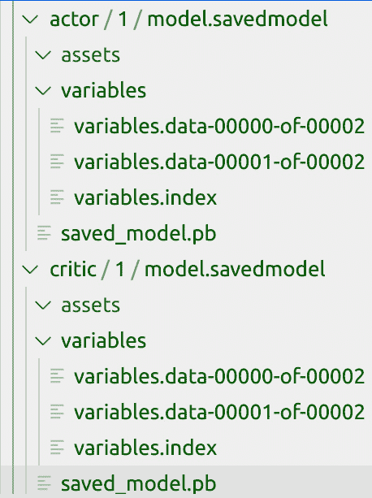

    图 9.1 – PPO RL 代理的 TensorFlow SavedModel 目录结构和文件内容

1.  一旦生成了`SavedModel`文件，我们可以使用`tflite_convert`命令行工具，并指定 Actor 模型保存目录的位置。参考以下命令的示例：

    ```
    (tfrl-cookbook)praveen@desktop:~/tfrl-cookbook/ch9$tflite_convert \
      --saved_model_dir=trained_models/ppo-procgen-coinrun/1/actor/model.savedmodel \
      --output_file=trained_models/ppo-procgen-coinrun/1/actor/model.tflite
    ```

1.  类似地，我们可以使用以下命令转换 Critic 模型：

    ```
    (tfrl-cookbook)praveen@desktop:~/tfrl-cookbook/ch9$tflite_convert \
      --saved_model_dir=trained_models/ppo-procgen-coinrun/1/critic/model.savedmodel \
      --output_file=trained_models/ppo-procgen-coinrun/1/critic/model.tflite
    ```

    万岁！现在我们有了 TFLite 格式的 Actor 和 Critic 模型，可以将它们与我们的移动应用一起发布。接下来，我们将看另一种方法，这种方法不需要我们（手动）切换到命令行来转换模型。

1.  还有另一种方法可以将 Agent 模型导出为 TFLite 格式。我们将在以下步骤中实现这一方法，从`Actor`类的`save_tflite`方法开始：

    ```
        def save_tflite(self, model_dir: str, version: int =\
         1):
            """Save/Export Actor model in TensorFlow Lite
            format"""
            actor_model_save_dir = os.path.join(model_dir,\
                                       "actor", str(version))
            model_converter = \
                tf.lite.TFLiteConverter.from_keras_model(
                                                  self.model)
            # Convert model to TFLite Flatbuffer
            tflite_model = model_converter.convert()
            # Save the model to disk/persistent-storage
            if not os.path.exists(actor_model_save_dir):
                os.makedirs(actor_model_save_dir)
            actor_model_file_name = os.path.join(
                      actor_model_save_dir, "model.tflite")
            with open(actor_model_file_name, "wb") as \
            model_file:
                model_file.write(tflite_model)
            print(f"Actor model saved in TFLite format at:\
                   {actor_model_file_name}")
    ```

1.  同样地，我们将为`Critic`类实现`save_tflite`方法：

    ```
        def save_tflite(self, model_dir: str, version: \
        int = 1):
            """Save/Export Critic model in TensorFlow Lite  
            format"""
            critic_model_save_dir = os.path.join(model_dir, 
                                      "critic", str(version))
            model_converter = \
                tf.lite.TFLiteConverter.from_keras_model(
                                                  self.model)
            # Convert model to TFLite Flatbuffer
            tflite_model = model_converter.convert()
            # Save the model to disk/persistent-storage
            if not os.path.exists(critic_model_save_dir):
                os.makedirs(critic_model_save_dir)
            critic_model_file_name = os.path.join(
                      critic_model_save_dir, "model.tflite")
            with open(critic_model_file_name, "wb") as \
            model_file:
                model_file.write(tflite_model)
            print(f"Critic model saved in TFLite format at:\
                    {critic_model_file_name}")
    ```

1.  之后，Agent 类可以调用`save_tflite`方法，通过它自己的`save_tflite`方法，像以下代码片段所示那样调用 Actor 和 Critic：

    ```
        def save_tflite(self, model_dir: str, version: \
        int = 1):
            # Make sure `toco_from_protos binary` is on 
            # system's PATH to avoid TFLite ConverterError
            toco_bin_dir = os.path.dirname(sys.executable)
            if not toco_bin_dir in os.environ["PATH"]:
                os.environ["PATH"] += os.pathsep + \
                                      toco_bin_dir
            print(f"Saving Agent model (TFLite) to:{
                                               model_dir}\n")
            self.actor.save_tflite(model_dir, version)
            self.critic.save_tflite(model_dir, version)
    ```

    请注意，我们将当前（`tfrl-cookbook`）Python 环境的`bin`目录添加到了系统的`PATH`环境变量中，以确保 TFLite 转换器调用模型转换时能够找到`toco_from_protos`二进制文件。

1.  总结一下，我们可以最终确定`main`函数，实例化代理，并训练和保存模型为 TFLite 模型文件格式：

    ```
    if __name__ == "__main__":
        env_name = args.env
        env = gym.make(env_name)
        agent = PPOAgent(env)
        agent.train(max_episodes=1)
        # Model saving
        model_dir = "trained_models"
        agent_name = f"PPO_{env_name}"
        agent_version = 1
        agent_model_path = os.path.join(model_dir, \
                                        agent_name)
        agent.save_tflite(agent_model_path, agent_version)
    ```

这就是我们本次的示例。让我们回顾一下其中的一些重要细节，以便更好地理解这个示例。

## 它是如何工作的...

我们首先将 TensorFlow Keras 的后端设置为使用`float32`作为浮动值的默认表示。这是因为否则 TensorFlow 将使用默认的`float64`表示，而 TFLite 不支持这种表示（出于性能考虑），因为 TFLite 主要针对嵌入式和移动设备的运行。

然后，我们为`--env`参数定义了一个选择列表。这一点非常重要，以确保环境的观察和动作空间与代理模型兼容。在这个示例中，我们使用了一个 PPO 代理，配有 Actor 和 Critic 网络，期望图像观察并在离散空间中产生动作。你可以将代理代码替换为之前章节中的 PPO 实现，这些实现使用不同的状态/观察空间和动作空间。你还可以完全替换成其他代理算法。你将在本章的代码库中找到一个附加示例，它导出了一个 DDPG 代理的 TFLite 模型。

我们讨论了两种保存并转换代理模型为 TFLite 格式的方法。第一种方法是先生成一个 TensorFlow 的 SavedModel 文件格式，然后使用`tflite_convert`命令行工具将其转换为 TFLite 模型文件格式。第二种方法，我们使用了 TFLite 的 Python API，直接（在内存中）将代理的模型转换并保存为 TFLite（Flatbuffer）格式。我们利用了官方 TensorFlow 2.x Python 包中的`TFLiteConverter`模块。下面的图示总结了通过 API 导出 RL 代理模型的不同方法：

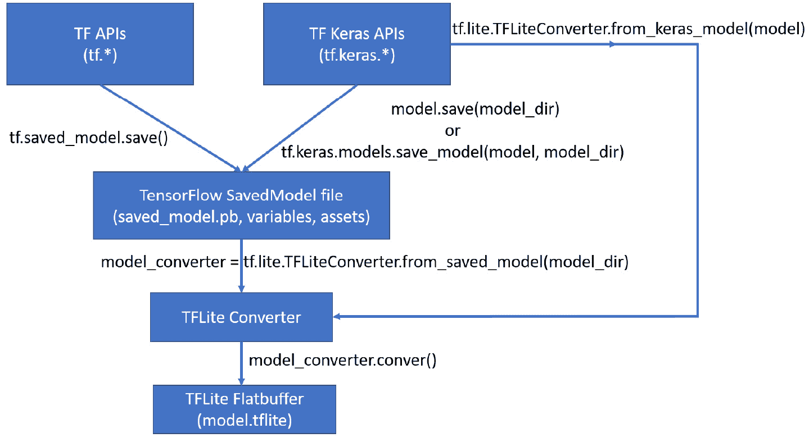

图 9.2 – 将 TensorFlow 2.x 模型转换为 TensorFlow Lite Flatbuffer 格式

你可以在这里了解更多关于 TFLite 模型格式的信息：[`www.tensorflow.org/lite`](https://www.tensorflow.org/lite)。

是时候进入下一个示例了！

# 在移动设备上部署 RL 代理

移动设备是最具目标性的应用平台，因为它的用户覆盖面远远超过其他平台。根据[`www.alliedmarketresearch.com/mobile-application-market`](https://www.alliedmarketresearch.com/mobile-application-market)，全球移动应用市场预计到 2026 年将达到 4073.2 亿美元。如此庞大的市场为基于 RL 的人工智能提供了许多机会。Android 和 iOS 是该领域的两大操作系统平台。虽然 iOS 是一个流行的平台，但开发 iOS 应用需要使用 Mac 电脑。因此，我们将使用 Android SDK 开发 Android 应用，这对于大多数人来说更容易访问。如果你是 iOS 应用开发者，可能可以将本教程的部分内容适配到你的应用中。

本教程提供了通过 TensorFlow Lite 框架将训练好的 RL 智能体模型部署到移动设备和/或物联网设备的方法。你还将获得一个示例 RL 乒乓球 Android 应用，可以将其作为测试平台来部署 RL 智能体，或开发你自己的创意和应用：

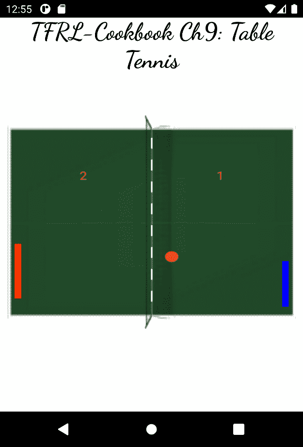

图 9.3 – RL 乒乓球应用在 Android 设备上的运行截图

让我们开始吧！

## 准备就绪

我们将使用 Android Studio 设置并开发示例 RL Android 应用程序。从官方网站下载并安装 Android Studio：[`developer.android.com/studio`](https://developer.android.com/studio)。推荐使用默认安装位置。安装完成后，运行 Android Studio 启动**Android Studio 设置向导**。按照设置过程进行操作，并确保安装了最新的 Android SDK、Android SDK 命令行工具和 Android SDK 构建工具。

完成后运行应用程序时，你有两个选择：1. 在 Android 手机上运行 2. 在 Android 虚拟设备模拟器中运行。根据你的选择，按照以下设置说明操作：

+   在 Android 手机上运行：

    a) 在 Android 设置中启用开发者选项和 USB 调试。详细操作说明请参阅：[`developer.android.com/studio/debug/dev-options`](https://developer.android.com/studio/debug/dev-options)。

    b) 如果你使用的是 Windows 系统，安装 Google USB 驱动程序：[`developer.android.com/studio/run/win-usb`](https://developer.android.com/studio/run/win-usb)。

    c) 使用 USB 数据线将手机连接到计算机，如果出现提示，允许计算机访问你的手机。

    d) 运行 `adb devices` 确保手机已被检测到。如果手机没有被检测到，确保驱动程序已安装并且手机上已启用 ADB 调试。你可以参考 Android 官方指南获取详细的操作说明：[`developer.android.com/studio/run/device#setting-up`](https://developer.android.com/studio/run/device#setting-up)。

+   在 Android 模拟器中运行：

    a) 启动 Android Studio，点击 **AVD Manager** 图标并选择 **Create Virtual Device**。

    b) 选择一个设备并点击 **Next**。

    c) 选择一个 x86 或 x86_64 镜像，用于你想要模拟的 Android 版本，并完成过程。

    d) 点击 **Run**，在 AVD Manager 工具栏中启动模拟器。

在你设置好设备后，进入 `src/ch9-cross-platform-deployment` 目录中的代码目录。你将看到一个示例 Android 应用，其目录结构和内容如下面的截图所示：

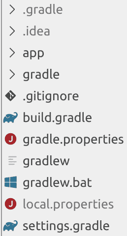

图 9.4 – 示例 Android 应用的目录结构和内容

一旦你有了示例代码库，继续阅读下一部分，看看如何准备我们的 RL agent 模型并构建应用。

## 如何操作...

我们将从 RL agent 模型的准备工作开始，然后构建一个简单的双人乒乓球应用，你可以与 agent 对战。按照这里列出的步骤操作：

1.  使用本章前面讨论的食谱，将 RL agent（Actor）的模型导出为 TFLite 格式。例如，你可以运行前面的食谱来训练一个 PPO agent，用于 `Pong-v4` 环境，并使用生成的 `model.tflite` 文件，位于 `trained_models/actor/1/` 目录下。将模型文件放置在 Android 应用的 `app/src/assets/` 目录下，如下图所示：

    图 9.5 – RL agent model.tflite 在 Android 应用 src 中的位置

1.  编辑应用的 `build.gradle` 文件中的 `dependencies` 部分，加入 `tensorflow-lite` 依赖：

    ```
    dependencies {
        implementation fileTree(dir: 'libs', include: \
                                ['*.jar'])
        implementation 'org.tensorflow:tensorflow-lite:+'
    }
    ```

1.  添加一个成员方法，从 `assets` 文件夹加载 `agent/model.tflite` 并返回一个 `MappedByteBuffer`：

    ```
        MappedByteBuffer loadModelFile(AssetManager \
             assetManager) throws IOException {
            AssetFileDescriptor fileDescriptor = \
                assetManager.openFd("agent/model.tflite");
            FileInputStream inputStream = new \
                 FileInputStream(
                      fileDescriptor.getFileDescriptor());
            FileChannel fileChannel = \
                        inputStream.getChannel();
            long startOffset = \
                 fileDescriptor.getStartOffset();
            long declaredLength = \
                 fileDescriptor.getDeclaredLength();
            return fileChannel.map(
                FileChannel.MapMode.READ_ONLY, \
                startOffset, declaredLength);
        }
    ```

1.  我们现在可以像这样创建一个新的 TFLite 解释器：

    ```
    interpreter = new Interpreter(loadModelFile(assetManager),
                                  new Interpreter.Options());
    ```

1.  解释器已准备好。让我们准备输入数据。首先，根据我们从 agent 训练中了解的信息，定义一些常量：

    ```
     static final int BATCH_SIZE = 1;
      static final int OBS_IMG_WIDTH = 160;
     static final int OBS_IMG_HEIGHT = 210;
     static final int OBS_IMG_CHANNELS = 3;
     // Image observation normalization
     static final int IMAGE_MEAN = 128;
     static final float IMAGE_STD = 128.0f;
    ```

1.  现在，让我们实现一个方法，将 `BitMap` 格式的图像数据转换为 `ByteArray`：

    ```
    ByteBuffer convertBitmapToByteBuffer(Bitmap bitmap) {
            ByteBuffer byteBuffer;
            byteBuffer = ByteBuffer.allocateDirect(4 * \
                          BATCH_SIZE * OBS_IMG_WIDTH * \
                          OBS_IMG_HEIGHT * OBS_IMG_CHANNELS);
            byteBuffer.order(ByteOrder.nativeOrder());
            int[] intValues = new int[OBS_IMG_WIDTH * \
                                      OBS_IMG_HEIGHT];
            bitmap.getPixels(intValues,0, bitmap.getWidth(),\
              0, 0, bitmap.getWidth(), bitmap.getHeight());
            int pixel = 0;
            for (int i = 0; i < OBS_IMG_HEIGHT; ++i) {
                for (int j = 0; j < OBS_IMG_WIDTH; ++j) {
                    final int val = intValues[pixel++];

                        byteBuffer.putFloat((((val >> 16) &\
                            0xFF)-IMAGE_MEAN)/IMAGE_STD);
                        byteBuffer.putFloat((((val >> 8) & \
                            0xFF)-IMAGE_MEAN)/IMAGE_STD);
                        byteBuffer.putFloat((((val) & 0xFF)-\
                            IMAGE_MEAN)/IMAGE_STD);
                }
            }
            return byteBuffer;
        }
    ```

1.  我们现在可以将乒乓球游戏中的图像观察数据传入 Agent 模型，以获取动作：

    ```
    ByteBuffer byteBuffer = convertBitmapToByteBuffer(bitmap);
    int[] action = new int[ACTION_DIM];
    interpreter.run(byteBuffer, action);
    ```

    这些就是本教程的所有主要成分！你可以将它们循环运行，以根据每个观察/游戏帧生成动作，或者根据你的需求进行定制！接下来，让我们看看如何使用 Android Studio 在 Android 设备上运行该应用。

1.  启动 Android Studio。你将看到类似于下图的屏幕：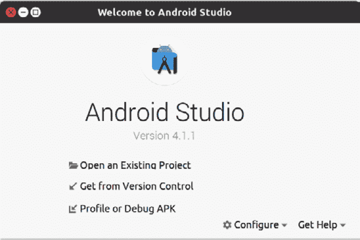

    图 9.6 – Android Studio 欢迎屏幕

    让我们继续进行下一步。

1.  点击**打开现有项目**选项，弹出窗口会要求你选择文件系统中的目录。导航到你克隆的书籍代码仓库或你的分支文件夹，然后浏览到*第九章*中的这个配方文件夹，正如图示所示：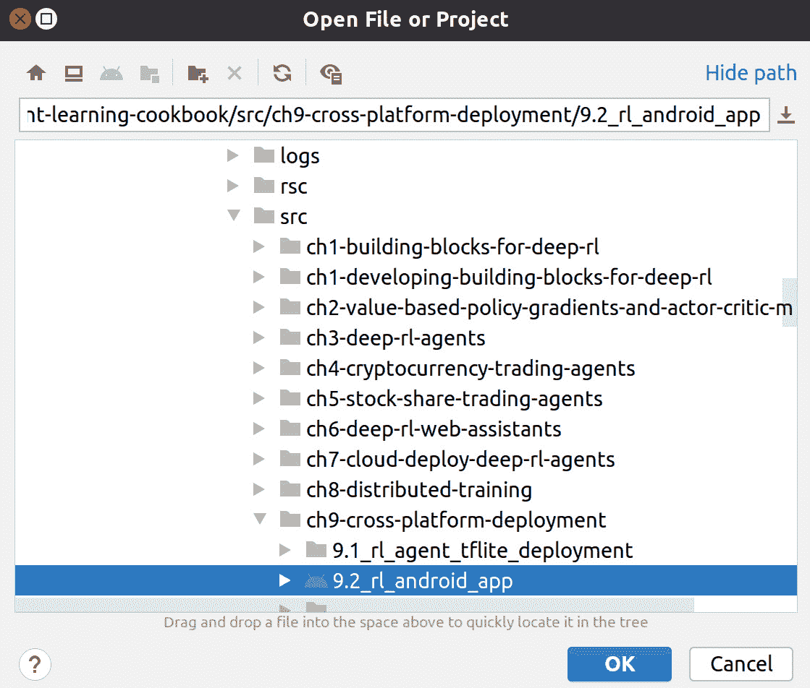

    图 9.7 – 选择文件/项目界面以选择 RL Android 应用

    你会注意到 Android Studio 已经识别出我们的应用，并显示带有 Android 图标的目录。

1.  一旦你点击**确定**，Android Studio 将会打开并加载应用的代码，界面如下图所示：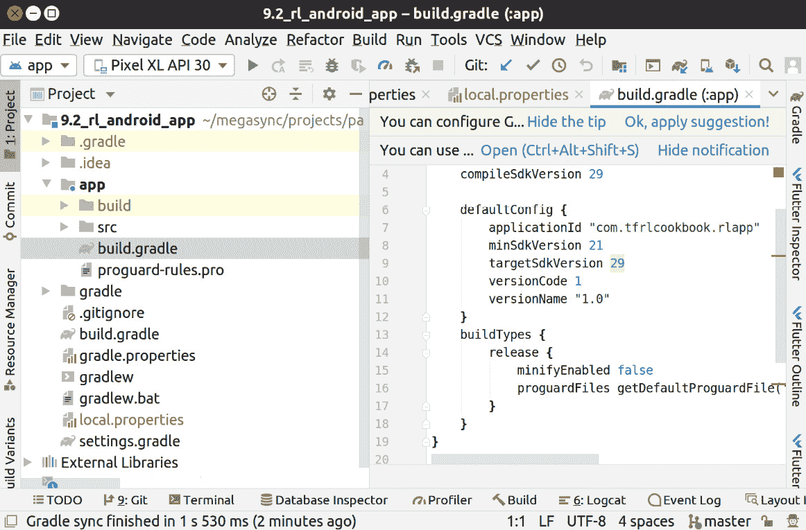

    图 9.8 – Android Studio 中加载 TFRL-Cookbook 的 RL 应用

    到目前为止，一切顺利！

1.  让我们通过点击**构建**菜单并选择**构建项目**来构建项目，如下图所示（或者直接按 *Ctrl* + *F9*）：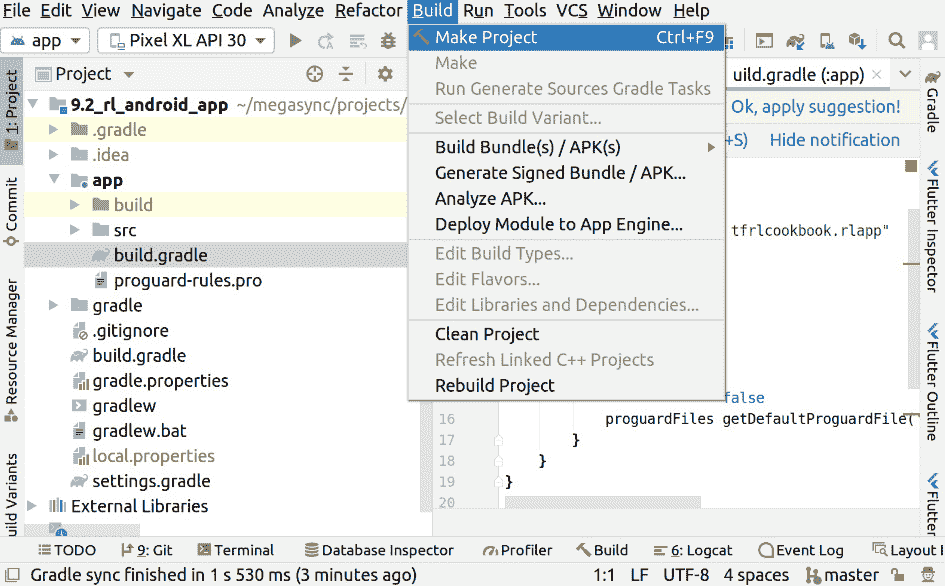

    图 9.9 – 使用 Make Project 选项构建 RL Android 应用

    这个过程可能需要一些时间，你可能会在**构建**信息标签中看到有用的状态消息。

1.  一旦构建过程完成，你会看到 `.apk` 文件，可以在 Android 设备上运行。

1.  让我们继续使用**运行**菜单来运行应用，如下图所示：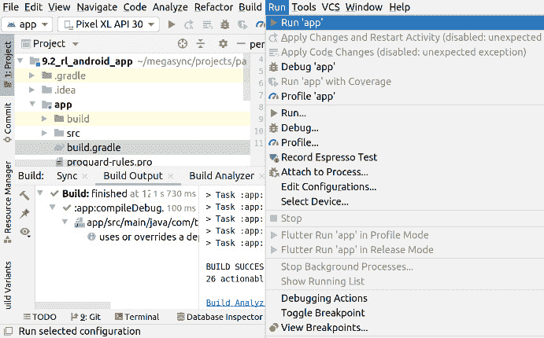

    图 9.11 – 在 Android Studio 中运行 RL 应用的 Run 菜单选项

    此时，如果你已经将 Android 设备/手机连接到计算机，你可以在手机上启动该应用。否则，你可以使用 AVD 来模拟 Android 设备。

1.  让我们从设备菜单中选择一个 AVD 设备来模拟，如下图所示：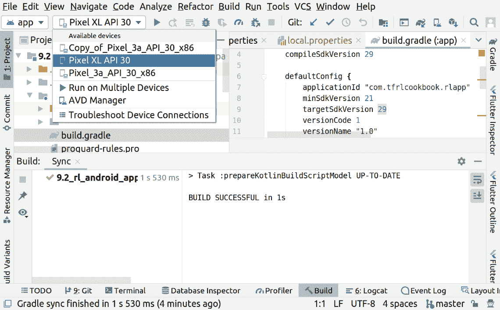

    图 9.12 – 选择 AVD 来模拟 Android 设备

    我们现在已经准备好设备来运行这个应用。

1.  让我们继续并启动/运行应用！你可以使用**运行 'app'**按钮，在**运行**菜单中，如下图所示：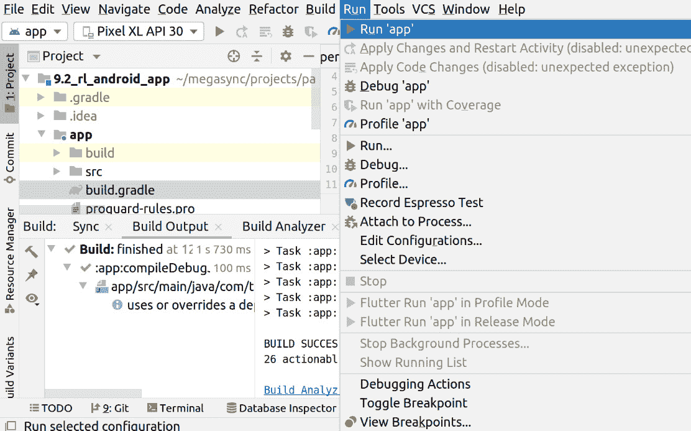

    图 9.13 – 运行 'app' 命令来启动应用

    这应该会在 AVD 模拟器上启动应用（如果你选择了手机，则会在手机上启动）。

1.  应用应该会在 Android 设备上启动，界面应该像下面的图示：

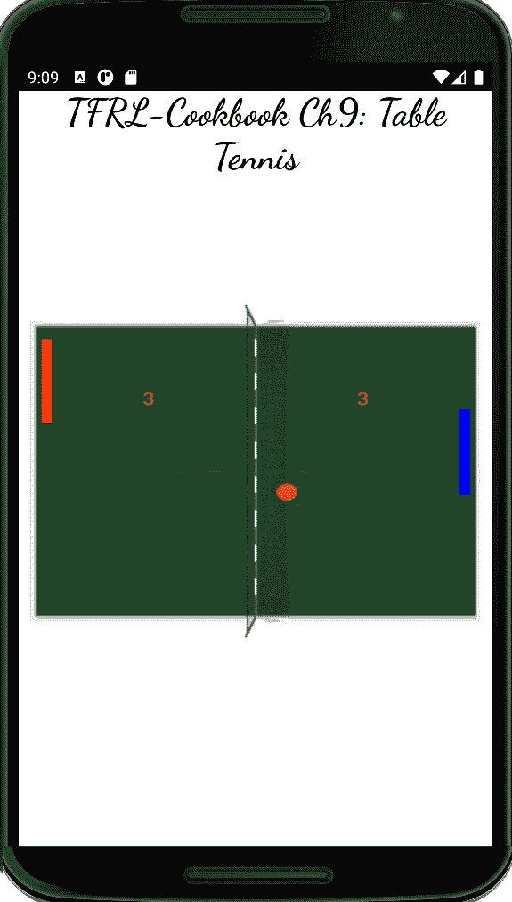

图 9.14 – TFRL-Cookbook RL 应用在 Android（模拟）设备上运行

恭喜！

这就完成了我们的配方。前往下一节以了解更多关于该配方的内容。

## 它是如何工作的...

在前一个配方中，我们看到如何将深度强化学习智能体的模型导出为 TFLite 格式。前一个配方生成了两个 `model.tflite` 文件，一个用于演员（Actor），另一个用于评论员（Critic）。

注意

你可以按照本书中之前讨论的配方，训练任何你选择的智能体算法，并使用本章中的配方 *使用 TensorFlow Lite 为移动设备和物联网设备打包深度强化学习智能体* 来获取在此配方中使用的演员 `model.tflite` 文件。

正如你可能记得在*第三章*中所提到的，*在深度强化学习智能体上实现高级深度强化学习算法*，演员组件负责根据学习到的策略生成动作，而评论员组件估计状态或状态-动作值。在部署强化学习智能体时，我们更关心的是智能体生成的动作，而不是预测的状态或状态-动作值。因此，在此配方中，我们仅使用智能体的演员模型进行部署。

我们首先通过更新应用的 `gradle.build` 文件来包含 TFLite 依赖项。接着我们添加了一个名为 `loadModelFile` 的方法来加载智能体的模型（`model.tflite`）。此方法返回一个 `MappedByteBuffer` 对象，这是初始化 TFLite 解释器实例所需的。模型加载完成并且创建了 TFLite 解释器实例后，我们可以用有效的输入运行解释器来获得智能体的动作。为了确保输入的格式有效，我们将图像数据从 `BitMap` 格式转换为 `ByteBuffer` 格式。我们还根据用于训练强化学习智能体的环境的观察空间定义了图像观察的宽度、高度、通道数等。

在*步骤 7*中，智能体模型返回的动作可以用来驱动/移动，例如乒乓球游戏中的红色球拍，并且可以在循环中对每个新的观察重复之前的步骤，让智能体与自己或人类对战！

接着我们看到如何使用 Android Studio 启动应用，并最终完成该配方。希望你玩得开心！

当你准备好时，我们可以继续进行下一个配方。

# 使用 TensorFlow.js 打包深度强化学习（Deep RL）智能体以供网页和 Node.js 使用

JavaScript 是开发 Web 应用程序时的首选语言，因为它在前端和后端编程语言中都具有多功能性，可以通过 Web 浏览器或 Node.js 执行。能够在 Web 上运行 RL 智能体将为在 Web 应用程序中部署 RL 智能体开辟多个新路径。本示例将展示如何训练并导出 RL 智能体模型，将其转换为可以在 JavaScript 应用程序中使用的格式，这些应用程序可以直接在浏览器中运行或在 Node.js 环境中运行。TensorFlow.js (TF.js) 库允许我们使用 JavaScript 运行现有模型，甚至训练/重训新模型。我们将使用 `tensorflowjs` Python 模块将我们的智能体模型导出为支持的格式，然后可以将其导入到基于 JavaScript 的 Web 或桌面（Node.js/Electron）应用中。我们将探讨两种将智能体模型导出为 TF.js 层格式的方法。

让我们开始！

## 准备工作

要完成此食谱，您首先需要激活 `tf2rl-cookbook` Python/conda 虚拟环境。确保更新环境以匹配食谱代码库中的最新 conda 环境规范文件（`tfrl-cookbook.yml`）。如果以下导入没有问题，则可以开始：

```
import argparse
import copy
import os
import random
from collections import deque
from datetime import datetime
import gym
import numpy as np
import tensorflow as tf
import tensorflowjs as tfjs
from tensorflow.keras.layers import (
    Conv2D,
    Dense,
    Dropout,
    Flatten,
    Input,
    Lambda,
    MaxPool2D,
)
import webgym
```

现在，让我们开始吧！

## 如何实现...

在接下来的文本中，我们将通过专注于此食谱中特有的新增和重要部分来节省空间。我们将讲解模型保存和导出功能，以及如何通过不同方式实现，并将演员、评论员和智能体模型定义从以下步骤中省略，以节省空间。请参阅书中的代码库以获取完整的实现，包括训练和日志记录方法。

让我们开始吧：

1.  让我们首先设置一个命令行参数解析器，方便自定义脚本：

    ```
    parser = argparse.ArgumentParser(
        prog="TFRL-Cookbook-Ch9-DDPGAgent-TensorFlow.js-exporter"
    )
    parser.add_argument("--env", default="MiniWoBSocialMediaMuteUserVisualEnv-v0")
    parser.add_argument("--actor_lr", type=float, default=0.0005)
    parser.add_argument("--critic_lr", type=float, default=0.001)
    parser.add_argument("--batch_size", type=int, default=64)
    parser.add_argument("--tau", type=float, default=0.05)
    parser.add_argument("--gamma", type=float, default=0.99)
    parser.add_argument("--train_start", type=int, 
                         default=2000)
    parser.add_argument("--logdir", default="logs")
    args = parser.parse_args()
    ```

1.  我们还将设置日志记录，以便使用 TensorBoard 可视化智能体的学习进度：

    ```
    logdir = os.path.join(
        args.logdir, parser.prog, args.env, \
        datetime.now().strftime("%Y%m%d-%H%M%S")
    )
    print(f"Saving training logs to:{logdir}")
    writer = tf.summary.create_file_writer(logdir)
    ```

1.  对于第一个导出方法，我们将在接下来的步骤中为 `Actor`、`Critic` 和 `Agent` 类定义 `save_h5` 方法。我们将从实现 `Actor` 类中的 `save_h5` 方法开始，将演员模型导出为 Keras 的 `h5` 格式：

    ```
        def save_h5(self, model_dir: str, version: int = 1):
            actor_model_save_dir = os.path.join(
                model_dir, "actor", str(version), "model.h5"
            )
            self.model.save(actor_model_save_dir, \
                            save_format="h5")
            print(f"Actor model saved at:\
                    {actor_model_save_dir}")
    ```

1.  同样，我们将为 `Critic` 类实现一个 `save` 方法，将评论员模型导出为 Keras 的 `h5` 格式：

    ```
        def save_h5(self, model_dir: str, version: int = 1):
            critic_model_save_dir = os.path.join(
                model_dir, "critic", str(version), "model.h5"
            )
            self.model.save(critic_model_save_dir, \
                            save_format="h5")
            print(f"Critic model saved at:\
                    {critic_model_save_dir}")
    ```

1.  现在我们可以为 `Agent` 类添加一个 `save` 方法，该方法将利用演员和评论员的 `save` 方法来保存智能体所需的两个模型：

    ```
        def save_h5(self, model_dir: str, version: int = 1):
            self.actor.save_h5(model_dir, version)
            self.critic.save_h5(model_dir, version)
    ```

1.  一旦执行了 `save_h5()` 方法，`save` 方法将生成两个模型（一个用于演员，另一个用于评论员），并将它们保存在文件系统中指定的目录下，目录结构和文件内容如下图所示：

    图 9.15 – DDPG RL 代理的目录结构和文件内容，使用 `save_h5` 模型导出

1.  一旦生成 `.h5` 文件，我们可以使用 `tensorflowjs_converter` 命令行工具，并指定 Actor 模型的 `save` 目录的位置。请参考以下命令作为示例：

    ```
    (tfrl-cookbook)praveen@desktop:~/tfrl-cookbook/ch9$tensorflowjs_converter --input_format keras \
                           actor/1/model.h5 \
                           actor/t1/model.tfjs
    ```

1.  类似地，我们可以使用以下命令转换 Critic 模型：

    ```
    (tfrl-cookbook)praveen@desktop:~/tfrl-cookbook/ch9$tensorflowjs_converter --input_format keras \
                           critic/1/model.h5 \
                           critic/t1/model.tfjs
    ```

    太好了！我们现在拥有了 TF.js 层格式的 Actor 和 Critic 模型。我们将查看另一种方法，它不需要我们（手动）切换到命令行来转换模型。

1.  还有另一种方法可以将代理模型导出为 TF.js 层格式。我们将在接下来的步骤中实现这一方法，从 `Actor` 类的 `save_tfjs` 方法开始：

    ```
        def save_tfjs(self, model_dir: str, version: \
        int = 1):
            """Save/Export Actor model in TensorFlow.js 
            supported format"""
            actor_model_save_dir = os.path.join(
                model_dir, "actor", str(version), \
                "model.tfjs"
            )
            tfjs.converters.save_keras_model(self.model,\
                                       actor_model_save_dir)
            print(f"Actor model saved in TF.js format at:\
                    {actor_model_save_dir}")
    ```

1.  类似地，我们将实现 `Critic` 类的 `save_tfjs` 方法：

    ```
        def save_tfjs(self, model_dir: str, version: \
        int = 1):
            """Save/Export Critic model in TensorFlow.js 
            supported format"""
            critic_model_save_dir = os.path.join(
                model_dir, "critic", str(version), \
                "model.tfjs"
            )
            tfjs.converters.save_keras_model(self.model,\
                                     critic_model_save_dir)
            print(f"Critic model saved TF.js format \
                     at:{critic_model_save_dir}")
    ```

1.  然后，`Agent` 类可以通过其自己的 `save_tfjs` 方法调用 Actor 和 Critic 的 `save_tfjs` 方法，如下方代码片段所示：

    ```
        def save_tfjs(self, model_dir: str, version: \
        int = 1):
            print(f"Saving Agent model to:{model_dir}\n")
            self.actor.save_tfjs(model_dir, version)
            self.critic.save_tfjs(model_dir, version)
    ```

1.  当执行代理的 `save_tfjs` 方法时，将生成 Actor 和 Critic 模型的 TF.js 层格式，并将具有如图所示的目录结构和文件内容：

    图 9.16 – DDPG RL 代理的目录结构和文件内容，使用 `save_tfjs` 模型导出

1.  总结一下，我们可以最终确定 `main` 函数来实例化代理，并直接使用 Python API 在 TF.js 层格式中训练并保存模型：

    ```
    if __name__ == "__main__":
        env_name = args.env
        env = gym.make(env_name)
        agent = PPOAgent(env)
        agent.train(max_episodes=1)
        # Model saving
        model_dir = "trained_models"
        agent_name = f"PPO_{env_name}"
        agent_version = 1
        agent_model_path = os.path.join(model_dir, \
                                        agent_name)
        # agent.save_h5(agent_model_path, agent_version)
        agent.save_tfjs(agent_model_path, agent_version)
    ```

1.  现在，你可以将 TF.js 模型部署到你的 web 应用、Node.js 应用、Electron 应用或任何其他基于 JavaScript/TypeScript 的应用中。让我们在下一部分回顾一下我们在这个配方中使用的一些关键项。

## 它是如何工作的...

在这个配方中，我们使用了一个 DDPG 代理，其中包含期望图像观察并在连续空间中产生动作的 Actor 和 Critic 网络。你可以用本书前几章中使用不同状态/观察空间和动作空间的 DDPG 实现来替换代理代码。你也可以完全用不同的代理算法替换它。你会在本章的代码库中找到一个额外的配方，用于导出 PPO 代理的 TF.js 模型。

我们讨论了两种方法来保存和转换我们的代理模型为 TF.js 格式。第一种方法允许我们生成一个 Keras 模型，其格式为 H5，这是 HDF5 的缩写，全称是“层次化数据格式第五版文件格式”。然后我们使用 `tensorflowjs_converter` 命令行工具将其转换为 TF.js 模型。尽管每个模型仅需处理单个文件而且轻量化且易于处理，但与 SavedModel 文件格式相比，Keras HDF5 模型存在一些限制。具体来说，Keras HDF5 模型不包含自定义对象/层的计算图，因此在运行时需要这些自定义对象的 Python 类/函数定义来重建模型。此外，在我们在模型类定义之外添加损失项和指标的情况下（使用 `model.add_loss()` 或 `model.add_metric()`），这些内容不会导出到 HDF5 模型文件中。

在第二种方法中，我们使用 `tensorflowjs` Python 模块直接（内存中）将代理模型转换并保存为 TF.js 层格式。

您可以在此处了解有关 TF.js 的更多信息：[`www.tensorflow.org/js`](https://www.tensorflow.org/js)。

现在是下一个食谱的时间！

# 将深度 RL 代理部署为服务

一旦您训练好您的 RL 代理来解决问题或业务需求，您将希望将其部署为一个服务 – 与将训练好的代理模型作为产品提供相比更为可能，这是因为包括可伸缩性和模型陈旧性限制在内的多种原因。如果您将其作为产品销售，您将希望有一种方法来更新代理模型的新版本，并且您不希望维护或支持多个版本或旧版本的代理。您将需要一个坚固且经过充分测试的机制，来将您的 RL 代理作为 AI 服务提供，允许可定制的运行时（不同的框架和 CPU/GPU 支持），轻松的模型升级，日志记录，性能监控等等。

为了满足所有这些需求，我们将使用 NVIDIA 的 Triton 服务器作为后端，为我们的代理提供服务。Triton 作为一个统一的推断框架，在生产中支持大规模部署的 AI 模型。它支持多种深度学习框架，包括 TensorFlow2、PyTorch、ONNX、Caffe2 等，还包括自定义框架，并提供了其他多个生产质量的功能和优化，如并发模型执行，动态批处理，日志记录，性能和健康监控等。

让我们开始我们的食谱！

## 准备工作

为了完成这个步骤，你首先需要激活`tf2rl-cookbook` Python/conda 虚拟环境。确保更新该环境，以匹配本书代码仓库中最新的 conda 环境规范文件(`tfrl-cookbook.yml`)。你还需要确保你的机器上安装了支持你 GPU 的最新 NVIDIA 驱动程序。你还需要在机器上安装 Docker。如果尚未安装 Docker，你可以按照官方说明在此链接进行安装：[`docs.docker.com/get-started/`](https://docs.docker.com/get-started/)。

现在，让我们开始吧！

## 如何操作…

在接下来的文字中，我们将节省篇幅，专注于我们将要构建的服务。我们将省略智能体训练脚本的内容，但你可以在本书的代码仓库中的`ch9-cross-platform-deployment`找到这些脚本。

让我们开始吧：

1.  首先，你需要训练、保存并导出你希望作为服务托管的智能体。你可以使用示例脚本`agent_trainer_saver.py`来训练 Webgym 环境套件中的一个任务的 PPO 智能体，使用以下命令：

    ```
    yy.mm format) that supports your NVIDIA GPU driver version. For example, if you have installed NVIDIA driver version 450.83 (find out by running nvidia-smi), then container versions built with CUDA 11.0.3 or lower, such as container version 20.09 or older, will work.
    ```

1.  一旦你确定了合适的容器版本，例如`yy.mm`，你可以使用 Docker 通过以下命令拉取 NVIDIA Triton 服务器镜像：

    ```
    praveen@desktop:~$ docker pull nvcr.io/nvidia/tritonserver:yy.mm-py3
    ```

1.  将`yy.mm`占位符更改为你所确定的版本。例如，要拉取容器版本 20.09，你需要运行以下命令：

    ```
    praveen@desktop:~$ docker pull nvcr.io/nvidia/tritonserver:20.09-py3
    ```

1.  当你运行`agent_trainer_saver`脚本时，训练好的模型将存储在`trained_models`目录中，目录结构和内容如下所示：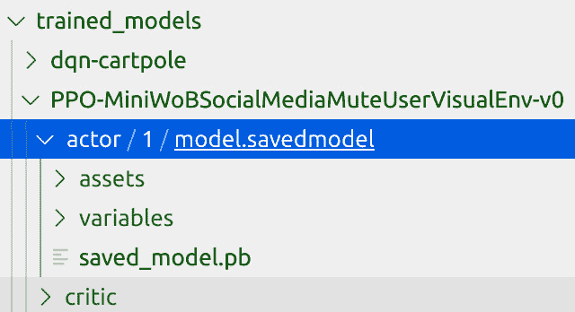

    图 9.17 – 导出训练模型的目录结构和内容

    `trained_models/actor`目录将是我们在 Triton 中提供服务时的模型仓库根目录。

1.  我们现在准备好将智能体的动作作为服务进行提供了！要启动服务，请运行以下命令：

    ```
    -v flag to point to the trained_models/actor folder on your serving machine. Also remember to update the yy.mm value to reflect your container version (20.3, for example).
    ```

1.  如果你想从没有 GPU 的机器上提供智能体模型（不推荐），你可以简单地省略`–gpus=1`标志，指示 Triton 服务器仅使用 CPU 进行服务。命令将如下所示：

    ```
    $ docker run  --shm-size=1g --ulimit memlock=-1 --ulimit stack=67108864 --rm -p8000:8000 -p8001:8001 -p8002:8002 -v/full/path/to/trained_models/actor:/models nvcr.io/nvidia/tritonserver:yy.mm-py3 tritonserver --model-repository=/models --strict-model-config=false --log-verbose=1
    ```

1.  如果在提供智能体模型时遇到问题，请检查`trained_models/actor/config.pbtxt`文件，该文件描述了模型配置。虽然 Triton 可以自动从 TensorFlow 的 SavedModels 生成`config.pbtxt`文件，但对于所有模型来说，它可能并不总是有效，尤其是自定义策略网络实现。如果你使用`agent_trainer_saver`脚本导出训练好的 PPO 智能体，可以使用以下`config.pbtxt`。我们将在接下来的几步中讨论模型配置：

    ```
    {                                                                                                                     
        "name": "actor",                                                                                                  
        "platform": "tensorflow_savedmodel",                                                                              
        "backend": "tensorflow",                                                                                          
        "version_policy": {                                                                                               
            "latest": {                                                                                                   
                "num_versions": 1                                                                                         
            }                                                                                                             
        },                                                                                                                
        "max_batch_size": 1,  
    ```

1.  我们将继续指定输入（状态/观察）空间/维度配置：

    ```
        "input": [                                                                                                        
            {                                                                                                             
                "name": "input_1",                                                                                        
                "data_type": "TYPE_FP64",                                                                                 
                "dims": [                                                                                                 
                    64,                                                                                                   
                    64,                                                                                                   
                    3                                                                                                     
                ],
                "format": "FORMAT_NHWC"                                                                                                         
            }                                                                                                             
        ],
    ```

1.  接下来，我们将指定输出（动作空间）：

    ```
        "output": [
            {
                "name": "lambda", 
                "data_type": "TYPE_FP64",
                "dims": [
                    2
                ]
            },
            {
                "name": "lambda_1",
                "data_type": "TYPE_FP64",
                "dims": [
                    2
                ]
            }
        ],                                                                                                                    
    ```

1.  让我们还指定实例组、优化参数等：

    ```
        "batch_input": [],
        "batch_output": [],
        "optimization": {
            "priority": "PRIORITY_DEFAULT",
            "input_pinned_memory": {
                "enable": true
            },
            "output_pinned_memory": {
                "enable": true
            }
        },
        "instance_group": [
            {
                "name": "actor",
                "kind": "KIND_CPU",
                "count": 1,
                "gpus": [],
                "profile": []
            }
        ],                                                                                                                     
    ```

1.  `config.pbtxt` 文件所需的最终配置参数列表如下：

    ```
        "default_model_filename": "model.savedmodel",
        "cc_model_filenames": {}, 
        "metric_tags": {},
        "parameters": {},
        "model_warmup": []
    } 
    ```

1.  好极了！我们的代理服务已上线。此时，如果你希望将此服务提供给公共网络或网络上的用户，你可以在云端/远程服务器/VPS 上运行我们之前讨论的相同命令。让我们快速向服务器发送查询，以确保一切正常：

    ```
    $curl -v localhost:8000/v2/health/ready
    ```

1.  如果代理模型没有问题地提供服务，你将看到类似以下的输出：

    ```
    ...
    < HTTP/1.1 200 OK
    < Content-Length: 0
    < Content-Type: text/plain
    ```

1.  你也可以使用一个完整的示例客户端应用程序查询代理服务，以获取指定的动作。让我们快速设置运行 Triton 客户端所需的工具和库。你可以使用 Python pip 来安装依赖项，如下所示的命令片段：

    ```
    $ pip install nvidia-pyindex
    $ pip install tritonclient[all]
    ```

1.  可选地，为了能够运行性能分析器（`perf_analyzer`），你需要使用以下命令安装 libb64-dev 系统软件包：

    ```
    $ sudo apt update && apt install libb64-dev
    ```

1.  现在你已经具备了运行示例 Triton 客户端应用程序所需的所有依赖项：

    ```
    $ python sample_client_app.py
    ```

这就完成了我们的食谱！接下来，我们将进入下一部分，详细回顾我们在本食谱中完成的一些细节。

## 它是如何工作的……

我们的食谱包含三个部分：

1.  训练、保存和导出；

1.  部署；

1.  启动客户端。

第一部分涵盖了代理的训练、保存和导出流程。在这一部分，我们首先选择了要训练的 RL 环境和代理算法。然后，我们利用本书前面讨论的多种训练策略之一来训练代理模型。接着，我们使用本章前面讨论的模型保存和导出方法，将训练好的代理模型导出为 TensorFlow 的 SavedModel 文件格式。如你所记，我们在保存和导出代理模型时遵循了特定的目录结构和文件命名规范。这一规范与 NVIDIA Triton 服务器所使用的模型仓库规范一致，因此我们导出的模型可以轻松地通过生产级 Triton 服务器提供服务。此外，这一组织方式还使得我们能够轻松地同时管理多个版本的代理模型。

在第二部分，我们看到如何使用 NVIDIA 的 Triton 服务器部署导出的代理模型。你可以在此了解更多关于 NVIDIA Triton 的信息：[`developer.nvidia.com/nvidia-triton-inference-server`](https://developer.nvidia.com/nvidia-triton-inference-server)。

我们看到使用生产级后端来提供代理服务是多么简单。我们可以轻松地在远程/云服务器或 VPS 上运行 Docker 容器，将此服务部署到网上。

最后，一旦服务启动，我们看到客户端如何通过向服务发送包含适当输入/观察数据的动作请求来使用该服务，数据来自测试环境。

本节的内容到此为止！让我们进入本章的最后一个食谱，以总结全文。

# 为跨平台部署打包深度强化学习（Deep RL）代理

尽管深度强化学习（Deep RL）在游戏领域（如 Atari、象棋、围棋、将棋）和模拟机器人方面取得了最大的成功，但现实世界中的应用正逐渐显现，其中深度强化学习代理显示出很大的潜力和价值。预计很快就会将深度强化学习代理部署到各种物理形式因素中，如嵌入式控制器、计算机、自动驾驶汽车、无人机以及其他机器人等。硬件处理器（如 CPU、GPU、TPU、FPGA、ASIC）、操作系统（如 Linux、Windows、OSX、Android）、架构（如 x86、ARM）和形式因素（如服务器、桌面、移动设备、物联网、嵌入式系统等）之间的差异使得部署过程充满挑战。本教程提供了如何利用 TensorFlow 2.x 框架的库、工具和实用程序的生态系统来打包适合部署到 Web、移动设备、物联网、嵌入式系统、机器人和桌面平台的深度强化学习代理模型的指南。

本教程提供了一个完整的脚本，用于构建、训练和打包一个深度强化学习代理，支持多种格式，可以使用 TensorFlow Serving、TensorFlow Hub、TensorFlow.js、TensorFlow Lite、NVIDIA Triton、ONNX、ONNX.js、Clipper 以及大多数为深度学习模型构建的服务框架进行部署/服务。

开始吧！

## 准备中

要完成本教程，首先需要激活 `tf2rl-cookbook` Python/conda 虚拟环境。确保更新该环境，以匹配食谱代码仓库中的最新 conda 环境规范文件（`tfrl-cookbook.yml`）。如果以下导入没有问题，说明你已经准备好开始了：

```
import argparse
import os
import sys
from datetime import datetime
import gym
import keras2onnx
import numpy as np
import procgen  # Used to register procgen envs with Gym registry
import tensorflow as tf
import tensorflowjs as tfjs
from tensorflow.keras.layers import Conv2D, Dense, Dropout, Flatten, Input, MaxPool2D
```

现在，开始吧！

## 如何操作...

在接下来的内容中，我们将通过专注于本教程中独特的新功能来节省空间。我们将重点关注各种模型保存和导出功能，而将 Actor、Critic 和 Agent 的模型定义从以下步骤中省略，以节省空间。完整的实现可以参考书籍的代码仓库。我们将首先为 Actor 实现模型的保存/导出方法，然后在后续步骤中为 Critic 重复这些步骤，最后完成代理的实现。

开始吧：

1.  首先，重要的是将 TensorFlow Keras 的后端设置为使用 `float32` 作为默认的浮动值表示，而不是默认的 `float64`：

    ```
    tf.keras.backend.set_floatx("float32")
    ```

1.  我们将从以下几个步骤开始，逐步实现 `Actor` 的各种保存/导出方法。首先，我们将实现 `save` 方法，将 Actor 模型保存并导出为 TensorFlow 的 `SavedModel` 格式：

    ```
        def save(self, model_dir: str, version: int = 1):
            actor_model_save_dir = os.path.join(
                model_dir, "actor", str(version), \
                "model.savedmodel"
            )
            self.model.save(actor_model_save_dir, \
                            save_format="tf")
            print(f"Actor model saved at:\
                    {actor_model_save_dir}")
    ```

1.  接下来，我们将向 `Actor` 类添加 `save_tflite` 方法，以保存和导出 Actor 模型为 TFLite 格式：

    ```
        def save_tflite(self, model_dir: str, version: \
        int = 1):
            """Save/Export Actor model in TensorFlow Lite 
            format"""
            actor_model_save_dir = os.path.join(model_dir,\
                                       "actor", str(version))
            model_converter = \
                tf.lite.TFLiteConverter.from_keras_model(
                                                 self.model)
            # Convert model to TFLite Flatbuffer
            tflite_model = model_converter.convert()
            # Save the model to disk/persistent-storage
            if not os.path.exists(actor_model_save_dir):
                os.makedirs(actor_model_save_dir)
            actor_model_file_name = \
                os.path.join(actor_model_save_dir, 
                             "model.tflite")
            with open(actor_model_file_name, "wb") as \
            model_file:
                model_file.write(tflite_model)
            print(f"Actor model saved in TFLite format at:\
                    {actor_model_file_name}")
    ```

1.  现在，让我们实现 `save_h5` 方法并将其添加到 `Actor` 类中，以将 Actor 模型保存并导出为 HDF5 格式：

    ```
        def save_h5(self, model_dir: str, version: int = 1):
            actor_model_save_path = os.path.join(
                model_dir, "actor", str(version), "model.h5"
            )
            self.model.save(actor_model_save_path, \
                            save_format="h5")
            print(f"Actor model saved at:\
                   {actor_model_save_path}")
    ```

1.  接下来，我们将向 `Actor` 类添加 `save_tfjs` 方法，以保存和导出 Actor 模型为 TF.js 格式：

    ```
        def save_tfjs(self, model_dir: str, version: \
        int = 1):
            """Save/Export Actor model in TensorFlow.js
            supported format"""
            actor_model_save_dir = os.path.join(
                model_dir, "actor", str(version), \
                "model.tfjs"
            )
            tfjs.converters.save_keras_model(self.model, \
                                        actor_model_save_dir)
            print(f"Actor model saved in TF.js format at:\
                    {actor_model_save_dir}")
    ```

1.  作为最终变体，我们将向 `Actor` 类添加 `save_onnx` 方法，用于以 ONNX 格式保存和导出 Actor 模型：

    ```
        def save_onnx(self, model_dir: str, version: \
        int = 1):
            """Save/Export Actor model in ONNX format"""
            actor_model_save_path = os.path.join(
                model_dir, "actor", str(version), \
                "model.onnx"
            )
            onnx_model = keras2onnx.convert_keras(
                                 self.model, self.model.name)
            keras2onnx.save_model(onnx_model, \
                                  actor_model_save_path)
            print(f"Actor model saved in ONNX format at:\
                    {actor_model_save_path}")
    ```

1.  这就完成了 `Actor` 类的保存/导出方法！以类似的方式，让我们向 `Critic` 类添加 `save` 方法，以确保完整性。首先是 `save` 方法，然后是后续步骤中的其他方法：

    ```
        def save(self, model_dir: str, version: int = 1):
            critic_model_save_dir = os.path.join(
                model_dir, "critic", str(version), \
                "model.savedmodel"
            )
            self.model.save(critic_model_save_dir, \
                            save_format="tf")
            print(f"Critic model saved at:\
                    {critic_model_save_dir}")
    ```

1.  序列中的下一个方法是 `save_tflite` 方法，用于以 TFLite 格式保存和导出 Critic 模型：

    ```
        def save_tflite(self, model_dir: str, version: \
        int = 1):
            """Save/Export Critic model in TensorFlow Lite 
            format"""
            critic_model_save_dir = os.path.join(model_dir,\
                                      "critic", str(version))
            model_converter = \
                tf.lite.TFLiteConverter.from_keras_model(
                                                  self.model)
            # Convert model to TFLite Flatbuffer
            tflite_model = model_converter.convert()
            # Save the model to disk/persistent-storage
            if not os.path.exists(critic_model_save_dir):
                os.makedirs(critic_model_save_dir)
            critic_model_file_name = \
                os.path.join(critic_model_save_dir, 
                             "model.tflite")
            with open(critic_model_file_name, "wb") as \
            model_file:
                model_file.write(tflite_model)
            print(f"Critic model saved in TFLite format at:\
                    {critic_model_file_name}")
    ```

1.  让我们在 `Critic` 类中实现 `save_h5` 方法，以保存和导出 Critic 模型为 HDF5 格式：

    ```
        def save_h5(self, model_dir: str, version: int = 1):
            critic_model_save_dir = os.path.join(
                model_dir, "critic", str(version), "model.h5"
            )
            self.model.save(critic_model_save_dir, \
                            save_format="h5")
            print(f"Critic model saved at:\
                    {critic_model_save_dir}")
    ```

1.  接下来，我们将在 `Critic` 类中添加 `save_tfjs` 方法，用于以 TF.js 格式保存和导出 Critic 模型：

    ```
        def save_tfjs(self, model_dir: str, version: \
        int = 1):
            """Save/Export Critic model in TensorFlow.js 
            supported format"""
            critic_model_save_dir = os.path.join(
                model_dir, "critic", str(version), \
                "model.tfjs"
            )
            tfjs.converters.save_keras_model(self.model,\
                                       critic_model_save_dir)
            print(f"Critic model saved TF.js format at:\
                    {critic_model_save_dir}")
    ```

1.  最终变体是 `save_onnx` 方法，它用于以 ONNX 格式保存和导出 Critic 模型：

    ```
        def save_onnx(self, model_dir: str, version: \
        int = 1):
            """Save/Export Critic model in ONNX format"""
            critic_model_save_path = os.path.join(
                model_dir, "critic", str(version), \
                "model.onnx"
            )
            onnx_model = keras2onnx.convert_keras(self.model,
                                             self.model.name)
            keras2onnx.save_model(onnx_model, \
                                  critic_model_save_path)
            print(f"Critic model saved in ONNX format at:\
                    {critic_model_save_path}")
    ```

1.  这完成了对智能体 `Critic` 类的保存/导出方法的添加。接下来，我们可以向 `Agent` 类添加相应的 `save` 方法，这些方法将简单地调用 `Actor` 和 `Critic` 对象上的相应 `save` 方法。让我们在接下来的两步中完成实现：

    ```
        def save(self, model_dir: str, version: int = 1):
            self.actor.save(model_dir, version)
            self.critic.save(model_dir, version)
        def save_tflite(self, model_dir: str, version: \
        int = 1):
            # Make sure `toco_from_protos binary` is on  
            # system's PATH to avoid TFLite ConverterError
            toco_bin_dir = os.path.dirname(sys.executable)
            if not toco_bin_dir in os.environ["PATH"]:
                os.environ["PATH"] += os.pathsep + \
                                      toco_bin_dir
            print(f"Saving Agent model (TFLite) to:\
                    {model_dir}\n")
            self.actor.save_tflite(model_dir, version)
            self.critic.save_tflite(model_dir, version)
    ```

1.  `PPOAgent` 类中的其余方法也很简单：

    ```
        def save_h5(self, model_dir: str, version: int = 1):
            print(f"Saving Agent model (HDF5) to:\
                    {model_dir}\n")
            self.actor.save_h5(model_dir, version)
            self.critic.save_h5(model_dir, version)
        def save_tfjs(self, model_dir: str, version: \
        int = 1):
            print(f"Saving Agent model (TF.js) to:\
                    {model_dir}\n")
            self.actor.save_tfjs(model_dir, version)
            self.critic.save_tfjs(model_dir, version)
        def save_onnx(self, model_dir: str, version: \
        int = 1):
            print(f"Saving Agent model (ONNX) to:\
                    {model_dir}\n")
            self.actor.save_onnx(model_dir, version)
            self.critic.save_onnx(model_dir, version)
    ```

1.  这完成了我们对 `Agent` 类的实现！我们现在准备运行脚本来构建、训练和导出深度强化学习智能体模型！让我们实现 `main` 函数，并调用我们在之前步骤中实现的所有 `save` 方法：

    ```
    if __name__ == "__main__":
        env_name = args.env
        env = gym.make(env_name)
        agent = PPOAgent(env)
        agent.train(max_episodes=1)
        # Model saving
        model_dir = "trained_models"
        agent_name = f"PPO_{env_name}"
        agent_version = 1
        agent_model_path = os.path.join(model_dir, \
                                        agent_name)
        agent.save_onnx(agent_model_path, agent_version)
        agent.save_h5(agent_model_path, agent_version)
        agent.save_tfjs(agent_model_path, agent_version)
        agent.save_tflite(agent_model_path, agent_version)
    ```

1.  现在是执行我们的脚本的时候了！请从书籍的代码库中拉取最新版本的配方，然后直接运行它！默认情况下，脚本将训练智能体一个回合，保存智能体模型，并将模型以多种格式导出，准备部署。脚本完成后，你将看到导出的模型及其目录结构和内容，类似于下图所示：

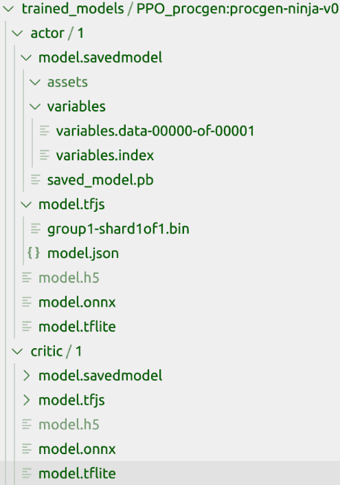

图 9.18 – PPO 深度强化学习智能体模型以各种格式导出，准备部署

这就是我们本章的最终配方！接下来，让我们快速回顾一下我们在此配方中涵盖的一些关键内容。

## 它是如何工作的…

我们首先设置 TensorFlow Keras 的后端，使用 `float32` 作为浮动值的默认表示。这是因为否则 TensorFlow 会使用默认的 `float64` 表示，而 TensorFlow Lite 不支持 `float64`（出于性能原因），因为它面向嵌入式和移动设备运行。

在这个食谱中，我们使用了一个 PPO 代理，配备了期望图像观测并在离散空间中产生动作的 Actor 和 Critic 网络，专为 RL 环境设计，如 OpenAI 的程序化生成的 procgen 环境。你可以根据需要/应用，替换代理代码为前面章节中的 PPO 实现，这些实现使用不同的状态/观测空间和动作空间。你也可以完全替换代理，使用其他代理算法。

我们讨论了几种保存和导出代理模型的方法，利用 TensorFlow 2.x 生态系统提供的完整工具和库。以下图表总结了我们在本食谱中实现的各种导出选项：


图 9.19 – 本食谱中讨论的各种 RL 代理模型导出选项总结

这就是本食谱、这一章，乃至——更戏剧性地说——整本书的结束！在这本食谱中，我们讨论了如何利用 TensorFlow 2.x 框架和围绕它构建的工具和库生态系统，来构建 RL 的基础模块、环境、算法、代理和应用。我希望你在阅读这本书时有一段激动人心的旅程。

我迫不及待想看到你用本书中讨论的食谱构建/创造的内容。期待在[`github.com/PacktPublishing/Tensorflow-2-Reinforcement-Learning-Cookbook/discussions`](https://github.com/PacktPublishing/Tensorflow-2-Reinforcement-Learning-Cookbook/discussions)的讨论页面上听到你的反馈。

期待在讨论/问题页面与你取得联系。祝你未来一切顺利！
