# *第八章*：通过分割实现对图像的精细理解

图像分割是计算机视觉研究领域中最大的领域之一。它通过将共享一个或多个定义特征（如位置、颜色或纹理）的像素组合在一起，简化图像的视觉内容。与计算机视觉的许多其他子领域一样，图像分割也得到了深度神经网络的极大推动，特别是在医学和自动驾驶等行业。

虽然对图像的内容进行分类非常重要，但往往仅仅分类是不够的。假如我们想知道一个物体具体在哪里呢？如果我们对它的形状感兴趣呢？如果我们需要它的轮廓呢？这些精细的需求是传统分类技术无法满足的。然而，正如我们将在本章中发现的那样，我们可以用一种非常类似于常规分类项目的方式来框定图像分割问题。怎么做？我们不是给整张图像标注标签，而是给每个像素标注！这就是图像分割，也是本章食谱的核心内容。

在本章中，我们将涵盖以下食谱：

+   创建一个用于图像分割的全卷积网络

+   从头开始实现 U-Net

+   使用迁移学习实现 U-Net

+   使用 Mask-RCNN 和 TensorFlow Hub 进行图像分割

让我们开始吧！

# 技术要求

为了实现和实验本章的食谱，建议你拥有一台 GPU。如果你有访问基于云的服务提供商，如 AWS 或 FloydHub，那就太好了，但请注意相关费用，因为如果不小心的话，费用可能会飙升！在每个食谱的*准备工作*部分，你会找到你需要为接下来的内容做准备的所有信息。本章的代码可以在这里找到：[`github.com/PacktPublishing/Tensorflow-2.0-Computer-Vision-Cookbook/tree/master/ch8`](https://github.com/PacktPublishing/Tensorflow-2.0-Computer-Vision-Cookbook/tree/master/ch8)。

查看以下链接，观看《代码实践》视频：

[`bit.ly/2Na77IF`](https://bit.ly/2Na77IF)。

# 创建一个用于图像分割的全卷积网络

如果你在知道图像分割本质上就是像素级分类的情况下，创建你的第一个图像分割网络，你会怎么做？你可能会选择一个经过验证的架构，并将最后的层（通常是全连接层）替换为卷积层，以便生成一个输出体积，而不是输出向量。

好的，这正是我们在本食谱中要做的，基于著名的**VGG16**网络构建一个**全卷积网络**（**FCN**）来进行图像分割。

让我们开始吧！

## 准备工作

我们需要安装几个外部库，首先是 `tensorflow_docs`：

```py
$> pip install git+https://github.com/tensorflow/docs
```

接下来，我们需要安装 TensorFlow Datasets、`Pillow` 和 `OpenCV`：

```py
$> pip install tensorflow-datasets Pillow opencv-contrib-python
```

关于数据，我们将从`the Oxford-IIIT Pet`数据集中分割图像。好消息是，我们将通过`tensorflow-datasets`来访问它，所以在这方面我们实际上不需要做任何事情。该数据集中的每个像素将被分类如下：

+   1: 像素属于宠物（猫或狗）。

+   2: 像素属于宠物的轮廓。

+   3: 像素属于周围环境。

这里是数据集中的一些示例图像：

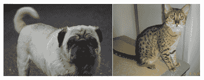

](img/B14768_08_001.jpg)

图 8.1 – 来自 Oxford-IIIT Pet 数据集的示例图像

让我们开始实现吧！

## 如何实现……

按照以下步骤完成此配方：

1.  导入所有必需的包：

    ```py
    import pathlib
    import cv2
    import matplotlib.pyplot as plt
    import numpy as np
    import tensorflow as tf
    import tensorflow_datasets as tfds
    import tensorflow_docs as tfdocs
    import tensorflow_docs.plots
    from tensorflow.keras.layers import *
    from tensorflow.keras.losses import \
        SparseCategoricalCrossentropy
    from tensorflow.keras.models import Model
    from tensorflow.keras.optimizers import RMSprop
    ```

1.  为`tf.data.experimental.AUTOTUNE`定义一个别名：

    ```py
    AUTOTUNE = tf.data.experimental.AUTOTUNE 
    ```

1.  定义一个函数，用于将数据集中的图像归一化到[0, 1]范围。为了保持一致性，我们将从掩膜中的每个像素减去 1，这样它们的范围就从 0 扩展到 2：

    ```py
    def normalize(input_image, input_mask):
       input_image = tf.cast(input_image, tf.float32) / 255.0
        input_mask -= 1
        return input_image, input_mask
    ```

1.  定义`load_image()`函数，给定一个 TensorFlow 数据集元素，该函数加载图像及其掩膜。我们将借此机会将图像调整为*256x256*。另外，如果`train`标志设置为`True`，我们可以通过随机镜像图像及其掩膜来进行一些数据增强。最后，我们必须对输入进行归一化：

    ```py
    @tf.function
    def load_image(dataset_element, train=True):
      input_image = tf.image.resize(dataset_element['image'],
                                      (256, 256))
        input_mask = tf.image.resize(
            dataset_element['segmentation_mask'], (256, 256))
        if train and np.random.uniform() > 0.5:
            input_image = 
                  tf.image.flip_left_right(input_image)
            input_mask = tf.image.flip_left_right(input_mask)
        input_image, input_mask = normalize(input_image,
                                            input_mask)
        return input_image, input_mask
    ```

1.  实现`FCN()`类，该类封装了构建、训练和评估所需的所有逻辑，使用`RMSProp`作为优化器，`SparseCategoricalCrossentropy`作为损失函数。请注意，`output_channels`默认值为 3，因为每个像素可以被分类为三类之一。还请注意，我们正在定义基于**VGG16**的预训练模型的权重路径。我们将使用这些权重在训练时为网络提供一个良好的起点。

1.  现在，是时候定义模型的架构了：

    ```py
    def _create_model(self):
            input = Input(shape=self.input_shape)
            x = Conv2D(filters=64,
                       kernel_size=(3, 3),
                       activation='relu',
                       padding='same',
                       name='block1_conv1')(input)
            x = Conv2D(filters=64,
                       kernel_size=(3, 3),
                       activation='relu',
                       padding='same',
                       name='block1_conv2')(x)
            x = MaxPooling2D(pool_size=(2, 2),
                             strides=2,
                             name='block1_pool')(x)
    ```

1.  我们首先定义了输入和第一块卷积层以及最大池化层。现在，定义第二块卷积层，这次每个卷积使用 128 个滤波器：

    ```py
            x = Conv2D(filters=128,
                       kernel_size=(3, 3),
                       activation='relu',
                       padding='same',
                       name='block2_conv1')(x)
            x = Conv2D(filters=128,
                       kernel_size=(3, 3),
                       activation='relu',
                       padding='same',
                       name='block2_conv2')(x)
            x = MaxPooling2D(pool_size=(2, 2),
                             strides=2,

               name='block2_pool')(x)
    ```

1.  第三块包含 256 个滤波器的卷积：

    ```py
            x = Conv2D(filters=256,
                       kernel_size=(3, 3),
                       activation='relu',
                       padding='same',
                       name='block3_conv1')(x)
            x = Conv2D(filters=256,
                       kernel_size=(3, 3),
                       activation='relu',
                       padding='same',
                       name='block3_conv2')(x)
            x = Conv2D(filters=256,
                       kernel_size=(3, 3),
                       activation='relu',
                       padding='same',
                       name='block3_conv3')(x)
            x = MaxPooling2D(pool_size=(2, 2),
                             strides=2,
                             name='block3_pool')(x)
            block3_pool = x
    ```

1.  第四块使用了 512 个滤波器的卷积：

    ```py
            x = Conv2D(filters=512,
                       kernel_size=(3, 3),
                       activation='relu',
                       padding='same',
                       name='block4_conv1')(x)
            x = Conv2D(filters=512,
                       kernel_size=(3, 3),
                       activation='relu',
                       padding='same',
                       name='block4_conv2')(x)
            x = Conv2D(filters=512,
                       kernel_size=(3, 3),
                       activation='relu',
                       padding='same',
                       name='block4_conv3')(x)
            block4_pool = MaxPooling2D(pool_size=(2, 2),
                                       strides=2,
                                 name='block4_pool')(x)
    ```

1.  第五块是第四块的重复，同样使用 512 个滤波器的卷积：

    ```py
            x = Conv2D(filters=512,
                       kernel_size=(3, 3),
                       activation='relu',
                       padding='same',
                       name='block5_conv1')(block4_pool)
            x = Conv2D(filters=512,
                       kernel_size=(3, 3),
                       activation='relu',
                       padding='same',
                       name='block5_conv2')(x)
            x = Conv2D(filters=512,
                       kernel_size=(3, 3),
                       activation='relu',
                       padding='same',
                       name='block5_conv3')(x)
            block5_pool = MaxPooling2D(pool_size=(2, 2),
                                       strides=2,
                                   name='block5_pool')(x)
    ```

1.  我们到目前为止命名层的原因是，为了在接下来导入预训练权重时能够与它们匹配（请注意`by_name=True`）：

    ```py
            model = Model(input, block5_pool)
            model.load_weights(self.vgg_weights_path,
                               by_name=True)
    ```

1.  在传统的**VGG16**架构中，`output`由全连接层组成。然而，我们将用反卷积层替换它们。请注意，我们正在将这些层连接到第五块的输出：

    ```py
            output = Conv2D(filters=self.output_channels,
                            kernel_size=(7, 7),
                            activation='relu',
                            padding='same',
                            name='conv6')(block5_pool)
            conv6_4 = Conv2DTranspose(
                filters=self.output_channels,
                kernel_size=(4, 4),
                strides=4,
                use_bias=False)(output)
    ```

1.  创建一个 1x1 卷积层，接着是一个反卷积层，并将其连接到第四块的输出（这实际上是一个跳跃连接）：

    ```py
            pool4_n = Conv2D(filters=self.output_channels,
                             kernel_size=(1, 1),
                             activation='relu',
                             padding='same',
                             name='pool4_n')(block4_pool)
            pool4_n_2 = Conv2DTranspose(
                filters=self.output_channels,
                kernel_size=(2, 2),
                strides=2,
                use_bias=False)(pool4_n)
    ```

1.  将第三块的输出通过一个 1x1 卷积层。然后，将这三条路径合并成一条，传递通过最后一个反卷积层。这将通过`Softmax`激活。这个输出即为模型预测的分割掩膜：

    ```py
            pool3_n = Conv2D(filters=self.output_channels,
                             kernel_size=(1, 1),
                             activation='relu',
                             padding='same',
                             name='pool3_n')(block3_pool)
            output = Add(name='add')([pool4_n_2,
                                      pool3_n,
                                      conv6_4])
            output = Conv2DTranspose
                           (filters=self.output_channels,
                                     kernel_size=(8, 8),
                                     strides=8,
                                 use_bias=False)(output)
            output = Softmax()(output)
            return Model(input, output)
    ```

1.  现在，让我们创建一个私有辅助方法来绘制相关的训练曲线：

    ```py
        @staticmethod
        def _plot_model_history(model_history, metric, 
                                            ylim=None):
            plt.style.use('seaborn-darkgrid')
            plotter = tfdocs.plots.HistoryPlotter()
            plotter.plot({'Model': model_history}, 
                                metric=metric)
            plt.title(f'{metric.upper()}')
            if ylim is None:
                plt.ylim([0, 1])
            else:
                plt.ylim(ylim)
            plt.savefig(f'{metric}.png')
            plt.close()
    ```

1.  `train()` 方法接受训练和验证数据集，以及执行的周期数和训练、验证步骤数，用于拟合模型。它还将损失和准确率图保存到磁盘，以便后续分析：

    ```py
        def train(self, train_dataset, epochs, 
                         steps_per_epoch,
                  validation_dataset, validation_steps):
            hist = \
                self.model.fit(train_dataset,
                               epochs=epochs,
                       steps_per_epoch=steps_per_epoch,
                      validation_steps=validation_steps,
                      validation_data=validation_dataset)
            self._plot_model_history(hist, 'loss', [0., 2.0])
            self._plot_model_history(hist, 'accuracy')
    ```

1.  实现 `_process_mask()`，用于使分割掩膜与 OpenCV 兼容。这个函数的作用是创建一个三通道版本的灰度掩膜，并将类值上采样到 [0, 255] 范围：

    ```py
        @staticmethod
        def _process_mask(mask):
            mask = (mask.numpy() * 127.5).astype('uint8')
            mask = cv2.cvtColor(mask, cv2.COLOR_GRAY2RGB)
            return mask
    ```

1.  `_save_image_and_masks()` 辅助方法创建了原始图像、真实标签掩膜和预测分割掩膜的马赛克图像，并将其保存到磁盘以便后续修订：

    ```py
        def _save_image_and_masks(self, image,
                                  ground_truth_mask,
                                  prediction_mask,
                                  image_id):
            image = (image.numpy() * 255.0).astype('uint8')
            gt_mask = self._process_mask(ground_truth_mask)
            pred_mask = self._process_mask(prediction_mask)
            mosaic = np.hstack([image, gt_mask, pred_mask])
            mosaic = cv2.cvtColor(mosaic, cv2.COLOR_RGB2BGR)
            cv2.imwrite(f'mosaic_{image_id}.jpg', mosaic)
    ```

1.  为了将网络输出的体积转换为有效的分割掩膜，我们必须在每个像素位置选择值最高的索引。这对应于该像素最可能的类别。`_create_mask()` 方法执行此操作：

    ```py
        @staticmethod
        def _create_mask(prediction_mask):
            prediction_mask = tf.argmax(prediction_mask, 
                                         axis=-1)
            prediction_mask = prediction_mask[..., 
                                              tf.newaxis]
            return prediction_mask[0]
    ```

1.  `_save_predictions()` 方法使用了我们在 *步骤 18* 中定义的 `_save_image_and_mask()` 辅助方法：

    ```py
        def _save_predictions(self, dataset, 
                               sample_size=1):
            for id, (image, mask) in \
                    enumerate(dataset.take(sample_size), 
                                            start=1):
                pred_mask = self.model.predict(image)
                pred_mask = self._create_mask(pred_mask)
                image = image[0]
                ground_truth_mask = mask[0]
                self._save_image_and_masks(image,
                                      ground_truth_mask,
                                           pred_mask,
                                           image_id=id)
    ```

1.  `evaluate()` 方法计算 **FCN** 在测试集上的准确率，并为一部分图像生成预测结果，然后将其保存到磁盘：

    ```py
        def evaluate(self, test_dataset, sample_size=5):
            result = self.model.evaluate(test_dataset)
            print(f'Accuracy: {result[1] * 100:.2f}%')
            self._save_predictions(test_dataset, 
                                    sample_size)
    ```

1.  使用 **TensorFlow Datasets** 下载（或加载，如果已缓存）`Oxford IIIT Pet Dataset` 及其元数据：

    ```py
    dataset, info = tfdata.load('oxford_iiit_pet', 
                                 with_info=True)
    ```

1.  使用元数据定义网络在训练和验证数据集上的步数。此外，还要定义批处理和缓冲区大小：

    ```py
    TRAIN_SIZE = info.splits['train'].num_examples
    VALIDATION_SIZE = info.splits['test'].num_examples
    BATCH_SIZE = 32
    STEPS_PER_EPOCH = TRAIN_SIZE // BATCH_SIZE
    VALIDATION_SUBSPLITS = 5
    VALIDATION_STEPS = VALIDATION_SIZE // BATCH_SIZE
    VALIDATION_STEPS //= VALIDATION_SUBSPLITS
    BUFFER_SIZE = 1000
    ```

1.  定义训练和测试数据集的管道：

    ```py
    train_dataset = (dataset['train']
                     .map(load_image, num_parallel_
                     calls=AUTOTUNE)
                     .cache()
                     .shuffle(BUFFER_SIZE)
                     .batch(BATCH_SIZE)
                     .repeat()
                     .prefetch(buffer_size=AUTOTUNE))
    test_dataset = (dataset['test']
                    .map(lambda d: load_image(d,train=False),
                         num_parallel_calls=AUTOTUNE)
                    .batch(BATCH_SIZE))
    ```

1.  实例化 **FCN** 并训练 120 个周期：

    ```py
    fcn = FCN(output_channels=3)
    fcn.train(train_dataset,
              epochs=120,
              steps_per_epoch=STEPS_PER_EPOCH,
              validation_steps=VALIDATION_STEPS,
              validation_dataset=test_dataset)
    ```

1.  最后，在测试数据集上评估网络：

    ```py
    unet.evaluate(test_dataset)
    ```

    如下图所示，测试集上的准确率应约为 84%（具体来说，我得到的是 84.47%）：

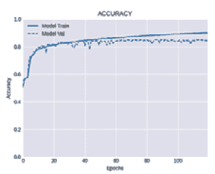

图 8.2 – 训练和验证准确率曲线

训练曲线显示出健康的行为，意味着网络确实学到了东西。然而，真正的考验是通过视觉评估结果：


图 8.3 – 原始图像（左），真实标签掩膜（中），预测掩膜（右）

在前面的图像中，我们可以看到，网络生成的掩膜跟真实标签分割的形状相符。然而，分割部分存在令人不满意的像素化效果，并且右上角有噪点。让我们看看另一个例子：

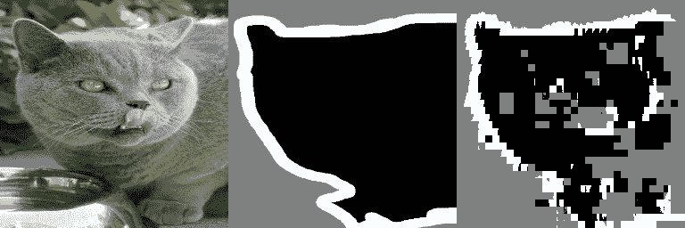

图 8.4 – 原始图像（左），真实标签掩膜（中），预测掩膜（右）

在上面的图像中，我们可以看到一个非常不完整、斑点状且总体质量较差的掩膜，这证明网络仍需要大量改进。这可以通过更多的微调和实验来实现。然而，在下一个食谱中，我们将发现一个更适合执行图像分割并能以更少的努力产生真正好掩膜的网络。

我们将在*它是如何工作的…*部分讨论我们刚刚做的事情。

## 它是如何工作的…

在本食谱中，我们实现了一个**FCN**用于图像分割。尽管我们将一个广为人知的架构**VGG16**进行了调整以适应我们的需求，实际上，**FCN**有许多不同的变种，它们扩展或修改了其他重要的架构，如**ResNet50**、**DenseNet**以及其他**VGG**的变体。

我们需要记住的是，`UpSampling2D()`配合双线性插值或`ConvTranspose2D()`的使用。最终的结果是，我们不再用一个输出的概率向量来对整个图像进行分类，而是生成一个与输入图像相同尺寸的输出体积，其中每个像素包含它可能属于的各个类别的概率分布。这种像素级的预测分割掩膜就被称为预测分割掩膜。

## 另见

你可以了解更多关于`Oxford-IIIT Pet Dataset`的信息，访问官方站点：[`www.robots.ox.ac.uk/~vgg/data/pets/`](https://www.robots.ox.ac.uk/~vgg/data/pets/)。

# 从零开始实现 U-Net

要谈论图像分割，不能不提到**U-Net**，它是像素级分类的经典架构之一。

**U-Net**是一个由编码器和解码器组成的复合网络，正如其名，网络层以 U 形排列。它旨在快速且精确地进行分割，在本食谱中，我们将从零开始实现一个。

让我们开始吧，怎么样？

## 准备工作

在本例中，我们将依赖几个外部库，如 TensorFlow Datasets、TensorFlow Docs、`Pillow`和`OpenCV`。好消息是，我们可以通过`pip`轻松安装它们。首先，安装`tensorflow_docs`，如下所示：

```py
$> pip install git+https://github.com/tensorflow/docs
```

接下来，安装其余的库：

```py
$> pip install tensorflow-datasets Pillow opencv-contrib-python
```

在本食谱中，我们将使用`Oxford-IIIT Pet Dataset`。不过，现阶段我们不需要做任何事情，因为我们将通过`tensorflow-datasets`下载并操作它。在这个数据集中，分割掩膜（一个图像，每个位置包含原始图像中相应像素的类别）包含分类为三类的像素：

+   1: 像素属于宠物（猫或狗）。

+   2: 像素属于宠物的轮廓。

+   3: 像素属于周围环境。

以下是数据集中的一些示例图像：

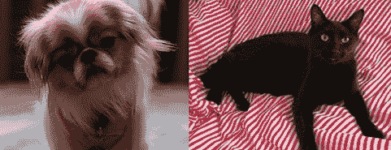

图 8.5 – 来自 Oxford-IIIT Pet 数据集的示例图像

太好了！让我们开始实现吧！

## 如何实现…

按照以下步骤实现您自己的**U-Net**，这样您就可以对自己宠物的图像进行分割：

1.  让我们导入所有必需的依赖项：

    ```py
    import cv2
    import matplotlib.pyplot as plt
    import numpy as np
    import tensorflow as tf
    import tensorflow_datasets as tfdata
    import tensorflow_docs as tfdocs
    import tensorflow_docs.plots
    from tensorflow.keras.layers import *
    from tensorflow.keras.losses import \
        SparseCategoricalCrossentropy
    from tensorflow.keras.models import *
    from tensorflow.keras.optimizers import RMSprop
    ```

1.  定义`tf.data.experimental.AUTOTUNE`的别名：

    ```py
    AUTOTUNE = tf.data.experimental.AUTOTUNE 
    ```

1.  定义一个函数，用于归一化数据集中的图像。我们还需要归一化掩膜，使得类别编号从 0 到 2，而不是从 1 到 3：

    ```py
    def normalize(input_image, input_mask):
        input_image = tf.cast(input_image, tf.float32) / 255.0
        input_mask -= 1
        return input_image, input_mask
    ```

1.  定义一个函数，根据 TensorFlow 数据集结构中的元素加载图像。请注意，我们将图像和掩膜的大小调整为*256x256*。此外，如果`train`标志设置为`True`，我们会通过随机镜像图像及其掩膜来进行数据增强。最后，我们对输入进行归一化处理：

    ```py
    @tf.function
    def load_image(dataset_element, train=True):
      input_image = tf.image.resize(dataset element['image'],
                                      (256, 256))
        input_mask = tf.image.resize(
            dataset_element['segmentation_mask'],(256, 256))
        if train and np.random.uniform() > 0.5:
          input_image = tf.image.flip_left_right(input_image)
            input_mask = tf.image.flip_left_right(input_mask)
        input_image, input_mask = normalize(input_image,
                                            input_mask)
        return input_image, input_mask
    ```

1.  现在，让我们定义一个`UNet()`类，它将包含构建、训练和评估所需的所有逻辑，使用`RMSProp`作为优化器，`SparseCategoricalCrossentropy`作为损失函数。请注意，`output_channels`默认为`3`，因为每个像素可以被分类为三类之一。

1.  现在，让我们定义`_downsample()`助手方法，用于构建下采样块。它是一个卷积层，可以（可选地）进行批量归一化，并通过`LeakyReLU`激活：

    ```py
        @staticmethod
        def _downsample(filters, size, batch_norm=True):
        initializer = tf.random_normal_initializer(0.0, 0.02)
            layers = Sequential()
            layers.add(Conv2D(filters=filters,
                              kernel_size=size,
                              strides=2,
                              padding='same',
                              kernel_initializer=initializer,
                              use_bias=False))
            if batch_norm:
                layers.add(BatchNormalization())
            layers.add(LeakyReLU())
            return layers
    ```

1.  相反，`_upsample()`助手方法通过转置卷积扩展其输入，该卷积也进行批量归一化，并通过`ReLU`激活（可选地，我们可以添加一个 dropout 层来防止过拟合）：

    ```py
        def _upsample(filters, size, dropout=False):
            init = tf.random_normal_initializer(0.0, 0.02)
            layers = Sequential()
            layers.add(Conv2DTranspose(filters=filters,
                                       kernel_size=size,
                                       strides=2,
                                       padding='same',
                                 kernel_initializer=init,
                                       use_bias=False))
            layers.add(BatchNormalization())
            if dropout:
                layers.add(Dropout(rate=0.5))
            layers.add(ReLU())
            return layers
    ```

1.  凭借`_downsample()`和`_upsample()`，我们可以迭代地构建完整的**U-Net**架构。网络的编码部分只是一个下采样块的堆叠，而解码部分则如预期那样，由一系列上采样块组成：

    ```py
        def _create_model(self):
            down_stack = [self._downsample(64, 4,
                                      batch_norm=False)]
            for filters in (128, 256, 512, 512, 512, 512, 
                              512):
                down_block = self._downsample(filters, 4)
                down_stack.append(down_block)
            up_stack = []
            for _ in range(3):
                up_block = self._upsample(512, 4, 
                                          dropout=True)
                up_stack.append(up_block)
            for filters in (512, 256, 128, 64):
                up_block = self._upsample(filters, 4)
                up_stack.append(up_block)
    ```

1.  为了防止网络出现梯度消失问题（即深度网络遗忘已学内容的现象），我们必须在每个层级添加跳跃连接：

    ```py
            inputs = Input(shape=self.input_size)
            x = inputs
            skip_layers = []
            for down in down_stack:
                x = down(x)
                skip_layers.append(x)
            skip_layers = reversed(skip_layers[:-1])
            for up, skip_connection in zip(up_stack, 
                                           skip_layers):
                x = up(x)
                x = Concatenate()([x, skip_connection])
    ```

    **U-Net**的输出层是一个转置卷积，其尺寸与输入图像相同，但它的通道数与分割掩膜中的类别数相同：

    ```py
            init = tf.random_normal_initializer(0.0, 0.02)
            output = Conv2DTranspose(
                filters=self.output_channels,
                kernel_size=3,
                strides=2,
                padding='same',
                kernel_initializer=init)(x)
            return Model(inputs, outputs=output)
    ```

1.  让我们定义一个`helper`方法，用于绘制相关的训练曲线：

    ```py
        @staticmethod
        def _plot_model_history(model_history, metric, 
                                ylim=None):
            plt.style.use('seaborn-darkgrid')
            plotter = tfdocs.plots.HistoryPlotter()
            plotter.plot({'Model': model_history}, 
                               metric=metric)
            plt.title(f'{metric.upper()}')
            if ylim is None:
                plt.ylim([0, 1])
            else:
                plt.ylim(ylim)
            plt.savefig(f'{metric}.png')
            plt.close()
    ```

1.  `train()`方法接受训练和验证数据集，以及进行训练所需的轮次、训练和验证步数。它还会将损失和准确率图保存到磁盘，以供后续分析：

    ```py
        def train(self, train_dataset, epochs, 
                         steps_per_epoch,
                  validation_dataset, validation_steps):
            hist = \
                self.model.fit(train_dataset,
                               epochs=epochs,
                        steps_per_epoch=steps_per_epoch,
                       validation_steps=validation_steps,
                     validation_data=validation_dataset)
            self._plot_model_history(hist, 'loss', [0., 2.0])
            self._plot_model_history(hist, 'accuracy')
    ```

1.  定义一个名为`_process_mask()`的助手方法，用于将分割掩膜与 OpenCV 兼容。此函数的作用是创建一个三通道的灰度掩膜版本，并将类别值扩大到[0, 255]的范围：

    ```py
        @staticmethod
        def _process_mask(mask):
            mask = (mask.numpy() * 127.5).astype('uint8')
            mask = cv2.cvtColor(mask, cv2.COLOR_GRAY2RGB)
            return mask
    ```

1.  `_save_image_and_masks()`助手方法会创建一个由原始图像、真实掩膜和预测分割掩膜组成的马赛克，并将其保存到磁盘，供以后修订：

    ```py
        def _save_image_and_masks(self, image,
                                  ground_truth_mask,
                                  prediction_mask,
                                  image_id):
            image = (image.numpy() * 
                     255.0).astype('uint8')
            gt_mask = self._process_mask(ground_truth_mask)
            pred_mask = self._process_mask(prediction_mask)
            mosaic = np.hstack([image, gt_mask, pred_mask])
            mosaic = cv2.cvtColor(mosaic, cv2.COLOR_RGB2BGR)
            cv2.imwrite(f'mosaic_{image_id}.jpg', mosaic)
    ```

1.  为了将网络产生的输出体积传递到有效的分割掩膜，我们必须获取每个像素位置上最高值的索引，这对应于该像素最可能的类别。`_create_mask()`方法执行了这个操作：

    ```py
        @staticmethod
        def _create_mask(prediction_mask):
            prediction_mask = tf.argmax(prediction_mask, 
                                           axis=-1)
            prediction_mask = prediction_mask[...,tf.newaxis]
            return prediction_mask[0]
    ```

    `_save_predictions()`方法使用了我们在*步骤 13*中定义的`_save_image_and_mask()`辅助方法：

    ```py
        def _save_predictions(self, dataset, 
                                sample_size=1):
            for id, (image, mask) in \
                    enumerate(dataset.take(sample_size), 
                                           start=1):
                pred_mask = self.model.predict(image)
                pred_mask = self._create_mask(pred_mask)
                image = image[0]
                ground_truth_mask = mask[0]
                self._save_image_and_masks(image,
                                      ground_truth_mask,
                                           pred_mask,
                                           image_id=id)
    ```

1.  `evaluate()`方法计算**U-Net**在测试集上的准确度，并为一些图像样本生成预测，之后将其存储到磁盘上：

    ```py
        def evaluate(self, test_dataset, sample_size=5):
            result = self.model.evaluate(test_dataset)
            print(f'Accuracy: {result[1] * 100:.2f}%')
            self._save_predictions(test_dataset, 
                                   sample_size)
    ```

1.  使用 TensorFlow Datasets 下载（或加载，如果已缓存）`Oxford IIIT Pet Dataset`及其元数据：

    ```py
    dataset, info = tfdata.load('oxford_iiit_pet',
                                with_info=True)
    ```

1.  使用元数据来定义网络在训练和验证数据集上将进行的相应步数。还需定义批量和缓冲区大小：

    ```py
    TRAIN_SIZE = info.splits['train'].num_examples
    VALIDATION_SIZE = info.splits['test'].num_examples
    BATCH_SIZE = 64
    STEPS_PER_EPOCH = TRAIN_SIZE // BATCH_SIZE
    VALIDATION_SUBSPLITS = 5
    VALIDATION_STEPS = VALIDATION_SIZE // BATCH_SIZE
    VALIDATION_STEPS //= VALIDATION_SUBSPLITS
    BUFFER_SIZE = 1000
    ```

1.  定义训练和测试数据集的管道：

    ```py
    train_dataset = (dataset['train']
                     .map(load_image, num_parallel_
                      calls=AUTOTUNE)
                     .cache()
                     .shuffle(BUFFER_SIZE)
                     .batch(BATCH_SIZE)
                     .repeat()
                     .prefetch(buffer_size=AUTOTUNE))
    test_dataset = (dataset['test']
                    .map(lambda d: load_image(d, 
                      train=False),
                         num_parallel_calls=AUTOTUNE)
                    .batch(BATCH_SIZE))
    ```

1.  实例化**U-Net**并训练 50 个 epoch：

    ```py
    unet = UNet()
    unet.train(train_dataset,
               epochs=50,
               steps_per_epoch=STEPS_PER_EPOCH,
               validation_steps=VALIDATION_STEPS,
               validation_dataset=test_dataset)
    ```

1.  最后，在测试数据集上评估网络：

    ```py
    unet.evaluate(test_dataset)
    ```

    测试集上的准确度应该在 83%左右（在我的情况下，我得到了 83.49%）：

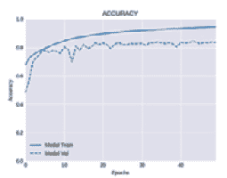

图 8.6 – 训练和验证准确度曲线

在这里，我们可以看到，大约在第 12 个 epoch 之后，训练准确度曲线和验证准确度曲线之间的差距开始慢慢扩大。这不是过拟合的表现，而是表明我们可以做得更好。那么，这个准确度是如何转化为实际图像的呢？

看一下下面的图片，展示了原始图像、地面真实掩膜和生成的掩膜：


图 8.7 – 原始图像（左侧）、地面真实掩膜（中间）和预测掩膜（右侧）

在这里，我们可以看到，地面真实掩膜（中间）和预测掩膜（右侧）之间有很好的相似性，尽管存在一些噪声，比如小的白色区域和狗轮廓下半部分明显的隆起，这些噪声通过更多的训练可以清理掉：

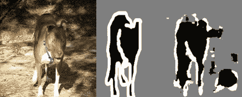

图 8.8 – 原始图像（左侧）、地面真实掩膜（中间）和预测掩膜（右侧）

前面的图片清楚地表明，网络可以进行更多的训练或微调。这是因为尽管它正确地获取了狗的整体形状和位置，但掩膜中仍有太多噪声，导致其无法在实际应用中使用。

让我们前往*它是如何工作的……*部分，进一步连结各个环节。

## 它是如何工作的……

在这个示例中，我们从头开始实现并训练了一个**U-Net**，用于分割家庭宠物的身体和轮廓。正如我们所看到的，网络确实学到了东西，但仍然有改进的空间。

在多个领域中，语义分割图像内容的能力至关重要，例如在医学中，比知道是否存在病症（如恶性肿瘤）更重要的是确定病变的实际位置、形状和面积。**U-Net**首次亮相于生物医学领域。2015 年，它在使用远少于数据的情况下，超越了传统的分割方法，例如滑动窗口卷积网络。

**U-Net**是如何取得如此好结果的呢？正如我们在本食谱中所学到的，关键在于其端到端的结构，其中编码器和解码器都由卷积组成，形成一个收缩路径，其任务是捕捉上下文信息，还有一个对称的扩展路径，从而实现精确的定位。

上述两条路径的深度可以根据数据集的性质进行调整。这种深度定制之所以可行，是因为跳跃连接的存在，它允许梯度在网络中进一步流动，从而防止梯度消失问题（这与**ResNet**所做的类似，正如我们在*第二章*中学到的，*执行图像分类*）。

在下一个食谱中，我们将结合这个强大的概念与`Oxford IIIT Pet Dataset`的实现：迁移学习。

## 另见

一个很好的方法来熟悉`Oxford IIIT Pet Dataset`，可以访问官方网站：[`www.robots.ox.ac.uk/~vgg/data/pets/`](https://www.robots.ox.ac.uk/~vgg/data/pets/)。

在本食谱中，我们提到过梯度消失问题几次，因此，阅读这篇文章以了解这一概念是个好主意：[`en.wikipedia.org/wiki/Vanishing_gradient_problem`](https://en.wikipedia.org/wiki/Vanishing_gradient_problem)。

# 实现带迁移学习的 U-Net

从头开始训练一个**U-Net**是创建高性能图像分割系统的一个非常好的第一步。然而，深度学习在计算机视觉中的最大超能力之一就是能够在其他网络的知识基础上构建解决方案，这通常会带来更快且更好的结果。

图像分割也不例外，在本食谱中，我们将使用迁移学习来实现一个更好的分割网络。

让我们开始吧。

## 准备就绪

本食谱与前一个食谱（*从头开始实现 U-Net*）非常相似，因此我们只会深入讨论不同的部分。为了更深入的理解，我建议在尝试本食谱之前，先完成*从头开始实现 U-Net*的食谱。正如预期的那样，我们需要的库与之前相同，都可以通过`pip`安装。让我们首先安装`tensorflow_docs`，如下所示：

```py
$> pip install git+https://github.com/tensorflow/docs
```

现在，让我们设置剩余的依赖项：

```py
$> pip install tensorflow-datasets Pillow opencv-contrib-python
```

我们将再次使用`Oxford-IIIT Pet Dataset`，可以通过`tensorflow-datasets`访问。该数据集中的每个像素都属于以下类别之一：

+   1：该像素属于宠物（猫或狗）。

+   2：该像素属于宠物的轮廓。

+   3：该像素属于周围环境。

以下图片展示了数据集中的两张样本图像：


](img/B14768_08_009.jpg)

图 8.9 – 来自 Oxford-IIIT Pet 数据集的样本图像

这样，我们就可以开始了！

## 如何实现……

完成以下步骤以实现一个基于转移学习的**U-Net**：

1.  导入所有需要的包：

    ```py
    import cv2
    import matplotlib.pyplot as plt
    import numpy as np
    import tensorflow as tf
    import tensorflow_datasets as tfdata
    import tensorflow_docs as tfdocs
    import tensorflow_docs.plots
    from tensorflow.keras.applications import MobileNetV2
    from tensorflow.keras.layers import *
    from tensorflow.keras.losses import \
        SparseCategoricalCrossentropy
    from tensorflow.keras.models import *
    from tensorflow.keras.optimizers import RMSprop
    ```

1.  为`tf.data.experimental.AUTOTUNE`定义一个别名：

    ```py
    AUTOTUNE = tf.data.experimental.AUTOTUNE 
    ```

1.  定义一个函数，用于对数据集中的图像和掩码进行归一化处理：

    ```py
    def normalize(input_image, input_mask):
        input_image = tf.cast(input_image, tf.float32) / 
                                       255.0
        input_mask -= 1
        return input_image, input_mask
    ```

1.  定义一个函数，根据 TensorFlow Datasets 数据结构中的一个元素加载图像及其对应的掩码。可选地，函数可以对训练图像执行图像镜像操作：

    ```py
    @tf.function
    def load_image(dataset_element, train=True):
        input_image = tf.image.resize(dataset
                               element['image'],(256, 256))
        input_mask = tf.image.resize(
            dataset_element['segmentation_mask'], (256,256))
        if train and np.random.uniform() > 0.5:
            input_image = tf.image.flip_left_right(input_
                                                  image)
            input_mask = 
               tf.image.flip_left_right(input_mask)
        input_image, input_mask = normalize(input_image,
                                            input_mask)
        return input_image, input_mask
    ```

1.  定义`UNet()`，这是一个容器类，包含了构建、训练和评估我们的转移学习辅助的`RMSProp`优化器和`SparseCategoricalCrossentropy`损失函数所需的逻辑。注意，`output_channels`默认值为`3`，因为每个像素可以归类为三种类别之一。编码器将使用预训练的`MobileNetV2`，但我们只会使用其中一部分层，这些层在`self.target_layers`中定义。

1.  现在，我们来定义`_upsample()`辅助方法，构建一个上采样模块：

    ```py
        @staticmethod
        def _upsample(filters, size, dropout=False):
            init = tf.random_normal_initializer(0.0, 0.02)
            layers = Sequential()
            layers.add(Conv2DTranspose(filters=filters,
                                       kernel_size=size,
                                       strides=2,
                                       padding='same',
                               kernel_initializer=init,
                                       use_bias=False))
            layers.add(BatchNormalization())
            if dropout:
                layers.add(Dropout(rate=0.5))
            layers.add(ReLU())
            return layers
    ```

1.  利用我们预训练的`MobileNetV2`和`_upsample()`方法，我们可以逐步构建完整的`self.target_layers`，这些层被冻结（`down_stack.trainable = False`），这意味着我们只训练解码器或上采样模块：

    ```py
        def _create_model(self):
          layers = [self.pretrained_model.get_layer(l).output
                      for l in self.target_layers]
        down_stack = Model(inputs=self.pretrained_model.
                                  input, outputs=layers)
            down_stack.trainable = False
            up_stack = []
            for filters in (512, 256, 128, 64):
                up_block = self._upsample(filters, 4)
                up_stack.append(up_block)
    ```

1.  现在，我们可以添加跳跃连接，以促进梯度在网络中的流动：

    ```py
            inputs = Input(shape=self.input_size)
            x = inputs
            skip_layers = down_stack(x)
            x = skip_layers[-1]
            skip_layers = reversed(skip_layers[:-1])
            for up, skip_connection in zip(up_stack, 
                                           skip_layers):
                x = up(x)
                x = Concatenate()([x, skip_connection])
    ```

1.  **U-Net**的输出层是一个转置卷积，其尺寸与输入图像相同，但通道数与分割掩码中的类别数相同：

    ```py
            init = tf.random_normal_initializer(0.0, 0.02)
            output = Conv2DTranspose(
                filters=self.output_channels,
                kernel_size=3,
                strides=2,
                padding='same',
                kernel_initializer=init)(x)
            return Model(inputs, outputs=output)
    ```

1.  定义`_plot_model_history()`，一个辅助方法，用于绘制相关的训练曲线：

    ```py
        @staticmethod
        def _plot_model_history(model_history, metric, 
                                 ylim=None):
            plt.style.use('seaborn-darkgrid')
            plotter = tfdocs.plots.HistoryPlotter()
            plotter.plot({'Model': model_history}, 
                            metric=metric)
            plt.title(f'{metric.upper()}')
            if ylim is None:
                plt.ylim([0, 1])
            else:
                plt.ylim(ylim)
            plt.savefig(f'{metric}.png')
            plt.close()
    ```

1.  定义`train()`方法，负责拟合模型：

    ```py
        def train(self, train_dataset, epochs, 
                      steps_per_epoch,
                  validation_dataset, validation_steps):
            hist = \
                self.model.fit(train_dataset,
                             epochs=epochs,
                            steps_per_epoch=steps_per_epoch,
                           validation_steps=validation_steps,
                          validation_data=validation_dataset)
            self._plot_model_history(hist, 'loss', [0., 2.0])
            self._plot_model_history(hist, 'accuracy')
    ```

1.  定义`_process_mask()`，一个辅助方法，使分割掩码与 OpenCV 兼容：

    ```py
        @staticmethod
        def _process_mask(mask):
            mask = (mask.numpy() * 127.5).astype('uint8')
            mask = cv2.cvtColor(mask, cv2.COLOR_GRAY2RGB)
            return mask
    ```

1.  定义`_save_image_and_masks()`辅助方法，用于创建原始图像的可视化，以及真实和预测的掩码：

    ```py
        def _save_image_and_masks(self, image,
                                  ground_truth_mask,
                                  prediction_mask,
                                  image_id):
            image = (image.numpy() * 255.0).astype('uint8')
            gt_mask = self._process_mask(ground_truth_mask)
            pred_mask = self._process_mask(prediction_mask)
            mosaic = np.hstack([image, gt_mask, pred_mask])
            mosaic = cv2.cvtColor(mosaic, cv2.COLOR_RGB2BGR)
            cv2.imwrite(f'mosaic_{image_id}.jpg', mosaic)
    ```

1.  定义`_create_mask()`，该方法根据网络的预测生成有效的分割掩码：

    ```py
        @staticmethod
        def _create_mask(prediction_mask):
            prediction_mask = tf.argmax(prediction_mask, 
                                       axis=-1)
            prediction_mask = prediction_mask[..., 
                                          tf.newaxis]
            return prediction_mask[0]
    ```

1.  `_save_predictions()`方法使用了我们在*第 13 步*中定义的`_save_image_and_mask()`辅助方法：

    ```py
        def _save_predictions(self, dataset, 
                              sample_size=1):
            for id, (image, mask) in \
                    enumerate(dataset.take(sample_size), 
                                start=1):
                pred_mask = self.model.predict(image)
                pred_mask = self._create_mask(pred_mask)
                image = image[0]
                ground_truth_mask = mask[0]
                self._save_image_and_masks(image,
                                      ground_truth_mask,
                                           pred_mask,
                                           image_id=id)
    ```

1.  `evaluate()`方法计算**U-Net**在测试集上的准确度，并生成一组图像样本的预测。预测结果随后会被存储到磁盘上：

    ```py
        def evaluate(self, test_dataset, sample_size=5):
            result = self.model.evaluate(test_dataset)
            print(f'Accuracy: {result[1] * 100:.2f}%')
            self._save_predictions(test_dataset, sample_size)
    ```

1.  使用 TensorFlow Datasets 下载（或加载缓存的）`Oxford IIIT Pet Dataset`及其元数据：

    ```py
    dataset, info = tfdata.load('oxford_iiit_pet',
                                with_info=True)
    ```

1.  使用元数据定义网络在训练和验证数据集上将执行的步骤数。还要定义批量大小和缓存大小：

    ```py
    TRAIN_SIZE = info.splits['train'].num_examples
    VALIDATION_SIZE = info.splits['test'].num_examples
    BATCH_SIZE = 64
    STEPS_PER_EPOCH = TRAIN_SIZE // BATCH_SIZE
    VALIDATION_SUBSPLITS = 5
    VALIDATION_STEPS = VALIDATION_SIZE // BATCH_SIZE
    VALIDATION_STEPS //= VALIDATION_SUBSPLITS
    BUFFER_SIZE = 1000
    ```

1.  定义训练和测试数据集的管道：

    ```py
    train_dataset = (dataset['train']
                     .map(load_image, num_parallel_
                      calls=AUTOTUNE)
                     .cache()
                     .shuffle(BUFFER_SIZE)
                     .batch(BATCH_SIZE)
                     .repeat()
                     .prefetch(buffer_size=AUTOTUNE))
    test_dataset = (dataset['test']
                    .map(lambda d: load_image(d, 
                         train=False),
                         num_parallel_calls=AUTOTUNE)
                    .batch(BATCH_SIZE))
    ```

1.  实例化**U-Net**并训练它 30 个周期：

    ```py
    unet = UNet()
    unet.train(train_dataset,
               epochs=50,
               steps_per_epoch=STEPS_PER_EPOCH,
               validation_steps=VALIDATION_STEPS,
               validation_dataset=test_dataset)
    ```

1.  在测试数据集上评估网络：

    ```py
    unet.evaluate(test_dataset)
    ```

    在测试集上的准确率应该接近 90%（在我的案例中，我得到了 90.78%的准确率）：

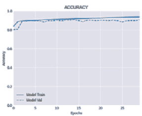

图 8.10 – 训练和验证准确率曲线

准确率曲线显示，网络没有发生过拟合，因为训练和验证图表遵循相同的轨迹，且差距非常小。这也确认了模型所获得的知识是可迁移的，并且可以用于未见过的数据。

让我们看一下网络的一些输出，从以下图像开始：

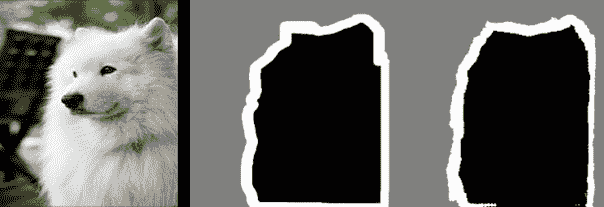

图 8.11 – 原始图像（左）、真实标签掩码（中）和预测掩码（右）

与*图 8.7*中*从头实现 U-Net*一节中的结果相比，在前面的图像中，我们可以看到**U-Net**产生了一个更干净的结果，背景（灰色像素）、轮廓（白色像素）和宠物（黑色像素）被清晰地分开，并且几乎与真实标签掩码（中）完全相同：

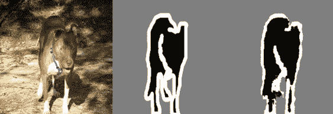

图 8.12 – 原始图像（左）、真实标签掩码（中）和预测掩码（右）

与*从头实现 U-Net*一节中的*图 8.8*相比，前面的图像是一个显著的改进。这次，预测掩码（右），虽然不是完美的，但呈现出更少的噪声，并且更接近实际的分割掩码（中）。

我们将在*它是如何工作的…*一节中深入探讨。

## 它是如何工作的……

在这个例子中，我们对在庞大的`ImageNet`数据集上训练的`MobileNetV2`做了一个小但重要的改动。

迁移学习在这个场景中效果如此出色的原因是，`ImageNet`中有成百上千的类别，专注于不同品种的猫和狗，这意味着与`Oxford IIIT Pet`数据集的重叠非常大。然而，如果情况并非如此，这并不意味着我们应该完全放弃迁移学习！我们在这种情况下应该做的是通过使编码器的某些（或全部）层可训练，来微调它。

通过利用`MobileNetV2`中编码的知识，我们将测试集上的准确率从 83%提升到了 90%，这是一项令人印象深刻的提升，带来了更好、更清晰的预测掩码，即使是在具有挑战性的例子上。

## 另见

你可以阅读原始的`Oxford IIIT Pet Dataset`，请访问[`www.robots.ox.ac.uk/~vgg/data/pets/`](https://www.robots.ox.ac.uk/~vgg/data/pets/)。想了解如何解决梯度消失问题，请阅读这篇文章：[`en.wikipedia.org/wiki/Vanishing_gradient_problem`](https://en.wikipedia.org/wiki/Vanishing_gradient_problem)。

# 使用 Mask-RCNN 和 TensorFlow Hub 进行图像分割

`COCO`数据集。这将帮助我们进行开箱即用的物体检测和图像分割。

## 准备工作

首先，我们必须安装`Pillow`和**TFHub**，如下所示：

```py
$> pip install Pillow tensorflow-hub
```

我们还需要将`cd`安装到你选择的位置，并克隆`tensorflow/models`仓库：

```py
$> git clone –-depth 1 https://github.com/tensorflow/models
```

接下来，安装**TensorFlow 对象检测 API**，方法如下：

```py
$> sudo apt install -y protobuf-compiler
$> cd models/research
$> protoc object_detection/protos/*.proto --python_out=.
$> cp object_detection/packages/tf2/setup.py .
$> python -m pip install -q . 
```

就这样！让我们开始吧。

## 如何做到这一点…

按照以下步骤学习如何使用**Mask-RCNN**进行图像分割：

1.  导入必要的包：

    ```py
    import glob
    from io import BytesIO
    import matplotlib.pyplot as plt
    import numpy as np
    import tensorflow as tf
    import tensorflow_hub as hub
    from PIL import Image
    from object_detection.utils import ops
    from object_detection.utils import visualization_utils as viz
    from object_detection.utils.label_map_util import \
        create_category_index_from_labelmap
    ```

1.  定义一个函数，将图像加载到 NumPy 数组中：

    ```py
    def load_image(path):
        image_data = tf.io.gfile.GFile(path, 'rb').read()
        image = Image.open(BytesIO(image_data))
        width, height = image.size
        shape = (1, height, width, 3)
        image = np.array(image.getdata())
        image = image.reshape(shape).astype('uint8')
        return image
    ```

1.  定义一个函数，使用**Mask-RCNN**进行预测，并将结果保存到磁盘。首先加载图像并将其输入到模型中：

    ```py
    def get_and_save_predictions(model, image_path):
        image = load_image(image_path)
        results = model(image)
    ```

1.  将结果转换为`NumPy`数组：

    ```py
    model_output = {k: v.numpy() for k, v in 
                    results.items()}
    ```

1.  从模型输出中提取检测掩膜和框，并将它们转换为张量：

    ```py
      detection_masks = model_output['detection_masks'][0]
     detection_masks = tf.convert_to_tensor(detection_masks)
     detection_boxes = model_output['detection_boxes'][0]
     detection_boxes = tf.convert_to_tensor(detection_boxes)
    ```

1.  将框掩膜转换为图像掩膜：

    ```py
        detection_masks_reframed = \
         ops.reframe_box_masks_to_image_masks(detection_
                                    masks,detection_boxes,
                                     image.shape[1],
                                   image.shape[2])
        detection_masks_reframed = \
            tf.cast(detection_masks_reframed > 0.5, 
                     tf.uint8)
        model_output['detection_masks_reframed'] = \
            detection_masks_reframed.numpy()
    ```

1.  创建一个可视化图，显示检测结果及其框、得分、类别和掩膜：

    ```py
        boxes = model_output['detection_boxes'][0]
        classes = \
           model_output['detection_classes'][0].astype('int')
        scores = model_output['detection_scores'][0]
        masks = model_output['detection_masks_reframed']
        image_with_mask = image.copy()
        viz.visualize_boxes_and_labels_on_image_array(
            image=image_with_mask[0],
            boxes=boxes,
            classes=classes,
            scores=scores,
            category_index=CATEGORY_IDX,
            use_normalized_coordinates=True,
            max_boxes_to_draw=200,
            min_score_thresh=0.30,
            agnostic_mode=False,
            instance_masks=masks,
            line_thickness=5
        )
    ```

1.  将结果保存到磁盘：

    ```py
        plt.figure(figsize=(24, 32))
        plt.imshow(image_with_mask[0])
        plt.savefig(f'output/{image_path.split("/")[-1]}')
    ```

1.  加载`COCO`数据集的类别索引：

    ```py
    labels_path = 'resources/mscoco_label_map.pbtxt'
    CATEGORY_IDX =create_category_index_from_labelmap(labels_path)
    ```

1.  从**TFHub**加载**Mask-RCNN**：

    ```py
    MODEL_PATH = ('https://tfhub.dev/tensorflow/mask_rcnn/'
                  'inception_resnet_v2_1024x1024/1')
    mask_rcnn = hub.load(MODEL_PATH)
    ```

1.  运行`output`文件夹。让我们回顾一个简单的例子：

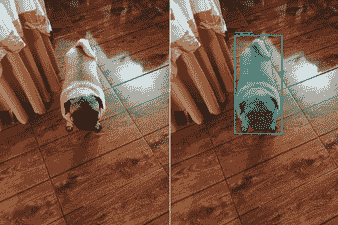

图 8.13– 单实例分割

在这里，我们可以看到网络正确地检测并分割出了狗，准确率为 100%！我们来尝试一个更具挑战性的例子：


图 8.14 – 多实例分割

这张图片比之前的更拥挤，尽管如此，网络仍然正确地识别出了场景中的大部分物体（如汽车、人、卡车等）——即使是被遮挡的物体！然而，模型在某些情况下仍然失败，如下图所示：

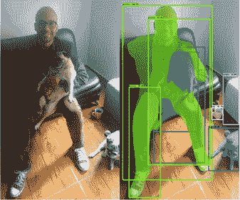

图 8.15 – 带有错误和冗余的分割

这次，网络正确地识别了我和我的狗，还有咖啡杯和沙发，但它却出现了重复和荒谬的检测结果，比如我的腿被识别为一个人。这是因为我抱着我的狗，照片中我的身体部分被分离，导致了不正确或置信度低的分割。

让我们继续下一个部分。

## 它是如何工作的…

在这篇教程中，我们学习了如何使用现有最强大的神经网络之一：**Mask-RCNN**，来检测物体并执行图像分割。训练这样的模型并非易事，更不用说从零开始实现了！幸运的是，得益于**TensorFlow Hub**，我们能够通过仅几行代码使用它的全部预测能力。

我们必须考虑到，这个预训练模型在包含网络已训练过的物体的图像上表现最好。更具体地说，我们传递给`COCO`的图像越多，结果越好。不过，为了实现最佳检测效果，仍然需要一定程度的调整和实验，因为正如我们在前面的例子中看到的，虽然网络非常强大，但并不完美。

## 另见

您可以在这里了解我们使用的模型：[`tfhub.dev/tensorflow/mask_rcnn/inception_resnet_v2_1024x1024/1`](https://tfhub.dev/tensorflow/mask_rcnn/inception_resnet_v2_1024x1024/1)。此外，阅读**Mask-RCNN**的论文也是一个明智的决定：[`arxiv.org/abs/1703.06870`](https://arxiv.org/abs/1703.06870)。
