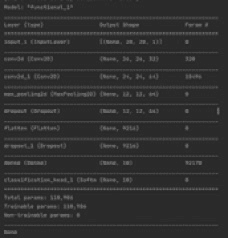
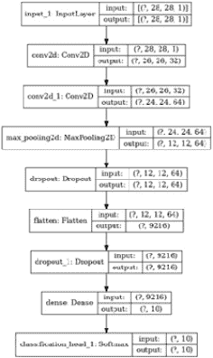
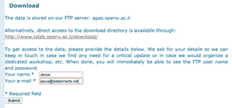
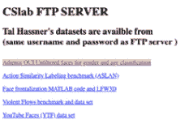
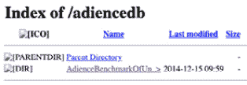
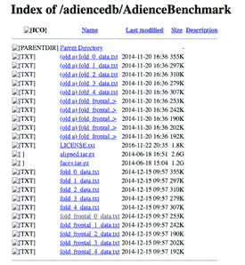

# *第十一章*：使用 AutoML 简化网络实现

计算机视觉，特别是与深度学习结合时，是一个不适合胆小者的领域！在传统的计算机编程中，我们有有限的调试和实验选项，而在机器学习中，情况则不同。

当然，机器学习本身的随机性在使得创建足够好的解决方案变得困难的过程中起着一定作用，但我们需要调整的无数参数、变量、控制和设置同样是挑战所在，只有将它们调整正确，才能释放神经网络在特定问题上的真正力量。

选择合适的架构只是开始，因为我们还需要考虑预处理技术、学习率、优化器、损失函数、数据拆分等众多因素。

我的观点是，深度学习很难！从哪里开始呢？如果我们能有一种方法来减轻在如此多的组合中寻找的负担，那该多好！

嗯，它确实存在！它被称为**自动机器学习**（**AutoML**），在本章中，我们将学习如何利用这一领域最有前景的工具之一，它是建立在 TensorFlow 之上的，叫做**AutoKeras**。

在本章中，我们将涵盖以下配方：

+   使用 AutoKeras 创建一个简单的图像分类器

+   使用 AutoKeras 创建一个简单的图像回归器

+   在 AutoKeras 中导出和导入模型

+   使用 AutoKeras 的 AutoModel 控制架构生成

+   使用 AutoKeras 预测年龄和性别

让我们开始吧！

# 技术要求

你会首先注意到的是，**AutoML**非常消耗资源，因此如果你想复制并扩展我们将在本章中讨论的配方，访问**GPU**是必须的。此外，由于我们将在所有提供的示例中使用**AutoKeras**，请按以下方式安装它：

```
$> pip install git+https://github.com/keras-team/keras-tuner.git@1.0.2rc2 autokeras pydot graphviz
```

本章我们将使用的**AutoKeras**版本仅支持 TensorFlow 2.3，因此请确保已安装该版本（如果愿意，你也可以创建一个全新的环境）。在每个配方的*准备工作*部分，你会找到任何需要的准备信息。和往常一样，本章中的代码可以在[`github.com/PacktPublishing/Tensorflow-2.0-Computer-Vision-Cookbook/tree/master/ch11`](https://github.com/PacktPublishing/Tensorflow-2.0-Computer-Vision-Cookbook/tree/master/ch11)获取。

查看以下链接，观看 Code in Action 视频：

[`bit.ly/2Na6XRz`](https://bit.ly/2Na6XRz)

# 使用 AutoKeras 创建一个简单的图像分类器

图像分类无疑是神经网络在计算机视觉中的事实性应用。然而，正如我们所知道的，根据数据集的复杂性、信息的可用性以及无数其他因素，创建一个合适的图像分类器的过程有时可能相当繁琐。

在这个教程中，我们将借助**AutoML**的魔力轻松实现一个图像分类器。不信吗？那就开始吧，一起看看！

## 如何实现…

在本教程结束时，你将能用不超过十几行代码实现一个图像分类器！让我们开始吧：

1.  导入所有需要的模块：

    ```
    from autokeras import ImageClassifier
    from tensorflow.keras.datasets import fashion_mnist as fm
    ```

    为了简化，我们将使用著名的`Fashion-MNIST`数据集，它是著名的`MNIST`的一个更具挑战性的版本。

1.  加载训练和测试数据：

    ```
    (X_train, y_train), (X_test, y_test) = fm.load_data()
    ```

1.  将图像归一化到[0, 1]的范围：

    ```
    X_train = X_train.astype('float32') / 255.0
    X_test = X_test.astype('float32') / 255.0
    ```

1.  定义我们允许每个可能的网络（称为一次试验）训练的轮次数：

    ```
    EPOCHS = 10
    ```

1.  这就是魔法发生的地方。定义一个`ImageClassifier()`实例：

    ```
    classifier = ImageClassifier(seed=9, max_trials=10)
    ```

    注意，我们将分类器的种子设为 9，并允许它找到一个合适的网络 10 次。我们这样做是为了让**神经架构搜索**（**NAS**）过程在合理的时间内终止（要了解更多关于**NAS**的信息，请参考*参见*部分）。

1.  在测试数据上对分类器进行 10 个轮次的训练（每次试验）：

    ```
    classifier.fit(X_train, y_train, epochs=EPOCHS)
    ```

1.  最后，在测试集上评估最佳分类器并打印准确率：

    ```
    print(classifier.evaluate(X_test, y_test))
    ```

    过一段时间后（别忘了库正在训练 10 个具有不同复杂度的模型），我们应该能得到大约 93%的准确率。考虑到我们甚至没有写 10 行代码，这个结果还不错！

我们将在*工作原理…*部分进一步讨论我们所做的工作。

## 工作原理…

在这个教程中，我们创建了最轻松的图像分类器！我们将所有主要决策都交给了**AutoML**工具——**AutoKeras**。从选择架构到选择使用哪种优化器，所有这些决策都由框架做出。

你可能已经注意到，我们通过指定最多 10 次试验和每次试验最多 10 个轮次来限制搜索空间。我们这样做是为了让程序在合理的时间内终止，但正如你可能猜到的，这些参数也可以交给**AutoKeras**来处理。

尽管**AutoML**具有很高的自主性，我们仍然可以根据需要指导框架。正如其名所示，**AutoML**提供了一种自动化寻找针对特定问题足够好组合的方法。然而，这并不意味着不需要人类的专业知识和先前的经验。事实上，通常情况下，一个经过精心设计的网络（通常是通过深入研究数据所得）往往比**AutoML**在没有任何先前信息的情况下找到的网络效果更好。

最终，**AutoML**是一个工具，应该用来增强我们对深度学习的掌握，而不是取而代之——因为它做不到这一点。

## 参见

你可以在这里了解更多关于**NAS**的信息：[`en.wikipedia.org/wiki/Neural_architecture_search`](https://en.wikipedia.org/wiki/Neural_architecture_search)。

# 使用 AutoKeras 创建一个简单的图像回归器

**AutoKeras**的强大功能不仅限于图像分类。尽管不如图像分类流行，图像回归是一个类似的问题，我们希望根据图像中的空间信息预测一个连续的量。

在本配方中，我们将训练一个图像回归器，预测人们的年龄，同时使用**AutoML**。

让我们开始吧。

## 准备工作

在本配方中，我们将使用`APPA-REAL`数据集，该数据集包含 7,591 张图像，标注了广泛对象的真实年龄和表观年龄。您可以在[`chalearnlap.cvc.uab.es/dataset/26/description/#`](http://chalearnlap.cvc.uab.es/dataset/26/description/#)查看更多有关该数据集的信息并下载它。将数据解压到您选择的目录中。为了配方的目的，我们假设数据集位于`~/.keras/datasets/appa-real-release`文件夹中。

以下是一些示例图像：


](img/B14768_11_001.jpg)

图 11.1 – 来自 APPA-REAL 数据集的示例图像

让我们实现这个配方！

## 如何操作……

按照以下步骤完成此配方：

1.  导入我们将要使用的模块：

    ```
    import csv
    import pathlib
    import numpy as np
    from autokeras import ImageRegressor
    from tensorflow.keras.preprocessing.image import *
    ```

1.  数据集的每个子集（训练集、测试集和验证集）都在一个 CSV 文件中定义。在这个文件中，除了许多其他列外，我们还有图像路径和照片中人物的实际年龄。在此步骤中，我们将定义`load_mapping()`函数，该函数将从图像路径创建一个映射，用于加载实际数据到内存中：

    ```
    def load_mapping(csv_path, faces_path):
        mapping = {}
        with open(csv_path, 'r') as f:
            reader = csv.DictReader(f)
            for line in reader:
                file_name = line["file_name"].rsplit(".")[0]
               key = f'{faces_path}/{file_name}.jpg_face.jpg'
                mapping[key] = int(line['real_age'])
        return mapping
    ```

1.  定义`get_image_and_labels()`函数，该函数接收`load_mapping()`函数生成的映射，并返回一个图像数组（归一化到[-1, 1]范围内）和一个相应年龄的数组：

    ```
    def get_images_and_labels(mapping):
        images = []
        labels = []
        for image_path, label in mapping.items():
            try:
                image = load_img(image_path, target_size=(64, 
                                                        64))
                image = img_to_array(image)
                images.append(image)
                labels.append(label)
            except FileNotFoundError:
                continue
        return (np.array(images) - 127.5) / 127.5, \
               np.array(labels).astype('float32')
    ```

    请注意，每张图像都已调整大小，确保其尺寸为 64x64x3。这是必要的，因为数据集中的图像尺寸不统一。

1.  定义 CSV 文件的路径，以创建每个子集的数据映射：

    ```
    base_path = (pathlib.Path.home() / '.keras' / 'datasets' 
                 /'appa-real-release')
    train_csv_path = str(base_path / 'gt_train.csv')
    test_csv_path = str(base_path / 'gt_test.csv')
    val_csv_path = str(base_path / 'gt_valid.csv')
    ```

1.  定义每个子集的图像所在目录的路径：

    ```
    train_faces_path = str(base_path / 'train')
    test_faces_path = str(base_path / 'test')
    val_faces_path = str(base_path / 'valid')
    ```

1.  为每个子集创建映射：

    ```
    train_mapping = load_mapping(train_csv_path, 
                                train_faces_path)
    test_mapping = load_mapping(test_csv_path, 
                               test_faces_path)
    val_mapping = load_mapping(val_csv_path, 
                               val_faces_path)
    ```

1.  获取每个子集的图像和标签：

    ```
    X_train, y_train = get_images_and_labels(train_mapping)
    X_test, y_test = get_images_and_labels(test_mapping)
    X_val, y_val = get_images_and_labels(val_mapping)
    ```

1.  我们将在每次试验中训练每个网络，最多训练 15 个 epoch：

    ```
    EPOCHS = 15
    ```

1.  我们实例化一个`ImageRegressor()`对象，它封装了`adam`优化器：

    ```
    regressor = ImageRegressor(seed=9,
                               max_trials=10,
                               optimizer='adam')
    ```

1.  拟合回归器。请注意，我们传递了自己的验证集。如果我们不这样做，**AutoKeras**默认会取 20%的训练数据来验证它的实验：

    ```
    regressor.fit(X_train, y_train,
                  epochs=EPOCHS,
                  validation_data=(X_val, y_val))
    ```

1.  最后，我们必须在测试数据上评估最佳回归器并打印其性能指标：

    ```
    print(regressor.evaluate(X_test, y_test))
    ```

    一段时间后，我们应该获得 241.248 的测试损失，考虑到我们的工作主要是加载数据集，这个结果还不错。

让我们进入*它是如何工作的……*部分。

## 它是如何工作的……

在这个食谱中，我们将模型的创建委托给了**AutoML**框架，类似于我们在*使用 AutoKeras 创建简单图像分类器*食谱中的做法。不过，这次，我们的目标是解决回归问题，即根据人脸照片预测一个人的年龄，而不是分类问题。

这一次，因为我们使用了一个真实世界的数据集，我们不得不实现几个辅助函数来加载数据，并将其转化为**AutoKeras**可以使用的正确形状。不过，在做完这些之后，我们让框架接管，利用它内建的**NAS**算法，在 15 次迭代中找到最佳模型。

我们在测试集上获得了一个相当不错的 241.248 的损失值。预测一个人的年龄并不是一件简单的任务，尽管乍一看它似乎很简单。我邀请你仔细查看*APPA-REAL*的 CSV 文件，这样你就能看到人类对年龄估算的偏差！

## 另见

你可以在这里了解更多关于**NAS**的信息：[`en.wikipedia.org/wiki/Neural_architecture_search`](https://en.wikipedia.org/wiki/Neural_architecture_search)。

# 在 AutoKeras 中导出和导入模型

在使用**AutoML**时，我们可能会担心其黑盒性质。我们能控制生成的模型吗？我们可以扩展它们吗？理解它们吗？重新使用它们吗？

当然可以！**AutoKeras**的一个优点是它构建在 TensorFlow 之上，因此尽管它非常复杂，但在底层，训练的模型只是 TensorFlow 图，我们可以在以后导出、调整和优化这些模型（如果需要的话）。

在这个食谱中，我们将学习如何导出一个在**AutoKeras**上训练的模型，然后将其作为一个普通的 TensorFlow 网络导入。

你准备好了吗？让我们开始吧。

## 如何做到…

按照以下步骤完成本食谱：

1.  导入必要的依赖项：

    ```
    from autokeras import *
    from tensorflow.keras.datasets import fashion_mnist as fm
    from tensorflow.keras.models import load_model
    from tensorflow.keras.utils import plot_model
    ```

1.  加载`Fashion-MNIST`数据集的训练和测试集：

    ```
    (X_train, y_train), (X_test, y_test) = fm.load_data()
    ```

1.  将数据归一化到[0, 1]区间：

    ```
    X_train = X_train.astype('float32') / 255.0
    X_test = X_test.astype('float32') / 255.0
    ```

1.  定义我们将为每个网络训练的周期数：

    ```
    EPOCHS = 10
    ```

1.  创建一个`ImageClassifier()`，它将尝试在 20 次试验中找到最佳分类器，每次训练 10 个周期。我们将指定`adam`作为优化器，并为可重复性设置`ImageClassifier()`的种子：

    ```
    classifier = ImageClassifier(seed=9,
                                 max_trials=20,
                                 optimizer='adam')
    ```

1.  训练分类器。我们将允许**AutoKeras**自动选择 20%的训练数据作为验证集：

    ```
    classifier.fit(X_train, y_train, epochs=EPOCHS)
    ```

1.  导出最佳模型并将其保存到磁盘：

    ```
    model = classifier.export_model()
    model.save('model.h5')
    ```

1.  将模型重新加载到内存中：

    ```
    model = load_model('model.h5',
                       custom_objects=CUSTOM_OBJECTS)
    ```

1.  在测试集上评估训练模型：

    ```
    print(classifier.evaluate(X_test, y_test))
    ```

1.  打印最佳模型的文本摘要：

    ```
    print(model.summary())
    ```

1.  最后，生成**AutoKeras**找到的最佳模型的架构图：

    ```
    plot_model(model,
               show_shapes=True,
               show_layer_names=True,
               to_file='model.png')
    ```

    在 20 次试验之后，**AutoKeras**创建的最佳模型在测试集上的准确率达到了 91.5%。以下截图展示了模型的摘要：



图 11.2 – **AutoKeras**最佳模型摘要

以下图表展示了模型的架构：



图 11.3 – AutoKeras 的最佳模型架构

在*图 11.2*中，我们可以看到**AutoKeras**被认为是最适合**Fashion-MNIST**的网络，至少在我们设定的范围内是这样。你可以在配套的 GitHub 仓库中更详细地查看完整架构。

让我们继续到下一节。

## 它是如何工作的……

在这个配方中，我们展示了**AutoML**如何作为我们解决新计算机视觉问题时的一个很好的起点。如何做？我们可以利用它快速生成表现良好的模型，然后基于我们对当前数据集的领域知识进行扩展。

实现这一点的公式很简单：让**AutoML**做一段时间的繁重工作，然后导出最佳网络并将其导入 TensorFlow 的框架中，这样你就可以在其上构建你的解决方案。

这不仅展示了像**AutoKeras**这样的工具的可用性，还让我们得以窥见幕后，理解由**NAS**生成的模型的构建块。

## 另见

**AutoKeras**的基础是**NAS**。你可以在这里阅读更多相关内容（非常有趣！）：[`en.wikipedia.org/wiki/Neural_architecture_search`](https://en.wikipedia.org/wiki/Neural_architecture_search)。

# 使用 AutoKeras 的 AutoModel 控制架构生成

让**AutoKeras**自动决定哪个架构最适合是很好的，但这可能会非常耗时——有时是不可接受的。

我们能否施加更多控制？我们能否提示哪些选项最适合我们的特定问题？我们能否通过提供一组必须遵循的指导方针，使**AutoML**在我们事先的知识或偏好基础上进行实验，同时又给它足够的自由度进行试探？

是的，我们可以，在这个配方中，你将通过利用**AutoKeras**中的一个特别功能——AutoModel 来学习如何操作！

## 如何操作……

按照这些步骤学习如何自定义`AutoModel`的搜索空间：

1.  我们需要做的第一件事是导入所有必需的依赖项：

    ```
    from autokeras import *
    from tensorflow.keras.datasets import fashion_mnist as fm
    from tensorflow.keras.models import load_model
    from tensorflow.keras.utils import *
    ```

1.  因为我们将在`Fashion-MNIST`上训练我们的自定义模型，所以我们必须分别加载训练和测试拆分数据：

    ```
    (X_train, y_train), (X_test, y_test) = fm.load_data()
    ```

1.  为了避免数值不稳定问题，让我们将两个拆分的图像归一化到[0, 1]范围内：

    ```
    X_train = X_train.astype('float32')
    X_test = X_test.astype('float32')
    ```

1.  定义`create_automodel()`函数，该函数定义了底层`Block`的自定义搜索空间，负责定义的任务，如图像增强、归一化、图像处理或分类。首先，我们必须定义输入块，它将通过`Normalization()`和`ImageAugmentation()`块分别进行归一化和增强：

    ```
    def create_automodel(max_trials=10):
        input = ImageInput()
        x = Normalization()(input)
        x = ImageAugmentation(horizontal_flip=False,
                              vertical_flip=False)(x)
    ```

    注意，我们在`ImageAugmentation()`块中禁用了水平和垂直翻转。这是因为这些操作会改变`Fashion-MNIST`中图像的类别。

1.  现在，我们将图表分叉。左侧分支使用`ConvBlock()`搜索普通卷积层。右侧分支，我们将探索更复杂的类似 Xception 的架构（有关**Xception**架构的更多信息，请参阅*另见*部分）：

    ```
        left = ConvBlock()(x)
        right = XceptionBlock(pretrained=True)(x)
    ```

    在前面的代码片段中，我们指示**AutoKeras**只探索在 ImageNet 上预训练的**Xception**架构。

1.  我们将合并左右两个分支，展开它们，然后通过`DenseBlock()`传递结果，正如它的名字所示，它会搜索完全连接的层组合：

    ```
        x = Merge()([left, right])
        x = SpatialReduction(reduction_type='flatten')(x)
        x = DenseBlock()(x)
    ```

1.  这个图表的输出将是一个`ClassificationHead()`。这是因为我们处理的是一个分类问题。请注意，我们没有指定类别的数量。这是因为**AutoKeras**会从数据中推断出这些信息：

    ```
        output = ClassificationHead()(x)
    ```

1.  我们可以通过构建并返回一个`AutoModel()`实例来结束`create_automodel()`。我们必须指定输入和输出，以及要执行的最大尝试次数：

    ```
        return AutoModel(inputs=input,
                         outputs=output,
                         overwrite=True,
                         max_trials=max_trials)
    ```

1.  让我们训练每个试验模型 10 个周期：

    ```
    EPOCHS = 10
    ```

1.  创建`AutoModel`并进行拟合：

    ```
    model = create_automodel()
    model.fit(X_train, y_train, epochs=EPOCHS)
    ```

1.  让我们导出最佳模型：

    ```
    model = model.export_model()
    ```

1.  在测试集上评估模型：

    ```
    print(model.evaluate(X_test, to_categorical(y_test)))
    ```

1.  绘制最佳模型的架构：

    ```
    plot_model(model,
               show_shapes=True,
               show_layer_names=True,
               to_file='automodel.png')
    ```

    我最终得到的架构在测试集上的准确率达到了 90%，尽管你的结果可能有所不同。更有趣的是生成的模型的结构：


图 11.4 – AutoKeras 的最佳模型架构

上面的图表揭示了`AutoModel`根据我们在`create_automodel()`中设计的蓝图生成了一个网络。

现在，让我们进入*它是如何工作的……*部分。

## 它是如何工作的……

在这个示例中，我们利用了`AutoModel`模块来缩小搜索空间。当我们大致知道最终模型应该是什么样时，这个特性非常有用。因为我们不会让**AutoKeras**浪费时间尝试无效、无用的组合，所以可以节省大量时间。一个这样的无效组合的例子可以在*第 4 步*中看到，我们告诉**AutoKeras**不要将图像翻转作为图像增强的一部分。因为根据我们问题的特点，这个操作会改变**Fashion-MNIST**中数字的类别。

证明我们引导了`create_automodel()`函数。

很令人印象深刻，对吧？

## 另见

这里我们没有做的一件事是实现我们自己的`Block`，这在**AutoKeras**中是可能的。为什么不尝试一下呢？你可以从阅读这里的文档开始：[`autokeras.com/tutorial/customized/`](https://autokeras.com/tutorial/customized/)。要查看所有可用的模块，可以访问[`autokeras.com/block/`](https://autokeras.com/block/)。在这个示例中，我们使用了类似 Xception 的层。要了解更多关于 Xception 的信息，可以阅读原始论文：[`arxiv.org/abs/1610.02357`](https://arxiv.org/abs/1610.02357)。

# 使用 AutoKeras 预测年龄和性别

在这个方案中，我们将学习 AutoML 的一个实际应用，可以作为模板来创建原型、MVP，或者仅仅借助 AutoML 来解决现实世界中的问题。

更具体地说，我们将创建一个年龄和性别分类程序，其中有一个特别的地方：性别和年龄分类器的架构将由**AutoKeras**负责。我们将负责获取和整理数据，并创建框架来在我们自己的图像上测试解决方案。

希望你准备好了，因为我们马上开始！

## 准备好了吗

我们需要几个外部库，比如 OpenCV、`scikit-learn` 和 `imutils`。所有这些依赖项可以一次性安装，方法如下：

```
$> pip install opencv-contrib-python scikit-learn imutils
```

在数据方面，我们将使用**Adience**数据集，其中包含 26,580 张 2,284 个主体的图像，并附有其性别和年龄。要下载数据，请访问 [`talhassner.github.io/home/projects/Adience/Adience-data.html`](https://talhassner.github.io/home/projects/Adience/Adience-data.html)。

接下来，你需要进入**下载**部分并输入你的姓名和电子邮件，如下图所示：



图 11.5 – 输入你的信息以接收存储数据的 FTP 服务器凭证

一旦你点击**提交**按钮，你将获得访问 FTP 服务器所需的凭证，该服务器存储着数据。你可以在这里访问：[`www.cslab.openu.ac.il/download/`](http://www.cslab.openu.ac.il/download/)。

确保点击第一个链接，标签为**Adience OUI 未滤镜的人脸用于性别和年龄分类**：



图 11.6 – 进入高亮链接

输入你之前收到的凭证并访问第二个链接，名称为**AdienceBenchmarkOfUnfilteredFacesForGenderAndAgeClassification**：



图 11.7 – 点击高亮链接

最后，下载 `aligned.tar.gz`、`fold_frontal_0_data.txt`、`fold_frontal_1_data.txt`、`fold_frontal_2_data.txt`、`fold_frontal_3_data.txt` 和 `fold_frontal_4_data.txt`：



图 11.8 – 下载 aligned.tar.gz 和所有 fold_frontal_*_data.txt 文件

解压 `aligned.tar.gz` 到你选择的目录中，命名为 `adience`。在该目录内，创建一个名为 `folds` 的子目录，并将所有 `fold_frontal_*_data.txt` 文件移动到其中。为了本方案的方便，我们假设数据集位于 `~/.keras/datasets/adience`。

下面是一些示例图像：


图 11.9 – 来自 Adience 数据集的示例图像

让我们实现这个方案吧！

## 如何操作…

完成以下步骤以实现一个年龄和性别分类器，使用**AutoML**：

1.  我们需要做的第一件事是导入所有必要的依赖：

    ```
    import csv
    import os
    import pathlib
    from glob import glob
    import cv2
    import imutils
    import numpy as np
    from autokeras import *
    from sklearn.preprocessing import LabelEncoder
    from tensorflow.keras.models import load_model
    from tensorflow.keras.preprocessing.image import *
    ```

1.  定义`Adience`数据集的基本路径，以及包含图像与其受试者年龄和性别关系的折叠（CSV 格式）：

    ```
    base_path = (pathlib.Path.home() / '.keras' / 'datasets' 
                     /'adience')
    folds_path = str(base_path / 'folds')
    ```

1.  `Adience`中的年龄以区间、组别或括号的形式表示。在这里，我们将定义一个数组，用于将折叠中的报告年龄映射到正确的区间：

    ```
    AGE_BINS = [(0, 2), (4, 6), (8, 13), (15, 20), (25, 32), 
                (38, 43), (48, 53), (60, 99)]
    ```

1.  定义`age_to_bin()`函数，该函数接收一个输入（如折叠 CSV 行中的值），并将其映射到相应的区间。例如，如果输入是`(27, 29)`，输出将是`25_32`：

    ```
    def age_to_bin(age):
        age = age.replace('(', '').replace(')', '').
                                        split(',')
        lower, upper = [int(x.strip()) for x in age]
        for bin_low, bin_up in AGE_BINS:
            if lower >= bin_low and upper <= bin_up:
                label = f'{bin_low}_{bin_up}'
                return label
    ```

1.  定义一个函数来计算矩形的面积。我们稍后将用它来获取最大的面部检测区域：

    ```
    def rectangle_area(r):
        return (r[2] - r[0]) * (r[3] - r[1])
    ```

1.  我们还将绘制一个边框框住检测到的人脸，并附上识别出的年龄和性别：

    ```
    def plot_face(image, age_gender, detection):
        frame_x, frame_y, frame_width, frame_height = detection
        cv2.rectangle(image,
                      (frame_x, frame_y),
                      (frame_x + frame_width,
                       frame_y + frame_height),
                      color=(0, 255, 0),
                      thickness=2)
        cv2.putText(image,
                    age_gender,
                    (frame_x, frame_y - 10),
                    fontFace=cv2.FONT_HERSHEY_SIMPLEX,
                    fontScale=0.45,
                    color=(0, 255, 0),
                    thickness=2)
        return image
    ```

1.  定义`predict()`函数，我们将用它来预测传入`roi`参数的人的年龄和性别（取决于`model`）：

    ```
    def predict(model, roi):
        roi = cv2.resize(roi, (64, 64))
        roi = roi.astype('float32') / 255.0
        roi = img_to_array(roi)
        roi = np.expand_dims(roi, axis=0)
        predictions = model.predict(roi)[0]
        return predictions
    ```

1.  定义存储数据集中所有图像、年龄和性别的列表：

    ```
    images = []
    ages = []
    genders = []
    ```

1.  遍历每个折叠文件。这些文件将是 CSV 格式：

    ```
    folds_pattern = os.path.sep.join([folds_path, '*.txt'])
    for fold_path in glob(folds_pattern):
        with open(fold_path, 'r') as f:
            reader = csv.DictReader(f, delimiter='\t')
    ```

1.  如果年龄或性别字段不明确，跳过当前行：

    ```
            for line in reader:
                if ((line['age'][0] != '(') or
                        (line['gender'] not in {'m', 'f'})):
                    Continue
    ```

1.  将年龄映射到一个有效的区间。如果从`age_to_bin()`返回`None`，这意味着年龄不对应我们定义的任何类别，因此必须跳过此记录：

    ```
                age_label = age_to_bin(line['age'])
                if age_label is None:
                    continue
    ```

1.  加载图像：

    ```
                aligned_face_file = 
                               (f'landmark_aligned_face.'
                                     f'{line["face_id"]}.'
                              f'{line["original_image"]}')
                image_path = os.path.sep.join(
                                 [str(base_path),
                                 line["user_id"],
                               aligned_face_file])
                image = load_img(image_path, 
                                 target_size=(64, 64))
                image = img_to_array(image)
    ```

1.  将图像、年龄和性别添加到相应的集合中：

    ```
                images.append(image)
                ages.append(age_label)
                genders.append(line['gender'])
    ```

1.  为每个问题（年龄分类和性别预测）创建两份图像副本：

    ```
    age_images = np.array(images).astype('float32') / 255.0
    gender_images = np.copy(images)
    ```

1.  编码年龄和性别：

    ```
    gender_enc = LabelEncoder()
    age_enc = LabelEncoder()
    gender_labels = gender_enc.fit_transform(genders)
    age_labels = age_enc.fit_transform(ages)
    ```

1.  定义每次试验的次数和每次试验的周期。这些参数会影响两个模型：

    ```
    EPOCHS = 100
    MAX_TRIALS = 10
    ```

1.  如果有训练好的年龄分类器，加载它；否则，从头开始训练一个`ImageClassifier()`并保存到磁盘：

    ```
    if os.path.exists('age_model.h5'):
        age_model = load_model('age_model.h5')
    else:
        age_clf = ImageClassifier(seed=9,
                                  max_trials=MAX_TRIALS,
                                  project_name='age_clf',
                                  overwrite=True)
        age_clf.fit(age_images, age_labels, epochs=EPOCHS)
        age_model = age_clf.export_model()
        age_model.save('age_model.h5')
    ```

1.  如果有训练好的性别分类器，加载它；否则，从头开始训练一个`ImageClassifier()`并保存到磁盘：

    ```
    if os.path.exists('gender_model.h5'):
        gender_model = load_model('gender_model.h5')
    else:
        gender_clf = ImageClassifier(seed=9,

                                   max_trials=MAX_TRIALS,
                                project_name='gender_clf',
                                     overwrite=True)
        gender_clf.fit(gender_images, gender_labels,
                       epochs=EPOCHS)
        gender_model = gender_clf.export_model()
        gender_model.save('gender_model.h5')
    ```

1.  从磁盘读取测试图像：

    ```
    image = cv2.imread('woman.jpg')
    ```

1.  创建一个**Haar Cascades**人脸检测器。（这是本书范围之外的主题。如果你想了解更多关于 Haar Cascades 的内容，请参阅本配方的*另见*部分。）使用以下代码来完成：

    ```
    cascade_file = 'resources/haarcascade_frontalface_default.xml'
    det = cv2.CascadeClassifier(cascade_file)
    ```

1.  调整图像大小，使其宽度为 380 像素。得益于`imutils.resize()`函数，我们可以放心结果会保持纵横比。因为该函数会自动计算高度以确保这一条件：

    ```
    image = imutils.resize(image, width=380)
    ```

1.  创建原始图像的副本，以便我们可以在其上绘制检测结果：

    ```
    copy = image.copy()
    ```

1.  将图像转换为灰度，并通过人脸检测器：

    ```
    gray = cv2.cvtColor(image, cv2.COLOR_BGR2GRAY)
    detections = \
        det.detectMultiScale(gray,
                             scaleFactor=1.1,
                             minNeighbors=5,
                             minSize=(35, 35),
                          flags=cv2.CASCADE_SCALE_IMAGE)
    ```

1.  验证是否有检测到的对象，并获取具有最大面积的一个：

    ```
    if len(detections) > 0:
        detections = sorted(detections, key=rectangle_area)
        best_detection = detections[-1]
    ```

1.  提取与检测到的人脸相对应的兴趣区域（`roi`），并提取其年龄和性别：

    ```
        (frame_x, frame_y,
         frame_width, frame_height) = best_detection
        roi = image[frame_y:frame_y + frame_height,
                    frame_x:frame_x + frame_width]
        age_pred = predict(age_model, roi).argmax()
        age = age_enc.inverse_transform([age_pred])[0]
        gender_pred = predict(gender_model, roi).argmax()
        gender = gender_enc.inverse_transform([gender_pred])[0]
    ```

    注意，我们使用每个编码器来还原为人类可读的标签，用于预测的年龄和性别。

1.  将预测的年龄和性别标注在原始图像上，并显示结果：

    ```
        clone = plot_face(copy,
                          f'Gender: {gender} - Age: 
                           {age}',
                          best_detection)
        cv2.imshow('Result', copy)
        cv2.waitKey(0)
    ```

    重要提示

    第一次执行此脚本时，您需要等待很长时间——可能超过 24 小时（取决于您的硬件）。这是因为每个模型都经过大量的试验和轮次训练。然而，之后的运行会更快，因为程序将加载已经训练好的分类器。

    我们可以在以下截图中看到一个成功预测年龄和性别的例子：


图 11.10 – 我们的模型判定照片中的人是女性，年龄在 25 至 32 岁之间。看起来差不多吧？

难道不是真正令人惊叹吗？所有的繁重工作都是由**AutoKeras**完成的！我们正在生活在未来！

## 它是如何工作的……

在这个示例中，我们实现了一个实际的解决方案，来应对一个令人意外的挑战性问题：年龄和性别预测。

为什么这很具挑战性？一个人的表面年龄可能会有所不同，取决于多种因素，如种族、性别、健康状况和其他生活条件。我们人类在仅凭外貌特征来估算一个人（男性或女性）的年龄时，并没有我们想象中的那么准确。

例如，一个大致健康的 25 岁的人与另一个 25 岁的重度饮酒和吸烟者看起来会有很大的不同。

无论如何，我们相信**AutoML**的力量，找到了两个模型：一个用于性别分类，另一个用于年龄预测。我们必须强调，在这种情况下，我们将年龄预测视为分类问题，而不是回归问题。这是因为这样更容易选择一个年龄范围，而不是给出一个精确的数值。

经过长时间的等待（我们对每个模型进行了超过 100 轮的训练），我们得到了两个合格的网络，并将它们整合到一个框架中，该框架可以自动识别照片中的人脸，并使用这些模型标注出预测的年龄和性别。

如您所见，我们依赖于`ImageClassifier()`，这意味着我们将网络创建过程的 100%控制权交给了`AutoModel`，以缩小搜索空间，从而在更短的时间内获得潜在的更好解决方案。为什么不试试看呢？

## 另见

阅读以下论文，了解**Adience**数据集的作者如何解决这个问题：[`talhassner.github.io/home/projects/cnn_agegender/CVPR2015_CNN_AgeGenderEstimation.pdf`](https://talhassner.github.io/home/projects/cnn_agegender/CVPR2015_CNN_AgeGenderEstimation.pdf)。要了解更多关于我们之前使用的 Haar Cascade 分类器的信息，请阅读这个教程：[`docs.opencv.org/3.4/db/d28/tutorial_cascade_classifier.html`](https://docs.opencv.org/3.4/db/d28/tutorial_cascade_classifier.html)。
